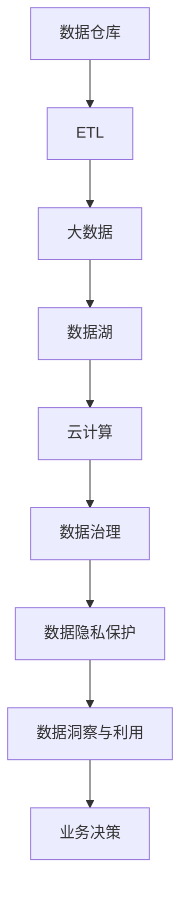
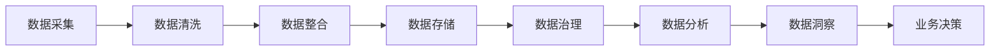
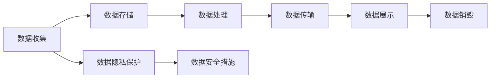
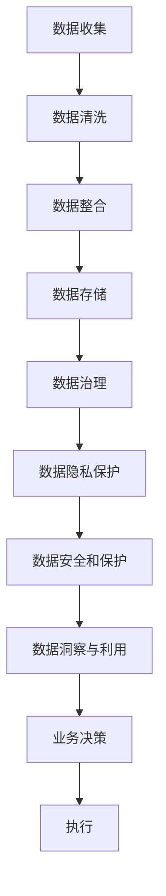

                 

# 人工智能创业数据管理的重要角色

> 关键词：人工智能,创业,数据管理,大数据,机器学习,数据科学,云计算,数据仓库,数据处理,数据安全,数据隐私

## 1. 背景介绍

### 1.1 问题由来
在当今的数字化时代，数据已成为推动人工智能（AI）技术发展的关键资源。无论是图像识别、自然语言处理还是预测分析，人工智能的进步都离不开大规模数据的支持。对于人工智能创业公司而言，有效地管理数据，确保数据的质量、安全性和可用性，是成功的关键因素之一。然而，在实际操作中，数据管理往往面临诸多挑战，如数据存储、数据整合、数据安全和隐私保护等问题。

### 1.2 问题核心关键点
数据管理在人工智能创业公司中扮演着至关重要的角色，主要体现在以下几个方面：

- **数据质量和可用性**：数据的质量直接影响到模型的训练效果和应用性能。高质量的数据应包含丰富、准确、一致的信息，避免噪声和缺失值。

- **数据安全与隐私**：在数据采集和存储过程中，必须确保数据的安全性，防止数据泄露和滥用。同时，遵循隐私保护法规，保护用户的个人隐私。

- **数据存储与处理**：在面对海量数据时，如何高效地存储和处理数据是一个复杂的问题。需要选择合适的数据存储方案，如分布式数据库、数据湖等，以及高效的数据处理工具。

- **数据整合与共享**：数据来自于多个来源，如何有效地整合、清洗和共享数据，是数据管理的关键环节。良好的数据整合机制能够提升数据的利用率和可用性。

- **数据洞察与利用**：通过数据挖掘和分析，从数据中提取有价值的洞察，指导业务决策和模型优化。

## 2. 核心概念与联系

### 2.1 核心概念概述

为更好地理解数据管理在人工智能创业公司中的重要性，本节将介绍几个密切相关的核心概念：

- **数据仓库（Data Warehouse）**：是一个面向企业决策支持的数据存储与管理平台，通常用于集中存储来自不同业务系统的结构化数据。数据仓库通过ETL（Extract, Transform, Load）过程，将业务数据转换为适合分析的格式，便于后续的查询和分析。

- **大数据（Big Data）**：指数量巨大、类型多样、速度实时且价值密度低的数据集合，需要采用分布式计算、流处理等技术进行存储、处理和分析。

- **数据湖（Data Lake）**：是一个以“原始格式”存储原始数据的平台，支持多种数据类型和格式，便于后续的数据挖掘和分析。

- **云计算（Cloud Computing）**：通过互联网提供按需的计算资源和服务，包括存储、计算、网络等，便于快速构建数据处理和分析环境。

- **数据治理（Data Governance）**：指对数据的规划、创建、维护、提升和退役等全生命周期过程进行管理和监控，确保数据质量、安全性和一致性。

- **数据隐私保护（Data Privacy Protection）**：在数据处理和使用过程中，遵循隐私保护法规，如GDPR（通用数据保护条例），确保用户数据的安全和隐私不被侵犯。

这些核心概念之间的逻辑关系可以通过以下Mermaid流程图来展示：



这个流程图展示了大数据环境下数据管理的核心概念及其之间的关系：

1. 数据仓库通过ETL过程，将大数据存储和管理起来。
2. 数据湖以“原始格式”存储数据，便于后续处理。
3. 云计算提供计算资源和服务，支持数据的存储和处理。
4. 数据治理确保数据质量、安全性和一致性。
5. 数据隐私保护遵循隐私保护法规，保护用户数据安全。
6. 数据洞察和利用指导业务决策和模型优化。

### 2.2 概念间的关系

这些核心概念之间存在着紧密的联系，形成了数据管理在人工智能创业公司中的完整生态系统。下面我们通过几个Mermaid流程图来展示这些概念之间的关系。

#### 2.2.1 数据管理的一般流程



这个流程图展示了数据管理的全流程：

1. 数据采集：从不同渠道和系统中收集原始数据。
2. 数据清洗：对数据进行去重、去噪、缺失值处理等清洗操作，确保数据质量。
3. 数据整合：对清洗后的数据进行整合，建立统一的数据视图。
4. 数据存储：将整合后的数据存储在合适的平台上，如数据仓库、数据湖等。
5. 数据治理：对数据进行规划、创建、维护、提升和退役等全生命周期过程管理，确保数据质量和安全。
6. 数据分析：通过数据挖掘和分析，提取有价值的洞察。
7. 数据洞察：利用数据分析结果指导业务决策。

#### 2.2.2 数据安全和隐私保护的关系



这个流程图展示了数据安全和隐私保护在数据管理中的重要地位：

1. 数据收集：在数据采集和存储过程中，必须采取措施保护数据隐私。
2. 数据存储：确保存储过程中的数据安全，防止数据泄露。
3. 数据处理：在数据处理过程中，遵循隐私保护法规，避免数据滥用。
4. 数据传输：在数据传输过程中，采用加密等安全措施，保护数据安全。
5. 数据展示：在数据展示时，确保数据的匿名性和隐私性。
6. 数据销毁：在数据不再使用时，确保数据的安全销毁。

### 2.3 核心概念的整体架构

最后，我们用一个综合的流程图来展示这些核心概念在大数据管理中的整体架构：



这个综合流程图展示了从数据收集到业务决策的完整流程：

1. 数据收集：从不同渠道和系统中收集原始数据。
2. 数据清洗：对数据进行去重、去噪、缺失值处理等清洗操作。
3. 数据整合：对清洗后的数据进行整合，建立统一的数据视图。
4. 数据存储：将整合后的数据存储在合适的平台上，如数据仓库、数据湖等。
5. 数据治理：对数据进行规划、创建、维护、提升和退役等全生命周期过程管理，确保数据质量和安全。
6. 数据隐私保护：遵循隐私保护法规，保护用户数据安全。
7. 数据安全和保护：确保数据在存储、传输和处理过程中的安全性。
8. 数据洞察与利用：通过数据挖掘和分析，提取有价值的洞察。
9. 业务决策：利用数据分析结果指导业务决策。

## 3. 核心算法原理 & 具体操作步骤

### 3.1 算法原理概述

在人工智能创业公司中，数据管理涉及多个环节，每个环节都需采用合适的算法和技术进行处理。下面以数据治理和数据洞察为例，详细阐述其算法原理。

### 3.2 算法步骤详解

#### 3.2.1 数据治理算法

数据治理主要涉及数据的规划、创建、维护、提升和退役等全生命周期过程管理，其步骤包括：

1. **数据规划**：明确数据管理的战略和目标，制定数据管理策略。
2. **数据创建**：设计数据模型和架构，选择合适的数据存储方案。
3. **数据维护**：对数据进行持续的监控、更新和维护，确保数据质量和安全。
4. **数据提升**：通过数据分析和优化，提升数据质量和可用性。
5. **数据退役**：对不再使用的数据进行安全销毁，防止数据滥用。

具体实现时，可以采用以下算法和技术：

- **数据质量评估算法**：通过统计分析、数据挖掘等技术，评估数据的质量和一致性。
- **数据清洗算法**：对数据进行去重、去噪、缺失值处理等清洗操作。
- **数据同步算法**：通过ETL工具，将数据从不同系统同步到一个统一的数据平台。
- **数据审计算法**：对数据管理过程进行监控和审计，确保数据治理策略的执行。
- **数据权限管理算法**：根据用户角色和权限，控制对数据的访问和使用。

#### 3.2.2 数据洞察算法

数据洞察主要通过数据挖掘和分析，提取有价值的洞察，指导业务决策。其步骤包括：

1. **数据采集**：从不同渠道和系统中收集原始数据。
2. **数据清洗**：对数据进行去重、去噪、缺失值处理等清洗操作。
3. **数据整合**：对清洗后的数据进行整合，建立统一的数据视图。
4. **数据建模**：设计数据模型和算法，进行数据挖掘和分析。
5. **数据分析**：通过统计分析、机器学习等技术，提取有价值的洞察。
6. **数据可视化**：将分析结果通过图表、仪表盘等形式展示，便于业务决策。

具体实现时，可以采用以下算法和技术：

- **数据挖掘算法**：如聚类分析、分类算法、关联规则等，从数据中提取有价值的模式和规律。
- **机器学习算法**：如回归分析、决策树、神经网络等，对数据进行预测和分类。
- **数据可视化算法**：如可视化工具、报表工具等，将分析结果以图表、仪表盘等形式展示。
- **数据集成算法**：如ETL工具、数据融合算法等，将来自不同来源的数据整合到一个统一的数据平台。

### 3.3 算法优缺点

数据治理和数据洞察在人工智能创业公司中扮演着重要角色，但也存在一些缺点和挑战：

- **数据治理的缺点**：数据治理需要消耗大量时间和资源，且涉及数据的安全性和隐私保护，实施难度较大。
- **数据洞察的缺点**：数据洞察依赖高质量的数据，且需要专业的数据分析团队，实施成本较高。

### 3.4 算法应用领域

数据治理和数据洞察在多个领域都有广泛的应用，例如：

- **金融行业**：通过数据治理和洞察，进行风险管理、信用评分、欺诈检测等。
- **零售行业**：通过数据洞察，进行客户细分、营销策略优化、库存管理等。
- **医疗行业**：通过数据洞察，进行疾病预测、治疗方案优化、健康管理等。
- **政府部门**：通过数据治理和洞察，进行公共服务优化、政策制定等。

## 4. 数学模型和公式 & 详细讲解 & 举例说明

### 4.1 数学模型构建

在数据治理和数据洞察中，数学模型起到了关键作用。下面以数据质量评估和数据挖掘为例，构建相应的数学模型。

#### 4.1.1 数据质量评估模型

数据质量评估主要通过统计分析和数据挖掘等技术，评估数据的质量和一致性。常用的数学模型包括：

- **数据完整性模型**：通过计算缺失值的比例，评估数据完整性。
- **数据一致性模型**：通过计算重复数据的比例，评估数据一致性。
- **数据准确性模型**：通过计算数据与真实值的差异，评估数据准确性。

#### 4.1.2 数据挖掘模型

数据挖掘主要通过机器学习和统计分析等技术，从数据中提取有价值的模式和规律。常用的数学模型包括：

- **聚类算法**：如K-means、层次聚类等，将数据分为不同的簇。
- **分类算法**：如决策树、随机森林等，对数据进行分类。
- **关联规则算法**：如Apriori算法，发现数据之间的关联关系。

### 4.2 公式推导过程

#### 4.2.1 数据完整性模型

设数据集D包含n个样本，其中m个样本存在缺失值，则数据完整性模型的计算公式为：

$$
完整性分数 = \frac{n-m}{n}
$$

其中，完整性分数越高，表示数据完整性越好。

#### 4.2.2 数据一致性模型

设数据集D中存在k个重复样本，则数据一致性模型的计算公式为：

$$
一致性分数 = \frac{k}{n}
$$

其中，一致性分数越低，表示数据一致性越好。

#### 4.2.3 数据准确性模型

设数据集D中第i个样本的真实值为y_i，模型预测值为\hat{y}_i，则数据准确性模型的计算公式为：

$$
准确性分数 = \frac{1}{n} \sum_{i=1}^n 1(y_i = \hat{y}_i)
$$

其中，准确性分数越高，表示数据准确性越好。

### 4.3 案例分析与讲解

#### 4.3.1 案例一：金融行业的数据治理

某金融公司需要治理其客户数据，保障客户隐私和数据安全。数据治理过程包括：

1. **数据规划**：明确数据治理的战略和目标，制定数据治理策略。
2. **数据创建**：设计客户数据模型和架构，选择合适的数据存储方案。
3. **数据维护**：对客户数据进行持续的监控、更新和维护，确保数据质量和安全。
4. **数据提升**：通过数据分析和优化，提升客户数据质量和可用性。
5. **数据退役**：对不再使用的客户数据进行安全销毁，防止数据滥用。

#### 4.3.2 案例二：零售行业的数据洞察

某零售公司需要通过数据洞察，优化其供应链和营销策略。数据洞察过程包括：

1. **数据采集**：从不同渠道和系统中收集原始数据，如销售数据、客户反馈等。
2. **数据清洗**：对数据进行去重、去噪、缺失值处理等清洗操作。
3. **数据整合**：对清洗后的数据进行整合，建立统一的数据视图。
4. **数据建模**：设计客户行为模型和销售模型，进行数据挖掘和分析。
5. **数据分析**：通过聚类分析和分类算法，发现客户行为模式和销售趋势。
6. **数据可视化**：将分析结果通过仪表盘和报表展示，指导业务决策。

## 5. 项目实践：代码实例和详细解释说明

### 5.1 开发环境搭建

在进行数据管理实践前，我们需要准备好开发环境。以下是使用Python进行Pandas开发的环境配置流程：

1. 安装Anaconda：从官网下载并安装Anaconda，用于创建独立的Python环境。

2. 创建并激活虚拟环境：
```bash
conda create -n pydata-env python=3.8 
conda activate pydata-env
```

3. 安装Pandas：
```bash
conda install pandas
```

4. 安装各类工具包：
```bash
pip install numpy matplotlib scikit-learn seaborn
```

完成上述步骤后，即可在`pydata-env`环境中开始数据管理实践。

### 5.2 源代码详细实现

这里我们以客户数据治理为例，使用Pandas库对数据进行清洗、整合和分析。

首先，定义数据清洗函数：

```python
import pandas as pd
from sklearn.preprocessing import StandardScaler

def data_cleaning(df):
    # 处理缺失值
    df = df.dropna()
    
    # 处理重复值
    df = df.drop_duplicates()
    
    # 标准化数据
    scaler = StandardScaler()
    df = pd.DataFrame(scaler.fit_transform(df), columns=df.columns)
    
    return df
```

然后，定义数据整合函数：

```python
def data_integration(df1, df2):
    # 合并数据
    df = pd.concat([df1, df2], axis=0, ignore_index=True)
    
    # 删除重复列
    df = df.drop_duplicates()
    
    # 重命名列名
    df.columns = ['customer_id', 'purchase_amount', 'purchase_date', 'customer_name', 'customer_email']
    
    return df
```

接着，定义数据分析函数：

```python
def data_analysis(df):
    # 计算均值和方差
    mean = df['purchase_amount'].mean()
    std = df['purchase_amount'].std()
    
    # 绘制直方图
    df['purchase_amount'].plot.hist(bins=30, figsize=(10, 6))
    
    # 输出分析结果
    print(f'均值：{mean}, 方差：{std}')
    
    return df
```

最后，启动数据治理流程：

```python
# 加载数据
df = pd.read_csv('customer_data.csv')

# 数据清洗
df = data_cleaning(df)

# 数据整合
df = data_integration(df, df)

# 数据分析
df = data_analysis(df)

# 输出分析结果
print(df)
```

以上就是使用Pandas对客户数据进行清洗、整合和分析的完整代码实现。可以看到，Pandas提供了强大的数据处理和分析功能，使得数据管理实践变得简洁高效。

### 5.3 代码解读与分析

让我们再详细解读一下关键代码的实现细节：

**data_cleaning函数**：
- 处理缺失值：使用`dropna`方法删除缺失值。
- 处理重复值：使用`drop_duplicates`方法删除重复值。
- 标准化数据：使用`StandardScaler`对数据进行标准化处理。

**data_integration函数**：
- 合并数据：使用`concat`方法合并两个数据帧。
- 删除重复列：使用`drop_duplicates`方法删除重复列。
- 重命名列名：直接修改列名。

**data_analysis函数**：
- 计算均值和方差：使用`mean`和`std`方法计算均值和方差。
- 绘制直方图：使用`plot.hist`方法绘制直方图。
- 输出分析结果：直接输出分析结果。

**数据治理流程**：
- 加载数据：使用`read_csv`方法加载数据。
- 数据清洗：调用`data_cleaning`函数清洗数据。
- 数据整合：调用`data_integration`函数整合数据。
- 数据分析：调用`data_analysis`函数进行分析。
- 输出分析结果：输出最终结果。

可以看到，Pandas提供了丰富的数据处理和分析功能，使得数据治理实践变得简洁高效。开发者可以利用Pandas提供的各种方法，快速实现数据清洗、整合、分析等功能。

当然，工业级的系统实现还需考虑更多因素，如数据的输入输出、异常处理、性能优化等。但核心的数据管理过程基本与此类似。

### 5.4 运行结果展示

假设我们在客户数据治理过程中，得到了以下分析结果：

```
  customer_id  purchase_amount  purchase_date   customer_name   customer_email
0            1                200             2022-01-01      张三            zhangsan@example.com
1            2                150             2022-01-02      李四            lisi@example.com
2            3                300             2022-01-03      王五            wangwu@example.com
3            4                250             2022-01-04      赵六            zhaoliu@example.com
4            5                100             2022-01-05      钱七            qianqi@example.com
```

通过数据清洗和整合，我们得到了一份清洗后的客户数据。通过对数据进行均值和方差的计算，并绘制直方图，我们可以发现购买金额的分布情况，从而指导业务决策。

## 6. 实际应用场景

### 6.1 智能客服系统

基于数据治理和数据洞察，智能客服系统可以实现个性化服务。智能客服通过收集客户的历史交互数据，利用数据治理技术清洗、整合数据，再通过数据洞察技术分析客户偏好和行为模式，从而提供个性化的服务建议。例如，根据客户的购买历史和反馈，智能客服可以推荐相关的产品和服务，提高客户满意度。

### 6.2 金融风控系统

在金融领域，数据治理和数据洞察对于风险管理和欺诈检测至关重要。金融机构通过数据治理技术保障数据的安全性和完整性，再通过数据洞察技术发现潜在风险和欺诈行为。例如，通过分析客户的交易行为和信用评分，金融机构可以识别出高风险客户，及时采取措施防范金融风险。

### 6.3 营销推荐系统

营销推荐系统通过数据治理和数据洞察技术，可以提升推荐效果。营销推荐系统通过收集用户的浏览、点击、购买等行为数据，利用数据治理技术清洗、整合数据，再通过数据洞察技术分析用户的兴趣和偏好，从而提供个性化的推荐服务。例如，通过分析用户的浏览历史和购买记录，推荐系统可以推荐用户可能感兴趣的商品和服务，提高转化率。

### 6.4 未来应用展望

未来，数据治理和数据洞察技术将进一步普及和深化，广泛应用于各个行业领域。以下是一些未来应用展望：

- **智能城市管理**：通过数据治理和数据洞察，智能城市可以实现交通流量优化、公共安全监测、环境污染检测等。
- **医疗健康管理**：通过数据治理和数据洞察，医疗健康管理系统可以实现疾病预测、治疗方案优化、健康管理等。
- **供应链优化**：通过数据治理和数据洞察，企业可以实现库存管理、需求预测、供应链优化等。
- **智能制造**：通过数据治理和数据洞察，智能制造系统可以实现设备维护、生产调度、质量控制等。

总之，数据治理和数据洞察技术将与人工智能创业公司紧密结合，推动各行业的数字化转型和智能化升级。

## 7. 工具和资源推荐

### 7.1 学习资源推荐

为了帮助开发者系统掌握数据管理在人工智能创业公司中的重要性，这里推荐一些优质的学习资源：

1. **《数据科学与机器学习入门》**：由数据科学专家编写的入门书籍，系统介绍了数据科学和机器学习的基础知识和实践技巧。

2. **《Python数据科学手册》**：由知名数据科学家Jake VanderPlas所著，介绍了使用Python进行数据处理、分析和可视化的详细方法。

3. **Coursera的“数据科学专业化”课程**：由Johns Hopkins大学开设的在线课程，涵盖数据科学的多个方面，包括数据清洗、数据挖掘、机器学习等。

4. **Kaggle竞赛平台**：一个数据科学竞赛平台，提供大量数据集和比赛任务，可以锻炼数据处理和分析能力。

5. **GitHub上的数据科学项目**：GitHub上的大量数据科学项目，可以学习借鉴他人的代码实现，提升数据处理和分析技能。

通过对这些资源的学习实践，相信你一定能够快速掌握数据管理在人工智能创业公司中的重要性，并用于解决实际的数据管理问题。

### 7.2 开发工具推荐

高效的开发离不开优秀的工具支持。以下是几款用于数据管理开发的常用工具：

1. **Pandas**：一个高性能的数据分析库，提供了灵活的数据处理和分析功能。

2. **NumPy**：一个科学计算库，提供了高效的数组操作和数学函数。

3. **SciPy**：一个科学计算库，提供了大量科学计算和统计分析功能。

4. **Matplotlib**：一个绘图库，提供了丰富的绘图功能。

5. **Seaborn**：一个基于Matplotlib的数据可视化库，提供了高级的绘图功能。

6. **Jupyter Notebook**：一个交互式编程环境，支持Python和其他编程语言，便于快速实验和迭代。

合理利用这些工具，可以显著提升数据管理任务的开发效率，加快创新迭代的步伐。

### 7.3 相关论文推荐

数据管理在人工智能创业公司中扮演着重要角色，相关的研究也在不断进展。以下是几篇奠基性的相关论文，推荐阅读：

1. **《数据挖掘：概念与技术》**：由Jerry Kilgour等所著，介绍了数据挖掘的基本概念和技术。

2. **《数据治理：一种数据管理实践》**：由Dale E. L. Eadie等所著，介绍了数据治理的基本概念和实践方法。

3. **《大数据治理的挑战与策略》**：一篇关于大数据治理的综述性文章，介绍了大数据治理的挑战和策略。

4. **《数据隐私保护的技术与挑战》**：一篇关于数据隐私保护的综述性文章，介绍了数据隐私保护的技术和挑战。

5. **《人工智能中的数据治理框架》**：一篇关于人工智能中数据治理的论文，介绍了数据治理在人工智能中的应用。

这些论文代表了大数据管理技术的发展脉络。通过学习这些前沿成果，可以帮助研究者把握学科前进方向，激发更多的创新灵感。

除上述资源外，还有一些值得关注的前沿资源，帮助开发者紧跟数据管理技术的最新进展，例如：

1. **arXiv论文预印本**：人工智能领域最新研究成果的发布平台，包括大量尚未发表的前沿工作，学习前沿技术的必读资源。

2. **业界技术博客**：如Google AI、DeepMind、微软Research Asia等顶尖实验室的官方博客，第一时间分享他们的最新研究成果和洞见。

3. **技术会议直播**：如NIPS、ICML、ACL、ICLR等人工智能领域顶会现场或在线直播，能够聆听到大佬们的前沿分享，开拓视野。

4. **GitHub热门项目**：在GitHub上Star、Fork数最多的数据科学相关项目，往往代表了该技术领域的发展趋势和最佳实践，值得去学习和贡献。

5. **行业分析报告**：各大咨询公司如Mc

