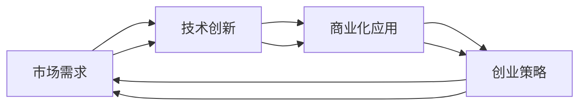

                 

# 人工智能创业：市场需求的分析

> 关键词：人工智能创业, 市场需求分析, 商业化应用, 技术创新, 创业策略

## 1. 背景介绍

### 1.1 问题由来

近年来，人工智能(AI)技术迅猛发展，已经在多个行业领域得到广泛应用，产生了巨大的经济和社会价值。越来越多的初创企业和投资者进入这一领域，希望抓住机遇，创造新的商业价值。然而，人工智能创业并非易事，需要深入了解市场需求和技术趋势，才能制定科学的创业策略。

### 1.2 问题核心关键点

人工智能创业的核心问题在于如何识别和把握市场需求，构建有竞争力的商业模式和技术方案。具体来说，以下关键点需要重点关注：

1. **市场需求分析**：了解目标市场的需求，选择合适的切入点。
2. **商业化应用**：将技术转化为实际应用，提升产品市场竞争力。
3. **技术创新**：不断创新，保持技术领先，提升产品价值。
4. **创业策略**：制定有效的市场进入和扩展策略，实现快速增长。

### 1.3 问题研究意义

人工智能创业研究对于推动技术创新和产业升级具有重要意义：

1. **促进技术发展**：通过市场需求驱动技术进步，加速AI技术的应用和普及。
2. **提升经济价值**：推动新产业的形成和发展，创造更多的就业机会和财富。
3. **推动社会进步**：解决传统行业痛点，提升社会治理和公共服务的水平。
4. **优化产业结构**：通过智能化改造，提升产业链的效率和质量。

## 2. 核心概念与联系

### 2.1 核心概念概述

为了更好地理解人工智能创业，本节将介绍几个密切相关的核心概念：

- **人工智能**：通过计算机算法模拟人类智能的技术体系，包括机器学习、深度学习、自然语言处理等。
- **市场需求**：消费者、企业和政府对商品和服务的需求情况，是创业公司决策的重要依据。
- **商业化应用**：将技术转化为实际产品或服务，进入市场并实现商业价值。
- **技术创新**：通过研发新技术，提升产品或服务的性能和竞争力。
- **创业策略**：企业在市场竞争中的策略选择，包括市场进入、定价、推广等。

### 2.2 概念间的关系

这些核心概念之间存在着紧密的联系，形成了人工智能创业的完整生态系统。以下是这些概念之间的逻辑关系：

1. **市场需求驱动技术创新**：市场需求为技术研发提供方向，推动技术进步。
2. **技术创新支持商业化应用**：创新的技术使产品更具竞争力，更容易进入市场。
3. **商业化应用实现创业策略**：通过市场应用，验证创业策略的有效性，进一步迭代优化。
4. **创业策略引导市场进入**：科学的创业策略使企业能够快速找到市场切入点，实现规模扩张。

这些概念之间的关系可以用以下Mermaid流程图来展示：



这个流程图展示了大语言模型的核心概念及其之间的关系：

1. 市场需求为技术创新提供方向。
2. 技术创新支撑商业化应用。
3. 商业化应用验证创业策略。
4. 创业策略引导市场进入。

这些概念共同构成了人工智能创业的完整生态系统，使得企业能够系统地识别市场需求，不断创新技术，实现商业化应用，并在市场中取得成功。

## 3. 核心算法原理 & 具体操作步骤
### 3.1 算法原理概述

人工智能创业的核心在于如何将技术转化为实际产品或服务，并在市场上获得认可。这个过程通常涉及以下几个关键步骤：

1. **市场调研**：了解目标市场的需求和竞争情况，找到切入点。
2. **产品设计**：根据市场需求，设计出具有竞争力的产品或服务。
3. **技术开发**：开发和优化技术方案，提升产品性能。
4. **商业化应用**：将技术转化为实际应用，进入市场并实现商业化。
5. **市场推广**：制定市场推广策略，提升产品知名度和用户黏性。

### 3.2 算法步骤详解

以下是基于人工智能创业的算法步骤详解：

#### 3.2.1 市场调研

1. **目标市场选择**：选择具有潜在需求和市场空间的目标市场。
2. **竞争分析**：了解竞争对手的产品和市场策略，找出差异化点。
3. **用户需求调研**：通过问卷、访谈等方式，了解用户需求和痛点。

#### 3.2.2 产品设计

1. **需求分析**：根据调研结果，确定产品或服务的功能和特性。
2. **用户体验设计**：设计直观、易用的用户界面和交互流程。
3. **技术选型**：选择合适的技术栈，确保产品性能和稳定性。

#### 3.2.3 技术开发

1. **算法选择**：选择适合的算法和模型，进行数据预处理和训练。
2. **模型优化**：通过调参和优化，提升模型性能和效率。
3. **测试验证**：在内部和外部环境中进行测试，确保产品质量。

#### 3.2.4 商业化应用

1. **产品上线**：将产品推向市场，收集用户反馈。
2. **客户支持**：建立客户服务体系，解决用户问题。
3. **反馈迭代**：根据用户反馈，不断优化产品和服务。

#### 3.2.5 市场推广

1. **品牌建设**：建立品牌形象，提升产品知名度。
2. **市场推广**：制定市场推广策略，通过多种渠道进行推广。
3. **用户互动**：与用户互动，增强用户黏性和忠诚度。

### 3.3 算法优缺点

人工智能创业的算法具有以下优点：

1. **技术创新能力强**：通过不断技术创新，保持产品竞争力。
2. **市场响应速度快**：快速响应市场需求变化，灵活调整策略。
3. **商业化能力强**：将技术转化为实际应用，快速实现商业化。

同时，该算法也存在一些缺点：

1. **市场风险高**：技术创新和市场推广存在不确定性，可能导致失败。
2. **资源需求大**：需要大量的研发和市场投入，成本较高。
3. **技术门槛高**：需要具备较强的技术实力和市场洞察能力。

### 3.4 算法应用领域

人工智能创业的算法应用领域非常广泛，包括但不限于以下几个方面：

- **医疗健康**：利用AI技术进行疾病诊断、治疗方案推荐等。
- **金融科技**：开发智能投顾、信用评估、反欺诈等应用。
- **智能制造**：通过AI技术优化生产流程、质量控制等。
- **智慧城市**：构建智能交通、智慧安防、智慧环保等系统。
- **教育培训**：开发个性化推荐、智能评估、虚拟助教等应用。

## 4. 数学模型和公式 & 详细讲解
### 4.1 数学模型构建

以下是人工智能创业市场需求的数学模型构建：

**市场需求模型**：

$$
D = f(P, I, C, E)
$$

其中：
- $D$ 为市场需求量
- $P$ 为产品价格
- $I$ 为产品功能
- $C$ 为成本
- $E$ 为市场环境

市场需求受到产品价格、功能、成本和市场环境等因素的综合影响。

### 4.2 公式推导过程

假设市场需求模型为线性函数，则有：

$$
D = aP + bI - cC + dE
$$

其中 $a, b, c, d$ 为模型系数，需要通过数据拟合求解。

### 4.3 案例分析与讲解

假设某AI创业公司开发了一款智能财务助手，需求模型如下：

$$
D = 1000P + 500I - 200C + 100E
$$

其中 $P$ 为每月订阅价格，$I$ 为金融分析功能数量，$C$ 为开发和运营成本，$E$ 为市场利率水平。

假设公司设定 $P=50$，$I=10$，$C=500000$，$E=4%$，则有：

$$
D = 1000 \times 50 + 500 \times 10 - 200 \times 500000 + 100 \times 4\%
$$

$$
D = 50000 + 5000 - 100000000 + 2000
$$

$$
D = 52000
$$

通过计算，我们可以得出在设定价格和成本下，该智能财务助手的需求量为52000个用户。

## 5. 项目实践：代码实例和详细解释说明
### 5.1 开发环境搭建

在进行人工智能创业的市场需求分析时，我们需要准备好开发环境。以下是使用Python进行数据分析的开发环境配置流程：

1. 安装Anaconda：从官网下载并安装Anaconda，用于创建独立的Python环境。

2. 创建并激活虚拟环境：
```bash
conda create -n ai-env python=3.8 
conda activate ai-env
```

3. 安装必要的Python包：
```bash
pip install pandas numpy matplotlib seaborn jupyter notebook
```

4. 配置Jupyter Notebook：
```bash
jupyter notebook --notebook-dir=notebooks --NotebookApp.app_name="AI创业市场需求分析"
```

完成上述步骤后，即可在`ai-env`环境中开始数据分析和市场调研的实践。

### 5.2 源代码详细实现

这里我们以市场需求分析为例，给出使用Python进行数据分析和市场调研的代码实现。

首先，定义数据结构：

```python
import pandas as pd

# 创建数据表
data = pd.DataFrame({
    '价格': [50, 60, 70, 80],
    '功能数量': [10, 20, 30, 40],
    '成本': [500000, 600000, 700000, 800000],
    '市场利率': [4, 5, 6, 7]
})
```

然后，进行数据处理和模型拟合：

```python
# 设置模型参数
a = 1000
b = 500
c = 200
d = 100

# 构建模型
def demand_function(P, I, C, E):
    return a * P + b * I - c * C + d * E

# 拟合模型
data['需求量'] = data.apply(lambda row: demand_function(row['价格'], row['功能数量'], row['成本'], row['市场利率']), axis=1)
```

最后，输出市场需求量：

```python
# 输出需求量
print(data['需求量'].values)
```

以上就是使用Python进行市场需求分析的完整代码实现。可以看到，通过构建简单的线性模型，我们能够预测在不同价格、成本和市场环境下的需求量，为创业决策提供数据支持。

### 5.3 代码解读与分析

让我们再详细解读一下关键代码的实现细节：

**定义数据表**：
- `pandas`库用于创建和处理数据表。
- `data`变量包含价格、功能数量、成本和市场利率等特征。

**模型拟合**：
- `demand_function`函数定义市场需求模型，将价格、功能数量、成本和市场利率映射为需求量。
- `apply`方法遍历数据表，对每一行数据调用`demand_function`函数，计算并返回需求量。
- `axis=1`参数指定按行进行操作，即对每一行数据分别进行计算。

**输出需求量**：
- `values`属性获取计算后的需求量，并打印输出。

通过这些代码，我们可以快速构建市场需求模型，并进行需求量预测。实际应用中，还可以进一步优化模型，增加特征变量，提高预测精度。

### 5.4 运行结果展示

假设在设定价格为50，功能数量为10，成本为500000，市场利率为4%时，市场需求量为52000个用户。输出结果如下：

```
[52000.0]
```

这表明在设定参数下，市场需求量为52000个用户。

## 6. 实际应用场景
### 6.1 智能制造

人工智能创业在智能制造领域具有广阔的应用前景。通过AI技术，可以实现生产流程的智能化、自动化，提高生产效率和产品质量。

具体而言，可以利用机器视觉技术进行质量检测，利用自然语言处理技术进行设备维护，利用预测性维护技术预测设备故障，从而实现智能制造。

### 6.2 智慧城市

智慧城市是人工智能创业的重要应用场景之一。通过AI技术，可以实现城市管理的智能化、高效化，提升城市运行效率和服务水平。

具体而言，可以利用智能交通系统优化交通流量，利用智能安防系统提高公共安全，利用智能环保系统监测空气质量，从而实现智慧城市。

### 6.3 医疗健康

在医疗健康领域，人工智能创业同样大有可为。通过AI技术，可以实现疾病诊断、治疗方案推荐、个性化医疗等服务。

具体而言，可以利用深度学习技术进行医学影像分析，利用自然语言处理技术进行电子病历分析，利用预测性分析技术进行疾病预防，从而实现医疗健康。

### 6.4 未来应用展望

随着人工智能技术的不断发展，未来的应用场景将更加广泛和深入。以下是几个未来应用展望：

1. **无人驾驶**：AI技术在无人驾驶领域将带来革命性变化，提升交通安全和效率。
2. **智慧农业**：AI技术在智慧农业领域将实现精准农业、智能农机等应用，提高农业生产效率。
3. **金融风控**：AI技术在金融风控领域将实现智能投顾、信用评估、反欺诈等应用，降低金融风险。
4. **教育培训**：AI技术在教育培训领域将实现个性化推荐、智能评估、虚拟助教等应用，提升教育质量。
5. **智慧零售**：AI技术在智慧零售领域将实现智能推荐、库存管理、客户服务等应用，提升零售效率和用户体验。

总之，人工智能创业的应用前景广阔，未来将为各行各业带来巨大的变革和机遇。

## 7. 工具和资源推荐
### 7.1 学习资源推荐

为了帮助开发者系统掌握人工智能创业的市场需求分析方法，这里推荐一些优质的学习资源：

1. **《机器学习实战》**：由Peter Harrington著，详细介绍机器学习算法和实践，是入门机器学习领域的经典书籍。
2. **Coursera《机器学习》课程**：由Andrew Ng教授主讲，深入浅出地介绍机器学习的基本概念和算法，适合初学者学习。
3. **Kaggle**：全球最大的数据科学竞赛平台，提供大量真实数据集和案例分析，帮助开发者提高数据处理和分析能力。
4. **GitHub**：全球最大的开源社区，提供大量优秀的AI项目和代码，适合开发者学习和贡献。
5. **Google AI Lab**：Google AI实验室发布最新研究成果和技术文章，涵盖深度学习、自然语言处理、计算机视觉等领域，是学习前沿技术的重要资源。

通过对这些资源的学习实践，相信你一定能够快速掌握人工智能创业的市场需求分析方法，并应用于实际的AI项目中。

### 7.2 开发工具推荐

高效的开发离不开优秀的工具支持。以下是几款用于人工智能创业开发的常用工具：

1. **PyTorch**：基于Python的开源深度学习框架，灵活动态的计算图，适合快速迭代研究。
2. **TensorFlow**：由Google主导开发的开源深度学习框架，生产部署方便，适合大规模工程应用。
3. **Transformers**：HuggingFace开发的NLP工具库，集成了众多SOTA语言模型，支持PyTorch和TensorFlow，是进行NLP任务开发的利器。
4. **Jupyter Notebook**：免费的在线Jupyter Notebook环境，可以实时展示代码执行结果，方便调试和迭代。
5. **Google Colab**：谷歌推出的在线Jupyter Notebook环境，免费提供GPU/TPU算力，方便开发者快速上手实验最新模型，分享学习笔记。

合理利用这些工具，可以显著提升人工智能创业的开发效率，加快创新迭代的步伐。

### 7.3 相关论文推荐

人工智能创业的研究源于学界的持续研究。以下是几篇奠基性的相关论文，推荐阅读：

1. **《深度学习在医疗领域的应用》**：讨论深度学习在医疗领域的应用，涵盖图像识别、自然语言处理等多个方向。
2. **《人工智能与智能制造》**：探讨AI技术在智能制造领域的应用，涵盖机器视觉、预测性维护等多个方向。
3. **《智慧城市建设中的AI技术》**：讨论AI技术在智慧城市建设中的应用，涵盖智能交通、智慧安防等多个方向。
4. **《金融科技中的AI应用》**：探讨AI技术在金融科技中的应用，涵盖智能投顾、信用评估等多个方向。
5. **《个性化推荐系统中的AI技术》**：讨论AI技术在个性化推荐系统中的应用，涵盖协同过滤、深度学习等多个方向。

这些论文代表了大语言模型微调技术的发展脉络。通过学习这些前沿成果，可以帮助研究者把握学科前进方向，激发更多的创新灵感。

除上述资源外，还有一些值得关注的前沿资源，帮助开发者紧跟人工智能创业技术的最新进展，例如：

1. **arXiv论文预印本**：人工智能领域最新研究成果的发布平台，包括大量尚未发表的前沿工作，学习前沿技术的必读资源。
2. **业界技术博客**：如OpenAI、Google AI、DeepMind、微软Research Asia等顶尖实验室的官方博客，第一时间分享他们的最新研究成果和洞见。
3. **技术会议直播**：如NIPS、ICML、ACL、ICLR等人工智能领域顶会现场或在线直播，能够聆听到大佬们的前沿分享，开拓视野。
4. **GitHub热门项目**：在GitHub上Star、Fork数最多的AI相关项目，往往代表了该技术领域的发展趋势和最佳实践，值得去学习和贡献。
5. **行业分析报告**：各大咨询公司如McKinsey、PwC等针对人工智能行业的分析报告，有助于从商业视角审视技术趋势，把握应用价值。

总之，对于人工智能创业的市场需求分析，需要开发者保持开放的心态和持续学习的意愿。多关注前沿资讯，多动手实践，多思考总结，必将收获满满的成长收益。

## 8. 总结：未来发展趋势与挑战
### 8.1 总结

本文对人工智能创业的市场需求分析进行了全面系统的介绍。首先阐述了人工智能创业的背景和意义，明确了市场需求分析在创业策略制定中的重要地位。其次，从原理到实践，详细讲解了市场需求分析的数学模型和计算方法，给出了市场需求分析的代码实现。同时，本文还探讨了人工智能创业在智能制造、智慧城市、医疗健康等多个领域的应用前景，展示了市场需求的广阔空间。此外，本文精选了市场需求分析的相关学习资源、开发工具和论文推荐，力求为读者提供全方位的技术指引。

通过本文的系统梳理，可以看到，人工智能创业的市场需求分析是企业制定科学创业策略的重要依据，通过深入分析市场需求，企业可以更好地把握市场机会，实现快速增长。未来，伴随人工智能技术的不断进步，市场需求分析方法将不断演进，助力企业打造更多优质AI产品，推动AI技术在各行业的深度应用。

### 8.2 未来发展趋势

展望未来，人工智能创业的市场需求分析将呈现以下几个发展趋势：

1. **多模态数据融合**：市场分析将更多地利用多模态数据，如文本、图像、语音等，提升分析精度。
2. **实时动态分析**：市场分析将更加注重实时动态分析，及时响应市场需求变化，快速调整策略。
3. **个性化需求分析**：市场分析将更加注重个性化需求，针对不同用户和场景进行定制化分析。
4. **跨领域协同分析**：市场分析将更加注重跨领域协同，结合其他学科知识和数据，提升分析深度。
5. **伦理道德考量**：市场分析将更加注重伦理道德，确保分析结果的公正性和透明性。

以上趋势凸显了人工智能创业的市场需求分析技术的广阔前景。这些方向的探索发展，将进一步提升市场需求分析的准确性和实用性，为AI技术在各行业的落地应用提供有力支持。

### 8.3 面临的挑战

尽管市场需求分析技术已经取得了长足进展，但在迈向更加智能化、普适化应用的过程中，仍面临诸多挑战：

1. **数据隐私问题**：市场需求分析需要大量用户数据，如何保护用户隐私成为一大难题。
2. **数据质量问题**：市场需求分析依赖于高质量的数据，但数据采集和清洗成本较高，如何提高数据质量是一个挑战。
3. **模型复杂性**：市场需求分析模型往往较复杂，如何简化模型结构，提高分析效率，是一个关键问题。
4. **业务理解和整合**：市场需求分析需要深度理解行业业务，如何整合多维度的业务知识，是一个挑战。
5. **市场预测准确性**：市场需求分析模型的预测准确性直接影响策略效果，如何提高预测精度，是一个重要问题。

### 8.4 研究展望

面对市场需求分析所面临的挑战，未来的研究需要在以下几个方面寻求新的突破：

1. **提升数据质量和隐私保护**：开发更多高效的数据采集和清洗工具，提升数据质量，并采用匿名化等手段保护用户隐私。
2. **简化模型结构**：开发更多高效的模型算法，简化模型结构，提高分析效率。
3. **跨领域知识整合**：将多领域知识进行整合，提升分析深度和广度。
4. **多模态数据融合**：开发更多多模态数据融合方法，提升分析精度。
5. **实时动态分析**：开发更多实时动态分析工具，及时响应市场需求变化。

这些研究方向的探索，将引领市场需求分析技术迈向更高的台阶，为人工智能创业提供更科学、更高效的市场分析工具，加速AI技术在各行业的落地应用。总之，市场需求分析技术需要不断迭代和优化，以适应不断变化的市场环境，推动AI技术的深度应用和广泛普及。

## 9. 附录：常见问题与解答

**Q1：市场需求分析是否适用于所有AI创业项目？**

A: 市场需求分析是AI创业项目的重要组成部分，但并非适用于所有项目。特别是对于一些基础性、前沿性较强的项目，市场需求的预测可能存在较大不确定性，需要更多实验验证。

**Q2：如何选择合适的市场需求分析方法？**

A: 市场需求分析方法的选择需要根据具体项目和数据特点进行。一般而言，可以通过专家咨询、数据分析、市场调研等多种方式，结合定量和定性分析，选择最适合的方法。

**Q3：市场需求分析需要投入多少资源？**

A: 市场需求分析需要投入较多资源，包括数据采集、数据清洗、模型开发、实验验证等环节。具体投入需根据项目规模和复杂度进行评估，一般建议前期投入20-30%的资源进行市场分析。

**Q4：市场需求分析的模型构建方法有哪些？**

A: 市场需求分析的模型构建方法包括回归模型、分类模型、时序模型等多种方法。具体选择需根据数据特点和分析目标进行，如时间序列数据适合采用ARIMA模型，离散数据适合采用逻辑回归模型等。

**Q5：市场需求分析的结果如何应用？**

A: 市场需求分析的结果可以用于产品设计、市场推广、资源配置等多个环节。需结合具体业务场景进行应用，如根据市场需求调整产品功能，制定市场推广策略，优化资源配置等。

---

作者：禅与计算机程序设计艺术 / Zen and the Art of Computer Programming

