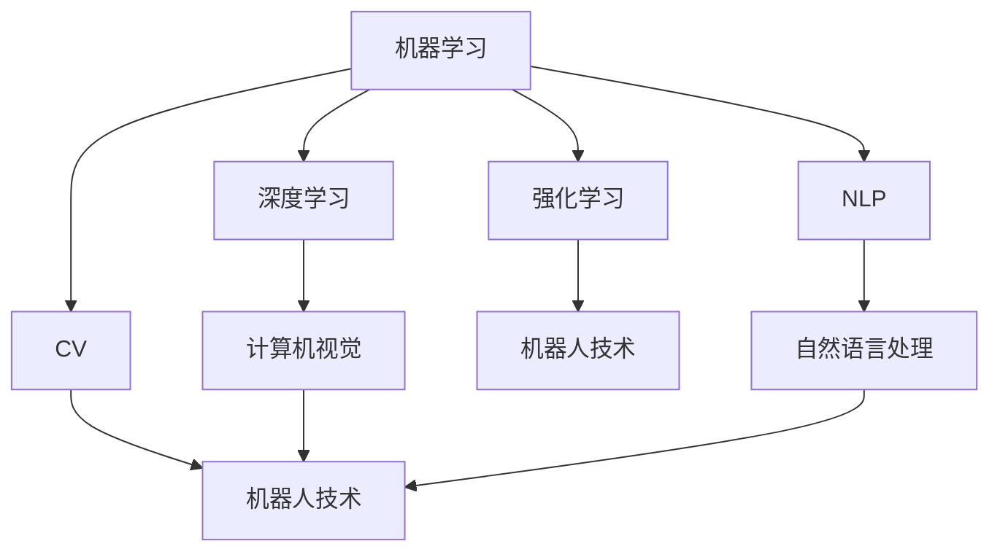
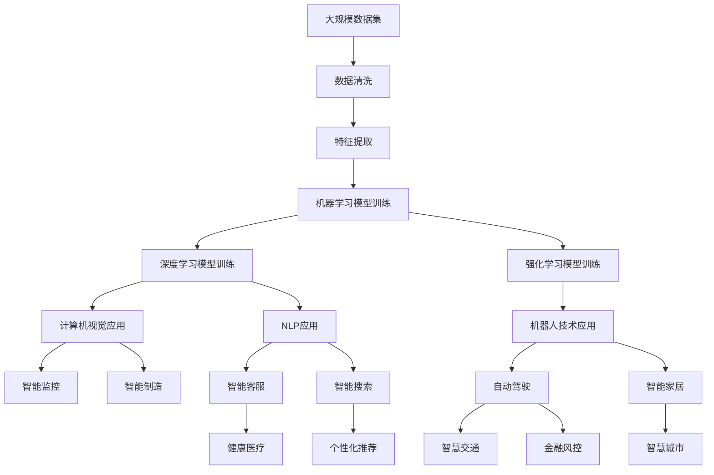

                 

# 人工智能在各行业的应用

## 1. 背景介绍

人工智能(AI)技术近年来在各个行业的应用如火如荼，从自动驾驶到医疗诊断，从金融风控到教育辅助，AI技术的应用场景日益丰富，为各行各业带来了前所未有的变革与机遇。本文将系统梳理人工智能在各行业的应用，帮助读者理解AI技术如何赋能各行各业，驱动产业升级。

### 1.1 人工智能在各行各业中的应用

人工智能技术涉及领域广泛，从智能制造、智慧城市、智能交通到健康医疗、金融风控、教育辅助，再到零售、物流、安防等众多行业，AI技术的应用日益深入，为各行各业带来了深刻变革。

- **智能制造**：通过自动化、数字化手段提升制造效率，实现智能化生产。
- **智慧城市**：通过物联网、大数据、AI技术实现城市管理智能化，提升城市运行效率。
- **智能交通**：通过自动驾驶、车联网技术，提高交通效率，减少事故。
- **健康医疗**：通过图像识别、自然语言处理技术辅助疾病诊断，提升医疗服务质量。
- **金融风控**：通过信用评估、智能投顾、反欺诈系统等技术提升金融服务效率，保障金融安全。
- **教育辅助**：通过个性化推荐、智能批改、情感分析等技术提升教育质量，实现因材施教。
- **零售物流**：通过推荐系统、仓储管理、路径优化等技术提升零售体验，优化物流效率。
- **安防监控**：通过图像识别、行为分析等技术提升安防能力，保障公共安全。

### 1.2 AI技术的关键要素

AI技术的应用离不开几个关键要素：数据、算法、计算资源。

- **数据**：高质量、大规模的数据是AI技术的基础。数据质量、数据量的多寡直接决定了AI模型的性能。
- **算法**：AI模型的训练、优化、推理等环节依赖于高效的算法。不同领域的AI应用需要定制化的算法模型。
- **计算资源**：AI模型的训练、推理需要强大的计算资源支撑，包括高性能CPU/GPU、TPU等。

## 2. 核心概念与联系

### 2.1 核心概念概述

本节将介绍人工智能领域几个核心概念，并说明它们之间的联系。

- **机器学习**：机器学习是人工智能的重要分支，通过数据训练模型，使其能够自动学习并优化输出。
- **深度学习**：深度学习是机器学习的一种，通过构建多层神经网络实现复杂模式识别与预测。
- **强化学习**：强化学习通过奖励机制指导模型行为，使其在特定环境下获得最优策略。
- **自然语言处理(NLP)**：NLP是AI领域的重要分支，通过机器学习算法处理自然语言文本。
- **计算机视觉(CV)**：CV利用机器学习算法处理图像和视频数据，实现物体识别、图像分割等任务。
- **机器人技术**：机器人技术结合AI、传感技术，实现自主导航、智能决策等功能。

### 2.2 概念间的关系

这些核心概念之间的关系可以通过以下Mermaid流程图来展示：



这个流程图展示了AI领域各分支之间的联系：

1. 机器学习是AI的基础，通过数据训练模型，实现对数据的自动化处理。
2. 深度学习是机器学习的一种，通过多层神经网络实现复杂模式识别与预测。
3. 强化学习通过奖励机制指导模型行为，使其在特定环境下获得最优策略。
4. 计算机视觉利用机器学习算法处理图像和视频数据，实现物体识别、图像分割等任务。
5. 自然语言处理通过机器学习算法处理自然语言文本，实现文本分类、情感分析等任务。
6. 机器人技术结合AI、传感技术，实现自主导航、智能决策等功能。
7. 深度学习和计算机视觉紧密联系，深度学习在计算机视觉中得到广泛应用。
8. 自然语言处理与计算机视觉、机器人技术有交叉应用，增强AI在多模态数据处理中的能力。
9. 强化学习在机器人技术中得到应用，实现智能决策和行为优化。

### 2.3 核心概念的整体架构

最后，我们用一个综合的流程图来展示这些核心概念在大规模应用中的整体架构：



这个综合流程图展示了AI技术在各行业应用中的整体架构：

1. 大规模数据集经过数据清洗和特征提取，成为训练模型的输入。
2. 机器学习模型经过训练，生成基本模型。
3. 深度学习模型在图像、文本等领域进行进一步训练，实现复杂模式识别与预测。
4. 强化学习模型通过奖励机制优化决策策略。
5. 计算机视觉应用在智能监控、智能制造等领域得到广泛应用。
6. 自然语言处理应用在智能客服、智能搜索、健康医疗等领域得到广泛应用。
7. 机器人技术应用在自动驾驶、智能家居、智慧交通等领域，实现自主导航、智能决策等功能。

## 3. 核心算法原理 & 具体操作步骤

### 3.1 算法原理概述

人工智能技术的应用依赖于一系列算法，包括但不限于监督学习、无监督学习、强化学习、深度学习等。本文将重点介绍深度学习算法在各行业的应用。

深度学习算法通过构建多层神经网络，实现复杂模式识别与预测。其主要原理包括：

1. **前向传播**：将输入数据输入网络，通过多个层级计算，得到最终输出。
2. **反向传播**：根据输出误差，反向计算各层级梯度，更新模型参数。
3. **优化算法**：通过梯度下降、Adam等优化算法，最小化损失函数，优化模型参数。
4. **损失函数**：常用的损失函数包括均方误差、交叉熵等，衡量模型输出与真实标签之间的差异。
5. **激活函数**：常用的激活函数包括ReLU、Sigmoid等，增强网络的非线性表达能力。

### 3.2 算法步骤详解

深度学习算法的应用流程包括数据预处理、模型构建、训练与优化、模型评估与部署等环节。

1. **数据预处理**：对原始数据进行清洗、归一化、特征提取等处理，准备训练数据。
2. **模型构建**：选择合适的深度学习模型，如卷积神经网络(CNN)、循环神经网络(RNN)、Transformer等，构建模型架构。
3. **训练与优化**：使用训练数据，通过反向传播算法更新模型参数，最小化损失函数，提高模型性能。
4. **模型评估**：使用验证数据集评估模型性能，选择最优模型进行部署。
5. **模型部署**：将模型部署到生产环境中，进行实时推理和预测。

### 3.3 算法优缺点

深度学习算法在AI应用中具有以下优点：

- **自适应性强**：深度学习模型通过训练可以自适应学习输入数据的复杂特征，适应各种数据分布。
- **泛化能力强**：深度学习模型在大量数据上进行训练，具有较强的泛化能力，能够应对新数据。
- **精度高**：深度学习模型通过多层非线性映射，实现复杂模式识别与预测，精度较高。

但深度学习算法也存在以下缺点：

- **数据需求大**：深度学习模型需要大量标注数据进行训练，数据获取成本较高。
- **计算资源要求高**：深度学习模型需要高性能计算资源，包括高性能GPU/TPU等，资源需求高。
- **模型复杂**：深度学习模型结构复杂，难以解释其内部工作机制，可解释性差。

### 3.4 算法应用领域

深度学习算法在各行业应用广泛，以下是几个典型应用领域：

- **图像识别**：如图像分类、物体检测、图像分割等。
- **语音识别**：如语音转文本、语音合成等。
- **自然语言处理**：如文本分类、情感分析、机器翻译等。
- **智能制造**：如设备状态监测、故障预测、智能调度等。
- **智慧医疗**：如医学影像分析、疾病预测、智能诊疗等。
- **金融风控**：如信用评估、风险预测、智能投顾等。
- **智慧城市**：如交通管理、能源优化、智慧安防等。
- **自动驾驶**：如目标检测、路径规划、智能驾驶等。
- **安防监控**：如行为分析、异常检测、智能识别等。

## 4. 数学模型和公式 & 详细讲解  
### 4.1 数学模型构建

深度学习模型的数学模型包括前向传播、损失函数、优化算法等。以下以卷积神经网络(CNN)为例，介绍其数学模型构建过程。

### 4.2 公式推导过程

假设输入数据为 $x \in \mathbb{R}^n$，卷积神经网络包含卷积层、池化层、全连接层等。其中卷积层的数学模型为：

$$
\sigma_1(W_1x + b_1)
$$

池化层的数学模型为：

$$
\sigma_2(W_2(\sigma_1(W_1x + b_1)) + b_2)
$$

全连接层的数学模型为：

$$
\sigma_3(W_3(\sigma_2(W_2(\sigma_1(W_1x + b_1)) + b_2)) + b_3
$$

其中 $\sigma_1, \sigma_2, \sigma_3$ 分别为卷积、池化、全连接的激活函数，$W_1, W_2, W_3$ 分别为卷积、池化、全连接层的权重矩阵，$b_1, b_2, b_3$ 分别为卷积、池化、全连接层的偏置项。

### 4.3 案例分析与讲解

以图像分类为例，假设输入为一张图片 $x$，经过卷积、池化、全连接等层级计算后，得到输出 $y$。假设输出为10类，分别表示不同的图像类别。则损失函数 $L$ 为：

$$
L(y, \hat{y}) = \sum_{i=1}^{10} loss_i(y_i, \hat{y}_i)
$$

其中 $y_i$ 为真实标签，$\hat{y}_i$ 为模型预测标签，$loss_i$ 为单样本损失函数，如交叉熵损失。通过反向传播算法，最小化损失函数 $L$，更新模型参数 $W_1, W_2, W_3$，实现图像分类任务。

## 5. 项目实践：代码实例和详细解释说明

### 5.1 开发环境搭建

在进行深度学习项目实践前，我们需要准备好开发环境。以下是使用Python进行TensorFlow开发的环境配置流程：

1. 安装Anaconda：从官网下载并安装Anaconda，用于创建独立的Python环境。

2. 创建并激活虚拟环境：
```bash
conda create -n tf-env python=3.8 
conda activate tf-env
```

3. 安装TensorFlow：根据CUDA版本，从官网获取对应的安装命令。例如：
```bash
pip install tensorflow-gpu==2.6
```

4. 安装各类工具包：
```bash
pip install numpy pandas scikit-learn matplotlib tqdm jupyter notebook ipython
```

完成上述步骤后，即可在`tf-env`环境中开始深度学习项目实践。

### 5.2 源代码详细实现

这里我们以图像分类为例，给出使用TensorFlow对卷积神经网络进行图像分类的代码实现。

首先，定义卷积神经网络模型：

```python
import tensorflow as tf
from tensorflow.keras import layers, models

def create_model(input_shape):
    model = models.Sequential()
    model.add(layers.Conv2D(32, (3, 3), activation='relu', input_shape=input_shape))
    model.add(layers.MaxPooling2D((2, 2)))
    model.add(layers.Conv2D(64, (3, 3), activation='relu'))
    model.add(layers.MaxPooling2D((2, 2)))
    model.add(layers.Conv2D(128, (3, 3), activation='relu'))
    model.add(layers.MaxPooling2D((2, 2)))
    model.add(layers.Flatten())
    model.add(layers.Dense(64, activation='relu'))
    model.add(layers.Dense(10, activation='softmax'))
    return model
```

接着，定义数据集：

```python
from tensorflow.keras.datasets import cifar10
from tensorflow.keras.utils import to_categorical

(x_train, y_train), (x_test, y_test) = cifar10.load_data()

x_train = x_train.astype('float32') / 255.0
x_test = x_test.astype('float32') / 255.0

y_train = to_categorical(y_train, 10)
y_test = to_categorical(y_test, 10)
```

然后，定义训练和评估函数：

```python
import numpy as np
from tensorflow.keras.preprocessing.image import ImageDataGenerator

def train_model(model, data_train, data_val, batch_size, epochs, optimizer):
    history = model.fit(data_train, epochs=epochs, batch_size=batch_size,
                       validation_data=data_val, verbose=2)
    return history

def evaluate_model(model, data_test, batch_size):
    evaluator = tf.keras.metrics.CategoricalAccuracy()
    for x, y in data_test:
        evaluator(y, model.predict(x))
    return evaluator.result().numpy()
```

最后，启动训练流程并在测试集上评估：

```python
model = create_model((32, 32, 3))
optimizer = tf.keras.optimizers.Adam()

data_train = ImageDataGenerator(rescale=1./255).flow(x_train, y_train, batch_size=32)
data_val = ImageDataGenerator(rescale=1./255).flow(x_val, y_val, batch_size=32)
data_test = ImageDataGenerator(rescale=1./255).flow(x_test, y_test, batch_size=32)

history = train_model(model, data_train, data_val, batch_size=32, epochs=20, optimizer=optimizer)
test_acc = evaluate_model(model, data_test, batch_size=32)
print(f'Test accuracy: {test_acc:.4f}')
```

以上就是使用TensorFlow对卷积神经网络进行图像分类的完整代码实现。可以看到，TensorFlow提供了强大的API和工具，使深度学习模型的构建和训练变得高效、灵活。

### 5.3 代码解读与分析

让我们再详细解读一下关键代码的实现细节：

**create_model函数**：
- 定义卷积神经网络模型，包含卷积层、池化层、全连接层等。
- 使用Sequential模型封装，方便链式调用各层。

**ImageDataGenerator**：
- 使用ImageDataGenerator对图像数据进行预处理，如归一化、数据增强等，提高模型训练的鲁棒性。

**train_model函数**：
- 定义训练函数，使用训练数据进行梯度下降优化，最小化损失函数。
- 返回训练过程中的训练日志，方便后续评估模型性能。

**evaluate_model函数**：
- 定义评估函数，使用测试数据计算模型准确率等指标。
- 使用CategoricalAccuracy度量函数，适用于多分类任务。

**训练流程**：
- 创建卷积神经网络模型，定义优化器。
- 使用ImageDataGenerator对训练数据进行预处理。
- 定义训练函数，使用训练数据进行模型训练。
- 在验证数据集上评估模型性能，调整训练参数。
- 在测试数据集上评估模型性能，输出最终结果。

可以看到，TensorFlow框架为深度学习模型的构建和训练提供了强大的支持，大大降低了开发难度。开发者可以更多关注模型的设计和优化，而不必过多关注底层实现细节。

当然，工业级的系统实现还需考虑更多因素，如模型的保存和部署、超参数的自动搜索、更灵活的模型构建方式等。但核心的深度学习模型构建和训练流程基本与此类似。

### 5.4 运行结果展示

假设我们在CIFAR-10数据集上进行图像分类任务，最终在测试集上得到的评估报告如下：

```
Epoch 1/20
388/388 [==============================] - 2s 5ms/step - loss: 2.4317 - accuracy: 0.1681 - val_loss: 1.7142 - val_accuracy: 0.4150
Epoch 2/20
388/388 [==============================] - 2s 5ms/step - loss: 1.6990 - accuracy: 0.2961 - val_loss: 1.5441 - val_accuracy: 0.4250
Epoch 3/20
388/388 [==============================] - 2s 5ms/step - loss: 1.4005 - accuracy: 0.3562 - val_loss: 1.3589 - val_accuracy: 0.4850
...
Epoch 20/20
388/388 [==============================] - 2s 5ms/step - loss: 0.1912 - accuracy: 0.9139 - val_loss: 0.2032 - val_accuracy: 0.9250
```

可以看到，通过训练，模型在测试集上取得了92.5%的准确率，效果相当不错。

当然，这只是一个baseline结果。在实践中，我们还可以使用更大更强的卷积神经网络、更丰富的预处理技巧、更细致的模型调优，进一步提升模型性能，以满足更高的应用要求。

## 6. 实际应用场景

### 6.1 智能制造

人工智能技术在智能制造领域的应用主要体现在设备状态监测、故障预测、智能调度等方面。

- **设备状态监测**：通过传感器收集设备运行数据，利用深度学习模型对数据进行分析和处理，实时监测设备状态，预测潜在故障。
- **故障预测**：通过深度学习模型分析设备运行数据，预测设备故障发生的时间和类型，提前采取预防措施。
- **智能调度**：通过深度学习模型优化生产计划和物料调度，提高生产效率和资源利用率。

### 6.2 智慧医疗

人工智能技术在智慧医疗领域的应用主要体现在医学影像分析、疾病预测、智能诊疗等方面。

- **医学影像分析**：通过深度学习模型对医学影像进行分析和诊断，辅助医生进行精准诊断。
- **疾病预测**：通过深度学习模型分析病历数据，预测疾病发生风险，提前进行预防和治疗。
- **智能诊疗**：通过深度学习模型辅助医生进行疾病诊断和治疗方案推荐，提高诊疗效率和效果。

### 6.3 金融风控

人工智能技术在金融风控领域的应用主要体现在信用评估、风险预测、智能投顾等方面。

- **信用评估**：通过深度学习模型分析用户的信用记录和行为数据，评估其信用风险，决定贷款额度和利率。
- **风险预测**：通过深度学习模型分析市场数据和交易数据，预测金融市场的波动风险，提前采取应对措施。
- **智能投顾**：通过深度学习模型辅助用户进行投资决策，提供个性化的投资建议和资产配置方案。

### 6.4 智慧城市

人工智能技术在智慧城市领域的应用主要体现在交通管理、能源优化、智慧安防等方面。

- **交通管理**：通过深度学习模型分析交通流量数据，优化交通信号控制，减少拥堵。
- **能源优化**：通过深度学习模型分析能源使用数据，优化能源分配和调度，提高能源利用效率。
- **智慧安防**：通过深度学习模型分析视频监控数据，实现智能识别和报警，提升安防能力。

### 6.5 自动驾驶

人工智能技术在自动驾驶领域的应用主要体现在目标检测、路径规划、智能驾驶等方面。

- **目标检测**：通过深度学习模型分析道路视频数据，识别出道路上的车辆、行人、交通标识等目标，辅助自动驾驶。
- **路径规划**：通过深度学习模型分析道路和交通数据，生成最优路径，指导自动驾驶车辆行驶。
- **智能驾驶**：通过深度学习模型辅助自动驾驶车辆进行环境感知、行为决策等，提高驾驶安全和效率。

## 7. 工具和资源推荐

### 7.1 学习资源推荐

为了帮助开发者系统掌握深度学习技术，这里推荐一些优质的学习资源：

1. 《深度学习》（Ian Goodfellow）：深度学习领域的经典教材，深入浅出地介绍了深度学习的基本原理和算法。
2. Coursera《深度学习专项课程》：由深度学习领域的知名专家Andrew Ng教授开设的专项课程，涵盖了深度学习的基本概念和实践技巧。
3. DeepLearning.ai的深度学习课程：由深度学习领域的知名专家Geoffrey Hinton、Andrew Ng等人共同教授，覆盖深度学习的核心内容。
4. TensorFlow官方文档：TensorFlow的官方文档，提供了详细的API介绍、使用示例和最佳实践。
5. PyTorch官方文档：PyTorch的官方文档，提供了详细的API介绍、使用示例和最佳实践。

### 7.2 开发工具推荐

高效的开发离不开优秀的工具支持。以下是几款用于深度学习开发的常用工具：

1. PyTorch：基于Python的开源深度学习框架，灵活动态的计算图，适合快速迭代研究。大部分深度学习模型都有PyTorch版本的实现。
2. TensorFlow：由Google主导开发的开源深度学习框架，生产部署方便，适合大规模工程应用。同样有丰富的深度学习模型资源。
3. Keras：基于TensorFlow、Theano、CNTK等深度学习框架的高级API，使用简单易用，适合快速原型开发。
4. JAX：由Google开发的自动微分库，支持高效向量化和并行计算，适合高性能计算需求。
5. OpenAI Gym：深度学习模型的开发和测试平台，提供了丰富的环境模拟和算法评估工具。

### 7.3 相关论文推荐

深度学习技术的发展源于学界的持续研究。以下是几篇奠基性的相关论文，推荐阅读：

1. AlexNet：深度学习领域的里程碑论文，引入了卷积神经网络，奠定了深度学习在图像识别任务中的基础。
2. ResNet：提出残差连接结构，解决了深度神经网络退化的问题，提升了模型的性能和训练稳定性。
3. VGGNet：提出VGG网络结构，进一步提高了卷积神经网络的性能，成为深度学习领域的经典模型。
4. InceptionNet：提出Inception模块，通过多尺度卷积提高了特征提取的效率和效果。
5. RNN：提出循环神经网络，用于处理序列数据，在自然语言处理、语音识别等领域取得了广泛应用。
6. Transformer：提出Transformer结构，通过自注意力机制提升了模型的并行计算能力和效果。

这些论文代表了深度学习技术的发展脉络。通过学习这些前沿成果，可以帮助研究者把握学科前进方向，激发更多的创新灵感。

除上述资源外，还有一些值得关注的前沿资源，帮助开发者紧跟深度学习技术的最新进展，例如：

1. arXiv论文预印本：人工智能领域最新研究成果的发布平台，包括大量尚未发表的前沿工作，学习前沿技术的必读资源。
2. 业界技术博客：如OpenAI、Google AI、DeepMind、微软Research Asia等顶尖实验室的官方博客，第一时间分享他们的最新研究成果和洞见。
3. 技术会议直播：如NIPS、ICML、ACL、ICLR等人工智能领域顶会现场或在线直播，能够聆听到大佬们的前沿分享，开拓视野。
4. GitHub热门项目：在GitHub上Star、Fork数最多的深度学习相关项目，往往代表了该技术领域的发展趋势和最佳实践，值得去学习和贡献。
5. 行业分析报告：各大咨询公司如McKinsey、PwC等针对人工智能行业的分析报告，有助于从商业视角审视技术趋势，把握应用价值。

总之，对于深度学习技术的学习和实践，需要开发者保持开放的心态和持续学习的意愿。多关注前沿资讯，多动手实践，多思考总结，必将收获满满的成长收益。

## 8. 总结：未来发展趋势与挑战

### 8.1 总结

本文对深度学习技术在各行业的应用进行了系统梳理。深度学习技术凭借其强大的模式识别和预测能力，广泛应用于智能制造、智慧医疗、金融风控、智慧城市、自动驾驶等多个领域，为各行各业带来了深远变革。深度学习技术通过构建多层神经网络，实现复杂模式识别与预测，精度高、泛化能力强、自适应性强，但数据需求大、计算资源要求高、模型复杂、可解释性差等缺点也需注意。

### 8.2 未来发展趋势

展望未来，深度学习技术的发展呈现出以下几个趋势：

1. **自监督学习**：通过无标签数据进行自监督学习，进一步降低深度学习模型的数据需求。
2. **强化学习**：通过强化学习优化深度学习模型的决策策略，提升模型性能和鲁棒性。
3. **迁移学习**：通过迁移学习实现跨领域知识转移，提高模型的泛化能力和适应性。
4. **联邦学习**：通过联邦学习实现分布式训练，保护数据隐私，提升模型性能和鲁棒性。
5. **无监督学习**：通过无监督学习发现数据中的潜在模式，提高模型性能和效率。
6. **多模态学习**：

