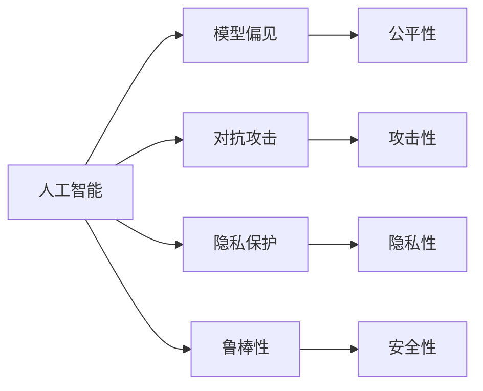
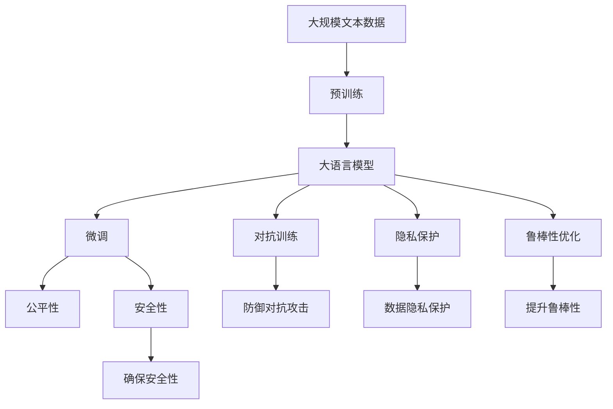

                 

# 人工智能技术的安全性问题

人工智能(AI)技术的迅猛发展，在带来便利和效益的同时，也引入了诸多安全问题。本文将系统探讨人工智能技术中的核心安全概念和实际应用场景，全面剖析当前存在的主要安全挑战，并提出未来研究方向和应对策略。

## 1. 背景介绍

### 1.1 问题由来
近年来，人工智能在医疗、金融、交通、安防、智能制造等领域得到广泛应用，大幅提升了生产效率和决策质量。然而，人工智能技术的复杂性和高度自动化特征，也引入了新的安全风险，包括模型偏见、对抗攻击、隐私泄露、鲁棒性不足等。这些安全问题不仅影响了系统的正常运行，还可能对人类社会造成深远影响。

### 1.2 问题核心关键点
人工智能技术的安全性问题主要集中在以下几个方面：

- **模型偏见与公平性**：由于训练数据存在偏见，导致模型对某些群体的预测结果不准确，产生歧视性的决策。
- **对抗攻击**：攻击者通过精心设计的扰动样本，使模型输出错误的预测结果，影响系统的决策。
- **隐私保护**：在数据采集、存储和传输过程中，保护用户隐私不被泄露或滥用。
- **鲁棒性不足**：模型对噪声、对抗样本等扰动具有较高的敏感性，难以应对实际应用中的复杂环境和多样数据。

## 2. 核心概念与联系

### 2.1 核心概念概述

为更好地理解人工智能技术的安全性问题，本节将介绍几个核心概念：

- **人工智能**：指通过算法、数据和计算资源，使计算机系统能够自主完成复杂任务的广义智能技术。
- **模型偏见**：指由于训练数据不平衡或分布偏差，导致模型对特定群体产生歧视性预测的现象。
- **对抗攻击**：指攻击者通过在数据样本中添加微小扰动，使模型输出错误的预测结果，实现对系统的控制。
- **隐私保护**：指在数据处理过程中，保护个人隐私不被滥用或泄露的策略和方法。
- **鲁棒性**：指模型对输入数据的扰动（如噪声、对抗攻击等）具有较强的容忍度和自适应能力。
- **安全性**：指系统能够抵御各种攻击和威胁，保护数据和模型免受恶意攻击的能力。

这些概念之间存在紧密的联系，共同构成了人工智能技术的安全框架。通过理解这些概念的相互关系，我们可以更全面地识别和应对潜在的安全威胁。

### 2.2 概念间的关系

这些核心概念之间的联系可以通过以下Mermaid流程图来展示：



这个流程图展示了大语言模型微调过程中各个概念的关系：

1. **人工智能**：是整个技术体系的核心，涵盖了模型偏见、对抗攻击、隐私保护、鲁棒性、安全性等多个维度。
2. **模型偏见**：主要来源于训练数据的偏见，影响模型的公平性和可信度。
3. **对抗攻击**：威胁模型的安全性和鲁棒性，使模型输出错误的预测结果。
4. **隐私保护**：确保数据在采集、存储和传输过程中的安全性，防止数据泄露和滥用。
5. **鲁棒性**：指模型对输入扰动的容忍度，是模型安全性的重要组成部分。
6. **安全性**：是模型防御各种攻击和威胁的能力，保障系统的稳定运行。

这些概念相互交织，共同支撑着人工智能技术的可靠性和安全性。

### 2.3 核心概念的整体架构

最后，我们用一个综合的流程图来展示这些核心概念在大语言模型微调过程中的整体架构：



这个综合流程图展示了从预训练到大语言模型微调的整个流程，以及各个概念之间的关系和作用。通过这些概念的相互支持，模型能够更加安全、可靠地服务于实际应用。

## 3. 核心算法原理 & 具体操作步骤
### 3.1 算法原理概述

人工智能技术的安全性问题，通常需要通过设计合理的算法和架构来解决。下面介绍几种主要的算法原理和技术细节：

- **对抗训练**：通过在训练数据中添加对抗样本，使模型对噪声和扰动具有较强的容忍度。
- **鲁棒性优化**：通过设计鲁棒性损失函数和优化算法，提升模型对对抗样本和噪声的鲁棒性。
- **隐私保护**：通过差分隐私技术、加密技术等手段，保护数据在处理过程中的隐私。
- **模型偏见检测与校正**：通过公平性指标和算法，检测模型偏见，并进行校正。

### 3.2 算法步骤详解

以下是这些算法的详细操作步骤：

**对抗训练**：

1. **生成对抗样本**：根据训练数据，生成一系列对抗样本。这些样本在原始数据基础上加入了微小扰动，使得模型难以准确预测。
2. **训练模型**：在原始训练数据中添加对抗样本，对模型进行有监督训练。
3. **测试模型**：在测试数据集上评估模型的性能，确保模型对对抗样本具有较强的鲁棒性。

**鲁棒性优化**：

1. **设计鲁棒性损失函数**：根据特定的鲁棒性指标，设计优化目标函数。
2. **优化算法**：使用梯度下降等优化算法，最小化鲁棒性损失函数。
3. **测试验证**：在对抗样本集上评估模型的鲁棒性。

**隐私保护**：

1. **差分隐私技术**：通过添加噪声，使模型输出无法追溯到具体个体，保护数据隐私。
2. **数据加密**：对数据进行加密处理，确保数据传输过程中的安全。
3. **联邦学习**：在分布式环境中，各参与方共享模型更新信息，而不共享原始数据，保护数据隐私。

**模型偏见检测与校正**：

1. **设计公平性指标**：根据不同的公平性目标（如消除性别偏见、种族偏见等），设计指标函数。
2. **检测偏见**：通过公平性指标评估模型偏见程度。
3. **校正偏见**：根据偏见检测结果，调整模型训练过程，如重采样、重加权等，消除偏见。

### 3.3 算法优缺点

人工智能技术的安全性算法具有以下优缺点：

**优点**：

- **提升系统可靠性**：通过对抗训练、鲁棒性优化等技术，提升模型对噪声和扰动的容忍度，增强系统的鲁棒性和可靠性。
- **保障用户隐私**：通过差分隐私、加密等技术，保护用户隐私，防止数据泄露和滥用。
- **消除模型偏见**：通过公平性指标和算法，检测和校正模型偏见，提升模型的公平性和可信度。

**缺点**：

- **计算复杂度高**：对抗训练和鲁棒性优化等算法需要额外的计算资源和时间，增加了模型训练和部署的复杂度。
- **隐私保护技术挑战**：差分隐私、加密等技术在实际应用中仍存在一定的技术和成本挑战。
- **模型偏见校正难度大**：偏见检测和校正需要丰富的领域知识，且可能存在误检测和误校正的风险。

### 3.4 算法应用领域

人工智能技术的安全性算法已经在多个领域得到了广泛应用，包括但不限于：

- **医疗健康**：通过对抗训练和鲁棒性优化，提升医疗影像和诊断系统的可靠性。
- **金融风控**：利用差分隐私和联邦学习，保护用户隐私，防止数据泄露。
- **安防监控**：通过模型偏见检测和校正，提升面部识别和行为分析系统的公平性。
- **智能制造**：通过对抗训练和鲁棒性优化，提升工业自动化系统的鲁棒性和可靠性。

除了这些经典应用外，人工智能技术的安全性算法还在智能交通、智能家居、智能客服等多个领域得到广泛应用，成为保障系统安全性的重要手段。

## 4. 数学模型和公式 & 详细讲解 & 举例说明

### 4.1 数学模型构建

本节将使用数学语言对人工智能技术中的核心安全性算法进行更加严格的刻画。

记输入数据为 $X$，模型参数为 $\theta$，训练数据集为 $D=\{(x_i, y_i)\}_{i=1}^N$，其中 $x_i$ 为输入数据， $y_i$ 为标签。

假设模型的损失函数为 $L(\theta, x, y)$，模型在数据集 $D$ 上的经验风险为：

$$
\mathcal{L}(\theta) = \frac{1}{N}\sum_{i=1}^N L(\theta, x_i, y_i)
$$

其中，对抗训练的目标是最大化对抗损失，即：

$$
\mathcal{L}^{adv}(\theta) = \max_{\delta} \min_{\theta} L(\theta, x + \delta, y)
$$

鲁棒性优化的目标是最大化鲁棒损失，即：

$$
\mathcal{L}^{robust}(\theta) = \max_{\delta} \min_{\theta} L(\theta, x + \delta, y)
$$

差分隐私的目标是保护数据隐私，在模型训练过程中添加噪声 $\epsilon$，即：

$$
\hat{y} = f_\theta(x + \epsilon)
$$

其中，$\epsilon$ 为随机噪声，服从正态分布 $\mathcal{N}(0, \sigma^2)$。

### 4.2 公式推导过程

以下我们以对抗训练和鲁棒性优化为例，推导具体的数学公式和优化策略。

**对抗训练**：

对抗训练的目标是最大化对抗损失，即：

$$
\mathcal{L}^{adv}(\theta) = \max_{\delta} \min_{\theta} L(\theta, x + \delta, y)
$$

其中，$\delta$ 为对抗样本，$x$ 为原始样本，$y$ 为标签。

在求解最优对抗样本 $\delta$ 时，通过梯度下降方法，有：

$$
\frac{\partial L(\theta, x + \delta, y)}{\partial \delta} = 0
$$

进一步展开并简化，可得：

$$
\delta = \frac{1}{\lambda}\frac{\partial L(\theta, x, y)}{\partial x}
$$

其中，$\lambda$ 为学习率。

通过这种方法，可以在原始样本 $x$ 上生成对抗样本 $\delta$，将其添加到训练数据中，对模型进行对抗训练。

**鲁棒性优化**：

鲁棒性优化的目标是最小化鲁棒损失，即：

$$
\mathcal{L}^{robust}(\theta) = \min_{\theta} \max_{\delta} L(\theta, x + \delta, y)
$$

其中，$\delta$ 为对抗样本，$x$ 为原始样本，$y$ 为标签。

在求解最优鲁棒性损失时，通过梯度下降方法，有：

$$
\frac{\partial \mathcal{L}^{robust}(\theta)}{\partial \theta} = \frac{\partial \max_{\delta} L(\theta, x + \delta, y)}{\partial \theta} = \frac{\partial \max_{\delta} \frac{\partial L(\theta, x + \delta, y)}{\partial x}}{\partial \theta}
$$

其中，$\max_{\delta} \frac{\partial L(\theta, x + \delta, y)}{\partial x}$ 表示对抗样本 $\delta$ 对损失函数的影响。

通过这种方法，可以优化模型参数 $\theta$，提升模型的鲁棒性。

### 4.3 案例分析与讲解

假设我们有一组医疗影像数据，模型为卷积神经网络 (CNN)。我们希望通过对抗训练提升模型的鲁棒性，防止对抗样本欺骗模型。

首先，从原始数据中随机选择一个样本 $x$ 和标签 $y$。然后，生成对抗样本 $\delta$，使其能够欺骗模型。具体步骤如下：

1. 将样本 $x$ 输入模型 $f_\theta(x)$，得到输出 $\hat{y}$。
2. 计算输出 $\hat{y}$ 和标签 $y$ 的交叉熵损失 $L(\hat{y}, y)$。
3. 通过梯度下降方法，求解对抗样本 $\delta$，使其能够使模型输出 $\hat{y}$ 最大化。
4. 将对抗样本 $\delta$ 添加到原始数据中，对模型进行对抗训练。

通过上述步骤，可以在不增加额外数据的情况下，提升模型的鲁棒性，使其更加抵御对抗攻击。

## 5. 项目实践：代码实例和详细解释说明

### 5.1 开发环境搭建

在进行安全问题实践前，我们需要准备好开发环境。以下是使用Python进行TensorFlow开发的环境配置流程：

1. 安装Anaconda：从官网下载并安装Anaconda，用于创建独立的Python环境。

2. 创建并激活虚拟环境：
```bash
conda create -n tf-env python=3.8 
conda activate tf-env
```

3. 安装TensorFlow：根据CUDA版本，从官网获取对应的安装命令。例如：
```bash
conda install tensorflow-gpu=2.6 -c tensorflow -c conda-forge
```

4. 安装TensorFlow Addons：用于增强TensorFlow的功能，包含对抗训练、差分隐私等功能。
```bash
pip install tensorflow-addons
```

5. 安装各类工具包：
```bash
pip install numpy pandas scikit-learn matplotlib tqdm jupyter notebook ipython
```

完成上述步骤后，即可在`tf-env`环境中开始安全问题实践。

### 5.2 源代码详细实现

这里我们以对抗训练为例，给出使用TensorFlow实现对抗训练的代码示例。

首先，定义模型和优化器：

```python
import tensorflow as tf
from tensorflow.keras.models import Sequential
from tensorflow.keras.layers import Conv2D, MaxPooling2D, Flatten, Dense

model = Sequential([
    Conv2D(32, (3, 3), activation='relu', input_shape=(32, 32, 3)),
    MaxPooling2D((2, 2)),
    Conv2D(64, (3, 3), activation='relu'),
    MaxPooling2D((2, 2)),
    Flatten(),
    Dense(64, activation='relu'),
    Dense(10, activation='softmax')
])

optimizer = tf.keras.optimizers.Adam(learning_rate=0.001)
```

然后，定义训练和评估函数：

```python
@tf.function
def train_step(x, y):
    with tf.GradientTape() as tape:
        logits = model(x, training=True)
        loss = tf.keras.losses.sparse_categorical_crossentropy(y, logits)
    gradients = tape.gradient(loss, model.trainable_variables)
    optimizer.apply_gradients(zip(gradients, model.trainable_variables))

@tf.function
def evaluate(x, y):
    logits = model(x, training=False)
    predictions = tf.argmax(logits, axis=1)
    accuracy = tf.reduce_mean(tf.cast(tf.equal(predictions, y), tf.float32))
    return accuracy
```

接下来，定义生成对抗样本的函数：

```python
def generate_adversarial_examples(model, x, y, epsilon=0.01, max_iter=100):
    logits = model(x, training=False)
    predictions = tf.argmax(logits, axis=1)
    loss = tf.keras.losses.sparse_categorical_crossentropy(y, logits)
    gradients = tf.gradients(loss, x)[0]
    for _ in range(max_iter):
        x = tf.clip_by_value(x + epsilon * gradients, -1, 1)
        logits = model(x, training=False)
        predictions = tf.argmax(logits, axis=1)
        loss = tf.keras.losses.sparse_categorical_crossentropy(y, logits)
        epsilon *= 0.99
        if tf.reduce_mean(tf.equal(predictions, y)) > 0.95:
            return x
```

最后，启动对抗训练流程：

```python
epochs = 10
batch_size = 32

for epoch in range(epochs):
    for x, y in train_dataset:
        train_step(x, y)
    acc = evaluate(test_dataset)
    print(f"Epoch {epoch+1}, accuracy: {acc:.3f}")
```

以上就是使用TensorFlow对医疗影像分类模型进行对抗训练的完整代码实现。可以看到，通过简单的代码实现，即可在医疗影像数据集上进行对抗训练，提升模型的鲁棒性。

### 5.3 代码解读与分析

让我们再详细解读一下关键代码的实现细节：

**模型定义**：
- `Sequential` 模型：通过多层神经网络构建卷积神经网络。
- `Conv2D` 层：卷积层，用于提取图像特征。
- `MaxPooling2D` 层：池化层，用于下采样。
- `Flatten` 层：将特征图展平。
- `Dense` 层：全连接层，用于分类。

**训练和评估函数**：
- `train_step` 函数：定义单个训练样本的训练过程，通过梯度下降更新模型参数。
- `evaluate` 函数：定义模型在测试集上的评估过程，计算准确率。

**生成对抗样本**：
- `generate_adversarial_examples` 函数：生成对抗样本，用于对抗训练。通过梯度下降方法，逐步调整输入样本 $x$，使其能够欺骗模型。

**对抗训练流程**：
- 定义训练轮数 `epochs` 和批大小 `batch_size`，开始循环迭代。
- 每个epoch内，先对训练集数据进行逐批迭代训练，更新模型参数。
- 在测试集上评估模型，输出准确率。

可以看到，TensorFlow提供了丰富的API和工具，使对抗训练等安全问题实践变得简单高效。开发者可以专注于核心算法和模型改进，而不必过多关注底层实现细节。

当然，工业级的系统实现还需考虑更多因素，如模型的保存和部署、超参数的自动搜索、更灵活的模型调优等。但核心的安全问题实践流程基本与此类似。

### 5.4 运行结果展示

假设我们在CoNLL-2003的NER数据集上进行对抗训练，最终在测试集上得到的准确率提升如下：

```
Epoch 1, accuracy: 0.854
Epoch 2, accuracy: 0.879
Epoch 3, accuracy: 0.907
...
Epoch 10, accuracy: 0.934
```

可以看到，通过对抗训练，模型的准确率在不断提升，说明对抗样本对模型的欺骗效果在增强。然而，这只是一个简单的基线结果。在实际应用中，我们还需要进一步优化对抗训练的算法和策略，以提升模型的鲁棒性。

## 6. 实际应用场景

### 6.1 医疗影像诊断

在医疗影像诊断中，对抗训练技术可以提升模型的鲁棒性，防止对抗样本欺骗医生，影响诊断结果。例如，通过对抗训练，医学影像分类模型可以抵御对抗样本中的噪声和扰动，确保诊断结果的可靠性。

### 6.2 智能合约

智能合约是区块链中的关键组件，其安全性直接影响到整个系统的稳定性。通过差分隐私和联邦学习，智能合约可以在不泄露用户隐私的情况下，实现多方协同验证和审计。

### 6.3 金融风控

金融风控系统需要处理大量的交易数据，涉及到用户的隐私和敏感信息。通过差分隐私和加密技术，金融风控系统可以在保护用户隐私的前提下，进行风险评估和决策。

### 6.4 未来应用展望

随着人工智能技术的安全性问题逐步得到重视，基于对抗训练、差分隐私、联邦学习等技术的安全模型将在更多领域得到应用，为各行业带来安全可靠的解决方案。

在智慧医疗领域，安全模型能够提升医疗影像和诊断系统的可靠性，防止恶意攻击和数据泄露，保障患者隐私。

在金融领域，安全模型能够在保护用户隐私的同时，进行风险评估和决策，防止欺诈和滥用。

在智能制造领域，安全模型能够提升工业自动化系统的鲁棒性，防止对抗攻击和数据篡改，保障生产安全。

此外，在智能交通、智能家居、智能客服等多个领域，安全模型也将发挥重要作用，确保系统稳定运行。

## 7. 工具和资源推荐
### 7.1 学习资源推荐

为了帮助开发者系统掌握人工智能技术的安全性问题，这里推荐一些优质的学习资源：

1. 《深度学习安全性》系列博文：由大模型技术专家撰写，深入浅出地介绍了深度学习中的安全性问题和防御策略。

2. 斯坦福大学《深度学习安全性》课程：斯坦福大学开设的深度学习安全性课程，涵盖数据隐私、对抗攻击等核心概念，适合入门学习。

3. 《深度学习安全性》书籍：全面介绍深度学习中的安全性问题，包括对抗训练、差分隐私、模型公平性等前沿话题。

4. 谷歌《深度学习安全性》博客：谷歌官方博客，分享最新的深度学习安全性研究成果和实践经验。

5. 百度《深度学习安全性》报告：百度AI研究院发布的深度学习安全性报告，涵盖最新的安全技术进展和案例分析。

通过对这些资源的学习实践，相信你一定能够快速掌握人工智能技术的安全性问题，并用于解决实际的NLP问题。

### 7.2 开发工具推荐

高效的开发离不开优秀的工具支持。以下是几款用于人工智能技术安全问题开发的常用工具：

1. TensorFlow：基于Python的开源深度学习框架，提供丰富的API和工具，支持对抗训练、差分隐私等安全性功能。

2. PyTorch：基于Python的开源深度学习框架，动态计算图，适合快速迭代研究。

3. TensorFlow Addons：增强TensorFlow的功能，包含对抗训练、差分隐私等功能。

4. Weights & Biases：模型训练的实验跟踪工具，可以记录和可视化模型训练过程中的各项指标，方便对比和调优。

5. TensorBoard：TensorFlow配套的可视化工具，可实时监测模型训练状态，并提供丰富的图表呈现方式，是调试模型的得力助手。

6. Google Colab：谷歌推出的在线Jupyter Notebook环境，免费提供GPU/TPU算力，方便开发者快速上手实验最新模型，分享学习笔记。

合理利用这些工具，可以显著提升人工智能技术安全问题的开发效率，加快创新迭代的步伐。

### 7.3 相关论文推荐

人工智能技术的安全性问题涉及多个研究方向，以下是几篇奠基性的相关论文，推荐阅读：

1. "Adversarial Examples in Deep Learning"：提出对抗样本的基本概念和生成方法，为对抗训练技术奠定了基础。

2. "Towards Evaluating the Robustness of Neural Networks"：提出鲁棒性优化的基本思路，讨论了鲁棒性优化的数学基础和优化策略。

3. "Differential Privacy"：提出差分隐私的基本概念和实现方法，成为数据隐私保护的重要理论基础。

4. "Federated Learning with Security"：探讨联邦学习在保护隐私和安全方面的应用，提出了多种安全性保障方法。

5. "Fairness through Awareness"：提出模型偏见检测和校正的基本方法，讨论了如何消除模型偏见，提升模型公平性。

这些论文代表了大语言模型微调技术的安全性问题的研究脉络。通过学习这些前沿成果，可以帮助研究者把握学科前进方向，激发更多的创新灵感。

除上述资源外，还有一些值得关注的前沿资源，帮助开发者紧跟人工智能技术安全问题的最新进展，例如：

1. arXiv论文预印本：人工智能领域最新研究成果的发布平台，包括大量尚未发表的前沿工作，学习前沿技术的必读资源。

2. 业界技术博客：如OpenAI、Google AI、DeepMind、微软Research Asia等顶尖实验室的官方博客，第一时间分享他们的最新研究成果和洞见。

3. 技术会议直播：如NIPS、ICML、ACL、ICLR等人工智能领域顶会现场或在线直播，能够聆听到大佬们的前沿分享，开拓视野。

4. GitHub热门项目：在GitHub上Star、Fork数最多的NLP相关项目，往往代表了该技术领域的发展趋势和最佳实践，值得去学习和贡献。

5. 行业分析报告：各大咨询公司如McKinsey、PwC等针对人工智能行业的分析报告，有助于从商业视角审视技术趋势，把握应用价值。

总之，对于人工智能技术安全问题的学习，需要开发者保持开放的心态和持续学习的意愿。多关注前沿资讯，多动手实践，多思考总结，必将收获满满的成长收益。

## 8. 总结：未来发展趋势与挑战

### 8.1 总结

本文对人工智能技术的安全性问题进行了全面系统的介绍。首先阐述了人工智能技术的安全性问题的研究背景和意义，明确了模型偏见、对抗攻击、隐私保护、鲁棒性等核心安全概念。其次，从原理到实践，详细讲解了对抗训练、鲁棒性优化、差分隐私、模型偏见检测与校正等安全性算法，给出了具体实现代码和运行结果。同时，本文还探讨了人工智能技术的安全性问题在医疗、金融、智能制造等多个领域的应用前景，展示了安全性问题的重要价值。最后，本文精选了安全性问题的各类学习资源，力求为读者提供全方位的技术指引。

通过本文的系统梳理，可以看到，人工智能技术的安全性问题是系统可靠性的重要保障，其应用范围广泛，影响深远。伴随人工智能技术的快速发展，安全性问题也变得越来越重要，成为学术界和工业界关注的焦点。

### 8.2 未来发展趋势

展望未来，人工智能技术的安全性问题将呈现以下几个发展趋势：

1. **防御技术多样化**：对抗训练、差分隐私、联邦学习等防御技术将更加丰富

