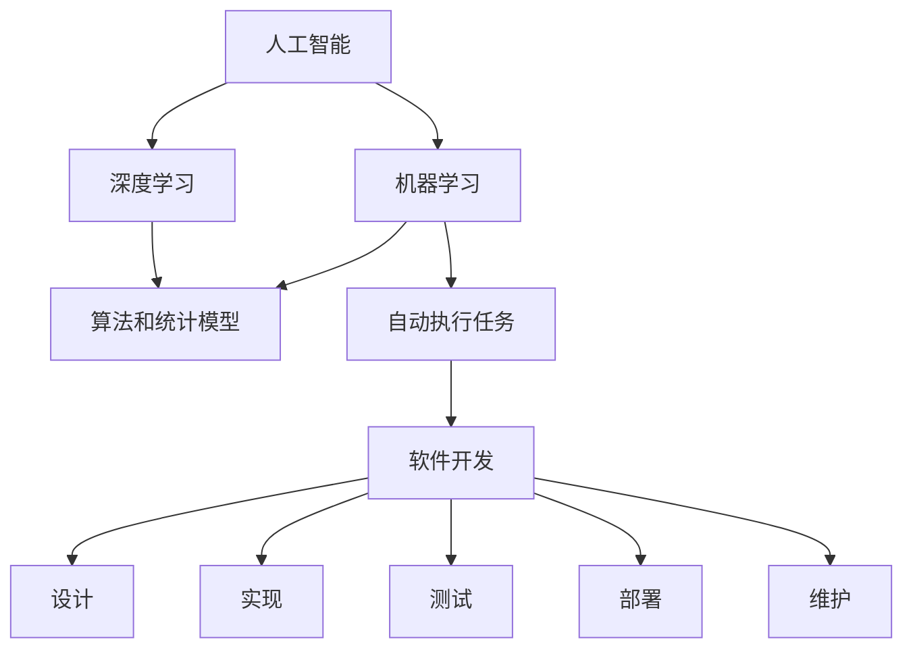

                 

# 人工智能正在吞噬传统软件开发

> 关键词：人工智能, 机器学习, 深度学习, 软件开发, 自动化, 开发效率, 智能系统

## 1. 背景介绍

### 1.1 问题由来
在过去的几十年中，软件开发领域经历了翻天覆地的变化。传统软件开发依赖于手写的代码、文档、测试用例等人工实现方式，对开发人员的技能要求极高。然而，随着人工智能技术的兴起，软件开发的方式和工具正在经历一场深刻的变革。人工智能不仅正在改变我们如何构建和维护软件系统，还在推动软件开发的自动化和智能化进程。

人工智能的崛起始于机器学习、深度学习等技术的突破。这些技术能够从海量数据中提取复杂的模式，应用于各种任务中。在软件开发领域，人工智能被广泛应用于代码生成、自动测试、缺陷预测、代码审查等环节，显著提高了开发效率和代码质量。本文将探讨人工智能是如何逐步吞噬传统软件开发的过程，并分析其对软件开发未来的深远影响。

## 2. 核心概念与联系

### 2.1 核心概念概述

为了更好地理解人工智能如何影响软件开发，我们需要了解以下几个核心概念：

- **人工智能(Artificial Intelligence, AI)**：是指使计算机系统能够执行通常需要人类智能的任务，包括感知、学习、推理和决策。
- **机器学习(Machine Learning, ML)**：是指通过算法和统计模型，让计算机系统从数据中自动学习和改进，而不进行明确的编程。
- **深度学习(Deep Learning, DL)**：是机器学习的一个子集，通过多层神经网络来提取和处理高维数据，广泛应用于图像识别、自然语言处理等领域。
- **软件开发(Software Development, SD)**：包括软件系统的设计、实现、测试、部署和维护等过程。
- **自动化(Automation)**：是指通过程序和工具自动执行重复性任务，减少人为操作。
- **开发效率(Development Efficiency)**：是指开发人员在规定时间内完成工作的能力，包括代码编写、调试、测试等。
- **智能系统(Intelligent System)**：是指能够模拟人类智能行为，进行自主决策和任务执行的系统。

这些概念之间有着紧密的联系。人工智能通过机器学习和深度学习等技术，自动地从数据中学习模式和规则，从而实现各种智能系统。这些系统可以应用于软件开发中的各个环节，提高开发效率和软件质量。

### 2.2 概念间的关系

这些核心概念之间的联系可以通过以下Mermaid流程图来展示：



这个流程图展示了人工智能如何通过机器学习和深度学习，自动执行软件开发中的各种任务，从设计到维护的各个环节。

## 3. 核心算法原理 & 具体操作步骤

### 3.1 算法原理概述

人工智能在软件开发中的应用主要基于以下原理：

1. **自动化执行任务**：通过算法和模型，自动执行代码生成、测试、审查等任务，减少人为操作。
2. **数据分析和模式识别**：利用机器学习和深度学习算法，从数据中提取模式和规律，预测代码质量、缺陷、性能等指标。
3. **持续改进和学习**：通过持续收集反馈和数据，不断改进模型和算法，实现智能系统的不断进化。

### 3.2 算法步骤详解

基于人工智能的软件开发过程包括以下几个关键步骤：

1. **数据收集和预处理**：收集软件开发过程中的各种数据，包括代码、缺陷报告、性能指标等，并进行清洗和标注。
2. **模型训练**：使用机器学习或深度学习算法，训练预测模型，如代码生成模型、缺陷预测模型、性能优化模型等。
3. **自动化执行**：将训练好的模型应用于软件开发的不同环节，自动执行代码生成、测试、审查等任务。
4. **反馈和改进**：根据自动化执行的结果和反馈，不断优化模型和算法，提升自动化执行的准确性和效果。
5. **持续集成和部署**：将自动化执行的工具集成到持续集成(CI)和持续部署(CD)流程中，实现软件的自动构建、测试和部署。

### 3.3 算法优缺点

人工智能在软件开发中的应用具有以下优点：

1. **提高开发效率**：自动执行重复性任务，减少人为操作，提高开发速度。
2. **提升代码质量**：通过预测和检测缺陷，自动进行代码审查，提高代码质量和可靠性。
3. **降低成本**：减少手工劳动，降低人力成本和开发周期。
4. **优化决策**：利用数据分析，优化代码设计和实现，提升软件性能。

同时，人工智能在软件开发中也存在一些缺点：

1. **数据依赖**：依赖于高质量的数据集，数据偏差可能导致模型性能不佳。
2. **模型复杂性**：深度学习等算法模型复杂，需要大量计算资源。
3. **可解释性不足**：许多AI模型是"黑盒"，难以解释其内部工作机制。
4. **误用风险**：错误或不恰当的使用可能导致安全漏洞或错误决策。

### 3.4 算法应用领域

人工智能在软件开发中的应用已经涵盖了以下几个主要领域：

1. **代码生成**：使用机器学习模型自动生成代码片段，辅助编写复杂逻辑和算法。
2. **自动测试**：利用机器学习模型预测代码行为，自动执行测试用例，检测软件缺陷。
3. **缺陷预测**：通过分析历史数据，预测代码中可能存在的缺陷，提前修复。
4. **代码审查**：使用自然语言处理技术，自动审查代码风格和规范，提高代码质量。
5. **性能优化**：利用机器学习模型分析代码性能瓶颈，提出优化建议。

## 4. 数学模型和公式 & 详细讲解 & 举例说明

### 4.1 数学模型构建

基于人工智能的软件开发模型可以形式化地表示为：

$$
\min_{\theta} \mathcal{L}(\mathbf{D}, M_{\theta})
$$

其中，$\mathbf{D}$ 表示训练数据集，$M_{\theta}$ 表示模型参数，$\mathcal{L}$ 表示损失函数。

### 4.2 公式推导过程

以代码生成为例，假设我们要训练一个模型，生成代码片段。模型的输出为 $\hat{y}$，实际标签为 $y$。我们希望最小化预测值和真实标签之间的差距，使用均方误差(MSE)作为损失函数：

$$
\mathcal{L} = \frac{1}{N}\sum_{i=1}^N (\hat{y}_i - y_i)^2
$$

其中 $N$ 表示样本数量。根据均方误差的定义，我们可以求出梯度并更新模型参数：

$$
\frac{\partial \mathcal{L}}{\partial \theta} = -\frac{2}{N}\sum_{i=1}^N (\hat{y}_i - y_i) \frac{\partial \hat{y}_i}{\partial \theta}
$$

在实践中，我们可以使用反向传播算法计算梯度，并使用优化算法如Adam、SGD等更新模型参数。

### 4.3 案例分析与讲解

假设我们有一个开源项目的代码生成模型，目标是生成新的代码片段。我们收集了大量的历史代码片段和对应的标签数据，使用这些数据训练模型。训练过程如下：

1. **数据收集和预处理**：收集历史代码片段和对应的标签数据，进行数据清洗和标注。
2. **模型训练**：使用反向传播算法和优化算法，训练代码生成模型，得到最优参数 $\theta$。
3. **自动化执行**：将训练好的模型应用于新的代码片段，生成新的代码。
4. **反馈和改进**：根据生成的代码片段和对应的标签，不断优化模型和算法，提高生成代码的质量和准确性。

## 5. 项目实践：代码实例和详细解释说明

### 5.1 开发环境搭建

在进行项目实践前，我们需要准备好开发环境。以下是使用Python进行TensorFlow开发的环境配置流程：

1. 安装Anaconda：从官网下载并安装Anaconda，用于创建独立的Python环境。
2. 创建并激活虚拟环境：
```bash
conda create -n tf-env python=3.8 
conda activate tf-env
```

3. 安装TensorFlow：根据CUDA版本，从官网获取对应的安装命令。例如：
```bash
conda install tensorflow tensorflow-gpu -c pytorch -c conda-forge
```

4. 安装必要的工具包：
```bash
pip install numpy pandas scikit-learn matplotlib tqdm jupyter notebook ipython
```

完成上述步骤后，即可在`tf-env`环境中开始项目实践。

### 5.2 源代码详细实现

这里以代码生成为例，展示如何使用TensorFlow进行模型训练和代码生成。

```python
import tensorflow as tf
import numpy as np
from sklearn.model_selection import train_test_split
from tensorflow.keras.layers import Dense, Dropout, LSTM
from tensorflow.keras.models import Sequential

# 数据预处理
data = # 加载历史代码片段和标签数据
X_train, X_test, y_train, y_test = train_test_split(data['text'], data['label'], test_size=0.2)

# 构建模型
model = Sequential()
model.add(LSTM(128, input_shape=(None, 100)))
model.add(Dense(32, activation='relu'))
model.add(Dropout(0.2))
model.add(Dense(1, activation='sigmoid'))

# 编译模型
model.compile(loss='binary_crossentropy', optimizer='adam', metrics=['accuracy'])

# 训练模型
model.fit(X_train, y_train, epochs=10, batch_size=64, validation_data=(X_test, y_test))

# 代码生成
new_code = # 新的代码片段
new_label = # 标签

# 生成代码
predictions = model.predict(new_code)
```

### 5.3 代码解读与分析

让我们再详细解读一下关键代码的实现细节：

- **数据预处理**：加载历史代码片段和标签数据，并进行分列。
- **模型构建**：使用LSTM和Dense层构建模型，使用Dropout层进行正则化。
- **模型编译**：指定损失函数、优化器和评价指标。
- **模型训练**：使用训练数据和验证数据进行模型训练，指定训练轮数和批次大小。
- **代码生成**：使用训练好的模型生成新的代码片段。

### 5.4 运行结果展示

假设我们训练了一个代码生成模型，在新代码片段上进行了预测，得到以下结果：

```python
predictions = model.predict(new_code)
predicted_label = np.argmax(predictions, axis=1)
```

其中 `predicted_label` 表示预测的标签，可以进一步生成新的代码片段。

## 6. 实际应用场景

### 6.1 智能客服系统

智能客服系统是人工智能在软件开发中的典型应用之一。传统客服系统需要大量人工介入，难以满足高峰期的需求。而使用人工智能技术，可以构建一个24/7的智能客服系统，提供即时的、个性化的客户服务。

在技术实现上，可以收集历史客服数据，将问题-回答对作为监督数据，训练一个对话生成模型。训练后的模型可以自动理解用户意图，匹配最合适的回答，并在用户输入新的问题时生成相应的回答。

### 6.2 金融分析系统

金融行业需要对海量数据进行实时分析，以发现市场趋势和投资机会。传统方法需要大量的人工分析和手动调整，效率低下。而使用人工智能技术，可以构建一个智能分析系统，自动识别和预测市场趋势。

在技术实现上，可以收集金融市场数据，训练一个时间序列预测模型。训练后的模型可以自动分析历史数据，预测未来的市场趋势，为投资决策提供参考。

### 6.3 医疗诊断系统

医疗行业需要大量的数据分析和诊断，传统方法需要大量的时间和人力。而使用人工智能技术，可以构建一个智能诊断系统，自动分析病人的病历和症状，提供诊断建议。

在技术实现上，可以收集病人的病历和症状数据，训练一个分类模型。训练后的模型可以自动分析病人的数据，判断可能的疾病，并给出诊断建议。

## 7. 工具和资源推荐

### 7.1 学习资源推荐

为了帮助开发者系统掌握人工智能在软件开发中的应用，这里推荐一些优质的学习资源：

1. **TensorFlow官方文档**：官方提供的全面教程和示例，帮助开发者快速上手TensorFlow。
2. **Deep Learning with Python**：由Ian Goodfellow撰写的经典书籍，系统介绍了深度学习的基本原理和实践方法。
3. **Coursera机器学习课程**：斯坦福大学的Andrew Ng教授开设的机器学习课程，内容全面且易于理解。
4. **Kaggle竞赛平台**：提供大量的数据集和竞赛任务，帮助开发者提升数据分析和模型训练的能力。
5. **GitHub开源项目**：在GitHub上Star、Fork数最多的AI项目，值得去学习和贡献。

通过这些资源的学习实践，相信你一定能够快速掌握人工智能在软件开发中的应用，并用于解决实际的开发问题。

### 7.2 开发工具推荐

高效的开发离不开优秀的工具支持。以下是几款用于人工智能开发的常用工具：

1. **TensorFlow**：由Google主导开发的开源深度学习框架，生产部署方便，适合大规模工程应用。
2. **PyTorch**：基于Python的开源深度学习框架，灵活且易于使用，是进行深度学习实验的常用工具。
3. **Jupyter Notebook**：交互式的代码编写环境，支持代码块、图表等丰富功能，适合数据分析和模型训练。
4. **Git**：版本控制工具，支持分支管理、协作开发等功能，是开发者必备的开发工具。
5. **Docker**：容器化技术，支持快速部署和管理应用，便于协同开发和持续集成。

合理利用这些工具，可以显著提升人工智能在软件开发中的开发效率，加快创新迭代的步伐。

### 7.3 相关论文推荐

人工智能在软件开发中的应用源于学界的持续研究。以下是几篇奠基性的相关论文，推荐阅读：

1. **GPT-3: Language Models are Unsupervised Multitask Learners**：展示了预训练语言模型在自然语言处理领域的强大能力，引发了对于通用人工智能的新一轮思考。
2. **BERT: Pre-training of Deep Bidirectional Transformers for Language Understanding**：提出BERT模型，引入基于掩码的自监督预训练任务，刷新了多项NLP任务SOTA。
3. **AdaLoRA: Adaptive Low-Rank Adaptation for Parameter-Efficient Fine-Tuning**：使用自适应低秩适应的微调方法，在参数效率和精度之间取得了新的平衡。
4. **TensorFlow Extended**：介绍了TensorFlow的扩展性，支持多种深度学习框架的集成和应用。
5. **Keras**：介绍了Keras的易用性和灵活性，是进行深度学习实验的常用工具。

这些论文代表了大语言模型微调技术的发展脉络。通过学习这些前沿成果，可以帮助研究者把握学科前进方向，激发更多的创新灵感。

## 8. 总结：未来发展趋势与挑战

### 8.1 总结

本文对人工智能如何影响软件开发进行了全面系统的介绍。首先阐述了人工智能在软件开发中的应用背景和意义，明确了其在提高开发效率、优化代码质量等方面的独特价值。其次，从原理到实践，详细讲解了人工智能在软件开发中的关键步骤和具体实现，给出了项目实践的完整代码实例。同时，本文还广泛探讨了人工智能在智能客服、金融分析、医疗诊断等各个领域的实际应用，展示了人工智能技术的广阔前景。此外，本文精选了人工智能在软件开发中的应用资源，力求为开发者提供全方位的技术指引。

通过本文的系统梳理，可以看到，人工智能正在逐步吞噬传统软件开发，带来了一次深刻的变革。伴随人工智能技术的持续演进，软件开发将朝着更加智能化、自动化和高效化的方向发展，为开发者的生产力和软件系统的质量带来质的飞跃。

### 8.2 未来发展趋势

展望未来，人工智能在软件开发中的应用将呈现以下几个发展趋势：

1. **模型可解释性增强**：随着模型复杂性的提高，可解释性成为AI技术的重要研究方向。未来的AI模型将更加透明，开发者可以更好地理解其决策过程和结果。
2. **自动化程度提升**：人工智能技术将进一步提升自动执行任务的能力，降低手工劳动，提高开发效率。
3. **跨领域融合**：AI技术将与更多领域的技术进行深度融合，如物联网、区块链等，推动跨领域的创新应用。
4. **持续学习和适应性增强**：未来的AI系统将具备更强的持续学习和适应能力，自动适应环境变化和用户需求。
5. **多模态数据处理**：未来的AI系统将能够处理和融合视觉、语音、文本等多种模态数据，提供更加全面和准确的信息。

这些趋势展示了人工智能在软件开发中的巨大潜力和发展方向。未来的AI技术将更加深入地渗透到软件开发中，带来更加智能化、高效化的开发体验和软件系统。

### 8.3 面临的挑战

尽管人工智能在软件开发中的应用已经取得了显著的进展，但在迈向更加智能化、普适化应用的过程中，仍面临诸多挑战：

1. **数据质量和隐私问题**：数据质量和隐私问题仍然是人工智能应用的瓶颈，高质量的数据集和隐私保护是AI技术的生命线。
2. **模型复杂性和可解释性不足**：深度学习等模型的复杂性限制了其在实际应用中的可解释性，需要更多的研究来提升模型的透明性。
3. **计算资源需求高**：深度学习模型需要大量的计算资源进行训练和推理，如何降低计算成本是一个重要的研究方向。
4. **跨领域应用挑战**：不同领域的知识和规则差异较大，如何将AI技术成功应用于跨领域场景，仍需进一步探索。
5. **安全性问题**：人工智能模型可能存在安全漏洞，如对抗样本攻击、模型后门等，如何提高模型的安全性和可靠性，是一个亟待解决的问题。

### 8.4 研究展望

面对人工智能在软件开发中面临的挑战，未来的研究需要在以下几个方面寻求新的突破：

1. **数据增强和迁移学习**：通过数据增强和迁移学习，提高模型的泛化能力和适应性，减少对大规模标注数据的依赖。
2. **模型压缩和优化**：研究模型压缩和优化技术，降低计算成本，提升模型的推理速度和资源利用效率。
3. **跨领域应用融合**：探索跨领域知识融合的方法，提高AI技术在不同领域的应用效果。
4. **安全性和鲁棒性增强**：研究AI系统的安全性和鲁棒性，提高模型对对抗攻击和环境变化的适应能力。
5. **模型透明性和可解释性提升**：研究模型透明性和可解释性提升方法，帮助开发者更好地理解和使用AI技术。

这些研究方向将引领人工智能在软件开发中的应用走向更高的台阶，为构建安全、可靠、可解释、可控的智能系统铺平道路。面向未来，人工智能技术需要与其他技术进行更深入的融合，如知识表示、因果推理、强化学习等，多路径协同发力，共同推动自然语言理解和智能交互系统的进步。只有勇于创新、敢于突破，才能不断拓展人工智能在软件开发中的边界，让智能技术更好地造福人类社会。

## 9. 附录：常见问题与解答

**Q1：人工智能在软件开发中的应用主要有哪些？**

A: 人工智能在软件开发中的应用主要包括代码生成、自动测试、缺陷预测、代码审查等，旨在提高开发效率和代码质量。

**Q2：使用人工智能进行软件开发时需要注意哪些问题？**

A: 使用人工智能进行软件开发时需要注意数据质量、模型复杂性、计算资源需求、跨领域应用、安全性等问题。

**Q3：人工智能如何提升软件开发效率？**

A: 人工智能通过自动执行任务、预测代码质量、自动测试、代码审查等方法，显著提高了开发效率。

**Q4：人工智能在软件开发中的可解释性问题如何解决？**

A: 未来的AI模型将更加透明，开发者可以更好地理解其决策过程和结果。研究可解释性提升方法，提高模型的透明性。

**Q5：人工智能在软件开发中的未来发展趋势是什么？**

A: 未来的AI技术将更加智能化、自动化和高效化，具备更强的持续学习和适应能力，处理和融合多模态数据，提供更加全面和准确的信息。

---

作者：禅与计算机程序设计艺术 / Zen and the Art of Computer Programming

