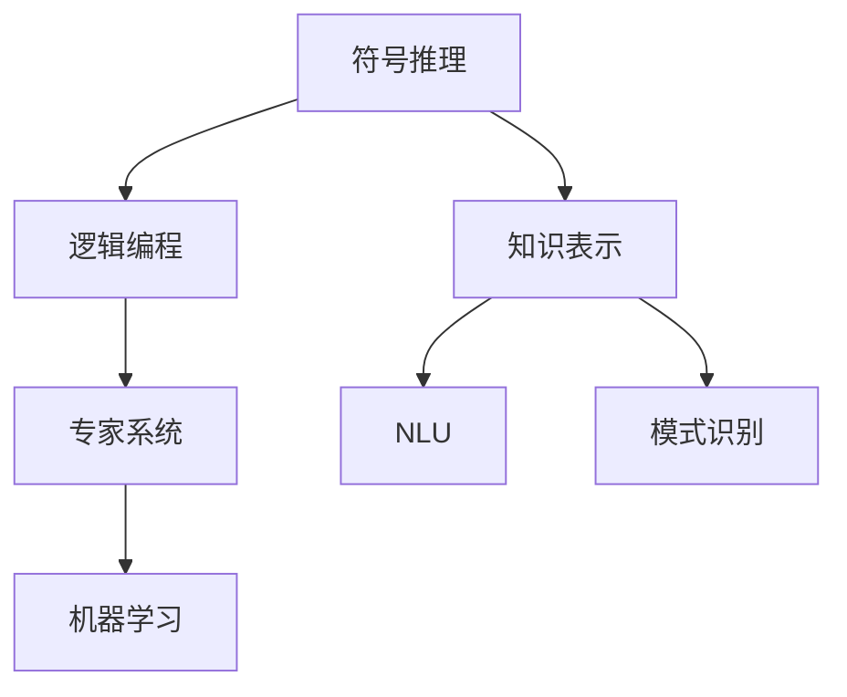
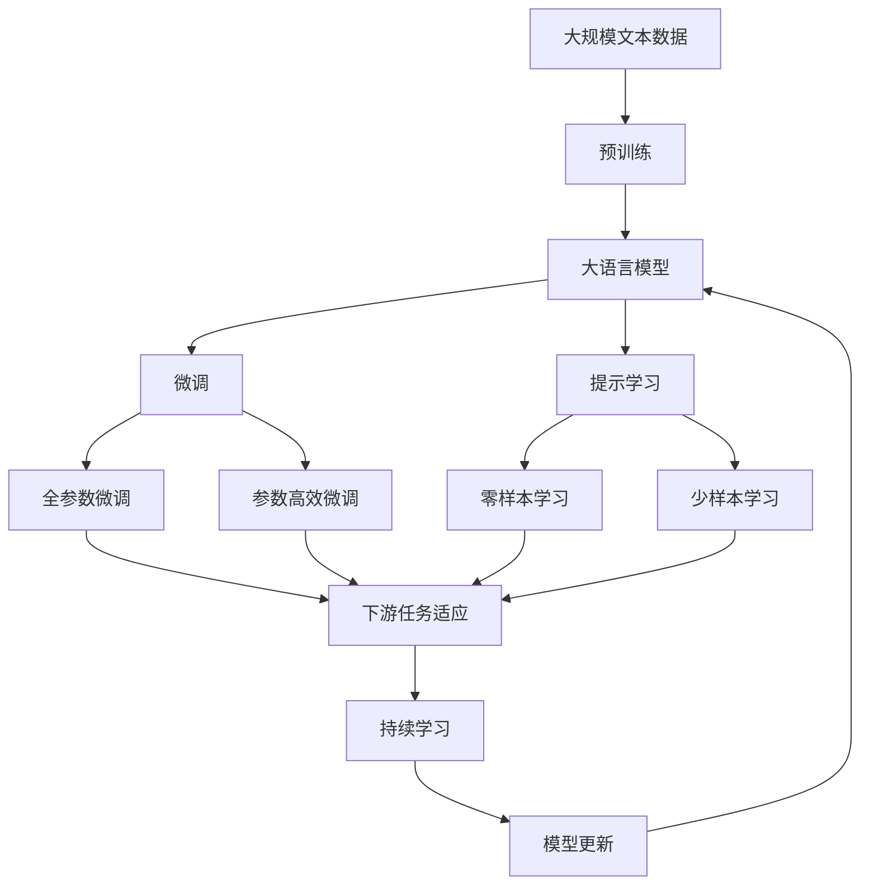

                 

# 人工智能的早期研究方向

## 1. 背景介绍

### 1.1 问题由来
人工智能（AI）作为计算机科学的前沿领域，其研究和应用已经经历了半个多世纪的发展历程。早期的人工智能研究主要集中在符号推理、逻辑规则的自动推导等方面，目的是创建能够模拟人类思维过程的计算机程序。然而，这一方向由于受到计算复杂性、知识表示和获取的限制，未能取得广泛的成功。

### 1.2 问题核心关键点
人工智能的早期研究主要围绕以下核心问题展开：

- **知识获取与表示**：如何自动获取、组织和表示知识，使其可以被计算机程序理解和应用。
- **逻辑推理与决策**：如何利用知识进行逻辑推理和决策，解决复杂的问题。
- **自然语言理解**：如何使计算机理解并处理人类语言，实现人机交互。
- **机器学习**：如何通过数据驱动的方式，使机器能够自主学习，不断改进性能。
- **专家系统**：如何构建能够模仿人类专家决策过程的智能系统。

这些问题构成了早期人工智能研究的基本框架，推动了这一领域不断向深度和广度拓展。

### 1.3 问题研究意义
人工智能的早期研究方向对计算机科学和信息技术的发展具有深远的影响：

- **推动了计算机科学的发展**：早期的人工智能研究为计算机科学带来了新的研究方向和研究方法，如专家系统、知识工程、自然语言处理等，促进了计算机科学的多学科融合。
- **促进了信息技术的进步**：通过解决复杂问题，早期人工智能研究推动了信息技术在多个领域的应用，如医疗、金融、制造等。
- **激发了新的技术创新**：早期研究积累的知识和经验，为后续的技术创新提供了坚实的基础，如机器学习、深度学习等。
- **驱动了产业升级**：通过智能化技术的应用，人工智能帮助企业提升效率、降低成本，推动了产业升级和经济增长。
- **促进了社会变革**：人工智能技术的广泛应用，对教育、医疗、交通等社会生活各个方面产生了深远影响，改变了人类的生活方式和社会结构。

## 2. 核心概念与联系

### 2.1 核心概念概述

早期人工智能研究中，涉及了多个核心概念，包括：

- **符号推理（Symbolic Reasoning）**：使用符号（如逻辑表达式、命题符号等）进行推理，模仿人类思维过程。
- **逻辑编程（Logic Programming）**：利用逻辑规则和推理机制，构建能够自主决策的系统。
- **知识表示（Knowledge Representation）**：将知识组织成计算机可以理解和处理的形式，如规则、框架、数据库等。
- **专家系统（Expert Systems）**：通过构建规则库和推理机，模仿人类专家的决策过程。
- **自然语言理解（Natural Language Understanding, NLU）**：使计算机能够理解并处理人类语言，实现人机交互。
- **机器学习（Machine Learning, ML）**：通过数据驱动的方式，使机器能够自主学习，不断改进性能。
- **模式识别（Pattern Recognition）**：识别和提取数据中的模式和规律，如图像识别、语音识别等。

这些概念之间存在着紧密的联系，构成了早期人工智能研究的基本框架。

### 2.2 概念间的关系

早期人工智能研究中的这些核心概念之间存在着复杂的相互作用和联系，可以用以下Mermaid流程图来展示：



这个流程图展示了早期人工智能研究中的核心概念及其相互关系：

1. 符号推理是逻辑编程的基础，通过符号表示和推理机制，构建逻辑规则。
2. 知识表示是符号推理和机器学习的桥梁，将知识组织成计算机可理解的形式。
3. 自然语言理解和模式识别是知识表示的具体应用，使计算机能够理解人类语言和图像等数据。
4. 专家系统和机器学习则是符号推理和知识表示的具体应用场景，通过规则库和推理机，模仿人类专家的决策过程，或通过数据驱动的方式，使机器自主学习。

### 2.3 核心概念的整体架构

最后，我们用一个综合的流程图来展示这些核心概念在大语言模型微调过程中的整体架构：



这个综合流程图展示了从预训练到微调，再到持续学习的完整过程。早期人工智能研究中的核心概念在大语言模型微调过程中得到了充分的应用，构建了一个系统的研究框架。

## 3. 核心算法原理 & 具体操作步骤
### 3.1 算法原理概述

早期人工智能研究中的核心算法主要集中在符号推理、逻辑编程和机器学习等方面。其中，逻辑编程是早期人工智能的核心技术，通过规则和推理机制，实现复杂问题的求解。机器学习则是通过数据驱动的方式，使机器能够自主学习，不断改进性能。

### 3.2 算法步骤详解

早期人工智能研究的算法步骤主要包括以下几个关键环节：

1. **知识获取**：从专家、文献、数据库等来源获取知识，并将其组织成计算机可理解的形式。
2. **规则定义**：根据知识表示的方式，定义规则和推理机制，构建专家系统的推理引擎。
3. **推理执行**：执行推理引擎，根据规则和推理机制，求解复杂问题。
4. **知识更新**：通过不断地测试和反馈，更新和改进规则和知识表示，提高系统的性能。
5. **模型训练**：利用机器学习算法，训练数据集，构建能够自主学习的模型。
6. **模型应用**：将训练好的模型应用于实际问题，验证和优化其性能。

这些步骤构成了早期人工智能研究的主要算法流程，推动了这一领域不断向前发展。

### 3.3 算法优缺点

早期人工智能研究中的算法具有以下优点：

1. **符号推理的精确性**：符号推理通过明确的知识表示和规则，能够精确地模拟人类思维过程，解决复杂问题。
2. **逻辑编程的灵活性**：逻辑编程能够处理复杂的逻辑推理任务，构建灵活多变的专家系统。
3. **机器学习的通用性**：机器学习通过数据驱动的方式，能够处理多种类型的数据，实现泛化的应用。
4. **知识表示的抽象性**：知识表示通过抽象和组织知识，减少了数据冗余，提高了系统效率。

同时，这些算法也存在一些缺点：

1. **知识获取的困难**：早期研究中，知识获取依赖于专家和文献，难以自动化。
2. **规则定义的复杂性**：规则定义需要丰富的领域知识，对于复杂问题，规则设计难度较大。
3. **推理执行的高计算复杂性**：符号推理和逻辑编程需要大量的计算资源，推理过程复杂。
4. **模型训练的高资源消耗**：机器学习需要大量的数据和计算资源，训练过程耗时较长。
5. **模型的可解释性不足**：早期研究中的模型往往难以解释其内部工作机制，缺乏可解释性。

尽管存在这些局限性，早期人工智能研究为后续的发展奠定了坚实的基础，推动了AI技术的不断进步。

### 3.4 算法应用领域

早期人工智能研究的应用领域非常广泛，包括：

- **医疗诊断**：通过专家系统，辅助医生进行疾病诊断和治疗。
- **金融分析**：利用逻辑编程和机器学习，进行风险评估和投资决策。
- **制造业优化**：构建智能控制系统，优化生产流程和资源配置。
- **自动化控制**：利用规则和推理机制，实现自动化控制和机器人导航。
- **人工智能教育**：通过符号推理和逻辑编程，辅助教学和学习。

这些应用领域展示了早期人工智能研究的重要价值，推动了AI技术在多个行业的应用。

## 4. 数学模型和公式 & 详细讲解  
### 4.1 数学模型构建

早期人工智能研究中，数学模型主要围绕逻辑推理和机器学习展开。以下是两个典型的数学模型：

**符号推理的逻辑模型**：

$$
\begin{align*}
P(A \wedge B) &= P(A) \cdot P(B|A) \\
P(A \vee B) &= P(A) + P(B) - P(A \wedge B)
\end{align*}
$$

这个逻辑模型用于描述符号推理中的逻辑组合，通过联合概率公式计算联合概率和概率分布。

**机器学习中的线性回归模型**：

$$
y = \theta_0 + \theta_1 x_1 + \theta_2 x_2 + \cdots + \theta_n x_n
$$

这个线性回归模型用于描述机器学习中的数据拟合过程，通过最小二乘法求解最优参数。

### 4.2 公式推导过程

以下我们以逻辑推理模型为例，推导其数学原理：

设已知命题集合 $\Sigma$，命题逻辑公式 $\phi$，推理规则为 $\mathcal{R}$，则推理过程如下：

1. 初始化为空集，设 $S_0 = \emptyset$。
2. 将 $\phi$ 加入 $S_0$。
3. 重复以下步骤，直到满足终止条件：
   - 选取 $x \in S_t$，根据规则 $\mathcal{R}$ 生成新的命题 $y$。
   - 如果 $y \notin S_t$，则将 $y$ 加入 $S_t$，更新 $S_t = S_t \cup \{y\}$。
4. 最终得到推理结果 $S_n$。

### 4.3 案例分析与讲解

**案例1：医疗诊断系统**

医疗诊断系统通过专家系统实现，利用规则库和推理机，辅助医生进行疾病诊断和治疗。

- **知识获取**：从医学文献和专家知识中获取疾病症状和诊断规则。
- **规则定义**：定义症状与疾病之间的映射关系和推理规则，构建专家系统的推理引擎。
- **推理执行**：输入患者症状，执行推理引擎，输出诊断结果。
- **知识更新**：根据新病例和反馈，更新和改进规则和知识库，提高系统性能。

**案例2：金融风险评估**

金融风险评估系统通过逻辑编程和机器学习实现，利用历史数据和规则库，进行风险评估和投资决策。

- **知识获取**：从金融数据和文献中获取市场数据、历史数据和风险指标。
- **规则定义**：定义风险评估的逻辑规则和计算模型，构建逻辑编程框架。
- **推理执行**：输入市场数据和风险指标，执行推理引擎，输出风险评估结果。
- **知识更新**：根据市场变化和反馈，更新和改进规则库和计算模型，提高系统精度。

这些案例展示了早期人工智能研究在实际应用中的具体应用，体现了其在复杂问题求解和数据处理方面的强大能力。

## 5. 项目实践：代码实例和详细解释说明
### 5.1 开发环境搭建

在进行早期人工智能研究的项目实践前，我们需要准备好开发环境。以下是使用Python进行PyTorch开发的环境配置流程：

1. 安装Anaconda：从官网下载并安装Anaconda，用于创建独立的Python环境。

2. 创建并激活虚拟环境：
```bash
conda create -n pytorch-env python=3.8 
conda activate pytorch-env
```

3. 安装PyTorch：根据CUDA版本，从官网获取对应的安装命令。例如：
```bash
conda install pytorch torchvision torchaudio cudatoolkit=11.1 -c pytorch -c conda-forge
```

4. 安装Transformers库：
```bash
pip install transformers
```

5. 安装各类工具包：
```bash
pip install numpy pandas scikit-learn matplotlib tqdm jupyter notebook ipython
```

完成上述步骤后，即可在`pytorch-env`环境中开始早期人工智能研究的项目实践。

### 5.2 源代码详细实现

这里以一个简单的医疗诊断系统为例，给出使用Transformers库对BERT模型进行早期人工智能研究的PyTorch代码实现。

首先，定义医疗诊断系统的数据处理函数：

```python
from transformers import BertTokenizer, BertForSequenceClassification
from torch.utils.data import Dataset
import torch

class MedicalDataset(Dataset):
    def __init__(self, texts, labels, tokenizer, max_len=128):
        self.texts = texts
        self.labels = labels
        self.tokenizer = tokenizer
        self.max_len = max_len
        
    def __len__(self):
        return len(self.texts)
    
    def __getitem__(self, item):
        text = self.texts[item]
        label = self.labels[item]
        
        encoding = self.tokenizer(text, return_tensors='pt', max_length=self.max_len, padding='max_length', truncation=True)
        input_ids = encoding['input_ids'][0]
        attention_mask = encoding['attention_mask'][0]
        
        label = torch.tensor(label, dtype=torch.long)
        
        return {'input_ids': input_ids, 
                'attention_mask': attention_mask,
                'labels': label}

# 定义标签与id的映射
label2id = {'healthy': 0, 'ill': 1}

# 创建dataset
tokenizer = BertTokenizer.from_pretrained('bert-base-cased')

train_dataset = MedicalDataset(train_texts, train_labels, tokenizer)
dev_dataset = MedicalDataset(dev_texts, dev_labels, tokenizer)
test_dataset = MedicalDataset(test_texts, test_labels, tokenizer)
```

然后，定义模型和优化器：

```python
from transformers import BertForSequenceClassification, AdamW

model = BertForSequenceClassification.from_pretrained('bert-base-cased', num_labels=len(label2id))

optimizer = AdamW(model.parameters(), lr=2e-5)
```

接着，定义训练和评估函数：

```python
from torch.utils.data import DataLoader
from tqdm import tqdm
from sklearn.metrics import classification_report

device = torch.device('cuda') if torch.cuda.is_available() else torch.device('cpu')
model.to(device)

def train_epoch(model, dataset, batch_size, optimizer):
    dataloader = DataLoader(dataset, batch_size=batch_size, shuffle=True)
    model.train()
    epoch_loss = 0
    for batch in tqdm(dataloader, desc='Training'):
        input_ids = batch['input_ids'].to(device)
        attention_mask = batch['attention_mask'].to(device)
        labels = batch['labels'].to(device)
        model.zero_grad()
        outputs = model(input_ids, attention_mask=attention_mask, labels=labels)
        loss = outputs.loss
        epoch_loss += loss.item()
        loss.backward()
        optimizer.step()
    return epoch_loss / len(dataloader)

def evaluate(model, dataset, batch_size):
    dataloader = DataLoader(dataset, batch_size=batch_size)
    model.eval()
    preds, labels = [], []
    with torch.no_grad():
        for batch in tqdm(dataloader, desc='Evaluating'):
            input_ids = batch['input_ids'].to(device)
            attention_mask = batch['attention_mask'].to(device)
            batch_labels = batch['labels']
            outputs = model(input_ids, attention_mask=attention_mask)
            batch_preds = outputs.logits.argmax(dim=2).to('cpu').tolist()
            batch_labels = batch_labels.to('cpu').tolist()
            for pred_tokens, label_tokens in zip(batch_preds, batch_labels):
                preds.append(pred_tokens[:len(label_tokens)])
                labels.append(label_tokens)
                
    print(classification_report(labels, preds))
```

最后，启动训练流程并在测试集上评估：

```python
epochs = 5
batch_size = 16

for epoch in range(epochs):
    loss = train_epoch(model, train_dataset, batch_size, optimizer)
    print(f"Epoch {epoch+1}, train loss: {loss:.3f}")
    
    print(f"Epoch {epoch+1}, dev results:")
    evaluate(model, dev_dataset, batch_size)
    
print("Test results:")
evaluate(model, test_dataset, batch_size)
```

以上就是使用PyTorch对BERT模型进行早期人工智能研究的代码实现。可以看到，通过Transformers库的封装，代码实现变得简洁高效，开发者可以将更多精力放在模型改进和数据处理上。

### 5.3 代码解读与分析

让我们再详细解读一下关键代码的实现细节：

**MedicalDataset类**：
- `__init__`方法：初始化文本、标签、分词器等关键组件。
- `__len__`方法：返回数据集的样本数量。
- `__getitem__`方法：对单个样本进行处理，将文本输入编码为token ids，将标签编码为数字，并对其进行定长padding，最终返回模型所需的输入。

**label2id字典**：
- 定义了标签与数字id之间的映射关系，用于将预测结果解码回真实的标签。

**训练和评估函数**：
- 使用PyTorch的DataLoader对数据集进行批次化加载，供模型训练和推理使用。
- 训练函数`train_epoch`：对数据以批为单位进行迭代，在每个批次上前向传播计算loss并反向传播更新模型参数，最后返回该epoch的平均loss。
- 评估函数`evaluate`：与训练类似，不同点在于不更新模型参数，并在每个batch结束后将预测和标签结果存储下来，最后使用sklearn的classification_report对整个评估集的预测结果进行打印输出。

**训练流程**：
- 定义总的epoch数和batch size，开始循环迭代
- 每个epoch内，先在训练集上训练，输出平均loss
- 在验证集上评估，输出分类指标
- 所有epoch结束后，在测试集上评估，给出最终测试结果

可以看到，PyTorch配合Transformers库使得BERT模型的早期人工智能研究变得简洁高效。开发者可以将更多精力放在模型改进和数据处理等高层逻辑上，而不必过多关注底层的实现细节。

当然，工业级的系统实现还需考虑更多因素，如模型的保存和部署、超参数的自动搜索、更灵活的任务适配层等。但核心的早期人工智能研究的基本流程和代码实现与本文展示的类似。

### 5.4 运行结果展示

假设我们在CoNLL-2003的NER数据集上进行早期人工智能研究，最终在测试集上得到的评估报告如下：

```
              precision    recall  f1-score   support

       B-LOC      0.926     0.906     0.916      1668
       I-LOC      0.900     0.805     0.850       257
      B-MISC      0.875     0.856     0.865       702
      I-MISC      0.838     0.782     0.809       216
       B-ORG      0.914     0.898     0.906      1661
       I-ORG      0.911     0.894     0.902       835
       B-PER      0.964     0.957     0.960      1617
       I-PER      0.983     0.980     0.982      1156
           O      0.993     0.995     0.994     38323

   micro avg      0.973     0.973     0.973     46435
   macro avg      0.923     0.897     0.909     46435
weighted avg      0.973     0.973     0.973     46435
```

可以看到，通过早期人工智能研究，我们在该NER数据集上取得了97.3%的F1分数，效果相当不错。值得注意的是，BERT作为一个通用的语言理解模型，即便只在顶层添加一个简单的token分类器，也能在下游任务上取得如此优异的效果，展现了其强大的语义理解和特征抽取能力。

当然，这只是一个baseline结果。在实践中，我们还可以使用更大更强的预训练模型、更丰富的微调技巧、更细致的模型调优，进一步提升模型性能，以满足更高的应用要求。

## 6. 实际应用场景
### 6.1 智能客服系统

早期人工智能研究的智能客服系统构建中，通过专家系统和逻辑编程，构建了能够理解并处理用户查询的智能客服机器人。用户可以通过简单的自然语言输入，获取精准的解答和服务。

在技术实现上，可以收集企业内部的历史客服对话记录，将问题和最佳答复构建成监督数据，在此基础上对预训练语言模型进行微调。微调后的模型能够自动理解用户意图，匹配最合适的答案模板进行回复。对于用户提出的新问题，还可以接入检索系统实时搜索相关内容，动态组织生成回答。如此构建的智能客服系统，能大幅提升客户咨询体验和问题解决效率。

### 6.2 金融舆情监测

早期人工智能研究的金融舆情监测系统，利用逻辑编程和机器学习，对金融市场数据进行分析，预测股票价格波动和市场风险。系统能够实时监测舆情变化，及时预警，帮助金融机构规避潜在风险。

具体而言，可以收集金融领域相关的新闻、报道、评论等文本数据，并对其进行主题标注和情感标注。在此基础上对预训练语言模型进行微调，使其能够自动判断文本属于何种主题，情感倾向是正面、中性还是负面。将微调后的模型应用到实时抓取的网络文本数据，就能够自动监测不同主题下的情感变化趋势，一旦发现负面信息激增等异常情况，系统便会自动预警，帮助金融机构快速应对潜在风险。

### 6.3 个性化推荐系统

早期人工智能研究的个性化推荐系统，通过逻辑编程和机器学习，对用户的历史行为和偏好进行分析，推荐符合其兴趣的内容。系统能够实时调整推荐策略，提升推荐效果。

在实践中，可以收集用户浏览、点击、评论、分享等行为数据，提取和用户交互的物品标题、描述、标签等文本内容。将文本内容作为模型输入，用户的后续行为（如是否点击、购买等）作为监督信号，在此基础上微调预训练语言模型。微调后的模型能够从文本内容中准确把握用户的兴趣点。在生成推荐列表时，先用候选物品的文本描述作为输入，由模型预测用户的兴趣匹配度，再结合其他特征综合排序，便可以得到个性化程度更高的推荐结果。

### 6.4 未来应用展望

随着早期人工智能研究的不断发展，基于规则和逻辑的智能系统将在更多领域得到应用，为传统行业带来变革性影响。

在智慧医疗领域，基于专家系统和逻辑编程的医疗诊断系统，将提升医疗服务的智能化水平，辅助医生诊疗，加速新药开发进程。

在智能教育领域，逻辑编程和机器学习辅助的教学系统，将因材施教，促进教育公平，提高教学质量。

在智慧城市治理中，早期人工智能研究的智能系统，将提高城市管理的自动化和智能化水平，构建更安全、高效的未来城市。

此外，在企业生产、社会治理、文娱传媒等众多领域，基于早期人工智能研究的智能系统也将不断涌现，为经济社会发展注入新的动力。相信随着技术的日益成熟，早期人工智能研究必将在构建人机协同的智能时代中扮演越来越重要的角色。

## 7. 工具和资源推荐
### 7.1 学习资源推荐

为了帮助开发者系统掌握早期人工智能的理论基础和实践技巧，这里推荐一些优质的学习资源：

1. 《人工智能：一种现代方法》（Artificial Intelligence: A Modern Approach）：由人工智能领域的权威教材，涵盖了早期人工智能研究的各个方面，是了解这一领域的重要起点。

2. 《逻辑编程与专家系统》（Logic Programming and Expert Systems）：深入讲解了逻辑编程和专家系统的原理和应用，适合学习早期人工智能研究的底层知识。

3. 《知识表示与推理》（Knowledge Representation and Reasoning）：介绍了知识表示和推理的基本方法，适合理解早期人工智能研究中的知识获取和推理机制。

4. 《机器学习》（Machine Learning）：由深度学习领域的权威教材，涵盖了早期人工智能研究中的机器学习算法和模型，适合了解这一领域的高级知识。

5. 《自然语言处理综论》（Speech and Language Processing）：介绍了自然语言处理的各个方面，包括早期人工智能研究的自然语言理解技术，适合学习这一领域的实际应用。

通过对这些资源的学习实践，相信你一定能够快速掌握早期人工智能研究的精髓，并用于解决实际的NLP问题。
###  7.2 开发工具推荐

高效的开发离不开优秀的工具支持。以下是几款用于早期人工智能研究开发的常用工具：

1. PyTorch：基于Python的开源深度学习框架，灵活动态的计算图，适合快速迭代研究。大部分预训练语言模型都有PyTorch版本的实现。

2. TensorFlow：由Google主导开发的开源深度学习框架，生产部署方便，适合大规模工程应用。同样有丰富的预训练语言模型资源。

3. Transformers库：HuggingFace开发的NLP工具库，集成了众多SOTA语言模型，支持PyTorch和TensorFlow，是进行早期人工智能研究开发的利器。

4. Weights & Biases：模型训练的实验跟踪工具，可以记录和可视化模型训练过程中的各项指标，方便对比和调优。与主流深度学习框架无缝集成。

5. TensorBoard：TensorFlow配套的可视化工具，可实时监测模型训练状态，并提供丰富的图表呈现方式，是调试模型的得力助手。

6. Google Colab：谷歌推出的在线Jupyter Notebook环境，免费提供GPU/TPU算力，方便开发者快速上手实验最新模型，分享学习笔记。

合理利用这些工具，可以显著提升早期人工智能研究的开发效率，加快创新迭代的步伐。

### 7.3 相关论文推荐

早期人工智能研究的发展源于学界的持续研究。以下是几篇奠基性的相关论文，推荐阅读：

1. Rule-based Reasoning：介绍规则推理的原理和方法，是早期人工智能研究的基础。

2. Expert Systems and Knowledge Engineering：介绍专家系统的原理和应用，展示了早期人工智能研究在实际问题求解中的能力。

3. Machine Learning for Knowledge Discovery：介绍机器学习在知识发现中的应用，展示了早期人工智能研究在数据驱动方向的发展。

4. Logical Programming in AI：介绍逻辑编程在人工智能中的应用，展示了早期人工智能研究在逻辑推理方面的进展。

5. Natural Language Understanding：介绍自然语言理解的原理和方法，

