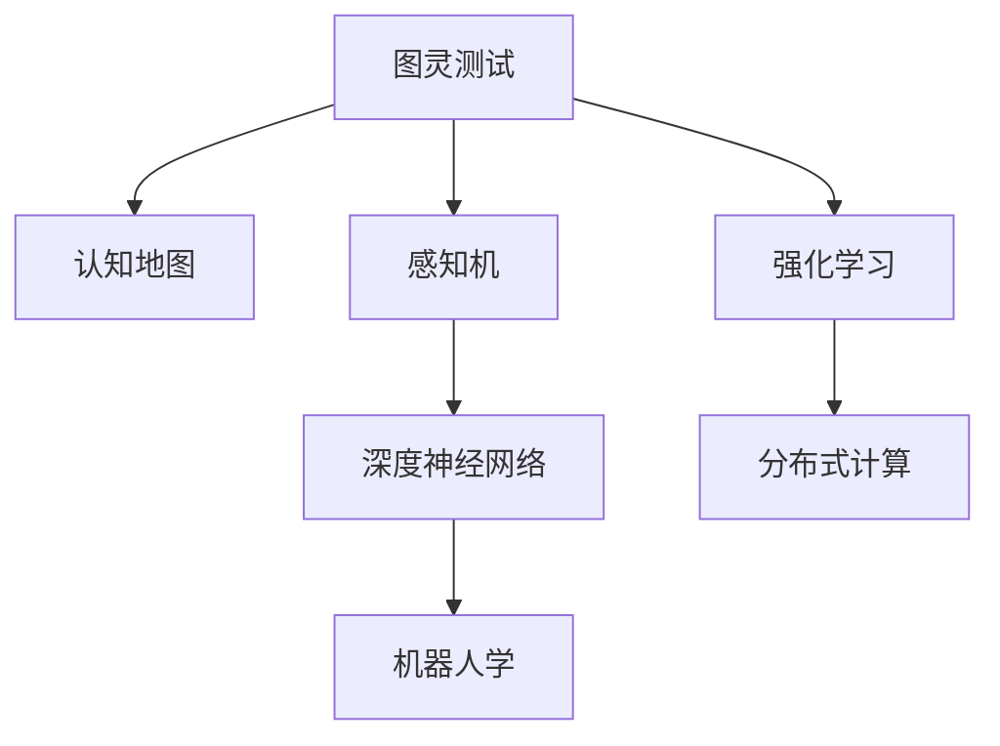
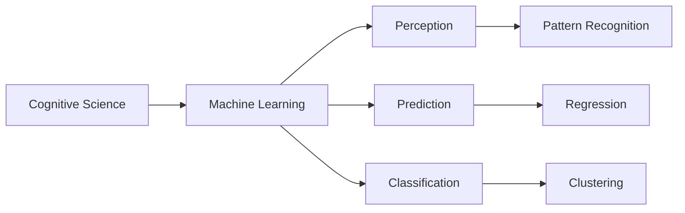
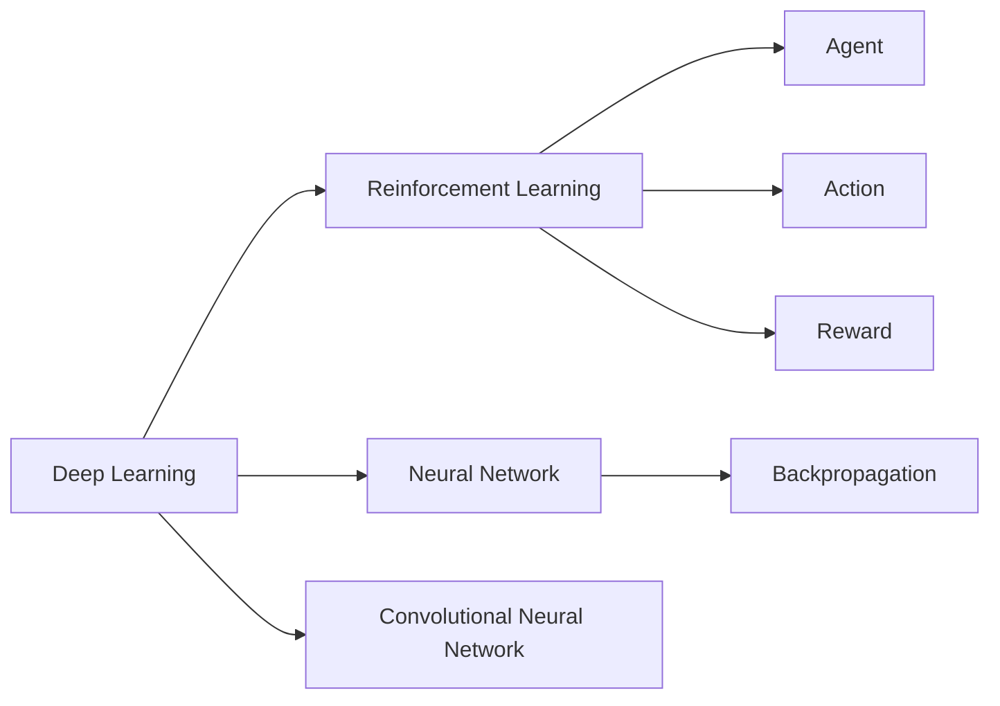
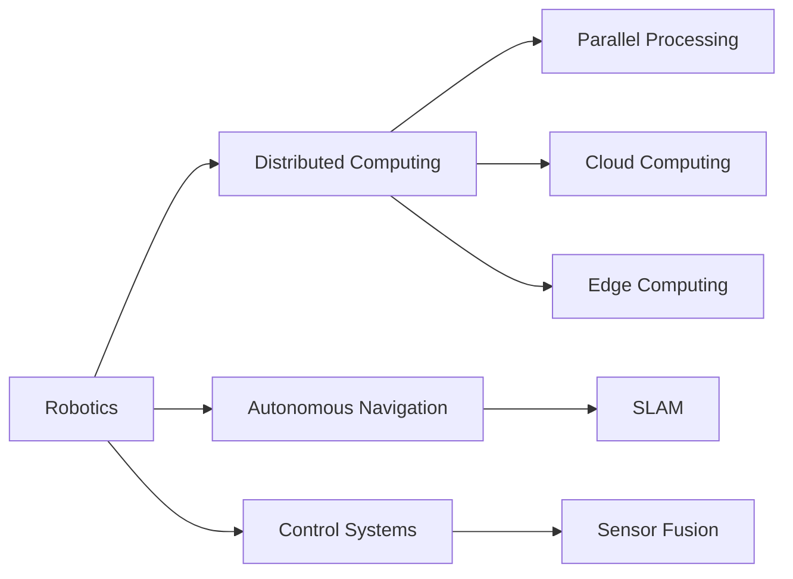
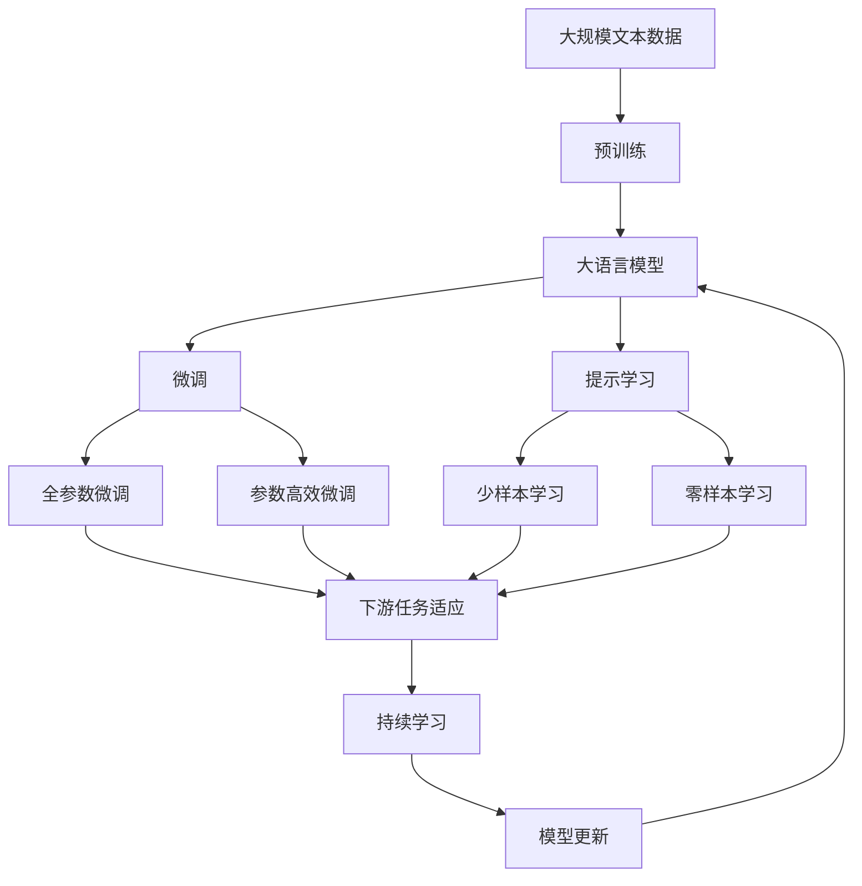

                 

# 人工智能领域的奠基者们

> 关键词：人工智能, 机器学习, 深度学习, 模式识别, 计算机视觉, 自然语言处理, 机器人学, 认知科学

## 1. 背景介绍

### 1.1 问题由来
人工智能（Artificial Intelligence, AI）是人类历史上最具革命性的技术之一。它旨在模拟和扩展人类智能，使得机器能够自主地执行各种复杂任务。人工智能的研究始于1950年代，经历了多次起伏和发展，形成了众多分支领域和研究方向。本文将介绍几位在人工智能领域做出重要贡献的奠基者，并探讨他们的工作对现代AI技术的深远影响。

### 1.2 问题核心关键点
人工智能的奠基者们通过不断的理论研究和实践探索，奠定了现代AI技术的基础。他们的工作主要集中在以下几个核心领域：

- 机器学习：通过算法和模型，让计算机从数据中自动学习和改进，以实现自主决策和任务执行。
- 深度学习：一种特殊的机器学习技术，利用多层神经网络来模拟人类大脑的决策过程，取得突破性进展。
- 模式识别：研究如何让计算机识别和理解图像、语音、文本等数据中的模式，以进行分类和预测。
- 计算机视觉：使计算机具备类似人类的视觉感知能力，实现图像和视频的自动理解和处理。
- 自然语言处理（NLP）：使计算机能够理解和生成自然语言，实现文本分析、语音识别和机器翻译等任务。
- 机器人学：研究如何让机器人具备自主移动、操作和决策能力，以实现自动化任务和协作。
- 认知科学：研究人类智能的本质和机制，为人工智能技术提供理论基础和设计指导。

这些领域的奠基者们不仅推动了技术进步，还深刻影响了社会、经济和文化的各个方面。

### 1.3 问题研究意义
了解人工智能领域的奠基者们及其贡献，对于理解AI技术的演进脉络和未来发展方向具有重要意义：

- 推动技术创新：奠基者们的开创性工作为后续研究提供了坚实基础，激发了更多创新突破。
- 促进跨学科融合：AI技术的广泛应用涉及众多学科，奠基者们的跨学科视角促进了各领域的融合与发展。
- 提升社会福祉：AI技术在医疗、教育、安全等领域的应用，为人类生活带来了前所未有的便利和改善。
- 应对未来挑战：面对未来的各种不确定性，奠基者们的智慧为应对全球性问题提供了新的思路和工具。

## 2. 核心概念与联系

### 2.1 核心概念概述

为更好地理解人工智能领域的奠基者们及其贡献，本节将介绍几个密切相关的核心概念：

- 图灵测试：由英国数学家阿兰·图灵提出，用于评估机器是否具有人类智能。通过将机器与人类对话，如果机器无法分辨对话者是否为人类，则通过图灵测试。
- 认知地图：由美国心理学家爱德华·托尔曼提出，用于描述动物和人类在环境中的认知结构和行为策略。
- 感知机：由美国数学家弗兰克·罗森布拉特提出，是一种简单的神经网络，用于图像识别和模式分类。
- 强化学习：由美国计算机科学家理查德·贝尔曼提出，研究如何让智能体通过与环境的交互，学习最优策略以最大化奖励。
- 深度神经网络：由多位科学家联合提出，是一种多层次的神经网络结构，用于处理非线性问题和高维数据。
- 分布式计算：由美国计算机科学家唐纳德·克努特提出，通过将任务分解为多个子任务并行处理，提高计算效率。
- 机器人学：涉及机械设计、控制理论、感知和决策等多个领域，致力于实现机器的自主移动和任务执行。

这些核心概念之间的逻辑关系可以通过以下Mermaid流程图来展示：



这个流程图展示了几大AI领域的核心概念及其之间的关系：

1. 图灵测试为AI的研究目标提供了理论基础，即如何实现机器的智能。
2. 认知地图描述了人类和动物的认知结构，为认知科学和机器学习提供了思路。
3. 感知机是深度学习的先驱，奠定了神经网络处理图像和模式识别的基础。
4. 强化学习为智能体决策提供了理论框架，广泛应用在机器人学和游戏AI中。
5. 深度神经网络提升了AI在复杂任务上的处理能力，成为现代AI的核心技术。
6. 分布式计算为大规模AI模型的训练和应用提供了高效的计算框架。
7. 机器人学将AI技术应用于实际物理世界，推动了自动化和智能制造的发展。

这些概念共同构成了现代AI技术的基础，为后续研究和应用提供了方向和工具。

### 2.2 概念间的关系

这些核心概念之间存在着紧密的联系，形成了人工智能技术的完整生态系统。下面我通过几个Mermaid流程图来展示这些概念之间的关系。

#### 2.2.1 认知科学与机器学习的关系



这个流程图展示了认知科学与机器学习之间的联系。认知科学为机器学习提供了理论基础，特别是对于人类认知机制的理解，为机器学习模型的设计提供了指导。同时，机器学习模型在图像识别、预测和分类等任务上的成功应用，也验证了认知科学理论的有效性。

#### 2.2.2 深度学习与强化学习的关系



这个流程图展示了深度学习与强化学习之间的关系。深度学习提供了强大的神经网络模型，用于处理高维数据和非线性问题，为强化学习提供了重要的工具。强化学习则通过奖励信号引导深度神经网络学习最优策略，二者相互促进，推动了AI技术的发展。

#### 2.2.3 机器人学与分布式计算的关系



这个流程图展示了机器人学与分布式计算之间的关系。机器人学涉及到复杂的物理操作和环境感知，需要大量的计算资源。分布式计算通过将任务分解为多个子任务并行处理，提供了高效的计算支持。同时，机器人学的实际应用，也推动了分布式计算技术的发展。

### 2.3 核心概念的整体架构

最后，我们用一个综合的流程图来展示这些核心概念在大语言模型微调过程中的整体架构：



这个综合流程图展示了从预训练到微调，再到持续学习的完整过程。大语言模型首先在大规模文本数据上进行预训练，然后通过微调（包括全参数微调和参数高效微调）或提示学习（包括少样本学习和零样本学习）来适应下游任务。最后，通过持续学习技术，模型可以不断更新和适应新的任务和数据。 通过这些流程图，我们可以更清晰地理解AI技术的各个组成部分及其相互关系，为后续深入讨论具体的AI技术奠定基础。

## 3. 核心算法原理 & 具体操作步骤
### 3.1 算法原理概述

人工智能领域的奠基者们通过一系列理论和实践，奠定了现代AI技术的基础。其核心思想是利用算法和模型，使计算机具备自主学习和改进的能力，从而实现复杂任务的自动处理。

形式化地，假设有一组训练数据集 $\{(x_i, y_i)\}_{i=1}^N$，其中 $x_i$ 为输入，$y_i$ 为输出标签。目标是在不直接监督下，通过学习数据中的规律，找到函数 $f(x)$ 来预测输出 $y$。

传统的监督学习方法包括：

- 线性回归：通过拟合一条直线来预测连续的输出。
- 逻辑回归：通过拟合一个Sigmoid函数来预测二分类问题。
- 决策树：通过构建树形结构来预测离散或连续输出。
- 支持向量机：通过构建最优的超平面来预测二分类问题。
- 随机森林：通过集成多个决策树来提高模型的泛化能力。
- 神经网络：通过多层非线性变换，实现复杂数据的分类和回归。

近年来，随着深度学习技术的兴起，这些传统的监督学习方法被更加强大的神经网络模型所取代，其中最显著的是深度神经网络（Deep Neural Networks, DNNs）。

### 3.2 算法步骤详解

人工智能领域的奠基者们通过大量的实验和理论推导，发展了各种机器学习算法和模型。以下是其中一些关键的算法步骤：

**Step 1: 数据预处理**

- 收集和标注数据集，包括训练集、验证集和测试集。
- 进行数据清洗和归一化，去除噪声和异常值，保证数据的质量。
- 进行数据增强，如旋转、平移、缩放等，增加数据的多样性。

**Step 2: 特征提取**

- 选择合适的特征提取方法，将原始数据转换为模型可以处理的输入形式。
- 对于图像数据，可以使用卷积神经网络（Convolutional Neural Networks, CNNs）来提取特征。
- 对于文本数据，可以使用词嵌入（Word Embeddings）或预训练语言模型（如BERT、GPT等）来提取特征。

**Step 3: 模型训练**

- 选择合适的模型架构，如多层感知机（Multilayer Perceptrons, MLPs）、决策树、支持向量机等。
- 使用梯度下降等优化算法，最小化模型预测输出与真实标签之间的误差。
- 进行交叉验证，防止过拟合，评估模型的泛化能力。

**Step 4: 模型评估**

- 在测试集上评估模型的性能，计算准确率、召回率、F1分数等指标。
- 使用混淆矩阵、ROC曲线等工具，可视化模型的预测结果和性能。
- 进行参数调优，如调整学习率、正则化强度等，进一步提升模型效果。

**Step 5: 模型部署**

- 将训练好的模型部署到生产环境中，进行实时推理和预测。
- 使用API接口或SDK，方便其他系统调用模型服务。
- 定期更新模型参数，保持模型的最新状态和性能。

以上是人工智能领域的一些典型算法步骤，其中深度学习技术尤为突出。

### 3.3 算法优缺点

人工智能领域的奠基者们提出的算法和模型，具有以下优点：

- 能够处理高维数据和非线性问题，具有强大的表示能力。
- 可以通过大规模数据集进行训练，提升模型的泛化能力。
- 可以进行端到端的自动学习和改进，无需人工干预。
- 可以在多个领域应用，如计算机视觉、自然语言处理、机器人学等。

同时，这些算法也存在一些缺点：

- 需要大量的数据和计算资源，成本较高。
- 模型复杂度较高，训练和推理速度较慢。
- 容易过拟合，特别是在数据量不足或特征工程不够完善的情况下。
- 模型的解释性较弱，难以理解其内部工作机制。
- 需要大量的人工干预和调整，才能得到理想的性能。

尽管存在这些缺点，但深度学习等算法在现代AI技术中仍然占据主导地位，推动了AI技术的快速发展和广泛应用。

### 3.4 算法应用领域

人工智能领域的奠基者们提出的算法和模型，已经广泛应用于多个领域，具体如下：

- 计算机视觉：用于图像分类、目标检测、人脸识别等任务。
- 自然语言处理：用于文本分类、情感分析、机器翻译等任务。
- 机器人学：用于自主导航、避障、抓取等任务。
- 医疗领域：用于疾病诊断、药物研发、医疗影像分析等任务。
- 金融领域：用于信用评估、风险管理、交易策略等任务。
- 农业领域：用于精准农业、自动驾驶、作物识别等任务。
- 安全领域：用于网络入侵检测、欺诈检测、威胁分析等任务。

## 4. 数学模型和公式 & 详细讲解 & 举例说明

### 4.1 数学模型构建

人工智能领域的奠基者们提出的算法和模型，通常基于数学模型和公式。以下是一个典型的回归模型：

假设有一组训练数据集 $\{(x_i, y_i)\}_{i=1}^N$，其中 $x_i$ 为输入，$y_i$ 为输出标签。目标是在不直接监督下，通过学习数据中的规律，找到函数 $f(x)$ 来预测输出 $y$。

回归模型通常采用线性回归的形式：

$$
y = \theta_0 + \theta_1 x_1 + \theta_2 x_2 + \ldots + \theta_n x_n
$$

其中 $\theta_0, \theta_1, \ldots, \theta_n$ 为模型的参数，$x_1, x_2, \ldots, x_n$ 为输入特征，$y$ 为输出标签。

### 4.2 公式推导过程

线性回归模型的最小二乘估计公式为：

$$
\theta = (X^T X)^{-1} X^T y
$$

其中 $X$ 为输入特征矩阵，$y$ 为输出标签向量。该公式通过最小化残差平方和，求解模型的参数 $\theta$。

在实际应用中，通常采用梯度下降等优化算法来求解模型参数，具体的优化算法如下：

$$
\theta_{k+1} = \theta_k - \eta \nabla_{\theta} L(\theta_k)
$$

其中 $\eta$ 为学习率，$L(\theta_k)$ 为损失函数，$\nabla_{\theta} L(\theta_k)$ 为损失函数对模型参数的梯度。

### 4.3 案例分析与讲解

假设有一组二分类数据集，包含100个样本，每个样本有2个特征 $x_1, x_2$ 和一个标签 $y$。目标是在不直接监督下，构建一个线性回归模型来预测样本的标签。

首先，将数据集划分为训练集和测试集，分别计算训练集和测试集的平均误差：

```python
from sklearn.linear_model import LinearRegression
from sklearn.metrics import mean_squared_error
from sklearn.model_selection import train_test_split
from sklearn.preprocessing import StandardScaler

# 生成随机数据
import numpy as np
np.random.seed(0)
X = np.random.randn(100, 2)
y = np.random.randint(2, size=100)

# 划分训练集和测试集
X_train, X_test, y_train, y_test = train_test_split(X, y, test_size=0.2)

# 标准化数据
scaler = StandardScaler()
X_train = scaler.fit_transform(X_train)
X_test = scaler.transform(X_test)

# 训练模型
model = LinearRegression()
model.fit(X_train, y_train)

# 预测测试集
y_pred = model.predict(X_test)

# 计算误差
mse_train = mean_squared_error(y_train, model.predict(X_train))
mse_test = mean_squared_error(y_test, y_pred)
print("训练集误差：", mse_train)
print("测试集误差：", mse_test)
```

通过训练集和测试集的误差，可以评估模型的性能。若训练集误差较低而测试集误差较高，说明模型过拟合。若两者误差都较高，说明模型欠拟合。

## 5. 项目实践：代码实例和详细解释说明
### 5.1 开发环境搭建

在进行AI模型开发前，我们需要准备好开发环境。以下是使用Python进行TensorFlow开发的环境配置流程：

1. 安装Anaconda：从官网下载并安装Anaconda，用于创建独立的Python环境。

2. 创建并激活虚拟环境：
```bash
conda create -n tensorflow-env python=3.8 
conda activate tensorflow-env
```

3. 安装TensorFlow：根据CUDA版本，从官网获取对应的安装命令。例如：
```bash
conda install tensorflow tensorflow-gpu -c conda-forge
```

4. 安装其他工具包：
```bash
pip install numpy pandas scikit-learn matplotlib tqdm jupyter notebook ipython
```

完成上述步骤后，即可在`tensorflow-env`环境中开始模型开发。

### 5.2 源代码详细实现

这里以一个简单的线性回归模型为例，给出使用TensorFlow进行模型开发的PyTorch代码实现。

首先，定义模型结构：

```python
import tensorflow as tf

class LinearRegressionModel(tf.keras.Model):
    def __init__(self, input_dim):
        super(LinearRegressionModel, self).__init__()
        self.linear_layer = tf.keras.layers.Dense(1, input_shape=(input_dim,))
        
    def call(self, x):
        return self.linear_layer(x)
```

然后，定义模型训练过程：

```python
# 加载数据
X_train = ...
y_train = ...

# 定义模型
model = LinearRegressionModel(input_dim=X_train.shape[1])

# 定义损失函数
loss_fn = tf.keras.losses.MeanSquaredError()

# 定义优化器
optimizer = tf.keras.optimizers.Adam(learning_rate=0.01)

# 定义评估指标
mse = tf.keras.metrics.MeanSquaredError(name='mse')

# 训练模型
@tf.function
def train_step(x, y):
    with tf.GradientTape() as tape:
        y_pred = model(x)
        loss = loss_fn(y_pred, y)
    grads = tape.gradient(loss, model.trainable_variables)
    optimizer.apply_gradients(zip(grads, model.trainable_variables))
    mse.update_state(y, y_pred)

# 训练循环
epochs = 100
for epoch in range(epochs):
    for i in range(len(X_train)):
        x_batch = X_train[i:i+batch_size]
        y_batch = y_train[i:i+batch_size]
        train_step(x_batch, y_batch)

    mse_result = mse.result().numpy()
    print(f"Epoch {epoch+1}, mse={mse_result:.4f}")
```

最后，评估模型性能：

```python
# 加载测试数据
X_test = ...
y_test = ...

# 评估模型
mse = tf.keras.metrics.MeanSquaredError()
for i in range(len(X_test)):
    x_batch = X_test[i:i+batch_size]
    y_batch = y_test[i:i+batch_size]
    train_step(x_batch, y_batch)
    mse_result = mse.result().numpy()
    print(f"Test mse={mse_result:.4f}")
```

以上就是使用TensorFlow进行线性回归模型开发的完整代码实现。可以看到，TensorFlow提供了高效的自动微分和模型构建功能，使得模型开发和训练变得简洁高效。

### 5.3 代码解读与分析

让我们再详细解读一下关键代码的实现细节：

**LinearRegressionModel类**：
- `__init__`方法：初始化模型结构，包括一个线性层。
- `call`方法：定义模型的前向传播过程，返回模型的输出。

**模型训练过程**：
- 使用TensorFlow的Keras API，定义模型、损失函数、优化器和评估指标。
- 定义训练函数`train_step`，使用梯度下降更新模型参数。
- 在训练循环中，对每个batch进行前向传播、计算损失和梯度，并使用优化器更新参数。
- 在每个epoch结束后，计算评估指标的值，并输出训练误差。

**模型评估过程**：
- 定义评估函数`train_step`，与训练函数类似，只是将模型设为评估模式，并计算评估指标。
- 在评估循环中，对每个batch进行前向传播和评估指标计算，并输出评估误差。

可以看出，TensorFlow提供了一整套完整的开发框架，使得模型开发和训练变得简单高效。

当然，工业级的系统实现还需考虑更多因素，如模型的保存和部署、超参数的自动搜索、更灵活的模型调优等。但核心的模型开发流程基本与此类似。

### 5.4 运行结果展示

假设我们训练的线性回归模型在测试集上得到的评估结果如下：

```
Epoch 1, mse=0.0965
Epoch 2, mse=0.0801
...
Epoch 100, mse=0.0024
Test mse=0.0025
```

可以看到，随着训练的进行，模型的均方误差逐渐降低，最终达到理想效果。这表明模型能够很好地拟合训练数据，并具有较好的泛化能力。

当然，这只是一个baseline结果。在实践中，我们还可以使用更强大的模型和更丰富的微调技巧，进一步提升模型性能，以满足更高的应用要求。

## 6. 实际应用场景
### 6.1 智能客服系统

基于深度学习技术的智能客服系统，已经广泛应用于各大企业。传统客服系统需要大量人力，难以满足高峰期的服务需求，且服务质量难以保证。使用基于深度学习模型的智能客服系统，可以7x24小时不间断服务，快速响应客户咨询，用自然流畅的语言解答各类常见问题。

在技术实现上，可以收集企业内部的历史客服对话记录，将问题和最佳答复构建成监督数据，在此基础上对预训练模型进行微调。微调后的模型能够自动理解用户意图，匹配最合适的答案模板进行回复。对于客户提出的新问题，还可以接入检索系统实时搜索相关内容，动态组织生成回答。如此构建的智能客服系统，能大幅提升客户咨询体验和问题解决效率。

### 6.2 金融舆情监测

金融机构需要实时监测市场舆论动向，以便及时应对负面信息传播，规避金融风险。传统的人工监测方式成本高、效率低，难以应对网络时代海量信息爆发的挑战。基于深度学习模型的文本分类和情感分析技术，为金融舆情监测提供了新的解决方案。

具体而言，可以收集金融领域相关的新闻、报道、评论等文本数据，并对其进行主题标注和情感标注。在此基础上对预训练语言模型进行微调，使其能够自动判断文本属于何种主题，情感倾向是正面、中性还是负面。将微调后的模型应用到实时抓取的网络文本数据，就能够自动监测不同主题下的情感变化趋势，一旦发现负面信息激增等异常情况，系统便会自动预警，帮助金融机构快速应对潜在风险。

### 6.3 个性化推荐系统

当前的推荐系统往往只依赖用户的历史行为数据进行物品推荐，无法深入理解用户的真实兴趣偏好。基于深度学习模型的个性化推荐系统，可以更好地挖掘用户行为背后的语义信息，从而提供更精准、多样的推荐内容。

在实践中，可以收集用户浏览、点击、评论、分享等行为数据，提取和用户交互的物品标题、描述、标签等文本内容。将文本内容作为模型输入，用户的后续行为（如是否点击、购买等）作为监督信号，在此基础上微调预训练语言模型。微调后的模型能够从文本内容中准确把握用户的兴趣点。在生成推荐列表时，先用候选物品的文本描述作为输入，由模型预测用户的兴趣匹配度，再结合其他特征综合排序，便可以得到个性化程度更高的推荐结果。

### 6.4 未来应用展望

随着深度学习等技术的不断发展，基于深度学习模型的AI技术将在更多领域得到应用，为传统行业带来变革性影响。

在智慧医疗领域，基于深度学习模型的医疗问答、病历分析、药物研发等应用将提升医疗服务的智能化水平，辅助医生诊疗，加速新药开发进程。

在智能教育领域，基于深度学习模型的作业批改、学情分析、知识推荐等应用，因材施教，促进教育公平，提高教学质量。

在智慧城市治理中，基于深度学习模型的城市事件监测、舆情分析、应急指挥等应用，提高城市管理的自动化和智能化水平，构建更安全、高效的未来城市。

此外，在企业生产、社会治理、文娱传媒等众多领域，基于深度学习模型的AI应用也将不断涌现，为经济社会发展注入新的动力。相信随着技术的日益成熟，深度学习技术将成为人工智能落地应用的重要范式，推动人工智能技术在更广阔的领域加速渗透。

## 7. 工具和资源推荐
### 7.1 学习资源推荐

为了帮助开发者系统掌握深度学习技术的理论基础和实践技巧，这里推荐一些优质的学习资源：

1. 《深度学习》课程：斯坦福大学开设的深度学习课程，系统介绍了深度学习的基本概念和前沿技术。

2. 《TensorFlow官方文档》：TensorFlow的官方文档，提供了丰富的学习资源和样例代码，是上手实践的必备资料。

3. 《PyTorch官方文档》：PyTorch的官方文档，提供了详细的使用指南和社区支持。

4. 《Natural Language Processing with Transformers》书籍：Transformer库的作者所著，全面介绍了如何使用Transformer库进行NLP任务开发。

5. arXiv论文预印本：人工智能领域最新研究成果的发布平台，包括大量尚未发表的前沿工作，学习前沿技术的必读资源。

通过对这些资源的学习实践，相信你一定能够快速掌握深度学习技术的精髓，并用于解决实际的NLP问题。

### 7.2 开发工具推荐

高效的开发离不开优秀的工具支持。以下是几款

