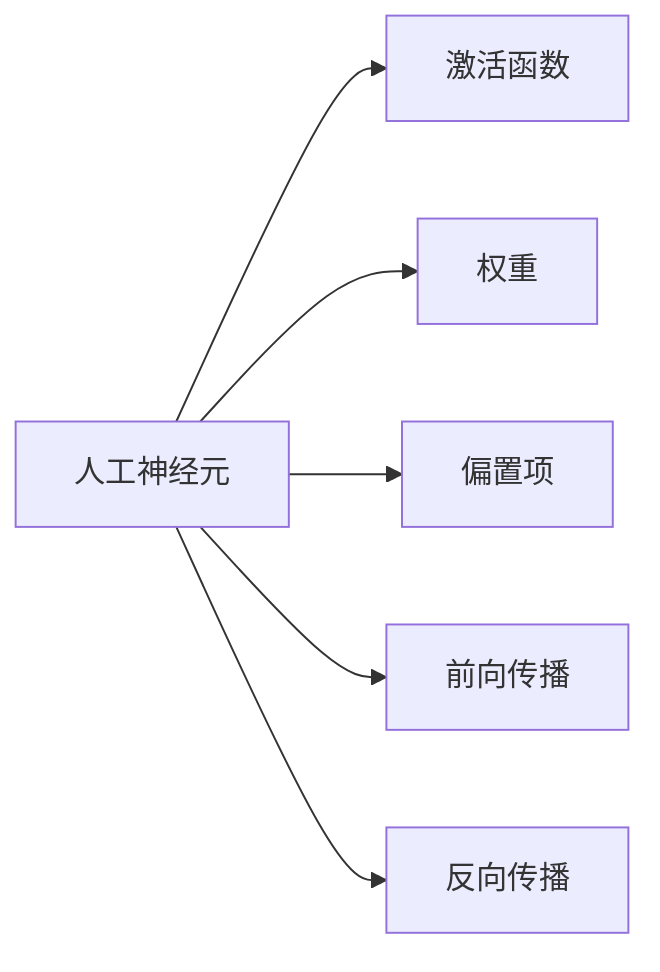
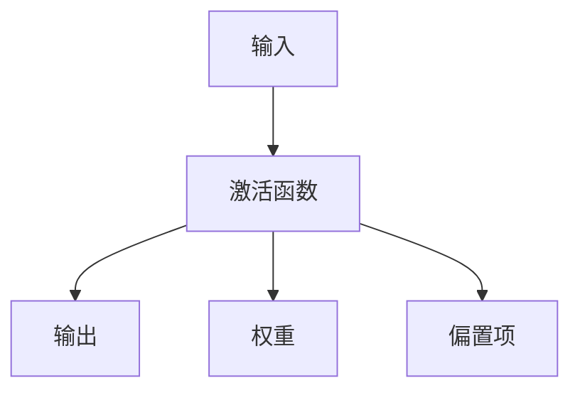
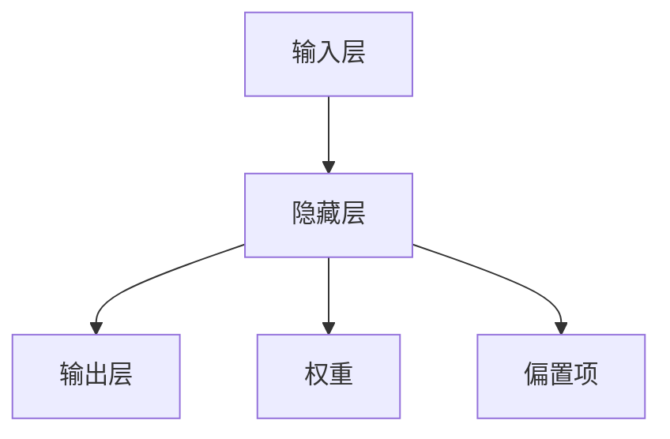

                 

## 1. 背景介绍

人工神经元（Artificial Neuron）是人工神经网络（Artificial Neural Network, ANN）的基本组成部分，也是深度学习的基础。它是生物神经元（Neuron）的模拟，通过简单的数学模型实现信息处理和传递。本文将从背景介绍开始，逐步深入探讨人工神经元的原理与实现，同时探讨其在深度学习中的应用和未来发展方向。

### 1.1 人工神经元的发展历程

人工神经元的概念源于20世纪初对生物神经元的研究，随着计算机科学的发展，人工神经元逐渐演变为计算机科学中的基本单元。上世纪60年代，罗森布拉特（Rosenblatt）首次提出了感知器（Perceptron），它是人工神经元的最早形式。1980年代，多层感知器（Multilayer Perceptron, MLP）被提出，将多个感知器进行堆叠，并引入激活函数和非线性变换，使得神经网络具备更强的表达能力。

### 1.2 人工神经元在深度学习中的地位

深度学习（Deep Learning）通过多层神经网络来实现复杂的特征学习和决策。人工神经元作为神经网络的基本单元，在深度学习中扮演着重要角色。深度学习模型通过大量的训练数据，调整人工神经元的连接权重，使得模型能够自适应地学习数据中的复杂模式，从而实现对新数据的预测和分类。

## 2. 核心概念与联系

### 2.1 核心概念概述

- **人工神经元**：神经网络的基元，具有输入、输出和激活函数。
- **激活函数**：决定神经元输出值的选择函数，常见的有Sigmoid、ReLU等。
- **权重**：连接神经元的参数，通过反向传播算法更新。
- **偏置项**：为神经元增加一个固定的加性项，增加模型表达能力。
- **前向传播**：数据通过神经元进行传递的过程，包括线性变换和激活函数。
- **反向传播**：利用误差反向传播更新连接权重，是神经网络训练的核心算法。

### 2.2 核心概念的关系

人工神经元是神经网络的基本组成部分，通过激活函数实现非线性变换，连接权重和偏置项使得模型具备了表达复杂函数的能力。前向传播用于数据处理，反向传播用于参数更新。这些概念构成了深度学习的核心基础，如图：



### 2.3 核心概念的整体架构

人工神经元的整体架构如下：



其中，输入通过权重加权和偏置项的线性变换，并经过激活函数得到输出。

## 3. 核心算法原理 & 具体操作步骤

### 3.1 算法原理概述

人工神经元的核心原理是通过权重和偏置项调整输入数据的线性变换，并利用激活函数实现非线性映射。当输入数据 $x$ 经过线性变换得到 $z = wx + b$ 后，通过激活函数 $f(z)$ 得到输出 $y$：

$$ y = f(z) = f(wx + b) $$

其中，$w$ 是连接权重，$b$ 是偏置项，$f(\cdot)$ 是激活函数。常见的激活函数有线性函数 $f(x) = x$、Sigmoid函数 $f(x) = \frac{1}{1 + e^{-x}}$、ReLU函数 $f(x) = max(0,x)$ 等。

### 3.2 算法步骤详解

人工神经元的训练主要通过反向传播算法（Backpropagation）实现。反向传播算法将损失函数对连接权重和偏置项的梯度信息反向传播到网络各层，并利用梯度下降等优化算法更新权重。训练步骤主要包括以下几个步骤：

1. **初始化**：随机初始化连接权重和偏置项。
2. **前向传播**：将输入数据传递到神经网络各层，并计算每层的输出。
3. **计算损失**：计算模型输出与真实标签的误差，得到损失函数。
4. **反向传播**：将误差反向传播，计算每层神经元的梯度。
5. **参数更新**：利用梯度下降等优化算法，更新连接权重和偏置项。
6. **迭代训练**：重复步骤2-5，直至收敛。

### 3.3 算法优缺点

**优点**：
- 易于理解与实现。
- 表达能力强，能够学习任意复杂函数。
- 能够处理非线性问题，具备较好的泛化能力。

**缺点**：
- 需要大量训练数据，且训练过程复杂。
- 参数过多，易过拟合。
- 计算复杂度高，训练速度较慢。

### 3.4 算法应用领域

人工神经元及其相关算法广泛应用于机器学习、计算机视觉、自然语言处理等领域，具体应用包括：

- **图像识别**：通过多层神经网络实现图像分类、物体检测、人脸识别等。
- **语音识别**：通过神经网络实现语音信号的特征提取和分类。
- **自然语言处理**：通过序列模型实现文本分类、语言翻译、情感分析等任务。
- **推荐系统**：通过神经网络实现用户行为预测和物品推荐。
- **强化学习**：通过神经网络实现环境感知和决策策略。

## 4. 数学模型和公式 & 详细讲解

### 4.1 数学模型构建

人工神经元的数学模型主要包括以下几个部分：

- **输入层**：输入数据 $x$，假设 $x$ 为 $n$ 维向量，记为 $x = [x_1, x_2, ..., x_n]^T$。
- **权重矩阵**：连接权重 $w$，假设 $w$ 为 $m \times n$ 的矩阵，记为 $w = [w_1, w_2, ..., w_m]^T$。
- **偏置项**：偏置项 $b$，假设 $b$ 为 $m$ 维向量，记为 $b = [b_1, b_2, ..., b_m]^T$。
- **激活函数**：$f(\cdot)$，如Sigmoid、ReLU等。

### 4.2 公式推导过程

将输入数据 $x$ 和权重矩阵 $w$ 进行线性变换，得到中间变量 $z$：

$$ z = wx + b $$

其中，$z$ 为 $m$ 维向量，记为 $z = [z_1, z_2, ..., z_m]^T$。通过激活函数 $f(\cdot)$ 将 $z$ 映射到输出 $y$：

$$ y = f(z) = f(wx + b) $$

常见的激活函数有Sigmoid、ReLU等。以ReLU函数为例：

$$ f(z) = ReLU(z) = \begin{cases}
z, & z \geq 0 \\
0, & z < 0
\end{cases} $$

### 4.3 案例分析与讲解

以一个简单的神经网络为例，如图：



假设输入数据 $x$ 为2维向量，隐藏层有3个神经元，输出层有1个神经元。首先，将输入数据 $x$ 与隐藏层的权重 $w_1$、$w_2$、$w_3$ 进行线性变换，并加上偏置项 $b_1$、$b_2$、$b_3$，得到中间变量 $z_1$、$z_2$、$z_3$：

$$ z_1 = w_1x + b_1 $$
$$ z_2 = w_2x + b_2 $$
$$ z_3 = w_3x + b_3 $$

然后，将 $z_1$、$z_2$、$z_3$ 作为激活函数的输入，得到隐藏层的输出：

$$ y_1 = f(z_1) $$
$$ y_2 = f(z_2) $$
$$ y_3 = f(z_3) $$

最后，将隐藏层的输出 $y_1$、$y_2$、$y_3$ 与输出层的权重 $w_4$、$w_5$ 进行线性变换，并加上偏置项 $b_4$，得到输出层 $y$：

$$ y = w_4y_1 + w_5y_2 + b_4 $$

## 5. 项目实践：代码实例和详细解释说明

### 5.1 开发环境搭建

使用Python搭建深度学习环境，安装PyTorch库。

```bash
pip install torch torchvision torchaudio
```

### 5.2 源代码详细实现

以一个简单的神经网络为例，实现图像分类的MNIST数据集。

```python
import torch
import torch.nn as nn
import torch.optim as optim
import torchvision
import torchvision.transforms as transforms

# 定义神经网络
class NeuralNet(nn.Module):
    def __init__(self):
        super(NeuralNet, self).__init__()
        self.fc1 = nn.Linear(784, 512)
        self.fc2 = nn.Linear(512, 256)
        self.fc3 = nn.Linear(256, 10)

    def forward(self, x):
        x = x.view(-1, 784)
        x = nn.functional.relu(self.fc1(x))
        x = nn.functional.relu(self.fc2(x))
        x = self.fc3(x)
        return x

# 加载数据集
train_dataset = torchvision.datasets.MNIST(root='data', train=True, transform=transforms.ToTensor(), download=True)
test_dataset = torchvision.datasets.MNIST(root='data', train=False, transform=transforms.ToTensor(), download=True)

# 数据增强
train_loader = torch.utils.data.DataLoader(train_dataset, batch_size=64, shuffle=True)
test_loader = torch.utils.data.DataLoader(test_dataset, batch_size=64, shuffle=False)

# 初始化模型和优化器
model = NeuralNet()
criterion = nn.CrossEntropyLoss()
optimizer = optim.Adam(model.parameters(), lr=0.001)

# 训练模型
for epoch in range(10):
    running_loss = 0.0
    for i, data in enumerate(train_loader, 0):
        inputs, labels = data
        optimizer.zero_grad()
        outputs = model(inputs)
        loss = criterion(outputs, labels)
        loss.backward()
        optimizer.step()
        running_loss += loss.item()
    print(f'Epoch {epoch+1}, loss: {running_loss/len(train_loader):.4f}')

# 测试模型
correct = 0
total = 0
with torch.no_grad():
    for data in test_loader:
        images, labels = data
        outputs = model(images)
        _, predicted = torch.max(outputs.data, 1)
        total += labels.size(0)
        correct += (predicted == labels).sum().item()

print(f'Accuracy: {100 * correct / total}%')
```

### 5.3 代码解读与分析

代码中定义了一个简单的神经网络，包含三个全连接层，使用ReLU作为激活函数，通过Adam优化器进行训练。训练过程包括前向传播、计算损失、反向传播和参数更新。在测试集上计算准确率，评估模型性能。

## 6. 实际应用场景

### 6.1 计算机视觉

人工神经元在计算机视觉中广泛应用，如图像分类、物体检测、人脸识别等。以图像分类为例，神经网络通过卷积层和池化层提取图像的特征，然后通过全连接层进行分类。

### 6.2 自然语言处理

人工神经元在自然语言处理中也得到了广泛应用，如文本分类、语言翻译、情感分析等。以文本分类为例，神经网络通过RNN或CNN等模型，提取文本的特征，然后通过全连接层进行分类。

### 6.3 语音识别

人工神经元在语音识别中主要用于特征提取和分类。通过卷积神经网络（CNN）等模型，提取语音信号的特征，然后通过全连接层进行分类。

## 7. 工具和资源推荐

### 7.1 学习资源推荐

- **Coursera《Deep Learning Specialization》**：吴恩达教授主讲的深度学习课程，涵盖神经网络、卷积神经网络、循环神经网络等。
- **DeepLearning.AI《深度学习》**：DeepLearning.AI提供的深度学习课程，涵盖神经网络、生成模型、强化学习等。
- **斯坦福《CS231n: Convolutional Neural Networks for Visual Recognition》**：斯坦福大学计算机视觉课程，涵盖CNN、RNN等深度学习模型。

### 7.2 开发工具推荐

- **PyTorch**：用于深度学习开发的Python框架，支持动态图和静态图，具备强大的计算图优化能力。
- **TensorFlow**：由Google开发的深度学习框架，支持分布式计算和GPU加速。
- **Keras**：基于TensorFlow的高级深度学习框架，提供便捷的API和模型构建工具。
- **MXNet**：由Amazon开发的深度学习框架，支持多种编程语言，具备高效的分布式训练能力。

### 7.3 相关论文推荐

- **《Deep Learning》**：Ian Goodfellow等人的经典著作，涵盖深度学习的基本概念和核心技术。
- **《Neural Networks and Deep Learning》**：Michael Nielsen的深度学习教材，深入浅出地讲解深度学习的原理和实现。
- **《Hands-On Machine Learning with Scikit-Learn, Keras, and TensorFlow》**：Aurélien Géron的深度学习实战书籍，涵盖Scikit-Learn、Keras、TensorFlow的实践技巧。

## 8. 总结：未来发展趋势与挑战

### 8.1 研究成果总结

人工神经元作为深度学习的基石，已经取得了一系列显著的研究成果，广泛应用于计算机视觉、自然语言处理等领域。未来，随着深度学习技术的不断进步，人工神经元将进一步扩展其应用范围，提升模型的性能和可解释性。

### 8.2 未来发展趋势

未来人工神经元的发展趋势主要包括：

- **模型复杂度的提升**：随着深度学习模型的不断发展，人工神经元将具备更强的表达能力和复杂性。
- **神经元结构的改进**：通过引入注意力机制、卷积神经网络等先进技术，提高人工神经元的学习能力和泛化能力。
- **深度神经网络的拓展**：随着深度神经网络的发展，人工神经元将进一步拓展到更复杂的网络结构，如图卷积神经网络（GCN）、时空卷积神经网络（C3D）等。
- **大规模数据的利用**：利用大规模数据和分布式计算，提升人工神经元的训练效率和泛化能力。
- **应用领域的扩展**：人工神经元将进一步拓展到更多应用领域，如医疗、金融、智能交通等。

### 8.3 面临的挑战

尽管人工神经元在深度学习中取得了巨大成功，但仍面临一些挑战：

- **过拟合问题**：随着模型复杂度的增加，人工神经元容易过拟合训练数据。
- **计算资源的消耗**：大规模人工神经网络的训练和推理需要大量计算资源，难以在低成本设备上实现。
- **模型可解释性**：人工神经元通常被视为“黑盒”模型，难以解释其内部决策过程。
- **数据隐私和安全性**：人工神经元在处理敏感数据时，面临数据隐私和安全性的问题。

### 8.4 研究展望

未来人工神经元的研究方向主要包括：

- **对抗样本的研究**：研究如何识别和防御对抗样本，提高模型的鲁棒性。
- **模型压缩与加速**：通过模型压缩和加速技术，提升人工神经元的训练和推理效率。
- **模型可解释性**：研究如何赋予人工神经元更强的可解释性，增强模型的可信度和应用价值。
- **多模态融合**：研究如何实现多模态数据的融合，提高人工神经元的泛化能力和应用范围。
- **低功耗硬件**：研究如何在低功耗硬件上实现高效的深度学习模型，推动边缘计算和移动设备的智能化应用。

总之，人工神经元作为深度学习的基础，未来将在更广阔的应用领域发挥重要作用，其研究与应用将不断推动人工智能技术的进步。

## 9. 附录：常见问题与解答

**Q1：人工神经元的训练过程包括哪些步骤？**

A: 人工神经元的训练主要通过反向传播算法实现。训练过程包括前向传播、计算损失、反向传播和参数更新。具体步骤包括：
1. 初始化：随机初始化连接权重和偏置项。
2. 前向传播：将输入数据传递到神经网络各层，并计算每层的输出。
3. 计算损失：计算模型输出与真实标签的误差，得到损失函数。
4. 反向传播：将误差反向传播，计算每层神经元的梯度。
5. 参数更新：利用梯度下降等优化算法，更新连接权重和偏置项。
6. 迭代训练：重复步骤2-5，直至收敛。

**Q2：如何理解人工神经元的激活函数？**

A: 激活函数是人工神经元的核心组件之一，决定了神经元的输出值。常见的激活函数有线性函数、Sigmoid函数、ReLU函数等。激活函数的目的是引入非线性变换，使得神经网络具备更强的表达能力。以ReLU函数为例，当输入大于0时，输出等于输入，否则输出为0，从而实现非线性变换。

**Q3：如何防止人工神经元的过拟合？**

A: 过拟合是人工神经元训练中常见的问题。防止过拟合的方法包括：
1. 数据增强：通过对训练数据进行随机变换，扩充训练集。
2. 正则化：通过L2正则化、Dropout等技术，减少模型复杂度。
3. 早停法：在训练过程中，实时监控验证集的表现，当验证集性能不再提升时停止训练。
4. 模型集成：通过多个模型的投票或加权平均，提高模型的泛化能力。

**Q4：人工神经元在实际应用中需要注意哪些问题？**

A: 人工神经元在实际应用中需要注意以下问题：
1. 数据预处理：对于输入数据的预处理，包括归一化、标准化等。
2. 模型调参：选择合适的模型架构和超参数，避免过拟合和欠拟合。
3. 模型评估：通过交叉验证等方法，评估模型的泛化能力。
4. 模型部署：将训练好的模型部署到生产环境，保证模型的稳定性和可靠性。
5. 数据隐私：在处理敏感数据时，注意数据隐私和安全问题。

总之，人工神经元在实际应用中需要综合考虑数据、模型和算法等多个因素，才能取得良好的效果。

