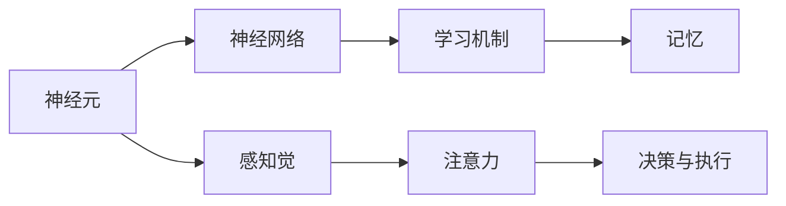

                 

## 1. 背景介绍

### 1.1 问题由来

人类大脑是一个极其复杂的系统，具有高度的适应性和综合处理能力。在人工智能领域，我们越来越认识到，要想实现真正的智能，必须借鉴和模仿人类大脑的运作机制。本文将深入探讨人类大脑的综合处理能力，并探讨如何将其应用到人工智能技术的开发和研究中。

### 1.2 问题核心关键点

- **神经元与神经网络**：神经元是构成大脑基本处理单元，而神经网络则模拟了这些单元之间的连接关系，用于处理复杂的数据和信息。
- **感知觉与学习机制**：人类大脑通过感知觉系统接收外界信息，并通过学习机制不断优化处理模型，提高处理效率和准确性。
- **注意力与记忆**：注意力机制使大脑能够集中资源处理关键信息，而记忆则使大脑能够存储和检索长期信息。
- **决策与执行**：大脑通过决策机制综合处理信息，并执行相应的行动，实现行为的自动化。

## 2. 核心概念与联系

### 2.1 核心概念概述

- **神经元**：神经元是构成大脑的基本处理单元，接收和处理信息。
- **神经网络**：神经网络由大量神经元组成，通过连接关系模拟信息处理过程。
- **感知觉**：感知觉系统接收外界信息，并将其转化为神经信号。
- **学习机制**：通过强化学习、监督学习和无监督学习等机制，大脑不断优化信息处理模型。
- **注意力**：注意力机制使大脑能够聚焦关键信息，提高处理效率。
- **记忆**：长期记忆和短期记忆使大脑能够存储和检索信息。
- **决策与执行**：大脑通过决策机制综合信息，并执行相应的行动。

这些核心概念通过神经网络和感知觉系统相互联系，共同构成了人类大脑的综合处理能力。

### 2.2 概念间的关系

- **神经元与神经网络**：神经元是神经网络的基本组成部分，神经网络通过连接关系模拟了神经元之间的信息传递。
- **感知觉与学习机制**：感知觉系统接收外界信息，并通过学习机制优化信息处理模型。
- **注意力与记忆**：注意力机制使大脑能够聚焦关键信息，而记忆则使大脑能够存储和检索长期信息。
- **决策与执行**：大脑通过决策机制综合信息，并执行相应的行动。

这些核心概念之间的关系可以用以下Mermaid流程图表示：



这个流程图展示了神经元、神经网络、感知觉、学习机制、注意力、记忆和决策与执行之间的关系。

## 3. 核心算法原理 & 具体操作步骤

### 3.1 算法原理概述

人类大脑的综合处理能力可以抽象为一个复杂的神经网络，其中每个神经元接收和处理信息，并通过连接关系传递给其他神经元。这种信息传递和处理过程可以通过深度学习算法模拟和优化。

### 3.2 算法步骤详解

1. **数据预处理**：将输入数据转换为神经网络可以处理的格式，如将图像转换为向量。
2. **模型选择与设计**：选择合适的神经网络模型，并设计其连接关系和参数。
3. **训练模型**：使用训练数据对模型进行训练，优化其参数和连接关系。
4. **测试与验证**：使用测试数据对训练好的模型进行评估，验证其性能。
5. **部署与优化**：将模型部署到实际应用中，并根据反馈进行优化。

### 3.3 算法优缺点

**优点**：
- 可以处理复杂的数据和信息。
- 通过训练不断优化模型，提高处理效率和准确性。
- 能够处理大规模数据，适用于各种应用场景。

**缺点**：
- 需要大量计算资源和时间进行训练。
- 模型复杂度较高，容易过拟合。
- 对数据的表示形式要求较高，需要手动预处理。

### 3.4 算法应用领域

- **图像识别**：通过卷积神经网络（CNN）对图像进行分类、检测和分割。
- **自然语言处理**：通过循环神经网络（RNN）和长短时记忆网络（LSTM）对文本进行情感分析、机器翻译和语义理解。
- **语音识别**：通过卷积神经网络（CNN）和循环神经网络（RNN）对语音进行识别和转录。
- **推荐系统**：通过协同过滤和深度学习模型对用户行为进行预测和推荐。
- **游戏AI**：通过强化学习和深度学习模型对游戏进行智能决策和策略优化。

## 4. 数学模型和公式 & 详细讲解

### 4.1 数学模型构建

神经网络的基本数学模型可以表示为一个非线性函数 $f(x;w)$，其中 $x$ 为输入向量，$w$ 为模型参数。神经网络通常由多个层次组成，每个层次包括多个神经元，并通过连接关系传递信息。

### 4.2 公式推导过程

对于一个简单的神经网络，其输出可以表示为：

$$
y = f(x;w) = g(w_1 \cdot \phi(x) + w_2)
$$

其中 $g$ 为激活函数，$\phi(x)$ 为线性变换，$w_1$ 和 $w_2$ 为模型参数。

在训练过程中，模型参数 $w$ 通过梯度下降等优化算法进行更新，以最小化损失函数 $L$：

$$
L(w) = \frac{1}{N} \sum_{i=1}^N (y_i - f(x_i;w))^2
$$

其中 $y_i$ 为真实标签，$x_i$ 为输入数据，$N$ 为数据集大小。

### 4.3 案例分析与讲解

以手写数字识别为例，可以使用卷积神经网络（CNN）进行图像处理和分类。CNN通过卷积层和池化层提取图像特征，并通过全连接层进行分类。具体步骤如下：

1. **数据预处理**：将手写数字图像转换为灰度图像，并进行归一化处理。
2. **模型选择与设计**：选择适当的CNN结构，包括卷积层、池化层和全连接层。
3. **训练模型**：使用训练数据对模型进行训练，优化其参数和连接关系。
4. **测试与验证**：使用测试数据对训练好的模型进行评估，验证其性能。
5. **部署与优化**：将模型部署到实际应用中，并根据反馈进行优化。

## 5. 项目实践：代码实例和详细解释说明

### 5.1 开发环境搭建

在Python中使用TensorFlow和Keras进行神经网络模型的开发和训练。

```bash
pip install tensorflow keras
```

### 5.2 源代码详细实现

以手写数字识别为例，编写Python代码实现CNN模型。

```python
import tensorflow as tf
from tensorflow.keras import layers, models

# 构建CNN模型
model = models.Sequential([
    layers.Conv2D(32, (3, 3), activation='relu', input_shape=(28, 28, 1)),
    layers.MaxPooling2D((2, 2)),
    layers.Conv2D(64, (3, 3), activation='relu'),
    layers.MaxPooling2D((2, 2)),
    layers.Conv2D(64, (3, 3), activation='relu'),
    layers.Flatten(),
    layers.Dense(64, activation='relu'),
    layers.Dense(10)
])

# 编译模型
model.compile(optimizer='adam',
              loss=tf.keras.losses.SparseCategoricalCrossentropy(from_logits=True),
              metrics=['accuracy'])

# 训练模型
model.fit(train_images, train_labels, epochs=10, validation_data=(test_images, test_labels))
```

### 5.3 代码解读与分析

**CNN模型**：
- `Conv2D`层：卷积层，用于提取图像特征。
- `MaxPooling2D`层：池化层，用于降维和特征选择。
- `Flatten`层：将二维特征映射展开为向量。
- `Dense`层：全连接层，用于分类。

**模型编译**：
- `optimizer`：优化器，用于更新模型参数。
- `loss`：损失函数，用于衡量模型预测与真实标签之间的差异。
- `metrics`：评估指标，用于监控模型性能。

**模型训练**：
- `fit`方法：对模型进行训练，参数为训练数据、真实标签、训练轮数、验证数据。

### 5.4 运行结果展示

在训练完成后，可以使用测试数据对模型进行评估。

```python
test_loss, test_acc = model.evaluate(test_images, test_labels, verbose=2)
print('Test accuracy:', test_acc)
```

输出结果为模型在测试集上的准确率。

## 6. 实际应用场景

### 6.1 智能医疗

在智能医疗领域，人类大脑的综合处理能力可以应用于疾病诊断、医学图像分析、个性化治疗方案设计等。通过深度学习模型，可以从医学影像中提取特征，识别出疾病信号，并进行分类和预测。

### 6.2 智能制造

在智能制造领域，人类大脑的综合处理能力可以应用于生产过程监控、设备故障预测、质量控制等。通过传感器和监控设备采集的数据，可以构建复杂的神经网络模型，实时监测和预测生产过程中的异常情况，提高生产效率和产品质量。

### 6.3 智能交通

在智能交通领域，人类大脑的综合处理能力可以应用于交通流量预测、智能导航、事故预防等。通过深度学习模型，可以分析交通数据，预测交通流量，优化交通信号灯控制，减少交通拥堵和事故发生率。

### 6.4 未来应用展望

未来，人类大脑的综合处理能力将在更多领域得到应用，如智能家居、智能安防、智能金融等。通过深度学习模型，可以实现更为智能化和自动化的生活和工作环境，提升人类生活质量。

## 7. 工具和资源推荐

### 7.1 学习资源推荐

- **《深度学习》（周志华）**：全面介绍了深度学习的基本概念和算法，是入门深度学习的优秀教材。
- **《神经网络与深度学习》（Michael Nielsen）**：深入浅出地讲解了神经网络和深度学习的原理和应用。
- **Coursera的深度学习课程**：由斯坦福大学Andrew Ng教授主讲，讲解了深度学习的理论基础和实践应用。

### 7.2 开发工具推荐

- **TensorFlow**：由Google开发的深度学习框架，提供了丰富的API和工具，支持GPU和TPU加速。
- **Keras**：基于TensorFlow和Theano的高级深度学习API，易于使用和理解。
- **PyTorch**：由Facebook开发的深度学习框架，支持动态图和静态图，具有高效性和灵活性。

### 7.3 相关论文推荐

- **ImageNet大规模视觉识别挑战赛论文**：提出了深度卷积神经网络（CNN），开创了图像识别的新纪元。
- **AlphaGo论文**：提出了深度强化学习模型，实现了在围棋等复杂游戏中的高级策略和决策能力。
- **BERT论文**：提出了大规模预训练语言模型BERT，显著提升了自然语言处理任务的表现。

## 8. 总结：未来发展趋势与挑战

### 8.1 研究成果总结

人类大脑的综合处理能力为深度学习和人工智能的发展提供了重要的借鉴和指导。通过深入研究人类大脑的运作机制，可以构建更为复杂和高效的人工智能模型，应用于更多实际场景。

### 8.2 未来发展趋势

- **模型规模**：未来神经网络模型将朝着更大规模发展，以处理更复杂的数据和信息。
- **计算效率**：未来将开发更高效的计算模型和算法，以支持大规模神经网络模型的训练和推理。
- **跨领域应用**：未来将拓展神经网络模型的应用范围，应用于更多垂直领域，如医疗、制造、交通等。

### 8.3 面临的挑战

- **计算资源**：大规模神经网络模型的训练和推理需要大量计算资源。
- **数据隐私**：神经网络模型需要大量的数据进行训练，但数据隐私和安全问题需得到解决。
- **模型透明性**：深度学习模型的黑盒特性，使得模型透明性和可解释性成为难题。

### 8.4 研究展望

未来，人类大脑的综合处理能力将继续推动人工智能技术的发展。通过多学科交叉合作，开发更为智能和高效的神经网络模型，将使人工智能技术在更多领域得到应用，推动人类社会进入新的智能时代。

## 9. 附录：常见问题与解答

**Q1：什么是神经网络？**

A: 神经网络是一种模拟人类大脑处理信息的数学模型，由大量神经元组成，并通过连接关系传递信息。

**Q2：深度学习与机器学习的区别是什么？**

A: 深度学习是机器学习的一个分支，主要使用多层神经网络进行模型训练和预测。深度学习可以自动学习特征，而传统机器学习需要手工设计特征。

**Q3：如何避免神经网络的过拟合问题？**

A: 过拟合是指模型在训练集上表现良好，但在测试集上表现较差的问题。可以通过增加数据量、使用正则化方法、减少模型复杂度等方式避免过拟合。

**Q4：深度学习模型的计算效率如何提升？**

A: 通过硬件加速、模型压缩、模型并行等技术，可以提升深度学习模型的计算效率。

**Q5：如何提升深度学习模型的可解释性？**

A: 通过可解释性方法，如模型可视化、特征分析、模型压缩等，可以提升深度学习模型的可解释性。

---

作者：禅与计算机程序设计艺术 / Zen and the Art of Computer Programming

