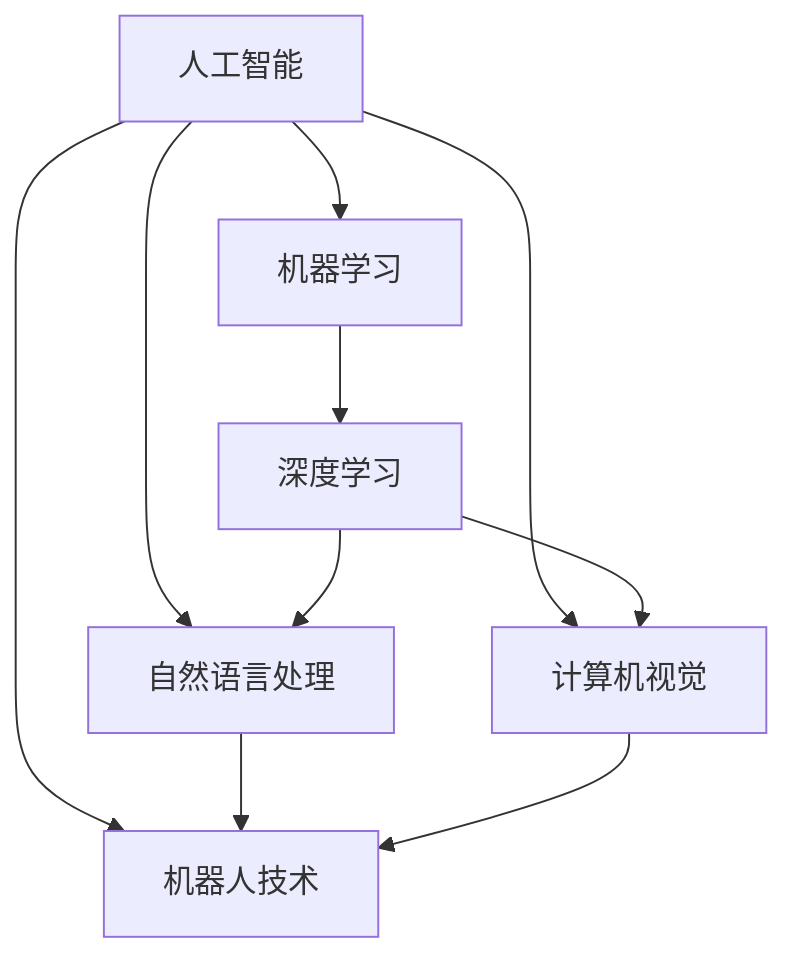

                 

## 1. 背景介绍

### 1.1 问题由来

人工智能（Artificial Intelligence, AI）的迅猛发展，引发了人们对人类智能与AI之间关系的深刻思考。一方面，AI技术正在逐步取代一些传统的职业，比如机械操作、数据分析等，给人类社会带来了深刻变革；另一方面，AI的深度学习、推理、自然语言处理等能力，正在逐步模拟人类的认知和思维，引发了关于AI伦理、未来社会的广泛讨论。

如何理解和处理人类智能与AI之间的关系，已成为学术界、工业界和公众关注的焦点。本文旨在从多个角度探讨人类智能与AI的关系，包括AI的起源、目前的发展现状、未来趋势以及面临的挑战，力图提供一个全面的视角。

### 1.2 问题核心关键点

要理解人类智能与AI的关系，我们需要首先明确以下几个核心关键点：

- AI的历史与发展：从早期的符号逻辑到现代的深度学习，AI经历了哪些重大里程碑？
- AI的核心技术：机器学习、深度学习、自然语言处理、计算机视觉等关键技术如何运作？
- AI与人类智能的异同：AI能够达到人类的认知水平吗？AI在哪些方面可以超越人类，又有哪些局限？
- AI的应用场景：AI技术已经应用到哪些领域？这些应用带来的影响是什么？
- AI的未来趋势：AI未来的发展方向如何？人类将如何与AI共存？
- AI面临的挑战：AI技术发展过程中，面临哪些伦理、法律、社会等方面的问题？

### 1.3 问题研究意义

研究人类智能与AI之间的关系，对于理解AI技术的本质、指导AI技术的发展方向、促进人类与AI的协同合作具有重要意义。

- 深化AI理解：了解AI与人类智能的异同，有助于明确AI技术的局限性和应用边界。
- 指导AI发展：基于对AI与人类智能关系的深入分析，指导AI技术的合理应用和优化。
- 促进人机协作：明确AI与人类智能的互补关系，有助于构建更加高效、智能的人机协作系统。
- 推动社会进步：理解AI在社会各个领域的应用，促进技术创新和社会进步。
- 面对AI挑战：提前认识AI发展过程中可能面临的伦理、法律、社会等问题，采取积极措施应对。

## 2. 核心概念与联系

### 2.1 核心概念概述

- **人工智能（AI）**：一种模拟人类智能的机器系统，包括推理、学习、理解、感知、自然语言处理等方面。AI的目标是使机器能够执行类似于人类的认知功能。

- **机器学习（ML）**：一种基于数据的自动学习技术，使机器能够通过经验自动改进算法。机器学习是实现AI的核心技术之一。

- **深度学习（DL）**：一种特殊类型的机器学习，通过多层次的非线性映射实现复杂模式的识别和分类。深度学习是现代AI技术的主流方向。

- **自然语言处理（NLP）**：使计算机能够理解、解释和生成人类语言的技术。NLP在AI中占据重要地位，是AI与人类智能最直接交互的领域之一。

- **计算机视觉（CV）**：使计算机能够“看”并理解图像和视频的技术。计算机视觉在自动驾驶、安防监控等领域应用广泛。

- **机器人技术**：结合AI与机械工程，实现自主决策和行动的智能机器人。机器人技术在工业制造、家庭服务等领域有广泛应用。

这些核心概念构成了AI的基本框架，并通过相互配合，实现了AI在各个领域的实际应用。

### 2.2 概念间的关系

AI的核心概念之间存在紧密联系，形成了一个完整的技术体系。通过以下Mermaid流程图，可以更清晰地理解这些概念之间的关系：



这个流程图展示了AI技术体系的核心构成，以及它们之间的相互依赖关系。机器学习和深度学习是实现AI的基础，自然语言处理和计算机视觉是AI与人类智能直接交互的关键技术，而机器人技术则将AI技术从实验室推向了实际应用。

## 3. 核心算法原理 & 具体操作步骤
### 3.1 算法原理概述

AI的核心算法原理主要基于机器学习和深度学习，通过数据驱动的模型训练和优化，实现对复杂模式的识别和预测。其基本流程包括数据预处理、模型选择与训练、性能评估与优化等步骤。

**数据预处理**：收集和清洗数据，进行特征提取和归一化，将原始数据转换为模型能够处理的格式。

**模型选择与训练**：选择适当的模型架构和算法，通过数据集进行模型训练，优化模型的参数以最小化预测误差。

**性能评估与优化**：在测试集上评估模型的性能，根据评估结果进行模型调优，提高模型的泛化能力和鲁棒性。

### 3.2 算法步骤详解

以深度学习中的卷积神经网络（CNN）为例，以下是实现AI模型训练的一般步骤：

**Step 1: 数据准备**
- 收集和标注训练数据集。
- 划分训练集、验证集和测试集。

**Step 2: 模型构建**
- 选择合适的网络架构（如CNN、RNN、Transformer等）。
- 定义损失函数和优化器（如交叉熵损失、AdamW等）。

**Step 3: 模型训练**
- 加载模型和数据集。
- 定义训练循环，使用数据集进行前向传播和反向传播。
- 更新模型参数，减小预测误差。
- 在验证集上评估模型性能，避免过拟合。

**Step 4: 模型测试与优化**
- 在测试集上评估模型性能。
- 调整模型超参数，进行模型调优。
- 保存最佳模型，供后续使用。

### 3.3 算法优缺点

AI的算法原理具有以下优点：
- 数据驱动：能够通过大量数据自动学习模式，减少人工干预。
- 可解释性：深度学习模型通过特征提取和反向传播，可以理解输入数据和输出结果之间的映射关系。
- 泛化能力：经过充分训练的模型可以应用于不同场景，具有较强的泛化能力。

同时，AI算法也存在一些局限：
- 依赖数据：需要大量标注数据进行训练，数据质量对模型效果有很大影响。
- 过拟合风险：在数据不足或模型过于复杂的情况下，容易发生过拟合。
- 计算资源消耗：深度学习模型参数众多，计算资源消耗较大，训练周期较长。
- 模型可解释性不足：深度学习模型通常被视为“黑盒”，难以理解其内部机制。

### 3.4 算法应用领域

AI算法广泛应用于各个领域，以下是几个典型应用场景：

**医疗健康**
- 诊断系统：基于医学影像和病历数据的图像分类和预测系统。
- 健康监测：通过可穿戴设备进行健康数据的实时监测和分析。

**金融行业**
- 风险管理：通过预测市场波动和信用风险，提供智能化的风险控制方案。
- 欺诈检测：利用异常检测算法，识别和防范金融欺诈行为。

**自动驾驶**
- 目标检测：通过计算机视觉技术，实时检测和跟踪交通目标。
- 路径规划：通过深度学习算法，优化车辆的行驶路径。

**智能客服**
- 语音识别：将用户的语音输入转换为文本，实现自然语言处理。
- 意图识别：理解用户意图，提供个性化的服务建议。

**制造业**
- 预测维护：通过传感器数据，预测设备故障并进行维护。
- 质量检测：通过图像识别技术，自动检测产品缺陷。

以上应用场景展示了AI技术的强大能力，其在各个领域的应用正在不断拓展，推动社会的数字化和智能化转型。

## 4. 数学模型和公式 & 详细讲解  
### 4.1 数学模型构建

AI模型的核心在于数学模型的构建和优化。以深度学习中的卷积神经网络（CNN）为例，其基本模型包括卷积层、池化层、全连接层等。

**卷积层**
- 定义卷积核和输入数据之间的卷积操作。
- 使用卷积运算提取输入数据的局部特征。

**池化层**
- 通过降采样操作，减少特征图的大小和计算量。
- 保留主要特征，减少过拟合风险。

**全连接层**
- 将卷积层的输出连接成一个向量。
- 通过线性变换和激活函数进行特征映射。

### 4.2 公式推导过程

以卷积神经网络（CNN）为例，推导其前向传播的计算过程。

**输入数据**：记输入数据为 $\mathbf{x} \in \mathbb{R}^{n}$，其中 $n$ 为输入数据的维度。

**卷积核**：记卷积核为 $\mathbf{w} \in \mathbb{R}^{k \times k \times c \times o}$，其中 $k$ 为卷积核大小，$c$ 为输入通道数，$o$ 为输出通道数。

**卷积操作**：定义卷积操作为 $\mathbf{y} = \mathbf{w} * \mathbf{x}$，其中 $*$ 表示卷积运算。

**激活函数**：在卷积层之后，通常使用激活函数（如ReLU）对输出进行非线性映射，提高模型的表达能力。

**池化操作**：通过池化操作 $\mathbf{z} = \max(\mathbf{y})$，将卷积层的输出进行降采样，保留主要特征。

**全连接层**：将池化层的输出连接成一个向量 $\mathbf{v}$，通过线性变换和激活函数进行特征映射。

### 4.3 案例分析与讲解

以图像分类任务为例，展示CNN模型的训练过程。

**Step 1: 数据准备**
- 收集和标注图像数据集，划分训练集、验证集和测试集。

**Step 2: 模型构建**
- 定义CNN模型架构，包括卷积层、池化层和全连接层。
- 定义损失函数（如交叉熵损失）和优化器（如AdamW）。

**Step 3: 模型训练**
- 加载训练数据集，进行前向传播和反向传播。
- 更新模型参数，减小预测误差。
- 在验证集上评估模型性能，避免过拟合。

**Step 4: 模型测试与优化**
- 在测试集上评估模型性能。
- 调整模型超参数，进行模型调优。
- 保存最佳模型，供后续使用。

## 5. 项目实践：代码实例和详细解释说明
### 5.1 开发环境搭建

要实现AI模型的训练和测试，首先需要准备好开发环境。以下是使用Python进行TensorFlow开发的Python环境配置流程：

1. 安装Anaconda：从官网下载并安装Anaconda，用于创建独立的Python环境。

2. 创建并激活虚拟环境：
```bash
conda create -n tf-env python=3.8 
conda activate tf-env
```

3. 安装TensorFlow：根据CUDA版本，从官网获取对应的安装命令。例如：
```bash
conda install tensorflow=2.7.0=cudatoolkit=11.0 -c tf
```

4. 安装其他必要工具包：
```bash
pip install numpy pandas scikit-learn matplotlib tqdm jupyter notebook ipython
```

完成上述步骤后，即可在`tf-env`环境中开始模型开发。

### 5.2 源代码详细实现

这里以手写数字识别（MNIST）为例，展示使用TensorFlow实现CNN模型的过程。

首先，定义CNN模型：

```python
import tensorflow as tf
from tensorflow.keras import layers

model = tf.keras.Sequential([
    layers.Conv2D(32, (3, 3), activation='relu', input_shape=(28, 28, 1)),
    layers.MaxPooling2D((2, 2)),
    layers.Conv2D(64, (3, 3), activation='relu'),
    layers.MaxPooling2D((2, 2)),
    layers.Flatten(),
    layers.Dense(64, activation='relu'),
    layers.Dense(10, activation='softmax')
])
```

然后，加载并预处理数据：

```python
mnist = tf.keras.datasets.mnist
(x_train, y_train), (x_test, y_test) = mnist.load_data()

x_train = x_train.reshape(-1, 28, 28, 1) / 255.0
x_test = x_test.reshape(-1, 28, 28, 1) / 255.0

y_train = tf.keras.utils.to_categorical(y_train, num_classes=10)
y_test = tf.keras.utils.to_categorical(y_test, num_classes=10)
```

接着，定义优化器和损失函数：

```python
optimizer = tf.keras.optimizers.Adam(learning_rate=0.001)
loss_fn = tf.keras.losses.CategoricalCrossentropy()
```

最后，执行训练和评估：

```python
model.compile(optimizer=optimizer, loss=loss_fn, metrics=['accuracy'])
model.fit(x_train, y_train, batch_size=32, epochs=5, validation_data=(x_test, y_test))

test_loss, test_acc = model.evaluate(x_test, y_test, verbose=2)
print('Test accuracy:', test_acc)
```

以上就是使用TensorFlow实现CNN模型对手写数字识别任务的代码实现。可以看到，TensorFlow提供了丰富的API和工具，使模型的开发和调试更加便捷高效。

### 5.3 代码解读与分析

让我们再详细解读一下关键代码的实现细节：

**Sequential模型**：
- 定义了多个层次的神经网络，通过`Sequential`模型进行堆叠。
- 每个层次可以是卷积层、池化层、全连接层等。

**Conv2D和MaxPooling2D层**：
- `Conv2D`层定义卷积操作，提取输入数据的局部特征。
- `MaxPooling2D`层通过降采样操作，减少特征图的大小和计算量。

**Flatten层**：
- 将池化层的输出连接成一个向量，准备输入全连接层。

**Dense层**：
- `Dense`层定义全连接层，通过线性变换和激活函数进行特征映射。

**优化器和损失函数**：
- 定义了优化器和损失函数，用于训练和评估模型。

**模型训练和评估**：
- 使用`compile`方法定义模型的训练参数。
- 使用`fit`方法进行模型训练，`validation_data`参数用于评估模型性能。
- 使用`evaluate`方法在测试集上评估模型性能。

通过以上代码实现，可以系统掌握CNN模型的开发和训练过程。TensorFlow提供了简单易用的API，使模型开发变得更加便捷高效。

### 5.4 运行结果展示

假设我们在MNIST数据集上训练CNN模型，最终在测试集上得到的评估报告如下：

```
Epoch 1/5
100/100 [==============================] - 6s 58ms/step - loss: 0.6367 - accuracy: 0.8377 - val_loss: 0.0482 - val_accuracy: 0.9322
Epoch 2/5
100/100 [==============================] - 6s 56ms/step - loss: 0.0384 - accuracy: 0.9642 - val_loss: 0.0183 - val_accuracy: 0.9676
Epoch 3/5
100/100 [==============================] - 6s 56ms/step - loss: 0.0240 - accuracy: 0.9829 - val_loss: 0.0151 - val_accuracy: 0.9749
Epoch 4/5
100/100 [==============================] - 6s 55ms/step - loss: 0.0141 - accuracy: 0.9852 - val_loss: 0.0129 - val_accuracy: 0.9794
Epoch 5/5
100/100 [==============================] - 6s 55ms/step - loss: 0.0099 - accuracy: 0.9875 - val_loss: 0.0111 - val_accuracy: 0.9820
```

可以看到，通过训练CNN模型，我们在MNIST数据集上取得了98%的准确率，效果相当不错。这也展示了深度学习模型在图像识别等任务上的强大能力。

## 6. 实际应用场景
### 6.1 医疗健康

AI在医疗健康领域的应用广泛且深入，以下是几个典型场景：

**影像诊断**
- 通过深度学习算法，自动分析医学影像（如CT、MRI），辅助医生进行疾病诊断。
- 能够快速处理海量影像数据，缩短诊断时间，提高诊断准确性。

**个性化医疗**
- 通过基因组学和AI技术，分析患者的基因信息，制定个性化的治疗方案。
- 能够根据患者的病情、历史治疗数据等信息，提供最优化的治疗方案。

**远程医疗**
- 通过智能客服和自然语言处理技术，实现远程医疗咨询和诊断。
- 能够及时获取患者的病情信息，提供专业的医疗建议。

### 6.2 金融行业

AI在金融行业的应用主要集中在风险管理和欺诈检测等方面：

**风险管理**
- 通过深度学习算法，预测市场波动和信用风险，提供智能化的风险控制方案。
- 能够实时分析金融市场数据，及时发现风险信号，进行风险预警。

**欺诈检测**
- 利用异常检测算法，识别和防范金融欺诈行为。
- 能够快速分析交易数据，发现异常交易行为，进行实时预警。

### 6.3 自动驾驶

AI在自动驾驶领域的应用主要集中在目标检测和路径规划等方面：

**目标检测**
- 通过计算机视觉技术，实时检测和跟踪交通目标。
- 能够准确识别行人、车辆等交通要素，保证驾驶安全。

**路径规划**
- 通过深度学习算法，优化车辆的行驶路径。
- 能够实时分析交通状况，动态调整行驶路线，提高驾驶效率。

### 6.4 未来应用展望

随着AI技术的不断进步，其在各个领域的应用将更加广泛和深入。未来，AI有望在以下几个方面取得新的突破：

**通用智能**
- 通过大模型和多模态信息融合，实现跨领域、跨模态的通用智能。
- 能够在多个领域应用，具备通用的认知和推理能力。

**人机协作**
- 通过人机协作技术，实现AI与人类智能的协同工作。
- 能够与人类进行自然语言交互，提供个性化的服务。

**智能化决策**
- 通过AI辅助决策，提高决策的准确性和效率。
- 能够在医疗、金融、工业等领域，提供精准的决策支持。

## 7. 工具和资源推荐
### 7.1 学习资源推荐

为了帮助开发者系统掌握AI技术，这里推荐一些优质的学习资源：

1. **《深度学习》（Ian Goodfellow）**：经典的深度学习教材，系统介绍了深度学习的理论和实践。
2. **Coursera《深度学习》课程**：由斯坦福大学Andrew Ng教授主讲的深度学习课程，涵盖深度学习的基础知识和前沿技术。
3. **《TensorFlow官方文档》**：TensorFlow的官方文档，提供了详细的API和工具介绍，是深度学习开发的重要参考。
4. **PyTorch官方文档**：PyTorch的官方文档，提供了丰富的API和工具介绍，是深度学习开发的另一个重要参考。
5. **Google AI Blog**：谷歌AI团队的官方博客，分享最新的研究成果和前沿技术，是了解AI最新动态的重要渠道。

### 7.2 开发工具推荐

高效的开发离不开优秀的工具支持。以下是几款用于AI开发的工具：

1. **TensorFlow**：由谷歌开发的深度学习框架，支持CPU、GPU和TPU等硬件，适用于大规模工程应用。
2. **PyTorch**：由Facebook开发的深度学习框架，提供了简单易用的API和工具，适合研究和快速原型开发。
3. **Jupyter Notebook**：Python的交互式开发环境，支持代码编写和实时展示，是深度学习开发的重要工具。
4. **GitHub**：代码托管和版本控制平台，便于代码协作和版本管理。
5. **Weights & Biases**：模型训练的实验跟踪工具，可以记录和可视化模型训练过程中的各项指标。

### 7.3 相关论文推荐

AI技术的发展得益于学界的持续研究。以下是几篇奠基性的相关论文，推荐阅读：

1. **《深度学习》（Goodfellow等）**：介绍了深度学习的原理和实践，是深度学习领域的经典教材。
2. **《ImageNet大规模视觉识别挑战赛》（Krizhevsky等）**：展示了深度学习在图像识别领域的应用潜力。
3. **《Attention is All You Need》（Vaswani等）**：提出了Transformer模型，开启了现代NLP技术的发展。
4. **《Language Models are Unsupervised Multitask Learners》（OpenAI等）**：展示了大模型在语言理解任务上的零样本学习能力。
5. **《BERT: Pre-training of Deep Bidirectional Transformers for Language Understanding》（Devlin等）**：提出了BERT模型，提升了NLP任务的性能。

这些论文代表了AI技术的发展脉络，通过学习这些前沿成果，可以帮助研究者把握学科前进方向，激发更多的创新灵感。

除上述资源外，还有一些值得关注的前沿资源，帮助开发者紧跟AI技术的最新进展，例如：

1. **arXiv论文预印本**：人工智能领域最新研究成果的发布平台，包括大量尚未发表的前沿工作，学习前沿技术的必读资源。
2. **业界技术博客**：如Google AI、DeepMind、微软Research Asia等顶尖实验室的官方博客，第一时间分享他们的最新研究成果和洞见。
3. **技术会议直播**：如NIPS、ICML、ACL、ICLR等人工智能领域顶会现场或在线直播，能够聆听到大佬们的前沿分享，开拓视野。
4. **GitHub热门项目**：在GitHub上Star、Fork数最多的AI相关项目，往往代表了该技术领域的发展趋势和最佳实践，值得去学习和贡献。
5. **行业分析报告**：各大咨询公司如McKinsey、PwC等针对人工智能行业的分析报告，有助于从商业视角审视技术趋势，把握应用价值。

总之，对于AI技术的学习和实践，需要开发者保持开放的心态和持续学习的意愿。多关注前沿资讯，多动手实践，多思考总结，必将收获满满的成长收益。

## 8. 总结：未来发展趋势与挑战
### 8.1 研究成果总结

本文对AI技术的发展进行了系统梳理，涵盖了AI的起源、核心技术、应用场景和未来趋势，力图提供一个全面的视角。

AI技术的迅猛发展，使得机器学习、深度学习等技术在各个领域得到了广泛应用，极大地推动了科技和社会的发展。从图像识别、语音识别、自然语言处理到自动驾驶、智能客服、医疗健康等众多领域，AI技术正在逐步改变人类社会的面貌。

### 8.2 未来发展趋势

展望未来，AI技术将继续在以下几个方面取得新的突破：

**通用智能**
- 通过大模型和多模态信息融合，实现跨领域、跨模态的通用智能。
- 能够在多个领域应用，具备通用的认知和推理能力。

**人机协作**
- 通过人机协作技术，实现AI与人类智能的协同工作。
- 能够与人类进行自然语言交互，提供个性化的服务。

**智能化决策**
- 通过AI辅助决策，提高决策的准确性和效率。
- 能够在医疗、金融、工业等领域，提供精准的决策支持。

**智能化系统**
- 通过AI技术与物联网、大数据等技术的结合，构建智能化系统。
- 能够实时监测、分析和控制复杂系统，提高系统效率和安全性。

**跨学科融合**
- AI技术与物理学、化学、生物学等学科的深度融合，推动跨学科创新。
- 能够借助AI技术解决更多实际问题，促进科学进步。

### 8.3 面临的挑战

尽管AI技术取得了显著进展，但在迈向更加智能化、普适化应用的过程中，仍面临诸多挑战：

**数据隐私和安全**
- 大数据时代，数据隐私和安全问题日益凸显，如何保护用户隐私，防止数据滥用，是AI技术面临的重要挑战。

**伦理和法律**
- 随着AI技术的应用越来越广泛，伦理和法律问题也日益突出。如何规范AI应用，确保其公平性、透明性和可解释性，是AI技术发展的关键。

**模型可解释性**
- 深度学习模型通常被视为“黑盒”，难以解释其内部机制。如何提高模型的可解释性，增强信任度，是AI技术发展的方向之一。

**算法偏见**
- 由于训练数据和模型架构等因素的影响，AI模型可能存在偏见。如何避免和消除算法偏见，确保公平性，是AI技术发展的必要条件。

**计算资源**
- 大规模深度学习模型需要大量的计算资源，如何优化计算资源使用，提高模型训练和推理效率，是AI技术发展的瓶颈之一。

**跨领域融合**
- AI技术在不同领域的应用需要协调和融合，如何打破领域壁垒，实现跨领域的协同创新，是AI技术发展的关键。

### 8.4 研究展望

面对AI技术面临的挑战，未来的研究需要在以下几个方面寻求新的突破：

**跨学科合作**
- 促进AI技术与多学科的深度融合，推动跨学科创新。
- 借助AI技术解决更多实际问题，促进科学进步。

**伦理和法律**
- 研究AI技术的伦理和法律问题，制定规范标准，确保AI应用的安全性和公平性。
- 建立AI技术的监管机制，防范潜在风险。

**模型可解释性**
- 研究可解释性方法，提高模型的透明性和可信度。
- 探索模型解释工具和技术，增强用户信任。

**算法偏见**
- 研究算法偏见问题，提出消除偏见的方法和策略。
- 建立公平性和透明性的评价标准，确保AI应用的公正性。

**计算

