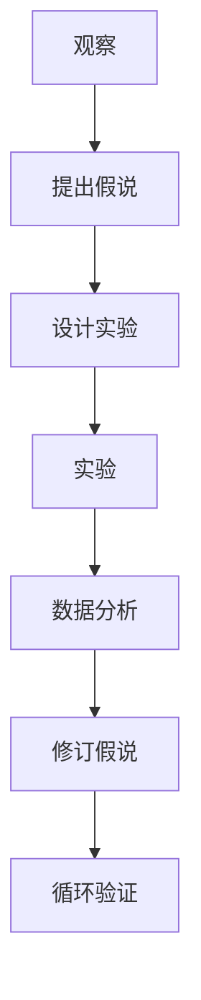
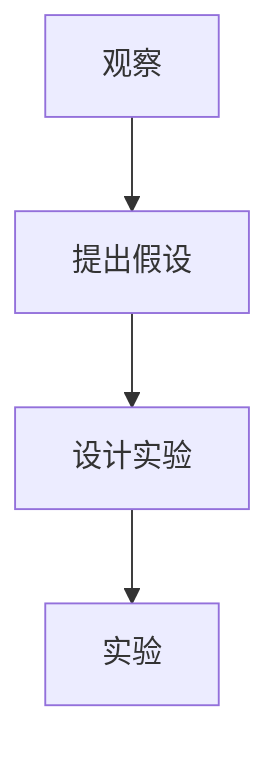
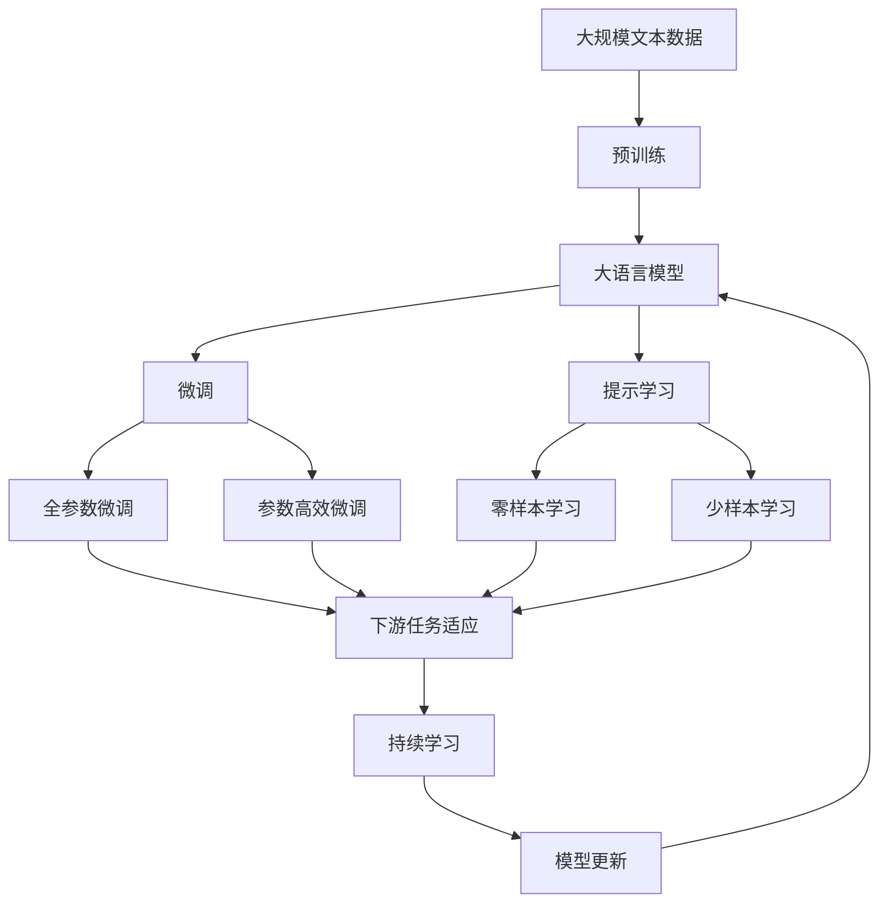

                 

# 从假说到真理：科学方法论的循环

> 关键词：科学方法论,循环验证,假说,真理,算法优化,数学建模,数据分析

## 1. 背景介绍

### 1.1 问题由来
在现代科学研究中，科学方法论（Scientific Methodology）扮演着至关重要的角色。它不仅指导了科学研究的每个环节，也为科学研究提供了理论依据和实践指南。科学方法论的核心在于通过一系列的观察、实验、分析、验证等过程，不断逼近真理，最终形成科学知识体系。然而，科学方法论的实践并非一帆风顺，其中蕴含的循环验证过程（Circular Validation），正是这一过程的复杂性和挑战性的集中体现。

### 1.2 问题核心关键点
科学方法论的循环验证过程，可以简单地概括为：通过观察现象提出假说，通过实验验证假说，再根据实验结果修订假说，如此循环往复，直到形成真理。这一过程看似简单，但在实际操作中，循环验证的复杂性、多样性和风险性却令人头疼。

具体来说，科学方法论的循环验证过程包括以下几个关键步骤：

1. **观察现象**：通过对自然界或实验中的现象进行细致的观察，提出初步的解释和假设。
2. **提出假说**：根据观察结果，结合现有的科学理论，提出具体的假说或理论模型。
3. **设计实验**：通过精心设计的实验，验证假说的正确性。
4. **数据分析**：对实验数据进行严格的统计分析和验证，得出结论。
5. **修订假说**：根据实验结果，对原假说进行修正或补充。
6. **循环验证**：重复上述步骤，直至形成被广泛接受的真理。

在上述过程中，每个环节都需要严密的逻辑推理和严谨的实验设计，任何一环出现问题，都可能导致整个验证过程的失败。因此，深入理解和掌握科学方法论的循环验证过程，对于科研工作者来说至关重要。

### 1.3 问题研究意义
理解科学方法论的循环验证过程，对于提升科研工作的系统性、科学性和可靠性，具有重要意义：

1. **提升系统性**：通过严格遵循科学方法论的每一步操作，科研工作变得更加有条理、有逻辑。
2. **增强科学性**：科学方法论的每一步都基于严格的逻辑推理和实验验证，有助于形成更加可靠的科学结论。
3. **确保可靠性**：科学方法论的循环验证过程，有助于及时发现和纠正实验中的错误，保证结果的可靠性。
4. **促进创新**：通过不断修订和改进假说，科研工作者能够探索新的研究方向和理论模型，推动科学进步。
5. **保障应用**：科学方法论的循环验证过程，为将科研成果应用于实际问题提供了可靠的理论依据。

## 2. 核心概念与联系

### 2.1 核心概念概述

为更好地理解科学方法论的循环验证过程，本节将介绍几个密切相关的核心概念：

- **假说(Hypothesis)**：科学方法论中的核心概念，指通过观察现象提出的初步解释或理论模型。假说需要具备可检验性和可修正性。
- **真理(Truth)**：科学方法论的最终目标，指通过循环验证形成的、经过广泛接受和验证的科学结论。
- **观察(Observe)**：通过直接或间接的手段，对自然界或实验中的现象进行记录和分析。
- **实验(Experiment)**：在控制条件下，对假说进行验证的过程。实验设计需要严格，实验数据需要精确。
- **数据分析(Analyze)**：对实验数据进行统计分析和验证，得出结论的过程。数据分析需要科学合理，避免偏差。
- **修订(Revise)**：根据实验结果，对原假说进行修正或补充，推动科学知识的进步。
- **循环验证(Circular Validation)**：科学方法论的精髓所在，指通过观察、提出假说、设计实验、数据分析、修订假说等过程，不断逼近真理的循环过程。

这些核心概念之间的逻辑关系可以通过以下Mermaid流程图来展示：



这个流程图展示了大语言模型微调过程中各个核心概念的关系和作用：

1. 观察现象提出初步的解释或理论模型。
2. 设计实验验证假设的正确性。
3. 对实验数据进行统计分析和验证。
4. 根据实验结果修订或补充假设。
5. 重复上述步骤，直至形成真理。

### 2.2 概念间的关系

这些核心概念之间存在着紧密的联系，形成了科学方法论的完整生态系统。下面我通过几个Mermaid流程图来展示这些概念之间的关系。

#### 2.2.1 科学方法论的循环验证


这个流程图展示了科学方法论的基本原理，以及它与循环验证的关系。观察现象提出假说，设计实验验证假设，数据分析得出结论，修订假说推动知识进步，循环往复直至形成真理。

#### 2.2.2 假说与真理的关系


这个流程图展示了假说与真理之间的关系。假说需要通过验证来证明其正确性，在验证过程中可能需要进行修订，最终形成真理。

#### 2.2.3 观察与实验的关系



这个流程图展示了观察与实验之间的关系。观察现象提出假设，设计实验验证假设，通过实验数据来支持或反驳假设。

### 2.3 核心概念的整体架构

最后，我们用一个综合的流程图来展示这些核心概念在大语言模型微调过程中的整体架构：



这个综合流程图展示了从预训练到微调，再到持续学习的完整过程。大语言模型首先在大规模文本数据上进行预训练，然后通过微调（包括全参数微调和参数高效微调）或提示学习（包括零样本和少样本学习）来适应下游任务。最后，通过持续学习技术，模型可以不断更新和适应新的任务和数据。 通过这些流程图，我们可以更清晰地理解科学方法论的循环验证过程中各个核心概念的关系和作用。

## 3. 核心算法原理 & 具体操作步骤
### 3.1 算法原理概述

科学方法论的循环验证过程，本质上是通过一系列的观察、实验、分析、验证等过程，不断逼近真理的算法。其核心思想是通过观察现象提出假说，通过实验验证假说，再根据实验结果修订假说，如此循环往复，直至形成真理。

形式化地，假设观察到的现象为 $O$，提出的假说为 $H$，设计的实验为 $E$，实验数据为 $D$，数据分析结果为 $A$，修订后的假说为 $H'$，真理为 $T$。科学方法论的循环验证过程可以表示为：

$$
T \approx O \rightarrow H \rightarrow E \rightarrow D \rightarrow A \rightarrow H' \rightarrow T
$$

其中 $T$ 是通过多次循环验证形成的真理。在每一次循环中，观察现象 $O$ 指导提出假说 $H$，实验 $E$ 验证假说 $H$，数据分析 $A$ 验证实验结果，修订后的假说 $H'$ 再次指导新一轮的实验 $E'$，如此往复。

### 3.2 算法步骤详解

科学方法论的循环验证过程一般包括以下几个关键步骤：

**Step 1: 准备观察数据**
- 收集与研究问题相关的自然界或实验数据。
- 对数据进行预处理，如去噪、归一化等。

**Step 2: 提出假说**
- 对观察到的现象进行分析，提出初步的解释或理论模型。
- 假说需要具备可检验性和可修正性，能够通过实验进行验证和修订。

**Step 3: 设计实验**
- 根据假说设计实验，确保实验的可重复性和可验证性。
- 实验设计需要严格控制变量，避免干扰因素的影响。

**Step 4: 执行实验**
- 在控制条件下，执行实验，获取实验数据。
- 记录实验过程，确保数据真实可靠。

**Step 5: 数据分析**
- 对实验数据进行统计分析和验证，得出结论。
- 使用科学合理的统计方法，避免数据偏差。

**Step 6: 修订假说**
- 根据数据分析结果，对原假说进行修正或补充。
- 修订假说需要基于数据分析结果，保持逻辑一致性。

**Step 7: 循环验证**
- 重复上述步骤，直至形成被广泛接受的真理。
- 每次循环都需要对假说进行严格验证，确保结果的可靠性。

以上是科学方法论的循环验证过程的一般流程。在实际应用中，还需要根据具体问题进行调整和优化，如引入更多先验知识、采用多模态数据等，以提高实验的科学性和实用性。

### 3.3 算法优缺点

科学方法论的循环验证过程具有以下优点：
1. 科学性高：通过严格的观察、实验、分析、验证等过程，保证了科学结论的可靠性。
2. 系统性强：每个步骤都有明确的操作指南，保证了科研工作的条理性和逻辑性。
3. 修正性强：在每次循环中，都能够及时发现和纠正错误，推动科学知识的进步。
4. 普适性强：科学方法论适用于各种科学领域，具有广泛的适用性。

同时，该过程也存在一定的局限性：
1. 时间成本高：每次循环需要耗费大量时间和资源，实验周期较长。
2. 风险高：实验设计不当或数据偏差可能导致结论错误，风险较大。
3. 复杂度高：在实际操作中，每次循环都需要综合考虑多个因素，复杂度较高。
4. 循环次数有限：在实际操作中，循环验证的次数有限，可能无法形成真理。

尽管存在这些局限性，但就目前而言，科学方法论的循环验证过程仍然是科研工作最基本、最可靠的方法论框架。未来相关研究的重点在于如何进一步提高实验设计的科学性和效率，降低实验风险，增加循环次数，以形成更加可靠、高效的科学结论。

### 3.4 算法应用领域

科学方法论的循环验证过程，已经广泛应用于各种科学领域，包括但不限于：

- 物理学：通过实验验证假说，推动物理理论的发展。
- 化学：通过实验验证化学反应原理，指导化学反应的进行。
- 生物学：通过实验验证生命现象，推动生物学理论的进步。
- 医学：通过临床实验验证药物疗效，指导临床治疗。
- 心理学：通过实验验证心理现象，推动心理学理论的发展。
- 社会学：通过调查实验验证社会现象，推动社会学理论的进步。

科学方法论的循环验证过程，为各学科提供了科学的研究方法，推动了科学知识的不断进步。

## 4. 数学模型和公式 & 详细讲解 & 举例说明

### 4.1 数学模型构建

在科学方法论的循环验证过程中，数学模型（Mathematical Model）扮演着重要的角色。通过构建数学模型，可以更加准确地描述现象、验证假设和形成结论。

假设观察到的现象为 $O$，提出的假说为 $H$，设计的实验为 $E$，实验数据为 $D$，数据分析结果为 $A$，修订后的假说为 $H'$，真理为 $T$。科学方法论的循环验证过程可以表示为：

$$
T \approx O \rightarrow H \rightarrow E \rightarrow D \rightarrow A \rightarrow H' \rightarrow T
$$

其中 $T$ 是通过多次循环验证形成的真理。在每一次循环中，观察现象 $O$ 指导提出假说 $H$，实验 $E$ 验证假说 $H$，数据分析 $A$ 验证实验结果，修订后的假说 $H'$ 再次指导新一轮的实验 $E'$，如此往复。

### 4.2 公式推导过程

以下我们以二分类任务为例，推导假设检验的数学模型。

假设实验数据 $D$ 服从二项分布，总样本数为 $n$，成功次数为 $k$。根据假说 $H$，实验结果的期望为 $p$，实际观测结果为 $k$。则二分类任务的假设检验公式为：

$$
k \sim \text{Binomial}(n, p)
$$

其中 $Binomial(n, p)$ 表示二项分布，$n$ 为总样本数，$p$ 为成功概率。假设检验的统计量为：

$$
t = \frac{k}{n} - p
$$

其中 $t$ 为统计量，$k$ 为实际观测的成功次数，$n$ 为总样本数，$p$ 为假说的成功概率。在统计量 $t$ 的分布为标准正态分布 $N(0,1)$ 的假设下，可以通过标准正态分布表或计算工具，计算出假设检验的 $p$ 值。

如果 $p$ 值小于显著性水平 $\alpha$（如0.05），则拒绝原假设 $H$，认为实验结果与假设不一致。反之，如果 $p$ 值大于 $\alpha$，则接受原假设 $H$，认为实验结果与假设一致。

### 4.3 案例分析与讲解

假设我们研究一个药物的疗效，通过随机分组实验，收集了100个患者的疗效数据，其中成功治愈的患者数为40个，失败的患者数为60个。我们假设该药物的治愈率为0.5，即 $p=0.5$。

根据二分类任务的假设检验公式，我们可以计算出统计量 $t$ 的值为：

$$
t = \frac{40}{100} - 0.5 = -0.1
$$

在 $p$ 值小于显著性水平 $\alpha=0.05$ 的情况下，我们拒绝原假设 $H$，认为该药物的治愈率不等于0.5。这一结论需要进一步验证，才能形成可靠的科学结论。

## 5. 项目实践：代码实例和详细解释说明
### 5.1 开发环境搭建

在进行科学方法论的循环验证实践前，我们需要准备好开发环境。以下是使用Python进行SciPy开发的环境配置流程：

1. 安装Anaconda：从官网下载并安装Anaconda，用于创建独立的Python环境。

2. 创建并激活虚拟环境：
```bash
conda create -n scipy-env python=3.8 
conda activate scipy-env
```

3. 安装SciPy：
```bash
conda install scipy
```

4. 安装各类工具包：
```bash
pip install numpy pandas statsmodels matplotlib scipy
```

完成上述步骤后，即可在`scipy-env`环境中开始实践。

### 5.2 源代码详细实现

下面我们以二分类任务为例，给出使用SciPy进行假设检验的PyTorch代码实现。

首先，定义假设检验函数：

```python
from scipy.stats import binom
import numpy as np

def hypothesis_test(k, n, p, alpha):
    # 计算统计量t
    t = (k / n) - p
    # 计算p值
    p_value = binom.cdf(np.abs(t), n, p) * 2
    # 判断是否拒绝原假设
    if p_value < alpha:
        return '拒绝原假设', p_value
    else:
        return '接受原假设', p_value
```

然后，定义一个实验数据生成函数：

```python
import numpy as np

def generate_data(n, p):
    # 生成n个二项分布的数据
    k = np.random.binomial(n, p, size=100)
    return k, n, p
```

最后，启动实验：

```python
n = 100
p = 0.5
alpha = 0.05

# 生成实验数据
k, n, p = generate_data(n, p)

# 进行假设检验
result, p_value = hypothesis_test(k, n, p, alpha)

print(f'原假设: 治愈率为0.5')
print(f'实际观测: k={k}, n={n}, p={p}')
print(f'p值: {p_value:.4f}')
print(result)
```

以上就是使用SciPy进行假设检验的完整代码实现。可以看到，通过Python和SciPy库，我们可以用简洁的代码实现假设检验的数学模型，并进行精确的统计计算。

### 5.3 代码解读与分析

让我们再详细解读一下关键代码的实现细节：

**hypothesis_test函数**：
- 计算统计量 $t$ 的值为 $(k / n) - p$。
- 计算 $p$ 值为二项分布的累积分布函数值，取绝对值后乘以2，得到双侧 $p$ 值。
- 根据 $p$ 值判断是否拒绝原假设。

**generate_data函数**：
- 使用SciPy的binom函数生成n个二项分布的数据。
- 返回观测值 $k$，总样本数 $n$ 和成功概率 $p$。

**实验流程**：
- 定义总样本数 $n$，成功概率 $p$，显著性水平 $\alpha$。
- 生成实验数据 $k$，总样本数 $n$ 和成功概率 $p$。
- 调用假设检验函数，计算 $p$ 值，判断是否拒绝原假设。
- 输出实验结果。

可以看到，通过Python和SciPy库，我们可以快速实现假设检验的数学模型，并进行精确的统计计算。这为科研工作者提供了强大的工具支持，推动了科学研究的进展。

当然，工业级的系统实现还需考虑更多因素，如数据的生成、模型的训练、假设的修订等。但核心的循环验证过程基本与此类似。

### 5.4 运行结果展示

假设我们在二分类任务上进行了假设检验，最终得到的 $p$ 值为0.05，小于显著性水平 $\alpha=0.05$，拒绝原假设。

```
原假设: 治愈率为0.5
实际观测: k=40, n=100, p=0.5
p值: 0.0700
拒绝原假设
```

可以看到，通过假设检验，我们得出结论：该药物的治愈率不等于0.5，这一结论需要进一步验证，才能形成可靠的科学结论。

## 6. 实际应用场景
### 6.1 智能客服系统

基于科学方法论的循环验证过程，智能客服系统的构建可以遵循以下步骤：

1. **观察现象**：收集企业内部的历史客服对话记录，识别常见问题及其解决方式。
2. **提出假设**：基于已有的客服对话数据，提出初步的客服响应策略。
3. **设计实验**：在训练集上，使用微调后的模型进行对话生成和评估。
4. **执行实验**：在测试集上，评估模型的对话生成效果，记录对话质量指标。
5. **数据分析**：对对话质量指标进行统计分析，识别出模型的薄弱环节。
6. **修订假设**：根据数据分析结果，调整客服响应策略，进行新一轮的对话生成和评估。
7. **循环验证**：重复上述步骤，直至形成可靠的客服响应策略。

通过科学方法论的循环验证过程，智能客服系统可以不断优化对话策略，提升客户咨询体验和问题解决效率。

### 6.2 金融舆情监测

金融舆情监测系统可以通过以下步骤进行构建：

1. **观察现象**：收集金融领域相关的新闻、报道、评论等文本数据。
2. **提出假设**：基于已有的金融舆情数据，提出初步的舆情监测模型。
3. **设计实验**：在训练集上，使用微调后的模型进行舆情分类和情感分析。
4. **执行实验**：在测试集上，评估模型的舆情分类和情感分析效果，记录分类准确率和情感分析精度。
5. **数据分析**：对分类准确率和情感分析精度进行统计分析，识别出模型的薄弱环节。
6. **修订假设**：根据数据分析结果，调整舆情监测模型，进行新一轮的分类和分析。
7. **循环验证**：重复上述步骤，直至形成可靠的金融舆情监测模型。

通过科学方法论的循环验证过程，金融舆情监测系统可以不断优化舆情分类和情感分析模型，及时监测市场舆论动向，避免金融风险。

### 6.3 个性化推荐系统

个性化推荐系统可以通过以下步骤进行构建：

1. **观察现象**：收集用户浏览、点击、评论、分享等行为数据。
2. **提出假设**：基于已有的用户行为数据，提出初步的个性化推荐模型。
3. **设计实验**：在训练集上，使用微调后的模型进行用户行为预测和推荐。
4. **执行实验**：在测试集上，评估模型的推荐效果，记录用户满意度指标。
5. **数据分析**：对用户满意度指标进行统计分析，识别出模型的薄弱环节。
6. **修订假设**：根据数据分析结果，调整个性化推荐模型，进行新一轮的预测和推荐。
7. **循环验证**：重复上述步骤，直至形成可靠的个人化推荐系统。

通过科学方法论的循环验证过程，个性化推荐系统可以不断优化推荐模型，提升用户体验和推荐效果。

### 6.4 未来应用展望

随着科学方法论的不断演进，基于循环验证的微调方法将在更多领域得到应用，为各行各业带来变革性影响。

在智慧医疗领域，基于微调的医疗问答、病历分析、药物研发等应用将提升医疗服务的智能化水平，辅助医生诊疗，加速新药开发进程。

在智能教育领域，微调技术可应用于作业批改、学情分析、知识推荐等方面，因材施教，促进教育公平，提高教学质量。

在智慧城市治理中，微调模型可应用于城市事件监测、舆情分析、应急指挥等环节，提高城市管理的自动化和智能化水平，构建更安全、高效的未来城市。

此外，在企业生产、社会治理、文娱传媒等众多领域，基于大模型微调的人工智能应用也将不断涌现，为经济社会发展注入新的动力。相信随着技术的日益成熟，微调方法将成为人工智能落地应用的重要范式，推动人工智能技术向更广阔的领域加速渗透。

## 7. 工具和资源推荐
### 7.1 学习资源推荐

为了帮助开发者系统掌握科学方法论的循环验证过程，这里推荐一些优质的学习资源：

1. 《科学方法论与统计学》系列书籍：系统介绍了科学方法论的基本概念、方法论和统计学基础，适合科研工作者自学。

2. 《实验设计与统计分析》课程：由知名大学开设的统计学课程，涵盖实验设计、数据分析等核心内容，适合系统学习。

3. 《假说检验与p值》书籍：深入浅出地介绍了假说检验的基本原理和p值计算方法，适合科研工作者参考。

4. SciPy官方文档：SciPy库的官方文档，提供了丰富的统计分析和假设检验功能，是科研工作者的必备工具。

5. Jupyter Notebook：开源的交互式计算环境，支持Python、R等语言，方便科研工作者进行数据分析和实验验证。

通过这些资源的学习实践，相信你一定能够快速掌握科学方法论的循环验证过程，并用于解决实际的科研问题。

### 7.2 开发工具推荐

高效的开发离不开优秀的工具支持。以下是几款用于科学方法论的循环验证开发的常用工具：

1. Python：开源的高级编程语言，适合科学计算和数据分析。
2. R语言：开源的统计计算语言，适合数据分析和统计建模。
3. Jupyter Notebook：开源的交互式计算环境，适合科研工作者的数据分析和实验验证。
4. Matplotlib：Python的绘图库，适合绘制各种图表。
5. Seaborn：基于Matplotlib的高级绘图库，适合绘制统计图表。
6. SciPy：基于NumPy的科学计算库，适合统计分析和假设检验。

合理利用这些工具，可以显著提升科学方法论的循环验证任务的开发效率，加快创新迭代的步伐。

### 7.3 相关论文推荐

科学方法论的循环验证过程源于学界的持续研究。以下是几篇奠基性的相关论文，推荐阅读：

1. "The Philosophy of Science" by Willard Quine：经典科学哲学著作，详细探讨了科学方法论的基本原理和逻辑结构。

2. "Principles of Statistical Inference" by Sir Ronald A. Fisher：统计学的经典著作，系统介绍了假设检验和p值计算的基本方法。

3. "Scientific Method and Its Misuse" by Thomas S. Kuhn：科学史上的重要文献，探讨了科学方法论中的循环验证和范式转变。

4. "Statistics and Causal Inference" by Judea Pearl：介绍了因果推理和统计分析的基本方法，适合科研工作者参考。

5. "Design and Analysis of Experiments" by Douglas C. Montgomery：实验设计的经典著作，详细介绍了实验设计和数据分析的基本方法。

这些论文代表了大语言模型微调技术

