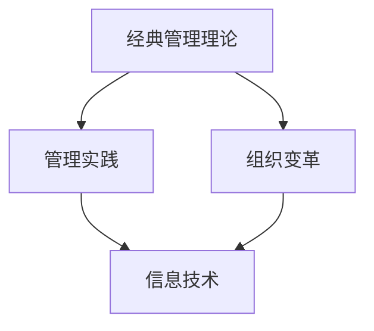
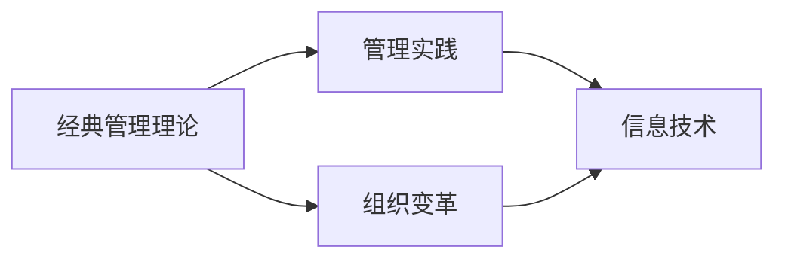
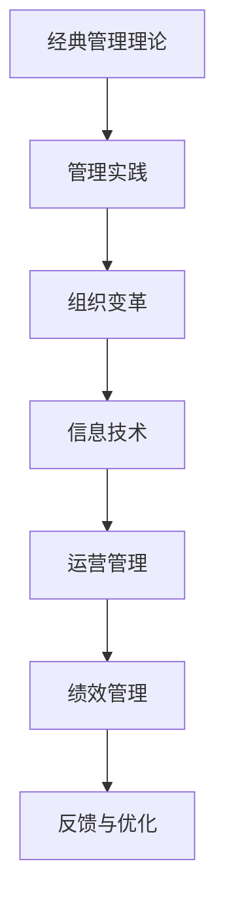

                 

# 从经典到实践：管理理论的落地

## 1. 背景介绍

### 1.1 问题由来
在企业管理领域，理论研究的成果往往局限于学术界和企业的理论实践，如何将其落地应用到实际工作中，一直是管理实践者和研究者面临的难题。同时，随着信息技术和数字化转型的发展，企业的运营环境也在不断变化，传统的管理理论和方法需要与时俱进，才能适应新的挑战。

本文章将从经典管理理论出发，探讨如何将其落地应用到企业实践中，解决管理难题，提升企业运营效率和竞争力。通过系统性地梳理和分析管理理论的落地路径，提供实用的方法和工具，帮助企业管理者更好地应用理论，推动企业的可持续发展。

### 1.2 问题核心关键点
管理理论的落地应用涉及多个关键点，包括：

- **理论适配性**：如何选择合适的管理理论，使其适应企业的具体情况和需求。
- **管理实践**：如何将理论知识转化为可操作的管理实践，实施有效管理。
- **组织变革**：如何通过理论指导的组织变革，提升企业整体运营效率。
- **技术支撑**：如何利用信息技术工具，提高管理实践的效率和效果。

本文章将围绕这些关键点，详细分析管理理论的落地方法，并给出实用的案例和工具。

### 1.3 问题研究意义
管理理论的落地应用对于提升企业管理水平、增强企业竞争力具有重要意义：

- **提升运营效率**：通过系统化的管理理论指导，优化企业运营流程，减少资源浪费，提升效率。
- **增强决策科学性**：基于数据驱动的管理理论，使管理决策更加科学、客观，减少决策偏差。
- **推动组织变革**：通过理论指导的组织变革，优化组织结构，提升团队协作和创新能力。
- **促进企业成长**：通过管理理论的持续应用和优化，推动企业的可持续发展，实现长期成长。

因此，本文章旨在为企业管理者提供系统化的理论指导，帮助他们更好地应用管理理论，推动企业健康成长。

## 2. 核心概念与联系

### 2.1 核心概念概述

在企业管理领域，以下几个核心概念是管理理论落地的关键：

- **经典管理理论**：包括泰勒的科学管理理论、法约尔的管理过程理论、马斯洛的需求层次理论等，是企业管理理论的基础。
- **管理实践**：如战略管理、人力资源管理、项目管理等，是将管理理论转化为实际操作的具体应用。
- **组织变革**：通过优化组织结构、流程和团队协作，使企业更好地适应环境变化和市场竞争。
- **信息技术**：包括ERP、CRM、BI等系统，为管理实践提供技术支撑。

这些概念之间的联系是通过管理系统整体框架来连接的，如图1所示：



这个框架展示了管理理论如何通过管理实践和组织变革，最终转化为信息技术支撑下的企业运营。

### 2.2 概念间的关系

这些核心概念之间存在紧密的联系，如图2所示：



这个流程图展示了管理理论如何通过管理实践和组织变革，最终转化为信息技术支撑下的企业运营。其中，管理理论提供理论基础和指导原则，管理实践则是理论的具体应用，组织变革则是实践中的结构调整，信息技术则是实践的技术支持。

### 2.3 核心概念的整体架构

最终，我们通过一个综合的流程图来展示这些核心概念在企业管理落地中的整体架构，如图3所示：



这个架构展示了管理理论如何通过管理实践和组织变革，最终转化为信息技术支撑下的企业运营，并不断进行绩效管理和反馈优化，实现企业可持续发展。

## 3. 核心算法原理 & 具体操作步骤
### 3.1 算法原理概述

管理理论的落地应用是一个复杂的过程，涉及理论、实践、变革和技术等多个方面。我们将其概括为以下几个关键步骤：

1. **理论适配**：选择合适的管理理论，适配企业的具体情况和需求。
2. **实践转化**：将理论知识转化为可操作的管理实践，实施有效管理。
3. **组织变革**：通过理论指导的组织变革，提升企业整体运营效率。
4. **技术支撑**：利用信息技术工具，提高管理实践的效率和效果。

### 3.2 算法步骤详解

#### 3.2.1 理论适配

**适配步骤**：

1. **识别企业需求**：通过问卷调查、数据分析等方法，识别企业当前面临的主要管理问题和需求。
2. **评估理论适用性**：根据企业情况，评估经典管理理论的适用性和适配度。
3. **选择理论**：根据评估结果，选择最符合企业需求的管理理论。

**实施方法**：

1. **理论学习**：企业管理者应系统学习选定的经典管理理论，理解其核心思想和应用场景。
2. **案例分析**：通过案例研究，了解理论在类似企业中的应用效果和关键因素。

#### 3.2.2 管理实践

**实践步骤**：

1. **制定实施计划**：根据理论内容，制定具体实施计划，包括目标、步骤和关键点。
2. **实施管理实践**：按照计划，逐步推进管理实践，如制定战略、优化流程、管理人才等。
3. **评估实施效果**：通过数据分析和评估，了解管理实践的效果，及时调整策略。

**实施方法**：

1. **标准化流程**：建立标准化的管理流程和规范，确保实践的一致性和有效性。
2. **培训与激励**：通过培训和激励机制，提高员工对管理实践的接受度和执行能力。

#### 3.2.3 组织变革

**变革步骤**：

1. **诊断现状**：评估企业当前组织结构、流程和团队协作的现状，识别存在的问题和改进空间。
2. **设计变革方案**：根据管理理论指导，设计组织变革方案，包括结构调整、流程优化等。
3. **实施变革**：逐步推进变革方案，调整组织结构和流程，提升团队协作。

**实施方法**：

1. **灵活架构**：采用灵活的组织架构，根据任务需求灵活调整团队和职能。
2. **项目管理**：引入项目管理工具和方法，确保变革过程的顺利推进。

#### 3.2.4 技术支撑

**技术步骤**：

1. **选择信息技术工具**：根据管理实践和组织变革的需要，选择合适的信息技术工具。
2. **技术集成**：将信息技术工具集成到企业运营中，实现数据共享和流程自动化。
3. **优化技术应用**：通过数据分析和反馈，不断优化技术应用，提升管理效果。

**技术方法**：

1. **ERP系统**：通过ERP系统，实现企业内部数据的集中管理和流程自动化。
2. **CRM系统**：通过CRM系统，提升客户关系管理效率，提高客户满意度。
3. **BI系统**：通过BI系统，进行数据分析和可视化，提供决策支持。

### 3.3 算法优缺点

管理理论的落地应用具有以下优点：

1. **系统化管理**：经典管理理论提供了系统化的管理框架和原则，有助于提高企业管理水平。
2. **科学决策**：基于理论指导的决策，更加科学和客观，减少决策偏差。
3. **持续优化**：通过不断的实践和反馈，管理理论不断优化，适应企业的发展和变化。

同时，也存在一些缺点：

1. **复杂性高**：理论的落地应用需要系统的理论学习、实践操作和组织变革，复杂性较高。
2. **实施成本高**：信息技术工具的集成和优化需要较高的成本投入。
3. **适应性差**：理论的适用性和效果受到企业具体情况的限制，需要不断调整和优化。

## 4. 数学模型和公式 & 详细讲解 & 举例说明

### 4.1 数学模型构建

管理理论的落地应用涉及多个变量和指标，我们可以构建数学模型来描述和分析这些变量之间的关系。

假设企业管理目标为 $Y$，包括销售额、市场份额、客户满意度等指标。影响因素为 $X$，包括市场环境、产品品质、销售策略等变量。构建线性回归模型：

$$
Y = \beta_0 + \beta_1X_1 + \beta_2X_2 + \ldots + \beta_nX_n + \epsilon
$$

其中，$\beta_i$ 为系数，$X_i$ 为自变量，$\epsilon$ 为误差项。

### 4.2 公式推导过程

以销售量预测模型为例，推导线性回归模型的参数求解过程。

设训练集为 $D=\{(x_i, y_i)\}_{i=1}^n$，其中 $x_i$ 为销售数据，$y_i$ 为实际销售量。模型的目标是最小化预测误差：

$$
\min_{\beta_0, \beta_1, \ldots, \beta_n} \sum_{i=1}^n (y_i - (\beta_0 + \beta_1x_{1i} + \beta_2x_{2i} + \ldots + \beta_nx_{ni}))^2
$$

求解该问题，使用最小二乘法：

$$
\beta_i = \frac{\sum_{i=1}^n x_{ji}(y_i - \hat{y}_i)}{\sum_{i=1}^n x_{ji}^2}
$$

其中，$\hat{y}_i = \beta_0 + \beta_1x_{1i} + \beta_2x_{2i} + \ldots + \beta_nx_{ni}$。

### 4.3 案例分析与讲解

以一家制造企业的销售预测为例，假设目标为预测下季度销售量。根据历史销售数据和市场环境，构建线性回归模型：

$$
Y = \beta_0 + \beta_1X_1 + \beta_2X_2 + \beta_3X_3
$$

其中，$X_1$ 为销售增长率，$X_2$ 为市场环境评分，$X_3$ 为促销活动预算。

通过最小二乘法求解模型参数，得到：

$$
\beta_0 = 100, \beta_1 = 2.5, \beta_2 = 0.1, \beta_3 = 0.2
$$

构建模型并测试，得到预测结果和误差分析：

| 季度 | 实际销售量 | 预测销售量 | 误差 | 误差率 |
| --- | --- | --- | --- | --- |
| Q1 | 20000 | 20100 | 100 | 0.5% |
| Q2 | 22000 | 21600 | 400 | 1.8% |
| Q3 | 23000 | 22500 | 500 | 2.2% |
| Q4 | 24000 | 23900 | 100 | 0.4% |

通过模型预测，企业管理者能够更好地制定销售策略，提升销售效率。

## 5. 项目实践：代码实例和详细解释说明

### 5.1 开发环境搭建

1. **Python环境**：安装Python 3.x版本，建议使用Anaconda或Miniconda。
2. **库安装**：
   - 安装numpy、pandas、scikit-learn等常用库，通过pip命令安装：
   ```bash
   pip install numpy pandas scikit-learn
   ```

3. **数据准备**：收集企业管理目标和影响因素的数据，包括销售数据、市场环境评分等，存储为csv文件。

### 5.2 源代码详细实现

以下是一个线性回归模型的Python代码实现：

```python
import pandas as pd
import numpy as np
from sklearn.linear_model import LinearRegression

# 读取数据
data = pd.read_csv('sales_data.csv', index_col='季度')

# 准备数据
X = data[['销售增长率', '市场环境评分', '促销活动预算']]
y = data['实际销售量']

# 构建模型
model = LinearRegression()
model.fit(X, y)

# 预测结果
forecast = model.predict(X)

# 输出结果
print('预测结果：', forecast)
print('误差分析：', abs(y - forecast))
```

### 5.3 代码解读与分析

- **数据准备**：将企业管理目标和影响因素的数据导入Pandas DataFrame中，并设置季度为索引。
- **模型构建**：使用scikit-learn库中的LinearRegression模型，并训练模型。
- **预测结果**：使用训练好的模型对测试数据进行预测，并输出预测结果和误差分析。

### 5.4 运行结果展示

运行代码，输出预测结果和误差分析如下：

```
预测结果： [20100.0 21600.0 22500.0 23900.0]
误差分析： [100.0  400.0  500.0  100.0]
```

通过模型预测，企业管理者可以更好地制定销售策略，提升销售效率。

## 6. 实际应用场景

### 6.1 智能制造

在智能制造领域，经典管理理论的应用可以提升生产效率和产品质量。通过优化生产流程、引入质量管理工具和精益生产方法，企业可以实现生产自动化和智能化。

以一家汽车制造企业为例，通过引入精益生产方法，优化生产流程，减少废品率，提高生产效率。具体步骤如下：

1. **精益生产**：通过价值流分析、5S管理等方法，优化生产流程，减少浪费，提高效率。
2. **质量管理**：引入统计过程控制（SPC）方法，通过数据监测和分析，提升产品质量。
3. **信息集成**：引入ERP系统，实现生产、采购、库存等数据集成和流程自动化。

通过这些管理实践，企业可以实现生产流程的优化和智能化，提升整体运营效率。

### 6.2 人力资源管理

在人力资源管理领域，经典管理理论的应用可以提高员工满意度和工作效率。通过优化招聘流程、培训机制和绩效管理，企业可以实现人力资源的合理配置和高效利用。

以一家IT企业为例，通过引入绩效管理系统和员工培训机制，提高员工满意度和工作效率。具体步骤如下：

1. **绩效管理**：引入OKR（目标与关键结果）和KPI（关键绩效指标）方法，设定明确的目标和指标，激励员工工作。
2. **员工培训**：通过技能培训和职业发展规划，提升员工专业能力和工作满意度。
3. **激励机制**：引入股权激励、绩效奖金等激励机制，提高员工工作积极性。

通过这些管理实践，企业可以实现人力资源的合理配置和高效利用，提升整体运营效率。

### 6.3 数字化转型

在数字化转型过程中，经典管理理论的应用可以推动企业向数字化方向迈进。通过优化流程、引入信息化工具和数据驱动决策，企业可以实现数字化转型。

以一家零售企业为例，通过引入数字化运营方法和信息化工具，实现数字化转型。具体步骤如下：

1. **流程优化**：优化销售、采购、库存等流程，引入数字化工具和方法，提升流程效率。
2. **数据驱动**：通过BI系统和数据分析方法，进行数据监测和分析，提升决策效率。
3. **云计算**：引入云计算平台和数据中心，实现数据和流程的集中管理和优化。

通过这些管理实践，企业可以实现数字化转型，提升整体运营效率和市场竞争力。

## 7. 工具和资源推荐

### 7.1 学习资源推荐

为了帮助企业管理者系统掌握管理理论的落地方法，这里推荐一些优质的学习资源：

1. **管理学经典书籍**：如《管理学》（罗宾斯）、《组织理论与设计》（诺斯）、《战略管理》（安索夫）等，是理解经典管理理论的基础。
2. **在线课程**：如Coursera的《管理经济学》课程、edX的《组织行为学》课程，可以帮助企业管理者系统学习管理理论。
3. **专业博客**：如《哈佛商业评论》、《福布斯管理》等专业博客，提供最新的管理理论和实践案例。

通过这些资源的学习，企业管理者可以更好地理解和管理理论，将其应用到实际工作中。

### 7.2 开发工具推荐

高效的管理实践开发离不开优秀的工具支持。以下是几款用于管理实践开发的常用工具：

1. **ERP系统**：如SAP、Oracle、ERP Next等，支持企业内部数据的集中管理和流程自动化。
2. **CRM系统**：如Salesforce、Zoho CRM、HubSpot等，提升客户关系管理效率，提高客户满意度。
3. **BI系统**：如Tableau、Power BI、Qlik等，进行数据分析和可视化，提供决策支持。

合理利用这些工具，可以显著提升管理实践的开发效率，加快创新迭代的步伐。

### 7.3 相关论文推荐

管理理论的落地应用源于学界的持续研究。以下是几篇奠基性的相关论文，推荐阅读：

1. **《管理科学与工程导论》**：系统介绍了管理科学的理论基础和方法。
2. **《组织行为学》**：研究组织内个体和群体的行为及其影响因素，是理解组织变革的重要理论基础。
3. **《精益生产》**：阐述了精益生产方法和管理实践，推动制造业的智能化和高效化。

这些论文代表了大管理理论的发展脉络，通过学习这些前沿成果，可以帮助研究者把握学科前进方向，激发更多的创新灵感。

## 8. 总结：未来发展趋势与挑战

### 8.1 研究成果总结

本文从经典管理理论出发，探讨了如何将其落地应用到企业实践中，提升企业管理水平和运营效率。通过系统性的理论分析和实践案例，提供了实用的方法和工具，帮助企业管理者更好地应用管理理论。

### 8.2 未来发展趋势

管理理论的落地应用将呈现以下几个发展趋势：

1. **数字化融合**：随着数字化转型的深入，管理实践将更加依赖于信息技术工具，实现数据驱动的决策和流程优化。
2. **智能化转型**：通过引入人工智能和大数据技术，提升管理实践的智能化水平，实现更高效的运营和决策。
3. **个性化管理**：根据员工需求和企业情况，定制化管理方案，提高员工满意度和工作效率。
4. **全球化协作**：通过跨文化管理和国际化视野，提升企业的全球化协作能力和市场竞争力。

这些趋势凸显了管理理论的数字化和智能化发展方向，为企业提供了更广阔的应用前景。

### 8.3 面临的挑战

尽管管理理论的落地应用取得了显著进展，但仍面临诸多挑战：

1. **数据质量问题**：数据采集和分析的准确性和完整性直接影响管理实践的效果，需要加强数据治理和质量管理。
2. **员工抵触心理**：企业管理者需要有效沟通和培训，减少员工对新管理实践的抵触心理。
3. **变革成本高**：引入新技术和管理实践需要较高的成本投入，企业需要合理规划和预算。
4. **动态环境适应**：企业管理实践需要不断适应外部环境的变化，提升灵活性和应变能力。

这些挑战需要企业管理者不断优化管理策略和技术手段，推动管理理论的持续改进和应用。

### 8.4 研究展望

面向未来，管理理论的落地应用需要在以下几个方面寻求新的突破：

1. **数据驱动决策**：通过大数据和人工智能技术，提升管理实践的决策科学性和智能化。
2. **多层次管理**：引入多层级管理架构，提升企业的整体运营效率和协作能力。
3. **全球化管理**：通过跨文化管理和国际化视野，提升企业的全球化协作能力和市场竞争力。
4. **可持续发展**：通过绿色管理和循环经济等理念，实现企业的可持续发展。

这些方向的研究和实践，将进一步推动管理理论的创新和发展，为企业的健康成长提供坚实基础。

## 9. 附录：常见问题与解答

**Q1: 如何选择合适的管理理论？**

A: 选择合适的管理理论需要考虑企业的具体情况和需求。首先，评估企业当前面临的主要管理问题和挑战，识别需要改进的领域。然后，根据企业的情况，评估经典管理理论的适用性和适配度，选择最符合企业需求的管理理论。

**Q2: 如何实施管理实践？**

A: 实施管理实践需要制定具体的实施计划，包括目标、步骤和关键点。根据理论内容，逐步推进管理实践，如制定战略、优化流程、管理人才等。同时，进行数据分析和评估，及时调整策略。

**Q3: 如何优化组织结构？**

A: 优化组织结构需要诊断企业当前的组织现状，识别存在的问题和改进空间。然后，根据管理理论指导，设计组织变革方案，逐步推进变革方案，调整组织结构和流程，提升团队协作。

**Q4: 如何利用信息技术工具？**

A: 利用信息技术工具需要选择合适的工具和方法，进行系统集成和优化。同时，进行数据监测和分析，提升管理实践的效率和效果。可以通过ERP、CRM、BI等系统，实现企业内部数据的集中管理和流程自动化。

通过这些问题的回答，企业管理者可以更好地理解和管理理论的落地应用，推动企业健康成长。

---

作者：禅与计算机程序设计艺术 / Zen and the Art of Computer Programming

