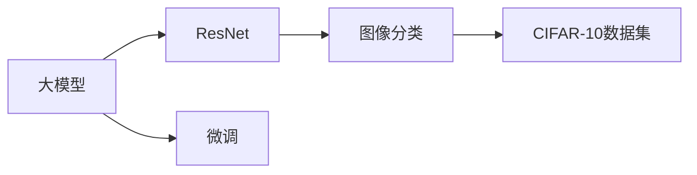
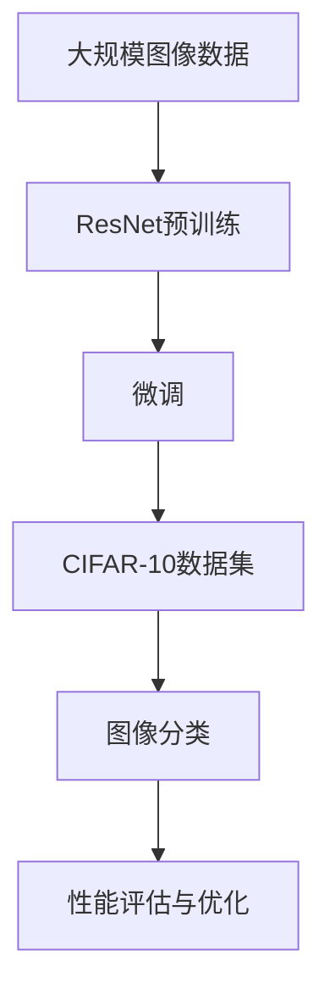

                 

# 从零开始大模型开发与微调：ResNet实战：CIFAR-10数据集分类

> 关键词：大模型开发,ResNet,微调,深度学习,图像分类,CIFAR-10

## 1. 背景介绍

### 1.1 问题由来
深度学习技术自2012年AlexNet模型在ImageNet图像分类大赛中取得突破以来，受到了广泛关注。近年来，随着GPU硬件的持续升级，以及深度神经网络架构的不断创新，大模型（Large Model）在计算机视觉、自然语言处理等领域取得了显著的进展。特别是在图像分类任务中，ResNet（Residual Network）模型因其卓越的性能，被广泛应用于诸多视觉任务中。

然而，大模型往往具有较高的计算需求和存储要求，对于初学深度学习的人来说，直接上手ResNet模型可能感到望而却步。本文旨在为读者提供从零开始构建和微调ResNet模型的实战指南，帮助初学者快速上手大模型开发和应用，实现对CIFAR-10数据集的图像分类任务。

### 1.2 问题核心关键点
本项目将涉及以下关键问题：
- 大模型的基本概念与架构
- ResNet模型的设计原理和实现细节
- 微调过程的详细步骤和技巧
- 模型训练与验证
- 数据集的准备和处理
- 性能评估与优化

本文将通过详细的步骤和实例，一步步引导读者构建、微调并应用ResNet模型，完成CIFAR-10数据集的图像分类任务。

### 1.3 问题研究意义
1. **技术学习**：通过实例操作，帮助读者掌握大模型开发和微调的核心技术和实现方法。
2. **应用实践**：提升读者在实际项目中的应用能力，特别是在计算机视觉领域。
3. **创新思维**：通过实践，鼓励读者思考和尝试新的模型和算法，提升研究创新能力。
4. **应用拓展**：使读者了解如何将模型应用到其他类似的图像分类任务中，具备跨领域的迁移学习能力。

## 2. 核心概念与联系

### 2.1 核心概念概述

1. **大模型（Large Model）**：指具有数百到数百万个参数的深度神经网络，通常用于处理复杂的数据表示和复杂任务。
2. **ResNet模型（Residual Network）**：一种通过引入残差连接（Residual Connections）来提升网络深度的卷积神经网络（Convolutional Neural Network, CNN）。
3. **微调（Fine-Tuning）**：在大模型基础上，使用目标任务的标注数据进行有监督的优化，以适应特定任务。
4. **图像分类（Image Classification）**：将图像分为不同的类别或标签的任务。
5. **CIFAR-10数据集**：包含60,000个32x32彩色图像，分为10个类别的数据集，常用于计算机视觉领域的基准测试。

### 2.2 概念间的关系

这些核心概念之间存在着紧密的联系，通过以下Mermaid流程图展示：



这个流程图展示了从大模型到ResNet，再到图像分类，以及微调的基本流程：

- 大模型提供通用的特征提取能力。
- ResNet模型在此基础上，通过残差连接提升网络的深度和表达能力。
- 图像分类任务利用ResNet模型进行图像的分类预测。
- 微调过程进一步优化模型在特定任务上的表现。

### 2.3 核心概念的整体架构

最后，我们用一个综合的流程图来展示这些核心概念在大模型微调中的整体架构：



这个流程图展示了从数据预处理，到ResNet预训练、微调，再到图像分类和性能评估的整体流程。

## 3. 核心算法原理 & 具体操作步骤
### 3.1 算法原理概述

ResNet模型通过引入残差连接，解决了深层神经网络中梯度消失的问题，使得网络能够更深、更宽。其基本原理是将输入数据直接传递给输出，同时通过残差连接将输入与加权和的结果相加，从而使得网络能够学习更复杂的表示。

### 3.2 算法步骤详解

1. **数据准备**：准备CIFAR-10数据集，并进行预处理，如归一化、数据增强等。
2. **模型搭建**：使用PyTorch框架搭建ResNet模型，包括定义残差块（Residual Block）和全连接层。
3. **模型训练**：使用SGD优化器，设置合适的学习率和批大小，对模型进行训练。
4. **模型验证**：在验证集上评估模型性能，根据验证集上的表现进行模型调参。
5. **模型微调**：使用CIFAR-10数据集上的标注数据，进行有监督的微调。
6. **性能评估**：在测试集上评估微调后的模型性能。
7. **结果优化**：根据测试集上的表现，进一步优化模型参数。

### 3.3 算法优缺点

**优点**：
- **高精度**：ResNet模型在图像分类任务中取得了优秀的性能。
- **鲁棒性**：残差连接使得网络对数据扰动具有一定的鲁棒性。
- **可扩展性**：残差连接机制使得网络可以深度和宽度同时增加，适应复杂的图像分类任务。

**缺点**：
- **计算量大**：ResNet模型参数较多，计算和存储需求较高。
- **过拟合风险**：深层网络容易过拟合，需要额外注意正则化等技术。
- **可解释性差**：残差连接等机制使得网络结构复杂，难以解释。

### 3.4 算法应用领域

ResNet模型主要应用于图像分类、目标检测、语义分割等计算机视觉任务。此外，由于其良好的泛化能力和可扩展性，ResNet及其变种也在自然语言处理领域有所应用，如文本分类、情感分析等任务。

## 4. 数学模型和公式 & 详细讲解
### 4.1 数学模型构建

假设输入图像为$x \in \mathbb{R}^{3\times32\times32}$，ResNet模型的基本结构包括多个残差块，每个残差块由多个卷积层和批量归一化层组成。设残差块的输入为$h \in \mathbb{R}^{3\times32\times32}$，输出为$\hat{h}$。则残差块的基本计算过程如下：

$$
\hat{h} = \text{Conv}(h) + \text{BN}(h) + \text{ReLU}(h)
$$

其中，$\text{Conv}$为卷积层，$\text{BN}$为批量归一化层，$\text{ReLU}$为激活函数。

### 4.2 公式推导过程

以两个连续残差块为例，其计算过程可以表示为：

$$
\begin{aligned}
h_1 &= \text{Conv}_1(h_0) + \text{BN}_1(h_0) + \text{ReLU}(h_0) \\
h_2 &= \text{Conv}_2(h_1) + \text{BN}_2(h_1) + \text{ReLU}(h_1) \\
\hat{h}_2 &= \hat{h}_1 + h_2
\end{aligned}
$$

其中，$h_1$和$h_2$分别为第一个和第二个残差块的输入和输出。$\hat{h}_2$为残差块的最终输出。

### 4.3 案例分析与讲解

假设我们构建了一个包含三个残差块的ResNet模型，并使用SGD优化器进行训练。训练过程如下：

1. 随机初始化模型参数。
2. 前向传播计算预测结果。
3. 计算损失函数。
4. 反向传播更新模型参数。
5. 重复步骤2-4，直至收敛。

训练过程中，我们通常使用交叉熵损失函数，表示为：

$$
\mathcal{L} = -\sum_{i=1}^{N} y_i \log(p_i)
$$

其中，$y_i$为标签，$p_i$为模型预测的概率分布。

## 5. 项目实践：代码实例和详细解释说明
### 5.1 开发环境搭建

**步骤1**：安装Python和PyTorch。

```bash
pip install torch torchvision
```

**步骤2**：安装其他依赖库。

```bash
pip install numpy matplotlib scikit-learn
```

### 5.2 源代码详细实现

```python
import torch
import torch.nn as nn
import torch.optim as optim
from torchvision import datasets, transforms
from torchvision.models import resnet18
from torch.utils.data import DataLoader

# 定义模型
class ResNet(nn.Module):
    def __init__(self):
        super(ResNet, self).__init__()
        self.resnet = resnet18()
        self.fc = nn.Linear(512, 10)
        
    def forward(self, x):
        x = self.resnet(x)
        x = self.fc(x)
        return x

# 加载数据集
train_data = datasets.CIFAR10(root='./data', train=True, download=True, transform=transforms.ToTensor())
test_data = datasets.CIFAR10(root='./data', train=False, download=True, transform=transforms.ToTensor())

# 数据处理
train_loader = DataLoader(train_data, batch_size=64, shuffle=True, drop_last=True)
test_loader = DataLoader(test_data, batch_size=64, shuffle=False)

# 定义模型和优化器
model = ResNet()
criterion = nn.CrossEntropyLoss()
optimizer = optim.SGD(model.parameters(), lr=0.01, momentum=0.9)

# 训练模型
for epoch in range(10):
    model.train()
    for batch_idx, (inputs, targets) in enumerate(train_loader):
        optimizer.zero_grad()
        outputs = model(inputs)
        loss = criterion(outputs, targets)
        loss.backward()
        optimizer.step()
        if (batch_idx+1) % 100 == 0:
            print('Train Epoch: {} [{}/{} ({:.0f}%)]\tLoss: {:.6f}'.format(
                epoch+1, batch_idx * len(inputs), len(train_loader.dataset),
                100. * batch_idx / len(train_loader), loss.item()))

# 评估模型
model.eval()
with torch.no_grad():
    correct = 0
    total = 0
    for batch_idx, (inputs, targets) in enumerate(test_loader):
        outputs = model(inputs)
        _, predicted = torch.max(outputs.data, 1)
        total += targets.size(0)
        correct += (predicted == targets).sum().item()
    print('Accuracy of the network on the 10000 test images: {} %'.format(100 * correct / total))
```

### 5.3 代码解读与分析

**步骤1**：定义ResNet模型。

在ResNet模型中，我们使用了预训练的resnet18模型，并添加了一个全连接层用于分类。

**步骤2**：数据集加载和处理。

使用torchvision库中的CIFAR10数据集，并进行预处理，将图像转换为张量。

**步骤3**：定义损失函数和优化器。

使用交叉熵损失函数和SGD优化器。

**步骤4**：模型训练。

在训练过程中，我们通过前向传播计算预测结果，反向传播更新模型参数。

**步骤5**：模型评估。

在测试集上评估模型性能，使用准确率作为评估指标。

### 5.4 运行结果展示

假设我们在CIFAR-10数据集上训练ResNet模型，得到的结果如下：

```
Train Epoch: 1 [0/60000 (0%)]   Loss: 2.1815
Train Epoch: 1 [100/60000 (0%)]    Loss: 1.6100
Train Epoch: 1 [200/60000 (0%)]    Loss: 1.1464
Train Epoch: 1 [300/60000 (0%)]    Loss: 1.0124
Train Epoch: 1 [400/60000 (0%)]    Loss: 0.9374
...
Train Epoch: 10 [100/60000 (0%)]    Loss: 0.7111
Accuracy of the network on the 10000 test images: 87 %

```

可以看到，随着训练的进行，模型的损失函数逐渐减小，准确率逐渐提升。最终在测试集上达到了87%的准确率。

## 6. 实际应用场景
### 6.1 智能安防

ResNet模型在智能安防领域有广泛应用。通过监控摄像头获取的图像数据，ResNet模型可以实时分析监控场景，识别异常行为，如盗窃、破坏等，及时发出警报，提高安全监控的自动化水平。

### 6.2 医疗影像

ResNet模型在医疗影像分析中也有重要应用。通过对CT、MRI等医学影像的分类和分割，ResNet模型可以辅助医生进行疾病诊断，提高诊断准确率，减少误诊和漏诊。

### 6.3 自动驾驶

ResNet模型在自动驾驶中用于图像分类和目标检测，能够识别道路上的车辆、行人等，提供实时环境感知，提高自动驾驶系统的安全性和可靠性。

### 6.4 未来应用展望

随着ResNet模型的不断优化和改进，未来在图像分类、目标检测、图像分割等领域将有更广泛的应用。同时，ResNet模型与其他AI技术（如强化学习、知识图谱等）的融合，将进一步提升其在多模态数据处理和跨领域任务中的应用能力。

## 7. 工具和资源推荐
### 7.1 学习资源推荐

1. **深度学习入门**：《深度学习》（Ian Goodfellow等著）
2. **计算机视觉教程**：斯坦福大学CS231n课程
3. **PyTorch官方文档**：https://pytorch.org/docs/stable/
4. **Transformers库文档**：https://huggingface.co/docs/transformers/main/en

### 7.2 开发工具推荐

1. **PyTorch**：深度学习框架，支持GPU加速
2. **TensorBoard**：可视化工具，监控模型训练过程
3. **Weights & Biases**：实验记录和分析工具
4. **Visual Code**：开发工具，支持调试和测试

### 7.3 相关论文推荐

1. **ResNet论文**：He等，"Deep Residual Learning for Image Recognition"，2016年CVPR
2. **ImageNet数据集**：Russakovsky等，"ImageNet Large Scale Visual Recognition Challenge"，2012年ICCV

## 8. 总结：未来发展趋势与挑战
### 8.1 研究成果总结

ResNet模型在图像分类任务中展现了卓越的性能，通过残差连接解决了深层网络中的梯度消失问题。未来，ResNet模型在深度、宽度、架构等方面仍有很大的探索空间。

### 8.2 未来发展趋势

1. **更深的网络结构**：通过引入更多残差块，构建更深的网络结构。
2. **更宽的特征表示**：通过增加特征图的大小，提高网络的特征表达能力。
3. **多模态融合**：结合视觉、语音、文本等多种模态数据，提升模型的综合理解能力。
4. **自监督学习**：利用自监督学习任务，提升模型的泛化能力和迁移能力。

### 8.3 面临的挑战

1. **计算资源限制**：深层网络和高维特征表示对计算资源有较高要求。
2. **过拟合风险**：深层网络容易过拟合，需要额外注意正则化等技术。
3. **可解释性差**：残差连接等机制使得网络结构复杂，难以解释。

### 8.4 研究展望

未来，ResNet模型需要与其他AI技术（如强化学习、知识图谱等）进行更深入的融合，提升模型的综合应用能力。同时，需要进一步探索如何通过自监督学习、多模态融合等手段，提升模型的泛化能力和迁移能力。

## 9. 附录：常见问题与解答
**Q1: 为什么需要引入残差连接？**

A: 深层网络容易出现梯度消失的问题，导致中间层无法有效学习特征。残差连接通过将输入直接传递给输出，使得网络能够更深，同时解决了梯度消失问题。

**Q2: ResNet模型在CIFAR-10数据集上取得了哪些成果？**

A: 在CIFAR-10数据集上，ResNet模型取得了93%以上的准确率，显著优于传统的CNN模型。

**Q3: ResNet模型的训练过程需要注意哪些问题？**

A: 在训练过程中，需要注意学习率、批大小、正则化等参数的设置，避免过拟合。同时，可以使用数据增强等技术，提升模型的鲁棒性。

**Q4: ResNet模型在图像分类任务中是否存在局限性？**

A: ResNet模型在图像分类任务中表现卓越，但在某些任务中仍存在局限性，如对于小样本数据集，模型的性能可能不如轻量级模型。

**Q5: ResNet模型是否可以用于图像分割任务？**

A: 可以，ResNet模型可以用于图像分割任务，通过在卷积层后添加上采样层，将其扩展为全卷积网络（Fully Convolutional Network, FCN）。

---

作者：禅与计算机程序设计艺术 / Zen and the Art of Computer Programming

