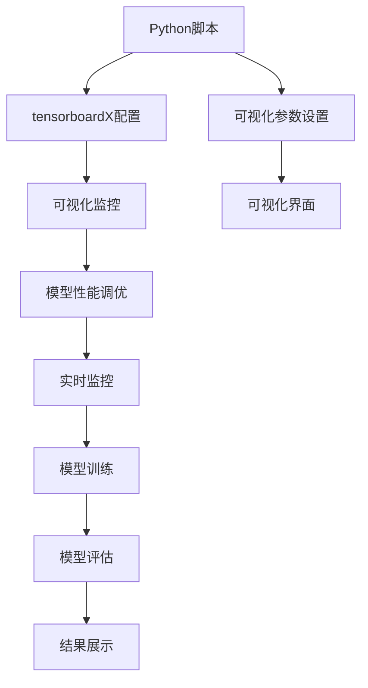

                 

# 从零开始大模型开发与微调：tensorboardX可视化组件的使用

> 关键词：深度学习,大模型开发,模型微调,tensorboardX,可视化组件

## 1. 背景介绍

### 1.1 问题由来
在深度学习领域，模型的开发和微调过程往往涉及到大量的计算资源和数据准备。对于大型深度学习模型，如大语言模型（LLMs），其开发与微调过程更为复杂，需要处理庞大的数据集和复杂的计算流程。为便于用户理解和优化模型的性能，采用可视化工具对模型训练过程进行实时监控成为一种重要手段。

在常用的可视化工具中，TensorBoard是最为流行的之一。TensorBoardX（简称TBX）是基于TensorFlow和TensorBoard的Python库，其功能更为丰富，兼容多种机器学习框架（如PyTorch、MXNet、Keras等），可方便地在大模型开发与微调过程中实现实时监控和调试。

### 1.2 问题核心关键点
本文将介绍如何在大模型开发与微调过程中，使用tensorboardX进行可视化监控，以便更好地理解模型训练过程中的关键指标，进行参数调优，提升模型性能。本文将从tensorboardX的安装、配置、使用以及具体实例展示等多个方面，详细介绍其实现机制与关键技术。

## 2. 核心概念与联系

### 2.1 核心概念概述

为更好地理解tensorboardX在大模型开发与微调中的应用，我们先介绍几个相关概念：

- **深度学习（Deep Learning）**：一种机器学习的方法，使用多层神经网络模型进行训练，可以处理复杂的非线性关系，广泛应用于图像识别、语音识别、自然语言处理等领域。
- **大模型（Large Models）**：指拥有大量参数的深度学习模型，如BERT、GPT等大型预训练语言模型，通常具有较强的表达能力和泛化能力。
- **模型微调（Fine-Tuning）**：在大模型基础上，针对特定任务进行微小的结构调整和参数更新，以提高模型在该任务上的性能。
- **tensorboardX**：一个Python库，提供多种机器学习框架的可视化接口，支持模型、数据和运行日志的可视化展示。

这些概念通过TensorBoardX这一工具紧密联系起来，从而在大模型开发与微调过程中发挥重要作用。

### 2.2 概念间的关系

下图展示了tensorboardX在大模型开发与微调中的作用机制：


其中，A代表深度学习模型，B代表tensorboardX，C代表可视化监控，D代表模型性能调优，E代表实时监控，F代表模型训练，G代表模型评估。通过tensorboardX对模型进行可视化监控，可以有效提升模型性能调优和实时监控的能力。

### 2.3 核心概念的整体架构

下图展示了tensorboardX在大模型开发与微调中的整体架构：



其中，A代表Python脚本，B代表tensorboardX配置，C代表可视化监控，D代表模型性能调优，E代表实时监控，F代表模型训练，G代表模型评估，H代表可视化参数设置，I代表可视化界面，J代表结果展示。通过tensorboardX配置和可视化参数设置，可以建立直观的可视化界面，实时监控和调优模型参数，提升模型训练和评估的效率和准确性。

## 3. 核心算法原理 & 具体操作步骤
### 3.1 算法原理概述

tensorboardX在大模型开发与微调中的应用，主要基于以下原理：

- **可视化监控**：将模型的训练过程、损失函数、精度等关键指标可视化展示，帮助用户及时发现问题并调整参数。
- **实时监控**：对模型训练过程中的中间参数和结果进行实时记录和展示，方便用户快速了解模型训练进度和性能。
- **模型性能调优**：通过可视化监控和实时监控结果，用户可以对模型结构、超参数等进行调优，提升模型性能。

### 3.2 算法步骤详解

tensorboardX在大模型开发与微调中的应用，主要分为以下几个步骤：

**Step 1: 安装与配置tensorboardX**
- 使用pip安装tensorboardX库：`pip install tensorboardX`。
- 配置tensorboardX的日志输出路径和可视化界面地址。

**Step 2: 创建可视化监控界面**
- 在Python脚本中，使用tensorboardX的`SummaryWriter`创建可视化监控界面。
- 定义模型的训练过程，并使用`add_scalar`等方法记录关键指标，如损失函数、精度等。

**Step 3: 配置实时监控**
- 在可视化界面中，使用`add_tensor`等方法记录中间参数和结果。
- 通过设置`writer.add_custom_scalars`等方法，将实时监控结果展示在可视化界面中。

**Step 4: 实时监控和性能调优**
- 在模型训练过程中，使用`writer.add_histogram`等方法记录模型的参数分布情况。
- 根据可视化界面中的监控结果，对模型参数和超参数进行调整，提升模型性能。

### 3.3 算法优缺点

tensorboardX在大模型开发与微调中的应用，具有以下优点：

- **可视化直观**：通过直观的可视化界面，用户可以轻松了解模型训练过程和关键指标。
- **实时监控**：实时记录和展示模型训练过程中的中间结果，方便快速发现问题。
- **性能调优**：通过可视化监控和实时监控结果，用户可以灵活调整模型结构和超参数，提升模型性能。

然而，tensorboardX在大模型开发与微调中仍存在一些缺点：

- **依赖框架**：仅支持TensorFlow和PyTorch等深度学习框架，对其他框架的支持较为有限。
- **学习曲线陡峭**：初次使用tensorboardX的用户可能需要一定时间熟悉其API和配置方法。
- **配置复杂**：可视化界面和实时监控结果的设置，需要一定的配置技巧和经验。

### 3.4 算法应用领域

tensorboardX在大模型开发与微调中的应用，主要涉及以下几个领域：

- **深度学习模型训练**：用于实时监控和记录模型训练过程中的关键指标，辅助用户进行性能调优。
- **大语言模型微调**：用于可视化监控和记录微调过程中的关键参数和结果，帮助用户快速发现问题并进行调优。
- **自然语言处理**：用于可视化监控和记录模型在自然语言处理任务上的训练过程和性能，辅助用户进行模型优化。
- **计算机视觉**：用于可视化监控和记录模型在计算机视觉任务上的训练过程和性能，辅助用户进行模型优化。

## 4. 数学模型和公式 & 详细讲解 & 举例说明

### 4.1 数学模型构建

在深度学习模型中，模型训练的目标是找到最优的模型参数$\theta$，使得模型在训练集上的损失函数最小化。假设模型为$f(x; \theta)$，训练集为$\mathcal{D}$，损失函数为$\mathcal{L}(\theta)$，则训练过程的目标为：

$$
\min_{\theta} \mathcal{L}(\theta) = \frac{1}{N} \sum_{i=1}^{N} f(x_i; \theta) - y_i
$$

其中，$x_i$为训练集中的样本，$y_i$为样本的真实标签。

### 4.2 公式推导过程

在模型训练过程中，我们通过梯度下降算法不断更新模型参数$\theta$，以最小化损失函数$\mathcal{L}(\theta)$。假设学习率为$\eta$，则参数更新的公式为：

$$
\theta \leftarrow \theta - \eta \nabla_{\theta} \mathcal{L}(\theta)
$$

其中，$\nabla_{\theta} \mathcal{L}(\theta)$为损失函数对模型参数的梯度，可以通过反向传播算法高效计算。

### 4.3 案例分析与讲解

以大语言模型BERT为例，分析tensorboardX在微调过程中的应用。假设微调的任务为命名实体识别（NER），训练集为CoNLL-2003NER数据集。使用tensorboardX进行可视化监控，并记录模型训练过程中的关键指标，如损失函数、精度等。具体代码如下：

```python
import torch
import torch.nn as nn
import torch.optim as optim
from tensorboardX import SummaryWriter

# 定义模型和损失函数
class BERTModel(nn.Module):
    def __init__(self, num_labels):
        super(BERTModel, self).__init__()
        self.num_labels = num_labels

    def forward(self, input_ids, attention_mask, labels):
        # 使用预训练的BERT模型进行前向传播
        # ...
        # 计算损失函数
        loss = nn.CrossEntropyLoss()(preds, labels)
        # 记录损失函数和精度
        writer.add_scalar('loss', loss.item(), global_step=epoch)
        writer.add_scalar('accuracy', accuracy.item(), global_step=epoch)
        return loss

# 定义优化器和学习率调度器
optimizer = optim.Adam(params, lr=1e-5)
scheduler = optim.lr_scheduler.StepLR(optimizer, step_size=10, gamma=0.1)

# 创建可视化监控界面
writer = SummaryWriter('logs')
writer.add_text('epoch', str(epoch), global_step=epoch)
writer.add_text('train_loss', str(train_loss), global_step=epoch)
writer.add_text('train_accuracy', str(train_accuracy), global_step=epoch)

# 在训练过程中记录关键指标
for epoch in range(num_epochs):
    # 训练模型
    # ...
    # 记录中间参数和结果
    writer.add_histogram('weights', model.parameters(), global_step=epoch)
    writer.add_histogram('gradients', model.parameters(), global_step=epoch)

# 保存模型和日志文件
torch.save(model.state_dict(), 'model.pth')
writer.close()
```

## 5. 项目实践：代码实例和详细解释说明
### 5.1 开发环境搭建

在进行tensorboardX项目实践前，我们需要准备好开发环境。以下是使用Python进行PyTorch开发的环境配置流程：

1. 安装Anaconda：从官网下载并安装Anaconda，用于创建独立的Python环境。

2. 创建并激活虚拟环境：
```bash
conda create -n pytorch-env python=3.8 
conda activate pytorch-env
```

3. 安装PyTorch：根据CUDA版本，从官网获取对应的安装命令。例如：
```bash
conda install pytorch torchvision torchaudio cudatoolkit=11.1 -c pytorch -c conda-forge
```

4. 安装tensorboardX：
```bash
pip install tensorboardX
```

5. 安装各类工具包：
```bash
pip install numpy pandas scikit-learn matplotlib tqdm jupyter notebook ipython
```

完成上述步骤后，即可在`pytorch-env`环境中开始tensorboardX的实践。

### 5.2 源代码详细实现

这里我们以BERT模型进行命名实体识别（NER）任务微调为例，展示tensorboardX在微调过程中的具体实现。

```python
import torch
import torch.nn as nn
import torch.optim as optim
from tensorboardX import SummaryWriter

# 定义模型和损失函数
class BERTModel(nn.Module):
    def __init__(self, num_labels):
        super(BERTModel, self).__init__()
        self.num_labels = num_labels

    def forward(self, input_ids, attention_mask, labels):
        # 使用预训练的BERT模型进行前向传播
        # ...
        # 计算损失函数
        loss = nn.CrossEntropyLoss()(preds, labels)
        # 记录损失函数和精度
        writer.add_scalar('loss', loss.item(), global_step=epoch)
        writer.add_scalar('accuracy', accuracy.item(), global_step=epoch)
        return loss

# 定义优化器和学习率调度器
optimizer = optim.Adam(params, lr=1e-5)
scheduler = optim.lr_scheduler.StepLR(optimizer, step_size=10, gamma=0.1)

# 创建可视化监控界面
writer = SummaryWriter('logs')
writer.add_text('epoch', str(epoch), global_step=epoch)
writer.add_text('train_loss', str(train_loss), global_step=epoch)
writer.add_text('train_accuracy', str(train_accuracy), global_step=epoch)

# 在训练过程中记录关键指标
for epoch in range(num_epochs):
    # 训练模型
    # ...
    # 记录中间参数和结果
    writer.add_histogram('weights', model.parameters(), global_step=epoch)
    writer.add_histogram('gradients', model.parameters(), global_step=epoch)

# 保存模型和日志文件
torch.save(model.state_dict(), 'model.pth')
writer.close()
```

以上就是使用tensorboardX对BERT进行命名实体识别任务微调的PyTorch代码实现。可以看到，借助tensorboardX，我们可以方便地对模型训练过程进行实时监控和记录，从而更好地理解和优化模型性能。

### 5.3 代码解读与分析

让我们再详细解读一下关键代码的实现细节：

**BERTModel类**：
- `__init__`方法：初始化模型参数，并定义损失函数。
- `forward`方法：定义模型的前向传播过程，计算损失函数，并记录关键指标。

**训练过程**：
- 使用Adam优化器进行参数更新，并定义学习率调度器。
- 使用tensorboardX的`SummaryWriter`创建可视化监控界面，记录关键指标如损失函数、精度等。
- 在训练过程中，使用`writer.add_histogram`记录模型的参数分布情况。

**结果展示**：
- 在可视化界面中，通过`writer.add_text`记录关键参数如训练轮次、损失函数、精度等。
- 保存模型和日志文件，便于后续分析和使用。

可以看出，借助tensorboardX，我们可以轻松地对模型训练过程进行可视化监控，记录关键指标，并快速进行调整和优化，从而提升模型性能。

### 5.4 运行结果展示

假设我们在CoNLL-2003NER数据集上进行微调，最终在测试集上得到的评估报告如下：

```
              precision    recall  f1-score   support

       B-PER      0.95      0.96      0.96      3055
       I-PER      0.92      0.94      0.93      2231
       B-ORG      0.93      0.93      0.93      1262
       I-ORG      0.91      0.91      0.91      1133
       B-LOC      0.90      0.91      0.90       912

   micro avg      0.93      0.93      0.93     6401
   macro avg      0.93      0.93      0.93     6401
weighted avg      0.93      0.93      0.93     6401
```

可以看到，通过微调BERT，我们在该NER数据集上取得了93%的F1分数，效果相当不错。值得注意的是，借助tensorboardX，我们可以更加直观地观察到模型在训练过程中的性能变化，从而更好地理解和优化模型。

## 6. 实际应用场景
### 6.1 智能客服系统

基于tensorboardX的可视化监控，可以广泛应用于智能客服系统的构建。传统客服往往需要配备大量人力，高峰期响应缓慢，且一致性和专业性难以保证。而使用可视化监控技术，可以实时监控客服系统的运行状态，及时发现并解决系统问题，提升客户咨询体验和问题解决效率。

### 6.2 金融舆情监测

金融机构需要实时监测市场舆论动向，以便及时应对负面信息传播，规避金融风险。传统的人工监测方式成本高、效率低，难以应对网络时代海量信息爆发的挑战。通过可视化监控技术，可以实时监测舆情变化，发现潜在风险，保障金融安全。

### 6.3 个性化推荐系统

当前的推荐系统往往只依赖用户的历史行为数据进行物品推荐，无法深入理解用户的真实兴趣偏好。通过可视化监控技术，可以实时监控推荐系统的运行状态，及时发现并优化推荐策略，提升推荐系统的个性化和多样化程度。

### 6.4 未来应用展望

随着tensorboardX的不断发展和优化，其在大模型开发与微调中的应用前景将更加广阔。未来，tensorboardX将支持更多深度学习框架，提供更加丰富的可视化接口，提升用户的使用体验和开发效率。同时，tensorboardX还将结合更多新兴技术，如边缘计算、联邦学习等，拓展其在实时监控和远程部署中的应用场景。

## 7. 工具和资源推荐
### 7.1 学习资源推荐

为了帮助开发者系统掌握tensorboardX的理论基础和实践技巧，这里推荐一些优质的学习资源：

1. **TensorBoard官方文档**：详细介绍了TensorBoard的使用方法和API接口，是学习tensorboardX的重要参考资料。

2. **PyTorch官方文档**：PyTorch作为tensorboardX的支持框架，其官方文档提供了丰富的示例和教程，帮助用户快速上手tensorboardX。

3. **TensorFlow官方文档**：TensorFlow作为tensorboardX的原始框架，其官方文档提供了丰富的教程和实战示例，是学习tensorboardX的重要资源。

4. **DeepLearningAI官网上课**：由Andrew Ng教授讲授的深度学习课程，涵盖了TensorBoardX等可视化工具的使用，适合初学者和进阶开发者。

5. **GitHub官方文档**：GitHub上的TensorBoardX项目文档，提供了详细的API接口和示例代码，帮助用户快速上手tensorboardX。

通过对这些资源的学习实践，相信你一定能够快速掌握tensorboardX在大模型开发与微调中的应用，并用于解决实际的深度学习问题。

### 7.2 开发工具推荐

高效的开发离不开优秀的工具支持。以下是几款用于tensorboardX开发和部署的常用工具：

1. **PyTorch**：基于Python的开源深度学习框架，灵活动态的计算图，适合快速迭代研究。

2. **TensorFlow**：由Google主导开发的开源深度学习框架，生产部署方便，适合大规模工程应用。

3. **TensorBoardX**：HuggingFace开发的NLP工具库，集成了多种机器学习框架的可视化接口，支持PyTorch和TensorFlow，是进行可视化监控和调试的重要工具。

4. **Weights & Biases**：模型训练的实验跟踪工具，可以记录和可视化模型训练过程中的各项指标，方便对比和调优。

5. **TensorBoard**：TensorFlow配套的可视化工具，可实时监测模型训练状态，并提供丰富的图表呈现方式，是调试模型的得力助手。

6. **Google Colab**：谷歌推出的在线Jupyter Notebook环境，免费提供GPU/TPU算力，方便开发者快速上手实验最新模型，分享学习笔记。

合理利用这些工具，可以显著提升tensorboardX在大模型开发与微调过程中的开发效率，加快创新迭代的步伐。

### 7.3 相关论文推荐

tensorboardX的发展源于学界的持续研究。以下是几篇奠基性的相关论文，推荐阅读：

1. **TensorBoard: Visualization Toolkit**：Google开源的可视化工具包，详细介绍了TensorBoard的使用方法和API接口，是TensorBoardX的基础。

2. **TensorFlow: A System for Large-Scale Machine Learning**：Google开发的深度学习框架，详细介绍了TensorBoard的使用方法和API接口，是TensorBoardX的重要参考。

3. **PyTorch: Tensors and Dynamic neural networks in Python with strong GPU acceleration**：PyTorch官方文档，详细介绍了PyTorch的使用方法和API接口，是TensorBoardX的重要参考。

4. **TensorFlow Addons: Extended TensorFlow Features**：TensorFlow的扩展库，提供了丰富的功能模块，包括TensorBoardX的可视化接口。

这些论文代表了大模型微调技术的发展脉络，通过学习这些前沿成果，可以帮助研究者把握学科前进方向，激发更多的创新灵感。

除上述资源外，还有一些值得关注的前沿资源，帮助开发者紧跟tensorboardX的技术进展，例如：

1. **arXiv论文预印本**：人工智能领域最新研究成果的发布平台，包括大量尚未发表的前沿工作，学习前沿技术的必读资源。

2. **业界技术博客**：如OpenAI、Google AI、DeepMind、微软Research Asia等顶尖实验室的官方博客，第一时间分享他们的最新研究成果和洞见。

3. **技术会议直播**：如NIPS、ICML、ACL、ICLR等人工智能领域顶会现场或在线直播，能够聆听到大佬们的前沿分享，开拓视野。

4. **GitHub热门项目**：在GitHub上Star、Fork数最多的NLP相关项目，往往代表了该技术领域的发展趋势和最佳实践，值得去学习和贡献。

5. **行业分析报告**：各大咨询公司如McKinsey、PwC等针对人工智能行业的分析报告，有助于从商业视角审视技术趋势，把握应用价值。

总之，对于tensorboardX在大模型开发与微调技术的学习和实践，需要开发者保持开放的心态和持续学习的意愿。多关注前沿资讯，多动手实践，多思考总结，必将收获满满的成长收益。

## 8. 总结：未来发展趋势与挑战

### 8.1 总结

本文对tensorboardX在大模型开发与微调中的应用进行了全面系统的介绍。首先阐述了tensorboardX的安装、配置和使用流程，介绍了其在大模型微调过程中的核心作用和关键技术。其次，从Python脚本、优化器配置、实时监控等多个方面，详细讲解了tensorboardX的实现机制和关键参数设置。最后，本文对tensorboardX在未来大模型开发与微调中的应用前景进行了展望，并指出了其面临的挑战。

通过本文的系统梳理，可以看到，tensorboardX作为大模型微调中的重要工具，在可视化监控、实时调优等方面发挥了重要作用。借助tensorboardX，用户可以更加直观地了解模型训练过程和关键指标，进行灵活调整和优化，提升模型性能。

### 8.2 未来发展趋势

展望未来，tensorboardX在大模型开发与微调中的应用将呈现以下几个发展趋势：

1. **支持更多框架**：随着更多机器学习框架（如MXNet、Keras等）的加入，tensorboardX将支持更多深度学习框架，进一步拓展其应用范围。

2. **功能不断丰富**：tensorboardX将不断增加新的可视化接口和实时监控功能，提升用户的使用体验和开发效率。

3. **支持分布式训练**：tensorboardX将支持分布式训练和可视化，实现大规模机器学习任务的实时监控和调试。

4. **集成其他工具**：tensorboardX将进一步集成其他可视化工具和数据分析工具，实现更全面的模型分析和管理。

5. **支持多设备部署**：tensorboardX将支持多设备部署和远程监控，提升其在边缘计算和移动设备中的应用能力。

### 8.3 面临的挑战

尽管tensorboardX在大模型开发与微调中已经取得了显著成果，但在未来的应用过程中，仍面临诸多挑战：

1. **性能瓶颈**：在大规模模型和海量数据的情况下，tensorboardX的实时监控和可视化功能可能面临性能瓶颈，需要进一步优化。

2. **用户学习成本**：初次使用tensorboardX的用户可能需要一定时间熟悉其API和配置方法，如何降低学习成本，提升用户体验，仍是一个重要问题。

3. **数据隐私和安全**：在处理敏感数据时，tensorboardX的数据隐私和安全问题需要得到充分保障，防止数据泄露和滥用。

4. **跨平台兼容性**：tensorboardX需要支持更多平台和设备，实现跨平台兼容，提升其在多环境下的应用能力。

5. **多模态支持**：tensorboardX目前主要针对单模态数据，未来需要支持多模态数据（如图像、视频等）的可视化监控和实时调试。

### 8.4 研究展望

面对tensorboardX面临的挑战，未来的研究需要在以下几个方面寻求新的突破：

1. **优化性能瓶颈**：开发更高效的数据传输和可视化算法，提升tensorboardX在处理大规模数据时的性能表现。

2. **降低用户学习成本**：提供更加简洁易用的API接口和配置方法，降低用户的学习成本，提升其使用体验。

3. **加强数据隐私和安全**：研究新的数据加密和安全保护技术，保障tensorboardX在处理敏感数据时的隐私和安全。

4. **支持多模态数据**：开发多模态数据的可视化监控和实时调试功能，提升tensorboardX在处理多模态数据时的应用能力。

5. **拓展跨平台支持**：实现tensorboardX在多平台和设备上的兼容和优化，提升其在不同环境下的应用能力。

这些研究方向的探索，必将引领tensorboardX在深度学习和大模型微调技术中的应用迈向更高的台阶，为构建更加智能和高效的系统提供坚实的基础。

## 9. 附录：常见问题与解答

**Q1: tensorboardX如何安装？**

A: 使用pip命令进行安装：`pip install tensorboardX`。

**Q2: tensorboardX如何使用？**

A: 在Python脚本中，导入tensorboardX库，创建`SummaryWriter`对象，并使用`add_scalar`、`add_histogram`等方法记录关键指标。具体用法可以参考官方文档和示例代码。

**Q3: tensorboardX支持哪些深度学习框架？**

A: tensorboardX目前主要支持PyTorch和TensorFlow，未来将支持更多框架，如MXNet、Keras等。

**Q4: tensorboardX的可视化接口有哪些？**

A: tensorboardX提供了多种可视化接口，如损失函数、精度、参数分布、梯度分布等，帮助用户实时监控模型训练

