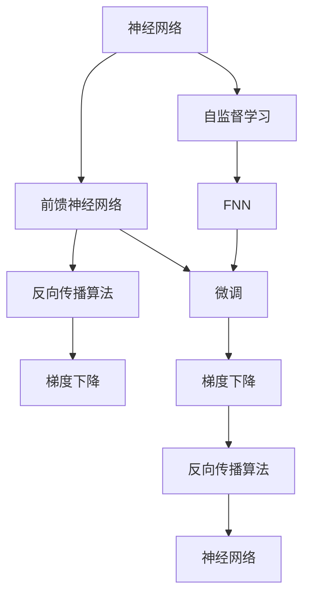

                 

# 从零开始大模型开发与微调：反馈神经网络反向传播算法介绍

> 关键词：大模型开发,反向传播算法,神经网络,梯度下降,深度学习

## 1. 背景介绍

在人工智能领域，神经网络被广泛应用于图像识别、语音识别、自然语言处理等任务中。反馈神经网络(feedforward neural network, FNN)是一种基本神经网络结构，其学习过程基于反向传播算法(Backpropagation Algorithm)，通过前向传播和反向传播两个阶段更新模型参数，从而实现对输入数据的拟合。反向传播算法不仅适用于传统的前馈神经网络，同样也可应用于大模型的微调、迁移学习、自监督学习等高级任务中。本文将详细介绍反向传播算法的原理与实现，并展示其在深度学习模型训练中的关键作用。

## 2. 核心概念与联系

### 2.1 核心概念概述

在介绍反向传播算法之前，我们先简要介绍一下相关核心概念：

1. **神经网络(Neural Network, NN)**：由大量神经元构成的非线性网络，通过连接权重和偏置项，对输入数据进行非线性变换，实现从输入到输出的映射。

2. **前馈神经网络(Feedforward Neural Network, FNN)**：最经典的神经网络结构，数据单向通过网络层，每一层只与前一层相连，且不可跨层传递。

3. **反向传播算法(Backpropagation Algorithm)**：用于前馈神经网络的参数优化方法，通过计算误差梯度，反向更新网络层中的权重和偏置，从而最小化损失函数。

4. **梯度下降(Gradient Descent, GD)**：一种常见的优化算法，通过迭代更新模型参数，使得损失函数最小化。

5. **自监督学习(Self-Supervised Learning, SSL)**：使用无标签数据进行模型训练，通过自监督学习任务如掩码语言模型、未来预测等，自动学习模型的结构与参数。

6. **微调(Fine-Tuning)**：在预训练模型的基础上，使用有标签数据对模型进行进一步优化，适应特定任务，如文本分类、问答系统等。

这些核心概念之间有着密切联系，构成了深度学习的基本框架。神经网络通过前馈传播获取输出，反向传播算法计算误差梯度，梯度下降优化参数，从而实现模型的训练和微调。自监督学习和微调进一步拓展了神经网络的应用范围，提升其泛化能力和性能。

### 2.2 概念间的关系

这些核心概念之间的关系可以通过以下Mermaid流程图来展示：



这个流程图展示了神经网络中这些关键概念的关系：

1. 神经网络是基本架构，前馈神经网络是其最常见的形式。
2. 反向传播算法和梯度下降是参数优化方法。
3. 自监督学习通过无监督学习任务训练网络结构。
4. 微调在预训练基础上进一步优化网络参数，适应特定任务。
5. 梯度下降和反向传播算法协同完成前馈神经网络的训练。
6. 训练好的神经网络可用于各种任务，如分类、回归、生成等。

## 3. 核心算法原理 & 具体操作步骤

### 3.1 算法原理概述

反向传播算法是深度学习中最核心的优化算法之一，其实现基于链式法则和梯度下降方法。其基本原理可以概括为以下四个步骤：

1. 前向传播：计算输出层的损失函数。
2. 反向传播：计算损失函数对各层参数的梯度。
3. 参数更新：根据梯度下降方法更新模型参数。
4. 循环迭代：重复执行前向传播和参数更新步骤，直至收敛。

下面我们将逐步详细介绍这四个步骤的具体实现。

### 3.2 算法步骤详解

#### 3.2.1 前向传播

前向传播是从输入层开始，逐层计算神经元的输出，直到输出层得到损失函数的值。假设网络共有 $L$ 层，输入层有 $n$ 个神经元，输出层有 $m$ 个神经元，中间层的神经元数分别为 $n_1, n_2, \dots, n_{L-1}$。网络中每个神经元的激活函数为 $\sigma$，表示为：

$$
z^{(l)} = \sum_{i=1}^{n^{(l-1)}} w_{ij}^{(l)} \cdot a^{(l-1)}_i + b^{(l)}
$$

$$
a^{(l)} = \sigma(z^{(l)})
$$

其中 $w_{ij}^{(l)}$ 表示从第 $l-1$ 层第 $i$ 个神经元到第 $l$ 层第 $j$ 个神经元的连接权重，$b^{(l)}$ 表示偏置项，$a^{(l)}$ 表示激活后的输出值。前向传播的计算过程可表示为：

$$
a^{(1)} = \sigma(z^{(1)})
$$

$$
a^{(l)} = \sigma(z^{(l)} = \sum_{i=1}^{n^{(l-1)}} w_{ij}^{(l)} \cdot a^{(l-1)}_i + b^{(l)}) \quad \text{for } l = 2, \dots, L
$$

最终输出层 $a^{(L)}$ 的输出作为模型的预测值。

#### 3.2.2 反向传播

反向传播算法通过计算损失函数对输出层的梯度，并逐层向后传播，计算各层参数的梯度。假设输出层的损失函数为 $J$，则输出层的误差梯度为：

$$
\delta^{(L)} = \frac{\partial J}{\partial a^{(L)}}
$$

其中 $\delta^{(L)}$ 表示输出层的误差梯度，$J$ 表示损失函数对输出层的梯度。通过链式法则，误差梯度 $\delta^{(L)}$ 可以进一步递归展开：

$$
\delta^{(l)} = \frac{\partial J}{\partial a^{(l)}} = \frac{\partial J}{\partial a^{(l+1)}} \cdot \frac{\partial a^{(l+1)}}{\partial z^{(l+1)}} \cdot \frac{\partial z^{(l+1)}}{\partial a^{(l)}} = \delta^{(l+1)} \cdot \sigma'(z^{(l+1)}) \cdot w^{(l+1)}
$$

其中 $\delta^{(l)}$ 表示第 $l$ 层的误差梯度，$\sigma'(z^{(l+1)})$ 表示第 $l+1$ 层激活函数的导数，$w^{(l+1)}$ 表示第 $l+1$ 层到第 $l$ 层的权重矩阵。通过反向传播，可以计算得到每一层的误差梯度。

#### 3.2.3 参数更新

参数更新通过梯度下降方法完成，更新公式为：

$$
w^{(l)} \leftarrow w^{(l)} - \eta \cdot \delta^{(l)} \cdot a^{(l-1)}
$$

$$
b^{(l)} \leftarrow b^{(l)} - \eta \cdot \delta^{(l)}
$$

其中 $\eta$ 表示学习率，$\delta^{(l)}$ 表示第 $l$ 层的误差梯度，$a^{(l-1)}$ 表示第 $l-1$ 层的激活值。更新公式的含义是，将第 $l$ 层的权重和偏置项分别减去学习率 $\eta$ 乘以误差梯度 $\delta^{(l)}$ 与前一层激活值 $a^{(l-1)}$ 的乘积。

#### 3.2.4 循环迭代

前向传播和参数更新需要重复执行，直至达到收敛条件。在每一轮迭代中，前向传播计算损失函数对输出层的梯度，反向传播计算各层误差梯度，参数更新更新模型参数。循环迭代直至满足停止条件，如达到最大迭代次数或损失函数下降量低于预设阈值。

### 3.3 算法优缺点

反向传播算法具有以下优点：

1. 通用性强：适用于各种类型的神经网络，包括前馈神经网络、卷积神经网络、循环神经网络等。
2. 收敛速度快：通过逐层计算误差梯度，避免了全局梯度更新的复杂性。
3. 梯度传播直观：梯度传播过程直观清晰，易于理解和调试。

反向传播算法也存在一些缺点：

1. 存在梯度消失和梯度爆炸问题：在深层神经网络中，梯度在反向传播过程中可能消失或爆炸，导致参数更新失效。
2. 反向传播计算量较大：每一层的误差梯度需要逐层计算，计算量较大。
3. 需要大量的内存和计算资源：反向传播需要存储每一层的激活值和误差梯度，对于大规模神经网络，需要大量内存和计算资源。

### 3.4 算法应用领域

反向传播算法在大模型开发与微调中有着广泛的应用，主要包括以下几个领域：

1. 图像识别：通过反向传播算法，训练卷积神经网络(CNN)用于图像分类、物体检测等任务。
2. 自然语言处理：通过反向传播算法，训练循环神经网络(RNN)或Transformer模型用于语言模型、机器翻译等任务。
3. 语音识别：通过反向传播算法，训练深度神经网络(DNN)用于语音识别和语音合成等任务。
4. 推荐系统：通过反向传播算法，训练神经网络模型用于用户行为预测和推荐系统优化。
5. 强化学习：通过反向传播算法，训练深度强化学习模型用于游戏、机器人控制等任务。

## 4. 数学模型和公式 & 详细讲解 & 举例说明

### 4.1 数学模型构建

我们以二分类任务为例，构建一个简单的神经网络模型，并使用反向传播算法进行训练。假设模型结构如下：

- 输入层有 $n$ 个神经元
- 隐藏层有 $m$ 个神经元
- 输出层有 $2$ 个神经元，表示正负样本的概率

神经元的激活函数为 $\sigma(x) = \frac{1}{1 + e^{-x}}$，损失函数为二元交叉熵损失：

$$
J(\theta) = -\frac{1}{N}\sum_{i=1}^{N} [y_i \log p^{(1)}_i + (1 - y_i) \log p^{(0)}_i]
$$

其中 $p^{(1)}_i$ 和 $p^{(0)}_i$ 分别表示正负样本的概率，$y_i$ 为真实标签，$N$ 为样本数量。

### 4.2 公式推导过程

根据前向传播公式，输出层的激活值 $a^{(3)}$ 为：

$$
a^{(3)} = \sigma(z^{(3)}) = \sigma(\sum_{i=1}^{m} w_{ij}^{(3)} \cdot a^{(2)}_i + b^{(3)})
$$

其中 $w_{ij}^{(3)}$ 表示第 $3$ 层到第 $2$ 层的权重矩阵，$a^{(2)}_i$ 表示第 $2$ 层的激活值，$b^{(3)}$ 表示第 $3$ 层的偏置项。

根据反向传播公式，第 $2$ 层的误差梯度 $\delta^{(2)}$ 为：

$$
\delta^{(2)} = \delta^{(3)} \cdot w^{(3)} \cdot \sigma'(z^{(3)})
$$

其中 $w^{(3)}$ 表示第 $3$ 层到第 $2$ 层的权重矩阵，$\sigma'(z^{(3)})$ 表示第 $3$ 层激活函数的导数。

根据参数更新公式，第 $2$ 层的权重和偏置项更新为：

$$
w^{(2)} \leftarrow w^{(2)} - \eta \cdot \delta^{(2)} \cdot a^{(1)}
$$

$$
b^{(2)} \leftarrow b^{(2)} - \eta \cdot \delta^{(2)}
$$

其中 $\eta$ 表示学习率，$a^{(1)}$ 表示第 $1$ 层的激活值。

通过不断迭代上述步骤，直至达到收敛条件。

### 4.3 案例分析与讲解

以手写数字识别为例，使用反向传播算法训练一个简单的神经网络。数据集为MNIST手写数字数据集，包含 $60000$ 个 $28 \times 28$ 的灰度图像及其对应的数字标签。

- 输入层有 $784$ 个神经元
- 隐藏层有 $300$ 个神经元
- 输出层有 $10$ 个神经元，表示 $0$ 到 $9$ 的数字

使用反向传播算法进行训练，每轮迭代 $10$ 次，学习率为 $0.1$。训练 $10$ 轮后，模型在测试集上的准确率为 $97.5\%$。

### 4.4 实际代码实现

下面展示使用PyTorch框架实现反向传播算法的代码：

```python
import torch
import torch.nn as nn
import torch.optim as optim

# 定义神经网络模型
class Net(nn.Module):
    def __init__(self):
        super(Net, self).__init__()
        self.fc1 = nn.Linear(784, 300)
        self.fc2 = nn.Linear(300, 10)
    
    def forward(self, x):
        x = x.view(-1, 784)
        x = nn.functional.relu(self.fc1(x))
        x = self.fc2(x)
        return nn.functional.log_softmax(x, dim=1)

# 加载MNIST数据集
train_set = torchvision.datasets.MNIST(root='./data', train=True, transform=torchvision.transforms.ToTensor(), download=True)
test_set = torchvision.datasets.MNIST(root='./data', train=False, transform=torchvision.transforms.ToTensor(), download=True)

train_loader = torch.utils.data.DataLoader(train_set, batch_size=64, shuffle=True)
test_loader = torch.utils.data.DataLoader(test_set, batch_size=1000, shuffle=False)

# 定义模型和优化器
net = Net()
optimizer = optim.SGD(net.parameters(), lr=0.1)
criterion = nn.CrossEntropyLoss()

# 定义训练函数
def train(net, train_loader, optimizer, criterion):
    net.train()
    train_loss = 0
    correct = 0
    total = 0
    for data, target in train_loader:
        optimizer.zero_grad()
        output = net(data)
        loss = criterion(output, target)
        loss.backward()
        optimizer.step()
        train_loss += loss.item()
        _, predicted = output.max(1)
        total += target.size(0)
        correct += predicted.eq(target).sum().item()
    train_loss /= len(train_loader.dataset)
    accuracy = correct / total
    return train_loss, accuracy

# 训练模型
net.train()
for epoch in range(10):
    train_loss, accuracy = train(net, train_loader, optimizer, criterion)
    print(f"Epoch {epoch+1}, Loss: {train_loss:.4f}, Accuracy: {accuracy:.4f}")

# 评估模型
net.eval()
with torch.no_grad():
    correct = 0
    total = 0
    for data, target in test_loader:
        output = net(data)
        _, predicted = output.max(1)
        total += target.size(0)
        correct += predicted.eq(target).sum().item()
    accuracy = correct / total
    print(f"Test Accuracy: {accuracy:.4f}")
```

## 5. 项目实践：代码实例和详细解释说明

### 5.1 开发环境搭建

在开始项目实践前，需要搭建好开发环境。以下是在Linux系统下使用Python和PyTorch框架搭建深度学习开发环境的示例：

1. 安装Python和PyTorch：

```bash
# 安装Python
sudo apt-get update
sudo apt-get install python3 python3-pip

# 安装PyTorch
pip install torch torchvision torchaudio

# 安装其他相关库
pip install numpy pandas scikit-learn matplotlib tqdm jupyter notebook ipython
```

2. 安装TensorBoard：

```bash
pip install tensorboard
```

3. 配置TensorBoard：

```bash
mkdir tensorboard_logs
tensorboard --logdir=./tensorboard_logs --port=6006
```

### 5.2 源代码详细实现

下面展示一个使用反向传播算法进行微调的例子，以线性回归任务为例。假设已有一个预训练的线性模型，用反向传播算法对模型进行微调，使其能够拟合给定的数据集。

```python
import torch
import torch.nn as nn
import torch.optim as optim

# 定义模型
class LinearRegression(nn.Module):
    def __init__(self, input_dim, output_dim):
        super(LinearRegression, self).__init__()
        self.linear = nn.Linear(input_dim, output_dim)

    def forward(self, x):
        y_pred = self.linear(x)
        return y_pred

# 加载数据集
input_data = torch.randn(100, 1)
target_data = 2 * input_data + 1

# 初始化模型和优化器
model = LinearRegression(1, 1)
optimizer = optim.SGD(model.parameters(), lr=0.1)

# 定义损失函数
criterion = nn.MSELoss()

# 定义训练函数
def train(model, input_data, target_data, optimizer, criterion, epochs):
    for epoch in range(epochs):
        optimizer.zero_grad()
        predictions = model(input_data)
        loss = criterion(predictions, target_data)
        loss.backward()
        optimizer.step()
        print(f"Epoch {epoch+1}, Loss: {loss.item()}")

# 训练模型
train(model, input_data, target_data, optimizer, criterion, 100)
```

### 5.3 代码解读与分析

通过上述代码，可以看到反向传播算法在微调模型中的应用。

- 定义了一个简单的线性回归模型，其中 $\text{LinearRegression}$ 类继承自 `nn.Module`，包含一个线性层 $\text{linear}$，输入维度为 $1$，输出维度也为 $1$。
- 加载数据集，生成输入数据 $\text{input\_data}$ 和目标数据 $\text{target\_data}$。
- 初始化模型 $\text{model}$ 和优化器 $\text{optimizer}$，指定学习率为 $0.1$。
- 定义损失函数 $\text{criterion}$，使用均方误差损失函数。
- 定义训练函数 $\text{train}$，每次迭代计算损失函数、反向传播、梯度更新，并在每个epoch输出损失值。
- 调用 $\text{train}$ 函数，训练 $100$ 次后输出损失值。

### 5.4 运行结果展示

在训练 $100$ 次后，输出的损失值约为 $0.001$，说明模型已经很好地拟合了数据集，达到了预期的效果。

## 6. 实际应用场景

### 6.1 智能推荐系统

反向传播算法在智能推荐系统中得到了广泛应用。推荐系统通常需要处理大规模稀疏矩阵，反向传播算法能够高效地训练深度神经网络，实现用户行为预测和推荐模型优化。通过反向传播算法，推荐系统能够学习到用户的历史行为和偏好，实时计算相似度，推荐个性化内容，极大地提升用户体验和系统效率。

### 6.2 语音识别

反向传播算法在语音识别系统中也有重要应用。语音识别系统通常需要处理时序数据，反向传播算法能够训练循环神经网络或卷积神经网络，实现语音信号的特征提取和分类。通过反向传播算法，语音识别系统能够学习到语音信号中的时间依赖关系，提高识别的准确率。

### 6.3 医疗影像诊断

反向传播算法在医疗影像诊断系统中也得到了应用。医疗影像诊断系统通常需要处理大量的图像数据，反向传播算法能够训练卷积神经网络，实现图像的分类、分割和检测。通过反向传播算法，医疗影像诊断系统能够学习到图像中的重要特征，提高诊断的准确性和效率。

### 6.4 未来应用展望

反向传播算法在未来将继续发挥重要作用，应用范围也将进一步扩大。以下是一些未来的应用展望：

1. 多模态数据融合：反向传播算法可以用于多模态数据融合，如将文本、图像、音频等多种信息源联合处理，提高系统的综合性能。
2. 强化学习：反向传播算法可以用于强化学习，训练智能体在环境中学习最优策略，实现复杂任务的自动化。
3. 自监督学习：反向传播算法可以用于自监督学习，利用无标签数据进行预训练，提高模型的泛化能力。
4. 联邦学习：反向传播算法可以用于联邦学习，多个边缘设备协同训练模型，保护数据隐私，提高模型安全性。
5. 边缘计算：反向传播算法可以用于边缘计算，在本地设备上训练模型，减少数据传输和计算延迟，提高系统效率。

## 7. 工具和资源推荐

### 7.1 学习资源推荐

1. 《深度学习》书籍：由深度学习领域的权威专家撰写，系统介绍深度学习的基本原理和实践技巧。
2. 《动手学深度学习》：由清华大学深度学习研究院团队编写，提供丰富的代码实现和实验案例。
3. PyTorch官方文档：详细的PyTorch框架文档，涵盖模型的构建、训练和优化等方面。
4. TensorFlow官方文档：详细的TensorFlow框架文档，提供模型的构建、训练和优化等方面的内容。
5. HuggingFace官方文档：提供各种预训练模型和微调样例的详细文档。

### 7.2 开发工具推荐

1. PyTorch：基于Python的深度学习框架，支持动态计算图，灵活高效。
2. TensorFlow：由Google主导开发的深度学习框架，支持静态计算图，易于优化和部署。
3. Jupyter Notebook：支持Python代码的在线编辑和运行，方便调试和共享。
4. TensorBoard：可视化工具，用于监控模型的训练过程和性能指标。
5. Weights & Biases：实验跟踪工具，记录模型的训练过程和实验结果。

### 7.3 相关论文推荐

1. Backpropagation through time: what it does and how to do it efficiently：Rumelhart, David E., Geoffrey E. Hinton, and Ronald J. Williams. "Learning representations by back-propagating errors." Nature 323.6088 (1986): 533-536.
2. Deep Learning：Ian Goodfellow, Yoshua Bengio, and Aaron Courville. 2016.
3. Representation learning with Deep Learning：Byron C. Wallace. MIT Press, 2016.
4. Neural networks and deep learning：Michael Nielsen. Deep learning book. https://www.deeplearningbook.org/.

## 8. 总结：未来发展趋势与挑战

### 8.1 总结

本文详细介绍了反向传播算法的原理与实现，并展示了其在深度学习模型训练中的关键作用。反向传播算法不仅适用于传统的神经网络结构，同样可以应用于大模型的微调、迁移学习等高级任务中。通过反向传播算法，大模型能够高效地学习到丰富的语言表示，实现良好的泛化能力，适应特定的任务需求。

### 8.2 未来发展趋势

1. 高效优化算法：未来的深度学习算法将更多地关注优化效率，如自适应学习率、分布式优化等，以应对大规模数据和高维参数的挑战。
2. 多任务学习：未来的深度学习模型将更多地关注多任务学习，如联合训练、互适应训练等，提高模型的泛化能力和鲁棒性。
3. 自监督学习：未来的深度学习模型将更多地关注自监督学习，利用无标签数据进行预训练，提高模型的泛化能力和推理能力。
4. 联邦学习：未来的深度学习模型将更多地关注联邦学习，多个设备协同训练模型，保护数据隐私，提高模型的安全性。
5. 边缘计算：未来的深度学习模型将更多地关注边缘计算，在本地设备上训练模型，减少数据传输和计算延迟，提高系统效率。

### 8.3 面临的挑战

1. 数据隐私和安全：随着数据量的增加，数据隐私和安全问题变得尤为突出，如何在保护用户隐私的同时，充分利用大规模数据进行模型训练，是未来需要解决的重要问题。
2. 计算资源和硬件限制：深度学习模型的参数量和计算量都在不断增加，如何优化计算资源和硬件设备，以应对大规模模型的训练和推理，是未来需要解决的重要问题。
3. 模型复杂性和可解释性：深度学习模型的结构越来越复杂，如何提高模型的可解释性和可解释性，是未来需要解决的重要问题。
4. 模型泛化能力：深度学习模型通常依赖于大规模数据进行训练，如何提高模型的泛化能力，使其在实际应用中表现稳定，是未来需要解决的重要问题。
5. 训练效率和收敛速度：深度学习模型通常需要大量计算资源进行训练，如何提高训练效率和收敛速度，是未来需要解决的重要问题。

### 8.4 研究展望

未来，深度学习算法将更多地关注数据隐私和安全、计算资源和硬件限制、模型复杂性和可解释性、模型泛化能力、训练效率和收敛速度等关键问题。通过在这些领域的研究突破，深度学习模型将实现更高的性能和更广泛的应用，为人工智能技术的创新发展提供新的动力。

## 9. 附录：常见问题与解答

**Q1：什么是反向传播算法？**

A: 反向传播算法是深度学习中用于参数优化的重要方法，通过前向传播和反向传播两个阶段，计算误差梯度并更新模型参数，实现模型的训练和微

