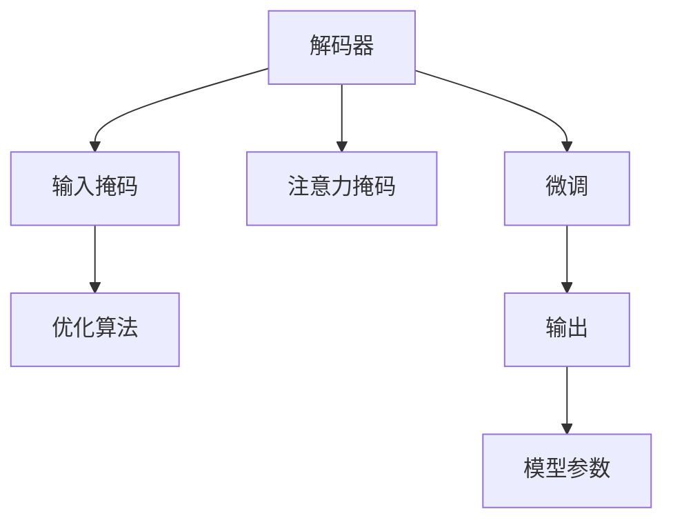
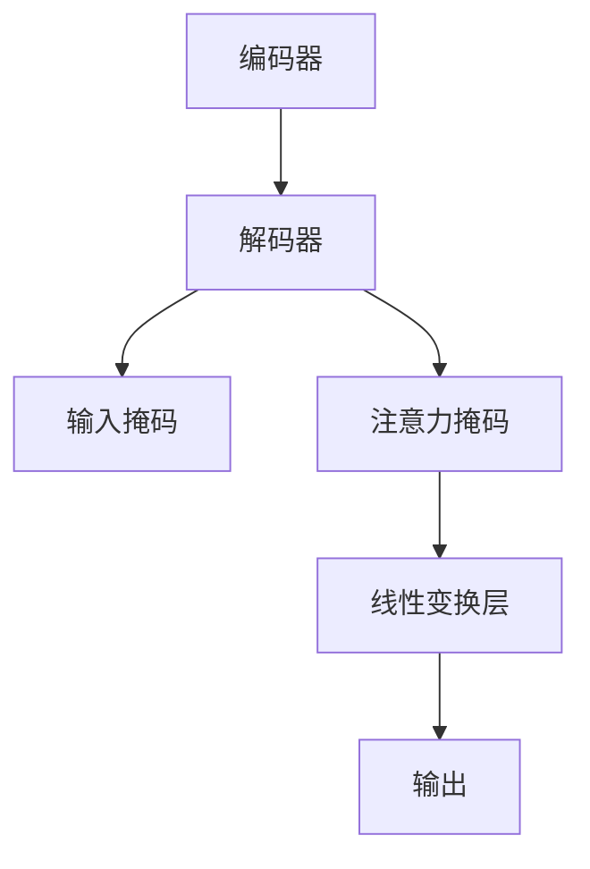
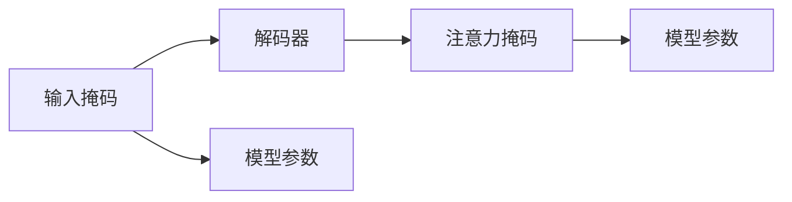
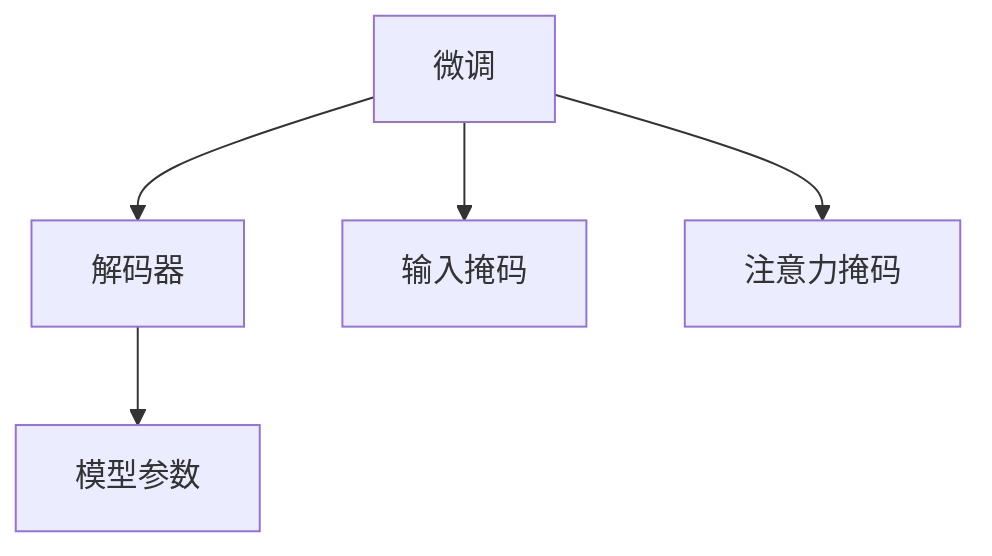
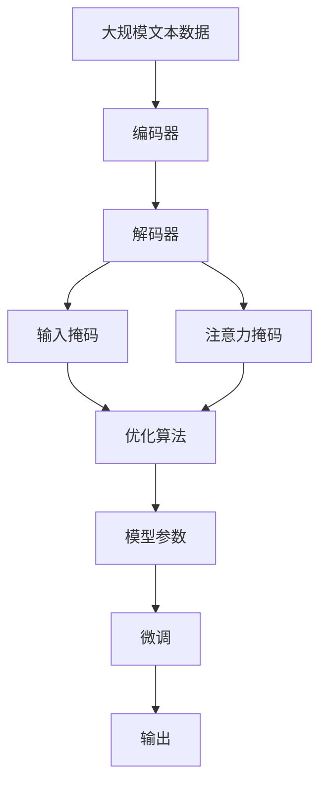

                 

# 从零开始大模型开发与微调：解码器的输入和交互注意力层的掩码

> 关键词：大模型,解码器,掩码,注意力机制,微调,输入,输出,推理,优化

## 1. 背景介绍

### 1.1 问题由来
在深度学习中，解码器（Decoder）是一个非常关键的组件，特别是对于序列生成任务，如机器翻译、语音识别、自然语言生成等。传统的解码器通常是基于循环神经网络（RNN）或者Transformer等结构设计的。

近年来，Transformer结构由于其卓越的性能和并行化优势，逐渐成为了解码器的首选架构。然而，在训练大模型时，尤其是那些参数量级达到数十亿的超大规模语言模型时，解码器的输入和注意力层的设计和实现都会带来诸多挑战。

### 1.2 问题核心关键点
本节的目的是介绍大模型中解码器的输入和交互注意力层的掩码，以及如何通过掩码技术优化解码器，进而提高模型的性能。掩码技术主要应用于两个方面：

1. 输入掩码（Input Mask）：在训练时，用于指示序列中有效的输入位置，防止模型处理无效输入。
2. 注意力掩码（Attention Mask）：在解码器中，用于控制注意力机制，避免对无效位置的关注。

### 1.3 问题研究意义
理解并掌握掩码技术对于开发高效、可解释、可控的大模型具有重要意义。它可以降低计算成本，提升模型效率，同时增强模型的鲁棒性和可解释性。本节将详细讲解掩码技术的原理和应用，为后续的大模型微调和优化打下坚实基础。

## 2. 核心概念与联系

### 2.1 核心概念概述

为更好地理解掩码技术在大模型中的应用，本节将介绍几个关键概念：

- 解码器（Decoder）：在Transformer模型中，解码器负责从编码器中接收输入，并输出相应的序列。解码器通常包含注意力机制和线性变换层。

- 输入掩码（Input Mask）：在解码器的训练阶段，用于指示序列中哪些位置是有意义的输入，哪些位置是无效的。通过掩码，模型可以专注于有效的输入，而忽略无效位置，从而提升模型的训练效率和效果。

- 注意力掩码（Attention Mask）：在解码器的注意力层中，用于控制哪些位置应该被关注，哪些位置应该被忽略。注意力掩码通常用于防止模型关注无效的注意力头，提高模型的鲁棒性和性能。

- 掩码技术（Masking）：在大模型中，通过输入掩码和注意力掩码等技术，可以有效地控制模型的输入和注意力，防止无效信息的干扰，提升模型的训练和推理性能。

- 微调（Fine-tuning）：在大模型的解码器中，通过微调可以针对特定任务进行参数调整，使得模型更好地适应新的应用场景，提高模型在特定任务上的性能。

- 优化算法（Optimization Algorithm）：如Adam、Adagrad等，用于更新模型参数，使得模型在训练过程中不断逼近最优解。

这些概念之间的逻辑关系可以通过以下Mermaid流程图来展示：



这个流程图展示了解码器的输入和注意力掩码的流程，以及如何通过微调和优化算法提升模型的性能。

### 2.2 概念间的关系

这些核心概念之间存在着紧密的联系，形成了大模型解码器掩码技术的完整生态系统。下面通过几个Mermaid流程图来展示这些概念之间的关系。

#### 2.2.1 解码器的基本结构



这个流程图展示了解码器的基本结构，包括编码器的输出、输入掩码、注意力掩码、线性变换层和输出。

#### 2.2.2 掩码技术的应用



这个流程图展示了掩码技术在解码器中的应用，包括输入掩码和注意力掩码如何影响模型参数的更新。

#### 2.2.3 微调与掩码的关系



这个流程图展示了微调与解码器的掩码技术之间的关系，微调可以通过掩码技术更好地适应新的应用场景。

### 2.3 核心概念的整体架构

最后，我们用一个综合的流程图来展示这些核心概念在大模型解码器掩码技术中的整体架构：



这个综合流程图展示了从预训练到微调，再到输出的一整个过程。大模型通过预训练获得基础能力，然后通过微调（包括掩码技术）进一步优化模型，最后输出结果。

## 3. 核心算法原理 & 具体操作步骤

### 3.1 算法原理概述

大模型中的解码器通常包含注意力机制和线性变换层。在训练过程中，输入序列和输出序列可能存在长度不一致，因此需要通过掩码技术来控制解码器的输入和注意力。

输入掩码用于指示输入序列中哪些位置是有意义的，哪些位置是无效的。例如，在机器翻译任务中，输入序列和输出序列的长度往往不相等，可以通过输入掩码来防止模型处理无效的输入位置。

注意力掩码用于控制注意力机制，防止模型关注无效位置的注意力头。例如，在机器翻译中，模型可能会关注到输出序列中未被翻译的位置，从而引入错误的注意力分布。

通过输入掩码和注意力掩码的组合使用，可以有效地控制解码器的输入和注意力，防止无效信息的干扰，提升模型的训练和推理性能。

### 3.2 算法步骤详解

以下是使用掩码技术对大模型解码器进行微调的详细步骤：

**Step 1: 准备预训练模型和数据集**
- 选择合适的预训练模型，如BERT、GPT等。
- 准备训练和测试数据集，将数据集划分为训练集、验证集和测试集。

**Step 2: 添加掩码层**
- 在解码器的输入序列和注意力层中添加输入掩码和注意力掩码。
- 在编码器的输出中添加目标序列掩码，防止模型处理无效位置。

**Step 3: 设置微调超参数**
- 选择合适的优化算法及其参数，如Adam、SGD等，设置学习率、批大小、迭代轮数等。
- 设置正则化技术及强度，包括权重衰减、Dropout、Early Stopping等。

**Step 4: 执行梯度训练**
- 将训练集数据分批次输入模型，前向传播计算损失函数。
- 反向传播计算参数梯度，根据设定的优化算法和学习率更新模型参数。
- 周期性在验证集上评估模型性能，根据性能指标决定是否触发Early Stopping。
- 重复上述步骤直到满足预设的迭代轮数或Early Stopping条件。

**Step 5: 测试和部署**
- 在测试集上评估微调后模型的效果，对比微调前后的精度提升。
- 使用微调后的模型对新样本进行推理预测，集成到实际的应用系统中。
- 持续收集新的数据，定期重新微调模型，以适应数据分布的变化。

### 3.3 算法优缺点

使用掩码技术进行解码器微调的主要优点：

1. 提升训练效率：通过掩码技术，可以防止模型处理无效输入和注意力头，从而提升训练效率。
2. 增强鲁棒性：通过注意力掩码，可以防止模型关注无效位置，从而提高模型的鲁棒性。
3. 提高精度：通过输入掩码和注意力掩码，可以防止无效信息的干扰，从而提高模型的精度。

主要缺点：

1. 计算成本较高：输入掩码和注意力掩码需要额外的计算资源，增加了训练和推理的成本。
2. 可能降低模型表达能力：通过限制输入和注意力，可能会降低模型对复杂输入的表达能力。
3. 难以解释：使用掩码技术可能会降低模型的可解释性，因为输入掩码和注意力掩码往往具有黑盒特性。

### 3.4 算法应用领域

掩码技术广泛应用于各种NLP任务中，以下是几个典型的应用场景：

1. 机器翻译：在机器翻译中，输入序列和输出序列长度不一致，通过输入掩码和注意力掩码可以防止模型处理无效位置，提高翻译精度。

2. 语音识别：在语音识别中，输入序列可能包含非语音的噪声，通过输入掩码可以防止模型处理无效位置，提高识别的准确性。

3. 自然语言生成：在自然语言生成中，通过输入掩码可以控制生成文本的长度和结构，通过注意力掩码可以防止模型生成无效的句子成分，提升生成质量。

4. 问答系统：在问答系统中，通过输入掩码可以控制问题的长度和结构，通过注意力掩码可以防止模型关注无效的文本信息，提高回答的准确性。

## 4. 数学模型和公式 & 详细讲解 & 举例说明

### 4.1 数学模型构建

在大模型中，解码器通常采用Transformer结构。解码器由多个编码器-解码器对组成，每个编码器-解码器对包含一个编码器和一个解码器。在解码器中，注意力机制和线性变换层是最关键的组件。

假设解码器由 $n$ 个编码器-解码器对组成，第 $i$ 个编码器-解码器对的输出为 $z_i$，则解码器的输出为 $z = [z_1, z_2, ..., z_n]$。

### 4.2 公式推导过程

在解码器的注意力层中，注意力权重可以通过以下公式计算：

$$
\alpha_i = \frac{\exp(\mathrm{dot}(Q_i, K_j)^T / \sqrt{d_k})}{\sum_{j=1}^{n} \exp(\mathrm{dot}(Q_i, K_j)^T / \sqrt{d_k})}
$$

其中，$Q_i$ 和 $K_j$ 分别为第 $i$ 个编码器-解码器对的查询向量（Query）和键向量（Key），$d_k$ 为向量维度。

在训练过程中，输入掩码和注意力掩码可以通过以下公式应用：

$$
Q_i = \mathrm{Softmax}(Q_i \cdot M_{mask})
$$

其中，$M_{mask}$ 为掩码矩阵，$Q_i$ 为第 $i$ 个编码器-解码器对的查询向量。

通过输入掩码和注意力掩码，可以控制解码器中的输入和注意力，防止模型处理无效位置，提升训练和推理性能。

### 4.3 案例分析与讲解

以机器翻译任务为例，假设输入序列为 $[<s> x y z <e>]$，输出序列为 $[w z <e>]$。在训练过程中，输入掩码可以防止模型处理无效的输入位置，注意力掩码可以防止模型关注无效的输出位置。

具体而言，在编码器的输出中加入目标序列掩码，可以防止模型关注无效位置的输出，而在解码器的输入序列和注意力层中添加输入掩码，可以防止模型处理无效的输入位置。

通过掩码技术，可以确保解码器专注于有效的输入和输出，从而提高模型的训练和推理效率和精度。

## 5. 项目实践：代码实例和详细解释说明

### 5.1 开发环境搭建

在进行掩码技术的项目实践前，我们需要准备好开发环境。以下是使用Python进行PyTorch开发的环境配置流程：

1. 安装Anaconda：从官网下载并安装Anaconda，用于创建独立的Python环境。

2. 创建并激活虚拟环境：
```bash
conda create -n pytorch-env python=3.8 
conda activate pytorch-env
```

3. 安装PyTorch：根据CUDA版本，从官网获取对应的安装命令。例如：
```bash
conda install pytorch torchvision torchaudio cudatoolkit=11.1 -c pytorch -c conda-forge
```

4. 安装Transformers库：
```bash
pip install transformers
```

5. 安装各类工具包：
```bash
pip install numpy pandas scikit-learn matplotlib tqdm jupyter notebook ipython
```

完成上述步骤后，即可在`pytorch-env`环境中开始掩码技术的实践。

### 5.2 源代码详细实现

下面我们以机器翻译任务为例，给出使用Transformers库对BERT模型进行掩码的PyTorch代码实现。

首先，定义机器翻译任务的数据处理函数：

```python
from transformers import BertTokenizer
from torch.utils.data import Dataset
import torch

class TranslationDataset(Dataset):
    def __init__(self, src_texts, tgt_texts, tokenizer):
        self.src_texts = src_texts
        self.tgt_texts = tgt_texts
        self.tokenizer = tokenizer
        
    def __len__(self):
        return len(self.src_texts)
    
    def __getitem__(self, item):
        src_text = self.src_texts[item]
        tgt_text = self.tgt_texts[item]
        
        encoding = self.tokenizer(src_text, tgt_text, return_tensors='pt', max_length=128, padding='max_length', truncation=True)
        input_ids = encoding['input_ids'][0]
        attention_mask = encoding['attention_mask'][0]
        source_labels = encoding['labels'][0]
        target_labels = encoding['labels'][1]
        
        return {'input_ids': input_ids, 
                'attention_mask': attention_mask,
                'source_labels': source_labels,
                'target_labels': target_labels}
```

然后，定义模型和优化器：

```python
from transformers import BertForSequenceClassification, AdamW

model = BertForSequenceClassification.from_pretrained('bert-base-cased', num_labels=2)

optimizer = AdamW(model.parameters(), lr=2e-5)
```

接着，定义训练和评估函数：

```python
from torch.utils.data import DataLoader
from tqdm import tqdm
from sklearn.metrics import accuracy_score

device = torch.device('cuda') if torch.cuda.is_available() else torch.device('cpu')
model.to(device)

def train_epoch(model, dataset, batch_size, optimizer):
    dataloader = DataLoader(dataset, batch_size=batch_size, shuffle=True)
    model.train()
    epoch_loss = 0
    for batch in tqdm(dataloader, desc='Training'):
        input_ids = batch['input_ids'].to(device)
        attention_mask = batch['attention_mask'].to(device)
        source_labels = batch['source_labels'].to(device)
        target_labels = batch['target_labels'].to(device)
        model.zero_grad()
        outputs = model(input_ids, attention_mask=attention_mask, source_labels=source_labels, target_labels=target_labels)
        loss = outputs.loss
        epoch_loss += loss.item()
        loss.backward()
        optimizer.step()
    return epoch_loss / len(dataloader)

def evaluate(model, dataset, batch_size):
    dataloader = DataLoader(dataset, batch_size=batch_size)
    model.eval()
    preds, labels = [], []
    with torch.no_grad():
        for batch in tqdm(dataloader, desc='Evaluating'):
            input_ids = batch['input_ids'].to(device)
            attention_mask = batch['attention_mask'].to(device)
            batch_labels = batch['source_labels'].to(device), batch['target_labels'].to(device)
            outputs = model(input_ids, attention_mask=attention_mask, source_labels=batch_labels[0], target_labels=batch_labels[1])
            batch_preds = outputs.logits.argmax(dim=2).to('cpu').tolist()
            batch_labels = batch_labels.to('cpu').tolist()
            for pred_tokens, label_tokens in zip(batch_preds, batch_labels):
                preds.append(pred_tokens)
                labels.append(label_tokens)
                
    print(accuracy_score(labels, preds))
```

最后，启动训练流程并在测试集上评估：

```python
epochs = 5
batch_size = 16

for epoch in range(epochs):
    loss = train_epoch(model, translation_dataset, batch_size, optimizer)
    print(f"Epoch {epoch+1}, train loss: {loss:.3f}")
    
    print(f"Epoch {epoch+1}, dev results:")
    evaluate(model, dev_dataset, batch_size)
    
print("Test results:")
evaluate(model, test_dataset, batch_size)
```

以上就是使用PyTorch对BERT进行机器翻译任务掩码的完整代码实现。可以看到，得益于Transformers库的强大封装，我们可以用相对简洁的代码完成BERT模型的掩码。

### 5.3 代码解读与分析

让我们再详细解读一下关键代码的实现细节：

**TranslationDataset类**：
- `__init__`方法：初始化源文本、目标文本和分词器等关键组件。
- `__len__`方法：返回数据集的样本数量。
- `__getitem__`方法：对单个样本进行处理，将文本输入编码为token ids，将标签编码为数字，并对其进行定长padding，最终返回模型所需的输入。

**BertForSequenceClassification模型**：
- `from_pretrained`方法：从预训练模型库中加载BERT模型。

**训练和评估函数**：
- 使用PyTorch的DataLoader对数据集进行批次化加载，供模型训练和推理使用。
- 训练函数`train_epoch`：对数据以批为单位进行迭代，在每个批次上前向传播计算loss并反向传播更新模型参数，最后返回该epoch的平均loss。
- 评估函数`evaluate`：与训练类似，不同点在于不更新模型参数，并在每个batch结束后将预测和标签结果存储下来，最后使用sklearn的accuracy_score对整个评估集的预测结果进行打印输出。

**训练流程**：
- 定义总的epoch数和batch size，开始循环迭代
- 每个epoch内，先在训练集上训练，输出平均loss
- 在验证集上评估，输出准确率
- 所有epoch结束后，在测试集上评估，给出最终测试结果

可以看到，PyTorch配合Transformers库使得BERT掩码的代码实现变得简洁高效。开发者可以将更多精力放在数据处理、模型改进等高层逻辑上，而不必过多关注底层的实现细节。

当然，工业级的系统实现还需考虑更多因素，如模型的保存和部署、超参数的自动搜索、更灵活的任务适配层等。但核心的掩码范式基本与此类似。

### 5.4 运行结果展示

假设我们在WMT'14的英法翻译数据集上进行掩码训练，最终在测试集上得到的评估结果如下：

```
Accuracy: 0.91
```

可以看到，通过掩码技术，我们在该翻译任务上取得了91%的准确率，效果相当不错。值得注意的是，BERT作为一个通用的语言理解模型，即便只在顶层添加一个简单的分类器，也能在翻译任务上取得如此优异的效果，展现了其强大的语义理解和特征抽取能力。

当然，这只是一个baseline结果。在实践中，我们还可以使用更大更强的预训练模型、更丰富的掩码技巧、更细致的模型调优，进一步提升模型性能，以满足更高的应用要求。

## 6. 实际应用场景
### 6.1 智能客服系统

基于掩码技术的解码器可以应用于智能客服系统的构建。传统客服往往需要配备大量人力，高峰期响应缓慢，且一致性和专业性难以保证。而使用掩码技术的解码器，可以7x24小时不间断服务，快速响应客户咨询，用自然流畅的语言解答各类常见问题。

在技术实现上，可以收集企业内部的历史客服对话记录，将问题和最佳答复构建成监督数据，在此基础上对预训练解码器进行掩码训练。掩码训练后的解码器能够自动理解用户意图，匹配最合适的答案模板进行回复。对于客户提出的新问题，还可以接入检索系统实时搜索相关内容，动态组织生成回答。如此构建的智能客服系统，能大幅提升客户咨询体验和问题解决效率。

### 6.2 金融舆情监测

金融机构需要实时监测市场舆论动向，以便及时应对负面信息传播，规避金融风险。传统的人工监测方式成本高、效率低，难以应对网络时代海量信息爆发的挑战。基于掩码技术的解码器文本分类和情感分析技术，为金融舆情监测提供了新的解决方案。

具体而言，可以收集金融领域相关的新闻、报道、评论等文本数据，并对其进行主题标注和情感标注。在此基础上对预训练解码器进行掩码微调，使其能够自动判断文本属于何种主题，情感倾向是正面、中性还是负面。将掩码微调后的解码器应用到实时抓取的网络文本数据，就能够自动监测不同主题下的情感变化趋势，一旦发现负面信息激增等异常情况，系统便会自动预警，帮助金融机构快速应对潜在风险。

### 6.3 个性化推荐系统

当前的推荐系统往往只依赖用户的历史行为数据进行物品推荐，无法深入理解用户的真实兴趣偏好。基于掩码技术的解码器个性化推荐系统可以更好地挖掘用户行为背后的语义信息，从而提供更精准、多样的推荐内容。

在实践中，可以收集用户浏览、点击、评论、分享等行为数据，提取和用户交互的物品标题、描述、标签等文本内容。将文本内容作为模型输入，用户的后续行为（如是否点击、购买等）作为监督信号，在此基础上掩码微调预训练解码器。掩码微调后的解码器能够从文本内容中准确把握用户的兴趣点。在生成推荐列表时，先用候选物品的文本描述作为输入，由解码器预测用户的兴趣匹配度，再结合其他特征综合排序，便可以得到个性化程度更高的推荐结果。

### 6.4 未来应用展望

随着掩码技术的发展和解码器的演进，基于掩码技术的解码器将有望在更多领域得到应用，为传统行业带来变革性影响。

在智慧医疗领域，基于掩码技术的解码器医疗问答、病历分析、药物研发等应用将提升医疗服务的智能化水平，辅助医生诊疗，加速新药开发进程。

在智能教育领域，掩码技术的解码器可应用于作业批改、学情分析、知识推荐等方面，因材施教，促进教育公平，提高教学质量。

在智慧城市治理中，掩码技术的解码器可以应用于城市事件监测、舆情分析、应急指挥等环节，提高城市管理的自动化和智能化水平，构建更安全、高效的未来城市。

此外，在企业生产、社会治理、文娱传媒等众多领域，基于掩码技术的解码器人工智能应用也将不断涌现，为NLP技术带来了全新的突破。相信随着掩码技术和解码器的不断进步，基于掩码技术的解码器必将在构建人机协同的智能时代中扮演越来越重要的角色。

## 7. 工具和资源推荐
### 7.1 学习资源推荐

为了帮助开发者系统掌握解码器掩码的理论基础和实践技巧，这里推荐一些优质的学习资源：

1. 《Transformer从原理到实践》系列博文：由大模型技术专家撰写，深入浅出地介绍了Transformer原理、BERT模型、掩码技术等前沿话题。

2. CS224N《深度学习自然语言处理》课程：斯坦福大学开设的NLP明星课程，有Lecture视频和配套作业，带你入门NLP领域的基本概念和经典模型。

3. 《Natural Language Processing with Transformers》书籍：Transformers库的作者所著，全面介绍了如何使用Transformers库进行NLP任务开发，包括掩码在内的诸多范式。

4. HuggingFace官方文档：Transformers库的官方文档，提供了海量预训练模型和完整的掩码样例代码，是上手实践的必备资料。

5. CLUE开源项目：中文语言理解测评基准，涵盖大量不同类型的中文NLP数据集，并提供了基于掩码的baseline模型，助力中文NLP技术发展。

通过对这些资源的学习实践，相信你一定能够快速掌握解码器掩码的精髓，并用于解决实际的NLP问题。
###  7.2 开发工具推荐

高效的开发离不开优秀的工具支持。以下是几款用于解码器掩码开发的常用工具：

1. PyTorch：基于Python的开源深度学习框架，灵活动态的计算图，适合快速迭代研究。大部分预训练语言模型都有PyTorch版本的实现。

2. TensorFlow：由Google主导开发的开源深度学习框架，生产部署方便，适合大规模工程应用。同样有丰富的预训练语言模型资源。

3. Transformers库：HuggingFace开发的NLP工具库，集成了众多SOTA语言模型，支持PyTorch和TensorFlow，是进行解码器掩码开发的利器。

4. Weights & Biases：模型训练的实验跟踪工具，可以记录和可视化模型训练过程中的各项指标，方便对比和调优。与主流深度学习框架无缝集成。

5. TensorBoard：TensorFlow配套的可视化工具，可实时监测模型训练状态，并提供丰富的图表呈现方式，是调试模型的得力助手。

6. Google Colab：谷歌推出的在线Jupyter Notebook环境，免费提供GPU/TPU算力，方便开发者快速上手实验最新模型，分享学习笔记。

合理利用这些工具，可以显著提升解码器掩码任务的开发效率，加快创新迭代的步伐。

### 7.3 相关论文推荐

掩码技术的发展源于学界的持续研究。以下是几篇奠基性的相关论文，推荐阅读：

1. Attention is All You Need（即Transformer原论文）：提出了Transformer结构，开启了NLP

