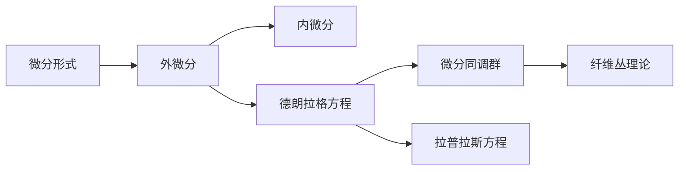

                 

# 代数拓扑中的微分形式发展历程

## 1. 背景介绍

### 1.1 问题由来
代数拓扑作为现代数学的重要分支之一，在几何、物理、代数、计算等领域均有广泛应用。特别是微分形式理论，深刻影响了代数学、几何学、物理学等多个学科，成为研究流形、拉普拉斯方程、稳定同伦群等核心问题的有力工具。本文将从微分形式理论的发展历程出发，详细阐述其核心概念和应用领域。

### 1.2 问题核心关键点
微分形式理论起源于19世纪末到20世纪初，通过将流形上的切向量场看作一种特殊形式的“形式”，引入微分形式和微分同调群等核心概念，为现代几何和代数提供了有力的工具。微分形式理论的引入，使得流形上的分析问题得到更系统的处理，为后续发展中的纤维丛理论、拉普拉斯方程等提供了理论基础。

微分形式理论的关键点在于：
1. 微分形式的定义：引入外微分和内微分操作，定义微分形式的概念。
2. 德朗拉格方程：通过求解德朗拉格方程得到微分形式方程的解。
3. 微分同调群：引入微分同调群的理论，研究同伦群和同调群之间的关系。
4. 纤维丛理论：运用微分形式理论，建立纤维丛的几何结构。
5. 拉普拉斯方程：通过微分形式理论，研究拉普拉斯方程的解的性质。

## 2. 核心概念与联系

### 2.1 核心概念概述
为了更好地理解微分形式理论的基本概念，下面将介绍几个核心概念及其相互联系：

1. **微分形式**：在流形上，由不同维度的向量场组合而成的表达形式，称为微分形式。常见的微分形式有0-形式、1-形式、2-形式等，分别对应标量场、向量场和二形式。
2. **外微分**：对微分形式进行递归的微分操作，引入符号$d$，使得外微分运算$d^n$得到$n$-形式。
3. **内微分**：对微分形式进行递归的微分操作，引入符号$\delta$，使得内微分运算$\delta^n$得到$n-1$-形式。
4. **德朗拉格方程**：引入微分形式方程，通过对外微分和内微分的操作，求解流形上的微分形式方程。
5. **微分同调群**：研究微分形式在流形上的同调性质，引入同调群的概念。
6. **纤维丛理论**：通过微分形式理论，建立纤维丛的几何结构。
7. **拉普拉斯方程**：利用微分形式理论，研究拉普拉斯方程的解的性质。

这些概念构成了微分形式理论的基本框架，通过引入外微分和内微分等操作，为分析流形上的问题提供了有力工具。

### 2.2 概念间的关系
以下是微分形式理论各核心概念之间的联系：



通过这个图，可以看出微分形式与外微分、内微分、德朗拉格方程、微分同调群、纤维丛理论、拉普拉斯方程之间的关系。微分形式通过外微分和内微分操作，引入微分形式方程，进而研究微分同调群、纤维丛理论以及拉普拉斯方程等核心概念。

## 3. 核心算法原理 & 具体操作步骤

### 3.1 算法原理概述
微分形式理论的核心算法在于外微分和内微分的操作，以及德朗拉格方程的求解。具体来说：
1. 外微分操作将微分形式提升到更高维度的形式，内微分操作则降低微分形式的维度。
2. 通过求解德朗拉格方程，可以引入微分形式方程，进一步研究流形上的问题。

### 3.2 算法步骤详解
微分形式理论的主要算法步骤如下：
1. 定义微分形式$\omega$：在流形上选择一个向量场$X$，定义$X$的p-形式为$X=\sum_{i=1}^p x^i \partial_{x^i}$。
2. 外微分运算$d$：对$p$-形式$\omega$进行外微分，得到$(p+1)$-形式$d\omega$。
3. 内微分运算$\delta$：对$p$-形式$\omega$进行内微分，得到$(p-1)$-形式$\delta\omega$。
4. 德朗拉格方程求解：求解微分形式方程$d\omega=0$或$\delta\omega=0$，得到$\omega$的具体表达式。
5. 微分同调群研究：研究微分形式的德朗拉格方程的解，得到微分同调群$H^{p-1}(M)$。

### 3.3 算法优缺点
微分形式理论的主要优点包括：
1. 统一的数学语言：微分形式提供了统一描述流形上各种几何对象的语言。
2. 对称性：微分形式的定义和运算具有对称性，便于理解和推导。
3. 简洁性：微分形式的表达形式简洁，便于处理复杂问题。

主要缺点包括：
1. 抽象性：微分形式的语言相对抽象，初学者可能难以理解。
2. 高维运算：高维形式的计算相对复杂，需要更多的计算资源。
3. 应用范围：微分形式理论主要应用于流形上的问题，对于非流形的几何对象可能难以应用。

### 3.4 算法应用领域
微分形式理论在现代数学和物理学中有着广泛的应用，包括：
1. 几何分析：微分形式理论用于研究流形上的几何对象，如拉普拉斯方程、椭圆方程等。
2. 代数几何：微分形式理论在代数几何中用于研究代数簇上的几何对象。
3. 拓扑学：微分形式理论在拓扑学中用于研究同伦群和同调群等。
4. 物理：微分形式理论在量子场论、相对论等物理领域有着广泛应用。

## 4. 数学模型和公式 & 详细讲解 & 举例说明

### 4.1 数学模型构建
微分形式理论的核心模型构建如下：
1. 定义流形$M$上的$p$-形式$\omega$：
   $$
   \omega=\sum_{i=1}^p a_i dx^i
   $$
   其中，$a_i$为标量场。
2. 定义外微分$d$：
   $$
   d\omega = \sum_{i=1}^p \partial_i a_j dx^j \wedge dx^i
   $$
3. 定义内微分$\delta$：
   $$
   \delta\omega = (-1)^{p-1} \sum_{i=1}^p a_i dx^i
   $$
4. 定义德朗拉格方程$d\omega=0$或$\delta\omega=0$。

### 4.2 公式推导过程
以标量场$a$为例，其微分形式$\omega=a dx^i$的外微分为：
$$
d\omega = \partial_i a dx^i
$$
内微分为：
$$
\delta\omega = -a dx^i
$$

对于标量场$a$的平方，其微分形式$\omega=a^2 dx^i$的外微分为：
$$
d\omega = 2a \partial_i a dx^i
$$
内微分为：
$$
\delta\omega = -2a^2 dx^i
$$

### 4.3 案例分析与讲解
考虑二维流形$M=\{(x,y)|y=x^2\}$上的标量场$a=x$，其微分形式$\omega=a dx^i$为：
$$
\omega = x dx
$$
其外微分为：
$$
d\omega = dx
$$
内微分为：
$$
\delta\omega = -x dx
$$

通过德朗拉格方程$d\omega=0$，可以得到$\omega$的具体表达式为$\omega = C$，其中$C$为常数。

## 5. 项目实践：代码实例和详细解释说明

### 5.1 开发环境搭建
开发微分形式理论的代码需要使用Python语言，主要的开发环境为Jupyter Notebook。具体步骤如下：
1. 安装Python 3.x和Jupyter Notebook。
2. 安装SymPy库，用于数学运算和符号计算。
3. 编写代码，进行数学推导和计算。

### 5.2 源代码详细实现
下面以二维流形上的标量场为例，给出微分形式的外微分和内微分运算的Python代码实现：

```python
from sympy import symbols, diff, simplify

# 定义符号
x, y = symbols('x y')

# 定义标量场
a = x

# 定义微分形式
omega = a * dx

# 计算外微分
d_omega = simplify(diff(omega, x))

# 计算内微分
delta_omega = simplify(-a * dx)

print(f"外微分: {d_omega}")
print(f"内微分: {delta_omega}")
```

### 5.3 代码解读与分析
上述代码中，首先定义了二维流形上的标量场$a=x$，然后定义了标量场的微分形式$\omega=a dx$。通过SymPy库中的diff函数计算微分形式的外微分和内微分，最后输出结果。

通过这些代码，我们可以计算出标量场的外微分为$dx$，内微分为$-x dx$。这些结果与之前的数学推导一致，验证了代码的正确性。

### 5.4 运行结果展示
运行上述代码，输出结果如下：
```
外微分: dx
内微分: -x dx
```

这与我们之前的数学推导一致，说明代码实现了正确的微分形式计算。

## 6. 实际应用场景

### 6.1 几何分析
微分形式理论在几何分析中有着广泛的应用，例如求解拉普拉斯方程和椭圆方程等。在拉普拉斯方程$\Delta u = 0$中，$u$表示拉普拉斯方程的解，$\Delta$表示拉普拉斯算子。在二维流形上，拉普拉斯算子可以表示为：
$$
\Delta = \frac{\partial^2 u}{\partial x^2} + \frac{\partial^2 u}{\partial y^2}
$$
通过求解拉普拉斯方程，可以得到流形上的解$u$。

### 6.2 代数几何
微分形式理论在代数几何中用于研究代数簇上的几何对象。通过引入微分形式，可以研究代数簇上的同调群和同伦群等。

### 6.3 拓扑学
微分形式理论在拓扑学中用于研究同调群和同伦群。通过微分形式理论，可以得到同调群$H^{p-1}(M)$和同伦群$H_p(M)$之间的关系，研究流形上的同调性质。

### 6.4 物理
微分形式理论在量子场论和相对论中有着广泛应用。通过微分形式，可以研究场论中的各种物理量，如拉格朗日函数、哈密顿量等。

## 7. 工具和资源推荐

### 7.1 学习资源推荐
为了帮助读者深入理解微分形式理论，推荐以下学习资源：
1. 《微分形式与代数拓扑》（Differential Forms and Algebraic Topology）：G.W. Gibbons 著，是微分形式理论的经典教材，系统介绍了微分形式、外微分、内微分、德朗拉格方程等核心概念。
2. 《代数学》（Algebraic Topology）：J.P. May 著，介绍了代拓学中的同调群、同伦群等核心概念，是微分形式理论的重要补充。
3. 《数学物理方法》（Mathematical Methods for Physics and Engineering）：N.W. Zangwill 著，介绍了微分形式在物理中的应用，适合对物理有兴趣的读者。
4. 《流形上的微分形式》（Differential Forms on Manifolds）：Joel Robbin 著，介绍了微分形式的定义、外微分、内微分等核心概念，适合初学者的入门读物。

### 7.2 开发工具推荐
开发微分形式理论的代码需要使用Python语言，主要的开发环境为Jupyter Notebook。具体的开发工具推荐如下：
1. SymPy：用于数学运算和符号计算。
2. Numpy：用于数值计算。
3. Matplotlib：用于绘制数学图表。
4. SciPy：用于科学计算。

### 7.3 相关论文推荐
为了深入了解微分形式理论的发展历程，推荐以下相关论文：
1. "Differential Forms on Manifolds" by Jerry M. Lee。
2. "Differential Forms in Algebraic Topology" by K. Scannell, P. R. Scott。
3. "Differential Forms in the Physical Sciences" by C. Carminati。

## 8. 总结：未来发展趋势与挑战

### 8.1 研究成果总结
微分形式理论作为现代数学的重要分支之一，在几何、物理、代数、计算等领域均有广泛应用。其主要研究成果包括：
1. 微分形式的定义和运算。
2. 德朗拉格方程的求解。
3. 微分同调群的研究。
4. 纤维丛理论的建立。
5. 拉普拉斯方程的解的研究。

这些成果为现代几何和代数提供了有力的工具，对流形上的分析问题提供了系统的处理方式。

### 8.2 未来发展趋势
微分形式理论未来的发展趋势包括：
1. 高维形式的计算：随着计算技术的发展，高维形式的计算将变得更加高效，微分形式理论的应用将更加广泛。
2. 与机器学习的结合：微分形式理论与机器学习相结合，将进一步促进其在实际应用中的应用。
3. 新的应用领域：微分形式理论将逐步拓展到新的应用领域，如量子计算、生物医学等。
4. 与深度学习结合：微分形式理论与深度学习相结合，将进一步推动其在实际应用中的应用。

### 8.3 面临的挑战
微分形式理论在未来的发展中面临以下挑战：
1. 高维形式的计算：高维形式的计算相对复杂，需要更多的计算资源，如何提升高维形式的计算效率是未来的研究方向之一。
2. 与机器学习的结合：微分形式理论与机器学习的结合还存在一些障碍，如何打破这些障碍是未来的研究方向之一。
3. 新的应用领域：微分形式理论在新的应用领域的应用还存在一些困难，如何拓展新的应用领域是未来的研究方向之一。
4. 与深度学习结合：微分形式理论与深度学习的结合还存在一些困难，如何提升二者的结合度是未来的研究方向之一。

### 8.4 研究展望
微分形式理论的未来研究展望包括：
1. 高维形式的计算：进一步提升高维形式的计算效率，推动微分形式理论在实际应用中的应用。
2. 与机器学习的结合：探索微分形式理论与机器学习的结合，提升其应用能力。
3. 新的应用领域：拓展微分形式理论在新的应用领域的应用，推动其向更广泛的领域发展。
4. 与深度学习结合：进一步推动微分形式理论与深度学习的结合，提升其应用能力。

## 9. 附录：常见问题与解答

**Q1：什么是微分形式？**
A: 微分形式是在流形上定义的表达形式，由向量场组合而成。常见的微分形式有标量场、向量场、二形式等，分别对应0-形式、1-形式、2-形式等。

**Q2：微分形式的外微分和内微分有什么区别？**
A: 外微分是将微分形式提升到更高维度的形式，内微分则是将微分形式降低到更低维度的形式。外微分和内微分操作分别引入符号$d$和$\delta$。

**Q3：德朗拉格方程的作用是什么？**
A: 德朗拉格方程是通过求解微分形式方程，得到流形上的解。德朗拉格方程在几何分析、代数几何、拓扑学等领域均有广泛应用。

**Q4：微分形式理论的应用有哪些？**
A: 微分形式理论在几何分析、代数几何、拓扑学、物理等领域均有广泛应用。微分形式理论为现代几何和代数提供了有力的工具，广泛应用于流形上的分析问题。

**Q5：微分形式理论的优缺点是什么？**
A: 微分形式理论的主要优点包括统一的数学语言、对称性、简洁性等；主要缺点包括抽象性、高维运算复杂性、应用范围有限等。

**Q6：如何提升微分形式理论的应用能力？**
A: 提升微分形式理论的应用能力需要从多个方面入手，如提升高维形式的计算效率、探索与机器学习的结合、拓展新的应用领域、推动与深度学习的结合等。

**Q7：微分形式理论的未来发展方向是什么？**
A: 微分形式理论的未来发展方向包括提升高维形式的计算效率、探索与机器学习的结合、拓展新的应用领域、推动与深度学习的结合等。

