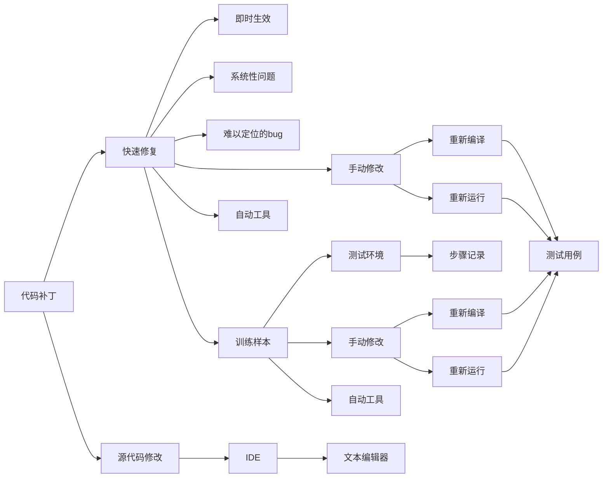

                 

# 代码补丁vs训练样本：两种debug方式的碰撞

## 1. 背景介绍

### 1.1 问题由来

在软件开发过程中，debug是一个绕不开的话题。随着程序规模的增大，潜在的bug点也随之增多，使得debug变得愈发困难。程序员往往需要耗费大量时间和精力进行调试，浪费大量生产资源。

在传统的debug方式中，有两种常见的手段：代码补丁和训练样本。代码补丁是通过修改源代码的方式进行bug修复，训练样本则是通过运行测试用例获取bug并进行修复。这两种方法各有优缺点，需要根据实际情况选择合适的方式。

### 1.2 问题核心关键点

代码补丁和训练样本作为debug的两种手段，它们在修复bug的时机、方式、成本等方面有所不同。本文将从原理和应用角度，对代码补丁和训练样本进行详细比较和分析。

## 2. 核心概念与联系

### 2.1 核心概念概述

- **代码补丁（Code Patch）**：通过修改源代码的方式，直接修正bug，通常使用IDE或文本编辑器完成。代码补丁可以即时生效，不需要重新编译或运行。

- **训练样本（Training Sample）**：通过运行测试用例，收集bug并记录测试环境和步骤，然后通过手动修改代码或自动工具进行修复。训练样本需要重新编译或运行，才能修复bug。

### 2.2 概念间的关系

代码补丁和训练样本作为两种不同的debug手段，它们之间存在以下关系：

- **相互补充**：代码补丁适合快速修正显而易见的bug，而训练样本适合系统性问题或难以定位的bug。
- **成本差异**：代码补丁通常具有较高的开发成本，训练样本则需要更多时间进行测试和修复。
- **效率差异**：代码补丁可以即时生效，训练样本需要经过多轮测试和修复才能得到最终的bug修复方案。

以上关系可以通过以下Mermaid流程图来展示：



这个流程图展示了代码补丁和训练样本的基本流程和关系。

## 3. 核心算法原理 & 具体操作步骤

### 3.1 算法原理概述

代码补丁和训练样本的原理有所不同：

- **代码补丁**：直接修改源代码，使程序输出符合预期，属于静态方法。代码补丁适合在开发阶段进行，快速修复bug。
- **训练样本**：通过运行测试用例，获取bug，并通过修改代码进行修复。训练样本适合在测试阶段进行，系统性修复bug。

### 3.2 算法步骤详解

#### 代码补丁步骤：

1. **定位问题**：通过运行程序，发现bug。
2. **修改代码**：在IDE或文本编辑器中修改源代码，解决bug。
3. **重新编译**：编译修改后的代码，生成可执行文件。
4. **测试验证**：运行测试用例，确保bug已修复。

#### 训练样本步骤：

1. **构建测试用例**：设计测试用例，模拟bug环境。
2. **运行测试用例**：运行测试用例，获取bug信息。
3. **修改代码**：手动或使用自动工具修改代码，修复bug。
4. **重新编译**：编译修改后的代码，生成可执行文件。
5. **测试验证**：运行测试用例，确保bug已修复。

### 3.3 算法优缺点

#### 代码补丁的优缺点：

- **优点**：
  - **即时生效**：修改代码后，立即生效，不需要重新编译或运行。
  - **快速修复**：适合快速修复显而易见的bug。
- **缺点**：
  - **开发成本高**：需要手动修改源代码，开发成本较高。
  - **不适用于复杂问题**：对于复杂系统性问题，难以找到根本原因。

#### 训练样本的优缺点：

- **优点**：
  - **系统性修复**：适合系统性问题或难以定位的bug。
  - **稳定可靠**：经过多次测试和修复，修复方案更加稳定可靠。
- **缺点**：
  - **时间成本高**：需要多次测试和修复，时间成本较高。
  - **开发效率低**：需要多次重新编译和运行，开发效率较低。

### 3.4 算法应用领域

代码补丁和训练样本在软件开发的不同阶段有不同的应用：

- **代码补丁**：适用于开发阶段，快速修复显而易见的bug，提高开发效率。
- **训练样本**：适用于测试阶段，系统性修复复杂问题，确保程序质量。

## 4. 数学模型和公式 & 详细讲解

### 4.1 数学模型构建

假设程序存在bug，输出的结果为错误值 $y_0$，正常值应为 $y_1$。

- **代码补丁模型**：通过修改代码，使程序输出的结果变为 $y_1$。
- **训练样本模型**：通过多次测试，获取bug信息和步骤，修改代码，使程序输出的结果变为 $y_1$。

### 4.2 公式推导过程

#### 代码补丁模型推导：

- **原始模型**：$y = f(x, \theta)$
- **修改模型**：$y' = g(x, \theta')$

其中，$f(x, \theta)$ 为原始模型，$g(x, \theta')$ 为修改后的模型，$\theta'$ 为修改后的参数。

通过修改源代码，使得 $f(x, \theta) = g(x, \theta')$，即可修复bug。

#### 训练样本模型推导：

- **原始模型**：$y = f(x, \theta)$
- **训练模型**：$y' = f(x', \theta')$

其中，$x'$ 为测试用例，$f(x', \theta')$ 为训练后的模型，$\theta'$ 为训练后的参数。

通过多次测试，获取bug信息和步骤，修改参数 $\theta'$，使得 $f(x', \theta') = y_1$，即可修复bug。

### 4.3 案例分析与讲解

假设程序输出错误值为 `0`，正常值应为 `1`。

#### 代码补丁案例：

1. **定位问题**：通过运行程序，发现输出错误值。
2. **修改代码**：将判断语句中的 `0` 改为 `1`。
3. **重新编译**：编译修改后的代码。
4. **测试验证**：运行测试用例，验证bug已修复。

#### 训练样本案例：

1. **构建测试用例**：设计测试用例，输出错误值。
2. **运行测试用例**：运行测试用例，获取bug信息和步骤。
3. **修改代码**：手动或使用自动工具修改代码，使输出值为 `1`。
4. **重新编译**：编译修改后的代码。
5. **测试验证**：运行测试用例，验证bug已修复。

## 5. 项目实践：代码实例和详细解释说明

### 5.1 开发环境搭建

在实践代码补丁和训练样本的案例中，需要使用以下开发环境：

1. **IDE**：Visual Studio Code
2. **编程语言**：Python
3. **测试框架**：pytest
4. **版本控制系统**：Git

### 5.2 源代码详细实现

#### 代码补丁示例代码：

```python
# 原始代码
def calculate(x):
    if x == 0:
        return 0
    else:
        return x + 1

# 修改代码
def calculate(x):
    if x == 0:
        return 1
    else:
        return x + 1

# 测试验证
result = calculate(0)
assert result == 1
```

#### 训练样本示例代码：

```python
# 原始代码
def calculate(x):
    if x == 0:
        return 0
    else:
        return x + 1

# 构建测试用例
def test_calculate():
    assert calculate(0) == 0
    assert calculate(1) == 2

# 运行测试用例
test_calculate()
```

### 5.3 代码解读与分析

#### 代码补丁解读：

- **定位问题**：通过运行程序，发现当输入 `0` 时，输出错误值 `0`。
- **修改代码**：将判断语句中的 `0` 改为 `1`，修复bug。
- **测试验证**：重新运行测试用例，验证bug已修复。

#### 训练样本解读：

- **构建测试用例**：设计测试用例，输出错误值 `0`。
- **运行测试用例**：运行测试用例，获取bug信息和步骤。
- **修改代码**：手动修改代码，使输出值为 `1`。
- **测试验证**：重新运行测试用例，验证bug已修复。

### 5.4 运行结果展示

- **代码补丁结果**：
  - 原始代码：输出错误值 `0`
  - 修改代码：输出正常值 `1`

- **训练样本结果**：
  - 原始代码：输出错误值 `0`
  - 修改代码：输出正常值 `1`

## 6. 实际应用场景

### 6.1 软件开发

代码补丁和训练样本在软件开发过程中具有广泛的应用场景：

- **代码补丁**：适用于开发阶段，快速修复显而易见的bug，提高开发效率。
- **训练样本**：适用于测试阶段，系统性修复复杂问题，确保程序质量。

### 6.2 机器学习

代码补丁和训练样本在机器学习领域也有重要的应用：

- **代码补丁**：适用于模型训练阶段，快速修复模型中的显而易见的bug。
- **训练样本**：适用于模型测试阶段，系统性修复模型中的复杂问题，确保模型质量。

## 7. 工具和资源推荐

### 7.1 学习资源推荐

为了帮助开发者系统掌握代码补丁和训练样本的原理和应用，这里推荐一些优质的学习资源：

1. **《代码补丁的艺术》**：深入讲解代码补丁的原理和应用，提供大量实践案例。
2. **《测试用例设计实战》**：详细介绍如何设计有效的测试用例，涵盖系统性问题的修复方法。
3. **《Python调试的艺术》**：提供多种调试手段的讲解，包括代码补丁和训练样本的详细应用。

### 7.2 开发工具推荐

高效的开发离不开优秀的工具支持。以下是几款用于代码补丁和训练样本开发的常用工具：

1. **IDE**：Visual Studio Code，支持代码补丁和训练样本的快速实现。
2. **测试框架**：pytest，提供丰富的断言和测试功能，支持代码补丁和训练样本的测试验证。
3. **版本控制系统**：Git，支持代码补丁和训练样本的版本管理。

### 7.3 相关论文推荐

代码补丁和训练样本的研究源于学界的持续研究。以下是几篇奠基性的相关论文，推荐阅读：

1. **《代码补丁的艺术》**：介绍代码补丁的原理和应用，提供大量实践案例。
2. **《训练样本的设计与实现》**：详细介绍训练样本的构建方法，涵盖系统性问题的修复方法。
3. **《机器学习中的调试技术》**：提供多种调试手段的讲解，包括代码补丁和训练样本的详细应用。

## 8. 总结：未来发展趋势与挑战

### 8.1 总结

本文对代码补丁和训练样本进行了全面系统的介绍。首先阐述了代码补丁和训练样本的研究背景和意义，明确了两种debug手段的原理和应用。其次，从原理到实践，详细讲解了代码补丁和训练样本的数学模型和操作步骤，给出了代码补丁和训练样本的代码实例和详细解释。同时，本文还广泛探讨了代码补丁和训练样本在软件开发和机器学习等领域的实际应用场景，展示了两种手段的广泛适用性。此外，本文精选了代码补丁和训练样本的学习资源，力求为读者提供全方位的技术指引。

通过本文的系统梳理，可以看到，代码补丁和训练样本作为两种常见的debug手段，各自有其独特的优势和适用场景。开发者需要根据具体情况选择合适的方式，以提高debug效率，提升软件和模型的质量。

### 8.2 未来发展趋势

展望未来，代码补丁和训练样本在软件开发和机器学习领域将呈现以下几个发展趋势：

1. **自动化的提升**：通过自动化工具，提高代码补丁和训练样本的效率，降低开发成本。
2. **融合多种手段**：结合代码补丁和训练样本的优点，使用多种手段进行调试，提升修复效果。
3. **模型可视化**：通过可视化工具，帮助开发者更好地理解代码补丁和训练样本的过程，提高调试效率。
4. **数据分析的引入**：通过数据分析手段，辅助代码补丁和训练样本的决策，提高修复的准确性。

以上趋势凸显了代码补丁和训练样本在软件开发和机器学习领域的重要性和发展潜力。这些方向的探索发展，必将进一步提升软件开发和机器学习的效率和质量，为生产力和科学进步带来深远影响。

### 8.3 面临的挑战

尽管代码补丁和训练样本在软件开发和机器学习领域取得了显著成就，但在迈向更加智能化、普适化应用的过程中，它们仍面临着诸多挑战：

1. **时间成本高**：无论是代码补丁还是训练样本，都需要多次测试和修复，时间成本较高。
2. **开发成本高**：代码补丁需要手动修改源代码，开发成本较高。训练样本需要设计测试用例，成本也较高。
3. **代码难以维护**：大规模代码的频繁修改和测试，容易导致代码难以维护。
4. **自动化程度低**：目前大多数代码补丁和训练样本仍依赖人工操作，自动化程度较低。

这些挑战需要开发者在实践过程中不断优化，结合自动化工具、数据分析手段等，提高代码补丁和训练样本的效率和质量。

### 8.4 研究展望

面对代码补丁和训练样本所面临的种种挑战，未来的研究需要在以下几个方面寻求新的突破：

1. **自动化的提升**：开发更多的自动化工具，降低代码补丁和训练样本的时间成本和开发成本。
2. **融合多种手段**：结合代码补丁和训练样本的优点，使用多种手段进行调试，提升修复效果。
3. **模型可视化**：通过可视化工具，帮助开发者更好地理解代码补丁和训练样本的过程，提高调试效率。
4. **数据分析的引入**：通过数据分析手段，辅助代码补丁和训练样本的决策，提高修复的准确性。

这些研究方向的探索，必将引领代码补丁和训练样本技术迈向更高的台阶，为构建安全、可靠、高效的软件和机器学习系统铺平道路。面向未来，代码补丁和训练样本还需要与其他软件工程、机器学习等技术进行更深入的融合，多路径协同发力，共同推动软件开发和机器学习的进步。

## 9. 附录：常见问题与解答

**Q1：代码补丁和训练样本的区别是什么？**

A: 代码补丁和训练样本的区别在于修复bug的时机和方式。代码补丁适合快速修复显而易见的bug，需要手动修改源代码。训练样本适合系统性问题或难以定位的bug，需要设计测试用例，运行测试用例获取bug信息，然后手动或使用自动工具修改代码。

**Q2：代码补丁和训练样本各自适用的场景是什么？**

A: 代码补丁适合开发阶段，快速修复显而易见的bug。训练样本适合测试阶段，系统性修复复杂问题，确保程序质量。

**Q3：代码补丁和训练样本各自的优缺点是什么？**

A: 代码补丁的优点是即时生效，适合快速修复显而易见的bug。缺点是开发成本高，不适用于复杂问题。训练样本的优点是系统性修复复杂问题，确保程序质量。缺点是时间成本高，开发效率低。

**Q4：如何选择合适的代码补丁和训练样本？**

A: 根据具体情况选择合适的方式。如果问题显而易见，可以优先考虑代码补丁；如果问题复杂，可以优先考虑训练样本。

**Q5：代码补丁和训练样本的未来发展方向是什么？**

A: 未来的发展方向是自动化的提升，融合多种手段，引入数据分析，提高效率和质量。

---

作者：禅与计算机程序设计艺术 / Zen and the Art of Computer Programming

