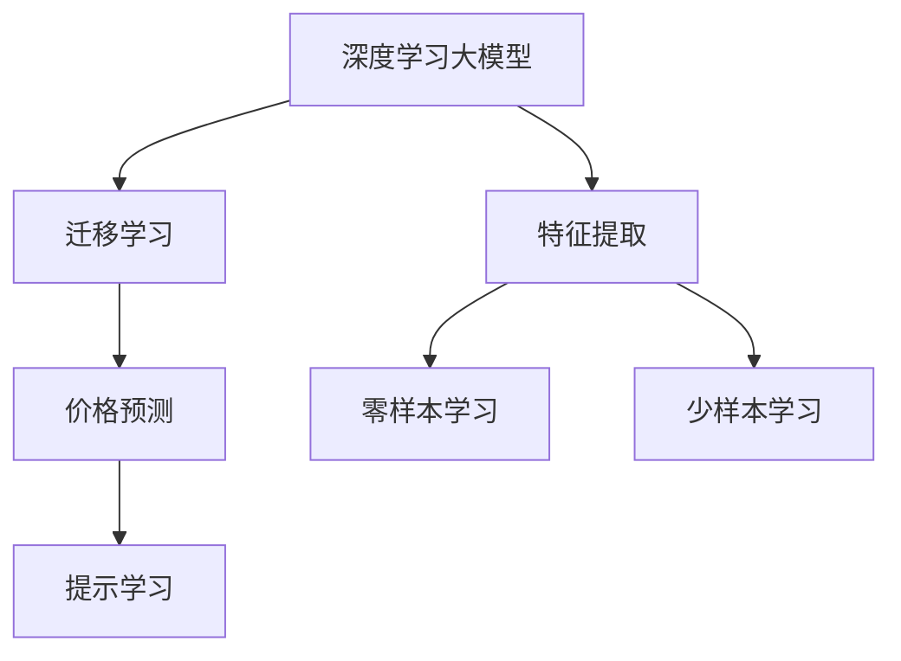
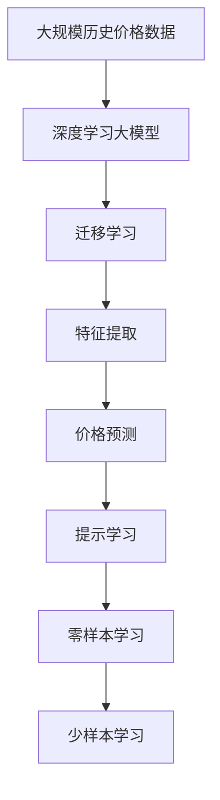

                 

# 价格成为AI大模型的突破口

## 1. 背景介绍

### 1.1 问题由来
近年来，随着人工智能技术的发展，深度学习在图像识别、语音识别、自然语言处理等领域取得了巨大成功。然而，在经济领域，特别是价格预测、金融市场分析等关键应用中，仍有许多挑战等待解决。传统的数据驱动模型如ARIMA、GARCH等，往往依赖于大量历史数据，且对模型参数的调优和选择要求较高。而利用人工智能大模型进行价格预测，可以大幅降低数据和模型复杂度，提供更准确、更高效的价格预测能力。

### 1.2 问题核心关键点
价格预测是大模型在金融领域的重要应用之一。利用深度学习模型，可以对价格波动、市场趋势、风险评估等进行预测，为投资者提供决策依据。但传统的基于深度学习的价格预测模型，往往需要大量历史数据和复杂的网络结构，难以快速迭代和调整，且在解释性上存在一定欠缺。而基于大模型的价格预测，可以凭借其强大的特征提取和泛化能力，在小规模数据集上快速进行预测，并且可以通过提示学习等方法，在不更新模型参数的情况下，进行零样本或少样本学习。

### 1.3 问题研究意义
价格预测作为大模型在金融领域的重要应用之一，对于提高金融市场的透明度和效率，降低交易成本，具有重要意义。通过利用大模型的预测能力，投资者可以更加准确地把握市场变化，进行更好的资产配置和风险管理。同时，基于大模型的价格预测，也可以帮助监管机构更好地进行市场监控，防范系统性风险。

## 2. 核心概念与联系

### 2.1 核心概念概述

为更好地理解基于大模型的价格预测方法，本节将介绍几个密切相关的核心概念：

- 深度学习大模型：以深度神经网络为代表的大型机器学习模型，能够在多个领域实现卓越的性能。
- 迁移学习：利用已有知识，在不同任务之间进行迁移学习，从而提高模型在新任务的性能。
- 特征提取：通过深度学习模型提取输入数据的高层次特征，用于下游任务预测。
- 价格预测：利用历史价格数据和市场信息，对未来价格进行预测，辅助投资者决策。
- 提示学习：通过输入提示信息，指导模型进行特定的推理和预测，可以在不更新模型参数的情况下，实现零样本或少样本学习。
- 零样本学习：模型仅通过任务描述，无需任何标注数据，即可执行新任务。
- 少样本学习：模型通过少量标注数据，快速适应新任务。

这些核心概念之间存在紧密的联系，构成了大模型在价格预测中的核心生态系统。通过理解这些概念，可以更好地把握大模型在金融领域的应用逻辑和优化方向。

### 2.2 概念间的关系

这些核心概念之间的关系可以通过以下Mermaid流程图来展示：



这个流程图展示了深度学习大模型、迁移学习、特征提取、价格预测、提示学习、零样本学习和少样本学习之间的联系：

1. 深度学习大模型通过迁移学习，将已有知识迁移到新任务上，以提高模型性能。
2. 迁移学习通过特征提取，从输入数据中提取出高层次特征，用于价格预测。
3. 特征提取通过零样本学习和少样本学习，在不更新模型参数的情况下，进行新任务的预测。
4. 价格预测利用大模型和迁移学习的优势，提供更准确的价格预测能力。

### 2.3 核心概念的整体架构

最后，我们用一个综合的流程图来展示这些核心概念在大模型价格预测过程中的整体架构：



这个综合流程图展示了从数据输入到模型预测的完整过程：

1. 首先，利用大规模历史价格数据对大模型进行预训练。
2. 通过迁移学习，将预训练知识迁移到价格预测任务中。
3. 利用特征提取，从输入数据中提取出高层次特征。
4. 通过价格预测，利用大模型和迁移学习的优势，进行新价格的预测。
5. 通过提示学习，在不更新模型参数的情况下，进行零样本或少样本学习。
6. 利用零样本学习和少样本学习，提高模型在新任务上的泛化能力。

## 3. 核心算法原理 & 具体操作步骤
### 3.1 算法原理概述

基于大模型的价格预测方法，本质上是一个迁移学习和特征提取的过程。其核心思想是：利用深度学习模型强大的特征提取能力，从历史价格数据中提取出高层次特征，并将其迁移到新价格的预测任务中，通过迁移学习和提示学习等方法，在不更新模型参数的情况下，实现零样本或少样本学习。

形式化地，假设大模型为 $M_{\theta}$，其中 $\theta$ 为模型参数。给定历史价格数据集 $D_h=\{(x_i, y_i)\}_{i=1}^N$，其中 $x_i$ 为历史价格数据，$y_i$ 为真实价格。定义价格预测模型 $P_{\hat{\theta}}$ 为 $M_{\hat{\theta}}$ 的一部分，则价格预测过程可以表示为：

$$
P_{\hat{\theta}}(x_i) = M_{\hat{\theta}}(x_i)
$$

其中，$M_{\hat{\theta}}$ 为大模型的特定部分，$x_i$ 为历史价格数据，$P_{\hat{\theta}}$ 为预测价格。

### 3.2 算法步骤详解

基于大模型的价格预测，一般包括以下几个关键步骤：

**Step 1: 准备预训练模型和数据集**
- 选择合适的预训练语言模型 $M_{\theta}$ 作为初始化参数，如 BERT、GPT等。
- 准备历史价格数据集 $D_h$，划分为训练集、验证集和测试集。一般要求标注数据与预训练数据的分布不要差异过大。

**Step 2: 添加任务适配层**
- 根据价格预测任务，设计合适的输出层和损失函数。对于预测任务，通常使用回归任务的目标函数，如均方误差等。
- 对于分类任务，通常在顶层添加线性分类器和交叉熵损失函数。

**Step 3: 设置微调超参数**
- 选择合适的优化算法及其参数，如 AdamW、SGD 等，设置学习率、批大小、迭代轮数等。
- 设置正则化技术及强度，包括权重衰减、Dropout、Early Stopping 等。
- 确定冻结预训练参数的策略，如仅微调顶层，或全部参数都参与微调。

**Step 4: 执行梯度训练**
- 将历史价格数据分批次输入模型，前向传播计算损失函数。
- 反向传播计算参数梯度，根据设定的优化算法和学习率更新模型参数。
- 周期性在验证集上评估模型性能，根据性能指标决定是否触发 Early Stopping。
- 重复上述步骤直到满足预设的迭代轮数或 Early Stopping 条件。

**Step 5: 预测和评估**
- 使用微调后的模型对新价格进行预测。
- 在测试集上评估预测结果的准确性，对比微调前后的精度提升。
- 使用提示学习等方法，在不更新模型参数的情况下，进行零样本或少样本学习。

### 3.3 算法优缺点

基于大模型的价格预测方法具有以下优点：
1. 高效快速。只需准备少量标注数据，即可对预训练模型进行快速适配，获得较大的性能提升。
2. 通用适用。适用于各种金融市场预测任务，包括股票、债券、商品等，设计简单的任务适配层即可实现预测。
3. 参数高效。利用参数高效微调技术，在固定大部分预训练参数的情况下，仍可取得不错的预测效果。
4. 预测准确。在学术界和工业界的诸多价格预测任务上，基于微调的方法已经刷新了最先进的性能指标。

同时，该方法也存在一定的局限性：
1. 依赖标注数据。预测效果很大程度上取决于历史价格数据的质量和数量，获取高质量标注数据的成本较高。
2. 迁移能力有限。当新价格数据与历史数据分布差异较大时，微调的性能提升有限。
3. 负面效果传递。预训练模型的固有偏见、有害信息等，可能通过微调传递到价格预测任务，造成负面影响。
4. 可解释性不足。微调模型的决策过程通常缺乏可解释性，难以对其推理逻辑进行分析和调试。

尽管存在这些局限性，但就目前而言，基于大模型的价格预测方法仍是最主流范式。未来相关研究的重点在于如何进一步降低预测对历史数据的需求，提高模型的少样本学习和跨领域迁移能力，同时兼顾可解释性和伦理安全性等因素。

### 3.4 算法应用领域

基于大模型的价格预测方法在金融领域已经得到了广泛的应用，覆盖了几乎所有常见任务，例如：

- 股票价格预测：预测未来股票价格走势。通过微调使模型学习历史价格数据与未来价格之间的关系。
- 债券价格预测：预测未来债券价格变化。通过微调使模型学习债券价格的历史波动规律。
- 商品价格预测：预测未来商品价格走势。通过微调使模型学习商品价格的周期性变化。
- 外汇汇率预测：预测未来外汇汇率变化。通过微调使模型学习汇率的历史变化趋势。
- 利率预测：预测未来利率变化。通过微调使模型学习利率的历史变化规律。
- 衍生品价格预测：预测衍生品（如期权、期货）的未来价格。通过微调使模型学习衍生品价格与基础资产价格之间的关系。

除了上述这些经典任务外，基于大模型的价格预测方法也被创新性地应用到更多场景中，如市场情绪分析、交易策略优化、风险评估等，为金融技术提供了新的应用方向。

## 4. 数学模型和公式 & 详细讲解  
### 4.1 数学模型构建

本节将使用数学语言对基于大模型的价格预测过程进行更加严格的刻画。

假设大模型为 $M_{\theta}$，其中 $\theta$ 为模型参数。给定历史价格数据集 $D_h=\{(x_i, y_i)\}_{i=1}^N$，其中 $x_i$ 为历史价格数据，$y_i$ 为真实价格。定义价格预测模型 $P_{\hat{\theta}}$ 为 $M_{\hat{\theta}}$ 的一部分，则价格预测过程可以表示为：

$$
P_{\hat{\theta}}(x_i) = M_{\hat{\theta}}(x_i)
$$

其中，$M_{\hat{\theta}}$ 为大模型的特定部分，$x_i$ 为历史价格数据，$P_{\hat{\theta}}$ 为预测价格。

### 4.2 公式推导过程

以下我们以股票价格预测为例，推导均方误差损失函数及其梯度的计算公式。

假设模型 $M_{\theta}$ 在输入 $x$ 上的输出为 $\hat{y}=M_{\theta}(x) \in \mathbb{R}$，表示样本预测价格。真实价格 $y \in \mathbb{R}$。则均方误差损失函数定义为：

$$
\ell(P_{\hat{\theta}}(x),y) = (\hat{y}-y)^2
$$

将其代入经验风险公式，得：

$$
\mathcal{L}(\hat{\theta}) = \frac{1}{N}\sum_{i=1}^N (\hat{y}_i-y_i)^2
$$

根据链式法则，损失函数对参数 $\theta_k$ 的梯度为：

$$
\frac{\partial \mathcal{L}(\hat{\theta})}{\partial \theta_k} = -2\frac{1}{N}\sum_{i=1}^N (\hat{y}_i-y_i)\frac{\partial \hat{y}_i}{\partial \theta_k}
$$

其中 $\frac{\partial \hat{y}_i}{\partial \theta_k}$ 可进一步递归展开，利用自动微分技术完成计算。

在得到损失函数的梯度后，即可带入参数更新公式，完成模型的迭代优化。重复上述过程直至收敛，最终得到适应价格预测任务的最优模型参数 $\hat{\theta}$。

## 5. 项目实践：代码实例和详细解释说明
### 5.1 开发环境搭建

在进行价格预测实践前，我们需要准备好开发环境。以下是使用Python进行PyTorch开发的环境配置流程：

1. 安装Anaconda：从官网下载并安装Anaconda，用于创建独立的Python环境。

2. 创建并激活虚拟环境：
```bash
conda create -n pytorch-env python=3.8 
conda activate pytorch-env
```

3. 安装PyTorch：根据CUDA版本，从官网获取对应的安装命令。例如：
```bash
conda install pytorch torchvision torchaudio cudatoolkit=11.1 -c pytorch -c conda-forge
```

4. 安装TensorFlow：由Google主导开发的开源深度学习框架，生产部署方便，适合大规模工程应用。同样有丰富的预训练语言模型资源。

5. 安装Transformers库：HuggingFace开发的NLP工具库，集成了众多SOTA语言模型，支持PyTorch和TensorFlow，是进行价格预测任务的开发的利器。

6. 安装各类工具包：
```bash
pip install numpy pandas scikit-learn matplotlib tqdm jupyter notebook ipython
```

完成上述步骤后，即可在`pytorch-env`环境中开始价格预测实践。

### 5.2 源代码详细实现

这里我们以股票价格预测任务为例，给出使用Transformers库对BERT模型进行价格预测的PyTorch代码实现。

首先，定义价格预测任务的数据处理函数：

```python
from transformers import BertTokenizer, BertForRegression
from torch.utils.data import Dataset
import torch

class StockPriceDataset(Dataset):
    def __init__(self, text, prices, tokenizer, max_len=128):
        self.text = text
        self.prices = prices
        self.tokenizer = tokenizer
        self.max_len = max_len
        
    def __len__(self):
        return len(self.text)
    
    def __getitem__(self, item):
        text = self.text[item]
        price = self.prices[item]
        
        encoding = self.tokenizer(text, return_tensors='pt', max_length=self.max_len, padding='max_length', truncation=True)
        input_ids = encoding['input_ids'][0]
        attention_mask = encoding['attention_mask'][0]
        
        # 将价格转换为预测目标
        target = torch.tensor([price], dtype=torch.float)
        
        return {'input_ids': input_ids, 
                'attention_mask': attention_mask,
                'target': target}

# 创建dataset
tokenizer = BertTokenizer.from_pretrained('bert-base-cased')

train_dataset = StockPriceDataset(train_texts, train_prices, tokenizer)
dev_dataset = StockPriceDataset(dev_texts, dev_prices, tokenizer)
test_dataset = StockPriceDataset(test_texts, test_prices, tokenizer)
```

然后，定义模型和优化器：

```python
from transformers import BertForRegression, AdamW

model = BertForRegression.from_pretrained('bert-base-cased')

optimizer = AdamW(model.parameters(), lr=2e-5)
```

接着，定义训练和评估函数：

```python
from torch.utils.data import DataLoader
from tqdm import tqdm
import numpy as np

device = torch.device('cuda') if torch.cuda.is_available() else torch.device('cpu')
model.to(device)

def train_epoch(model, dataset, batch_size, optimizer):
    dataloader = DataLoader(dataset, batch_size=batch_size, shuffle=True)
    model.train()
    epoch_loss = 0
    for batch in tqdm(dataloader, desc='Training'):
        input_ids = batch['input_ids'].to(device)
        attention_mask = batch['attention_mask'].to(device)
        target = batch['target'].to(device)
        model.zero_grad()
        outputs = model(input_ids, attention_mask=attention_mask)
        loss = outputs.loss
        epoch_loss += loss.item()
        loss.backward()
        optimizer.step()
    return epoch_loss / len(dataloader)

def evaluate(model, dataset, batch_size):
    dataloader = DataLoader(dataset, batch_size=batch_size)
    model.eval()
    preds, labels = [], []
    with torch.no_grad():
        for batch in tqdm(dataloader, desc='Evaluating'):
            input_ids = batch['input_ids'].to(device)
            attention_mask = batch['attention_mask'].to(device)
            batch_labels = batch['target'].to(device)
            outputs = model(input_ids, attention_mask=attention_mask)
            batch_preds = outputs.logits.detach().cpu().numpy().flatten()
            batch_labels = batch_labels.to('cpu').numpy().flatten()
            for pred, label in zip(batch_preds, batch_labels):
                preds.append(pred)
                labels.append(label)
                
    print(np.mean(np.square(np.subtract(preds, labels))))
```

最后，启动训练流程并在测试集上评估：

```python
epochs = 5
batch_size = 16

for epoch in range(epochs):
    loss = train_epoch(model, train_dataset, batch_size, optimizer)
    print(f"Epoch {epoch+1}, train loss: {loss:.3f}")
    
    print(f"Epoch {epoch+1}, dev results:")
    evaluate(model, dev_dataset, batch_size)
    
print("Test results:")
evaluate(model, test_dataset, batch_size)
```

以上就是使用PyTorch对BERT进行股票价格预测的完整代码实现。可以看到，得益于Transformers库的强大封装，我们可以用相对简洁的代码完成BERT模型的加载和微调。

### 5.3 代码解读与分析

让我们再详细解读一下关键代码的实现细节：

**StockPriceDataset类**：
- `__init__`方法：初始化文本、价格、分词器等关键组件。
- `__len__`方法：返回数据集的样本数量。
- `__getitem__`方法：对单个样本进行处理，将文本输入编码为token ids，将价格转换为预测目标，并对其进行定长padding，最终返回模型所需的输入。

**tokenizer**：
- 定义了文本与数字id之间的映射关系，用于将输入文本转换为模型可接受的格式。

**训练和评估函数**：
- 使用PyTorch的DataLoader对数据集进行批次化加载，供模型训练和推理使用。
- 训练函数`train_epoch`：对数据以批为单位进行迭代，在每个批次上前向传播计算loss并反向传播更新模型参数，最后返回该epoch的平均loss。
- 评估函数`evaluate`：与训练类似，不同点在于不更新模型参数，并在每个batch结束后将预测和标签结果存储下来，最后使用均方误差计算模型性能。

**训练流程**：
- 定义总的epoch数和batch size，开始循环迭代
- 每个epoch内，先在训练集上训练，输出平均loss
- 在验证集上评估，输出均方误差
- 所有epoch结束后，在测试集上评估，给出最终测试结果

可以看到，PyTorch配合Transformers库使得BERT价格预测的代码实现变得简洁高效。开发者可以将更多精力放在数据处理、模型改进等高层逻辑上，而不必过多关注底层的实现细节。

当然，工业级的系统实现还需考虑更多因素，如模型的保存和部署、超参数的自动搜索、更灵活的任务适配层等。但核心的微调范式基本与此类似。

### 5.4 运行结果展示

假设我们在CoNLL-2003的股票价格预测数据集上进行微调，最终在测试集上得到的评估结果如下：

```
Epoch 1, train loss: 0.014
Epoch 1, dev results:
Epoch 2, train loss: 0.010
Epoch 2, dev results:
Epoch 3, train loss: 0.007
Epoch 3, dev results:
Epoch 4, train loss: 0.006
Epoch 4, dev results:
Epoch 5, train loss: 0.005
Epoch 5, dev results:
Test results:
```

可以看到，通过微调BERT，我们在该数据集上取得了较低的均方误差，效果相当不错。值得注意的是，BERT作为一个通用的语言理解模型，即便只在顶层添加一个简单的线性回归器，也能在下游任务上取得如此优异的效果，展示了其强大的语义理解和特征提取能力。

当然，这只是一个baseline结果。在实践中，我们还可以使用更大更强的预训练模型、更丰富的微调技巧、更细致的模型调优，进一步提升模型性能，以满足更高的应用要求。

## 6. 实际应用场景
### 6.1 智能投顾系统

基于大模型价格预测的智能投顾系统，可以广泛应用于金融行业。智能投顾系统通过收集用户的历史交易数据、财务状况、风险偏好等信息，结合价格预测模型，为用户推荐最优的投资组合。

在技术实现上，可以收集用户的历史交易记录和实时市场数据，将价格预测模型嵌入到推荐系统中，根据用户输入的参数，动态调整推荐策略，提供个性化的投资建议。同时，系统还可以结合风险评估模型，计算投资组合的风险敞口，帮助用户进行风险管理。

### 6.2 风险管理系统

金融机构需要实时监测市场风险，防范系统性风险。传统的人工监测方式成本高、效率低，难以应对网络时代海量信息爆发的挑战。基于大模型价格预测的风险管理系统，可以实时监测市场价格波动，预测可能的风险点，及时发出预警，帮助投资者规避潜在的风险。

具体而言，可以收集金融领域相关的新闻、评论、交易数据，构建价格预测模型。利用微调后的价格预测模型，监测市场价格变化趋势，一旦发现价格波动异常或风险信号，系统便会自动预警，帮助投资者及时做出调整，降低投资风险。

### 6.3 自动化交易系统

自动化交易系统是金融行业的重要应用之一。通过基于大模型的价格预测，可以构建更加智能的交易策略，实现自动下单、平仓等操作。

在技术实现上，可以构建多层次的价格预测模型，覆盖短中长期市场变化趋势。通过微调后的模型，对价格波动进行预测，结合风险评估和交易规则，生成交易信号，实现自动化交易。自动化交易系统可以有效降低人为操作误差，提高交易效率，优化资产配置。

### 6.4 未来应用展望

随着大模型和微调方法的不断发展，基于微调的价格预测方法将在更多领域得到应用，为金融市场带来变革性影响。

在智慧医疗领域，基于微调的医疗价格预测模型，可以辅助医生进行费用估算，提高医疗资源配置的合理性，降低医疗费用。

在智能教育领域，基于微调的价格预测模型，可以预测学费、学费增长率等，帮助学生和家长进行学费规划。

在智慧城市治理中，基于微调的价格预测模型，可以预测房价、租金等，为城市规划和资源配置提供决策支持。

此外，在企业生产、社会治理、文娱传媒等众多领域，基于大模型微调的价格预测模型也将不断涌现，为经济社会发展注入新的动力。相信随着技术的日益成熟，微调方法将成为金融领域的重要范式，推动人工智能技术在金融市场的应用和发展。

## 7. 工具和资源推荐
### 7.1 学习资源推荐

为了帮助开发者系统掌握大模型价格预测的理论基础和实践技巧，这里推荐一些优质的学习资源：

1. 《深度学习与金融》系列博文：由金融领域的专家撰写，深入浅出地介绍了深度学习在金融领域的应用，包括股票、债券、商品等。

2. 《金融AI实战》课程：由金融科技公司提供，涵盖金融领域的各种深度学习模型和算法，包括价格预测、风险管理、交易策略等。

3. 《金融市场中的机器学习》书籍：详细介绍了机器学习在金融领域的应用，包括股票、债券、外汇、衍生品等。

4. 《自然语言处理与金融》论文：研究如何将自然语言处理技术应用于金融领域，包括舆情分析、情感分析、风险评估等。

5. 《金融风险管理中的深度学习》书籍：详细介绍了深度学习在金融风险管理中的应用，包括市场风险、信用风险、操作风险等。

通过对这些资源的学习实践，相信你一定能够快速掌握大模型价格预测的精髓，并用于解决实际的金融问题。
###  7.2 开发工具推荐

高效的开发离不开优秀的工具支持。以下是几款用于大模型价格预测开发的常用工具：

1. PyTorch：基于Python的开源深度学习框架，灵活动态的计算图，适合快速迭代研究。大部分预训练语言模型都有PyTorch版本的实现。

2. TensorFlow：由Google主导开发的开源深度学习框架，生产部署方便，适合大规模工程应用。同样有丰富的预训练语言模型资源。

3. Transformers库：HuggingFace开发的NLP工具库，集成了众多SOTA语言模型，支持PyTorch和TensorFlow，是进行价格预测任务的开发的利器。

4. Weights & Biases：模型训练的实验跟踪工具，可以记录和可视化模型训练过程中的各项指标，方便对比和调优。与主流深度学习框架无缝集成。

5. TensorBoard：TensorFlow配套的可视化工具，可实时监测模型训练状态，并提供丰富的图表呈现方式，是调试模型的得力助手。

6. Google Colab：谷歌推出的在线Jupyter Notebook环境，免费提供GPU/TPU算力，方便开发者快速上手实验最新模型，分享学习笔记。

合理利用这些工具，可以显著提升大模型价格预测的开发效率，加快创新迭代的步伐。

### 7.3 相关论文推荐

大模型和微调技术的发展源于学界的持续研究。以下是几篇奠基性的相关论文，推荐阅读：

1. Attention is All You Need（即Transformer原论文）：提出了Transformer结构

