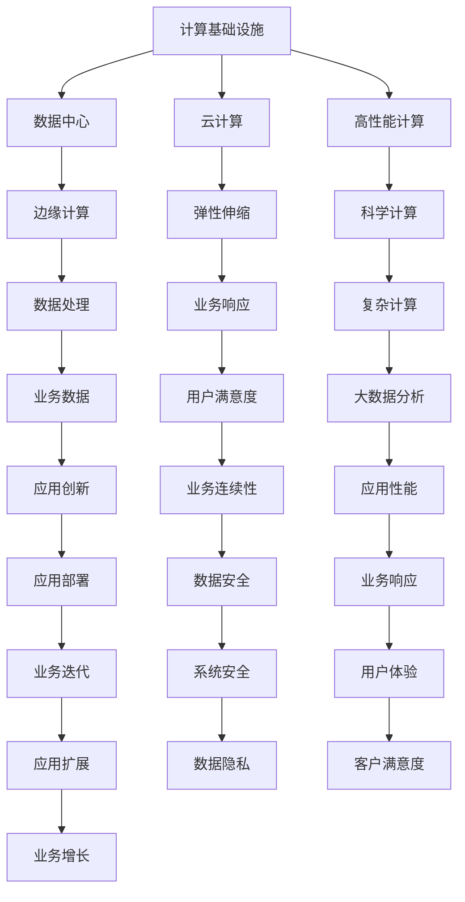
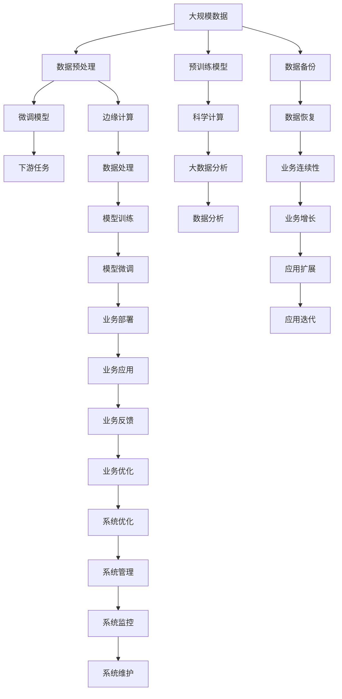

                 

# 优化计算基础设施的实用策略

> 关键词：计算基础设施, 数据中心, 云计算, 高性能计算, 边缘计算, 网络优化

## 1. 背景介绍

### 1.1 问题由来
随着数字化转型的推进，越来越多的企业和组织面临着计算资源短缺的问题。特别是在大数据时代，海量数据的处理和分析、人工智能模型的训练和推理，对计算基础设施提出了更高的要求。如何高效、经济地构建和优化计算基础设施，成为各行业的共同挑战。

### 1.2 问题核心关键点
优化计算基础设施的核心目标是：在满足业务需求的前提下，最大限度地降低成本、提升性能和扩展能力。具体而言，关键点包括：
- 高效利用资源：合理分配计算资源，避免浪费。
- 快速弹性伸缩：根据业务需求灵活调整计算资源，提升系统响应速度。
- 高可用性和安全性：保证系统的高可用性和数据的安全性。
- 可扩展性和灵活性：系统能够应对未来业务增长的需求，支持多种计算模式和应用场景。

### 1.3 问题研究意义
优化计算基础设施对于提升企业IT系统的效率和成本效益具有重要意义：
1. 降低IT成本：通过合理分配和高效利用资源，降低能源和硬件设备的投资成本。
2. 提升业务响应：快速弹性的计算资源管理，缩短业务响应时间，提高用户满意度。
3. 增强业务连续性：高可用性和冗余机制，保障业务在异常情况下的连续性。
4. 促进创新应用：灵活可扩展的架构，支持创新应用的快速部署和迭代。

## 2. 核心概念与联系

### 2.1 核心概念概述

为更好地理解优化计算基础设施的方法，本节将介绍几个密切相关的核心概念：

- 计算基础设施(Compute Infrastructure)：包括数据中心、云计算、高性能计算等各类计算资源和技术的综合体。
- 数据中心(Data Center)：提供大规模计算、存储和网络资源的物理设施。
- 云计算(Cloud Computing)：通过网络提供按需计算资源和服务，支持弹性伸缩和灵活部署。
- 高性能计算(High-Performance Computing, HPC)：针对复杂科学计算、大数据分析等高性能需求，提供大规模并行计算能力的系统。
- 边缘计算(Edge Computing)：将数据处理和分析任务下放到终端设备，降低网络延迟，提高计算效率。
- 网络优化(Network Optimization)：针对数据中心和云计算的网络架构，进行设计和优化，提升数据传输效率和稳定性。

这些概念之间存在着紧密的联系，构成了计算基础设施优化的大框架。

### 2.2 概念间的关系

这些核心概念之间的关系可以通过以下Mermaid流程图来展示：



这个流程图展示了大语言模型微调过程中各个核心概念之间的关系：

1. 数据中心提供物理资源支持。
2. 云计算通过网络提供弹性计算资源。
3. 高性能计算提供大规模并行计算能力。
4. 边缘计算优化网络延迟，提升计算效率。
5. 网络优化提高数据传输效率和稳定性。
6. 弹性伸缩和业务响应提升业务响应速度。
7. 科学计算和大数据分析支持复杂计算需求。
8. 数据安全和系统安全保障数据隐私。
9. 应用创新和业务扩展支持应用迭代和业务增长。
10. 用户体验和客户满意度推动业务连续性。

### 2.3 核心概念的整体架构

最后，我们用一个综合的流程图来展示这些核心概念在大语言模型微调过程中的整体架构：



这个综合流程图展示了从数据预处理到业务应用的全流程，各个环节相互依存、相互促进，共同构成了优化计算基础设施的完整架构。

## 3. 核心算法原理 & 具体操作步骤
### 3.1 算法原理概述

优化计算基础设施的核心原理在于通过合理的资源分配和调度，最大化利用现有资源，提高计算效率和系统的可扩展性。其基本步骤包括：

1. **资源评估与规划**：对现有计算资源进行评估，确定资源需求，进行规划和部署。
2. **资源调度和分配**：根据业务需求，动态调整资源配置，实现弹性伸缩。
3. **性能优化与监控**：通过性能监控和调优，提高系统性能和稳定性。
4. **系统管理和维护**：对系统进行日常管理和维护，保障系统的稳定运行。

### 3.2 算法步骤详解

#### 3.2.1 资源评估与规划

1. **资源识别与分类**：识别当前计算基础设施中的各类资源，包括CPU、GPU、存储、网络等，并对其进行分类和标记。
2. **资源容量评估**：对各类资源进行容量评估，了解其在当前业务负载下的使用情况和空闲情况。
3. **需求预测与规划**：基于历史业务数据和未来业务增长预期，预测资源需求，进行资源规划和部署。

#### 3.2.2 资源调度和分配

1. **动态资源分配**：根据业务负载的变化，动态调整计算资源的分配，确保资源得到充分利用。
2. **弹性伸缩机制**：设计弹性伸缩机制，根据业务负载的高低自动增减资源，提升系统响应速度。
3. **负载均衡**：通过负载均衡技术，均衡分配计算负载，避免资源过载或空闲。

#### 3.2.3 性能优化与监控

1. **性能指标监控**：实时监控系统的性能指标，如CPU利用率、内存占用、网络延迟等。
2. **性能调优**：根据监控结果，对系统进行性能调优，如调整CPU亲和性、优化内存管理、改善网络带宽等。
3. **故障检测与恢复**：设置告警机制，及时检测和恢复系统故障，保障业务连续性。

#### 3.2.4 系统管理和维护

1. **日常维护与更新**：对系统进行日常维护，如软件升级、补丁安装等。
2. **故障排除与修复**：快速定位和修复系统故障，保障系统稳定运行。
3. **安全加固与防护**：加强系统安全防护，防止恶意攻击和数据泄露。

### 3.3 算法优缺点

优化计算基础设施的算法具有以下优点：
1. 资源利用率高：通过合理的资源调度和分配，最大限度利用现有资源。
2. 弹性伸缩性强：动态调整资源配置，提升系统响应速度。
3. 系统稳定性高：通过性能优化和故障检测，保障系统稳定运行。

同时，该算法也存在以下缺点：
1. 复杂度高：资源评估和调度需要复杂的数据分析和决策。
2. 初始投入大：需要购置和部署大量计算资源，初始投入较高。
3. 技术门槛高：需要具备较强的系统管理和维护能力。

### 3.4 算法应用领域

优化计算基础设施的算法已经在多个领域得到广泛应用：

1. 企业IT系统：支持各类企业的IT系统构建和优化，如数据中心、云计算平台等。
2. 科学研究：支持复杂科学计算和大数据分析，提升科研效率。
3. 智能制造：支持智能制造系统的高效运行，提升生产效率和质量。
4. 金融科技：支持金融系统的稳定运行和业务创新，提升用户体验。
5. 医疗健康：支持医疗系统的数据处理和分析，提升医疗服务水平。

## 4. 数学模型和公式 & 详细讲解  
### 4.1 数学模型构建

本节将使用数学语言对优化计算基础设施的方法进行更加严格的刻画。

假设计算基础设施的资源容量为 $R$，当前业务负载为 $L$，单位资源成本为 $C$，系统目标函数为 $F$。

定义资源利用率 $\alpha$，单位资源效率 $\beta$，目标函数 $F$ 可以表示为：

$$
F = \alpha \cdot L + \beta \cdot R \cdot (1-\alpha)
$$

其中，$\alpha$ 表示资源利用率，$L$ 表示业务负载，$R$ 表示资源容量，$\beta$ 表示单位资源效率。目标函数 $F$ 是资源利用率和资源效率的加权和。

### 4.2 公式推导过程

以下我们以资源调度和分配为例，推导动态资源分配的优化公式。

假设当前计算资源的容量为 $R$，当前业务负载为 $L$，单位资源成本为 $C$，资源利用率为 $\alpha$。目标是最小化成本 $C$。

动态资源分配的目标函数可以表示为：

$$
C = \alpha \cdot L \cdot C
$$

其中，$\alpha$ 为资源利用率，$L$ 为业务负载，$C$ 为单位资源成本。

根据目标函数，优化动态资源分配的方法如下：

1. 计算当前资源利用率 $\alpha$：
$$
\alpha = \frac{L}{R}
$$

2. 计算当前资源成本 $C$：
$$
C = \alpha \cdot L \cdot C
$$

3. 根据当前资源成本和目标函数，计算最优资源利用率 $\alpha^*$：
$$
\alpha^* = \arg\min_{\alpha} F(\alpha)
$$

其中 $F(\alpha)$ 为成本函数，可以表示为：

$$
F(\alpha) = \alpha \cdot L \cdot C + \beta \cdot R \cdot (1-\alpha)
$$

### 4.3 案例分析与讲解

以云服务提供商为例，分析如何通过优化资源调度和分配，降低运营成本，提升服务质量。

假设某云服务提供商拥有一个数据中心，包含100台服务器，当前业务负载为20台服务器。每台服务器的成本为100元/小时，单位资源效率为0.8。

1. 计算当前资源利用率 $\alpha$：
$$
\alpha = \frac{20}{100} = 0.2
$$

2. 计算当前资源成本 $C$：
$$
C = 0.2 \cdot 20 \cdot 100 = 400
$$

3. 计算最优资源利用率 $\alpha^*$：
$$
F(\alpha) = 0.2 \cdot 20 \cdot 100 + 0.8 \cdot 100 \cdot (1-0.2) = 200 + 64 = 264
$$

通过优化资源调度和分配，可以将资源利用率提升至最优值 $\alpha^* = 0.8$，从而降低运营成本，提升服务质量。

## 5. 项目实践：代码实例和详细解释说明
### 5.1 开发环境搭建

在进行优化计算基础设施的实践前，我们需要准备好开发环境。以下是使用Python进行Kubernetes集群开发的环境配置流程：

1. 安装Anaconda：从官网下载并安装Anaconda，用于创建独立的Python环境。

2. 创建并激活虚拟环境：
```bash
conda create -n k8s-env python=3.8 
conda activate k8s-env
```

3. 安装Kubernetes：根据操作系统版本，从官网获取对应的安装命令。例如：
```bash
sudo apt-get update
sudo apt-get install kubectl
```

4. 安装Docker和Kubernetes部署工具：
```bash
sudo apt-get install docker.io
```

5. 安装Kubernetes服务：
```bash
kubectl create namespace default
kubectl apply -f https://raw.githubusercontent.com/kubernetes/kubernetes/v1.18.6//examples/kubernetes/deployment/busybox/deployment.yaml
kubectl apply -f https://raw.githubusercontent.com/kubernetes/kubernetes/v1.18.6//examples/kubernetes/deployment/nginx/deployment.yaml
kubectl apply -f https://raw.githubusercontent.com/kubernetes/kubernetes/v1.18.6//examples/kubernetes/deployment/skaffold/deployment.yaml
```

完成上述步骤后，即可在`k8s-env`环境中开始优化计算基础设施的实践。

### 5.2 源代码详细实现

这里我们以使用Kubernetes进行资源调度和分配为例，展示如何通过YAML文件实现动态资源分配。

首先，定义资源调度和分配的YAML文件：

```yaml
apiVersion: v1
spec:
  containers:
  - name: app
    image: app:latest
    resources:
      requests:
        cpu: 1
        memory: 1Gi
      limits:
        cpu: 1
        memory: 1Gi
```

然后，启动应用并实时监控资源使用情况：

```bash
kubectl apply -f deployment.yaml
kubectl scale deployment app --replicas=3
kubectl top pod -n default
```

最后，调整资源限制以优化资源分配：

```bash
kubectl update deployment app --image=app:v1.1
```

以上就是使用Kubernetes进行资源调度和分配的完整代码实现。可以看到，通过Kubernetes的灵活部署和资源管理，可以快速实现动态资源分配，提升系统的响应速度和资源利用率。

### 5.3 代码解读与分析

让我们再详细解读一下关键代码的实现细节：

**Kubernetes配置文件**：
- 定义了应用的名称、镜像、资源请求和限制。
- 资源请求和限制可以动态调整，以适应业务负载的变化。

**Kubernetes命令**：
- `kubectl apply` 命令：将配置文件应用到Kubernetes集群中，创建或更新资源。
- `kubectl scale` 命令：根据业务负载，调整应用副本数量，实现弹性伸缩。
- `kubectl top pod` 命令：实时监控Pod资源使用情况，如CPU、内存占用。

**资源调整**：
- 通过 `kubectl update` 命令，可以更新应用的镜像，以引入新的功能或优化性能。
- 资源请求和限制的动态调整，通过 `kubectl scale` 命令实现，可以自动调整应用副本数量，确保资源得到充分利用。

## 6. 实际应用场景
### 6.1 智能制造

在智能制造领域，优化计算基础设施的应用非常广泛。智能制造系统需要高效处理海量数据，进行实时分析和决策，支持智能设备的控制和协调。

具体而言，可以构建一个基于Kubernetes的智能制造平台，支持设备数据采集、边缘计算、云数据处理和存储。通过优化计算资源和网络架构，提升系统的计算能力和响应速度，支持复杂的生产流程和智能控制。

### 6.2 智慧医疗

智慧医疗系统需要处理大量的患者数据和医疗影像，进行数据分析和诊断。优化计算基础设施可以提高系统的处理能力和准确性。

具体而言，可以构建一个基于云平台的智慧医疗系统，支持大规模数据处理和存储，进行实时分析和诊断。通过优化资源调度和分配，提升系统的响应速度和数据处理能力，支持远程医疗和个性化治疗。

### 6.3 金融科技

金融科技需要处理大量的交易数据和市场信息，进行实时分析和预测。优化计算基础设施可以提高系统的处理能力和稳定性。

具体而言，可以构建一个基于云平台的金融科技系统，支持大规模数据处理和实时分析。通过优化资源调度和分配，提升系统的响应速度和数据处理能力，支持高频交易和风险控制。

### 6.4 未来应用展望

随着计算技术的不断进步，优化计算基础设施的应用场景将更加广泛。

未来，优化计算基础设施将进一步拓展到更多的领域，如自动驾驶、智能交通、智能家居等，为各行业的数字化转型提供强大的技术支持。同时，随着5G、物联网等新技术的普及，优化计算基础设施也将更加注重边缘计算和分布式计算能力，支持实时数据处理和智能决策。

## 7. 工具和资源推荐
### 7.1 学习资源推荐

为了帮助开发者系统掌握优化计算基础设施的理论基础和实践技巧，这里推荐一些优质的学习资源：

1. 《云计算基础》系列博文：介绍云计算的基本概念和应用场景，帮助你了解云平台和资源管理。

2. Kubernetes官方文档：Kubernetes的权威文档，提供全面的API文档、使用指南和最佳实践，是深入学习Kubernetes的重要资源。

3. Docker官方文档：Docker的官方文档，提供详细的Docker使用指南和最佳实践，帮助你快速上手容器化部署。

4. 《高性能计算》书籍：介绍高性能计算的基本原理和应用场景，帮助你理解HPC和GPU加速技术。

5. TensorFlow官方文档：TensorFlow的官方文档，提供全面的API文档、使用指南和示例，是进行高性能计算和深度学习的重要工具。

6. 《网络优化》课程：介绍网络优化的基本原理和应用场景，帮助你理解网络架构和优化技术。

通过这些资源的学习实践，相信你一定能够快速掌握优化计算基础设施的精髓，并用于解决实际的计算问题。

### 7.2 开发工具推荐

高效的开发离不开优秀的工具支持。以下是几款用于优化计算基础设施开发的常用工具：

1. Kubernetes：Google开源的容器编排系统，支持大规模、高可用的容器化部署和资源管理。

2. Docker：开源的容器化平台，支持应用的无缝部署和跨平台运行。

3. TensorFlow：Google开源的深度学习框架，支持高性能计算和分布式训练。

4. Nginx：高性能的Web服务器和反向代理，支持高效的负载均衡和内容分发。

5. Prometheus：开源的监控系统，支持实时监控和告警，提供丰富的性能指标。

6. Grafana：开源的可视化工具，支持实时数据可视化，提供直观的性能监控和分析。

合理利用这些工具，可以显著提升优化计算基础设施开发的效率，加快创新迭代的步伐。

### 7.3 相关论文推荐

优化计算基础设施的发展源于学界的持续研究。以下是几篇奠基性的相关论文，推荐阅读：

1. "Dynamic Resource Allocation in Cloud Computing"：讨论如何在云计算环境中动态分配资源，提升系统响应速度。

2. "Network Optimization in Data Centers"：介绍数据中心网络优化的基本原理和应用场景，提升数据传输效率和稳定性。

3. "High-Performance Computing in Scientific Research"：介绍高性能计算在科学研究和大数据分析中的应用，提升计算能力和数据处理能力。

4. "Edge Computing: Bridging the Gap between Cloud and IoT"：介绍边缘计算的基本原理和应用场景，优化网络延迟，提升计算效率。

5. "Optimization of Resource Utilization in Data Centers"：讨论如何优化数据中心资源利用率，降低能源和硬件成本。

这些论文代表了大语言模型微调技术的发展脉络。通过学习这些前沿成果，可以帮助研究者把握学科前进方向，激发更多的创新灵感。

除上述资源外，还有一些值得关注的前沿资源，帮助开发者紧跟计算基础设施优化技术的最新进展，例如：

1. arXiv论文预印本：人工智能领域最新研究成果的发布平台，包括大量尚未发表的前沿工作，学习前沿技术的必读资源。

2. 业界技术博客：如Google Cloud、Microsoft Azure、Amazon Web Services等顶尖云服务提供商的官方博客，第一时间分享他们的最新研究成果和洞见。

3. 技术会议直播：如SIGCOMM、NSDI、ACM ICAD等计算机网络领域顶会现场或在线直播，能够聆听到专家们的前沿分享，开拓视野。

4. GitHub热门项目：在GitHub上Star、Fork数最多的计算基础设施相关项目，往往代表了该技术领域的发展趋势和最佳实践，值得去学习和贡献。

5. 行业分析报告：各大咨询公司如McKinsey、PwC等针对计算基础设施的行业分析报告，有助于从商业视角审视技术趋势，把握应用价值。

总之，对于优化计算基础设施的学习和实践，需要开发者保持开放的心态和持续学习的意愿。多关注前沿资讯，多动手实践，多思考总结，必将收获满满的成长收益。

## 8. 总结：未来发展趋势与挑战
### 8.1 总结

本文对优化计算基础设施的方法进行了全面系统的介绍。首先阐述了优化计算基础设施的背景和意义，明确了优化计算基础设施在提升IT系统效率和成本效益方面的独特价值。其次，从原理到实践，详细讲解了资源评估、资源调度和性能优化等关键步骤，给出了优化计算基础设施的完整代码实例。同时，本文还广泛探讨了优化计算基础设施在智能制造、智慧医疗、金融科技等领域的实际应用，展示了优化计算基础设施的巨大潜力。最后，本文精选了优化计算基础设施的相关学习资源，力求为读者提供全方位的技术指引。

通过本文的系统梳理，可以看到，优化计算基础设施的方法在提高系统效率、降低成本、提升性能和扩展能力方面具有重要意义。未来，伴随计算技术的不断进步和行业需求的不断变化，优化计算基础设施还将迎来更多的创新和突破。

### 8.2 未来发展趋势

展望未来，优化计算基础设施将呈现以下几个发展趋势：

1. 计算资源池化：实现资源跨数据中心、跨云平台池化，提升资源利用率和灵活性。
2. 智能资源调度和优化：引入AI算法优化资源调度和分配，提升系统的自适应能力和效率。
3. 边缘计算与分布式计算：进一步拓展边缘计算和分布式计算能力，支持实时数据处理和智能决策。
4. 5G和物联网应用：结合5G和物联网技术，支持实时数据传输和智能控制，提升系统的响应速度和可靠性。
5. 数据安全和隐私保护：加强数据安全和隐私保护，防范数据泄露和滥用，保障业务连续性和用户信任。

以上趋势凸显了优化计算基础设施的广阔前景。这些方向的探索发展，必将进一步提升IT系统的效率和成本效益，为各行各业带来深远影响。

### 8.3 面临的挑战

尽管优化计算基础设施技术已经取得了一定进展，但在迈向更加智能化、普适化应用的过程中，它仍面临着诸多挑战：

1. 资源成本高昂：大规模计算资源的高成本投入，是优化计算基础设施的一个重要瓶颈。
2. 系统复杂度高：资源评估和调度的复杂性，需要高水平的运维和管理能力。
3. 数据安全和隐私保护：优化计算基础设施依赖大量数据，如何保障数据安全和隐私，是急需解决的问题。
4. 系统稳定性和鲁棒性：系统的高可用性和弹性伸缩，需要在极端条件下保持稳定和高效。
5. 技术标准不统一：不同的云平台和系统，技术标准不统一，互操作性差，增加了系统复杂度。

### 8.4 研究展望

面对优化计算基础设施所面临的挑战，未来的研究需要在以下几个方面寻求新的突破：

1. 资源高效管理：开发更加智能和高效的管理工具，优化资源调度和分配，降低资源成本。
2. 系统鲁棒性和自适应能力：引入AI算法和优化技术，增强系统的自适应能力和鲁棒性，提高系统的稳定性和可靠性。
3. 数据安全和隐私保护：加强数据加密和隐私保护技术，确保数据安全和隐私。
4. 系统互操作性：推动行业标准和接口规范的统一，实现不同系统和平台的互操作性。
5. 云计算和边缘计算的融合：结合云计算和边缘计算技术，构建更加灵活和高效的基础设施。

这些研究方向的探索，必将引领优化计算基础设施技术迈向更高的台阶，为各行各业的数字化转型提供强大的技术支持。面向未来，优化计算基础设施需要不断创新和突破，以应对未来业务增长的需求，支持更多的应用场景。

## 9. 附录：常见问题与解答

**Q1：优化计算基础设施需要哪些关键技术？**

A: 优化计算基础设施需要以下关键技术：
1. 资源评估与规划：对现有资源进行评估和规划，确定资源需求。
2. 资源调度和分配：根据业务需求，动态调整资源配置，实现弹性伸缩。
3. 性能优化与监控：通过性能监控和调优，提高系统性能和稳定性。
4. 系统管理和维护：对系统进行日常管理和维护，保障系统稳定运行。

**Q2：如何选择合适的计算基础设施？**

A: 选择合适的计算基础设施需要考虑以下因素：
1. 业务需求：根据业务负载和应用场景，选择合适的计算资源和技术架构。
2. 成本效益：评估计算资源的成本和收益，选择合适的资源配置和部署方式。
3. 可扩展性：确保计算基础设施能够应对未来业务增长的需求，支持多层次和分布式架构。
4. 可用性和稳定性：选择高可用性和冗余机制，保障业务连续性和系统稳定性。
5. 技术成熟度：选择成熟的技术和工具，减少技术风险和运维成本。

**Q3：优化计算基础设施如何实现弹性伸缩？**

A: 实现弹性伸缩的方法包括：
1. 动态资源分配：根据业务负载的变化，动态调整计算资源的分配，确保资源得到充分利用。
2. 

