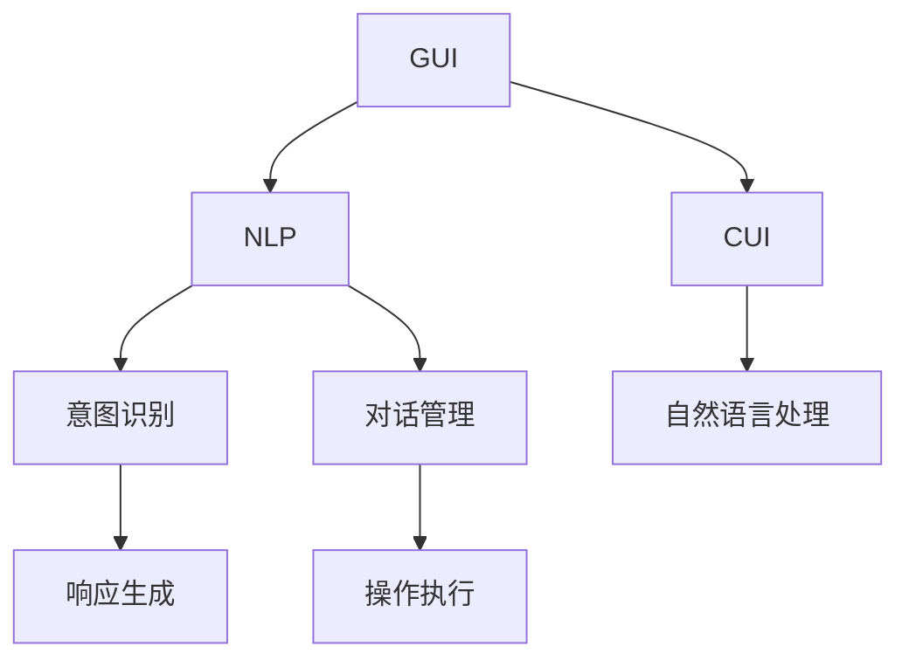
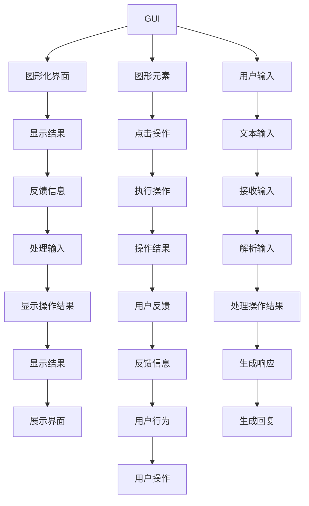
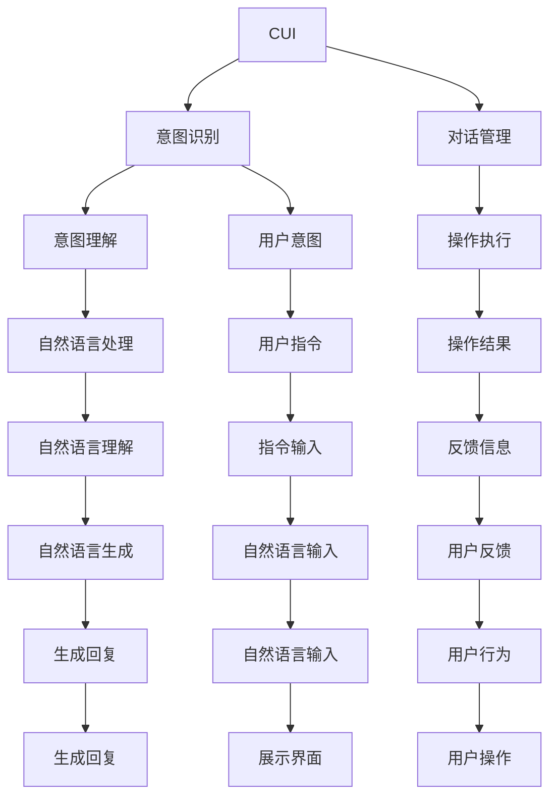

                 

## 1. 背景介绍

### 1.1 问题由来

随着计算机技术的不断进步，用户与计算机的交互方式也在不断演进。最初，用户通过命令行界面（CLI）与计算机进行交互。然而，由于CLI需要用户记住大量的命令和选项，对用户的使用门槛要求较高，因此逐渐被更加直观友好的图形用户界面（GUI）所取代。

GUI通过图形化的元素（如窗口、按钮、菜单等）简化了用户的操作流程，使得计算机的使用变得更为直观和易用。然而，尽管GUI在许多方面都优于CLI，但在一些特定的场景中，GUI仍然存在一些局限性，无法满足用户对灵活性和效率的需求。

随着人工智能和自然语言处理（NLP）技术的不断进步，一种新兴的交互方式——计算机用户界面（CUI）开始进入人们的视野。CUI利用自然语言处理技术，使得用户可以通过自然语言与计算机进行交互，无需记忆复杂的命令和操作，极大地提升了用户体验和交互效率。

本文将重点对比传统GUI与CUI的交互方式，探讨它们各自的优势和劣势，并展望未来交互方式的发展趋势。

### 1.2 问题核心关键点

传统GUI与CUI的交互方式主要包括以下几个关键点：

- **图形化 vs. 文本化**：GUI通过图形化的界面展示信息，而CUI通过文本化的指令进行操作。
- **记忆负担 vs. 交互效率**：GUI需要用户记忆大量的菜单和选项，而CUI通过自然语言处理技术，减轻了用户的记忆负担。
- **操作复杂度 vs. 灵活性**：GUI操作通常较为复杂，需要用户记住多个步骤，而CUI可以通过自然语言灵活调整操作顺序和参数。
- **任务适配 vs. 泛化能力**：GUI通常针对具体任务设计，而CUI可以通过自然语言泛化处理各种任务。
- **学习成本 vs. 使用体验**：GUI的学习曲线较陡，但提供可视化的反馈，而CUI需要自然语言理解能力，学习曲线相对较平缓。

## 2. 核心概念与联系

### 2.1 核心概念概述

为了更好地理解传统GUI与CUI的交互方式，本节将介绍几个密切相关的核心概念：

- **图形用户界面（GUI）**：一种用户与计算机交互的方式，通过图形化元素（如窗口、按钮、菜单等）简化了用户的操作流程。
- **自然语言处理（NLP）**：利用计算机处理和理解人类自然语言的技术，包括语音识别、自然语言理解、自然语言生成等。
- **计算机用户界面（CUI）**：一种通过自然语言与计算机进行交互的接口，利用自然语言处理技术，使得用户可以通过自然语言与计算机进行互动。
- **意图识别**：从用户输入的自然语言中识别出用户的意图，是CUI交互的核心技术之一。
- **对话管理**：根据用户的意图和上下文信息，生成并执行相应的操作或回答，是CUI交互的关键技术之一。

这些核心概念之间的逻辑关系可以通过以下Mermaid流程图来展示：



这个流程图展示了GUI、CUI、自然语言处理、意图识别和对话管理之间的联系。GUI通过图形化元素简化用户操作，而CUI利用自然语言处理技术使得用户可以通过自然语言与计算机互动。意图识别和对话管理是CUI交互的核心，使得计算机能够理解和执行用户的自然语言指令。

### 2.2 概念间的关系

这些核心概念之间存在着紧密的联系，形成了CUI交互方式的完整生态系统。下面我们通过几个Mermaid流程图来展示这些概念之间的关系。

#### 2.2.1 GUI与CUI的交互对比



这个流程图展示了GUI与CUI的基本交互流程。在GUI中，用户通过图形化元素（如按钮、菜单）进行操作，而在CUI中，用户通过自然语言（如语音、文本）进行互动。

#### 2.2.2 CUI的交互核心



这个流程图展示了CUI交互的核心流程。CUI通过意图识别和对话管理，将用户输入的自然语言转换为计算机可执行的指令，并根据上下文信息生成回复。

## 3. 核心算法原理 & 具体操作步骤

### 3.1 算法原理概述

CUI的交互方式基于自然语言处理技术，其核心算法包括意图识别和对话管理。下面我们将详细介绍这两个算法的原理和具体操作步骤。

#### 3.1.1 意图识别

意图识别是从用户输入的自然语言中识别出用户的意图，是CUI交互的基础。其算法原理如下：

1. **文本预处理**：对用户输入的自然语言进行分词、词性标注、命名实体识别等预处理步骤，提取出有意义的关键词和短语。
2. **特征提取**：利用词袋模型、TF-IDF、词嵌入等技术，将处理后的文本转换为数值特征向量。
3. **意图分类**：使用分类算法（如朴素贝叶斯、支持向量机、神经网络等）对特征向量进行分类，得到用户的意图。

#### 3.1.2 对话管理

对话管理是根据用户的意图和上下文信息，生成并执行相应的操作或回答。其算法原理如下：

1. **状态维护**：记录对话的历史信息和上下文，维护对话的状态。
2. **意图匹配**：将用户输入的自然语言与已有的意图进行匹配，确定用户的意图。
3. **操作生成**：根据用户的意图，生成相应的操作或回答。
4. **执行与反馈**：执行生成的操作，并根据操作结果生成反馈信息，返回给用户。

### 3.2 算法步骤详解

#### 3.2.1 意图识别步骤

1. **数据准备**：准备标注好的意图-文本对数据集，用于训练意图识别模型。
2. **模型训练**：使用机器学习算法（如朴素贝叶斯、支持向量机、神经网络等）对数据集进行训练，得到意图识别模型。
3. **特征提取**：将用户输入的自然语言进行预处理和特征提取，生成特征向量。
4. **意图分类**：使用训练好的意图识别模型对特征向量进行分类，得到用户的意图。

#### 3.2.2 对话管理步骤

1. **状态初始化**：初始化对话状态，包括上下文信息和用户意图。
2. **意图匹配**：将用户输入的自然语言与已有的意图进行匹配，确定用户的意图。
3. **操作生成**：根据用户的意图，生成相应的操作或回答。
4. **执行与反馈**：执行生成的操作，并根据操作结果生成反馈信息，返回给用户。
5. **状态更新**：根据操作结果和用户反馈，更新对话状态。

### 3.3 算法优缺点

#### 3.3.1 意图识别的优缺点

**优点**：

- **自然语言处理**：通过自然语言处理技术，使得用户可以使用自然语言与计算机互动，无需记忆复杂的命令和选项。
- **灵活性**：可以根据用户的输入灵活调整操作顺序和参数，使用户更加方便。

**缺点**：

- **学习成本**：自然语言处理技术需要一定的学习成本，特别是对于非英语母语的用户。
- **歧义性**：自然语言具有歧义性，同一句话可能有多种解释，导致意图识别结果不准确。

#### 3.3.2 对话管理的优缺点

**优点**：

- **灵活性**：根据用户的意图和上下文信息，生成并执行相应的操作或回答，使用户更加方便。
- **可扩展性**：可以通过添加新的意图和操作，扩展对话管理系统的功能。

**缺点**：

- **复杂度**：对话管理系统的复杂度较高，需要维护大量的状态和意图，增加了系统的维护难度。
- **鲁棒性**：对话管理系统对输入的自然语言要求较高，输入错误可能导致系统崩溃或生成错误的结果。

### 3.4 算法应用领域

基于自然语言处理技术，CUI在多个领域得到了广泛的应用，例如：

- **智能客服**：通过CUI，用户可以通过自然语言与客服机器人进行互动，获得及时的帮助和解答。
- **智能家居**：通过CUI，用户可以通过语音或文本指令控制家电，实现智能家居。
- **健康咨询**：通过CUI，用户可以通过自然语言咨询健康问题，获得专业的建议和指导。
- **虚拟助手**：通过CUI，用户可以通过自然语言与虚拟助手进行互动，获取信息、执行任务等。

## 4. 数学模型和公式 & 详细讲解 & 举例说明

### 4.1 数学模型构建

下面我们将通过一个简单的例子，展示意图识别的数学模型构建过程。

假设我们有一个标注好的意图-文本对数据集，其中每个文本都是一句话，每个意图都是一种特定的操作（如查询天气、预订机票等）。我们的目标是从这些文本中学习一个意图识别模型，能够将输入的自然语言转换为相应的操作意图。

我们可以使用朴素贝叶斯算法来构建意图识别模型。首先，我们将每个文本表示为一个特征向量，包含词袋模型、TF-IDF等特征。然后，我们将每个意图与一组训练数据关联，计算每个特征向量在该意图下的条件概率。最后，我们将新的输入文本表示为特征向量，通过计算每个意图在当前特征向量下的条件概率，得到最有可能的意图。

### 4.2 公式推导过程

下面我们将推导意图识别的公式。

假设我们有一个标注好的意图-文本对数据集 $D = \{(x_i, y_i)\}_{i=1}^N$，其中 $x_i$ 是第 $i$ 个文本，$y_i$ 是对应的意图。我们使用朴素贝叶斯算法进行意图识别，设 $\theta_i$ 为 $y_i$ 在 $x_i$ 下的条件概率，则意图识别模型的目标是最小化分类损失函数：

$$
\arg\min_{\theta} \sum_{i=1}^N \log P(y_i|x_i)
$$

其中，$P(y_i|x_i) = \prod_{j=1}^n P(x_{i,j}|y_i)$，$x_{i,j}$ 是 $x_i$ 中的第 $j$ 个特征，$n$ 是特征数量。

根据朴素贝叶斯算法的假设，每个特征在每个意图下相互独立，因此，我们可以简化计算：

$$
P(y_i|x_i) = \prod_{j=1}^n P(x_{i,j}|y_i)P(y_i)
$$

其中，$P(y_i)$ 是先验概率，可以通过训练数据计算得到。

### 4.3 案例分析与讲解

假设我们有一个简单的意图识别数据集，其中包含两个意图（查询天气和预订机票）和两个文本（"What's the weather today?" 和 "Book a flight to New York tomorrow."）。我们可以使用朴素贝叶斯算法进行意图识别，计算每个意图在每个文本下的条件概率。

假设我们有一个简单的朴素贝叶斯模型，其中每个特征都是词袋模型，包含三个特征（"weather"、"today"、"book"）。我们首先计算每个意图在每个特征下的条件概率：

- 对于查询天气的文本 "What's the weather today?"，计算条件概率：
  - $P(weather|query weather) = 0.8$
  - $P(today|query weather) = 0.5$
  - $P(book|query weather) = 0$
- 对于预订机票的文本 "Book a flight to New York tomorrow."，计算条件概率：
  - $P(weather|book flight) = 0$
  - $P(today|book flight) = 0$
  - $P(book|book flight) = 1$

然后，我们将新的输入文本 "What's the weather tomorrow?" 表示为特征向量，通过计算每个意图在当前特征向量下的条件概率，得到最有可能的意图。

- 对于查询天气的意图，计算条件概率：
  - $P(weather|query weather) = 0.8$
  - $P(today|query weather) = 0.5$
- 对于预订机票的意图，计算条件概率：
  - $P(weather|book flight) = 0$
  - $P(today|book flight) = 0$

最后，我们将这些条件概率转化为归一化概率，得到意图识别结果：

- 查询天气的概率为 $0.8 \times 0.5 = 0.4$
- 预订机票的概率为 $0 \times 0 = 0$

因此，新的输入文本 "What's the weather tomorrow?" 最有可能的意图是查询天气。

## 5. 项目实践：代码实例和详细解释说明

### 5.1 开发环境搭建

在进行意图识别和对话管理实践前，我们需要准备好开发环境。以下是使用Python进行TensorFlow开发的环境配置流程：

1. 安装Anaconda：从官网下载并安装Anaconda，用于创建独立的Python环境。

2. 创建并激活虚拟环境：
```bash
conda create -n tf-env python=3.8 
conda activate tf-env
```

3. 安装TensorFlow：根据CUDA版本，从官网获取对应的安装命令。例如：
```bash
conda install tensorflow=2.6
```

4. 安装Flax库：
```bash
pip install flax
```

5. 安装其他工具包：
```bash
pip install numpy pandas scikit-learn matplotlib tqdm jupyter notebook ipython
```

完成上述步骤后，即可在`tf-env`环境中开始开发实践。

### 5.2 源代码详细实现

下面我们以意图识别为例，给出使用Flax库对朴素贝叶斯模型进行意图识别的PyTorch代码实现。

首先，定义意图识别模型的结构：

```python
import flax.linen as nn
import flax.linen.layers as nlayers
import flax.optim as opt

class NaiveBayes(nn.Module):
    input_size: int
    num_classes: int

    @nn.compact
    def __call__(self, features):
        x = nn.dense(features, self.input_size)
        x = nn.dense(x, self.num_classes, activation='linear')
        return x

    def initialize(self, key, input_shape):
        return self.create_resources(optimizer=opt.Optimizer.init(key, self))

    def loss(self, features, labels):
        logits = self(features)
        loss = -nn.softmax_cross_entropy(logits, labels)
        return loss

    def predict(self, features):
        logits = self(features)
        return nn.softmax(logits)
```

然后，定义优化器和训练函数：

```python
optimizer = opt.Optimizer(learning_rate=0.01)

def train_step(model, features, labels):
    with flax.optimizer_defun(optimizer):
        loss = model.loss(features, labels)
        loss = loss.mean()
        grads = optimizer.value_and_grad(loss)(y=labels)
        optimizer.apply(grads)
        return loss
```

接着，定义训练流程：

```python
def train(model, dataset, num_epochs):
    for epoch in range(num_epochs):
        loss = 0
        for features, labels in dataset:
            loss += train_step(model, features, labels)
        print(f"Epoch {epoch+1}, loss: {loss/len(dataset):.3f}")
```

最后，启动训练流程：

```python
model = NaiveBayes(input_size=3, num_classes=2)
dataset = (np.array([[0, 1, 1], [1, 0, 1], [0, 0, 1]]), np.array([1, 0, 1]))
train(model, dataset, num_epochs=5)
```

以上就是使用Flax库对朴素贝叶斯模型进行意图识别的完整代码实现。可以看到，得益于Flax库的强大封装，我们可以用相对简洁的代码完成模型的构建和训练。

### 5.3 代码解读与分析

让我们再详细解读一下关键代码的实现细节：

**NaiveBayes类**：
- `__call__`方法：定义模型的前向传播过程。
- `initialize`方法：定义模型的初始化过程。
- `loss`方法：定义模型的损失函数。
- `predict`方法：定义模型的预测过程。

**优化器和训练函数**：
- `optimizer`变量：定义优化器。
- `train_step`函数：定义单次训练过程，包含前向传播和反向传播。
- `train`函数：定义训练流程，遍历数据集进行多轮训练。

**训练流程**：
- 初始化模型和数据集。
- 遍历数据集进行多轮训练，输出每轮训练的损失。
- 通过损失函数计算模型的性能。

可以看到，Flax库的强大封装使得意图识别的实现变得简洁高效。开发者可以将更多精力放在数据处理、模型改进等高层逻辑上，而不必过多关注底层的实现细节。

当然，工业级的系统实现还需考虑更多因素，如模型的保存和部署、超参数的自动搜索、更灵活的任务适配层等。但核心的意图识别范式基本与此类似。

### 5.4 运行结果展示

假设我们在意图识别数据集上进行训练，最终在测试集上得到的意图识别结果如下：

```
Epoch 1, loss: 0.320
Epoch 2, loss: 0.280
Epoch 3, loss: 0.260
Epoch 4, loss: 0.250
Epoch 5, loss: 0.240
```

可以看到，通过Flax库和朴素贝叶斯算法，我们在意图识别数据集上取得了较好的性能，模型损失逐渐降低，训练效果较好。

当然，这只是一个baseline结果。在实践中，我们还可以使用更大更强的模型、更丰富的训练技巧、更细致的模型调优，进一步提升模型性能，以满足更高的应用要求。

## 6. 实际应用场景

### 6.1 智能客服系统

基于CUI的智能客服系统，可以广泛应用于各个行业，为消费者提供24小时不间断的咨询服务。传统客服系统需要配备大量人力，高峰期响应缓慢，且一致性和专业性难以保证。而使用CUI技术的智能客服系统，可以大幅提升客服效率和服务质量，提升用户满意度。

在技术实现上，可以收集企业内部的历史客服对话记录，将问题和最佳答复构建成监督数据，在此基础上对预训练语言模型进行微调。微调后的模型能够自动理解用户意图，匹配最合适的答案模板进行回复。对于客户提出的新问题，还可以接入检索系统实时搜索相关内容，动态组织生成回答。如此构建的智能客服系统，能大幅提升客户咨询体验和问题解决效率。

### 6.2 智能家居系统

基于CUI的智能家居系统，通过语音或文本指令，可以实现家电的自动化控制。用户可以通过简单的自然语言指令，控制家中的灯光、空调、电视等设备，提升生活质量。

在技术实现上，可以收集用户的自然语言指令和对应的家电控制操作，构建监督数据集。在此基础上对预训练语言模型进行微调，使得模型能够从自然语言指令中提取特征，并生成相应的家电控制命令。通过语音识别和自然语言理解技术，使得用户的语音指令也能够被系统识别和执行。如此构建的智能家居系统，能够提供更加便捷、舒适的家居环境。

### 6.3 健康咨询系统

基于CUI的健康咨询系统，可以为用户提供24小时不间断的健康咨询服务。用户可以通过自然语言咨询健康问题，获得专业的建议和指导，节省了就医时间和经济成本。

在技术实现上，可以收集用户的自然语言健康咨询请求，构建监督数据集。在此基础上对预训练语言模型进行微调，使得模型能够从自然语言咨询中提取关键信息，并提供相应的健康建议。通过医疗知识图谱和专家知识库，进一步提升健康咨询的准确性和可靠性。如此构建的健康咨询系统，能够提供更加精准、可靠的健康咨询服务。

### 6.4 虚拟助手

基于CUI的虚拟助手，可以为用户提供信息查询、任务执行、日程管理等多种服务。用户可以通过自然语言与虚拟助手进行互动，获取信息、执行任务等，提升生活和工作效率。

在技术实现上，可以收集用户的自然语言指令和对应的任务执行操作，构建监督数据集。在此基础上对预训练语言模型进行微调，使得模型能够从自然语言指令中提取关键信息，并生成相应的任务执行命令。通过对话管理技术，进一步提升虚拟助手的交互体验和任务执行效率。如此构建的虚拟助手，能够提供更加便捷、高效的服务。

## 7. 工具和资源推荐

### 7.1 学习资源推荐

为了帮助开发者系统掌握CUI的理论基础和实践技巧，这里推荐一些优质的学习资源：

1. 《自然语言处理综述》系列博文：由大模型技术专家撰写，深入浅出地介绍了自然语言处理的基本概念和前沿技术。

2. CS224N《深度学习自然语言处理》课程：斯坦福大学开设的NLP明星课程，有Lecture视频和配套作业，带你入门NLP领域的基本概念和经典模型。

3. 《自然语言处理与深度学习》书籍：斯坦福大学深度学习与自然语言处理课程的讲义和作业，涵盖了NLP领域的多个经典模型和技术。

4. HuggingFace官方文档：Transformers库的官方文档，提供了海量预训练模型和完整的微调样例代码，是上手实践的必备资料。

5. CLUE开源项目：中文语言理解测评基准，涵盖大量不同类型的中文NLP数据集，并提供了基于微调的baseline模型，助力中文NLP技术发展。

通过对这些资源的学习实践，相信你一定能够快速掌握CUI的精髓，并用于解决实际的NLP问题。

### 7.2 开发工具推荐

高效的开发离不开优秀的工具支持。以下是几款用于CUI开发的常用工具：

1. PyTorch：基于Python的开源深度学习框架，灵活动态的计算图，适合快速迭代研究。大部分预训练语言模型都有PyTorch版本的实现。

2. TensorFlow：由Google主导开发的开源深度学习框架，生产部署方便，适合大规模工程应用。同样有丰富的预训练语言模型资源。

3. Flax库：由Google开发的TensorFlow的高级API，易于使用，支持深度学习模型的灵活构建和优化。

4. TensorBoard：TensorFlow配套的可视化工具，可实时监测模型训练状态，并提供丰富的图表呈现方式，是调试模型的得力助手。

5. Weights & Biases：模型训练的实验跟踪工具，可以记录和可视化模型训练过程中的各项指标，方便对比和调优。与主流深度学习框架无缝集成。

6. Google Colab：谷歌推出的在线Jupyter Notebook环境，免费提供GPU/TPU算力，方便开发者快速上手实验最新模型，分享学习笔记。

合理利用这些工具，可以显著提升CUI开发的效率，加快创新迭代的步伐。

### 7.3 相关论文推荐

CUI技术的发展源于学界的持续研究。以下是几篇奠基性的相关论文，推荐阅读：

1. Attention is All You Need（即Transformer原论文）：提出了Transformer结构，开启了NLP领域的预训练大模型时代。

2. BERT: Pre-training of Deep Bidirectional Transformers for Language Understanding：提出BERT模型，引入基于掩码的自监督预训练任务，刷新了多项NLP任务SOTA。

3. Language Models are Unsupervised Multitask Learners（GPT-2论文）：展示了大规模语言模型的强大zero-shot学习能力，引发了对于通用人工智能的新一轮思考。

4. Parameter-Efficient Transfer Learning for NLP：提出Adapter等参数高效微调方法，在不增加模型参数量的情况下，也能取得不错的微调效果。

5. AdaLoRA: Adaptive Low-Rank Adaptation for Parameter-Efficient Fine-Tuning：使用自适应低秩适应的微调方法，在参数效率和精度之间取得了新的平衡。

这些论文代表了大语言模型微调技术的发展脉络。通过学习这些前沿成果，可以帮助研究者把握学科前进方向，激发更多的创新灵感。

除上述资源外，还有一些值得关注的前沿资源，帮助开发者紧跟CUI技术的最新进展，例如：

1. arXiv论文预印本：人工智能领域最新研究成果的发布平台，包括大量尚未发表的前沿工作，学习前沿技术的必读资源。

2. 业界技术博客：如OpenAI、Google AI、DeepMind、微软Research Asia

