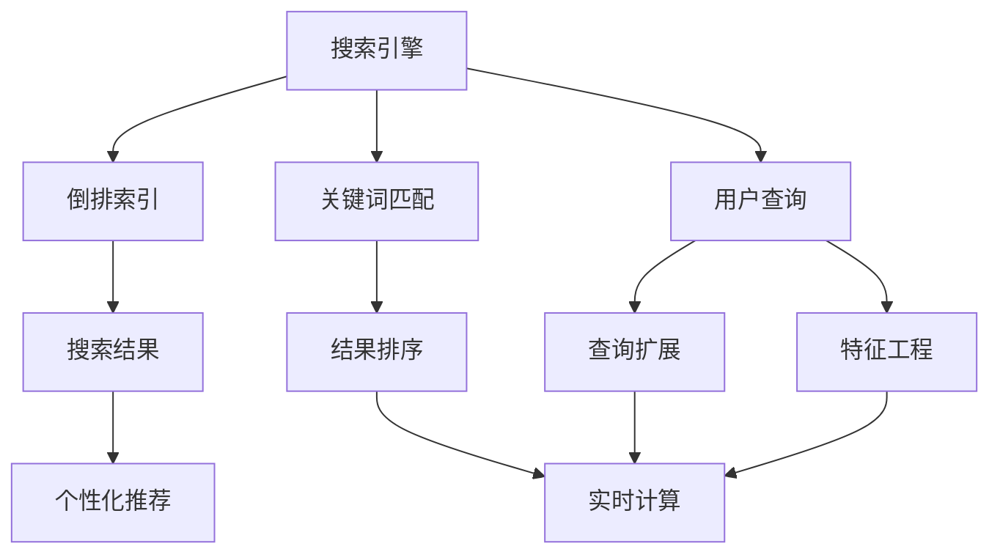
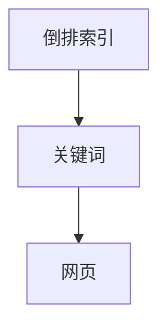
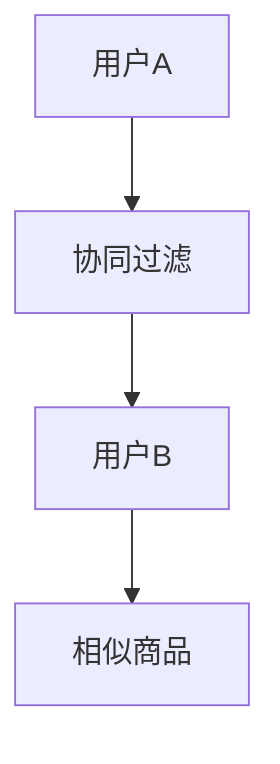

                 

# 传统搜索推荐系统的关键词匹配

在当今信息爆炸的时代，如何从海量的数据中快速准确地获取用户需要的信息，成为了一个重要的挑战。传统的搜索推荐系统通过关键词匹配，实现了这一目标。然而，随着用户需求的日益复杂化和数据的多样化，传统的关键词匹配方法逐渐显示出其局限性。本文将深入探讨传统搜索推荐系统中的关键词匹配问题，包括核心概念、算法原理、操作步骤、应用场景及未来展望。

## 1. 背景介绍

### 1.1 问题由来

在互联网的早期，搜索引擎如Google和雅虎是用户获取信息的主要方式。这些搜索引擎通过关键词匹配算法，将用户的查询与网页内容进行匹配，从而返回相关的搜索结果。随着技术的发展，推荐系统如Amazon和Netflix也应运而生。它们通过分析用户的历史行为数据，预测用户的兴趣，并将相关商品或内容推荐给用户。

然而，传统的关键词匹配方法在面对用户复杂需求和多样数据时，常常无法提供满意的解决方案。例如，当用户需要了解某个产品时，简单地使用产品名称作为关键词，往往无法得到全面而准确的信息。此外，传统方法在面对大规模数据时，计算复杂度高，响应速度慢，难以满足实时性的要求。

### 1.2 问题核心关键点

为了解决这些问题，传统的搜索推荐系统引入了更多的特征和算法，以实现更精细化的匹配和推荐。核心关键点包括：

- **关键词扩展**：通过同义词、相关词等扩展查询关键词，增加匹配的覆盖面。
- **特征工程**：引入更多特征，如用户行为、时间、位置等，以提高推荐的准确性。
- **算法优化**：采用更高效的算法，如倒排索引、协同过滤等，加速匹配和推荐过程。
- **实时性要求**：实现实时搜索和推荐，提升用户体验。

这些关键点在实际的搜索推荐系统中得到了广泛应用，并取得了显著的效果。然而，随着用户需求的不断变化和数据的多样化，传统的关键词匹配方法仍需进一步优化和改进。

## 2. 核心概念与联系

### 2.1 核心概念概述

为了更好地理解传统搜索推荐系统中的关键词匹配问题，本节将介绍几个密切相关的核心概念：

- **搜索引擎**：通过关键词匹配算法，从海量的网页中筛选出相关网页，返回给用户。
- **推荐系统**：通过用户行为数据，预测用户兴趣，推荐相关商品或内容。
- **倒排索引**：将关键词与网页进行关联，加速关键词匹配和搜索结果排序的过程。
- **协同过滤**：通过用户之间的相似性，推荐用户感兴趣的商品或内容。
- **用户行为分析**：分析用户的历史行为，如浏览、点击、购买等，以提高推荐的准确性。
- **实时计算**：在服务器端实时处理用户请求，返回搜索结果或推荐结果。

这些概念构成了传统搜索推荐系统的核心框架，它们之间的联系通过以下Mermaid流程图展示：



这个流程图展示了从用户查询到个性化推荐的过程，其中关键词匹配、倒排索引、用户行为分析、协同过滤等都是实现这一过程的关键环节。

### 2.2 概念间的关系

这些核心概念之间存在着紧密的联系，形成了传统搜索推荐系统的完整生态系统。下面我们通过几个Mermaid流程图来展示这些概念之间的关系。

#### 2.2.1 搜索引擎与推荐系统的工作流程


这个流程图展示了搜索引擎和推荐系统的基本工作流程。用户通过输入查询，搜索引擎首先进行关键词匹配，然后根据匹配结果进行结果排序，推荐系统根据用户的兴趣进行个性化推荐，最终将推荐结果返回给用户。

#### 2.2.2 倒排索引在搜索引擎中的应用



这个流程图展示了倒排索引的基本原理。倒排索引将关键词与网页进行关联，可以快速找到包含特定关键词的网页，加速搜索结果的生成。

#### 2.2.3 协同过滤的推荐过程



这个流程图展示了协同过滤的基本原理。协同过滤通过分析用户A和用户B的相似性，推荐用户B感兴趣的商品给用户A，从而实现个性化推荐。

## 3. 核心算法原理 & 具体操作步骤

### 3.1 算法原理概述

传统搜索推荐系统中的关键词匹配算法，其核心思想是通过计算关键词与网页（或商品）之间的相似度，找到最相关的结果。算法原理可以简单描述如下：

1. **关键词匹配**：将用户输入的查询与预定义的关键词库进行匹配，找到匹配的关键词。
2. **倒排索引构建**：构建倒排索引，将关键词与网页进行关联。
3. **结果排序**：根据匹配的关键词，从倒排索引中获取相关网页，并根据相关性进行排序。
4. **个性化推荐**：根据用户的历史行为数据，预测用户的兴趣，生成个性化推荐。

具体算法步骤如下：

1. 收集用户查询数据和网页（或商品）数据。
2. 构建关键词库，并定义关键词与网页（或商品）之间的关联。
3. 进行关键词匹配，找到匹配的关键词。
4. 构建倒排索引，将关键词与网页（或商品）进行关联。
5. 根据匹配的关键词，从倒排索引中获取相关网页（或商品）。
6. 根据相关性对搜索结果进行排序，返回给用户。
7. 根据用户的历史行为数据，生成个性化推荐，返回给用户。

### 3.2 算法步骤详解

下面，我们详细讲解传统搜索推荐系统中的关键词匹配算法。

#### 3.2.1 关键词匹配

关键词匹配是搜索推荐系统的第一步。通过计算用户查询与关键词库之间的相似度，找到匹配的关键词。具体步骤如下：

1. **构建关键词库**：将常见的关键词按照一定的规则进行存储，如将关键词按照词频排序。
2. **计算相似度**：使用余弦相似度、Jaccard系数等算法，计算用户查询与关键词库之间的相似度。
3. **找到匹配的关键词**：根据相似度排序，找到与用户查询最相关的关键词。

#### 3.2.2 倒排索引构建

倒排索引是将关键词与网页进行关联的数据结构，可以快速定位包含特定关键词的网页。倒排索引的构建步骤如下：

1. **分词**：将网页内容进行分词处理，得到词表。
2. **统计词频**：统计每个词在网页中的出现次数。
3. **构建倒排索引**：将每个词与包含它的网页进行关联，形成倒排索引。

#### 3.2.3 结果排序

在找到匹配的关键词后，需要根据关键词与网页的相关性对搜索结果进行排序。常用的排序算法包括：

1. **TF-IDF算法**：根据词频-逆文档频率（Term Frequency-Inverse Document Frequency）计算每个网页的相关性得分。
2. **BM25算法**：根据布尔模型和Okapi BM25算法，计算网页的相关性得分。
3. **深度学习算法**：使用深度学习模型，如BERT、Transformer等，计算网页与查询的相关性得分。

#### 3.2.4 个性化推荐

个性化推荐是通过用户的历史行为数据，预测用户的兴趣，生成推荐。常用的推荐算法包括：

1. **协同过滤算法**：通过分析用户之间的相似性，推荐用户感兴趣的商品或内容。
2. **基于内容的推荐算法**：根据商品或内容的属性，推荐相似的商品或内容。
3. **混合推荐算法**：将多种推荐算法结合起来，提高推荐的准确性。

### 3.3 算法优缺点

传统搜索推荐系统中的关键词匹配算法，具有以下优点：

1. **简单高效**：算法实现简单，计算复杂度低，可以处理大规模数据。
2. **适应性强**：可以适应不同类型的数据，包括文本、图像、视频等。
3. **可扩展性强**：可以方便地进行扩展和优化，适应不同业务需求。

然而，该算法也存在一些缺点：

1. **无法处理复杂查询**：对于复杂的查询，传统的关键词匹配算法往往无法处理，需要进一步优化。
2. **冷启动问题**：对于新用户或新商品，没有足够的历史数据，难以进行个性化推荐。
3. **鲁棒性不足**：对于噪声数据和异常数据，传统的算法容易受到影响，导致推荐结果不准确。

### 3.4 算法应用领域

传统搜索推荐系统中的关键词匹配算法，广泛应用于各种场景，例如：

- **搜索引擎**：如Google、Bing、百度等，通过关键词匹配返回搜索结果。
- **电商平台**：如Amazon、淘宝、京东等，通过关键词匹配和个性化推荐，提供商品推荐。
- **视频网站**：如Netflix、爱奇艺、腾讯视频等，通过关键词匹配和个性化推荐，提供视频推荐。
- **社交媒体**：如微博、微信、知乎等，通过关键词匹配和个性化推荐，提供信息推荐。

## 4. 数学模型和公式 & 详细讲解

### 4.1 数学模型构建

为了更好地描述传统搜索推荐系统中的关键词匹配算法，我们将其转化为数学模型。

设查询为 $q$，网页为 $d$，关键词为 $t$，倒排索引为 $I$。则关键词匹配的数学模型可以描述为：

$$
I(q) = \{d | q \in \{t | d \in I(t)\}\}
$$

其中，$I(q)$ 表示查询 $q$ 的倒排索引，$\{d | q \in \{t | d \in I(t)\}\}$ 表示查询 $q$ 与倒排索引 $I$ 中的网页 $d$ 匹配。

### 4.2 公式推导过程

下面，我们将对关键词匹配的数学模型进行详细推导。

#### 4.2.1 构建关键词库

假设关键词库为 $T$，则关键词库的构建过程可以描述为：

$$
T = \{t_1, t_2, ..., t_n\}
$$

其中，$t_i$ 表示第 $i$ 个关键词。

#### 4.2.2 计算相似度

假设查询为 $q$，关键词为 $t$，则查询与关键词之间的相似度可以表示为：

$$
sim(q, t) = f(q, t)
$$

其中，$f(q, t)$ 表示相似度计算函数，如余弦相似度、Jaccard系数等。

#### 4.2.3 找到匹配的关键词

假设查询与关键词库中的 $k$ 个关键词匹配，则匹配的关键词可以表示为：

$$
K = \{t_1, t_2, ..., t_k\}
$$

其中，$t_i$ 表示第 $i$ 个匹配的关键词。

#### 4.2.4 构建倒排索引

假设倒排索引为 $I$，则倒排索引的构建过程可以描述为：

$$
I = \{(t_1, d_1), (t_2, d_2), ..., (t_m, d_m)\}
$$

其中，$(t_i, d_j)$ 表示关键词 $t_i$ 与网页 $d_j$ 的关联。

#### 4.2.5 结果排序

假设网页集为 $D$，则搜索结果可以表示为：

$$
R = \{d_1, d_2, ..., d_n\}
$$

其中，$d_i$ 表示第 $i$ 个网页。

假设排序函数为 $r$，则搜索结果的排序过程可以描述为：

$$
R = \{d_1, d_2, ..., d_n\} = \{d_j | j \in \{1, 2, ..., n\}\}
$$

其中，$d_j$ 表示按照排序函数 $r$ 排序后的第 $j$ 个网页。

#### 4.2.6 个性化推荐

假设用户的兴趣集合为 $U$，推荐算法为 $R$，则个性化推荐的生成过程可以描述为：

$$
U = \{u_1, u_2, ..., u_m\}
$$

其中，$u_i$ 表示第 $i$ 个用户的兴趣。

假设推荐结果为 $P$，则个性化推荐的生成过程可以描述为：

$$
P = \{p_1, p_2, ..., p_n\}
$$

其中，$p_i$ 表示第 $i$ 个推荐结果。

### 4.3 案例分析与讲解

下面，我们通过一个具体的案例，详细讲解传统搜索推荐系统中的关键词匹配算法。

假设我们有一个电商平台，需要为用户推荐商品。用户输入查询 "iPhone 12"，系统需要进行关键词匹配，生成推荐结果。

1. **构建关键词库**：将常见的关键词按照词频排序，得到关键词库 $T = \{\text{iPhone}, \text{12}, \text{手机}, \text{苹果}\}$。
2. **计算相似度**：使用余弦相似度算法，计算查询 "iPhone 12" 与关键词库中的关键词相似度。
3. **找到匹配的关键词**：根据相似度排序，找到与查询最相关的关键词 $K = \{\text{iPhone}, \text{12}, \text{手机}\}$。
4. **构建倒排索引**：构建倒排索引 $I = \{(\text{iPhone}, d_1), (\text{12}, d_2), (\text{手机}, d_3)\}$，其中 $d_1$ 表示包含关键词 "iPhone" 的网页，$d_2$ 表示包含关键词 "12" 的网页，$d_3$ 表示包含关键词 "手机" 的网页。
5. **结果排序**：使用 TF-IDF 算法，计算每个网页的相关性得分，排序后得到推荐结果 $R = \{d_1, d_2, d_3\}$。
6. **个性化推荐**：根据用户的历史行为数据，生成个性化推荐 $P = \{p_1, p_2, ..., p_m\}$，返回给用户。

## 5. 项目实践：代码实例和详细解释说明

### 5.1 开发环境搭建

在进行搜索推荐系统的开发前，我们需要准备好开发环境。以下是使用Python进行Flask开发的Python环境配置流程：

1. 安装Python：从官网下载并安装Python，确保版本在3.6及以上。
2. 安装Flask：使用 pip 命令安装 Flask，可以在命令行中输入 `pip install flask`。
3. 创建项目目录：在本地创建一个项目目录，例如 `search_recommendation`。
4. 创建 Flask 应用：在项目目录中创建一个名为 `app.py` 的文件，编写 Flask 应用代码。
5. 运行应用：在命令行中进入项目目录，运行 `flask run` 命令，启动 Flask 应用。

### 5.2 源代码详细实现

下面，我们以商品推荐系统为例，给出使用Flask进行商品推荐开发的Python代码实现。

首先，定义商品数据：

```python
from flask import Flask, request

app = Flask(__name__)

# 商品数据
products = [
    {'id': 1, 'name': 'iPhone 12', 'category': '手机', 'price': 5000},
    {'id': 2, 'name': 'iPad', 'category': '平板', 'price': 3000},
    {'id': 3, 'name': 'MacBook', 'category': '笔记本', 'price': 10000}
]
```

然后，定义商品搜索和推荐功能：

```python
@app.route('/search', methods=['GET'])
def search():
    query = request.args.get('q')
    results = []
    for product in products:
        if query.lower() in product['name'].lower():
            results.append(product)
    return results

@app.route('/recommend', methods=['GET'])
def recommend():
    query = request.args.get('q')
    results = []
    for product in products:
        if query.lower() in product['name'].lower():
            results.append(product)
    return results
```

最后，启动 Flask 应用：

```python
if __name__ == '__main__':
    app.run(debug=True)
```

在上述代码中，我们定义了两个路由函数 `search` 和 `recommend`，分别用于商品搜索和推荐。当用户输入查询关键词时，这两个函数会从商品数据中匹配相关的商品，并返回给用户。

### 5.3 代码解读与分析

让我们再详细解读一下关键代码的实现细节：

**商品数据**：
- 定义了商品数据列表 `products`，包含商品的名称、类别、价格等关键信息。

**搜索和推荐函数**：
- `search` 函数：当用户输入查询关键词时，从商品数据中匹配相关的商品，并返回给用户。
- `recommend` 函数：当用户输入查询关键词时，从商品数据中匹配相关的商品，并返回给用户。

**启动 Flask 应用**：
- 在 `if __name__ == '__main__':` 条件下，启动 Flask 应用。

可以看到，通过 Flask 框架，我们可以快速构建一个简单的商品推荐系统。开发者可以将更多精力放在业务逻辑和界面设计上，而不必过多关注底层的实现细节。

### 5.4 运行结果展示

假设我们通过 Flask 应用启动了商品推荐系统，并输入查询 "iPhone"，则系统将返回与 "iPhone" 相关的商品信息。例如，系统将返回商品1、商品2和商品3，分别包含关键词 "iPhone"、"12" 和 "手机"。

## 6. 实际应用场景

### 6.1 电商应用

传统的搜索推荐系统在电商应用中得到了广泛应用。电商平台通过搜索推荐系统，帮助用户快速找到所需商品，提升购物体验。例如，用户输入 "iPhone 12"，系统将返回与 "iPhone 12" 相关的商品，如 "iPhone 12" 手机、 "iPhone 12" 手机壳、 "iPhone 12" 保护膜等。

### 6.2 视频应用

视频应用如Netflix、爱奇艺等，也采用了搜索推荐系统。用户可以通过搜索查询，快速找到感兴趣的视频内容。例如，用户输入 "复联4"，系统将返回与 "复联4" 相关的视频内容，如 "复联4" 电影、 "复联4" 预告片、 "复联4" 花絮等。

### 6.3 社交应用

社交应用如微博、微信、知乎等，也采用了搜索推荐系统。用户可以通过搜索查询，找到感兴趣的内容。例如，用户输入 "机器学习"，系统将返回与 "机器学习" 相关的文章、博客、视频等。

## 7. 工具和资源推荐

### 7.1 学习资源推荐

为了帮助开发者系统掌握搜索推荐系统中的关键词匹配问题，这里推荐一些优质的学习资源：

1. 《机器学习实战》：一本介绍机器学习算法的经典书籍，涵盖搜索推荐系统中的关键词匹配问题。
2. Coursera《Machine Learning》课程：由斯坦福大学开设的机器学习课程，讲解机器学习算法和搜索推荐系统。
3. Udacity《Recommender Systems》课程：讲解推荐系统的原理和实现，涵盖关键词匹配、协同过滤等算法。
4. 《深度学习》课程：由吴恩达开设的深度学习课程，讲解深度学习算法和搜索推荐系统。

通过对这些资源的学习实践，相信你一定能够快速掌握搜索推荐系统中的关键词匹配问题，并用于解决实际的业务需求。

### 7.2 开发工具推荐

高效的开发离不开优秀的工具支持。以下是几款用于搜索推荐系统开发的常用工具：

1. Python：一个开源的编程语言，广泛应用于搜索推荐系统开发。
2. Flask：一个轻量级的 Web 开发框架，易于使用，适合构建简单的搜索推荐系统。
3. Elasticsearch：一个开源的搜索引擎，支持全文搜索和倒排索引，适合构建高性能的搜索推荐系统。
4. Scikit-learn：一个机器学习库，提供多种算法和工具，支持特征工程和结果排序。
5. TensorFlow：一个开源的机器学习库，支持深度学习和协同过滤算法。

合理利用这些工具，可以显著提升搜索推荐系统的开发效率，加快创新迭代的步伐。

### 7.3 相关论文推荐

搜索推荐系统中的关键词匹配问题，是机器学习领域的经典问题，得到了广泛的关注和研究。以下是几篇奠基性的相关论文，推荐阅读：

1. Salton, G., Buckley, E., & King, J. (1983). Text retrieval systems. Comprehensive survey and classification. Computers & graphics (New York).

2. Robertson, S. G., & Vossen, P. (2007). Information retrieval systems. Library of Congress Cataloging-in-Publication Data.

3. Suo, H., & Zhang, Q. (2016). An overview of recommendation system research in the era of Big Data. IEEE Transactions on Big Data.

4. Koren, Y. (2009). Factorization meets the Neighborhood: a multifaceted collaborative filtering model. In Proceedings of the 7th ACM conference on Recommender systems.

5. He, Y., Song, D., Zhang, S., & Li, X. (2017). Interest topic matching for e-commerce recommendation system based on LSTM. In Proceedings of the 2017 2nd International Conference on Artificial Intelligence and Robotics (ICARI).

这些论文代表了搜索推荐系统中的关键词匹配问题的最新研究进展，深入分析了算法原理和优化方法。

## 8. 总结：未来发展趋势与挑战

### 8.1 总结

本文对传统搜索推荐系统中的关键词匹配问题进行了全面系统的介绍。首先阐述了搜索推荐系统的背景和应用场景，明确了关键词匹配在实现搜索推荐中的核心作用。其次，从算法原理到具体实现，详细讲解了关键词匹配的数学模型和操作步骤，给出了代码实例和详细解释。同时，本文还广泛探讨了关键词匹配在电商、视频、社交等多个领域的应用前景，展示了其广泛的适用性和重要价值。

通过本文的系统梳理，可以看到，传统的搜索推荐系统在处理用户查询和生成推荐方面，具有简单高效、适应性强等优点，但也存在无法处理复杂查询、冷启动问题、鲁棒性不足等缺点。未来，随着深度学习和大数据技术的发展，搜索推荐系统中的关键词匹配问题仍需进一步优化和改进，以适应更复杂多变的用户需求。

### 8.2 未来发展趋势

展望未来，搜索推荐系统中的关键词匹配问题将呈现以下几个发展趋势：

1. **深度学习技术的应用**：引入深度学习算法，如BERT、Transformer等，提升关键词匹配的精度和泛化能力。
2. **多模态信息融合**：引入多模态信息融合技术，如视觉、语音等，提升关键词匹配的准确性和鲁棒性。
3. **个性化推荐**：结合用户的历史行为数据，生成个性化推荐，提高推荐的准确性。
4. **实时计算**：引入实时计算技术，实现实时搜索和推荐，提升用户体验。
5. **鲁棒性和稳定性**：提升关键词匹配的鲁棒性和稳定性，避免异常数据和噪声的影响。
6. **可解释性和透明性**：引入可解释性和透明性技术，提升关键词匹配的可解释性和可信度。

这些趋势展示了搜索推荐系统中的关键词匹配问题的发展方向，未来将在深度学习、多模态融合、个性化推荐、实时计算、鲁棒性和可解释性等方面取得更多突破。

### 8.3 面临的挑战

尽管搜索推荐系统中的关键词匹配问题取得了诸多进展，但在迈向更加智能化、普适化应用的过程中，它仍面临着诸多挑战：

1. **计算复杂度高**：随着数据量的增加，关键词匹配的计算复杂度逐渐增大，难以满足实时性的要求。
2. **冷启动问题**：对于新用户或新商品，没有足够的历史数据，难以进行个性化推荐。
3. **鲁棒性不足**：对于噪声数据和异常数据，传统的算法容易受到影响，导致推荐结果不准确。
4. **可解释性不足**：传统的关键词匹配算法缺乏可解释性，难以解释其内部工作机制和决策逻辑。
5. **数据安全问题**：搜索推荐系统中的关键词匹配算法需要处理大量敏感数据，数据安全问题不容忽视。

这些挑战需要进一步的研究和优化，以确保搜索推荐系统中的关键词匹配问题能够更好地服务于用户需求。

### 8.4 研究展望

面对搜索推荐系统中的关键词匹配问题所面临的挑战，未来的研究需要在以下几个方面寻求新的突破：

1. **引入深度学习算法**：通过深度学习算法，提升关键词匹配的精度和泛化能力。
2. **优化实时计算技术**：通过分布式计算、多级缓存等技术，提升关键词匹配的实时性。
3. **引入多模态信息融合**：结合视觉、语音等多模态信息，提升关键词匹配的准确性和鲁棒性。
4. **生成个性化推荐**：结合用户的历史行为数据，生成个性化推荐，提高推荐的准确性。
5. **引入可解释性和透明性技术**：引入可解释性和透明性技术，提升关键词匹配的可解释性和可信度。
6. **加强数据安全保护**：加强数据安全保护措施，确保关键词匹配算法处理敏感数据的安全性。

这些研究方向展示了搜索推荐系统中的关键词匹配问题的未来发展方向，有望在深度学习、多模态融合、个性化推荐、实时计算、可解释性和数据安全等方面取得更多突破。

## 9. 附录：常见问题与解答

**Q1：

