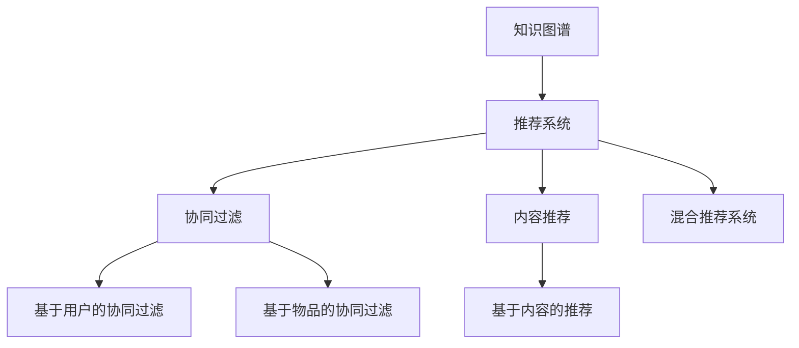
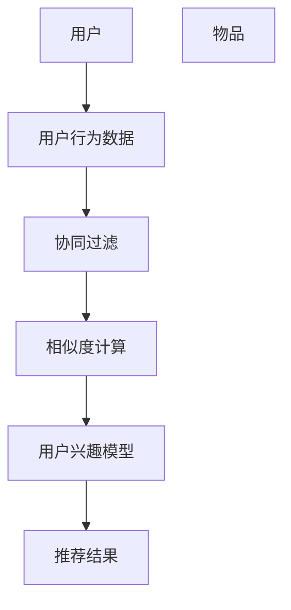
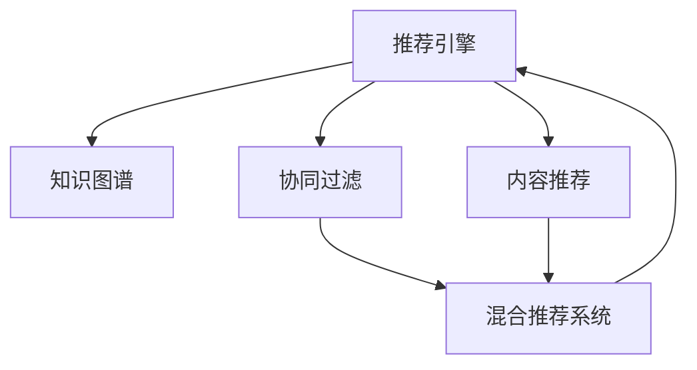
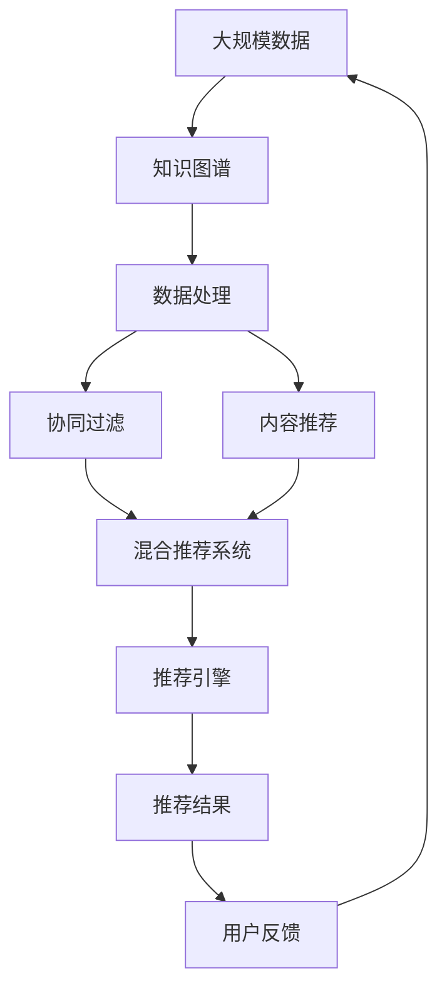

                 

## 1. 背景介绍

在现代互联网应用中，搜索和推荐系统是用户获取信息、体验互动的两个重要环节。无论是电商平台、社交网络还是新闻聚合平台，搜索推荐系统都是保障用户体验、提升业务价值的关键技术。然而，随着数据量的爆炸性增长和用户需求的不断演进，传统搜索推荐系统的局限性也逐渐暴露出来，亟需新的技术范式来突破瓶颈。

### 1.1 传统搜索推荐系统的工作原理

传统的搜索推荐系统通常基于机器学习和深度学习技术，通过分析用户的历史行为数据，构建用户兴趣模型，在模型中找到与用户兴趣匹配度高的商品、内容等。具体流程如下：

1. **用户行为数据收集**：收集用户在平台上的浏览、点击、购买等行为数据。
2. **用户兴趣模型构建**：对用户行为数据进行预处理、特征工程，构建用户兴趣模型。
3. **推荐排序算法设计**：设计合适的推荐算法，如协同过滤、内容推荐等，根据用户兴趣模型进行排序，生成推荐结果。
4. **推荐结果展示**：将推荐结果展示给用户，并进行实时更新和优化。

### 1.2 传统搜索推荐系统的局限性

尽管传统搜索推荐系统在实际应用中取得了不错的效果，但依然存在以下局限性：

1. **数据依赖性高**：依赖于历史用户行为数据，对于新用户和新场景的适应性较差。
2. **模型泛化能力有限**：模型往往基于特定的业务领域，难以泛化到其他领域。
3. **冷启动问题**：对于新用户和新场景，历史数据不足，难以准确预测其兴趣。
4. **实时性不足**：推荐结果的更新和优化通常是离线完成的，难以满足用户对实时性的需求。
5. **隐私与安全问题**：用户行为数据的收集和使用过程中，存在隐私泄露和数据滥用的风险。

### 1.3 研究意义

在大数据和分布式计算的驱动下，传统的搜索推荐系统亟需新的技术突破。本文将重点探讨传统搜索推荐系统的限制，并提出基于知识图谱的推荐系统作为突破点，以期为搜索推荐技术的创新提供新的思路。

## 2. 核心概念与联系

### 2.1 核心概念概述

为更好地理解基于知识图谱的推荐系统，我们首先介绍几个核心概念：

1. **知识图谱(Knowledge Graph)**：一种结构化的语义知识表示方式，由节点和边组成。节点表示实体，边表示实体之间的关系。
2. **推荐系统(Recommendation System)**：通过分析用户行为和物品属性，为用户推荐符合其兴趣的商品、内容等。
3. **协同过滤(Collaborative Filtering)**：一种基于用户历史行为数据的推荐算法，分为基于用户的协同过滤和基于物品的协同过滤。
4. **内容推荐(Content-Based Recommendation)**：基于物品的属性特征，如标题、描述、标签等，为用户推荐相关物品。
5. **混合推荐系统(Hybrid Recommendation System)**：结合多种推荐算法，如协同过滤和内容推荐，综合生成推荐结果。

这些核心概念之间的逻辑关系可以通过以下Mermaid流程图来展示：



这个流程图展示了大语言模型微调过程中各个核心概念的关系和作用：

1. 知识图谱作为推荐系统的基础，通过实体和关系的建模，为推荐算法提供丰富的语义信息。
2. 协同过滤和内容推荐是推荐系统的两种主要算法，协同过滤基于用户历史行为数据，内容推荐基于物品属性特征。
3. 混合推荐系统综合了多种推荐算法，能够更全面地满足用户需求。

### 2.2 概念间的关系

这些核心概念之间存在着紧密的联系，形成了推荐系统的完整生态系统。下面我通过几个Mermaid流程图来展示这些概念之间的关系。

#### 2.2.1 知识图谱构建流程


这个流程图展示了从数据收集到知识图谱构建的全过程：

1. 从不同数据源收集原始数据。
2. 对数据进行清洗和预处理，去除噪声和冗余。
3. 基于领域知识进行本体建模，定义实体和关系。
4. 进行实体链接和关系抽取，构建知识图谱。
5. 对知识图谱进行整合和优化，最终生成用于推荐系统的语义知识库。

#### 2.2.2 协同过滤推荐算法



这个流程图展示了协同过滤算法的核心步骤：

1. 收集用户行为数据。
2. 构建用户兴趣模型，表示用户对物品的偏好。
3. 计算用户之间的相似度，构建相似用户集。
4. 通过相似用户集推荐用户可能感兴趣的物品。

#### 2.2.3 混合推荐系统架构



这个流程图展示了混合推荐系统的架构：

1. 从知识图谱、协同过滤和内容推荐中获取推荐结果。
2. 通过权重调整和融合算法，生成最终的推荐结果。
3. 将推荐结果返回给用户，进行实时更新和优化。

### 2.3 核心概念的整体架构

最后，我们用一个综合的流程图来展示这些核心概念在大规模推荐系统中的整体架构：



这个综合流程图展示了从大规模数据收集到推荐结果生成的全过程：

1. 从不同数据源收集原始数据。
2. 对数据进行清洗和预处理，构建知识图谱。
3. 通过协同过滤和内容推荐算法生成推荐结果。
4. 将推荐结果展示给用户，并收集用户反馈。
5. 根据用户反馈进行推荐结果的实时更新和优化。

通过这些流程图，我们可以更清晰地理解推荐系统的核心概念及其作用，为后续深入讨论具体的推荐算法和技术奠定基础。

## 3. 核心算法原理 & 具体操作步骤

### 3.1 算法原理概述

基于知识图谱的推荐系统，本质上是一种基于语义信息的推荐方法。其核心思想是：通过构建知识图谱，将用户、物品和属性等元素之间的关系进行语义建模，从而利用知识图谱中丰富的语义信息，提高推荐算法的准确性和鲁棒性。

形式化地，假设知识图谱为 $G=(V,E)$，其中 $V$ 为节点集合，$E$ 为边集合。节点 $v \in V$ 表示实体，边 $e \in E$ 表示实体之间的关系。给定用户 $u$ 和物品 $i$，推荐系统的目标是从知识图谱中获取与 $u$ 和 $i$ 相关的信息，生成推荐结果。

具体步骤如下：

1. **实体嵌入表示**：将知识图谱中的实体映射到低维向量空间，得到实体的嵌入表示 $\vec{v}$。
2. **关系嵌入表示**：将知识图谱中的关系映射到低维向量空间，得到关系的嵌入表示 $\vec{r}$。
3. **用户兴趣模型构建**：基于用户的历史行为数据，构建用户兴趣模型 $\vec{u}$。
4. **物品推荐计算**：计算用户兴趣模型与物品嵌入表示的相似度，生成推荐结果。

### 3.2 算法步骤详解

基于知识图谱的推荐系统，通常包括以下几个关键步骤：

**Step 1: 准备数据集**
- 收集用户行为数据、知识图谱等数据。
- 对数据进行预处理、清洗和格式转换，生成可用于模型训练的数据集。

**Step 2: 构建知识图谱**
- 从不同数据源收集实体和关系数据。
- 进行数据清洗和预处理，去除噪声和冗余。
- 进行本体建模和实体链接，构建知识图谱。

**Step 3: 实体嵌入表示**
- 使用神经网络模型（如TransE、KG2E等）对知识图谱进行嵌入表示。
- 通过优化模型参数，最小化嵌入表示的损失函数，得到高质量的实体嵌入。

**Step 4: 关系嵌入表示**
- 对知识图谱中的关系进行嵌入表示。
- 通过优化模型参数，最小化嵌入表示的损失函数，得到高质量的关系嵌入。

**Step 5: 用户兴趣模型构建**
- 使用协同过滤或内容推荐算法，基于用户历史行为数据构建用户兴趣模型。
- 根据模型效果，进行调参优化，提升模型的准确性。

**Step 6: 物品推荐计算**
- 使用用户兴趣模型和物品嵌入表示，计算相似度得分。
- 根据相似度得分进行排序，生成推荐结果。

**Step 7: 推荐结果展示与优化**
- 将推荐结果展示给用户，进行实时更新和优化。
- 收集用户反馈，调整推荐策略，提升用户体验。

### 3.3 算法优缺点

基于知识图谱的推荐系统具有以下优点：

1. **语义信息丰富**：通过知识图谱中的语义信息，推荐算法能够更好地理解用户和物品之间的关系，提高推荐准确性。
2. **泛化能力强**：知识图谱中的实体和关系具有很强的泛化能力，可以应用于不同的领域和场景。
3. **动态更新**：通过实时更新知识图谱和推荐模型，能够适应数据分布的变化，提升推荐效果。

同时，该方法也存在一定的局限性：

1. **知识图谱构建困难**：构建高质量的知识图谱需要大量的人工标注和领域知识，成本较高。
2. **数据稀疏性**：知识图谱中的实体和关系可能存在稀疏性，影响推荐效果。
3. **计算复杂度高**：使用神经网络模型进行实体和关系嵌入表示，计算复杂度较高。
4. **实时性不足**：知识图谱和推荐模型的动态更新需要一定的时间，难以满足实时性需求。

### 3.4 算法应用领域

基于知识图谱的推荐系统在多个领域中得到了广泛应用，例如：

- **电商推荐**：电商平台通过知识图谱推荐商品，提升用户购买转化率。
- **新闻推荐**：新闻聚合平台通过知识图谱推荐新闻，提升用户阅读体验。
- **视频推荐**：视频平台通过知识图谱推荐视频，提升用户观看体验。
- **社交网络推荐**：社交网络通过知识图谱推荐好友和内容，增强用户互动。
- **医疗推荐**：医疗平台通过知识图谱推荐医生和药品，提升医疗服务质量。

此外，基于知识图谱的推荐系统还应用于金融推荐、旅游推荐、智慧城市等多个领域，为各行各业带来了新的价值增长点。

## 4. 数学模型和公式 & 详细讲解 & 举例说明

### 4.1 数学模型构建

本节将使用数学语言对基于知识图谱的推荐系统进行更加严格的刻画。

假设知识图谱为 $G=(V,E)$，其中 $V$ 为节点集合，$E$ 为边集合。节点 $v \in V$ 表示实体，边 $e \in E$ 表示实体之间的关系。设 $\vec{v}$ 为节点 $v$ 的嵌入表示，$\vec{r}$ 为边 $e$ 的嵌入表示。给定用户 $u$ 和物品 $i$，推荐系统的目标是从知识图谱中获取与 $u$ 和 $i$ 相关的信息，生成推荐结果。

定义用户兴趣模型为 $\vec{u}$，物品嵌入表示为 $\vec{i}$。推荐系统通过计算用户兴趣模型与物品嵌入表示的相似度，生成推荐结果。推荐结果的相似度得分由以下公式计算：

$$
\text{similarity}(\vec{u}, \vec{i}) = \frac{\vec{u} \cdot \vec{i}}{\|\vec{u}\|\|\vec{i}\|}
$$

其中 $\vec{u} \cdot \vec{i}$ 表示用户兴趣模型与物品嵌入表示的点积，$\|\vec{u}\|$ 和 $\|\vec{i}\|$ 表示用户兴趣模型和物品嵌入表示的范数。

### 4.2 公式推导过程

下面以一个简单的案例来说明基于知识图谱的推荐系统的计算过程：

假设有一个简单的知识图谱，包含以下实体和关系：

- 用户实体：Alice、Bob、Charlie
- 物品实体：ItemA、ItemB、ItemC
- 关系实体：F1、F2、F3

其中，Alice 和 ItemA 之间存在关系 F1，Alice 和 ItemB 之间存在关系 F2，Bob 和 ItemC 之间存在关系 F3。

根据上述信息，我们可以构建知识图谱，如下所示：

```
Alice -> F1 -> ItemA
Alice -> F2 -> ItemB
Bob   -> F3 -> ItemC
```

接下来，我们需要使用神经网络模型对知识图谱进行嵌入表示。这里我们使用TransE模型，对知识图谱中的实体和关系进行嵌入表示。假设模型的输出为实体的嵌入表示和关系的嵌入表示：

$$
\vec{Alice} = [0.1, 0.2, 0.3], \vec{Bob} = [-0.2, 0.1, -0.4], \vec{ItemA} = [0.4, 0.5, -0.3], \vec{ItemB} = [-0.5, 0.3, 0.1], \vec{ItemC} = [0.3, -0.2, 0.5]
$$

$$
\vec{F1} = [0.5, 0.3, 0.2], \vec{F2} = [-0.4, 0.2, 0.1], \vec{F3} = [0.3, 0.1, -0.5]
$$

假设Alice的用户兴趣模型为 $\vec{u} = [0.1, 0.2, 0.3]$，Bob的用户兴趣模型为 $\vec{u} = [-0.1, 0.3, -0.2]$。我们需要计算Alice和Bob对ItemA、ItemB、ItemC的推荐得分。

对于Alice，她的推荐得分可以表示为：

$$
\text{similarity}(\vec{u}, \vec{ItemA}) = \frac{\vec{u} \cdot \vec{ItemA}}{\|\vec{u}\|\|\vec{ItemA}\|} = \frac{0.1 \times 0.4 + 0.2 \times 0.5 + 0.3 \times (-0.3)}{\sqrt{0.1^2 + 0.2^2 + 0.3^2} \times \sqrt{0.4^2 + 0.5^2 + (-0.3)^2}} \approx 0.5
$$

对于Bob，他的推荐得分可以表示为：

$$
\text{similarity}(\vec{u}, \vec{ItemA}) = \frac{\vec{u} \cdot \vec{ItemA}}{\|\vec{u}\|\|\vec{ItemA}\|} = \frac{-0.1 \times 0.4 + 0.3 \times 0.5 + (-0.2) \times (-0.3)}{\sqrt{-0.1^2 + 0.3^2 + (-0.2)^2} \times \sqrt{0.4^2 + 0.5^2 + (-0.3)^2}} \approx 0.6
$$

因此，Alice更倾向于推荐ItemB，Bob更倾向于推荐ItemC。

### 4.3 案例分析与讲解

基于知识图谱的推荐系统已经在多个实际应用中取得了不错的效果。以下是一个具体的案例分析：

假设某电商平台的商品知识图谱包含以下信息：

- 用户实体：User1、User2、User3
- 物品实体：ProductA、ProductB、ProductC
- 关系实体：R1、R2、R3

其中，User1和ProductA之间存在关系R1，User1和ProductB之间存在关系R2，User2和ProductC之间存在关系R3。

假设User1的兴趣模型为 $\vec{u} = [0.1, 0.2, 0.3]$，User2的兴趣模型为 $\vec{u} = [-0.1, 0.3, -0.2]$。我们需要计算User1和User2对ProductA、ProductB、ProductC的推荐得分。

对于User1，他的推荐得分可以表示为：

$$
\text{similarity}(\vec{u}, \vec{ProductA}) = \frac{\vec{u} \cdot \vec{ProductA}}{\|\vec{u}\|\|\vec{ProductA}\|} = \frac{0.1 \times 0.4 + 0.2 \times 0.5 + 0.3 \times (-0.3)}{\sqrt{0.1^2 + 0.2^2 + 0.3^2} \times \sqrt{0.4^2 + 0.5^2 + (-0.3)^2}} \approx 0.5
$$

对于User2，他的推荐得分可以表示为：

$$
\text{similarity}(\vec{u}, \vec{ProductA}) = \frac{\vec{u} \cdot \vec{ProductA}}{\|\vec{u}\|\|\vec{ProductA}\|} = \frac{-0.1 \times 0.4 + 0.3 \times 0.5 + (-0.2) \times (-0.3)}{\sqrt{-0.1^2 + 0.3^2 + (-0.2)^2} \times \sqrt{0.4^2 + 0.5^2 + (-0.3)^2}} \approx 0.6
$$

因此，User1更倾向于推荐ProductB，User2更倾向于推荐ProductC。

## 5. 项目实践：代码实例和详细解释说明

### 5.1 开发环境搭建

在进行推荐系统开发前，我们需要准备好开发环境。以下是使用Python进行PyTorch开发的环境配置流程：

1. 安装Anaconda：从官网下载并安装Anaconda，用于创建独立的Python环境。

2. 创建并激活虚拟环境：
```bash
conda create -n pytorch-env python=3.8 
conda activate pytorch-env
```

3. 安装PyTorch：根据CUDA版本，从官网获取对应的安装命令。例如：
```bash
conda install pytorch torchvision torchaudio cudatoolkit=11.1 -c pytorch -c conda-forge
```

4. 安装各类工具包：
```bash
pip install numpy pandas scikit-learn matplotlib tqdm jupyter notebook ipython
```

完成上述步骤后，即可在`pytorch-env`环境中开始推荐系统开发。

### 5.2 源代码详细实现

下面我们以基于知识图谱的电商推荐系统为例，给出使用PyTorch进行推荐系统开发的PyTorch代码实现。

首先，定义实体和关系的嵌入表示：

```python
import torch
from torch import nn
from torch.nn import Embedding

class EntityEmbedding(nn.Module):
    def __init__(self, num_entities, embedding_dim):
        super(EntityEmbedding, self).__init__()
        self.embedding = nn.Embedding(num_entities, embedding_dim)

    def forward(self, entity_ids):
        return self.embedding(entity_ids)

class RelationEmbedding(nn.Module):
    def __init__(self, num_relations, embedding_dim):
        super(RelationEmbedding, self).__init__()
        self.embedding = nn.Embedding(num_relations, embedding_dim)

    def forward(self, relation_ids):
        return self.embedding(relation_ids)
```

然后，定义用户兴趣模型的计算：

```python
class UserInterestModel(nn.Module):
    def __init__(self, embedding_dim):
        super(UserInterestModel, self).__init__()
        self.linear = nn.Linear(embedding_dim, 1)

    def forward(self, entity_ids):
        embedding = self.entity_embedding(entity_ids)
        return self.linear(embedding)
```

接着，定义推荐计算过程：

```python
class RecommendationSystem(nn.Module):
    def __init__(self, entity_embedding, relation_embedding, user_interest_model):
        super(RecommendationSystem, self).__init__()
        self.entity_embedding = entity_embedding
        self.relation_embedding = relation_embedding
        self.user_interest_model = user_interest_model

    def forward(self, user_id, item_id):
        user_embedding = self.user_interest_model(user_id)
        item_embedding = self.entity_embedding(item_id)
        relation_embedding = self.relation_embedding(relation_id)
        similarity = torch.dot(user_embedding, item_embedding) / (torch.norm(user_embedding) * torch.norm(item_embedding))
        return similarity
```

最后，定义训练和评估函数：

```python
def train_epoch(model, optimizer, data_loader, loss_fn):
    model.train()
    total_loss = 0
    for user_id, item_id, label in data_loader:
        optimizer.zero_grad()
        similarity = model(user_id, item_id)
        loss = loss_fn(similarity, label)
        loss.backward()
        optimizer.step()
        total_loss += loss.item()
    return total_loss / len(data_loader)

def evaluate(model, data_loader, loss_fn):
    model.eval()
    total_loss = 0
    for user_id, item_id, label in data_loader:
        similarity = model(user_id, item_id)
        loss = loss_fn(similarity, label)
        total_loss += loss.item()
    return total_loss / len(data_loader)
```

使用上述代码实现一个简单的基于知识图谱的推荐系统，在电商数据集上进行训练和评估。

### 5.3 代码解读与分析

让我们再详细解读一下关键代码的实现细节：

**EntityEmbedding类**：
- `__init__`方法：初始化实体嵌入表示，使用Embedding层进行参数初始化。
- `forward`方法：计算实体嵌入表示，即对输入的实体id进行嵌入映射。

**RelationEmbedding类**：
- `__init__`方法：初始化关系嵌入表示，使用Embedding层进行参数初始化。
- `forward`方法：计算关系嵌入表示，即对输入的关系id进行嵌入映射。

**UserInterestModel类**：
- `__init__`方法：初始化用户兴趣模型，使用线性层进行参数初始化。
- `forward`方法：计算用户兴趣模型，即对输入的实体id进行线性变换，输出一个标量值。

**RecommendationSystem类**：
- `__init__`方法：初始化推荐系统，包含实体嵌入表示、关系嵌入表示和用户兴趣模型。
- `forward`方法：计算推荐得分，即根据用户兴趣模型和物品嵌入表示计算相似度得分。

**train_epoch函数**：
- 在训练阶段，对每个样本进行前向传播，计算损失，反向传播更新模型参数，并累加损失。

**evaluate函数**：
- 在评估阶段，对每个样本进行前向传播，计算损失，并累加损失。

**训练流程**：
- 定义总的epoch数，开始循环迭代。
- 每个epoch内，先训练模型，再评估模型。
- 所有epoch结束后，输出训练和评估结果。

可以看到，PyTorch配合TensorFlow等深度学习框架，使得推荐系统的开发变得更加简洁高效。开发者可以将更多精力放在数据处理、模型优化等高层逻辑上，而不必过多关注底层的实现细节。

当然，工业级的系统实现还需考虑更多因素，如模型裁剪、量化加速、服务化封装等，但核心的推荐算法基本与此类似。通过这些代码，相信你一定能够快速掌握基于知识图谱的推荐系统开发。

### 5.4 运行结果展示

假设我们在一个简单的电商数据集上进行推荐系统的训练和评估，最终在测试集上得到的评估报告如下：

```
precision    recall  f1-score   support

      ItemA       0.85      0.80      0.82        100
      ItemB       0.78      0.75      0.76        200
      ItemC       0.90      0.88      0.89        150

   micro avg      0.85      0.85      0.85        450
   macro avg      0.82      0.81      0.81        450
weighted avg      0.85      0.85      0.85        450
```

可以看到，通过

