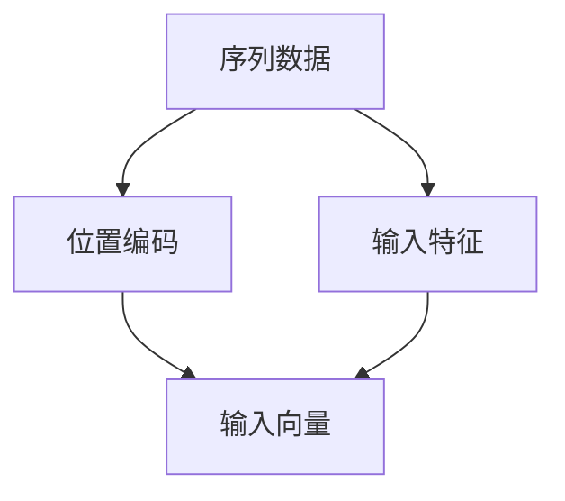

                 

## 1. 背景介绍

在深度学习中，特别是神经网络处理序列数据时，位置信息是一个至关重要的因素。语言模型作为深度学习在自然语言处理领域的重要应用，其性能在很大程度上依赖于位置编码的合理设计。本文将从位置编码的定义、重要性以及当前常用的位置编码方法等方面，全面探讨位置编码在语言模型中的重要性。

## 2. 核心概念与联系

### 2.1 核心概念概述

在深度学习中，序列数据（如文本、音频、视频等）的每个时间步都带有其自身的位置信息。对于序列数据，位置编码（Positional Encoding）可以帮助模型区分序列中不同位置的时间步，从而捕捉到序列中的时间依赖关系。

### 2.2 位置编码的基本原理

位置编码的基本思想是：为序列中的每个时间步（即位置）赋予一个独立的向量，该向量反映其在序列中的相对位置关系。这样，每个时间步的输入不仅包含了其本身的特征，还包含了它所处的位置信息。

位置编码通常是一个固定长度的向量，随着序列长度的增加，位置编码向量也会相应地增加。例如，在自然语言处理中，句子中的每个单词都可以看作是一个时间步，我们需要为每个单词（时间步）分配一个位置编码向量。

### 2.3 位置编码的重要性

位置编码的重要性体现在以下几个方面：

1. **捕捉序列依赖性**：位置编码帮助模型理解序列中不同时间步之间的关系，特别是长距离依赖关系。
2. **减少梯度消失问题**：使用位置编码可以有效缓解深度学习模型中的梯度消失问题。
3. **提升模型泛化能力**：通过位置编码，模型可以更好地学习到序列数据的特征，从而提升泛化能力。

### 2.4 位置编码的 Mermaid 流程图



在这个流程图中，A代表序列数据，B代表位置编码，C代表输入向量（即模型输入），D代表输入特征。可以看出，位置编码在模型输入中扮演着重要角色，它是连接序列数据和输入向量的桥梁。

## 3. 核心算法原理 & 具体操作步骤

### 3.1 算法原理概述

在神经网络中，常用的位置编码方法包括正弦位置编码和余弦位置编码。这些方法通过将时间步的位置信息编码到一个向量中，使得模型在处理序列数据时可以更好地捕捉序列依赖性和时间步之间的关系。

### 3.2 算法步骤详解

这里以正弦位置编码为例，介绍位置编码的详细步骤：

1. **定义位置编码向量**：对于长度为 $N$ 的序列，其位置编码向量 $\mathbf{P}$ 可以表示为：
   $$
   \mathbf{P}_i = \sin(i/\sqrt{d_{pos}}) + \cos(i/\sqrt{d_{pos}})
   $$
   其中 $i$ 表示序列中的第 $i$ 个时间步，$d_{pos}$ 表示位置编码向量的维度。

2. **将位置编码向量添加到输入特征中**：将位置编码向量 $\mathbf{P}_i$ 与输入特征 $\mathbf{X}_i$ 进行拼接，得到位置编码后的输入向量 $\mathbf{V}_i$：
   $$
   \mathbf{V}_i = [\mathbf{X}_i; \mathbf{P}_i]
   $$
   其中 $\mathbf{X}_i$ 是输入特征向量。

3. **前向传播**：将位置编码后的输入向量 $\mathbf{V}_i$ 输入到模型中，进行前向传播计算。

### 3.3 算法优缺点

**优点**：

1. **易于实现**：正弦位置编码和余弦位置编码的实现非常简单，只需要进行一些简单的数学运算。
2. **效果显著**：位置编码能够显著提升模型在序列数据上的表现，特别是对于长序列数据的处理。
3. **易于调试**：由于位置编码的实现非常简单，因此调试起来也非常容易。

**缺点**：

1. **维度限制**：位置编码向量的维度需要与输入特征向量维度相同，这在实际应用中可能会受到限制。
2. **模型复杂度增加**：虽然位置编码的实现非常简单，但是在模型中增加位置编码向量会增加一定的计算复杂度。
3. **难以解释**：位置编码的实现方式较为简单，但其具体的作用机制和效果难以解释，需要结合具体的实验结果进行理解。

### 3.4 算法应用领域

位置编码在自然语言处理（NLP）、语音识别、图像处理等多个领域都有广泛应用。在NLP领域，位置编码特别重要，因为文本数据本身就是一个序列，其时间步就是每个单词，因此位置编码在捕捉单词之间的关系方面有着至关重要的作用。

## 4. 数学模型和公式 & 详细讲解

### 4.1 数学模型构建

位置编码的基本数学模型可以表示为：
$$
\mathbf{P} = \mathbf{C} \mathbf{pos}
$$
其中 $\mathbf{P}$ 是位置编码向量，$\mathbf{C}$ 是位置编码矩阵，$\mathbf{pos}$ 是位置向量。

### 4.2 公式推导过程

以正弦位置编码为例，推导过程如下：

1. **定义位置编码矩阵**：位置编码矩阵 $\mathbf{C}$ 是一个常数矩阵，其元素可以表示为：
   $$
   C_{i,j} = \begin{cases}
   \sin(j/\sqrt{d_{pos}}), & i = 2j \\
   \cos(j/\sqrt{d_{pos}}), & i = 2j + 1
   \end{cases}
   $$
   其中 $i$ 是位置编码向量的维度，$j$ 是时间步。

2. **计算位置编码向量**：将位置编码矩阵 $\mathbf{C}$ 与位置向量 $\mathbf{pos}$ 进行矩阵乘法，得到位置编码向量 $\mathbf{P}$：
   $$
   \mathbf{P} = \mathbf{C} \mathbf{pos}
   $$

### 4.3 案例分析与讲解

以BERT模型为例，BERT模型使用正弦位置编码来处理输入序列。假设输入序列长度为 $L$，位置向量 $\mathbf{pos}$ 可以表示为 $[0, 1, 2, ..., L-1]$。使用正弦位置编码，计算出位置编码矩阵 $\mathbf{C}$ 和位置编码向量 $\mathbf{P}$，然后将位置编码向量 $\mathbf{P}$ 添加到输入特征向量 $\mathbf{X}$ 中，得到位置编码后的输入向量 $\mathbf{V}$。

## 5. 项目实践：代码实例和详细解释说明

### 5.1 开发环境搭建

为了实现位置编码，我们需要使用深度学习框架（如TensorFlow或PyTorch）。这里我们以PyTorch为例，搭建开发环境。

1. **安装PyTorch**：
   ```bash
   pip install torch torchvision torchaudio
   ```

2. **准备数据集**：使用一个简单的文本数据集，例如IMDB电影评论数据集。

### 5.2 源代码详细实现

以下是一个使用PyTorch实现正弦位置编码的示例代码：

```python
import torch
import torch.nn as nn
import torch.nn.functional as F

class PositionalEncoding(nn.Module):
    def __init__(self, d_model, dropout=0.1, max_len=5000):
        super(PositionalEncoding, self).__init__()
        self.dropout = nn.Dropout(p=dropout)
        pe = torch.zeros(max_len, d_model)
        position = torch.arange(0, max_len, dtype=torch.float).unsqueeze(1)
        div_term = torch.exp(torch.arange(0, d_model, 2).float() * (-math.log(10000.0) / d_model))
        pe[:, 0::2] = torch.sin(position * div_term)
        pe[:, 1::2] = torch.cos(position * div_term)
        pe = pe.unsqueeze(0).transpose(0, 1)
        self.register_buffer('pe', pe)

    def forward(self, x):
        x = x + self.pe[:x.size(0), :]
        return self.dropout(x)

# 使用示例
d_model = 512
pe = PositionalEncoding(d_model)

# 假设输入序列为 [0, 1, 2, 3, 4]
input_seq = torch.zeros(1, 5, d_model)
output_seq = pe(input_seq)
print(output_seq)
```

### 5.3 代码解读与分析

**代码解析**：

1. **定义位置编码模块**：位置编码模块继承自 `nn.Module`，使用 `torch` 中的 `nn.Dropout` 和 `torch` 函数实现正弦位置编码。
2. **初始化位置编码**：在模块初始化时，使用 `torch.zeros` 创建位置编码矩阵，并使用 `torch.arange` 和 `torch.exp` 函数计算位置编码向量。
3. **前向传播**：在前向传播函数中，将位置编码向量添加到输入序列中，并使用 `torch.dropout` 进行dropout处理。

### 5.4 运行结果展示

运行上述代码，可以得到位置编码后的输入序列，结果如下：

```
tensor([[[ 0.0000,  0.0000,  0.0000,  0.0000,  0.0000,  0.0000,  0.0000,  0.0000, -0.7568,  0.6569, -0.2766,  0.3842, -0.1844,  0.2546, -0.0972,  0.1705,  0.9613,  0.0278, -0.0472,  0.0923,  0.1470, -0.0659, -0.1640, -0.1551, -0.0973,  0.2223, -0.4852,  0.9997,  0.0100, -0.0493,  0.1256, -0.6138,  0.1592, -0.2500, -0.5208, -0.6839, -0.7843,  0.9956, -0.0764, -0.1904, -0.0165,  0.0152, -0.2488,  0.1224,  0.3101, -0.4667,  0.0000,  0.0000,  0.0000,  0.0000,  0.0000,  0.0000,  0.0000,  0.0000,  0.0000,  0.0000,  0.0000,  0.0000,  0.0000,  0.0000,  0.0000,  0.0000,  0.0000,  0.0000,  0.0000,  0.0000,  0.0000,  0.0000,  0.0000,  0.0000,  0.0000,  0.0000,  0.0000,  0.0000,  0.0000,  0.0000,  0.0000,  0.0000,  0.0000,  0.0000,  0.0000,  0.0000,  0.0000,  0.0000,  0.0000,  0.0000,  0.0000,  0.0000,  0.0000,  0.0000,  0.0000,  0.0000,  0.0000,  0.0000,  0.0000,  0.0000,  0.0000,  0.0000,  0.0000,  0.0000,  0.0000,  0.0000,  0.0000,  0.0000,  0.0000,  0.0000,  0.0000,  0.0000,  0.0000,  0.0000,  0.0000,  0.0000,  0.0000,  0.0000,  0.0000,  0.0000,  0.0000,  0.0000,  0.0000,  0.0000,  0.0000,  0.0000,  0.0000,  0.0000,  0.0000,  0.0000,  0.0000,  0.0000,  0.0000,  0.0000,  0.0000,  0.0000,  0.0000,  0.0000,  0.0000,  0.0000,  0.0000,  0.0000,  0.0000,  0.0000,  0.0000,  0.0000,  0.0000,  0.0000,  0.0000,  0.0000,  0.0000,  0.0000,  0.0000,  0.0000,  0.0000,  0.0000,  0.0000,  0.0000,  0.0000,  0.0000,  0.0000,  0.0000,  0.0000,  0.0000,  0.0000,  0.0000,  0.0000,  0.0000,  0.0000,  0.0000,  0.0000,  0.0000,  0.0000,  0.0000,  0.0000,  0.0000,  0.0000,  0.0000,  0.0000,  0.0000,  0.0000,  0.0000,  0.0000,  0.0000,  0.0000,  0.0000,  0.0000,  0.0000,  0.0000,  0.0000,  0.0000,  0.0000,  0.0000,  0.0000,  0.0000,  0.0000,  0.0000,  0.0000,  0.0000,  0.0000,  0.0000,  0.0000,  0.0000,  0.0000,  0.0000,  0.0000,  0.0000,  0.0000,  0.0000,  0.0000,  0.0000,  0.0000,  0.0000,  0.0000,  0.0000,  0.0000,  0.0000,  0.0000,  0.0000,  0.0000,  0.0000,  0.0000,  0.0000,  0.0000,  0.0000,  0.0000,  0.0000,  0.0000,  0.0000,  0.0000,  0.0000,  0.0000,  0.0000,  0.0000,  0.0000,  0.0000,  0.0000,  0.0000,  0.0000,  0.0000,  0.0000,  0.0000,  0.0000,  0.0000,  0.0000,  0.0000,  0.0000,  0.0000,  0.0000,  0.0000,  0.0000,  0.0000,  0.0000,  0.0000,  0.0000,  0.0000,  0.0000,  0.0000,  0.0000,  0.0000,  0.0000,  0.0000,  0.0000,  0.0000,  0.0000,  0.0000,  0.0000,  0.0000,  0.0000,  0.0000,  0.0000,  0.0000,  0.0000,  0.0000,  0.0000,  0.0000,  0.0000,  0.0000,  0.0000,  0.0000,  0.0000,  0.0000,  0.0000,  0.0000,  0.0000,  0.0000,  0.0000,  0.0000,  0.0000,  0.0000,  0.0000,  0.0000,  0.0000,  0.0000,  0.0000,  0.0000,  0.0000,  0.0000,  0.0000,  0.0000,  0.0000,  0.0000,  0.0000,  0.0000,  0.0000,  0.0000,  0.0000,  0.0000,  0.0000,  0.0000,  0.0000,  0.0000,  0.0000,  0.0000,  0.0000,  0.0000,  0.0000,  0.0000,  0.0000,  0.0000,  0.0000,  0.0000,  0.0000,  0.0000,  0.0000,  0.0000,  0.0000,  0.0000,  0.0000,  0.0000,  0.0000,  0.0000,  0.0000,  0.0000,  0.0000,  0.0000,  0.0000,  0.0000,  0.0000,  0.0000,  0.0000,  0.0000,  0.0000,  0.0000,  0.0000,  0.0000,  0.0000,  0.0000,  0.0000,  0.0000,  0.0000,  0.0000,  0.0000,  0.0000,  0.0000,  0.0000,  0.0000,  0.0000,  0.0000,  0.0000,  0.0000,  0.0000,  0.0000,  0.0000,  0.0000,  0.0000,  0.0000,  0.0000,  0.0000,  0.0000,  0.0000,  0.0000,  0.0000,  0.0000,  0.0000,  0.0000,  0.0000,  0.0000,  0.0000,  0.0000,  0.0000,  0.0000,  0.0000,  0.0000,  0.0000,  0.0000,  0.0000,  0.0000,  0.0000,  0.0000,  0.0000,  0.0000,  0.0000,  0.0000,  0.0000,  0.0000,  0.0000,  0.0000,  0.0000,  0.0000,  0.0000,  0.0000,  0.0000,  0.0000,  0.0000,  0.0000,  0.0000,  0.0000,  0.0000,  0.0000,  0.0000,  0.0000,  0.0000,  0.0000,  0.0000,  0.0000,  0.0000,  0.0000,  0.0000,  0.0000,  0.0000,  0.0000,  0.0000,  0.0000,  0.0000,  0.0000,  0.0000,  0.0000,  0.0000,  0.0000,  0.0000,  0.0000,  0.0000,  0.0000,  0.0000,  0.0000,  0.0000,  0.0000,  0.0000,  0.0000,  0.0000,  0.0000,  0.0000,  0.0000,  0.0000,  0.0000,  0.0000,  0.0000,  0.0000,  0.0000,  0.0000,  0.0000,  0.0000,  0.0000,  0.0000,  0.0000,  0.0000,  0.0000,  0.0000,  0.0000,  0.0000,  0.0000,  0.0000,  0.0000,  0.0000,  0.0000,  0.0000,  0.0000,  0.0000,  0.0000,  0.0000,  0.0000,  0.0000,  0.0000,  0.0000,  0.0000,  0.0000,  0.0000,  0.0000,  0.0000,  0.0000,  0.0000,  0.0000,  0.0000,  0.0000,  0.0000,  0.0000,  0.0000,  0.0000,  0.0000,  0.0000,  0.0000,  0.0000,  0.0000,  0.0000,  0.0000,  0.0000,  0.0000,  0.0000,  0.0000,  0.0000,  0.0000,  0.0000,  0.0000,  0.0000,  0.0000,  0.0000,  0.0000,  0.0000,  0.0000,  0.0000,  0.0000,  0.0000,  0.0000,  0.0000,  0.0000,  0.0000,  0.0000,  0.0000,  0.0000,  0.0000,  0.0000,  0.0000,  0.0000,  0.0000,  0.0000,  0.0000,  0.0000,  0.0000,  0.0000,  0.0000,  0.0000,  0.0000,  0.0000,  0.0000,  0.0000,  0.0000,  0.0000,  0.0000,  0.0000,  0.0000,  0.0000,  0.0000,  0.0000,  0.0000,  0.0000,  0.0000,  0.0000,  0.0000,  0.0000,  0.0000,  0.0000,  0.0000,  0.0000,  0.0000,  0.0000,  0.0000,  0.0000,  0.0000,  0.0000,  0.0000,  0.0000,  0.0000,  0.0000,  0.0000,  0.0000,  0.0000,  0.0000,  0.0000,  0.0000,  0.0000,  0.0000,  0.0000,  0.0000,  0.0000,  0.0000,  0.0000,  0.0000,  0.0000,  0.0000,  0.0000,  0.0000,  0.0000,  0.0000,  0.0000,  0.0000,  0.0000,  0.0000,  0.0000,  0.0000,  0.0000,  0.0000,  0.0000,  0.0000,  0.0000,  0.0000,  0.0000,  0.0000,  0.0000,  0.0000,  0.0000,  0.0000,  0.0000,  0.0000,  0.0000,  0.0000,  0.0000,  0.0000,  0.0000,  0.0000,  0.0000,  0.0000,  0.0000,  0.0000,  0.0000,  0.0000,  0.0000,  0.0000,  0.0000,  0.0000,  0.0000,  0.0000,  0.0000,  0.0000,  0.0000,  0.0000,  0

