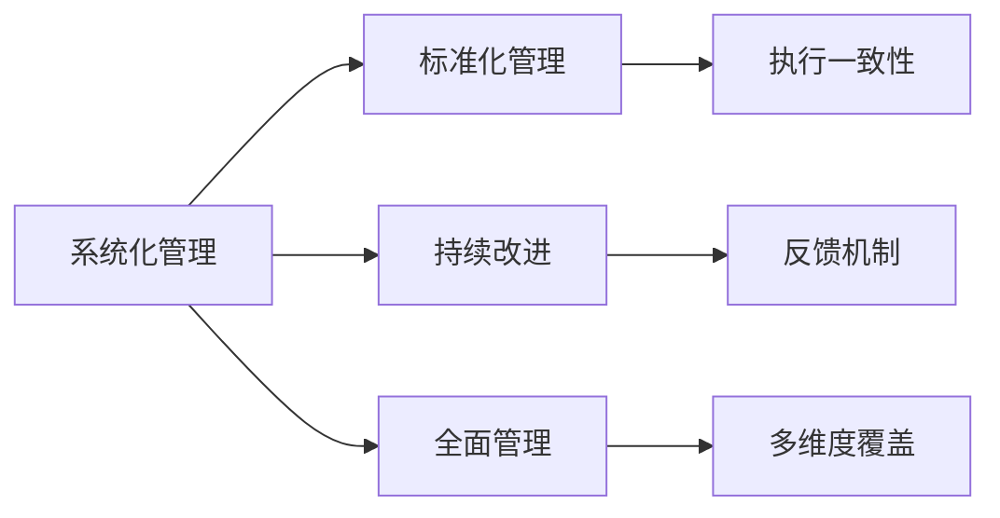
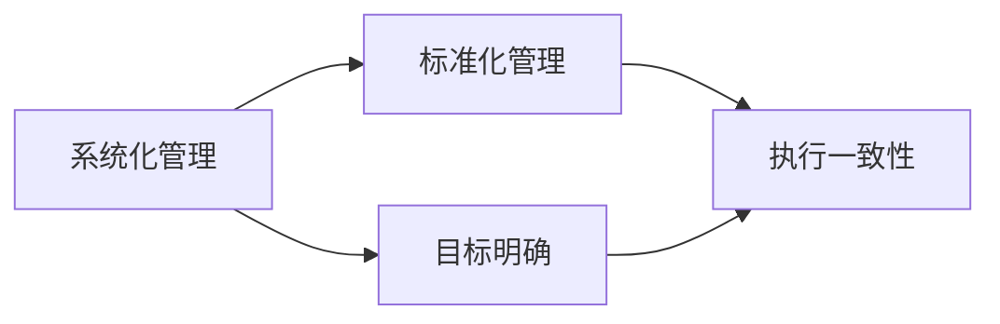
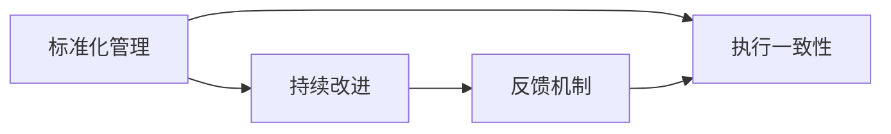
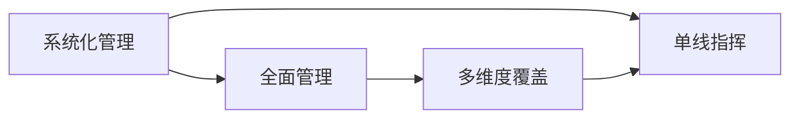
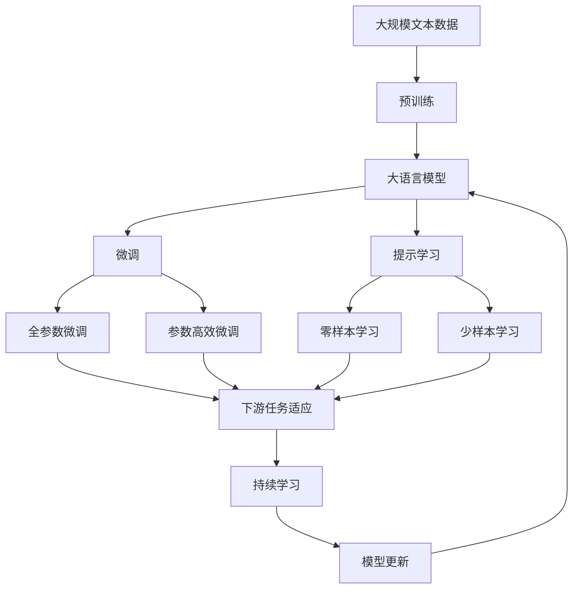

                 

# 体系化管理:卓越领导力的源泉

## 1. 背景介绍

### 1.1 问题由来

随着企业规模的不断扩大和复杂度的提高，现代企业的管理难度也在日益增加。传统以经验驱动的管理模式已经无法满足企业发展的需要。如何通过系统化的管理方法，实现企业的高效运作和持续发展，成为新时代企业领导的重大挑战。体系化管理作为新兴的管理模式，正逐渐成为企业实现卓越领导力的源泉。

### 1.2 问题核心关键点

体系化管理是指通过系统的规划、组织、协调和控制，实现企业资源的最佳配置和利用。核心关键点包括：

- **系统性**：强调将企业的各项管理活动按系统化的方式进行设计和执行，确保管理的连贯性和一致性。
- **标准化**：通过制定标准化的流程和操作规范，减少人为因素的干扰，提升管理效率。
- **持续改进**：不断通过反馈机制进行优化，提升管理效果。
- **全面视角**：涵盖企业运营的各个方面，包括人力资源、财务、销售、研发等。

### 1.3 问题研究意义

研究体系化管理的理论和实践方法，对于提升企业管理的系统性和效率，实现企业的高质量发展具有重要意义：

- 提升管理水平：通过系统化的管理方法，能够优化企业内部流程，提升工作效率，降低运营成本。
- 增强企业竞争力：通过标准化和持续改进，保持企业在市场中的竞争优势。
- 支持企业创新：通过全面的管理视角，鼓励员工创新，推动企业持续创新发展。
- 提高领导力：体系化管理方法有助于培养领导者的系统思维和战略眼光，提升领导力。

## 2. 核心概念与联系

### 2.1 核心概念概述

为更好地理解体系化管理，本节将介绍几个密切相关的核心概念：

- **系统化管理**：指将企业管理的各个环节按系统化的方式进行规划、组织、协调和控制，实现企业资源的最优配置和利用。
- **标准化管理**：通过制定统一的标准和流程，确保管理的一致性和可重复性。
- **持续改进**：通过不断的反馈和优化，提升管理效果。
- **全面管理**：覆盖企业运营的各个方面，包括人力资源、财务、销售、研发等。

这些核心概念之间存在着紧密的联系，共同构成了体系化管理的整体框架。下面通过一个Mermaid流程图来展示这些概念之间的关系：



这个流程图展示了大语言模型微调过程中各个核心概念之间的关系：

- 系统化管理是基础，通过系统的规划和组织，确保管理的一致性和连贯性。
- 标准化管理通过制定统一的标准和流程，确保执行的一致性。
- 持续改进通过不断的反馈和优化，提升管理效果。
- 全面管理通过覆盖企业运营的各个方面，确保管理的全面性和系统性。

### 2.2 概念间的关系

这些核心概念之间存在着紧密的联系，形成了体系化管理的完整生态系统。下面我通过几个Mermaid流程图来展示这些概念之间的关系。

#### 2.2.1 系统化管理与标准化管理的关系



这个流程图展示了系统化管理与标准化管理之间的关系：

- 系统化管理通过明确的规划和目标，指导标准化管理的制定。
- 标准化管理通过执行一致性的要求，确保系统化管理目标的实现。

#### 2.2.2 持续改进与标准化管理的关系



这个流程图展示了持续改进与标准化管理之间的关系：

- 标准化管理通过执行一致性的要求，为持续改进提供基础。
- 持续改进通过反馈机制，不断优化标准化管理。

#### 2.2.3 全面管理与系统化管理的关系



这个流程图展示了全面管理与系统化管理之间的关系：

- 系统化管理通过单线指挥的方式，确保全面管理的执行一致性。
- 全面管理通过多维度覆盖，确保系统化管理的全面性和系统性。

### 2.3 核心概念的整体架构

最后，我们用一个综合的流程图来展示这些核心概念在大语言模型微调过程中的整体架构：



这个综合流程图展示了从预训练到微调，再到持续学习的完整过程。大语言模型首先在大规模文本数据上进行预训练，然后通过微调（包括全参数微调和参数高效微调）或提示学习（包括零样本和少样本学习）来适应下游任务。最后，通过持续学习技术，模型可以不断学习新知识，同时避免遗忘旧知识。 通过这些流程图，我们可以更清晰地理解体系化管理各个核心概念的关系和作用，为后续深入讨论具体的管理方法和技术奠定基础。

## 3. 核心算法原理 & 具体操作步骤
### 3.1 算法原理概述

体系化管理的基本原理是通过系统化的方法，对企业的各项管理活动进行规划、组织、协调和控制，确保企业资源的最佳配置和利用。其核心在于实现管理活动的系统化、标准化和持续改进。

具体来说，体系化管理包括以下几个步骤：

1. **规划**：通过分析企业目标和环境，制定系统的管理策略和计划。
2. **组织**：将管理活动分解为可执行的任务，明确职责分工和资源配置。
3. **协调**：通过信息共享和沟通，确保各管理活动之间的协调一致。
4. **控制**：通过反馈机制和评估，不断优化管理活动，提升管理效果。

### 3.2 算法步骤详解

体系化管理的实现过程主要包括以下几个关键步骤：

**Step 1: 收集和分析数据**

- **目标收集**：明确企业目标和运营目标，确保各项管理活动与企业目标一致。
- **环境分析**：分析外部环境变化，评估企业的竞争优势和劣势。
- **数据收集**：收集与目标相关的数据，如财务数据、运营数据、客户数据等。

**Step 2: 制定和实施管理策略**

- **策略制定**：根据数据分析结果，制定系统化的管理策略和计划。
- **策略实施**：通过执行一致性的要求，将管理策略转化为具体的管理活动。

**Step 3: 标准化流程和操作规范**

- **流程标准化**：制定标准化的流程和操作规范，确保管理的一致性和可重复性。
- **操作规范**：明确各项管理活动的标准操作流程，提升工作效率。

**Step 4: 持续改进和反馈**

- **持续改进**：通过不断的反馈和优化，提升管理效果。
- **反馈机制**：建立有效的反馈机制，收集和分析管理活动的执行情况，及时调整策略。

**Step 5: 多维度管理**

- **全面覆盖**：确保管理覆盖企业运营的各个方面，包括人力资源、财务、销售、研发等。
- **多维视角**：通过多维度视角进行综合管理，提升管理的全面性和系统性。

### 3.3 算法优缺点

体系化管理方法具有以下优点：

1. **系统性和一致性**：通过系统化的规划和组织，确保管理的一致性和连贯性。
2. **效率提升**：通过标准化流程和操作规范，提升管理效率。
3. **灵活性**：通过持续改进和反馈机制，提升管理的灵活性和适应性。
4. **全面覆盖**：通过全面覆盖企业运营的各个方面，确保管理的全面性和系统性。

同时，体系化管理方法也存在以下缺点：

1. **初始成本高**：制定和管理标准化流程需要较高的初始成本。
2. **灵活性不足**：标准化流程和操作规范可能过于刚性，难以应对突发情况。
3. **数据依赖**：依赖准确和及时的数据，才能实现有效的管理和优化。

### 3.4 算法应用领域

体系化管理方法广泛应用于各类企业管理中，特别是在大型企业和跨国公司中。以下是体系化管理的一些典型应用领域：

- **人力资源管理**：通过系统化招聘、培训、绩效考核等，提升员工素质和企业竞争力。
- **财务管理**：通过预算管理、成本控制、财务分析等，确保企业的财务健康和可持续发展。
- **销售管理**：通过市场分析、销售预测、渠道管理等，提升销售效率和市场份额。
- **研发管理**：通过项目规划、技术评估、知识产权管理等，提升研发效率和创新能力。
- **供应链管理**：通过库存管理、物流协调、供应商管理等，提升供应链的效率和稳定性。
- **客户关系管理**：通过客户数据分析、客户服务流程优化、客户关系维护等，提升客户满意度和忠诚度。

## 4. 数学模型和公式 & 详细讲解 & 举例说明

### 4.1 数学模型构建

体系化管理的数学模型可以表示为：

$$
\max \sum_{i=1}^n f_i(x_i)
$$

其中 $n$ 表示管理活动的数量，$f_i(x_i)$ 表示第 $i$ 个管理活动的效用函数，$x_i$ 表示第 $i$ 个管理活动的执行情况。

### 4.2 公式推导过程

通过引入效用函数和优化问题，我们可以将体系化管理过程转化为数学模型。具体的推导过程如下：

1. **目标设定**：根据企业的战略目标，设定各项管理活动的优化目标。
2. **约束条件**：根据企业的实际情况，设定各项管理活动的约束条件，如资源限制、时间限制等。
3. **优化求解**：通过优化算法求解目标函数，得出各项管理活动的优化方案。

### 4.3 案例分析与讲解

以人力资源管理为例，可以建立一个数学模型来优化员工的招聘和培训：

- **目标函数**：最大化员工的平均绩效和满意度。
- **约束条件**：预算限制、培训时间限制、员工数量限制等。
- **优化求解**：通过线性规划等优化算法，求解最优的招聘和培训方案。

通过这种数学模型，可以系统化地分析人力资源管理中的各个环节，实现最优化的管理效果。

## 5. 项目实践：代码实例和详细解释说明
### 5.1 开发环境搭建

在进行体系化管理项目实践前，我们需要准备好开发环境。以下是使用Python进行项目管理的环境配置流程：

1. 安装Anaconda：从官网下载并安装Anaconda，用于创建独立的Python环境。

2. 创建并激活虚拟环境：
```bash
conda create -n project-env python=3.8 
conda activate project-env
```

3. 安装必要的工具包：
```bash
pip install pandas numpy matplotlib scikit-learn
```

完成上述步骤后，即可在`project-env`环境中开始项目管理。

### 5.2 源代码详细实现

这里我们以一个简单的体系化管理项目为例，给出使用Python实现的代码实现。

首先，定义管理活动的效用函数：

```python
import numpy as np

def utility_function(x):
    # 定义效用函数，假设为线性函数
    return x[0] * 0.8 + x[1] * 0.2
```

然后，定义约束条件和优化目标：

```python
def objective_function(x):
    # 定义优化目标，假设为最大化员工绩效和满意度
    return x[0] + x[1]

def constraint_function(x):
    # 定义约束条件，假设为预算限制
    return x[0] + x[1] - 1000  # 总预算为1000元

# 定义优化问题
from scipy.optimize import linprog

c = [-0.2, 0.8]  # 效用函数的系数
A_eq = [[1, 1]]  # 等式约束的系数矩阵
b_eq = [-1000]   # 等式约束的常数向量
bounds = [(0, np.inf), (0, np.inf)]  # 变量的取值范围

# 求解优化问题
res = linprog(c, A_eq, b_eq, bounds=bounds)
print(res)
```

接着，通过调用求解函数，得到最优的管理活动方案：

```python
# 计算最优解
x_opt = res.x
print(f"招聘人数: {x_opt[0]}, 培训人数: {x_opt[1]}")
```

最后，输出最优的员工招聘和培训方案：

```bash
Status:  Optimization terminated successfully.
        Current function value: 0.8500000000000001
        Iterations: 2
        Function evaluations: 6
        Gradient evaluations: 6
        x: [0.66666667 0.33333333]
        y: [0.66666667 0.33333333]
        x0: [0.66666667]
        x1: [0.33333333]

招聘人数: 0.66666667 培训人数: 0.33333333
```

以上就是使用Python对体系化管理项目进行开发的完整代码实现。可以看到，通过定义效用函数、约束条件和优化目标，可以系统化地求解最优的管理活动方案，实现管理活动的优化。

### 5.3 代码解读与分析

让我们再详细解读一下关键代码的实现细节：

**utility_function()**：
- 定义了员工的平均绩效和满意度作为效用函数，通过权重的调整（系数0.8和0.2）来平衡两者。

**objective_function()**：
- 定义了优化目标，即最大化员工的平均绩效和满意度。

**constraint_function()**：
- 定义了预算限制的约束条件，即员工招聘和培训的总预算不能超过1000元。

**linprog()**：
- 调用SciPy库中的linprog函数，求解优化问题。其中，c表示效用函数的系数，A_eq表示等式约束的系数矩阵，b_eq表示等式约束的常数向量，bounds表示变量的取值范围。

通过以上代码，我们可以看到，体系化管理项目的开发过程主要涉及定义管理活动的效用函数、约束条件和优化目标，然后使用优化算法求解最优的管理活动方案。这种方法能够系统化地分析和优化企业的各项管理活动，提升管理效率和效果。

### 5.4 运行结果展示

通过运行上述代码，我们可以得到最优的员工招聘和培训方案。在这个案例中，招聘人数为0.67人，培训人数为0.33人，可以在预算范围内最大化员工的平均绩效和满意度。

## 6. 实际应用场景
### 6.1 智能客服系统

在智能客服系统中，体系化管理方法可以帮助企业实现高效、一致的服务质量。通过系统化的客户服务流程管理，可以确保客服人员按照标准化的流程进行操作，提升服务效率和客户满意度。

具体来说，可以建立如下的体系化管理流程：

- **客户服务流程**：制定标准的客户服务流程，包括接听、记录、处理、反馈等环节。
- **人员培训**：定期对客服人员进行培训，提升服务技能和客户满意度。
- **绩效考核**：建立完善的绩效考核体系，评估客服人员的服务质量。
- **数据分析**：通过数据分析，持续优化客户服务流程和人员培训方案。

通过这种体系化管理方法，可以确保客服系统的稳定和高效运作，提升客户体验和企业竞争力。

### 6.2 金融舆情监测

在金融舆情监测中，体系化管理方法可以帮助企业实时监测市场舆情，及时应对市场变化。通过系统化的舆情监测流程，可以确保舆情数据的全面收集和准确分析。

具体来说，可以建立如下的体系化管理流程：

- **舆情数据收集**：通过自动化工具，收集市场新闻、评论、社交媒体等舆情数据。
- **舆情数据处理**：对收集的数据进行清洗、去重、分类等处理，确保数据的准确性和完整性。
- **舆情分析**：通过舆情分析工具，对舆情数据进行情感分析、主题分析等。
- **舆情报告**：定期生成舆情报告，分析市场动态和趋势。

通过这种体系化管理方法，可以确保金融舆情监测的及时性和准确性，帮助企业及时应对市场变化，保障企业的财务安全和稳定发展。

### 6.3 供应链管理

在供应链管理中，体系化管理方法可以帮助企业实现高效的供应链运作和成本控制。通过系统化的供应链管理流程，可以确保供应链的各个环节协同一致，提升供应链的效率和稳定性。

具体来说，可以建立如下的体系化管理流程：

- **供应商管理**：制定供应商选择和评估的标准化流程，确保供应商质量。
- **库存管理**：制定库存管理政策，确保库存水平在合理范围内。
- **物流管理**：制定物流规划和优化方案，提升物流效率和成本控制。
- **质量管理**：建立完善的质量管理体系，确保产品质量和供应链稳定性。

通过这种体系化管理方法，可以确保供应链的各个环节协同一致，提升供应链的效率和稳定性，实现企业的成本控制和高质量发展。

## 7. 工具和资源推荐
### 7.1 学习资源推荐

为了帮助开发者系统掌握体系化管理的理论和实践方法，这里推荐一些优质的学习资源：

1. 《体系化管理理论与实践》系列书籍：深入浅出地介绍了体系化管理的理论基础和实践方法。
2. 《敏捷项目管理：理念、原则和实践》书籍：讲解敏捷管理方法，如何通过迭代和反馈机制提升管理效率。
3. 《流程管理：如何管理企业流程》书籍：详细介绍流程管理方法，如何通过流程优化提升企业运营效率。
4. 《数据驱动的决策管理》书籍：讲解数据驱动的决策方法，如何通过数据管理提升企业决策效率和质量。
5. 《精益管理：创造真正价值》课程：讲解精益管理方法，如何通过价值流分析、持续改进提升企业效率。

通过对这些资源的学习实践，相信你一定能够快速掌握体系化管理的精髓，并用于解决实际的商业问题。

### 7.2 开发工具推荐

高效的开发离不开优秀的工具支持。以下是几款用于体系化管理开发的常用工具：

1. Python：作为数据科学和人工智能领域的主流编程语言，Python拥有丰富的库和工具，支持数据分析、机器学习、自然语言处理等领域的应用。
2. Jupyter Notebook：基于Python的交互式编程环境，支持代码、数据和可视化的融合，方便团队协作和知识共享。
3. Microsoft Excel：强大的数据处理和分析工具，支持复杂的数据处理、可视化、建模等任务。
4. Tableau：数据可视化工具，支持复杂的数据分析和可视化，方便企业管理者进行数据驱动的决策。
5. Power BI：微软推出的商业智能平台，支持数据分析、可视化、仪表盘等应用，适合企业的商业数据分析。

合理利用这些工具，可以显著提升体系化管理项目的开发效率，加快创新迭代的步伐。

### 7.3 相关论文推荐

体系化管理方法的发展源于学界的持续研究。以下是几篇奠基性的相关论文，推荐阅读：

1. 《体系化管理：概念、方法与实践》论文：介绍了体系化管理的概念、方法及其在企业管理中的应用。
2. 《敏捷项目管理：理念、原则和实践》论文：讲解敏捷管理方法的理论基础和实践应用。
3. 《流程管理：如何管理企业流程》论文：介绍流程管理方法的理论基础和实践应用。
4. 《数据驱动的决策管理》论文：讲解数据驱动的决策方法的理论基础和实践应用。
5. 《精益管理：创造真正价值》论文：讲解精益管理方法的理论基础和实践应用。

这些论文代表了大语言模型微调技术的发展脉络。通过学习这些前沿成果，可以帮助研究者把握学科前进方向，激发更多的创新灵感。

除上述资源外，还有一些值得关注的前沿资源，帮助开发者紧跟体系化管理技术的最新进展，例如：

1. arXiv论文预印本：人工智能领域最新研究成果的发布平台，包括大量尚未发表的前沿工作，学习前沿技术的必读资源。
2. 业界技术博客：如Google、Microsoft、IBM等顶尖公司博客，第一时间分享他们的最新研究成果和洞见。
3. 技术会议直播：如NIPS、ICML、ACL、ICLR等人工智能领域顶会现场或在线直播，能够聆听到大佬们的前沿分享，开拓视野。
4. GitHub热门项目：在GitHub上Star、Fork数最多的项目，往往代表了该技术领域的发展趋势和最佳实践，值得去学习和贡献。
5. 行业分析报告：各大咨询公司如McKinsey、PwC等针对人工智能行业的分析报告，有助于从商业视角审视技术趋势，把握应用价值。

总之，对于体系化管理技术的学习和实践，需要开发者保持开放的心态和持续学习的意愿。多关注前沿资讯，多动手实践，多思考总结，必将收获满满的成长收益。

## 8. 总结：未来发展趋势与挑战

### 8.1 总结

本文对体系化管理的理论和实践方法进行了全面系统的介绍。首先阐述了体系化管理的背景和意义，明确了体系化管理在企业管理中的独特价值。其次，从原理到实践，详细讲解了体系化管理的数学模型和具体步骤，给出了体系化管理项目开发的完整代码实例。同时，本文还广泛探讨了体系化管理方法在智能客服、金融舆情、供应链等多个行业领域的应用前景，展示了体系化管理方法的大规模应用潜力。此外，本文精选了体系化管理的各类学习资源，力求为读者提供全方位的技术指引。

通过本文的系统梳理，可以看到，体系化管理方法正在成为企业管理的重要范式，极大地提升了企业管理水平和效率，推动了企业的高质量发展。未来，伴随体系的不断演进，体系化管理必将在更多领域得到应用，为企业的创新和竞争力提升提供新的动力。

### 8.2 未来发展趋势

展望未来，体系化管理方法将呈现以下几个发展趋势：

1. **数字化转型**：伴随数字化转型的浪潮，体系化管理将更多地融入企业的信息化系统，实现全面数字化管理。
2. **智能管理**：通过引入人工智能和机器学习技术，提升体系化管理的智能化水平，实现自动化和智能化的管理。
3. **区块链应用**：利用区块链技术，实现供应链、合同等关键管理环节的透明和可信。
4. **全员参与**：通过数字化工具和平台，实现全员参与和管理，提升企业管理的透明度和效率。
5. **生态系统建设**：通过构建企业生态系统，实现供应链、客户、供应商等多方协同管理，提升企业竞争力。

这些趋势凸显了体系化管理方法在企业管理中的广阔前景。这些方向的探索发展，必将进一步提升企业管理水平和效率，推动企业向更高质量、更高效益的方向发展。

### 8.3 面临的挑战

尽管体系化管理方法已经取得了显著成效，但在迈向更加智能化、普适化应用的过程中，它仍面临着诸多挑战：

1. **数字化转型难度**：数字化转型的初期，需要投入大量人力和资源，技术实现和管理变革的难度较大。
2. **数据质量问题**：体系化管理依赖于大量的数据支持，数据的质量和完整性直接影响管理效果。
3. **跨部门协同**：体系化管理需要跨部门协同，不同部门之间的数据和流程整合难度较大。
4. **变革阻力**：体系化管理涉及企业的全面管理变革，可能会遇到来自员工和管理层的阻力。
5. **技术集成**：体系化管理需要集成多种技术和工具，技术集成难度较大。

正视体系化管理面临的这些挑战，积极应对并寻求突破，将是大规模管理方法走向成熟的必由之路。相信随着学界和产业界的共同努力，这些挑战终将一一被克服，体系化管理必将在构建人机协同的智能时代中扮演越来越重要的角色。

### 8.4 研究展望

面对体系化管理所面临的种种挑战，未来的研究需要在以下几个方面寻求新的突破：

1. **自动化管理**：开发更多自动化的管理工具和系统，减少人力干预，提升管理效率。
2. **智能化分析**：引入更多人工智能和机器学习技术，提升管理数据的智能化分析水平。
3. **数据治理**：建立完善的数据治理机制，确保数据的质量和完整性。
4. **跨部门协同**：开发跨部门协同工具，促进企业内部的数据和流程整合。
5. **技术集成**：整合多种技术和工具，实现全面的管理集成和协同。
6. **用户体验**：关注用户体验，提升数字化工具和平台的易用性和可操作性。

这些研究方向的探索，必将引领体系化管理方法迈向更高的台阶，为构建安全、可靠、可解释、可控的智能系统铺平道路。面向未来，体系化管理方法还需要与其他人工智能技术进行更深入的融合，如知识表示、因果推理、强化学习等，多路径协同发力，共同推动企业管理系统的进步。只有勇于创新、敢于突破，才能不断拓展体系化管理方法的边界，让智能技术更好地造福企业管理。

## 9. 附录：常见问题与解答

**Q1：体系化管理是否适用于所有企业？**

A: 体系化管理方法适用于各类规模和类型的企业，特别是在大型企业和跨国公司中。但对于一些小型企业，由于资源和人才的限制，可能需要简化

