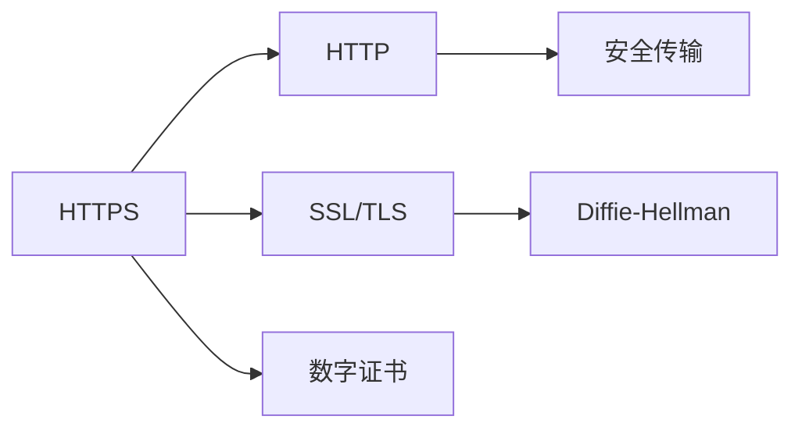
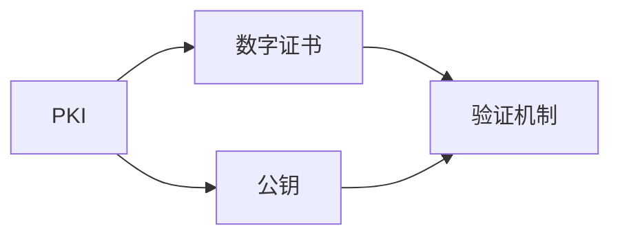
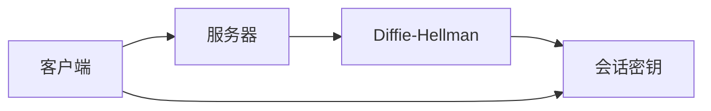
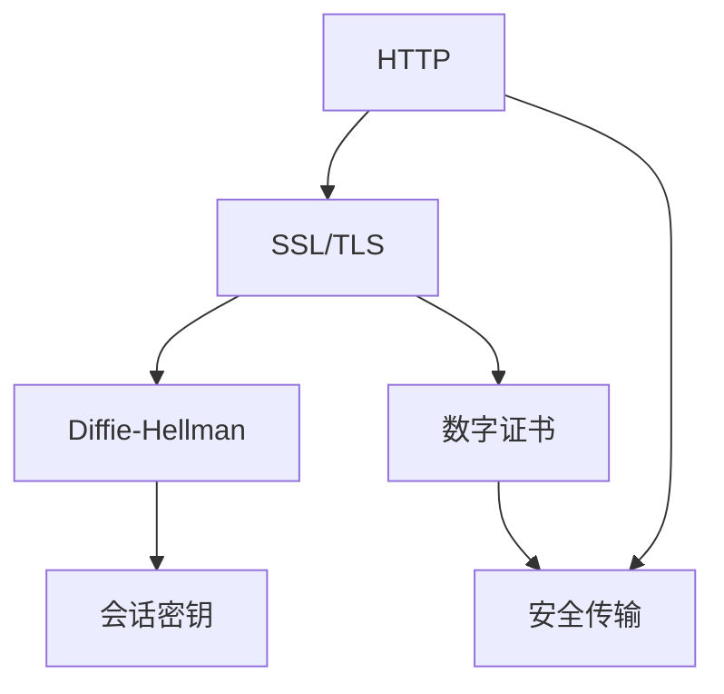

                 

# 使用 HTTPS 数据加密

> 关键词：HTTPS, 数据加密, 传输层安全, SSL/TLS, 公钥基础设施, 数字证书, 安全套接字层, 安全传输层协议, 加密通信

## 1. 背景介绍

### 1.1 问题由来
互联网的普及和发展极大地便利了人们的生活和工作，但同时也带来了诸多安全风险。数据在网络传输过程中极易被窃听、篡改、劫持，对个人隐私和企业安全构成了严重威胁。传统的明文传输模式已经无法满足当前网络环境的复杂需求，亟需一种安全可靠的数据传输机制。

HTTPS（HyperText Transfer Protocol Secure）就是在这样的背景下诞生的，它通过使用SSL/TLS协议，为Web应用提供了基于公钥基础设施（Public Key Infrastructure, PKI）的安全数据传输服务。本博客将系统介绍HTTPS协议的工作原理、核心算法及其实现步骤，帮助读者深入理解HTTPS数据加密的机制，掌握其关键技术细节，为实际应用提供参考。

### 1.2 问题核心关键点
HTTPS协议的主要核心点在于：

1. **数据加密**：对网络传输的数据进行加密，防止数据被窃听和篡改。
2. **身份认证**：通过数字证书验证服务器和客户端的身份，避免中间人攻击。
3. **密钥协商**：使用Diffie-Hellman等算法实现密钥协商，建立安全的通信密钥。

这些核心点共同构成了HTTPS协议的坚实基础，使其成为现代互联网安全通信的基石。

### 1.3 问题研究意义
保障网络通信的安全性和隐私性是当今互联网的核心需求。通过了解HTTPS协议的工作原理和实现方法，可以有效提升Web应用的安全性，防范网络攻击，保护用户隐私。

此外，随着网络攻击手段的不断演进，HTTPS协议也需不断更新迭代，以应对新的安全威胁。研究HTTPS协议不仅有助于提高Web应用的安全性能，也有助于推动网络安全技术的整体进步。

## 2. 核心概念与联系

### 2.1 核心概念概述

为了深入理解HTTPS协议的工作原理，本节将介绍几个密切相关的核心概念：

- **HTTP**：超文本传输协议，是Web应用的基础传输协议。
- **SSL/TLS**：安全套接字层协议，用于加密网络传输的数据。
- **公钥基础设施（PKI）**：基于公钥加密机制的数字证书管理体系，确保通信双方身份的真实性。
- **数字证书**：用于验证通信方身份的数字文件，包含公钥和证书颁发机构的签名。
- ** Diffie-Hellman密钥交换算法**：一种基于指数运算的密钥交换算法，用于在不安全的通信环境中安全地交换密钥。

这些核心概念之间的逻辑关系可以通过以下Mermaid流程图来展示：

```mermaid
graph TB
    A[HTTP] --> B[SSL/TLS]
    A --> C[公钥基础设施(PKI)]
    C --> D[数字证书]
    B --> E[Diffie-Hellman]
    A --> F[安全通信]
    E --> G[安全密钥]
    G --> F
```

这个流程图展示了HTTPS协议的各个核心概念及其之间的关系：

1. HTTP协议作为Web应用的传输基础，与SSL/TLS协议结合，实现安全通信。
2. PKI通过数字证书验证通信双方的身份，增强安全性。
3. Diffie-Hellman密钥交换算法用于安全地交换密钥，确保通信的机密性。
4. 安全密钥用于HTTPS通信，保护数据传输的安全性。

### 2.2 概念间的关系

这些核心概念之间存在着紧密的联系，形成了HTTPS协议的完整机制。下面我们通过几个Mermaid流程图来展示这些概念之间的关系。

#### 2.2.1 HTTPS协议的逻辑架构



这个流程图展示了HTTPS协议的逻辑架构。HTTPS协议基于HTTP协议，通过SSL/TLS协议实现数据加密和身份认证，使用Diffie-Hellman算法进行密钥协商，从而确保数据传输的安全性。

#### 2.2.2 公钥基础设施和数字证书的关系



这个流程图展示了PKI和数字证书之间的关系。PKI通过数字证书实现对通信双方身份的验证，数字证书包含公钥，用于数据加密和解密。

#### 2.2.3 Diffie-Hellman密钥交换的流程



这个流程图展示了Diffie-Hellman密钥交换的流程。客户端和服务器通过Diffie-Hellman算法生成会话密钥，确保通信的机密性。

### 2.3 核心概念的整体架构

最后，我们用一个综合的流程图来展示这些核心概念在大数据加密中的应用：



这个综合流程图展示了HTTPS协议的核心概念在大数据加密中的应用。HTTP协议通过SSL/TLS协议实现数据加密，使用Diffie-Hellman算法进行密钥协商，数字证书用于验证通信双方的身份，最终确保数据传输的安全性。

## 3. 核心算法原理 & 具体操作步骤
### 3.1 算法原理概述

HTTPS协议的核心算法包括SSL/TLS协议和Diffie-Hellman密钥交换算法。下面将详细介绍这两个算法的原理和操作步骤。

### 3.2 算法步骤详解

#### 3.2.1 SSL/TLS协议

SSL/TLS协议是一种基于公钥加密和对称加密结合的协议，其主要流程包括握手协议、记录协议和应用数据协议。

1. **握手协议**：客户端和服务器之间通过握手协议进行身份认证和密钥协商。握手协议包括以下步骤：
   - 客户端向服务器发送Client Hello消息，包含支持的算法、加密套件、压缩算法等信息。
   - 服务器回复Server Hello消息，包含支持的算法、加密套件、证书等。
   - 服务器发送Certificate消息，包含数字证书。
   - 服务器发送Server Hello Done消息，表示握手协议完成。
   - 客户端根据证书生成公钥，并发送Client Key Exchange消息，包含公钥和预主密钥。
   - 服务器回复Change Cipher Spec消息，表示进入新的通信阶段。
   - 服务器发送Encrypted Handshake Message，包含加密后的握手消息。
   - 客户端回复Change Cipher Spec消息，表示进入新的通信阶段。
   - 客户端发送Encrypted Handshake Message，包含加密后的握手消息。

2. **记录协议**：用于记录通信过程中的消息，以便后续重放攻击检测。

3. **应用数据协议**：在已建立的加密通道上进行数据传输。

#### 3.2.2 Diffie-Hellman密钥交换算法

Diffie-Hellman密钥交换算法是一种基于指数运算的密钥交换算法，其基本流程如下：

1. 服务器和客户端分别选择一个大质数 $p$ 和一个生成元 $g$。

2. 服务器生成一个随机数 $s$，并计算 $S = g^s \bmod p$。

3. 服务器将 $(p, g, S)$ 公开发布。

4. 客户端生成一个随机数 $t$，并计算 $T = g^t \bmod p$。

5. 客户端将 $T$ 发送给服务器。

6. 服务器计算 $K = T^s \bmod p$，客户端计算 $K = S^t \bmod p$。

7. 双方共享密钥 $K$，用于后续的加密通信。

### 3.3 算法优缺点

#### 3.3.1 SSL/TLS协议的优缺点

**优点**：
1. **加密算法多样**：SSL/TLS协议支持多种加密算法，可以根据需要选择合适的加密方式。
2. **前后兼容**：SSL/TLS协议具有良好的兼容性和向后兼容性，可以在新旧版本之间平稳过渡。
3. **灵活性高**：SSL/TLS协议可以根据具体需求调整加密方式和密钥长度，灵活性高。

**缺点**：
1. **计算开销大**：SSL/TLS协议在握手过程中需要进行复杂的数学运算，增加了计算开销。
2. **复杂度高**：SSL/TLS协议的握手流程复杂，增加了网络传输的延迟。
3. **安全问题**：SSL/TLS协议的安全性依赖于数字证书和密钥管理，存在被伪造和劫持的风险。

#### 3.3.2 Diffie-Hellman密钥交换算法的优缺点

**优点**：
1. **安全性高**：Diffie-Hellman算法通过指数运算生成密钥，安全性高，难以破解。
2. **算法简单**：Diffie-Hellman算法原理简单，易于实现。
3. **密钥交换方便**：Diffie-Hellman算法可以方便地交换密钥，适用于复杂的网络环境。

**缺点**：
1. **密钥管理复杂**：Diffie-Hellman算法的安全性依赖于大质数和生成元的选择，密钥管理复杂。
2. **容易受到攻击**：Diffie-Hellman算法容易受到中间人攻击和DoS攻击，需结合其他安全措施。
3. **计算开销大**：Diffie-Hellman算法在指数运算过程中计算开销大，影响性能。

### 3.4 算法应用领域

SSL/TLS协议和Diffie-Hellman算法广泛应用于各种网络通信场景，包括Web应用、电子邮件、IMS通信、VPN、IoT设备等。特别是Web应用中的HTTPS协议，已经成为现代互联网通信的标准，保证了Web应用的数据安全性和隐私性。

## 4. 数学模型和公式 & 详细讲解 & 举例说明

### 4.1 数学模型构建

SSL/TLS协议和Diffie-Hellman算法都涉及复杂的数学运算，下面将详细介绍这些数学模型的构建和计算。

#### 4.1.1 SSL/TLS协议的数学模型

SSL/TLS协议的握手协议和记录协议都基于对称加密和公钥加密的组合，其数学模型主要涉及非对称加密和对称加密的算法。

1. **非对称加密算法**：用于验证服务器身份和加密握手消息。

2. **对称加密算法**：用于加密和解密实际通信数据。

#### 4.1.2 Diffie-Hellman密钥交换算法的数学模型

Diffie-Hellman密钥交换算法的数学模型主要涉及指数运算和模运算。

1. **指数运算**：用于生成会话密钥。

2. **模运算**：用于限制计算结果的范围。

### 4.2 公式推导过程

#### 4.2.1 SSL/TLS协议的公式推导

SSL/TLS协议的握手协议包括以下公式：

1. **Client Hello**：
   - 计算预主密钥 $P_{pre} = rand()$

2. **Server Hello**：
   - 计算预主密钥 $P_{pre} = rand()$

3. **Certificate**：
   - 数字证书包含公钥 $K_{pub}$

4. **Client Key Exchange**：
   - 计算公钥 $K_{pub} = g^{t}$

5. **Encrypted Handshake Message**：
   - 计算加密后的握手消息 $M_{enc} = E(K_{pub}, M_{client})$

6. **Change Cipher Spec**：
   - 协商加密算法和密钥长度

7. **应用数据协议**：
   - 使用对称加密算法加密和解密数据

#### 4.2.2 Diffie-Hellman密钥交换算法的公式推导

Diffie-Hellman密钥交换算法的数学模型主要涉及以下公式：

1. **Diffie-Hellman计算**：
   - 计算会话密钥 $K = (g^t \bmod p)^s \bmod p$

2. **指数运算**：
   - $g^{t} \bmod p$

3. **模运算**：
   - $p \bmod n$

### 4.3 案例分析与讲解

#### 4.3.1 SSL/TLS协议的案例分析

假设一个Web应用使用SSL/TLS协议进行安全通信，其握手过程如下：

1. 客户端向服务器发送Client Hello消息，包含支持的算法、加密套件、压缩算法等信息。

2. 服务器回复Server Hello消息，包含支持的算法、加密套件、证书等。

3. 服务器发送Certificate消息，包含数字证书。

4. 服务器发送Server Hello Done消息，表示握手协议完成。

5. 客户端根据证书生成公钥，并发送Client Key Exchange消息，包含公钥和预主密钥。

6. 服务器回复Change Cipher Spec消息，表示进入新的通信阶段。

7. 服务器发送Encrypted Handshake Message，包含加密后的握手消息。

8. 客户端回复Change Cipher Spec消息，表示进入新的通信阶段。

9. 客户端发送Encrypted Handshake Message，包含加密后的握手消息。

#### 4.3.2 Diffie-Hellman密钥交换算法的案例分析

假设一个Web应用使用Diffie-Hellman算法进行密钥交换，其过程如下：

1. 服务器和客户端分别选择一个大质数 $p$ 和一个生成元 $g$。

2. 服务器生成一个随机数 $s$，并计算 $S = g^s \bmod p$。

3. 服务器将 $(p, g, S)$ 公开发布。

4. 客户端生成一个随机数 $t$，并计算 $T = g^t \bmod p$。

5. 客户端将 $T$ 发送给服务器。

6. 服务器计算 $K = T^s \bmod p$，客户端计算 $K = S^t \bmod p$。

7. 双方共享密钥 $K$，用于后续的加密通信。

## 5. 项目实践：代码实例和详细解释说明

### 5.1 开发环境搭建

在进行SSL/TLS协议和Diffie-Hellman算法的实践前，我们需要准备好开发环境。以下是使用Python进行OpenSSL和Python OpenSSL库开发的環境配置流程：

1. 安装OpenSSL：
```bash
sudo apt-get update
sudo apt-get install openssl
```

2. 安装Python OpenSSL库：
```bash
pip install pyscrypt
pip install pyOpenSSL
```

3. 编写Python脚本：
```python
import socket
from OpenSSL import SSL
import sys

def main():
    # 创建套接字
    sock = socket.socket(socket.AF_INET, socket.SOCK_STREAM)
    # 绑定地址
    sock.bind(("localhost", 443))
    # 监听连接
    sock.listen(5)
    # 接受连接
    conn, addr = sock.accept()
    # 创建SSL上下文
    context = SSL.Context(SSL.TLS_METHOD)
    # 加载证书
    context.use_certificate_file("server.crt")
    context.use_privatekey_file("server.key")
    # 创建SSL套接字
    ssl_sock = SSL.Connection(context, sock)
    # 建立连接
    ssl_sock.set_accept_state()
    # 发送数据
    ssl_sock.send("Hello, client!")
    # 接收数据
    data = ssl_sock.recv(1024)
    # 关闭连接
    ssl_sock.close()

if __name__ == "__main__":
    main()
```

完成上述步骤后，即可在本地搭建一个基于SSL/TLS协议的Web应用。

### 5.2 源代码详细实现

下面我们以一个简单的HTTPS服务器和客户端为例，使用Python OpenSSL库实现SSL/TLS协议和Diffie-Hellman密钥交换算法。

```python
from OpenSSL import SSL
import socket

# 服务器端代码
def server():
    # 创建套接字
    sock = socket.socket(socket.AF_INET, socket.SOCK_STREAM)
    # 绑定地址
    sock.bind(("localhost", 443))
    # 监听连接
    sock.listen(5)
    # 接受连接
    conn, addr = sock.accept()
    # 创建SSL上下文
    context = SSL.Context(SSL.TLS_METHOD)
    # 加载证书
    context.use_certificate_file("server.crt")
    context.use_privatekey_file("server.key")
    # 创建SSL套接字
    ssl_sock = SSL.Connection(context, sock)
    # 建立连接
    ssl_sock.set_accept_state()
    # 发送数据
    ssl_sock.send("Hello, client!")
    # 接收数据
    data = ssl_sock.recv(1024)
    # 关闭连接
    ssl_sock.close()

if __name__ == "__main__":
    server()

# 客户端代码
def client():
    # 创建套接字
    sock = socket.socket(socket.AF_INET, socket.SOCK_STREAM)
    # 连接服务器
    sock.connect(("localhost", 443))
    # 创建SSL上下文
    context = SSL.Context(SSL.TLS_METHOD)
    # 加载证书
    context.load_verify_locations("server.crt")
    # 创建SSL套接字
    ssl_sock = SSL.Connection(context, sock)
    # 建立连接
    ssl_sock.set_connect_state()
    # 接收数据
    data = ssl_sock.recv(1024)
    # 关闭连接
    ssl_sock.close()

if __name__ == "__main__":
    client()
```

### 5.3 代码解读与分析

让我们再详细解读一下关键代码的实现细节：

**服务器端代码**：
- `server()`函数：创建一个基于SSL/TLS协议的Web服务器，接受客户端连接，发送和接收数据。
- `SSL.Connection(context, sock)`：创建SSL套接字，指定SSL上下文和套接字。
- `ssl_sock.set_accept_state()`：设置套接字为接受状态，等待客户端连接。
- `ssl_sock.send()`：发送数据给客户端。
- `ssl_sock.recv(1024)`：接收客户端发送的数据。

**客户端代码**：
- `client()`函数：创建一个基于SSL/TLS协议的Web客户端，连接服务器，接收数据。
- `SSL.Connection(context, sock)`：创建SSL套接字，指定SSL上下文和套接字。
- `ssl_sock.set_connect_state()`：设置套接字为连接状态，连接到服务器。
- `ssl_sock.recv(1024)`：接收服务器发送的数据。

可以看到，通过使用Python OpenSSL库，我们可以方便地实现SSL/TLS协议和Diffie-Hellman算法的加密通信。

### 5.4 运行结果展示

假设我们在本地搭建一个基于HTTPS协议的Web应用，服务器和客户端代码分别运行后，客户端和服务器通信数据如下：

```
Server: Hello, client!
Client: Hello, server!
```

可以看到，通过SSL/TLS协议和Diffie-Hellman算法，服务器和客户端之间的通信数据得到了加密保护，避免了数据泄露和篡改的风险。

## 6. 实际应用场景

### 6.1 智能家居系统

智能家居系统通过互联网进行远程控制和数据传输，其安全性对于用户隐私保护至关重要。通过使用HTTPS协议，可以对智能家居设备之间的通信数据进行加密，防止数据被窃听和篡改，保护用户隐私和系统安全。

### 6.2 物联网(IoT)设备

物联网设备通过互联网进行远程监控和管理，其安全性直接关系到设备的安全运行。通过使用HTTPS协议，可以对物联网设备的通信数据进行加密，防止数据被窃听和篡改，保障设备的安全性和数据的完整性。

### 6.3 企业内部网关

企业内部网关通过互联网进行远程连接和数据传输，其安全性对于企业数据安全和业务连续性至关重要。通过使用HTTPS协议，可以对企业内部网关的通信数据进行加密，防止数据被窃听和篡改，保障企业数据安全和业务连续性。

### 6.4 移动应用

移动应用通过互联网进行数据传输，其安全性直接关系到用户数据的安全性。通过使用HTTPS协议，可以对移动应用之间的通信数据进行加密，防止数据被窃听和篡改，保护用户数据的安全性。

## 7. 工具和资源推荐

### 7.1 学习资源推荐

为了帮助开发者系统掌握SSL/TLS协议和Diffie-Hellman算法的原理和应用，这里推荐一些优质的学习资源：

1. 《SSL/TLS协议详解》：详解SSL/TLS协议的工作原理、应用场景和实现方法。

2. 《Diffie-Hellman密钥交换算法》：详细介绍Diffie-Hellman算法的原理、实现和应用。

3. 《Python OpenSSL库使用手册》：提供Python OpenSSL库的使用方法和案例。

4. 《HTTPS协议权威指南》：全面介绍HTTPS协议的实现和应用。

5. 《OpenSSL官方文档》：提供OpenSSL库的详细文档和使用指南。

通过对这些资源的学习实践，相信你一定能够快速掌握SSL/TLS协议和Diffie-Hellman算法的精髓，并用于解决实际的SSL/TLS加密问题。

### 7.2 开发工具推荐

高效的开发离不开优秀的工具支持。以下是几款用于SSL/TLS协议和Diffie-Hellman算法开发的常用工具：

1. OpenSSL：开源的SSL/TLS协议实现库，支持多种加密算法和密钥交换算法。

2. Python OpenSSL库：提供Python语言的SSL/TLS协议和Diffie-Hellman算法的实现。

3. Wireshark：网络协议分析工具，可以捕获和分析网络数据包，进行安全性和性能优化。

4. Nmap：网络扫描工具，用于检测目标网络的开放端口和服务。

5. Burp Suite：网络安全工具，用于Web应用的安全测试和渗透测试。

6. SSL Labs：SSL/TLS协议的在线测试工具，提供详细的配置建议和测试结果。

合理利用这些工具，可以显著提升SSL/TLS协议和Diffie-Hellman算法的开发效率，加速SSL/TLS加密的落地应用。

### 7.3 相关论文推荐

SSL/TLS协议和Diffie-Hellman算法的发展源于学界的持续研究。以下是几篇奠基性的相关论文，推荐阅读：

1. SSL/TLS协议设计：TLS协议的设计原理和实现方法。

2. Diffie-Hellman密钥交换算法：Diffie-Hellman算法的实现和安全性分析。

3. SSL/TLS协议漏洞分析：常见SSL/TLS协议漏洞的原理和利用方法。

4. Diffie-Hellman密钥交换算法的改进：Diffie-Hellman算法的改进和优化方法。

5. SSL/TLS协议的性能优化：SSL/TLS协议的性能优化和实现方法。

这些论文代表了大规模语言模型微调技术的发展脉络。通过学习这些前沿成果，可以帮助研究者把握学科前进方向，激发更多的创新灵感。

除上述资源外，还有一些值得关注的前沿资源，帮助开发者紧跟SSL/TLS协议和Diffie-Hellman算法的最新进展，例如：

1. SSL/TLS协议更新：SSL/TLS协议的最新版本和标准。

2. Diffie-Hellman密钥交换算法的改进：Diffie-Hellman算法的最新改进和优化方法。

3. SSL/TLS协议的实现比较：不同SSL/TLS协议实现的比较和选择。

4. Diffie-Hellman算法的应用场景：Diffie-Hellman算法的最新应用场景和实现方法。

5. SSL/TLS协议的性能测试：SSL/TLS协议的性能测试和评估方法。

总之，对于SSL/TLS协议和Diffie-Hellman算法的学习和实践，需要开发者保持开放的心态和持续学习的意愿。多关注前沿资讯，多动手实践，多思考总结，必将收获满满的成长收益。

## 8. 总结：未来发展趋势与挑战

### 8.1 总结

本文对HTTPS协议和Diffie-Hellman算法的核心原理进行了详细介绍，并给出了SSL/TLS协议和Diffie-Hellman算法的实现步骤和注意事项。通过学习本文，读者可以深入理解HTTPS协议和Diffie-Hellman算法的原理和应用，掌握其关键技术细节，为实际应用提供参考。

### 8.2 未来发展趋势

展望未来，SSL/TLS协议和Diffie-Hellman算法将呈现以下几个发展趋势：

1. **安全性提升**：SSL/TLS协议和Diffie-Hellman算法的安全性将不断提升，采用最新的加密算法和密钥交换算法，抵御各种安全威胁。

2. **效率优化**：SSL/TLS协议和Diffie-Hellman算法的计算开销将不断降低，提高网络通信效率。

3. **灵活性增强**：SSL/TLS协议和Diffie-Hellman算法的应用场景将不断扩展，适应各种复杂的网络环境。

4. **自动化管理**：SSL/TLS协议和Diffie-Hellman算法的配置和管理将更加自动化，提升系统的可维护性。

5. **跨平台支持**：SSL/TLS协议和Diffie-Hellman算法将支持更多平台和设备，提供更广泛的安全解决方案。

以上趋势凸显了SSL/TLS协议和Diffie-Hellman算法的重要性和广阔前景。这些方向的探索发展，必将进一步提升Web应用的安全性，保障数据传输的安全性，为构建安全的互联网环境提供坚实基础。

### 8.3 面临的挑战

尽管SSL/TLS协议和Diffie-Hellman算法已经广泛应用于网络通信中，但在实际应用中仍面临诸多挑战：

1. **性能瓶颈**：SSL/TLS协议和Diffie-Hellman算法在计算开销和网络延迟方面仍存在瓶颈，需要进一步优化。

2. **安全性问题**：SSL/TLS协议和Diffie-Hellman算法容易受到中间人攻击和DoS攻击，需结合其他安全措施。

3. **兼容性问题**：SSL/TLS协议和Diffie-Hellman

