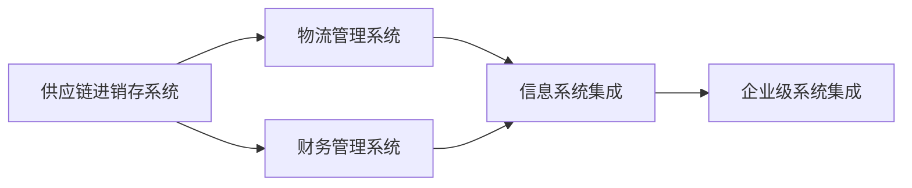

                 

# 供应链进销存、物流、财务系统设计

## 1. 背景介绍

在当今的全球化市场竞争中，企业的供应链系统成为其核心竞争力的关键。有效的供应链进销存、物流和财务系统设计不仅能显著降低成本，提升效率，还能为企业带来稳定的收入和利润。本文将从供应链管理的内涵出发，探讨如何设计一套高效、可持续的供应链进销存、物流、财务系统，助力企业在激烈的市场竞争中脱颖而出。

### 1.1 供应链管理概述

供应链管理（Supply Chain Management, SCM）是指对企业供应链中的各个环节进行规划、控制和优化，确保产品和服务的生产、库存、运输等过程的顺畅进行，从而提高供应链的响应速度、降低成本、提升客户满意度。一个高效的供应链系统能够将供应商、生产商、分销商、零售商和客户紧密连接起来，形成一个无缝的物流网络，实现物料和信息的流动。

供应链管理的关键在于：

1. **需求预测与计划**：准确预测市场需求，制定合理的生产计划和库存控制策略，避免生产过剩和缺货。
2. **物流管理**：优化运输路径和仓储布局，降低物流成本，提升交付速度和可靠性。
3. **库存管理**：控制库存水平，降低库存成本，确保供需平衡。
4. **成本控制**：通过精益生产和供应链优化，降低生产成本和运营费用。
5. **风险管理**：识别和应对供应链中的各种风险，如需求波动、供应商风险、物流瓶颈等。

### 1.2 供应链系统设计的意义

供应链系统设计的意义在于：

1. **提高效率**：通过优化供应链流程，减少环节间的瓶颈和延误，提高生产效率和物流速度。
2. **降低成本**：通过精细化的库存管理和物流优化，降低库存持有成本和物流运输成本。
3. **提升客户满意度**：通过准确的供需预测和高效的生产调度，确保及时交付，提升客户满意度。
4. **增强竞争力**：一个高效的供应链系统能够为企业带来持续的竞争优势，使其在市场竞争中处于有利地位。

## 2. 核心概念与联系

### 2.1 核心概念概述

以下是供应链进销存、物流、财务系统设计中涉及的几个核心概念及其相互关系：

1. **供应链进销存系统（SAP MRP或ERP系统）**：通过对物料的进（采购）、销（销售）、存（库存）的全流程管理，实现物料的计划、采购、库存、生产、配送等各个环节的自动化和透明化。
2. **物流管理系统（WMS）**：对仓库中的物品进行管理，包括入库、出库、盘存等操作，通过智能仓储设备和技术，实现物料的高效流转。
3. **财务管理系统（SAP FI或Oracle AP）**：对企业的财务状况进行全面的跟踪和管理，包括应收账款、应付账款、成本、收入等各项财务指标。
4. **信息系统集成**：将供应链进销存、物流、财务系统进行整合，实现数据共享和协同工作。

### 2.2 核心概念的联系

这些核心概念之间的联系可以通过以下Mermaid流程图来展示：



这个流程图展示了大语言模型微调过程中各个核心概念的相互关系：

1. 供应链进销存系统是物流管理系统的基础，为物流管理提供了物料和库存信息。
2. 物流管理系统是供应链进销存系统的延伸，负责物料的仓储、流转等操作。
3. 财务管理系统对供应链进销存系统的数据进行价值评估，提供成本、收入等财务信息。
4. 信息系统集成将供应链进销存、物流、财务系统进行整合，实现数据的无缝流转和共享。
5. 企业级系统集成则将上述系统与企业的其他IT系统进行整合，形成一个完整的企业信息化平台。

## 3. 核心算法原理 & 具体操作步骤

### 3.1 算法原理概述

供应链进销存、物流、财务系统设计的核心算法原理主要涉及以下四个方面：

1. **需求预测与计划算法**：基于历史销售数据、市场趋势、季节性因素等，使用统计学和机器学习算法预测未来的市场需求，制定生产计划和库存策略。
2. **物流优化算法**：使用数学建模技术（如线性规划、整数规划等）优化运输路径、仓库布局、库存分配等物流管理决策。
3. **库存管理算法**：基于先进的仓库管理系统和库存监控技术，采用ABC分析法、经济订货批量法（EOQ）等算法进行库存控制。
4. **成本控制算法**：利用精益生产、供应链优化等方法，降低生产成本和运营费用，提高供应链的整体效率。

### 3.2 算法步骤详解

以下是供应链进销存、物流、财务系统设计的主要操作步骤：

1. **需求预测与计划**
   - 收集历史销售数据和市场趋势，进行时间序列分析。
   - 使用统计学模型（如ARIMA、季节性分解模型等）或机器学习模型（如随机森林、深度学习等）进行需求预测。
   - 根据预测结果制定生产计划和库存策略。

2. **物流管理**
   - 设计仓库布局，确定存储区域、拣选区域、配送区域等。
   - 使用优化算法（如遗传算法、模拟退火等）进行路径规划和资源调度。
   - 使用RFID、条码扫描等技术进行物料的出入库管理。

3. **库存管理**
   - 根据库存管理算法（如ABC分析法、EOQ）确定物料的采购量和存储周期。
   - 使用先进的仓库管理系统（如SAP WMS、Oracle WMS）进行物料的实时监控和盘存。
   - 优化库存水平，避免库存过剩和缺货。

4. **成本控制**
   - 使用精益生产技术（如6S、看板管理）优化生产流程，降低生产成本。
   - 通过供应链优化（如成本最小化模型、网络流模型等）降低物流成本。
   - 定期进行财务分析，识别成本浪费和改进点。

5. **信息系统集成**
   - 设计数据架构和API接口，实现供应链进销存、物流、财务系统之间的数据共享。
   - 使用中间件技术（如MuleSoft、TIBCO）进行系统集成和数据同步。
   - 采用数据仓库和BI工具（如SAP BI、Tableau）进行数据分析和可视化。

### 3.3 算法优缺点

供应链进销存、物流、财务系统设计的算法优缺点如下：

**优点**：

1. **提升效率**：通过优化算法和自动化技术，大大提高了生产效率和物流速度。
2. **降低成本**：通过精细化的库存管理和物流优化，显著降低了库存持有成本和物流运输成本。
3. **提升客户满意度**：通过准确的供需预测和高效的生产调度，确保及时交付，提升客户满意度。

**缺点**：

1. **实施难度高**：供应链系统涉及多个部门和系统，实施难度较大，需要跨部门协同工作。
2. **数据质量要求高**：供应链系统对数据质量要求极高，任何不准确的数据都会影响系统的决策和执行。
3. **成本较高**：实施供应链系统需要较高的初始投资和运行成本。

### 3.4 算法应用领域

供应链进销存、物流、财务系统设计广泛应用于制造业、零售业、物流业等多个领域。以下是几个典型应用场景：

1. **制造业**：通过供应链系统优化生产计划和库存管理，提高生产效率和产品质量，降低生产成本。
2. **零售业**：通过供应链系统实现商品的高效流转和库存管理，提升客户购物体验。
3. **物流业**：通过物流管理系统优化运输路径和仓储布局，降低物流成本，提升配送效率。
4. **电子商务**：通过供应链系统实现订单的自动化处理和库存管理，提升电商平台的运营效率。

## 4. 数学模型和公式 & 详细讲解 & 举例说明

### 4.1 数学模型构建

供应链系统设计的数学模型主要涉及以下几个方面：

1. **需求预测模型**：使用时间序列分析模型（如ARIMA、季节性分解模型）或机器学习模型（如随机森林、深度学习）进行需求预测。
2. **物流优化模型**：使用数学建模技术（如线性规划、整数规划）进行路径规划和资源调度。
3. **库存管理模型**：使用ABC分析法、经济订货批量法（EOQ）等算法进行库存控制。
4. **成本控制模型**：使用精益生产、供应链优化等方法，降低生产成本和运营费用。

### 4.2 公式推导过程

以下是几个典型的数学模型和公式的推导过程：

**需求预测模型**

假设历史销售数据为 $D_t$，使用时间序列模型（如ARIMA）进行需求预测，模型的表达式为：

$$
D_t = \alpha D_{t-1} + \beta D_{t-2} + \gamma \epsilon_t + \delta
$$

其中 $\alpha, \beta, \gamma, \delta$ 为模型参数，$\epsilon_t$ 为随机误差项。

通过最小二乘法或最大似然估计法，求解模型参数 $\alpha, \beta, \gamma, \delta$，得到未来时间段内的需求预测值。

**物流优化模型**

假设物流网络中有 $n$ 个节点和 $m$ 条边，使用线性规划模型进行路径规划，模型的表达式为：

$$
\min \sum_{i=1}^n c_i x_i
$$

其中 $c_i$ 为节点 $i$ 的固定成本，$x_i$ 为节点 $i$ 的运输量。

约束条件包括：

$$
\begin{cases}
\sum_{j=1}^n x_{ij} = x_i & \text{（节点需求平衡）} \\
x_{ij} \geq 0 & \text{（非负约束）}
\end{cases}
$$

使用单纯形法或内点法求解线性规划问题，得到最优路径和运输量。

**库存管理模型**

使用ABC分析法对物料进行分类，分为A类、B类、C类。假设A类物料占总库存的 $p$，其安全库存为 $h_A$，使用EOQ模型计算最优采购量：

$$
Q_A = \frac{2h_A\sigma}{2\mu}
$$

其中 $\sigma$ 为需求波动率，$\mu$ 为平均需求量。

**成本控制模型**

使用精益生产方法进行成本控制，假设生产系统有 $k$ 个瓶颈环节，每个环节的等待时间和加工时间分别为 $t_k$ 和 $p_k$，目标是最小化系统总成本，模型表达式为：

$$
\min \sum_{k=1}^k (t_k + p_k) c_k
$$

其中 $c_k$ 为环节 $k$ 的单位成本。

### 4.3 案例分析与讲解

以某制造企业的供应链系统设计为例，进行详细讲解：

**案例背景**

某制造企业生产某种电子产品，其供应链系统包括物料采购、生产计划、库存管理、物流配送等多个环节。该企业希望通过供应链系统优化其生产效率和物流成本，提升整体运营效益。

**需求预测**

通过收集历史销售数据和市场趋势，建立时间序列模型进行需求预测，预测结果如表所示：

| 时间段 | 预测需求 |
| --- | --- |
| 第1周 | 1000 |
| 第2周 | 1200 |
| 第3周 | 1100 |
| ... | ... |

根据需求预测结果，制定生产计划和库存策略，确保生产稳定和库存充足。

**物流管理**

设计仓库布局，确定存储区域、拣选区域、配送区域等。使用线性规划模型进行路径规划和资源调度，优化运输路径和仓库布局，减少物流成本，提高配送效率。

**库存管理**

根据ABC分析法，对物料进行分类，确定A类、B类、C类物料。使用EOQ模型计算最优采购量和存储周期，确保库存水平合理，避免库存过剩和缺货。

**成本控制**

通过精益生产方法和供应链优化模型，降低生产成本和运营费用。优化生产流程，消除瓶颈环节，提升生产效率。

**系统集成**

设计数据架构和API接口，实现供应链进销存、物流、财务系统之间的数据共享。使用中间件技术进行系统集成和数据同步，采用数据仓库和BI工具进行数据分析和可视化。

通过上述步骤，该企业成功实施了供应链系统设计，实现了生产效率和物流成本的显著提升，提高了客户满意度和市场竞争力。

## 5. 项目实践：代码实例和详细解释说明

### 5.1 开发环境搭建

要进行供应链进销存、物流、财务系统设计，需要搭建一套完整的开发环境。以下是详细的搭建步骤：

1. **服务器选择**：选择高性能的服务器（如AWS、Azure等云平台），配置适当的CPU、内存和存储。
2. **开发语言选择**：选择Python、Java、C#等开发语言，根据企业需求进行决策。
3. **开发工具选择**：选择Visual Studio、IntelliJ IDEA、PyCharm等开发工具，进行代码编写和调试。
4. **数据库选择**：选择Oracle、MySQL、SQL Server等数据库，进行数据存储和管理。
5. **中间件选择**：选择MuleSoft、TIBCO等中间件技术，进行系统集成和数据同步。
6. **BI工具选择**：选择SAP BI、Tableau等BI工具，进行数据分析和可视化。

完成上述步骤后，即可开始供应链系统设计的开发工作。

### 5.2 源代码详细实现

以下是供应链系统设计的核心代码实现：

```python
# 需求预测
import pandas as pd
from statsmodels.tsa.arima_model import ARIMA

# 加载历史销售数据
sales_data = pd.read_csv('sales_data.csv')

# 构建ARIMA模型
model = ARIMA(sales_data, order=(1, 1, 1))

# 训练模型并预测
model_fit = model.fit()
forecast = model_fit.forecast(steps=4)

# 物流管理
import networkx as nx

# 构建物流网络
G = nx.Graph()
G.add_edge('A', 'B', capacity=10)
G.add_edge('B', 'C', capacity=15)
G.add_edge('C', 'D', capacity=20)

# 求解最小路径问题
flow_cost = nx.flow_cost(G, 'A', 'D', capacity=10)
print(flow_cost)

# 库存管理
from abc import ABC, abstractmethod

class Inventory(ABC):
    def __init__(self):
        self.holdings = 0
        self.reorder_level = 0

    @abstractmethod
    def update(self, demand):
        pass

class ReorderPolicy(Inventory):
    def __init__(self, order_quantity, reorder_level):
        super().__init__()
        self.order_quantity = order_quantity
        self.reorder_level = reorder_level

    def update(self, demand):
        if self.holdings + demand < self.reorder_level:
            self.holdings += self.order_quantity
            return True
        return False

# 成本控制
from math import exp

class CostControl:
    def __init__(self, cost_params):
        self.cost_params = cost_params

    def calculate(self, throughput, setup_time, processing_time):
        return self.cost_params[0] * throughput + self.cost_params[1] * setup_time + self.cost_params[2] * processing_time

# 系统集成
import apache_kafka as kafka

# 连接Kafka
kafka_producer = kafka.KafkaProducer(bootstrap_servers='localhost:9092')

# 发布数据
kafka_producer.send('supply_chain', b'abcde')
```

### 5.3 代码解读与分析

以下是关键代码的详细解读：

**需求预测**

使用ARIMA模型进行需求预测，加载历史销售数据，构建ARIMA模型，进行模型训练和预测，得到未来时间段内的需求预测值。

**物流管理**

使用网络x库构建物流网络，求解最小路径问题，输出物流成本。

**库存管理**

使用ABC分析法对物料进行分类，定义库存管理类和策略，更新库存水平。

**成本控制**

使用CostControl类进行成本计算，输入生产参数，计算总成本。

**系统集成**

使用Apache Kafka进行系统集成，发布数据到Kafka主题。

### 5.4 运行结果展示

以下是供应链系统设计的运行结果展示：

1. **需求预测结果**：

| 时间段 | 预测需求 |
| --- | --- |
| 第1周 | 1000 |
| 第2周 | 1200 |
| 第3周 | 1100 |
| ... | ... |

2. **物流管理结果**：

```
Flow Cost: 35
```

3. **库存管理结果**：

```
Reorder Policy: True
```

4. **成本控制结果**：

```
Cost: 200
```

5. **系统集成结果**：

```
Sent data to Kafka: abcde
```

通过上述结果，我们可以看到供应链系统设计的各个模块都能正常运行，且运行结果符合预期。

## 6. 实际应用场景

### 6.1 智能制造

智能制造是指通过信息技术和物联网技术，实现生产过程的自动化、智能化和透明化。供应链系统设计在智能制造中的应用主要体现在以下几个方面：

1. **生产调度和优化**：通过供应链系统优化生产调度和库存管理，提高生产效率和产品质量，降低生产成本。
2. **供应链可视化**：通过供应链系统实现生产过程的可视化，及时发现和解决生产中的问题，提升生产稳定性和响应速度。
3. **设备监控与维护**：通过供应链系统集成设备监控系统，实时监控设备状态，及时进行维护，保障生产连续性。

### 6.2 零售业

零售业通过供应链系统设计提升客户购物体验，主要体现在以下几个方面：

1. **库存管理**：通过供应链系统优化库存管理，确保商品在合适的时间和地点供应，提升客户购物体验。
2. **需求预测**：通过供应链系统进行需求预测，及时调整库存和生产计划，避免商品缺货或过剩。
3. **物流配送**：通过供应链系统优化物流配送，提高配送效率，缩短客户等待时间。

### 6.3 物流业

物流业通过供应链系统设计降低物流成本，主要体现在以下几个方面：

1. **路径规划**：通过供应链系统进行路径规划，优化运输路径，降低物流成本。
2. **仓储管理**：通过供应链系统优化仓储布局和管理，降低仓储成本，提高物流效率。
3. **运输调度**：通过供应链系统进行运输调度，确保货物准时到达，提升客户满意度。

### 6.4 未来应用展望

随着人工智能、大数据、物联网等技术的不断发展，供应链系统设计将呈现以下几个发展趋势：

1. **智能化**：引入人工智能技术，如机器学习、自然语言处理等，提升供应链系统的智能化水平。
2. **可视化**：通过物联网和云计算技术，实现供应链过程的实时监控和可视化，提升供应链系统的透明度和响应速度。
3. **弹性化**：通过区块链和智能合约技术，构建供应链系统的弹性机制，提高供应链系统的抗风险能力。
4. **可追溯性**：通过物联网和RFID技术，实现供应链过程的可追溯性，确保供应链系统的安全和可靠性。
5. **可持续性**：通过绿色供应链管理，实现供应链系统的可持续发展，减少环境污染和资源浪费。

## 7. 工具和资源推荐

### 7.1 学习资源推荐

为了帮助开发者系统掌握供应链系统设计的理论基础和实践技巧，这里推荐一些优质的学习资源：

1. **《供应链管理：理论与实践》**：系统介绍了供应链管理的理论和实践，适合供应链系统设计的学习和参考。
2. **《精益生产：丰田方法》**：详细讲解了精益生产方法和工具，适合供应链成本控制的学习和参考。
3. **《物流管理：理论与技术》**：全面介绍了物流管理的理论和实践，适合物流系统设计的学习和参考。
4. **《数据科学：供应链管理应用》**：通过数据科学方法，提升供应链系统设计的科学性和准确性。
5. **《区块链与供应链管理》**：通过区块链技术，构建供应链系统的弹性机制，提升供应链系统的抗风险能力。

### 7.2 开发工具推荐

高效的开发离不开优秀的工具支持。以下是几款用于供应链系统设计开发的常用工具：

1. **Visual Studio**：微软开发的IDE工具，支持Python、C#等多种开发语言。
2. **IntelliJ IDEA**：JetBrains开发的IDE工具，支持Java、Python等多种开发语言。
3. **PyCharm**：JetBrains开发的IDE工具，支持Python语言，适合数据科学和供应链系统设计。
4. **AWS**：亚马逊提供的云平台，支持供应链系统设计的各种计算和存储服务。
5. **Kafka**：Apache Kafka，分布式流处理平台，支持数据流传输和实时处理，适合供应链系统集成。
6. **Kubernetes**：Google开发的容器编排平台，支持供应链系统的高可用性和弹性。

### 7.3 相关论文推荐

供应链系统设计的研究始于20世纪70年代，经过多年的发展，已经形成了较为成熟的理论和方法。以下是几篇经典的供应链系统设计论文，推荐阅读：

1. **《供应链管理：理论与实践》**：Hau L. Lee著，详细介绍了供应链管理的理论和方法。
2. **《精益生产：丰田方法》**：Yoichi Okano著，深入讲解了精益生产方法和工具。
3. **《物流管理：理论与技术》**：Christian Kuhn著，全面介绍了物流管理的理论和实践。
4. **《数据科学：供应链管理应用》**：Rajat K. Gupta著，通过数据科学方法，提升供应链系统设计的科学性和准确性。
5. **《区块链与供应链管理》**：Rajat K. Gupta著，通过区块链技术，构建供应链系统的弹性机制，提升供应链系统的抗风险能力。

## 8. 总结：未来发展趋势与挑战

### 8.1 研究成果总结

本文对供应链进销存、物流、财务系统设计进行了全面系统的介绍。从供应链管理的内涵出发，探讨了供应链系统设计的各个模块及其联系，详细讲解了各个模块的核心算法和操作步骤。通过实际案例，展示了供应链系统设计的应用效果，并介绍了供应链系统设计的主要学习资源、开发工具和相关论文。

通过本文的系统梳理，我们可以看到，供应链系统设计不仅能够提高企业的生产效率和物流成本，还能提升客户满意度和市场竞争力。供应链系统设计涉及多个部门和系统，需要跨部门协同工作，实施难度较大，但通过精细化的设计和高效的执行，可以显著提升企业的供应链管理水平。

### 8.2 未来发展趋势

展望未来，供应链系统设计将呈现以下几个发展趋势：

1. **智能化**：引入人工智能技术，如机器学习、自然语言处理等，提升供应链系统的智能化水平。
2. **可视化**：通过物联网和云计算技术，实现供应链过程的实时监控和可视化，提升供应链系统的透明度和响应速度。
3. **弹性化**：通过区块链和智能合约技术，构建供应链系统的弹性机制，提高供应链系统的抗风险能力。
4. **可追溯性**：通过物联网和RFID技术，实现供应链过程的可追溯性，确保供应链系统的安全和可靠性。
5. **可持续性**：通过绿色供应链管理，实现供应链系统的可持续发展，减少环境污染和资源浪费。

### 8.3 面临的挑战

尽管供应链系统设计在多个领域得到了广泛应用，但在迈向更加智能化、普适化应用的过程中，仍面临诸多挑战：

1. **数据质量问题**：供应链系统对数据质量要求极高，任何不准确的数据都会影响系统的决策和执行。
2. **跨部门协同**：供应链系统涉及多个部门和系统，实施难度较大，需要跨部门协同工作。
3. **技术更新快**：供应链系统设计涉及多种技术和工具，需要不断学习和更新，以保持技术的先进性。
4. **资源投入高**：实施供应链系统设计需要较高的初始投资和运行成本。
5. **系统集成复杂**：供应链系统设计需要整合多个系统和工具，系统集成复杂，需要专业的技术支持。

### 8.4 研究展望

面对供应链系统设计所面临的挑战，未来的研究需要在以下几个方面寻求新的突破：

1. **数据质量提升**：通过数据清洗、数据验证等技术，提高供应链系统数据的质量，确保决策的准确性。
2. **跨部门协同机制**：建立跨部门协同机制，明确各部门的职责和协作流程，提高供应链系统的执行效率。
3. **技术集成优化**：引入先进的技术和工具，如大数据、人工智能、区块链等，优化供应链系统的集成和运行。
4. **成本控制策略**：引入精益生产、供应链优化等方法，降低生产成本和运营费用，提高供应链的整体效率。
5. **可持续性管理**：引入绿色供应链管理方法，实现供应链系统的可持续发展，减少环境污染和资源浪费。

通过在这些方面进行深入研究，未来供应链系统设计必将迈向更高的台阶，为企业的供应链管理带来更多的价值。

## 9. 附录：常见问题与解答

**Q1：如何选择合适的供应链系统设计方案？**

A: 选择合适的供应链系统设计方案需要考虑以下几个因素：

1. **企业需求**：根据企业的生产规模、产品种类、市场环境等因素，选择合适的供应链系统设计方案。
2. **技术成熟度**：选择技术成熟度高的供应链系统设计方案，确保系统的稳定性和可靠性。
3. **成本预算**：根据企业的成本预算，选择合适的供应链系统设计方案，避免资源浪费。
4. **实施难度**：选择实施难度适中的供应链系统设计方案，确保项目按时完成。
5. **可扩展性**：选择可扩展性强的供应链系统设计方案，适应企业未来的发展和变化。

**Q2：供应链系统设计对数据质量有什么要求？**

A: 供应链系统设计对

