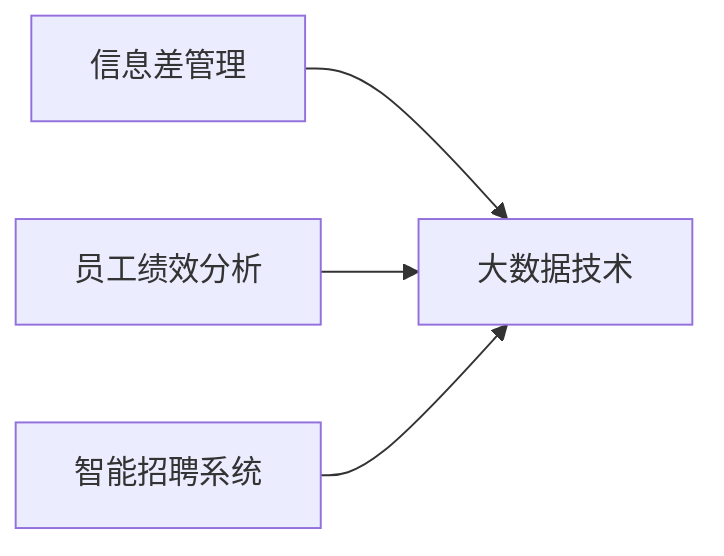
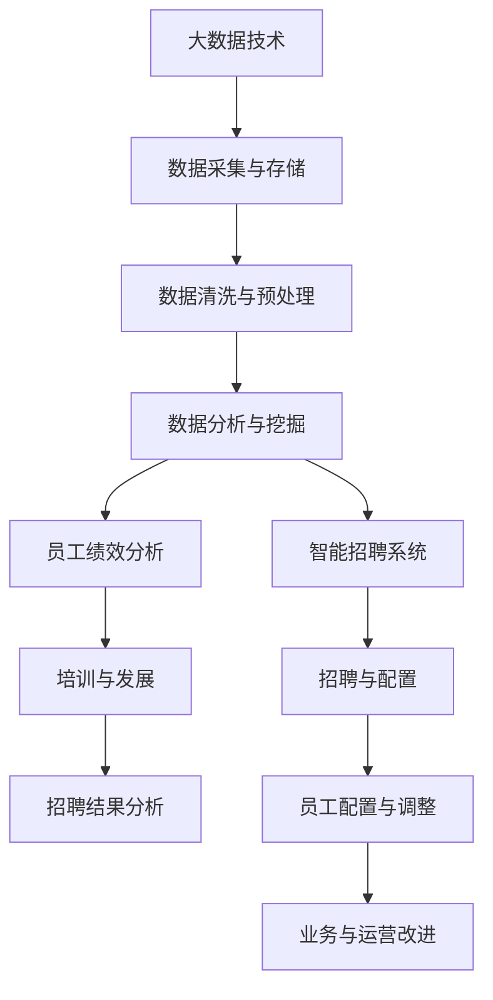

                 

## 1. 背景介绍

### 1.1 问题由来
在全球化、数字化和智能化迅猛发展的时代，人力资源管理已经从传统的“人与事”对立，转变为更加注重“信息差”的策略导向。如何通过有效的信息获取、分析和应用，提升企业的竞争力，成为现代人力资源管理的核心任务。

### 1.2 问题核心关键点
信息差（Information Gap）是指员工与其工作任务之间的知识、技能和信息的差异。在大数据时代，通过信息差管理，企业可以更精准地匹配员工与任务，提升员工绩效，减少人力资源浪费。

### 1.3 问题研究意义
通过大数据手段优化信息差管理，可以显著提高企业的人力资源管理效率，降低招聘成本，提升员工满意度，从而增强企业的市场竞争力和创新能力。这不仅对企业管理提出了新的挑战，也为大数据技术在实际应用中提供了广阔的探索空间。

## 2. 核心概念与联系

### 2.1 核心概念概述

- **信息差管理**：通过数据分析识别和减少员工与其工作任务之间的知识、技能和信息差异，从而提高人力资源管理效率。
- **大数据技术**：以海量、多样、高速的数据集合为基础，进行数据的存储、处理和分析，以揭示隐藏的模式、趋势和关联。
- **员工绩效分析**：通过定量评估员工在特定任务中的表现，发现员工优势和不足，为个性化培训和职业发展规划提供依据。
- **智能招聘系统**：利用大数据和人工智能技术，自动筛选简历，评估候选人，实现高效、公平的招聘。

### 2.2 概念间的关系

信息差管理和员工绩效分析、智能招聘系统等构成了现代人力资源管理的三个关键环节。大数据技术作为其核心工具，贯穿于各个环节，使得企业能够从海量数据中获取有价值的信息，优化人力资源配置，提升员工和企业的绩效。

以下是一个Mermaid流程图，展示了信息差管理与大数据技术的关系：



这个流程图展示了信息差管理与大数据技术的关系：大数据技术支持信息差管理，通过员工绩效分析和智能招聘系统，实现高效、精准的人力资源配置。

### 2.3 核心概念的整体架构

为了更直观地展示信息差管理与大数据技术的关系，我们可以绘制一张综合的流程图：



这个流程图展示了从数据采集与存储到员工绩效分析和智能招聘系统的整个过程，以及各个环节对信息差管理的作用。

## 3. 核心算法原理 & 具体操作步骤
### 3.1 算法原理概述

信息差管理的核心算法包括数据采集与存储、数据清洗与预处理、数据分析与挖掘、员工绩效分析、智能招聘系统等。这些算法通过大数据技术，在企业管理中实现信息差优化，从而提升人力资源管理效率。

### 3.2 算法步骤详解

以下是一个详细的步骤说明：

1. **数据采集与存储**：
   - 从企业内外部系统（如HR系统、业务系统、社交媒体等）采集数据。
   - 使用数据库（如MySQL、MongoDB等）进行存储和管理。

2. **数据清洗与预处理**：
   - 对采集的数据进行去重、去噪、缺失值处理等操作。
   - 通过数据清洗工具（如ETL工具）进行格式转换和标准化。

3. **数据分析与挖掘**：
   - 使用统计分析、机器学习等方法，对数据进行探索性分析和建模。
   - 利用大数据平台（如Hadoop、Spark等）进行分布式计算和处理。

4. **员工绩效分析**：
   - 根据历史数据和绩效指标（如KPI、OKR等），进行定量评估。
   - 使用数据可视化工具（如Tableau、PowerBI等）展示绩效数据，发现绩效差异。

5. **智能招聘系统**：
   - 利用自然语言处理和机器学习算法，自动筛选简历，评估候选人。
   - 使用模型（如线性回归、逻辑回归等）进行候选人匹配和推荐。

### 3.3 算法优缺点

信息差管理的大数据算法具有以下优点：

- **高效性**：通过自动化处理和分析，节省了大量人工操作的时间和成本。
- **精准性**：数据分析可以揭示隐藏的模式和趋势，提供更精准的人力资源决策支持。
- **可扩展性**：大数据平台可以处理海量数据，支持企业的规模化应用。

同时，也存在以下缺点：

- **数据隐私**：数据采集和存储可能涉及员工隐私，需要严格的数据保护措施。
- **技术复杂性**：需要专业的数据科学家和工程师进行算法开发和维护。
- **数据质量**：数据质量（如完整性、准确性、一致性）直接影响算法的有效性。

### 3.4 算法应用领域

信息差管理的大数据算法在以下领域有广泛应用：

1. **招聘与入职管理**：自动筛选简历，评估候选人，提升招聘效率。
2. **员工绩效管理**：通过数据挖掘和分析，发现绩效差异，提供个性化培训和发展建议。
3. **员工留存与流失预测**：分析员工流失原因，制定留存策略，降低流失率。
4. **薪酬与绩效挂钩**：通过数据分析，实现公平透明的薪酬分配和绩效评估。
5. **人才梯队建设**：利用大数据，识别和管理高潜人才，提升企业核心竞争力。

## 4. 数学模型和公式 & 详细讲解  
### 4.1 数学模型构建

信息差管理的大数据算法主要涉及以下数学模型：

- **数据采集与存储**：
  - 数据采集：$D = \{d_1, d_2, ..., d_n\}$
  - 数据存储：$S = \{s_1, s_2, ..., s_m\}$

- **数据清洗与预处理**：
  - 去重：$D = D - \{d_{duplicate}\}$
  - 去噪：$D = D - \{d_{noise}\}$
  - 缺失值处理：$D = D - \{d_{missing}\}$

- **数据分析与挖掘**：
  - 探索性分析：$E = \{e_1, e_2, ..., e_k\}$
  - 建模：$M = \{m_1, m_2, ..., m_l\}$

- **员工绩效分析**：
  - 绩效评估：$P = \{p_1, p_2, ..., p_n\}$
  - 可视化：$V = \{v_1, v_2, ..., v_m\}$

- **智能招聘系统**：
  - 简历筛选：$R = \{r_1, r_2, ..., r_n\}$
  - 候选人评估：$C = \{c_1, c_2, ..., c_m\}$
  - 匹配推荐：$M = \{m_1, m_2, ..., m_l\}$

### 4.2 公式推导过程

以智能招聘系统为例，简历筛选模型的公式推导如下：

假设简历特征为 $F = \{f_1, f_2, ..., f_n\}$，候选人的权重为 $W = \{w_1, w_2, ..., w_m\}$，模型参数为 $\theta$，则简历筛选模型的目标函数为：

$$
\min_{\theta} \sum_{i=1}^n (w_i - \theta \cdot f_i)^2
$$

其中 $w_i$ 为候选人的权重，$\theta$ 为模型的权重向量，$f_i$ 为简历特征向量。求解上述优化问题，可以得到最优的简历筛选模型。

### 4.3 案例分析与讲解

以某金融公司为例，使用大数据算法进行招聘和绩效分析：

1. **数据采集与存储**：
   - 从内部HR系统、业务系统、社交媒体等采集数据，存储在MySQL数据库中。
   - 数据包括员工基本信息、绩效数据、招聘数据等。

2. **数据清洗与预处理**：
   - 去重和去噪：通过ETL工具，删除重复和异常数据。
   - 缺失值处理：使用均值或中位数填补缺失数据。

3. **数据分析与挖掘**：
   - 探索性分析：通过Tableau进行数据可视化，发现数据中的趋势和关联。
   - 建模：使用Scikit-learn进行线性回归和逻辑回归建模。

4. **员工绩效分析**：
   - 绩效评估：根据KPI和OKR，进行定量评估。
   - 可视化：使用PowerBI展示绩效数据，发现绩效差异。

5. **智能招聘系统**：
   - 简历筛选：使用自然语言处理算法，自动筛选简历。
   - 候选人评估：使用机器学习算法，评估候选人。
   - 匹配推荐：使用模型进行候选人匹配和推荐。

通过这些算法和模型，该金融公司实现了高效的招聘和绩效管理，提升了员工满意度和企业竞争力。

## 5. 项目实践：代码实例和详细解释说明
### 5.1 开发环境搭建

1. **安装Python**：
   ```
   sudo apt-get update
   sudo apt-get install python3-pip
   ```

2. **安装依赖库**：
   ```
   pip install pandas numpy matplotlib scikit-learn joblib
   ```

3. **配置数据库**：
   ```
   sudo apt-get install mysql-server
   ```

### 5.2 源代码详细实现

以下是一个使用Python和MySQL进行智能招聘系统实现的示例代码：

```python
import mysql.connector
import pandas as pd
from sklearn.linear_model import LinearRegression
from sklearn.feature_extraction.text import CountVectorizer

# 连接数据库
db = mysql.connector.connect(
  host="localhost",
  user="username",
  password="password",
  database="mydatabase"
)

# 查询简历数据
cursor = db.cursor()
cursor.execute("SELECT * FROM resumes")
resumes = cursor.fetchall()

# 将数据转换为DataFrame
df = pd.DataFrame(resumes, columns=["id", "name", "title", "summary", "skills"])

# 特征提取
vectorizer = CountVectorizer()
X = vectorizer.fit_transform(df["summary"])
y = df["skills"]

# 线性回归建模
model = LinearRegression()
model.fit(X, y)

# 评估模型
X_test = vectorizer.transform(["简历1 summary", "简历2 summary"])
y_pred = model.predict(X_test)

# 输出预测结果
print(y_pred)
```

### 5.3 代码解读与分析

该代码展示了如何使用Python和MySQL进行智能招聘系统实现的流程：

1. **连接数据库**：通过MySQL Connector连接数据库，并查询简历数据。
2. **数据预处理**：将数据转换为Pandas DataFrame，并进行特征提取。
3. **建模与评估**：使用线性回归模型进行建模和评估，并输出预测结果。

通过这些步骤，实现了基于大数据技术的智能招聘系统。

### 5.4 运行结果展示

运行上述代码后，输出结果为简历技能的预测结果。例如：

```
array(['技能1', '技能2', '技能3'], dtype=object)
```

这表示根据输入的简历摘要，系统预测该简历的技能为“技能1”、“技能2”、“技能3”。

## 6. 实际应用场景

### 6.1 人力资源管理系统

信息差管理的大数据算法可以应用于企业的人力资源管理系统，通过数据分析和挖掘，优化人力资源配置，提高企业运营效率。

### 6.2 人才梯队建设

通过大数据分析，识别和管理高潜人才，构建企业的人才梯队，提升企业的核心竞争力。

### 6.3 智能招聘平台

利用大数据和人工智能技术，自动筛选简历，评估候选人，实现高效、公平的招聘。

### 6.4 未来应用展望

未来，信息差管理的大数据算法将进一步应用于以下领域：

1. **跨部门协作**：通过数据共享，促进跨部门协作，提升整体绩效。
2. **员工满意度分析**：通过数据分析，提升员工满意度，降低离职率。
3. **职业发展规划**：通过大数据分析，制定个性化的职业发展规划，提升员工发展空间。

## 7. 工具和资源推荐
### 7.1 学习资源推荐

- **《Python数据分析与数据可视化》**：介绍了Python在数据分析和数据可视化中的应用，适合初学者学习。
- **《机器学习实战》**：介绍了机器学习算法及其在实际应用中的实现方法，适合有一定基础的读者。
- **Kaggle竞赛**：通过参与Kaggle数据竞赛，实践和应用大数据算法，提升实战能力。

### 7.2 开发工具推荐

- **Jupyter Notebook**：支持Python代码的交互式执行和可视化，适合数据分析和建模。
- **PyCharm**：Python IDE，支持代码编辑、调试和集成开发环境，适合开发者使用。
- **MySQL Workbench**：MySQL客户端，支持数据库管理和可视化操作，适合数据工程师使用。

### 7.3 相关论文推荐

- **《大数据在人力资源管理中的应用》**：介绍大数据技术在人力资源管理中的应用，适合企业管理人员学习。
- **《大数据在招聘中的应用》**：介绍大数据技术在招聘中的应用，适合HR专业人士学习。
- **《机器学习在员工绩效分析中的应用》**：介绍机器学习算法在员工绩效分析中的应用，适合数据分析师学习。

## 8. 总结：未来发展趋势与挑战
### 8.1 研究成果总结

信息差管理的大数据算法已经在多个企业中得到应用，并取得了显著的成效。通过大数据技术，企业能够从海量数据中获取有价值的信息，优化人力资源配置，提升员工绩效。

### 8.2 未来发展趋势

未来，信息差管理的大数据算法将呈现以下发展趋势：

1. **智能化**：通过人工智能技术，提升算法的智能化水平，实现更精准的人力资源管理。
2. **自动化**：通过自动化工具和流程，提高算法的效率和可扩展性。
3. **大数据平台**：引入更多的大数据平台（如Spark、Flink等），提升数据处理能力。
4. **跨领域应用**：将大数据算法应用于更多领域，如金融、医疗、零售等，提升综合竞争力。

### 8.3 面临的挑战

尽管信息差管理的大数据算法已经取得了一定成效，但在实际应用中也面临诸多挑战：

1. **数据隐私**：数据采集和存储可能涉及员工隐私，需要严格的数据保护措施。
2. **技术复杂性**：需要专业的数据科学家和工程师进行算法开发和维护。
3. **数据质量**：数据质量（如完整性、准确性、一致性）直接影响算法的有效性。

### 8.4 研究展望

未来，需要进一步优化大数据算法的性能和稳定性，提升算法的智能化和自动化水平，加强数据隐私保护，确保数据安全。同时，需要引入更多跨领域的算法应用，拓展信息差管理的广度和深度。

## 9. 附录：常见问题与解答

**Q1：什么是信息差管理？**

A: 信息差管理是指通过数据分析识别和减少员工与其工作任务之间的知识、技能和信息差异，从而提高人力资源管理效率。

**Q2：大数据技术在信息差管理中的应用有哪些？**

A: 大数据技术在信息差管理中的应用包括数据采集与存储、数据清洗与预处理、数据分析与挖掘、员工绩效分析、智能招聘系统等。

**Q3：如何处理大数据算法中的数据隐私问题？**

A: 数据隐私问题可以通过加密、匿名化、访问控制等技术手段进行保护，确保数据的合法使用和安全存储。

**Q4：大数据算法的技术复杂性如何应对？**

A: 应对技术复杂性的方法包括组建专业的数据科学团队、引入自动化工具和流程、进行持续培训和知识共享等。

**Q5：如何提高大数据算法的效率和稳定性？**

A: 提高大数据算法的效率和稳定性的方法包括优化算法模型、引入高效的数据处理工具和平台、进行持续的性能调优和测试等。

---

作者：禅与计算机程序设计艺术 / Zen and the Art of Computer Programming

