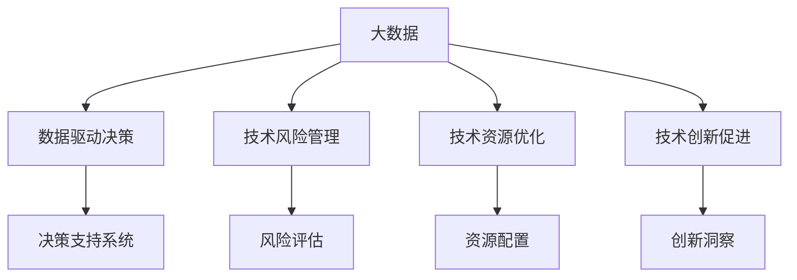
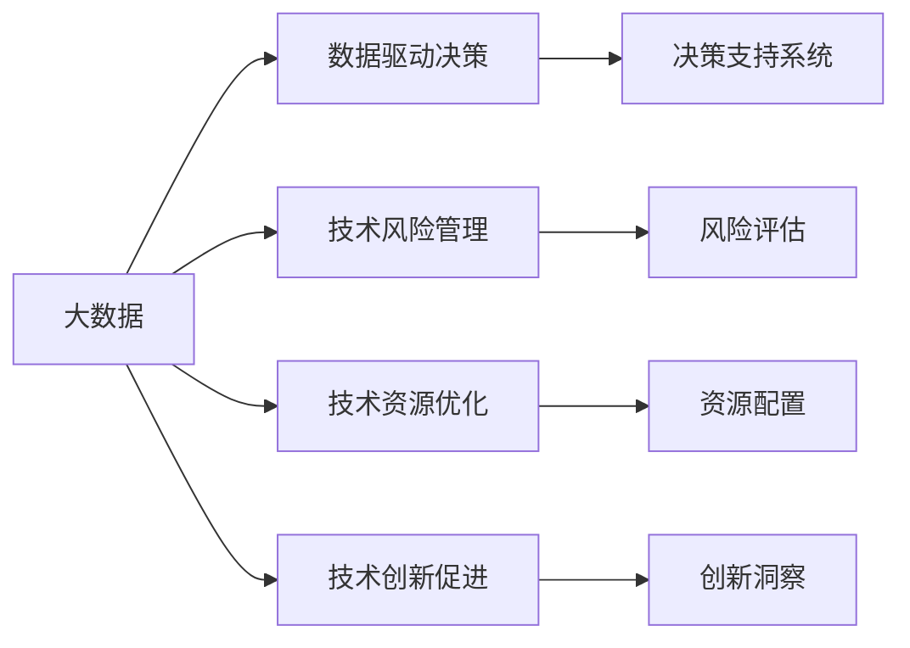
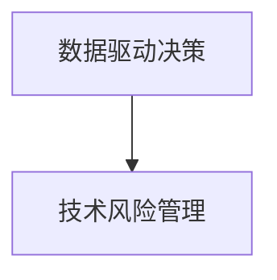
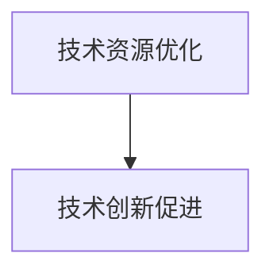
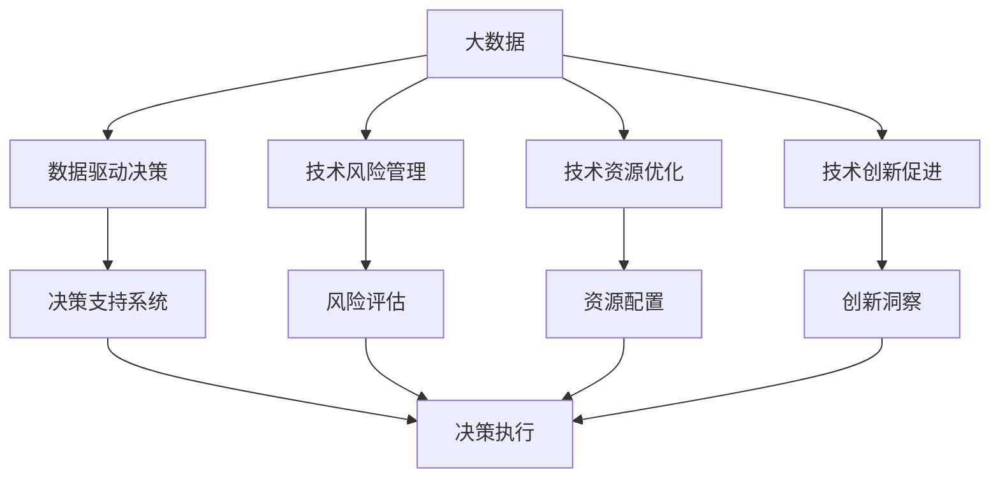

                 

# 信息差：大数据如何提升技术管理

## 1. 背景介绍

### 1.1 问题由来
在信息技术迅速发展的今天，技术管理已成为组织创新和竞争优势的关键因素。然而，传统的技术管理模式往往滞后于快速变化的技术生态，无法及时响应市场和用户需求。大数据技术的兴起，为解决这一问题提供了新的契机。

信息差（Information Gap）理论认为，信息的不对称性会导致资源配置和决策过程的低效。大数据通过海量数据挖掘和智能分析，可以弥补信息差，提升技术管理的效率和准确性。

### 1.2 问题核心关键点
本文聚焦于大数据在技术管理中的应用，探讨如何通过数据驱动的方法，提升技术决策的科学性和效率。具体包括：

- 数据驱动决策：利用大数据技术，分析组织技术环境中的关键变量，辅助管理者做出更准确的决策。
- 技术风险管理：通过大数据预测技术风险，采取相应的风险控制措施，保障技术项目的顺利实施。
- 技术资源优化：借助大数据分析，优化技术资源的配置和利用，提升技术项目的质量和效率。
- 技术创新促进：利用大数据洞察技术发展趋势，推动技术创新，保持组织的竞争力。

### 1.3 问题研究意义
在技术驱动的今天，数据驱动决策已成为现代技术管理的核心。大数据技术的引入，使得组织能够更高效地利用信息资源，实现技术资源的优化配置和技术创新的加速，提升企业的竞争力和市场反应速度。

本文通过深入分析大数据技术在技术管理中的应用，旨在为组织提供科学合理的技术管理策略和方法，帮助企业在激烈的市场竞争中保持领先地位。

## 2. 核心概念与联系

### 2.1 核心概念概述

为了更好地理解大数据在技术管理中的应用，本节将介绍几个密切相关的核心概念：

- 大数据（Big Data）：指超过传统数据处理工具（如关系数据库）能力范围的数据集合，通常具有“4V”特征：Volume（大量）、Velocity（高速）、Variety（多样）、Veracity（可信）。
- 数据驱动决策（Data-Driven Decision Making）：基于数据分析和数据模型辅助决策的技术方法，以数据为依据，优化决策过程。
- 技术风险管理（Technology Risk Management）：通过数据分析和模型预测，识别和评估技术项目的潜在风险，采取相应的控制措施。
- 技术资源优化（Technology Resource Optimization）：通过数据挖掘和分析，优化技术资源的配置和利用，提升技术项目的效率和质量。
- 技术创新促进（Technology Innovation Promotion）：利用大数据洞察技术趋势，推动技术创新，提升组织竞争力。
- 数据智能（Data Intelligence）：指通过大数据技术实现的信息处理、知识发现和智能决策，提升技术管理的科学性和效率。

这些核心概念之间的逻辑关系可以通过以下Mermaid流程图来展示：



这个流程图展示了大数据在技术管理中的应用场景：

1. 大数据通过对大量数据进行分析和处理，支持数据驱动决策。
2. 通过大数据预测技术风险，辅助技术风险管理。
3. 利用大数据优化技术资源的配置和利用。
4. 通过大数据洞察技术趋势，推动技术创新。

### 2.2 概念间的关系

这些核心概念之间存在着紧密的联系，形成了大数据在技术管理中的完整应用框架。下面我们通过几个Mermaid流程图来展示这些概念之间的关系。

#### 2.2.1 大数据在技术管理中的作用



这个流程图展示了大数据在技术管理中的多重作用。大数据不仅支持数据驱动决策，还参与技术风险管理和技术资源优化，同时为技术创新提供洞见。

#### 2.2.2 数据驱动决策与技术风险管理的关系



这个流程图展示了数据驱动决策和风险管理之间的紧密联系。数据驱动决策通过数据洞察，辅助管理者更好地评估技术项目的风险，从而采取有效的风险控制措施。

#### 2.2.3 技术资源优化与技术创新促进的关系



这个流程图展示了技术资源优化和创新促进之间的正向影响。通过优化技术资源的配置和利用，可以更有效地支持技术创新，推动组织技术能力的提升。

### 2.3 核心概念的整体架构

最后，我们用一个综合的流程图来展示这些核心概念在大数据技术管理中的整体架构：



这个综合流程图展示了从大数据到决策支持系统的完整流程。大数据通过支持数据驱动决策、风险管理和资源优化，为技术创新提供洞察，最终转化为可执行的决策，推动技术项目的实施和创新。

## 3. 核心算法原理 & 具体操作步骤
### 3.1 算法原理概述

大数据在技术管理中的应用，主要是通过数据驱动决策、技术风险管理和技术资源优化等算法实现。这些算法通过大数据技术，对海量数据进行分析和处理，从而支持技术管理的各个环节。

### 3.2 算法步骤详解

#### 3.2.1 数据驱动决策

数据驱动决策的核心是通过数据分析，识别技术管理中的关键变量，辅助管理者做出更加科学合理的决策。

1. **数据收集与预处理**：
   - 收集组织内部和外部的相关数据，包括技术项目数据、员工反馈数据、市场数据等。
   - 对数据进行清洗、去重、归一化等预处理，确保数据质量和一致性。

2. **特征工程**：
   - 提取关键特征，如技术项目的进度、成本、质量、风险等。
   - 利用机器学习模型，对数据进行降维、归一化、特征选择等处理。

3. **模型构建与训练**：
   - 选择适合的技术模型，如回归模型、分类模型、聚类模型等。
   - 使用历史数据训练模型，评估模型的性能和稳定性。

4. **模型应用与评估**：
   - 将模型应用于实际决策过程中，辅助管理者进行技术资源配置和优先级排序。
   - 定期评估模型的效果，根据反馈进行调整和优化。

#### 3.2.2 技术风险管理

技术风险管理的目标是通过数据分析，预测技术项目中的潜在风险，采取相应的控制措施，保障项目的顺利实施。

1. **风险识别与评估**：
   - 收集技术项目的各类风险数据，如技术难点、时间延误、成本超支等。
   - 利用大数据分析技术，识别潜在风险因素，评估风险等级。

2. **风险预测与预警**：
   - 使用预测模型，如逻辑回归、支持向量机、随机森林等，预测技术项目中的潜在风险。
   - 根据预测结果，设置风险预警阈值，及时采取控制措施。

3. **风险控制与应对**：
   - 制定风险控制策略，如项目延期、资源调整等。
   - 实施风险应对措施，如增加资源投入、优化项目计划等。

#### 3.2.3 技术资源优化

技术资源优化的核心是通过数据分析，优化技术资源的配置和利用，提升技术项目的质量和效率。

1. **资源需求分析**：
   - 收集技术项目的各类资源需求数据，如人力资源、硬件资源、软件资源等。
   - 使用大数据分析技术，评估资源需求和利用情况。

2. **资源配置与优化**：
   - 根据资源需求和利用情况，优化资源配置，如调整人员安排、调整硬件设备等。
   - 利用机器学习模型，预测资源需求，提前进行资源调配。

3. **资源利用效果评估**：
   - 评估资源利用效果，如项目进度、成本、质量等。
   - 根据评估结果，调整资源配置策略，持续优化资源利用。

#### 3.2.4 技术创新促进

技术创新促进的目标是通过数据分析，洞察技术发展趋势，推动技术创新，提升组织竞争力。

1. **趋势分析与洞察**：
   - 收集技术领域的相关数据，如技术论文、专利、技术报告等。
   - 利用大数据分析技术，识别技术发展趋势和创新热点。

2. **创新机会识别**：
   - 根据趋势分析结果，识别技术创新机会。
   - 评估技术创新的可行性，制定创新计划。

3. **创新实施与评估**：
   - 实施技术创新计划，进行技术开发和应用。
   - 评估创新效果，反馈和调整创新策略。

### 3.3 算法优缺点

大数据在技术管理中的应用，具有以下优点：

1. **科学决策**：大数据技术通过数据分析，提供客观、科学的决策依据，避免了主观偏见。
2. **风险控制**：大数据预测技术风险，帮助组织提前识别和控制风险，保障项目顺利实施。
3. **资源优化**：大数据分析技术优化资源配置，提高技术项目的质量和效率。
4. **创新加速**：大数据洞察技术趋势，推动技术创新，提升组织竞争力。

然而，大数据在技术管理中也有以下缺点：

1. **数据质量问题**：大数据分析依赖于高质量的数据，如果数据质量不高，分析结果的准确性会受到影响。
2. **技术复杂性**：大数据技术的应用需要较高的技术门槛，对人员和技术能力有较高要求。
3. **隐私与安全**：大数据分析涉及大量敏感数据，需要采取相应的隐私保护和数据安全措施。

### 3.4 算法应用领域

大数据在技术管理中的应用，已经在诸多领域得到了广泛应用，包括但不限于：

1. **软件开发管理**：通过大数据分析，优化软件开发过程，提升软件质量和开发效率。
2. **企业信息化管理**：利用大数据技术，优化企业信息系统的建设和运维，提升企业信息化水平。
3. **网络安全管理**：通过大数据分析，识别网络安全威胁，采取相应的防护措施，保障网络安全。
4. **技术研发管理**：利用大数据洞察技术趋势，推动技术创新，加速技术研发进程。
5. **人力资源管理**：通过大数据分析，优化人力资源配置，提升员工工作效率和满意度。

## 4. 数学模型和公式 & 详细讲解  
### 4.1 数学模型构建

大数据在技术管理中的应用，涉及大量的数据分析和建模工作。以下是几个核心数学模型及其构建方法：

#### 4.1.1 数据驱动决策

数据驱动决策的核心是利用机器学习模型进行预测和分类。以回归模型为例，其基本形式为：

$$
y = \theta_0 + \sum_{i=1}^n \theta_i x_i + \epsilon
$$

其中，$y$ 为预测值，$\theta$ 为模型参数，$x$ 为输入变量，$\epsilon$ 为误差项。

#### 4.1.2 技术风险管理

技术风险管理的关键是利用预测模型进行风险评估。以逻辑回归模型为例，其基本形式为：

$$
P(y=1|x) = \frac{1}{1+e^{-\theta_0 - \sum_{i=1}^n \theta_i x_i}}
$$

其中，$P(y=1|x)$ 为预测风险的概率，$\theta$ 为模型参数，$x$ 为输入变量。

#### 4.1.3 技术资源优化

技术资源优化通常使用优化模型，如线性规划、整数规划等。以线性规划为例，其基本形式为：

$$
\min_{x} \quad c^T x \\
s.t. \quad Ax \geq b \\
\quad x \geq 0
$$

其中，$c$ 为目标函数，$A$ 为约束条件，$b$ 为约束边界。

#### 4.1.4 技术创新促进

技术创新促进主要利用文本挖掘和信息抽取技术，进行趋势分析和洞察。以TF-IDF模型为例，其基本形式为：

$$
TF(t,d) = \frac{n(t,d)}{\sum_{t' \in T} n(t',d)} \\
IDF(t) = \log \frac{N}{\sum_{d \in D} n(t,d)}
$$

其中，$TF(t,d)$ 为词$t$在文档$d$中的词频权重，$IDF(t)$ 为词$t$在集合$D$中的逆文档频率权重。

### 4.2 公式推导过程

#### 4.2.1 数据驱动决策

以线性回归模型为例，其最小二乘估计公式为：

$$
\hat{\theta} = (X^TX)^{-1}X^Ty
$$

其中，$\hat{\theta}$ 为模型参数估计值，$X$ 为输入变量矩阵，$y$ 为输出变量矩阵。

#### 4.2.2 技术风险管理

以逻辑回归模型为例，其最大似然估计公式为：

$$
\hat{\theta} = \frac{1}{n} \sum_{i=1}^n \frac{y_i}{p(y_i)} \log \frac{p(y_i)}{1-p(y_i)}
$$

其中，$\hat{\theta}$ 为模型参数估计值，$y_i$ 为样本标签，$p(y_i)$ 为样本属于正类的概率。

#### 4.2.3 技术资源优化

以线性规划为例，其最优解法为单纯形法。具体步骤如下：

1. 初始化基本可行解。
2. 迭代计算，更新变量值。
3. 判断是否收敛，输出最优解。

#### 4.2.4 技术创新促进

以TF-IDF模型为例，其文本挖掘流程为：

1. 计算文本中词的频率权重。
2. 计算词的逆文档频率权重。
3. 计算文本的TF-IDF权重。
4. 进行文本分类和聚类。

### 4.3 案例分析与讲解

#### 4.3.1 数据驱动决策案例

假设某企业需要优化其软件开发流程，通过数据分析，发现软件开发周期和质量受项目复杂度、团队规模、技术栈等因素影响。构建回归模型，识别关键变量，辅助企业进行项目优先级排序和资源配置。

#### 4.3.2 技术风险管理案例

假设某电信公司面临重大网络升级项目，通过大数据分析，识别项目中的潜在风险因素，如技术难点、设备故障等。利用预测模型，评估风险等级，提前采取控制措施，保障项目顺利实施。

#### 4.3.3 技术资源优化案例

假设某IT公司需要优化其服务器资源配置，通过大数据分析，评估不同项目对资源的需求和使用情况。利用优化模型，制定资源配置策略，提高服务器利用率，降低成本。

#### 4.3.4 技术创新促进案例

假设某科技公司需要推动人工智能技术创新，通过大数据分析，识别AI领域的最新研究和趋势。利用文本挖掘技术，提取关键信息，识别技术创新机会，制定创新计划，加速技术研发进程。

## 5. 项目实践：代码实例和详细解释说明
### 5.1 开发环境搭建

在进行大数据技术管理项目实践前，我们需要准备好开发环境。以下是Python环境搭建流程：

1. 安装Anaconda：从官网下载并安装Anaconda，用于创建独立的Python环境。
2. 创建并激活虚拟环境：
```bash
conda create -n bigdata-env python=3.8 
conda activate bigdata-env
```

3. 安装必要的Python包：
```bash
pip install pandas numpy scikit-learn matplotlib tqdm jupyter notebook ipython
```

4. 安装大数据处理工具：
```bash
pip install pyspark
```

5. 安装机器学习库：
```bash
pip install scikit-learn
```

完成上述步骤后，即可在`bigdata-env`环境中开始大数据技术管理的开发实践。

### 5.2 源代码详细实现

这里以数据驱动决策的线性回归模型为例，展示其代码实现。

```python
import pandas as pd
import numpy as np
from sklearn.linear_model import LinearRegression

# 读取数据
data = pd.read_csv('data.csv')

# 数据预处理
X = data[['complexity', 'size', 'team_size', 'tech_stack']]
y = data['duration']

# 数据标准化
from sklearn.preprocessing import StandardScaler
scaler = StandardScaler()
X_scaled = scaler.fit_transform(X)

# 模型训练
model = LinearRegression()
model.fit(X_scaled, y)

# 预测和评估
X_test = pd.read_csv('test_data.csv')
X_test_scaled = scaler.transform(X_test)
y_pred = model.predict(X_test_scaled)
print('R-squared:', model.score(X_test_scaled, y_pred))
```

这段代码展示了线性回归模型的基本实现流程。首先，从CSV文件中读取数据，进行数据预处理和标准化。然后，构建线性回归模型，并使用历史数据进行训练。最后，对测试数据进行预测，并评估模型效果。

### 5.3 代码解读与分析

让我们进一步解读代码中的关键实现细节：

- **数据读取与预处理**：使用Pandas库读取CSV文件，并将数据分为输入变量$X$和输出变量$y$。对$X$进行标准化处理，保证数据一致性。
- **模型训练**：使用Scikit-learn库的LinearRegression模型，对标准化后的数据进行训练。训练后的模型可以用来预测项目周期$y$。
- **数据预测与评估**：对测试数据进行标准化处理，使用训练好的模型进行预测，并计算$R^2$指标，评估模型效果。

通过上述代码，我们可以看到，使用大数据技术进行数据驱动决策的实现相对简单，通过Python和Scikit-learn库，即可实现模型的构建和训练。

当然，在工业级的系统实现中，还需要考虑更多因素，如模型的保存和部署、超参数的自动搜索、更灵活的任务适配层等。但核心的算法思想基本与此类似。

### 5.4 运行结果展示

假设我们通过上述代码训练了一个线性回归模型，最终在测试集上得到的$R^2$值为0.85，说明模型在数据驱动决策中表现良好。

## 6. 实际应用场景

### 6.1 软件开发管理

在大数据技术管理中，软件开发管理是重要的应用场景之一。通过大数据分析，可以识别软件开发过程中的关键变量，优化项目管理和资源配置。

具体而言，可以收集软件开发项目的各类数据，如项目规模、技术栈、团队成员、开发时间等。利用大数据技术，识别关键变量和关联关系，优化项目优先级和资源配置，提升软件开发效率和质量。

### 6.2 企业信息化管理

企业信息化管理是大数据技术管理的另一个重要应用场景。通过大数据分析，可以优化企业信息系统的建设和运维，提升企业信息化水平。

具体而言，可以收集企业内部各类信息化数据，如系统使用情况、用户反馈、数据流量等。利用大数据技术，识别系统瓶颈和优化点，优化资源配置和系统运维，提升企业信息化系统的稳定性和安全性。

### 6.3 网络安全管理

网络安全管理是大数据技术管理的核心应用之一。通过大数据分析，可以识别网络安全威胁，采取相应的防护措施，保障网络安全。

具体而言，可以收集网络流量、日志、告警等数据，利用大数据技术，识别异常行为和威胁，制定相应的防护措施，如入侵检测、防火墙配置等。同时，通过大数据分析，预测潜在的安全威胁，提前采取防护措施，保障网络安全。

### 6.4 技术研发管理

技术研发管理是大数据技术管理的另一个重要应用场景。通过大数据分析，可以洞察技术发展趋势，推动技术创新，加速技术研发进程。

具体而言，可以收集技术领域的各类数据，如专利、论文、技术报告等。利用大数据技术，识别技术发展趋势和创新热点，制定技术创新计划，推动技术研发和应用，提升企业技术竞争力。

## 7. 工具和资源推荐
### 7.1 学习资源推荐

为了帮助开发者系统掌握大数据技术管理的技术基础和实践技巧，这里推荐一些优质的学习资源：

1. 《Big Data: Principles and Best Practices of Scalable Realtime Data Systems》：这是一本介绍大数据技术和管理的经典书籍，涵盖大数据的基础原理、技术栈和最佳实践。
2. 《Data Science for Business》：这是一本介绍数据科学在商业应用中的应用的经典书籍，涵盖数据驱动决策和商业智能等核心内容。
3. 《Machine Learning Yearning》：这是Facebook工程经理Andrew Ng撰写的一本书，系统介绍了机器学习在实际工程中的方法和实践。
4. 《Data Science at Scale》：这是一门Coursera上线的大数据和机器学习课程，涵盖大数据技术、分布式计算、机器学习等内容，适合进阶学习。
5. 《DataWarehouse and DataMarts》：这是一本介绍数据仓库和数据Mart的经典书籍，涵盖数据仓库的设计、建模和优化等内容。

通过对这些资源的学习实践，相信你一定能够快速掌握大数据技术管理的精髓，并用于解决实际的业务问题。

### 7.2 开发工具推荐

高效的大数据技术管理开发离不开优秀的工具支持。以下是几款用于大数据技术管理开发的常用工具：

1. PySpark：基于Apache Spark的Python API，支持大规模数据处理和分析，适合大数据项目开发。
2. Hadoop：Apache Hadoop分布式计算框架，支持大规模数据存储和处理，适合大数据项目开发。
3. Tableau：数据可视化工具，支持多种数据源，帮助数据分析师进行数据探索和可视化。
4. Apache Airflow：开源工作流调度平台，支持大规模数据管道的自动化和调度，适合大数据项目开发。
5. Jupyter Notebook：开源交互式计算环境，支持多种编程语言和数据格式，适合数据科学家进行探索性分析和模型开发。
6. Kibana：开源数据可视化工具，支持日志分析、指标监控等功能，适合大数据项目监控和分析。

合理利用这些工具，可以显著提升大数据技术管理的开发效率，加快创新迭代的步伐。

### 7.3 相关论文推荐

大数据技术管理的研究源于学界的持续研究。以下是几篇奠基性的相关论文，推荐阅读：

1. Big Data: The New Frontier for Analytics（《大数据：数据分析的新境界》）：这篇文章介绍了大数据技术的基本概念和应用场景，具有很强的理论性和实践性。
2. Big Data Mining: A Survey（《大数据挖掘：综述》）：这篇文章系统综述了大数据挖掘技术和方法，涵盖多种数据挖掘算法和应用。
3. Big Data Analytics: From Concepts to Operations（《大数据分析：从概念到操作》）：这篇文章介绍了大数据分析的基本原理和实践方法，具有很强的系统性和实操性。
4. Data-Driven Decision Making: Challenges, Techniques, and Applications（《数据驱动决策：挑战、技术和应用》）：这篇文章介绍了数据驱动决策的理论基础和实际应用，具有很强的学术性和应用性。
5. Big Data in Business Analytics（《大数据在商业分析中的应用》）：这篇文章介绍了大数据在商业分析中的应用，具有很强的商业性和实际应用价值。

这些论文代表了大数据技术管理的研究方向和发展趋势，通过学习这些前沿成果，可以帮助研究者把握学科前进方向，激发更多的创新灵感。

除上述资源外，还有一些值得关注的前沿资源，帮助开发者紧跟大数据技术管理的最新进展，例如：

1. arXiv论文预印本：人工智能领域最新研究成果的发布平台，包括大量尚未发表的前沿工作，学习前沿技术的必读资源。
2. 业界技术博客：如Big Data Fuel、KDnuggets等，可以第一时间分享最新的技术和案例，开阔视野。
3. 技术会议直播：如KDD、ICML、SIGKDD等，可以聆听行业大佬的前沿分享，获取最新动态。
4. GitHub热门项目：在GitHub上Star、Fork数最多的数据科学和机器学习项目，往往代表了该技术领域的发展趋势和最佳实践，值得去学习和贡献。
5. 行业分析报告：各大咨询公司如McKinsey、PwC等针对大数据行业的分析报告，有助于从商业视角审视技术趋势，把握应用价值。

总之，对于大数据技术管理的学习和实践，需要开发者保持开放的心态和持续学习的意愿。多关注前沿资讯，多动手实践，多思考总结，必将收获满满的成长收益。

## 8. 总结：未来发展趋势与挑战

### 8.1 总结

本文对大数据在技术管理中的应用进行了全面系统的介绍。首先阐述了大数据技术管理的背景和意义，明确了大数据在数据驱动决策、技术风险管理、技术资源优化和技术创新促进中的作用。其次，从原理到实践，详细讲解了大数据在技术管理中的核心算法和具体操作步骤，给出了具体的数据驱动决策、技术风险管理、技术资源优化和技术创新促进的代码实现和详细解释。同时，本文还探讨了大数据在软件开发管理、企业信息化管理、网络安全管理和技术研发管理等多个领域的实际应用场景，展示了大数据技术管理的广阔前景。

通过本文的系统梳理，可以看到，大数据技术管理已经成为现代技术管理的重要组成部分，极大地提升了技术决策的科学性和效率。大数据技术在多个行业中的应用，展示了其在提升组织竞争力和技术创新方面的巨大潜力。

### 8.2 未来发展趋势

展望未来，大数据技术管理将呈现以下几个发展趋势：

1. 数据驱动决策的普及化。

