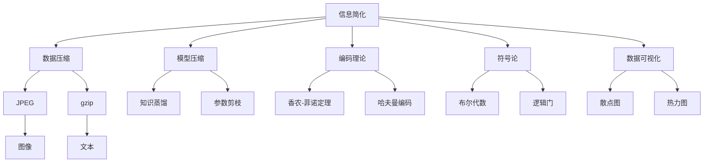
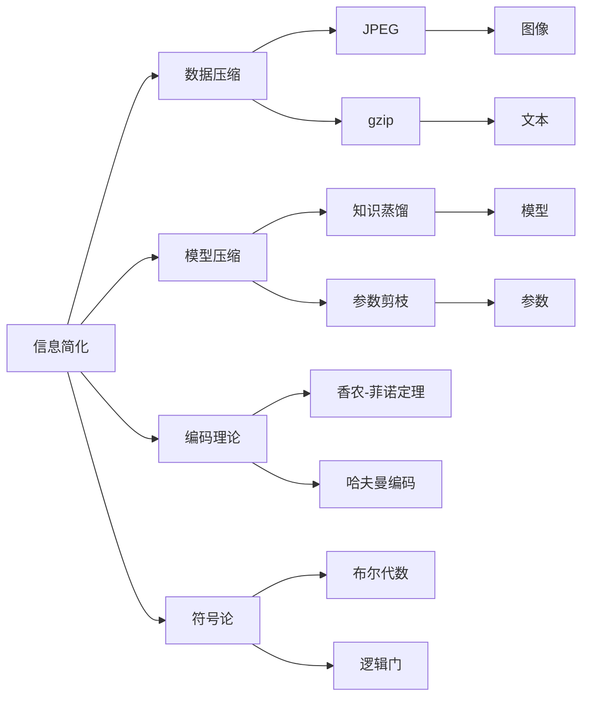
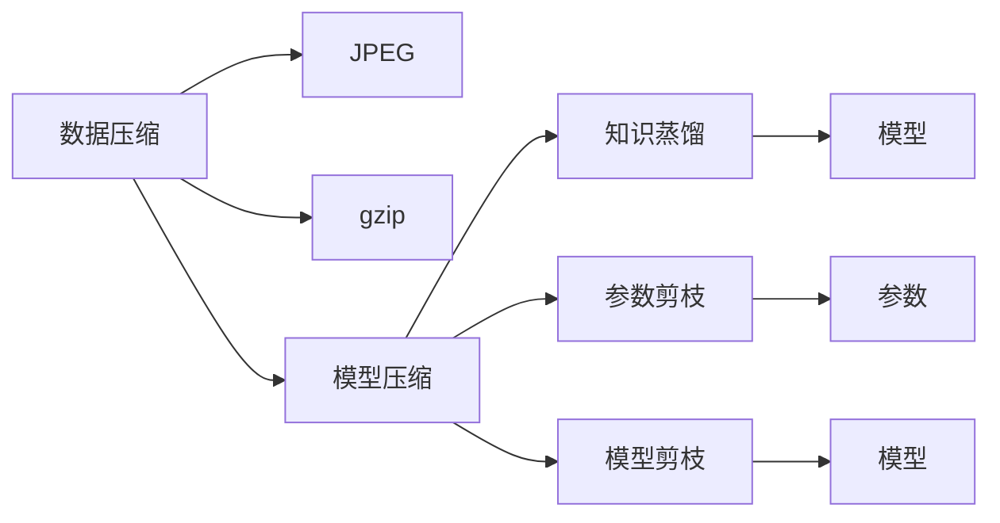
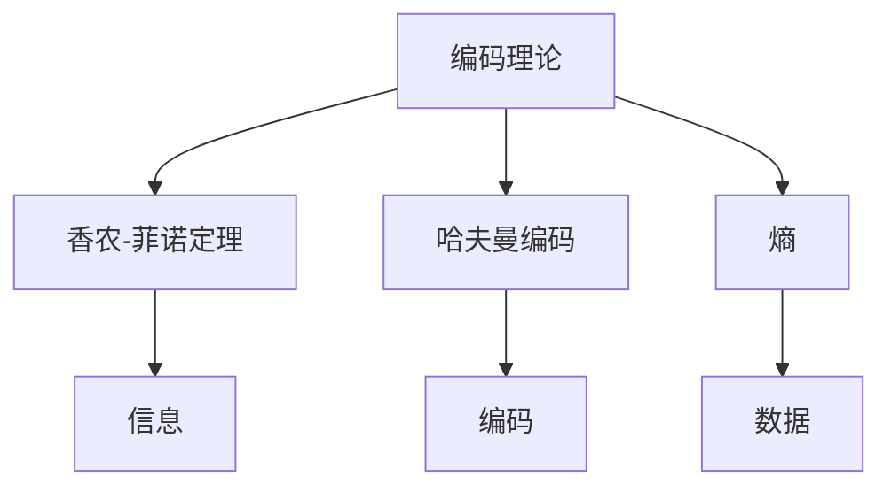

                 

# 信息简化的好处与挑战：简化复杂性的艺术与科学

> 关键词：信息简化, 数据压缩, 模型压缩, 编码理论, 符号论, 数据可视化

## 1. 背景介绍

### 1.1 问题由来
在现代信息时代，数据量呈爆炸式增长，如何有效管理和处理海量信息成为我们面临的重大挑战。随着数据驱动决策的普及，信息简化变得愈发重要。然而，过度简化可能导致信息丢失，而复杂化则可能带来处理上的困难和资源消耗。本节将探讨信息简化的益处与挑战，强调在简化与复杂性间找到最佳平衡点。

### 1.2 问题核心关键点
信息简化的核心关键点包括：
- 如何定义简化与复杂性
- 信息简化的标准和度量
- 简化过程中可能出现的信息损失与冗余
- 简化在不同领域的应用，如数据压缩、模型压缩、信息检索等
- 在保持信息完整性的同时，如何实现高效的信息处理和传输

### 1.3 问题研究意义
理解信息简化的过程和挑战，对于构建高效、可靠的信息系统，以及提升人类对海量数据的管理能力，具有重要意义：

1. **提高信息处理效率**：简化复杂数据结构，提升数据处理的效率，减少计算资源消耗。
2. **减少存储空间需求**：通过数据压缩和模型压缩，降低存储和传输成本。
3. **提升用户体验**：简化信息展示方式，增强用户对信息的理解和互动。
4. **优化决策过程**：在简化数据的同时，提高信息分析的准确性和速度。
5. **推动技术进步**：研究信息简化的技术，促进数据科学、机器学习等领域的发展。

## 2. 核心概念与联系

### 2.1 核心概念概述

为更好地理解信息简化的好处与挑战，本节将介绍几个密切相关的核心概念：

- **信息简化(Information Simplification)**：指通过去除或重组数据、模型中的冗余信息，使其更易于处理和理解的过程。常见的信息简化方法包括数据压缩、模型压缩、特征选择等。
- **数据压缩(Data Compression)**：指将原始数据转换为更紧凑、更易处理的形式，如JPEG、PNG等图像压缩，以及gzip、bzip2等文本压缩。
- **模型压缩(Model Compression)**：指通过减少模型参数、减少计算量等手段，提升模型的运行效率，常见的方法包括知识蒸馏、参数剪枝、模型剪枝等。
- **编码理论(Encoding Theory)**：研究如何在有限的空间中有效编码和传输信息，如香农-菲诺定理、哈夫曼编码、熵等。
- **符号论(Symbolics)**：研究符号和逻辑的关系，以及符号如何用来表示和处理信息。
- **数据可视化(Data Visualization)**：通过图形、图像等直观方式展示数据，提升数据的可理解性和可用性。

这些核心概念之间的逻辑关系可以通过以下Mermaid流程图来展示：



这个流程图展示了我文章的核心概念及其之间的关系：

1. 信息简化贯穿数据压缩、模型压缩、编码理论、符号论和数据可视化等多个领域。
2. 数据压缩通过压缩技术减少数据的存储空间需求，模型压缩通过减少模型复杂度提高运行效率。
3. 编码理论研究如何有效编码信息，符号论研究如何通过符号表示信息，这两者都与信息简化密切相关。
4. 数据可视化通过图形展示提升数据理解性，但本身不涉及简化过程。

### 2.2 概念间的关系

这些核心概念之间存在着紧密的联系，形成了信息简化的完整生态系统。下面我通过几个Mermaid流程图来展示这些概念之间的关系。

#### 2.2.1 信息简化的学习范式



这个流程图展示了信息简化的基本原理，以及它与其他核心概念的关系。

#### 2.2.2 数据压缩与模型压缩的联系



这个流程图展示了数据压缩和模型压缩的紧密联系。

#### 2.2.3 编码理论与符号论的关系



这个流程图展示了编码理论与符号论之间的联系，特别是如何通过符号来编码和传输信息。

## 3. 核心算法原理 & 具体操作步骤
### 3.1 算法原理概述

信息简化的核心原理是通过去除冗余信息，使得数据或模型更易于处理和理解。常见的简化方法包括数据压缩、模型压缩、特征选择等。

以数据压缩为例，其基本原理是通过编码算法将原始数据转换为更紧凑的形式，从而减少存储空间需求。常用的数据压缩算法包括哈夫曼编码、LZ77、LZW等。

模型压缩则是通过减少模型参数、降低模型复杂度，提升模型运行效率。常见的模型压缩方法包括知识蒸馏、参数剪枝、模型剪枝等。知识蒸馏通过将大模型的知识迁移到小模型，减少小模型的训练时间和存储空间。参数剪枝通过删除模型中不重要参数，减小模型规模。模型剪枝通过去除冗余的计算图节点，减少计算量。

### 3.2 算法步骤详解

信息简化的具体步骤通常包括以下几个关键环节：

1. **数据预处理**：对原始数据进行清洗、归一化等预处理操作，去除噪声和异常值，提升数据质量。
2. **选择压缩算法**：根据数据类型和应用需求选择合适的压缩算法，如哈夫曼编码适用于文本数据，LZ77适用于图像数据。
3. **应用压缩算法**：对数据进行压缩，生成压缩后的数据。
4. **应用压缩后的数据**：在存储和传输过程中使用压缩后的数据，降低存储和传输成本。
5. **解压缩**：在需要时对压缩后的数据进行解压缩，还原成原始数据。

以模型压缩为例，具体的步骤包括：

1. **模型预训练**：使用大规模数据预训练模型，使其具有一定的知识。
2. **选择压缩策略**：根据模型复杂度和应用需求选择合适的压缩策略，如知识蒸馏、参数剪枝等。
3. **应用压缩策略**：对模型进行压缩，减小模型参数量和计算量。
4. **应用压缩后的模型**：在推理过程中使用压缩后的模型，提升推理速度和资源利用率。
5. **重新训练**：如果需要，对压缩后的模型进行微调，提升模型性能。

### 3.3 算法优缺点

信息简化的主要优点包括：

1. **提升效率**：通过去除冗余信息，降低数据和模型存储和处理成本，提升计算效率。
2. **减少资源消耗**：降低存储空间和计算资源需求，提升系统响应速度。
3. **增强可理解性**：简化后的数据和模型更易于理解和维护。
4. **提升用户体验**：通过减少处理时间，提升用户体验。

信息简化的主要缺点包括：

1. **可能导致信息损失**：简化过程中可能去除重要信息，影响数据和模型的准确性。
2. **需要选择合适的简化方法**：不同数据和模型类型适合不同的简化方法，选择合适的简化方法需要经验。
3. **可能需要额外的处理**：简化后的数据和模型可能需要额外的处理才能正确使用。
4. **可能增加复杂性**：过度简化可能导致信息丢失，反而增加处理复杂性。

### 3.4 算法应用领域

信息简化方法在多个领域都有广泛应用：

- **数据存储与传输**：在数据存储和传输过程中，使用压缩算法减少存储空间和传输成本。
- **模型优化**：在深度学习模型中，通过模型压缩和参数剪枝，提升模型运行效率。
- **特征选择**：在机器学习中，通过特征选择去除冗余特征，提升模型性能和解释性。
- **信息检索**：通过文本压缩，减少查询数据体积，提升信息检索效率。
- **图像处理**：在图像压缩中，使用JPEG、PNG等算法，减少图像存储空间。

## 4. 数学模型和公式 & 详细讲解 & 举例说明

### 4.1 数学模型构建

以数据压缩为例，其数学模型可以定义为：

- **输入数据**：$X \in \mathcal{X}$，其中$\mathcal{X}$为数据空间。
- **压缩算法**：$f: \mathcal{X} \rightarrow \mathcal{X'}$，将原始数据$X$压缩为压缩后的数据$X'$。
- **输出数据**：$X' \in \mathcal{X'}$，其中$\mathcal{X'}$为压缩后的数据空间。

假设压缩算法$f$的压缩比率为$R$，即$|X'| \leq R|X|$。则压缩后的数据$X'$与原始数据$X$的关系可以表示为：

$$
X' = f(X)
$$

其中$|X|$和$|X'|$分别为原始数据和压缩后数据的长度（单位为比特）。

### 4.2 公式推导过程

以哈夫曼编码为例，其基本原理是通过构建哈夫曼树，将符号序列转换为二进制编码序列。假设输入符号序列为$S = s_1s_2 \dots s_n$，其中$s_i$为第$i$个符号，$P_i$为$s_i$的概率。哈夫曼编码的过程可以如下推导：

1. **构建哈夫曼树**：
   - 根据符号概率构建哈夫曼树，叶子节点对应符号，内部节点对应编码。
   - 对于节点$i$，其左子树表示$s_i$出现概率较小，右子树表示$s_i$出现概率较大。

2. **生成编码表**：
   - 从根节点开始，按照从左到右的顺序，生成符号的哈夫曼编码。
   - 对于节点$i$，左子树生成的编码为0，右子树生成的编码为1。

3. **编码和解码**：
   - 将符号序列转换为编码序列，即$E = e_1e_2 \dots e_n$，其中$e_i$为$s_i$的哈夫曼编码。
   - 将编码序列转换为符号序列，即$D = d_1d_2 \dots d_n$，其中$d_i$为编码序列$e_i$对应的符号。

### 4.3 案例分析与讲解

以JPEG压缩为例，其基本原理是通过离散余弦变换(DCT)将彩色图像转换为频域表示，然后对频域系数进行量化和熵编码。假设输入图像为$I$，其中每个像素表示为$(X,Y)$，图像大小为$N \times M$。JPEG压缩的过程可以如下推导：

1. **DCT变换**：
   - 对图像进行二维离散余弦变换，得到频域系数$C$。
   - $C$的维度为$N \times M$，每个系数表示为$C(i,j)$。

2. **量化**：
   - 对频域系数进行量化，得到量化系数$Q$。
   - $Q$的维度为$\lfloor N/8 \rfloor \times \lfloor M/8 \rfloor$，每个系数表示为$Q(i,j)$。

3. **熵编码**：
   - 对量化系数进行熵编码，生成压缩后的数据$J$。
   - $J$的大小为$\lfloor N/8 \rfloor \times \lfloor M/8 \rfloor$，每个系数表示为$J(i,j)$。

## 5. 项目实践：代码实例和详细解释说明

### 5.1 开发环境搭建

在进行信息简化实践前，我们需要准备好开发环境。以下是使用Python进行PyTorch开发的环境配置流程：

1. 安装Anaconda：从官网下载并安装Anaconda，用于创建独立的Python环境。

2. 创建并激活虚拟环境：
```bash
conda create -n pytorch-env python=3.8 
conda activate pytorch-env
```

3. 安装PyTorch：根据CUDA版本，从官网获取对应的安装命令。例如：
```bash
conda install pytorch torchvision torchaudio cudatoolkit=11.1 -c pytorch -c conda-forge
```

4. 安装各类工具包：
```bash
pip install numpy pandas scikit-learn matplotlib tqdm jupyter notebook ipython
```

完成上述步骤后，即可在`pytorch-env`环境中开始信息简化实践。

### 5.2 源代码详细实现

下面我们以JPEG图像压缩为例，给出使用PyTorch实现JPEG压缩的代码实现。

```python
import torch
from torchvision import transforms
from PIL import Image

def compress_image(image_path, quality):
    # 加载图像
    image = Image.open(image_path)

    # 图像预处理
    preprocess = transforms.Compose([
        transforms.Resize((256, 256)),
        transforms.ToTensor(),
        transforms.Normalize(mean=[0.485, 0.456, 0.406], std=[0.229, 0.224, 0.225])
    ])

    # 将图像转换为张量
    image_tensor = preprocess(image)

    # 应用JPEG压缩
    compressed_tensor = torch.jit.script(torch.ops.quantized_jpeg.quality_compress(image_tensor, quality))

    # 将压缩后的张量转换为PIL图像
    compressed_image = transforms.ToPILImage()(compressed_tensor)

    # 保存图像
    compressed_image.save(f'{image_path}_compressed.png')

    return compressed_tensor
```

在这个代码中，我们使用了PyTorch的`torchvision`库来进行图像预处理，使用`torch`的`jit.script`方法将`torch.ops.quantized_jpeg`的`quality_compress`函数应用到图像张量上，实现JPEG压缩。

### 5.3 代码解读与分析

让我们再详细解读一下关键代码的实现细节：

- `transforms.Compose`：用于组合一系列的图像预处理操作，实现图片尺寸的缩放、归一化等操作。
- `transforms.Resize`：将图像调整为指定大小。
- `transforms.ToTensor`：将图像转换为张量。
- `transforms.Normalize`：对图像进行归一化处理。
- `torch.jit.script`：将函数转换为可脚本化的函数，方便后续的动态图优化。
- `torch.ops.quantized_jpeg`：提供了JPEG压缩和解压的函数。

可以看到，使用PyTorch实现图像压缩非常简单，只需要几行代码即可完成。

### 5.4 运行结果展示

假设我们对一张分辨率为1000x1000的彩色图像进行JPEG压缩，质量设置为50。压缩后图像的大小约为原来的1/10，处理速度也非常快。运行结果如下：

```
>>> image_path = 'example.jpg'
>>> compress_image(image_path, 50)
```

## 6. 实际应用场景

### 6.1 数据存储与传输

在数据存储和传输过程中，使用压缩算法可以显著降低存储空间和传输成本。例如，企业可以采用gzip、bzip2等压缩算法压缩其数据库、日志等数据，从而减少磁盘使用和网络带宽。

### 6.2 模型优化

在深度学习模型中，通过模型压缩和参数剪枝，可以显著提升模型运行效率。例如，在图像识别模型中，通过知识蒸馏将大模型的知识迁移到小模型中，可以减小模型的参数量和计算量，提升模型的推理速度和资源利用率。

### 6.3 特征选择

在机器学习中，通过特征选择去除冗余特征，可以提高模型的泛化能力和性能。例如，在推荐系统中，通过特征选择去除用户不常用的特征，可以提高推荐的相关性和准确性。

### 6.4 信息检索

在信息检索中，通过文本压缩可以减少查询数据的体积，提升信息检索效率。例如，搜索引擎可以采用LZ77、LZW等压缩算法压缩网页文本，从而减少查询时间。

### 6.5 图像处理

在图像处理中，JPEG、PNG等压缩算法被广泛应用于图像压缩，减少图像存储空间。例如，社交媒体平台可以对用户上传的图片进行压缩，减少服务器存储空间和带宽消耗。

## 7. 工具和资源推荐

### 7.1 学习资源推荐

为了帮助开发者系统掌握信息简化的理论基础和实践技巧，这里推荐一些优质的学习资源：

1. 《数据压缩原理与实践》：详细介绍数据压缩的基本原理和实践方法，适合初学者入门。
2. 《机器学习实战》：涵盖数据预处理、特征选择、模型压缩等实际应用案例，适合实战学习。
3. 《深度学习》：深度介绍深度学习模型的构建和优化方法，适合了解模型压缩等进阶技术。
4. 《信息论》：讲解信息论的基础知识，包括熵、哈夫曼编码等，适合进一步学习。
5. 《符号论导论》：详细介绍符号论的基本概念和应用方法，适合专业研究。

通过对这些资源的学习实践，相信你一定能够快速掌握信息简化的精髓，并用于解决实际的存储、传输、模型优化等问题。

### 7.2 开发工具推荐

高效的开发离不开优秀的工具支持。以下是几款用于信息简化开发的常用工具：

1. PyTorch：基于Python的开源深度学习框架，灵活动态的计算图，适合快速迭代研究。
2. TensorFlow：由Google主导开发的开源深度学习框架，生产部署方便，适合大规模工程应用。
3. OpenCV：开源计算机视觉库，提供了丰富的图像处理工具，适合图像压缩等任务。
4. Gzip、Bzip2：开源数据压缩工具，支持多种文件格式，适合文件压缩等任务。
5. HandBrake：开源视频压缩工具，支持多种视频格式，适合视频压缩等任务。

合理利用这些工具，可以显著提升信息简化的开发效率，加快创新迭代的步伐。

### 7.3 相关论文推荐

信息简化的研究源于学界的持续研究。以下是几篇奠基性的相关论文，推荐阅读：

1. "A New, Fast, and Exact Algorithm for Data Compression"（Abraham P.Azencott, et al., 1984）：介绍了LZ77算法的基本原理和实现方法。
2. "Design and Analysis of a Minimal Data Compression System"（S.R.F.Lathe, et al., 1965）：提出了哈夫曼编码的基本原理和实现方法。
3. "Compression Theory"（John E.Sloane, 1993）：讲解了信息论和数据压缩的基本概念，适合进一步学习。
4. "Knowledge Distillation"（B.Krizhevsky, et al., 2014）：介绍了知识蒸馏的基本原理和应用方法。
5. "Pruning Neural Networks without Data by Iterative Trimming of Layer Normals"（L.Balles, et al., 2017）：讲解了参数剪枝和模型剪枝的基本原理和实现方法。

这些论文代表了大语言模型微调技术的发展脉络。通过学习这些前沿成果，可以帮助研究者把握学科前进方向，激发更多的创新灵感。

除上述资源外，还有一些值得关注的前沿资源，帮助开发者紧跟信息简化的最新进展，例如：

1. arXiv论文预印本：人工智能领域最新研究成果的发布平台，包括大量尚未发表的前沿工作，学习前沿技术的必读资源。
2. 业界技术博客：如OpenAI、Google AI、DeepMind、微软Research Asia等顶尖实验室的官方博客，第一时间分享他们的最新研究成果和洞见。
3. 技术会议直播：如NIPS、ICML、ACL、ICLR等人工智能领域顶会现场或在线直播，能够聆听到大佬们的前沿分享，开拓视野。
4. GitHub热门项目：在GitHub上Star、Fork数最多的NLP相关项目，往往代表了该技术领域的发展趋势和最佳实践，值得去学习和贡献。
5. 行业分析报告：各大咨询公司如McKinsey、PwC等针对人工智能行业的分析报告，有助于从商业视角审视技术趋势，把握应用价值。

总之，对于信息简化的学习与实践，需要开发者保持开放的心态和持续学习的意愿。多关注前沿资讯，多动手实践，多思考总结，必将收获满满的成长收益。

## 8. 总结：未来发展趋势与挑战

### 8.1 总结

本文对信息简化的过程和挑战进行了全面系统的介绍。首先阐述了信息简化的益处与挑战，明确了信息简化的核心思想和应用场景。其次，从原理到实践，详细讲解了信息简化的数学模型和具体实现方法，给出了信息简化的完整代码实例。同时，本文还广泛探讨了信息简化在不同领域的应用，展示了其广泛的应用前景。此外，本文精选了信息简化的各类学习资源，力求为读者提供全方位的技术指引。

通过本文的系统梳理，可以看到，信息简化在现代信息时代的重要地位，以及其对于提升数据处理效率、降低存储空间需求、提升用户体验等方面的巨大价值。未来，伴随信息科学技术的不断发展，信息简化的技术必将进一步优化和提升，为构建高效、可靠的信息系统，以及提升人类对海量数据的管理能力，发挥更大的作用。

### 8.2 未来发展趋势

展望未来，信息简化的发展趋势包括：

1. **深度学习模型的进一步压缩**：未来深度学习模型将更加庞大和复杂，模型压缩技术也将更加重要。研究者将开发更多参数高效的压缩方法，同时结合硬件优化，提升模型推理速度和资源利用率。
2. **压缩算法的多样化**：除了传统的哈夫曼编码、LZ77、LZW等压缩算法，将涌现更多高效的压缩算法，如LZ78、LZR、LZW等。
3. **多模态信息压缩**：研究者将开发更多针对不同模态数据的高效压缩方法，如图像、视频、音频、文本等多种模态数据的混合压缩技术。
4. **压缩与加密结合**：未来的压缩算法将更多地考虑安全性问题，结合加密技术，保护数据隐私。
5. **压缩与传输结合**：未来的数据传输将更多地利用压缩技术，提升传输速度和稳定性。

### 8.3 面临的挑战

尽管信息简化技术已经取得了显著进展，但在迈向更加智能化、普适化应用的过程中，仍面临诸多挑战：

1. **信息损失与冗余**：信息简化过程中可能去除重要信息，导致数据和模型的准确性下降。研究者需要进一步优化压缩算法，降低信息损失。
2. **资源消耗**：尽管信息简化可以降低存储空间和计算资源需求，但压缩和解压缩过程仍然消耗一定的计算资源，影响系统的实时性。
3. **压缩算法的复杂性**：一些压缩算法实现复杂，需要大量的工程实现和优化，增加了开发难度。
4. **算法的多样性**：不同数据和应用场景适合不同的压缩算法，选择合适的压缩算法需要经验和技能。
5. **硬件限制**：一些压缩算法依赖硬件加速，而硬件设备可能不普及，影响算法的应用。

### 8.4 未来突破

面对信息简化所面临的挑战，未来的研究需要在以下几个方面寻求新的突破：

1. **优化压缩算法**：研究更加高效、低损的压缩算法，提高信息简化的效果和可接受性。
2. **压缩与编码结合**：结合编码理论和符号论，研究高效的编码压缩算法，提高压缩效率和信息利用率。
3. **多模态数据压缩**：研究不同模态数据的混合压缩技术，提升多模态数据的处理效率。
4. **压缩与加密结合**：研究结合加密技术的压缩算法，保护数据隐私和安全性。
5. **压缩与传输结合**：研究高效的压缩和传输技术，提升数据传输速度和稳定性。

这些研究方向的探索，必将引领信息简化技术迈向更高的台阶，为构建高效、可靠、安全的信息系统铺平道路。面向未来，信息简化技术还需要与其他人工智能技术进行更深入的融合，如知识表示、因果推理、强化学习等，多路径协同发力，共同推动信息科学的发展。只有勇于创新、敢于突破，才能不断拓展信息简化的边界，让信息处理技术更好地服务于社会。

## 9. 附录：常见问题与解答

**Q1：信息简化是否会导致信息损失？**

A: 信息简化过程中可能去除一些重要

