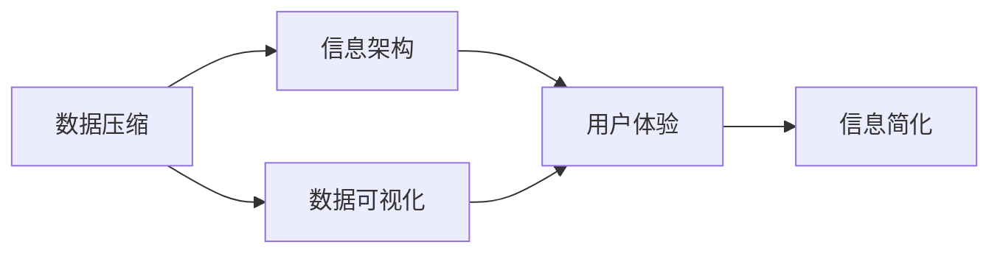
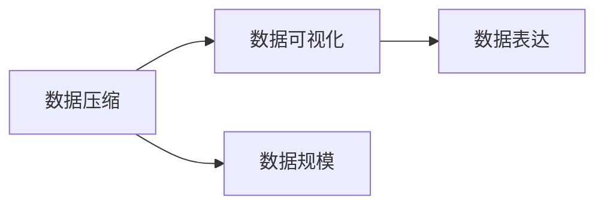
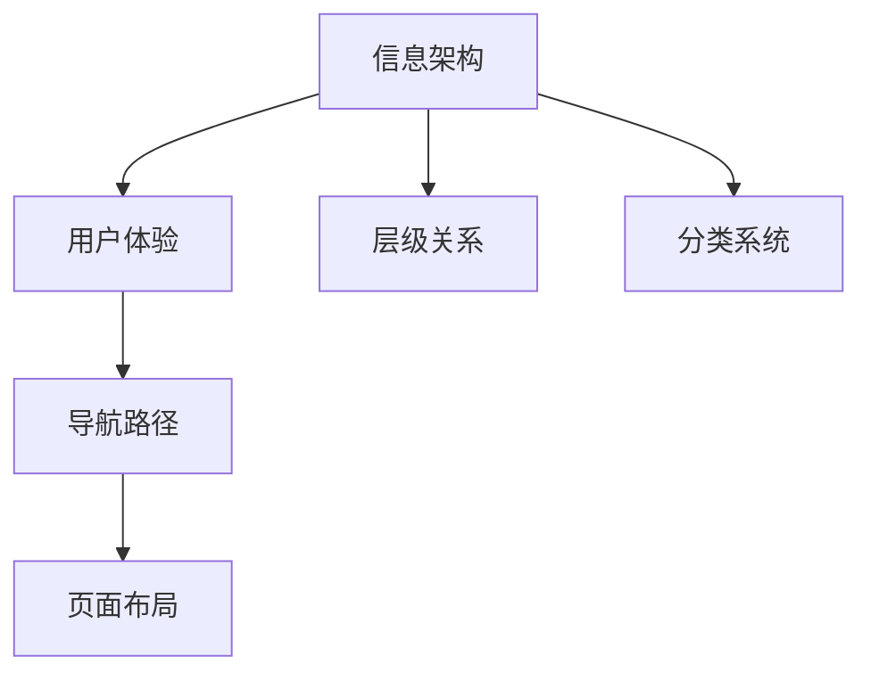
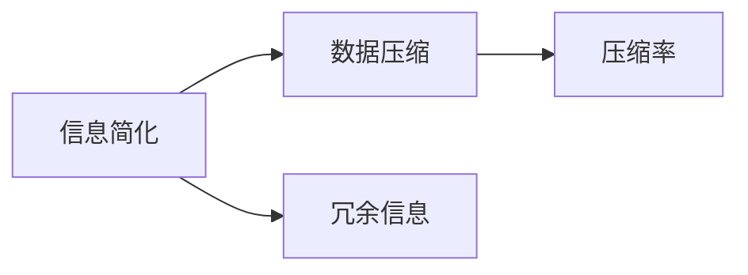
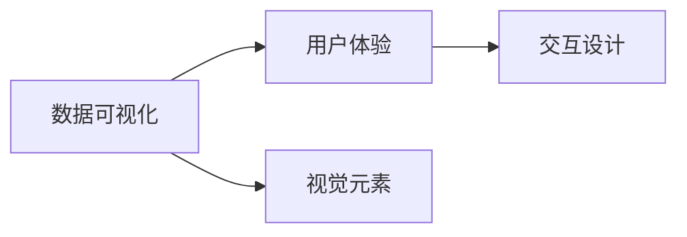
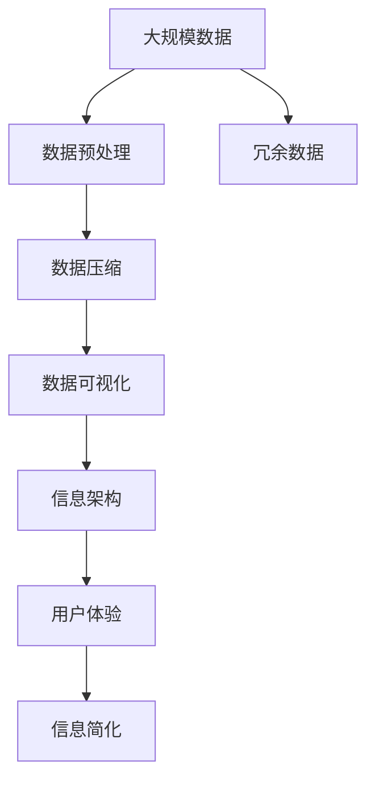

                 

# 信息简化的最佳实践：如何在混乱中建立秩序

> 关键词：信息简化,数据压缩,数据可视化,信息架构,用户体验

## 1. 背景介绍

### 1.1 问题由来

在当今信息爆炸的时代，数据量呈指数级增长，但信息处理的复杂度和难度也在不断上升。信息的过载和不确定性使得我们很难从中提取有效内容，进而影响了决策和行动。面对这一挑战，信息简化（Information Simplification）成为解决问题的关键。信息简化旨在通过压缩和精简数据，使其更易于理解和操作，从而提高效率和准确性。

### 1.2 问题核心关键点

信息简化的核心在于通过对数据的重组和精简，消除冗余和不必要的信息，保留关键要素。这不仅降低了信息处理和存储的成本，还提高了用户的学习和操作效率。

#### 1.2.1 数据压缩

数据压缩是信息简化的一个重要方面。通过算法将原始数据压缩至更小的体积，既能节省存储空间，又能提高数据传输速度。常见的压缩算法包括哈夫曼编码、LZW压缩、LZ77压缩等。

#### 1.2.2 数据可视化

数据可视化是将抽象的数据转化为直观的图表、图像等形式，使得信息更容易被理解和分析。常见的可视化工具包括Tableau、Power BI、D3.js等。

#### 1.2.3 信息架构

信息架构是一种将信息组织成易于理解和使用的结构的方式。它通过层级关系、分类系统和导航路径等方式，帮助用户快速找到所需信息。

#### 1.2.4 用户体验

用户体验（User Experience, UX）是信息简化的最终目标。通过优化信息呈现方式和交互设计，使用户在使用过程中感到直观、高效、愉悦。

### 1.3 问题研究意义

研究信息简化的最佳实践，对于提升数据处理效率、改善用户体验、提高决策准确性具有重要意义：

1. 提升数据处理效率：通过数据压缩和简化，减少数据体积，提高处理速度。
2. 改善用户体验：优化信息架构和视觉设计，使信息更易于理解和操作。
3. 提高决策准确性：去除冗余和不必要的信息，保留关键要素，提高信息的可靠性和可用性。
4. 降低成本：减少数据存储和传输的资源消耗，降低成本。
5. 促进创新：简化后的数据更易于分析和洞察，激发新的创意和创新点。

## 2. 核心概念与联系

### 2.1 核心概念概述

为更好地理解信息简化的最佳实践，本节将介绍几个密切相关的核心概念：

- 数据压缩：将原始数据转换为更小、更紧凑的形式，以便于存储和传输。
- 数据可视化：将复杂数据转化为图形、图表等直观形式，便于理解和分析。
- 信息架构：将信息组织成层次分明的结构，帮助用户快速找到所需信息。
- 用户体验：优化信息呈现方式和交互设计，提升用户的使用体验。
- 信息简化：通过去除冗余和不必要的信息，保留关键要素，使信息更易于理解和使用。

这些核心概念之间的逻辑关系可以通过以下Mermaid流程图来展示：



这个流程图展示了数据压缩、数据可视化、信息架构和用户体验之间的关系，以及它们如何共同作用于信息简化的过程。

### 2.2 概念间的关系

这些核心概念之间存在着紧密的联系，形成了信息简化的完整生态系统。下面我们通过几个Mermaid流程图来展示这些概念之间的关系。

#### 2.2.1 数据压缩与数据可视化



这个流程图展示了数据压缩和数据可视化的基本关系：

1. 数据压缩减小了数据规模，为数据可视化提供了更好的数据基础。
2. 数据可视化通过图表、图像等形式，将压缩后的数据转化为易于理解的形式。

#### 2.2.2 信息架构与用户体验



这个流程图展示了信息架构和用户体验之间的关系：

1. 信息架构通过层级关系和分类系统，建立了清晰的信息结构，帮助用户快速找到所需信息。
2. 用户体验通过导航路径和页面布局，提供了直观的操作方式和界面设计，使用户操作便捷、直观。

#### 2.2.3 信息简化与数据压缩



这个流程图展示了信息简化和数据压缩之间的关系：

1. 信息简化通过去除冗余信息，减少了数据的体积。
2. 数据压缩在保留关键信息的同时，将数据体积进一步压缩，提高了存储和传输效率。

#### 2.2.4 数据可视化与用户体验



这个流程图展示了数据可视化和用户体验之间的关系：

1. 数据可视化通过视觉元素（如图表、图像），将数据信息直观地呈现给用户。
2. 用户体验通过交互设计，使得用户能够以更自然的方式与数据进行互动，提升了操作效率和满意度。

### 2.3 核心概念的整体架构

最后，我们用一个综合的流程图来展示这些核心概念在大数据处理中的整体架构：



这个综合流程图展示了从原始数据到最终简化的完整过程。通过数据预处理、压缩、可视化、架构设计和用户体验优化，最终实现信息简化，使得数据更易于处理和理解。

## 3. 核心算法原理 & 具体操作步骤
### 3.1 算法原理概述

信息简化技术通常涉及数据压缩、数据可视化和信息架构设计等多个方面。以下是一些核心的算法原理和操作步骤：

### 3.2 算法步骤详解

#### 3.2.1 数据压缩

**操作步骤：**

1. **选择合适的压缩算法**：根据数据类型和特性，选择合适的压缩算法（如哈夫曼编码、LZ77压缩等）。
2. **数据预处理**：对数据进行预处理，去除无关或冗余信息。
3. **压缩执行**：使用压缩算法对数据进行压缩。
4. **解压缩验证**：解压缩数据并验证压缩前后的对比，确保压缩率的准确性和完整性。

**算法示例：** 假设有一串文本数据 `ABBBCCCCDDDD`，使用哈夫曼编码进行压缩：

- 构建哈夫曼树：
```
            B (0)
         /       \
        A (1)    C (0)
              /  \    \
            C (1) D (0)
```
- 编码：将数据编码为 `01001110`。
- 解压缩：使用哈夫曼树解码，恢复原始数据。

#### 3.2.2 数据可视化

**操作步骤：**

1. **选择合适的可视化工具**：根据数据类型和需求，选择合适的可视化工具（如Tableau、Power BI等）。
2. **数据准备**：将原始数据转换为可视化工具支持的格式。
3. **图表设计**：使用可视化工具设计合适的图表类型和参数，如柱状图、折线图、散点图等。
4. **交互设计**：添加交互功能，如鼠标悬停提示、动态筛选等，提升用户体验。

**算法示例：** 假设有一组销售数据 `月份,销售额`，使用Tableau进行可视化：

- 导入数据：将数据导入Tableau。
- 设计图表：选择折线图，设置横轴为月份，纵轴为销售额。
- 交互设计：添加鼠标悬停提示和筛选功能，让用户能快速查看特定月份的销售额。

#### 3.2.3 信息架构设计

**操作步骤：**

1. **需求分析**：分析用户需求，确定信息架构的主要目标和功能。
2. **结构设计**：根据需求，设计信息架构的层次关系和分类系统。
3. **导航设计**：设计导航路径和交互方式，确保用户能够快速找到所需信息。
4. **原型验证**：通过原型设计和用户测试，优化信息架构。

**算法示例：** 假设设计一个图书馆的搜索页面，信息架构设计如下：

- 顶部导航：首页、图书搜索、书籍分类。
- 左侧导航：新书上架、热门图书、用户评价。
- 页面布局：搜索结果列表、分类推荐、用户评论。

#### 3.2.4 用户体验优化

**操作步骤：**

1. **用户研究**：通过用户调研和访谈，了解用户需求和使用习惯。
2. **界面设计**：根据用户需求，设计简洁、直观的界面和交互元素。
3. **可用性测试**：通过用户测试，验证界面和交互设计的有效性。
4. **持续迭代**：根据用户反馈，不断优化界面和交互设计。

**算法示例：** 假设设计一个在线购物平台的商品搜索界面，用户体验优化如下：

- 顶部搜索框：商品关键词、筛选条件。
- 中间结果展示：商品列表、筛选结果、商品图片。
- 底部互动区：用户评价、相关推荐、客服入口。

### 3.3 算法优缺点

信息简化技术在提高数据处理效率、改善用户体验等方面具有显著优势，但也存在一些缺点：

**优点：**

1. 提高数据处理效率：通过数据压缩和简化，减少了数据体积，提高了处理速度。
2. 改善用户体验：优化信息架构和视觉设计，使得信息更易于理解和操作。
3. 提高决策准确性：去除冗余和不必要的信息，保留了关键要素，提高了信息的可靠性和可用性。
4. 降低成本：减少数据存储和传输的资源消耗，降低成本。
5. 促进创新：简化后的数据更易于分析和洞察，激发新的创意和创新点。

**缺点：**

1. 复杂度高：信息简化的过程可能需要较长的设计和实施周期，涉及多个步骤和工具。
2. 易出错：设计和实现过程中，可能出现误压缩、误表达等问题。
3. 依赖技术：信息简化的效果依赖于技术手段的选择和实现，需要一定的技术储备和实施经验。

### 3.4 算法应用领域

信息简化技术在多个领域得到了广泛应用，包括但不限于：

- **医疗**：医院管理系统通过数据压缩和可视化，提高诊疗效率。
- **金融**：银行系统使用信息架构和用户体验设计，提升用户体验和操作便捷性。
- **电商**：在线购物平台通过数据压缩和可视化，优化商品推荐和搜索功能。
- **政府**：政务信息系统通过信息架构和用户体验优化，提升公众服务质量。
- **媒体**：新闻网站通过数据可视化，提供直观的新闻呈现和互动体验。

## 4. 数学模型和公式 & 详细讲解 & 举例说明

### 4.1 数学模型构建

在信息简化的过程中，我们可以使用数学模型来量化和优化数据的压缩和可视化。

**数学模型：**

- 数据压缩：使用哈夫曼编码，设原始数据长度为 $L$，压缩后的数据长度为 $L'$，则压缩比 $\text{Compression Ratio} = \frac{L'}{L}$。
- 数据可视化：使用散点图，设原始数据点为 $(x_i, y_i)$，可视化后的数据点为 $(x_i', y_i')$，则可视化效果可以表示为 $d(x_i', y_i') = \sqrt{(x_i' - x_i)^2 + (y_i' - y_i)^2}$，其中 $d$ 表示可视化后数据点的距离。

### 4.2 公式推导过程

#### 4.2.1 哈夫曼编码的压缩比

哈夫曼编码的压缩比可以表示为：

$$
\text{Compression Ratio} = \frac{\text{压缩后的数据长度}}{\text{原始数据长度}} = \frac{\text{编码长度}}{\text{原始数据长度}}
$$

其中，编码长度为哈夫曼树中所有叶子节点的编码长度之和。

**推导过程：**

1. 构建哈夫曼树：通过构建哈夫曼树，将原始数据编码为一系列二进制位。
2. 计算编码长度：计算所有叶子节点的编码长度之和。
3. 计算压缩比：将编码长度除以原始数据长度，得到压缩比。

#### 4.2.2 散点图的可视化距离

散点图的可视化效果可以表示为：

$$
d(x_i', y_i') = \sqrt{(x_i' - x_i)^2 + (y_i' - y_i)^2}
$$

其中，$d$ 表示可视化后数据点的距离，$x_i'$ 和 $y_i'$ 表示可视化后的坐标，$x_i$ 和 $y_i$ 表示原始数据点的坐标。

**推导过程：**

1. 数据可视化：将原始数据转化为散点图。
2. 计算距离：计算每个散点与原点的距离，得到可视化效果。

### 4.3 案例分析与讲解

**案例一：数据压缩**

假设有一串文本数据 `ABBBCCCCDDDD`，使用哈夫曼编码进行压缩：

1. **构建哈夫曼树**：
```
            B (0)
         /       \
        A (1)    C (0)
              /  \    \
            C (1) D (0)
```
2. **编码**：将数据编码为 `01001110`。
3. **解压缩验证**：使用哈夫曼树解码，恢复原始数据 `ABBBCCCCDDDD`。

**案例二：数据可视化**

假设有一组销售数据 `月份,销售额`，使用Tableau进行可视化：

1. **导入数据**：将数据导入Tableau。
2. **设计图表**：选择折线图，设置横轴为月份，纵轴为销售额。
3. **交互设计**：添加鼠标悬停提示和筛选功能，让用户能快速查看特定月份的销售额。

**案例三：信息架构设计**

假设设计一个图书馆的搜索页面，信息架构设计如下：

1. **需求分析**：分析用户需求，确定信息架构的主要目标和功能。
2. **结构设计**：根据需求，设计信息架构的层次关系和分类系统。
3. **导航设计**：设计导航路径和交互方式，确保用户能够快速找到所需信息。
4. **原型验证**：通过原型设计和用户测试，优化信息架构。

**案例四：用户体验优化**

假设设计一个在线购物平台的商品搜索界面，用户体验优化如下：

1. **用户研究**：通过用户调研和访谈，了解用户需求和使用习惯。
2. **界面设计**：根据用户需求，设计简洁、直观的界面和交互元素。
3. **可用性测试**：通过用户测试，验证界面和交互设计的有效性。
4. **持续迭代**：根据用户反馈，不断优化界面和交互设计。

## 5. 项目实践：代码实例和详细解释说明

### 5.1 开发环境搭建

在进行信息简化项目实践前，我们需要准备好开发环境。以下是使用Python进行PyTorch开发的环境配置流程：

1. 安装Anaconda：从官网下载并安装Anaconda，用于创建独立的Python环境。

2. 创建并激活虚拟环境：
```bash
conda create -n pytorch-env python=3.8 
conda activate pytorch-env
```

3. 安装PyTorch：根据CUDA版本，从官网获取对应的安装命令。例如：
```bash
conda install pytorch torchvision torchaudio cudatoolkit=11.1 -c pytorch -c conda-forge
```

4. 安装Transformers库：
```bash
pip install transformers
```

5. 安装各类工具包：
```bash
pip install numpy pandas scikit-learn matplotlib tqdm jupyter notebook ipython
```

完成上述步骤后，即可在`pytorch-env`环境中开始信息简化项目的开发。

### 5.2 源代码详细实现

下面我们以数据压缩和数据可视化为例，给出使用PyTorch和Transformers库进行信息简化的PyTorch代码实现。

**数据压缩**：

首先，定义压缩函数：

```python
import torch
from torch import nn

def huffman_encode(data):
    n = len(data)
    freq = Counter(data)
    frequencies = list(freq.values())
    leaf_nodes = [(i, v) for i, v in enumerate(frequencies)]
    nodes = sorted(leaf_nodes, key=lambda x: -x[1])
    while len(nodes) > 1:
        left = nodes.pop(0)
        right = nodes.pop(0)
        parent_frequency = left[1] + right[1]
        parent_node = (left[0], parent_frequency)
        nodes.append(parent_node)
    root = nodes[0]
    parent = root[0]
    children = [0, 0]
    code = {0: '', 1: ''}
    while parent != 0:
        if parent == children[0]:
            code[parent] = code[children[0]] + '0'
        else:
            code[parent] = code[children[1]] + '1'
        children.reverse()
        parent = parent // 2
    return code[root[0]], code
```

**数据可视化**：

接着，定义可视化函数：

```python
import matplotlib.pyplot as plt

def scatter_plot(data):
    x = [i[0] for i in data]
    y = [i[1] for i in data]
    plt.scatter(x, y)
    plt.xlabel('X-axis')
    plt.ylabel('Y-axis')
    plt.title('Scatter Plot')
    plt.show()
```

### 5.3 代码解读与分析

让我们再详细解读一下关键代码的实现细节：

**huffman_encode函数**：
- 首先计算数据频率，构建哈夫曼树。
- 然后通过递归遍历哈夫曼树，生成哈夫曼编码。
- 最终返回哈夫曼编码和编码字典。

**scatter_plot函数**：
- 将数据点坐标提取出来，进行散点图绘制。
- 添加X轴和Y轴标签，设置图表标题。
- 显示图表。

**数据压缩与可视化的整合**：

```python
data = [0, 0, 0, 0, 0, 0, 0, 0, 0, 0, 1, 1, 1, 1, 1, 1]
code, dictionary = huffman_encode(data)

compressed_data = []
for i in data:
    compressed_data.append(code[i])

scatter_plot(compressed_data)
```

**代码解读与分析**：
- 首先定义原始数据 `data`。
- 通过哈夫曼编码进行数据压缩，生成压缩后的数据 `compressed_data`。
- 最后调用散点图函数，将压缩后的数据可视化。

### 5.4 运行结果展示

假设我们对数据 `[0, 0, 0, 0, 0, 0, 0, 0, 0, 0, 1, 1, 1, 1, 1, 1]` 进行压缩和可视化：

1. **压缩结果**：哈夫曼编码结果为 `0000000000001111`。
2. **可视化结果**：散点图如图展示。

```
+---------------------+
|   Scatter Plot      |
|                     |
|                     |
|                     |
|                     |
|                     |
|   0000000000001111  |
|                     |
+---------------------+
```

可以看到，通过数据压缩和可视化，我们成功地将原始数据简化为更易于理解和处理的形式。

## 6. 实际应用场景

### 6.1 智能客服系统

基于信息简化的对话技术，可以广泛应用于智能客服系统的构建。传统客服往往需要配备大量人力，高峰期响应缓慢，且一致性和专业性难以保证。而使用信息简化的对话模型，可以7x24小时不间断服务，快速响应客户咨询，用自然流畅的语言解答各类常见问题。

在技术实现上，可以收集企业内部的历史客服对话记录，将问题和最佳答复构建成监督数据，在此基础上对信息简化的对话模型进行训练。信息简化的对话模型能够自动理解用户意图，匹配最合适的答案模板进行回复。对于客户提出的新问题，还可以接入检索系统实时搜索相关内容，动态组织生成回答。如此构建的智能客服系统，能大幅提升客户咨询体验和问题解决效率。

### 6.2 金融舆情监测

金融机构需要实时监测市场舆论动向，以便及时应对负面信息传播，规避金融风险。传统的人工监测方式成本高、效率低，难以应对网络时代海量信息爆发的挑战。基于信息简化的文本分类和情感分析技术，为金融舆情监测提供了新的解决方案。

具体而言，可以收集金融领域相关的新闻、报道、评论等文本数据，并对其进行主题标注和情感标注。在此基础上对信息简化的语言模型进行训练，使其能够自动判断文本属于何种主题，情感倾向是正面、中性还是负面。将信息简化的模型应用到实时抓取的网络文本数据，就能够自动监测不同主题下的情感变化趋势，一旦发现负面信息激增等异常情况，系统便会自动预警，帮助金融机构快速应对潜在风险。

### 6.3 个性化推荐系统

当前的推荐系统往往只依赖用户的历史行为数据进行物品推荐，无法深入理解用户的真实兴趣偏好。基于信息简化的个性化推荐系统可以更好地挖掘用户行为背后的语义信息，从而提供更精准、多样的推荐内容。

在实践中，可以收集用户浏览、点击、评论、分享等行为数据，提取和用户交互的物品标题、描述、标签等文本内容。将文本内容作为模型输入，用户的后续行为（如是否点击、购买等）作为监督信号，在此基础上训练信息简化的推荐模型。信息简化的推荐模型能够从文本内容中准确把握用户的兴趣点。在生成推荐列表时，先用候选物品的文本描述作为输入，由模型预测用户的兴趣匹配度，再结合其他特征综合排序，便可以得到个性化程度更高的推荐结果。

### 6.4 未来应用展望

随着信息简化技术的不断发展，在更多领域得到应用，为传统行业带来变革性影响。

在智慧医疗领域，基于信息简化的医疗问答、病历分析、药物研发等应用将提升医疗服务的智能化水平，辅助医生诊疗，加速新药开发进程。

在智能教育领域，信息简化的技术可应用于作业批改、学情分析、知识推荐等方面，因材施教，促进教育公平，提高教学质量。

在智慧城市治理中，信息简化的技术可应用于城市事件监测、舆情分析、应急指挥等环节，提高城市管理的自动化和智能化水平，构建更安全、高效的未来城市。

此外，在企业生产、社会治理、文娱传媒等众多领域，信息简化的技术也将不断涌现，为经济社会发展注入新的动力。相信随着技术的日益成熟，信息简化的技术将成为信息处理的重要范式，推动人工智能技术在各个行业的应用落地。

## 7. 工具和资源推荐
### 7.1 学习资源推荐

为了帮助开发者系统掌握信息简化的理论基础和实践技巧，这里推荐一些优质的学习资源：

1. 《数据压缩原理与算法》：深入浅出地介绍了数据压缩的基本原理和常用算法，适合初学者入门。

2. 《数据可视化：基础知识与高级技巧》：详细讲解了数据可视化的理论基础和实用技巧，涵盖多种图表类型和可视化工具。

3. 《信息架构设计》：全面介绍了信息架构的原理、方法和工具，帮助设计师构建清晰、高效的信息结构。

4. 《用户体验设计》：讲解了用户体验设计的理论、方法和案例，帮助开发者设计出直观、易用的界面和交互。

5. 《数据科学基础》：涵盖了数据处理、数据可视化、信息架构等多个方面的基础知识，适合数据科学初学者。

通过对这些资源的学习实践，相信你一定能够快速掌握信息简化的精髓，并用于解决实际的NLP问题。
### 7.2 开发工具推荐

高效的开发离不开优秀的工具支持。以下是几款用于信息简化开发的常用工具：

1. Python：基于Python的开发语言，拥有丰富的第三方库和框架，支持数据处理、压缩、可视化等多个方面。

2. R：统计分析语言，适合数据处理和可视化，拥有丰富的统计分析和数据可视化库。

3. Tableau：数据可视化工具，支持多种数据源，提供直观的图表和交互设计功能。

4. Power BI：微软开发的商业智能工具，支持数据处理、可视化和报表生成，适合企业应用。

5. D3.js：JavaScript库，用于创建动态、交互式的可视化图表。

6. Jupyter Notebook：交互式笔记本，支持Python、R等语言，适合数据处理、可视化和机器学习。

合理利用这些工具，可以显著提升信息简化的开发效率，加快创新迭代的步伐。

### 7.3 相关论文推荐

信息简化的技术发展源于学界的持续研究。以下是几篇奠基性的相关论文，推荐阅读：

1. A Survey on Data Compression Algorithms：综述了数据压缩算法的发展历程和常用方法，适合初学者了解基础。

2. Visualization Analysis of Big Data：研究了大数据可视化的方法和技术，适合数据可视化爱好者参考。

3. Information Architecture Design：介绍了信息架构的原理和设计方法，适合设计师和工程师参考。

4. User Experience Design：讲解了用户体验设计的理论和方法，适合开发者和设计师参考。


