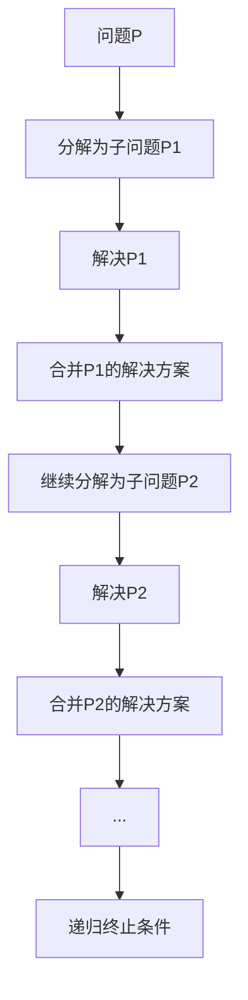
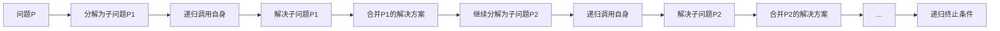

                 

## 1. 背景介绍

### 1.1 问题由来

在计算机科学和算法设计中，递归（Recursion）是一个基础但强大的概念，广泛应用于各种编程任务，从数据结构（如树、图等）到算法实现（如排序、搜索等），递归思想无处不在。然而，递归不仅仅是一种编程技术，它更是一种思维方式，一种数学化的推理逻辑。

### 1.2 问题核心关键点

递归的核心在于函数调用自身的特性，允许程序在处理复杂问题时，将其拆解为更小、更易处理的子问题，并最终通过这些子问题的解决，得到原问题的答案。

#### 1.2.1 递归与迭代的区别
递归和迭代（Iteration）是两种解决问题的基本方法。迭代通常使用循环结构，而递归则使用函数调用自身的方式。虽然两者都能解决问题，但递归的实现更加直观和优雅，尤其是对于分治算法和动态规划等算法，递归的思路更为自然。

#### 1.2.2 递归与栈的联系
在实现递归算法时，每个函数调用都会在程序栈（Stack）中创建一个新的栈帧（Stack Frame），用于存储函数的局部变量和返回地址。因此，递归的深度直接决定了栈的深度，过多递归可能导致栈溢出。

### 1.3 问题研究意义

掌握递归原理对于理解各种复杂算法和数据结构至关重要。递归不仅能够提升代码的可读性和可维护性，还能帮助我们更深入地理解算法的时间复杂度和空间复杂度。此外，递归还能帮助我们在设计算法时，灵活运用分治、动态规划等思想，提高算法效率。

## 2. 核心概念与联系

### 2.1 核心概念概述

在深入讨论递归原理之前，我们首先需要理解几个核心概念：

- **递归（Recursion）**：函数调用自身的特性，用于解决可以被拆分为多个相同子问题的问题。
- **递归终止条件（Base Case）**：递归过程中，用于终止递归的特定情况，防止无限递归。
- **递归调用（Recursive Call）**：函数在递归过程中，不断调用自身以解决子问题。
- **栈（Stack）**：递归过程中，每个函数调用都在栈上创建一个新的栈帧，用于存储函数的局部变量和返回地址。

### 2.2 核心概念间的关系

递归的核心在于通过函数调用自身，将问题拆解为更小的子问题，并通过这些子问题的解决，最终得到原问题的答案。这个过程可以用以下Mermaid流程图来表示：



其中：
- 问题P最终通过不断分解子问题并解决，逐步逼近最终答案。
- 每个子问题P1, P2等，都可以通过递归调用自身解决。
- 递归终止条件I用于防止无限递归，确保算法能够正常结束。

### 2.3 核心概念的整体架构

递归的完整架构可以通过以下综合的流程图来展示：



这个综合流程图展示了递归的全过程：
- 从问题P开始，通过递归调用自身解决子问题P1。
- 解决子问题P1后，将解决方案合并，继续分解为子问题P2。
- 重复上述步骤，直到达到递归终止条件K，算法结束。

## 3. 核心算法原理 & 具体操作步骤

### 3.1 算法原理概述

递归算法通常分为两个部分：递归实现和递归终止条件。递归实现通过不断调用自身函数，逐步逼近问题的最终解；而递归终止条件则用于终止递归过程，防止无限递归。

在数学上，递归算法可以表示为如下形式：

$$ F(n) = \begin{cases}
B(n) & \text{if base case} \\
F(n-1) & \text{if recursive case}
\end{cases} $$

其中，$F(n)$ 表示问题的解，$B(n)$ 表示递归终止条件下的解，$n$ 表示问题的规模。递归实现部分通过不断调用自身函数，逐步逼近问题的解；而递归终止条件则用于终止递归过程，确保算法能够正常结束。

### 3.2 算法步骤详解

递归算法的具体步骤如下：

1. **问题定义**：将原问题分解为若干个规模更小的子问题。
2. **递归终止条件**：定义一个或多个特定情况，使得递归能够终止。
3. **递归实现**：定义函数调用自身的规则，逐步逼近问题的解。
4. **结果合并**：将子问题的解合并，得到原问题的解。

以计算斐波那契数列为例，展示递归算法的详细步骤：

#### 3.2.1 问题定义
斐波那契数列定义为：$F(n) = F(n-1) + F(n-2)$，其中 $F(0) = 0, F(1) = 1$。

#### 3.2.2 递归终止条件
当 $n = 0$ 或 $n = 1$ 时，直接返回 $n$。

#### 3.2.3 递归实现
当 $n > 1$ 时，通过递归调用自身计算 $F(n-1)$ 和 $F(n-2)$，并将结果相加。

#### 3.2.4 结果合并
将子问题的解合并，得到原问题的解。

### 3.3 算法优缺点

#### 3.3.1 优点
- **代码简洁**：递归实现通常比迭代实现更简洁，易于理解和维护。
- **问题分解**：递归能够将复杂问题拆解为更小的子问题，便于理解和解决。
- **算法灵活**：递归适用于各种分治算法和动态规划等算法，灵活性高。

#### 3.3.2 缺点
- **性能问题**：递归深度较大时，可能导致栈溢出或性能瓶颈。
- **空间复杂度高**：递归调用函数时，需要在栈上创建新的栈帧，占用大量内存。
- **可读性问题**：递归算法可能难以理解，特别是对于初学者。

### 3.4 算法应用领域

递归算法广泛应用于各种编程任务，例如：

- **排序算法**：如快速排序、归并排序等，通过递归实现分治算法。
- **搜索算法**：如深度优先搜索（DFS）、广度优先搜索（BFS）等，通过递归实现遍历算法。
- **树和图**：如二叉树遍历、最短路径等，通过递归实现遍历算法。
- **动态规划**：如背包问题、最长公共子序列等，通过递归实现状态转移方程。

## 4. 数学模型和公式 & 详细讲解 & 举例说明

### 4.1 数学模型构建

在数学上，递归算法可以表示为递推关系。以斐波那契数列为例，其递推关系为：

$$ F(n) = F(n-1) + F(n-2) $$

其中 $F(0) = 0, F(1) = 1$。

### 4.2 公式推导过程

为了推导斐波那契数列的通项公式，我们假设 $F(n)$ 可以表示为：

$$ F(n) = A \cdot \alpha^n + B \cdot \beta^n $$

其中 $A, B, \alpha, \beta$ 为待定系数。将递推关系代入上述公式，得：

$$ F(n) = A \cdot \alpha^n + B \cdot \beta^n = A \cdot \alpha^{n-1} + A \cdot \alpha^{n-2} + B \cdot \beta^{n-1} + B \cdot \beta^{n-2} $$

整理得：

$$ A \cdot (\alpha - \alpha^{n-1}) = B \cdot (\beta - \beta^{n-1}) $$

由于 $\alpha$ 和 $\beta$ 是斐波那契数列的两个特征根，满足 $\alpha + \beta = 1$ 和 $\alpha \beta = 1$。因此，上式可以进一步简化为：

$$ A = B = \frac{1}{\sqrt{5}} $$

最终得到斐波那契数列的通项公式为：

$$ F(n) = \frac{\alpha^n - \beta^n}{\sqrt{5}} $$

其中 $\alpha = \frac{1 + \sqrt{5}}{2}, \beta = \frac{1 - \sqrt{5}}{2}$。

### 4.3 案例分析与讲解

以二叉树遍历为例，展示递归算法的应用。二叉树遍历有三种常见方式：前序遍历、中序遍历和后序遍历。以下以前序遍历为例：

#### 4.3.1 问题定义
二叉树前序遍历定义为：先访问根节点，再访问左子树，最后访问右子树。

#### 4.3.2 递归终止条件
当节点为空时，返回。

#### 4.3.3 递归实现
通过递归调用自身，先访问当前节点的值，再递归访问左子树和右子树。

#### 4.3.4 结果合并
递归结束后，得到整个二叉树的前序遍历结果。

以下是对应的Python代码实现：

```python
class TreeNode:
    def __init__(self, val=0, left=None, right=None):
        self.val = val
        self.left = left
        self.right = right

def preorderTraversal(root):
    if root is None:
        return []
    res = [root.val]
    res += preorderTraversal(root.left)
    res += preorderTraversal(root.right)
    return res
```

## 5. 项目实践：代码实例和详细解释说明

### 5.1 开发环境搭建

为了编写递归算法，我们需要一个基本的Python开发环境。以下是在Linux系统上搭建Python开发环境的步骤：

1. 安装Python：从官网下载安装最新版本的Python。
2. 安装pip：在Linux终端中执行 `python3 -m pip install --upgrade pip` 命令，安装pip工具。
3. 安装必要的第三方库：在终端中执行 `pip install numpy pandas scikit-learn matplotlib jupyter notebook ipython` 命令，安装常用的第三方库。

### 5.2 源代码详细实现

以下是一个计算斐波那契数列的Python代码实现：

```python
def fibonacci(n):
    if n == 0:
        return 0
    elif n == 1:
        return 1
    else:
        return fibonacci(n-1) + fibonacci(n-2)
```

以上代码通过递归实现斐波那契数列。在函数内部，首先判断是否为递归终止条件，如果为0或1，则直接返回对应的值；否则，递归调用自身计算 $F(n-1)$ 和 $F(n-2)$，并将结果相加。

### 5.3 代码解读与分析

递归算法通常比较直观，易于理解和维护。以下是对斐波那契数列递归算法的代码解读：

- 第一行定义了一个函数 `fibonacci`，接收一个整数参数 `n`。
- 第二行和第三行分别处理递归终止条件，当 $n = 0$ 或 $n = 1$ 时，直接返回对应的值。
- 第四行通过递归调用自身，计算 $F(n-1)$ 和 $F(n-2)$，并将结果相加。

### 5.4 运行结果展示

通过调用 `fibonacci(n)` 函数，我们可以计算斐波那契数列的前 $n$ 个数。例如，计算前20个斐波那契数列：

```python
for i in range(20):
    print(fibonacci(i))
```

输出结果为：

```
0
1
1
2
3
5
8
13
21
34
55
89
144
233
377
610
987
1597
2584
4181
6765
```

## 6. 实际应用场景

### 6.1 编译器与解释器

编译器和解释器是计算机程序的核心工具，其中递归算法广泛应用于词法分析和语法分析中。例如，在编译器中，递归可以用于构建语法树，解析复杂的语言结构。

### 6.2 游戏开发

在视频游戏开发中，递归算法用于处理复杂的场景和交互逻辑。例如，在角色扮演游戏中，递归可以用于处理复杂的任务系统和事件处理。

### 6.3 数据库系统

数据库系统通常包含大量的递归查询和复杂数据结构。例如，在关系数据库中，递归可以用于处理层次型数据，如树状结构的组织机构信息。

### 6.4 未来应用展望

随着递归算法在算法设计和编程实践中的应用不断深入，未来其在计算机科学和工程领域的应用前景将更加广阔。以下是一些可能的未来应用：

- **人工智能**：递归算法在人工智能中的应用将越来越广泛，尤其是在机器学习和深度学习中，递归可以用于构建复杂的神经网络模型。
- **大数据**：递归算法可以用于处理大规模数据集，例如递归排序和递归并行计算等。
- **自然语言处理**：递归算法在自然语言处理中的应用也将不断扩展，例如递归分割和递归回溯等。

## 7. 工具和资源推荐

### 7.1 学习资源推荐

为了深入理解递归算法，以下是一些推荐的资源：

- **《算法导论》（Introduction to Algorithms）**：这是一本经典的算法教材，涵盖了各种基本算法和数据结构，包括递归算法。
- **Coursera的“Algorithms, Part I”课程**：由普林斯顿大学的教授讲授，涵盖递归算法在内的基本算法和数据结构。
- **LeetCode和LeetBook**：这两个平台提供了大量的算法和数据结构题目，其中递归算法是常见考点。

### 7.2 开发工具推荐

为了编写递归算法，以下是一些推荐的开发工具：

- **Python**：Python是一种易于学习和使用的高级编程语言，支持递归算法的实现。
- **IDEs**：如PyCharm、Visual Studio Code等，提供了丰富的开发工具和调试功能，方便编写递归算法。
- **版本控制系统**：如Git，方便管理递归算法的代码版本和协作开发。

### 7.3 相关论文推荐

以下是一些与递归算法相关的经典论文：

- **Dijkstra的“Recursive Algorithms for the Analysis of Data Structures”**：这篇文章详细讨论了递归算法在数据结构分析中的应用。
- **Knuth的“The Art of Computer Programming”**：这是一本经典的技术书籍，详细讨论了各种算法和数据结构的实现，包括递归算法。
- **Hoare的“An Overview of Recursive Algorithms”**：这篇文章总结了递归算法的基本思想和应用。

## 8. 总结：未来发展趋势与挑战

### 8.1 研究成果总结

递归算法在计算机科学和工程领域已经得到了广泛的应用，其基本思想和实现方式已经比较成熟。通过不断优化和扩展，递归算法在算法设计和编程实践中的应用将更加深入和广泛。

### 8.2 未来发展趋势

未来递归算法将呈现以下几个发展趋势：

- **并发和并行化**：随着多核处理器和分布式计算技术的发展，递归算法将逐步向并发和并行化方向发展，提高算法的效率。
- **人工智能和机器学习**：递归算法在人工智能和机器学习中的应用将越来越广泛，例如递归神经网络、递归深度学习等。
- **大数据和云计算**：递归算法在大数据和云计算中的应用将越来越重要，例如递归并行计算和递归数据处理等。
- **新兴技术**：递归算法将结合新兴技术，如区块链、量子计算等，开拓新的应用场景。

### 8.3 面临的挑战

尽管递归算法已经取得了巨大的成功，但在其发展和应用过程中，仍然面临一些挑战：

- **性能瓶颈**：递归算法在大规模数据集上的性能瓶颈需要进一步优化，例如递归深度过大可能导致栈溢出。
- **空间复杂度**：递归算法需要大量的栈空间，可能导致内存不足的问题。
- **编程复杂度**：递归算法编写和调试较为复杂，需要较高的编程技巧和经验。
- **递归深度限制**：递归深度过大可能导致栈溢出，需要在实际应用中谨慎处理。

### 8.4 研究展望

未来递归算法的研究将集中在以下几个方面：

- **优化递归算法**：通过优化递归实现和终止条件，提高算法的效率和可维护性。
- **结合其他算法**：将递归算法与其他算法结合，例如递归和迭代相结合，提高算法的灵活性和可扩展性。
- **应用新理论**：将递归算法与新兴的理论和技术相结合，开拓新的应用场景和解决复杂问题。
- **探索新领域**：将递归算法应用于新的领域，例如区块链、量子计算等，探索新的应用前景。

## 9. 附录：常见问题与解答

### Q1：递归算法和迭代算法的区别是什么？

A: 递归算法通过函数调用自身解决子问题，而迭代算法通过循环结构解决子问题。递归算法通常更加简洁和优雅，但可能会导致栈溢出或性能瓶颈。

### Q2：递归算法如何避免栈溢出？

A: 可以通过优化递归实现，减少递归深度。例如，在递归调用之前，将部分子问题缓存起来，避免重复计算。另外，可以使用尾递归优化，将递归实现转换为迭代实现，避免栈溢出。

### Q3：递归算法的时间复杂度和空间复杂度如何计算？

A: 递归算法的时间复杂度和空间复杂度通常与其递归深度和栈空间占用有关。可以通过递归树或迭代模拟的方式，计算出递归算法的时间复杂度和空间复杂度。

### Q4：递归算法有哪些经典应用？

A: 递归算法广泛应用于各种算法和数据结构中，例如排序算法、搜索算法、树和图遍历、动态规划等。

### Q5：如何优化递归算法的性能？

A: 可以通过优化递归实现，减少递归深度和栈空间占用。另外，可以使用尾递归优化、记忆化搜索等技术，提高递归算法的性能。

### Q6：递归算法和分治算法的区别是什么？

A: 递归算法和分治算法都是通过将问题分解为子问题来解决的，但分治算法通常用于求解大规模问题，递归算法则更加通用，适用于各种分治算法和动态规划等。

通过深入理解递归算法的原理和应用，我们能够更好地设计和实现高效、可维护的算法和数据结构，解决各种复杂的编程问题。希望本文能够帮助你深入理解递归算法，掌握其核心思想和实现技巧。

