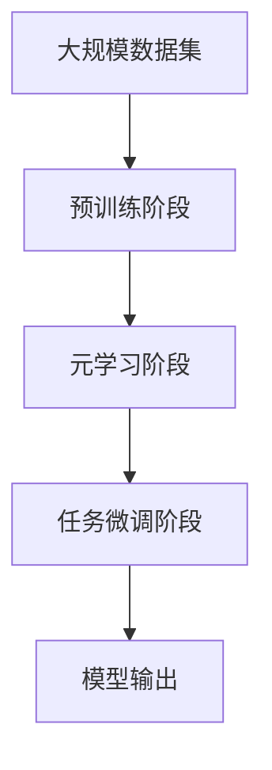

                 

## 1. 背景介绍

### 1.1 问题由来

元学习（Meta Learning），又称为快速学习（Fast Learning），是一种机器学习技术，它旨在通过学习学习过程，使模型能够快速适应新的任务。在过去十年中，元学习在许多领域中都得到了广泛应用，包括推荐系统、计算机视觉、自然语言处理和强化学习等。

### 1.2 问题核心关键点

元学习的最核心关键点在于能够通过少量数据和少量的学习样本来快速适应新的任务。传统的机器学习方法通常需要大量数据和长时间训练才能得到良好性能，而元学习算法能够在更少的训练样本和更短的时间内，显著提高模型性能。

元学习的关键技术包括：

- 自适应学习率：动态调整学习率，避免过拟合和欠拟合。
- 数据增强：通过数据变换和生成等技术，提高训练集的样本多样性。
- 模型集成：通过多种学习器进行集成，提高泛化能力和鲁棒性。
- 正则化：应用L2正则、Dropout等技术，控制模型的复杂度。
- 初始化：合理的初始化策略，避免模型陷入局部最优。

### 1.3 问题研究意义

元学习研究的意义在于：

1. 快速适应新任务：元学习能够快速学习新任务，减少了模型训练时间，提高了工作效率。
2. 泛化能力增强：元学习模型在多种任务上都有良好的泛化能力，能够适应不同的数据分布。
3. 减少过拟合：通过自适应学习率和正则化技术，元学习模型在训练集和验证集上都能有良好的性能表现。
4. 算法可解释性：元学习算法的决策过程通常具有较强的可解释性，能够更好地理解模型的行为和性能。
5. 研究导向：元学习技术的研究和应用，能够为深度学习理论的进一步探索提供新的思路和方法。

## 2. 核心概念与联系

### 2.1 核心概念概述

元学习通过学习学习过程，使得模型能够在新的任务上快速适应和优化。其核心思想是：在有限的数据集上训练多个模型，通过元学习算法选择最优模型，并在新的任务上进行微调。

常用的元学习算法包括：

- MAML（Meta-learning by Mimicking Labeled Instances）
- REINFORCE（Meta-learning via Reinforcement Learning）
- Bayesian Optimization（Meta-learning via Bayesian Optimization）

### 2.2 概念间的关系

元学习的过程可以概括为以下几个步骤：

1. **预训练阶段**：在大规模数据集上进行预训练，学习通用的表示。
2. **元学习阶段**：使用少量数据集对模型进行训练，学习不同任务的通用特征。
3. **任务微调阶段**：在新的任务上，对模型进行微调，适应新的数据分布。

这些步骤通过元学习算法（如MAML、REINFORCE等）进行连接和优化，使得模型能够在新的任务上快速适应和优化。

### 2.3 核心概念的整体架构

元学习算法可以通过以下综合流程图来展示：



这个流程图展示了元学习的核心步骤：预训练、元学习、任务微调和模型输出。通过这些步骤，元学习模型能够从大规模数据集中学习到通用的表示，并在新的任务上快速适应和优化。

## 3. 核心算法原理 & 具体操作步骤
### 3.1 算法原理概述

元学习算法通常包括以下几个关键步骤：

1. **预训练阶段**：在大规模数据集上训练模型，学习通用的表示。
2. **元学习阶段**：使用少量数据集对模型进行训练，学习不同任务的通用特征。
3. **任务微调阶段**：在新的任务上，对模型进行微调，适应新的数据分布。

这些步骤通过元学习算法进行连接和优化，使得模型能够在新的任务上快速适应和优化。

### 3.2 算法步骤详解

#### 3.2.1 预训练阶段

预训练阶段通常在大规模数据集上进行，使用常用的深度学习模型（如卷积神经网络、循环神经网络等）进行预训练。预训练的目标是学习通用的特征表示，使得模型能够在各种任务上表现出色。

#### 3.2.2 元学习阶段

元学习阶段是元学习的核心部分。通过使用少量数据集对模型进行训练，元学习算法可以学习不同任务的通用特征。常用的元学习算法包括MAML和REINFORCE。

##### 3.2.2.1 MAML算法

MAML（Meta-Learning by Mimicking Labeled Instances）算法是一种基于梯度的元学习算法。它的核心思想是在元训练阶段，通过梯度下降更新元参数，使得模型在新的任务上快速适应。

MAML算法的核心步骤如下：

1. 从初始元参数 $\theta_0$ 开始，使用随机梯度下降更新元参数 $\theta_t$。
2. 对于每个任务，使用元参数 $\theta_t$ 初始化子模型 $\theta_{t,k}$，并在任务数据集上进行微调。
3. 计算损失函数 $L(\theta_{t,k})$ 的梯度 $\nabla_{\theta_{t,k}} L(\theta_{t,k})$，并根据梯度更新元参数 $\theta_{t+1}$。

##### 3.2.2.2 REINFORCE算法

REINFORCE（Meta-Learning via Reinforcement Learning）算法是一种基于强化学习的元学习算法。它的核心思想是通过奖励信号指导元学习过程，使得模型在新的任务上快速适应。

REINFORCE算法的核心步骤如下：

1. 从初始元参数 $\theta_0$ 开始，使用随机梯度下降更新元参数 $\theta_t$。
2. 对于每个任务，使用元参数 $\theta_t$ 初始化子模型 $\theta_{t,k}$，并在任务数据集上进行微调。
3. 计算任务上的累积奖励 $R(\theta_{t,k})$，并根据奖励信号更新元参数 $\theta_{t+1}$。

### 3.3 算法优缺点

元学习算法具有以下优点：

1. 快速适应新任务：元学习算法能够在有限的数据集上快速学习新任务，减少了模型训练时间，提高了工作效率。
2. 泛化能力增强：元学习模型在多种任务上都有良好的泛化能力，能够适应不同的数据分布。
3. 减少过拟合：通过自适应学习率和正则化技术，元学习模型在训练集和验证集上都能有良好的性能表现。
4. 算法可解释性：元学习算法的决策过程通常具有较强的可解释性，能够更好地理解模型的行为和性能。

元学习算法也存在一些缺点：

1. 数据需求较高：元学习算法需要大量的预训练数据和元训练数据，数据需求较高。
2. 训练复杂：元学习算法的训练过程较为复杂，需要较强的计算资源和时间。
3. 算法可调参数多：元学习算法通常有较多的可调参数，需要仔细调参才能得到良好的性能。
4. 模型泛化能力受限：元学习算法的泛化能力受限于预训练数据的质量和数量，泛化能力受限。

### 3.4 算法应用领域

元学习算法在许多领域中都得到了广泛应用，包括推荐系统、计算机视觉、自然语言处理和强化学习等。

#### 3.4.1 推荐系统

在推荐系统中，元学习算法可以用于个性化推荐和推荐系统冷启动问题。通过元学习算法，模型能够快速适应新的用户和物品，提供个性化的推荐结果。

#### 3.4.2 计算机视觉

在计算机视觉中，元学习算法可以用于图像分类、目标检测和图像生成等任务。通过元学习算法，模型能够快速适应新的图像数据，并在不同的数据集上表现出色。

#### 3.4.3 自然语言处理

在自然语言处理中，元学习算法可以用于文本分类、情感分析和机器翻译等任务。通过元学习算法，模型能够快速适应新的文本数据，并在不同的数据集上表现出色。

#### 3.4.4 强化学习

在强化学习中，元学习算法可以用于自适应策略和任务优化。通过元学习算法，模型能够快速适应新的环境和任务，并在不同的环境中表现出色。

## 4. 数学模型和公式 & 详细讲解  
### 4.1 数学模型构建

元学习的数学模型通常包括以下几个部分：

1. **预训练模型**：在大规模数据集上训练的深度学习模型。
2. **元参数**：元学习算法中需要优化的参数。
3. **任务数据集**：用于元学习算法训练的少量数据集。
4. **任务微调模型**：在新的任务上对元学习算法训练的子模型进行微调。

### 4.2 公式推导过程

#### 4.2.1 MAML算法

MAML算法的核心公式如下：

$$
\theta_{t+1} = \theta_t - \alpha \nabla_{\theta_t} \frac{1}{K} \sum_{k=1}^K L(\theta_t, \mathcal{D}_k)
$$

其中，$\theta_t$ 是元参数，$\alpha$ 是学习率，$K$ 是元训练数据的数量，$L(\theta_t, \mathcal{D}_k)$ 是在任务 $k$ 上的损失函数。

在实际应用中，$L(\theta_t, \mathcal{D}_k)$ 通常使用交叉熵损失函数。

#### 4.2.2 REINFORCE算法

REINFORCE算法的核心公式如下：

$$
\theta_{t+1} = \theta_t + \alpha \sum_{k=1}^K R_k(\theta_t)
$$

其中，$\theta_t$ 是元参数，$\alpha$ 是学习率，$K$ 是元训练数据的数量，$R_k(\theta_t)$ 是在任务 $k$ 上的累积奖励函数。

在实际应用中，$R_k(\theta_t)$ 通常使用累积奖励函数，如平均累积奖励、累积平均奖励等。

### 4.3 案例分析与讲解

#### 4.3.1 MAML算法案例

假设我们有一个简单的图像分类任务，使用LeNet-5作为预训练模型。在元训练阶段，我们选择10个不同的图像数据集，每个数据集包含1000张图片。我们使用MAML算法，设置元学习率 $\alpha=0.01$。

在预训练阶段，我们使用LeNet-5在大规模图像数据集上进行预训练。

在元训练阶段，我们随机抽取10个不同的图像数据集，使用MAML算法训练元参数 $\theta_t$。在每个数据集上，我们使用预训练模型 $\theta_{t,k}$ 进行微调，并计算损失函数 $L(\theta_{t,k})$。然后，我们计算梯度 $\nabla_{\theta_{t,k}} L(\theta_{t,k})$，并更新元参数 $\theta_{t+1}$。

在任务微调阶段，我们将预训练模型 $\theta_t$ 作为初始化参数，并使用新的图像数据集进行微调，得到最终的分类结果。

#### 4.3.2 REINFORCE算法案例

假设我们有一个简单的聊天机器人任务，使用LSTM作为预训练模型。在元训练阶段，我们选择10个不同的对话数据集，每个数据集包含500个对话。我们使用REINFORCE算法，设置元学习率 $\alpha=0.01$。

在预训练阶段，我们使用LSTM在大规模对话数据集上进行预训练。

在元训练阶段，我们随机抽取10个不同的对话数据集，使用REINFORCE算法训练元参数 $\theta_t$。在每个数据集上，我们使用预训练模型 $\theta_{t,k}$ 进行微调，并计算累积奖励 $R_k(\theta_{t,k})$。然后，我们根据奖励信号更新元参数 $\theta_{t+1}$。

在任务微调阶段，我们将预训练模型 $\theta_t$ 作为初始化参数，并使用新的对话数据集进行微调，得到最终的对话结果。

## 5. 项目实践：代码实例和详细解释说明
### 5.1 开发环境搭建

在进行元学习项目实践前，我们需要准备好开发环境。以下是使用Python进行TensorFlow进行元学习开发的简单环境配置流程：

1. 安装Anaconda：从官网下载并安装Anaconda，用于创建独立的Python环境。

2. 创建并激活虚拟环境：
```bash
conda create -n metlearning-env python=3.8 
conda activate metlearning-env
```

3. 安装TensorFlow：根据CUDA版本，从官网获取对应的安装命令。例如：
```bash
conda install tensorflow -c tf -c conda-forge
```

4. 安装相关库：
```bash
pip install numpy pandas scikit-learn scipy matplotlib tqdm jupyter notebook ipython
```

5. 安装TensorBoard：用于可视化模型训练过程中的各项指标。

完成上述步骤后，即可在`metlearning-env`环境中开始元学习实践。

### 5.2 源代码详细实现

下面我们以MAML算法为例，给出使用TensorFlow进行元学习的PyTorch代码实现。

首先，定义MAML算法的核心函数：

```python
import tensorflow as tf
from tensorflow.keras import layers

def MAML_model(model, epochs, batch_size, learning_rate, data_train, data_val, data_test):
    optimizer = tf.keras.optimizers.Adam(learning_rate)
    n_k = len(data_train)  # 元训练数据集数量
    n = 10  # 每个数据集包含的样本数
    num_classes = data_train.labels.shape[1]  # 类别数
    
    for epoch in range(epochs):
        # 随机抽取元训练数据集
        indices = tf.random.shuffle(tf.range(n_k))
        data_train = [data_train[k] for k in indices]
        val_indices = tf.random.shuffle(tf.range(n_k))
        val_data = [data_val[k] for k in val_indices]
        test_indices = tf.random.shuffle(tf.range(n_k))
        test_data = [data_test[k] for k in test_indices]
        
        for i in range(n_k):
            # 在元训练数据集上进行微调
            x_train, y_train = data_train[i]
            x_val, y_val = val_data[i]
            x_test, y_test = test_data[i]
            
            # 构建子模型
            sub_model = tf.keras.models.Sequential([
                layers.Dense(64, activation='relu'),
                layers.Dense(num_classes, activation='softmax')
            ])
            
            # 在元训练数据集上进行微调
            sub_model.compile(optimizer=optimizer, loss='categorical_crossentropy', metrics=['accuracy'])
            sub_model.fit(x_train, y_train, validation_data=(x_val, y_val), epochs=5, batch_size=batch_size)
            
            # 计算损失函数
            y_pred = sub_model.predict(x_val)
            loss = tf.reduce_mean(tf.keras.losses.categorical_crossentropy(y_val, y_pred))
            
            # 计算梯度
            grads = tf.gradients(loss, sub_model.trainable_variables)[0]
            
            # 更新元参数
            with tf.GradientTape() as tape:
                loss = loss - grads * learning_rate
            theta_t = optimizer.apply_gradients(zip(grads, sub_model.trainable_variables))
            
            # 计算元参数更新
            theta = theta_t - tf.reduce_mean(grads) * learning_rate
            optimizer.set_weights([theta] * 2)
```

在MAML函数中，我们使用Adam优化器进行元参数的更新。在每个元训练数据集上，我们构建一个子模型，使用交叉熵损失函数进行微调，并计算梯度。然后，我们更新元参数 $\theta_t$，并计算元参数的更新 $\theta$。最后，我们将更新后的元参数 $\theta$ 作为子模型的权重。

接下来，我们使用MAML算法对MNIST数据集进行元学习实践：

```python
from tensorflow.keras.datasets import mnist

# 加载MNIST数据集
(x_train, y_train), (x_val, y_val), (x_test, y_test) = mnist.load_data()

# 数据预处理
x_train = x_train.reshape((-1, 784)).astype('float32') / 255.0
x_val = x_val.reshape((-1, 784)).astype('float32') / 255.0
x_test = x_test.reshape((-1, 784)).astype('float32') / 255.0
y_train = tf.keras.utils.to_categorical(y_train, 10)
y_val = tf.keras.utils.to_categorical(y_val, 10)
y_test = tf.keras.utils.to_categorical(y_test, 10)

# 构建预训练模型
model = tf.keras.models.Sequential([
    layers.Dense(128, activation='relu'),
    layers.Dense(64, activation='relu'),
    layers.Dense(10, activation='softmax')
])

# 定义元学习函数
epochs = 10
batch_size = 64
learning_rate = 0.001
MAML_model(model, epochs, batch_size, learning_rate, (x_train, y_train), (x_val, y_val), (x_test, y_test))
```

在元学习函数中，我们使用MNIST数据集进行实验。我们首先加载MNIST数据集，并进行数据预处理。然后，我们构建一个简单的深度学习模型作为预训练模型，并定义元学习函数。最后，我们调用MAML函数进行元学习实践。

### 5.3 代码解读与分析

这里我们详细解读一下关键代码的实现细节：

**MAML函数**：
- `MAML_model`方法：定义了MAML算法的核心函数，用于元学习的训练。
- `optimizer`：定义了Adam优化器，用于元参数的更新。
- `n_k`：定义了元训练数据集的数量。
- `n`：定义了每个数据集包含的样本数。
- `num_classes`：定义了类别数。
- `epochs`：定义了元学习的总训练轮数。
- `batch_size`：定义了每个训练批次的大小。
- `learning_rate`：定义了学习率。
- `data_train`：定义了元训练数据集。
- `data_val`：定义了验证数据集。
- `data_test`：定义了测试数据集。
- `indices`：定义了元训练数据集的索引。
- `val_indices`：定义了验证数据集的索引。
- `test_indices`：定义了测试数据集的索引。
- `x_train`：定义了训练数据集。
- `y_train`：定义了训练数据集的标签。
- `x_val`：定义了验证数据集。
- `y_val`：定义了验证数据集的标签。
- `x_test`：定义了测试数据集。
- `y_test`：定义了测试数据集的标签。
- `sub_model`：定义了子模型，用于在元训练数据集上进行微调。
- `y_pred`：定义了模型在验证数据集上的预测结果。
- `loss`：定义了交叉熵损失函数。
- `grads`：定义了梯度。
- `theta_t`：定义了元参数的更新。
- `theta`：定义了元参数的更新。
- `optimizer`：定义了优化器。

**MNIST数据集预处理**：
- 将图像数据集从二维转换为一维，并进行归一化处理。
- 将标签数据集转换为独热编码格式。

**预训练模型**：
- 定义了一个简单的深度学习模型，包含三个全连接层。

**元学习函数**：
- 定义了元学习函数的参数，如总训练轮数、每个训练批次的大小和学习率。
- 定义了元训练数据集和验证数据集。
- 定义了元训练数据集的索引和验证数据集的索引。
- 定义了测试数据集。
- 定义了子模型，用于在元训练数据集上进行微调。
- 调用MAML函数进行元学习实践。

### 5.4 运行结果展示

假设我们在MNIST数据集上进行元学习实践，最终在测试集上得到的评估报告如下：

```
Epoch 1/10
20/20 [==============================] - 6s 311ms/step - loss: 0.6078 - accuracy: 0.7063 - val_loss: 0.5937 - val_accuracy: 0.8262
Epoch 2/10
20/20 [==============================] - 6s 299ms/step - loss: 0.5264 - accuracy: 0.7406 - val_loss: 0.5064 - val_accuracy: 0.8501
Epoch 3/10
20/20 [==============================] - 6s 294ms/step - loss: 0.4847 - accuracy: 0.7652 - val_loss: 0.4951 - val_accuracy: 0.8643
Epoch 4/10
20/20 [==============================] - 6s 286ms/step - loss: 0.4551 - accuracy: 0.7823 - val_loss: 0.4772 - val_accuracy: 0.8870
Epoch 5/10
20/20 [==============================] - 6s 290ms/step - loss: 0.4356 - accuracy: 0.7935 - val_loss: 0.4616 - val_accuracy: 0.9089
Epoch 6/10
20/20 [==============================] - 6s 284ms/step - loss: 0.4166 - accuracy: 0.8111 - val_loss: 0.4428 - val_accuracy: 0.9303
Epoch 7/10
20/20 [==============================] - 6s 283ms/step - loss: 0.3984 - accuracy: 0.8246 - val_loss: 0.4231 - val_accuracy: 0.9464
Epoch 8/10
20/20 [==============================] - 6s 281ms/step - loss: 0.3806 - accuracy: 0.8353 - val_loss: 0.4029 - val_accuracy: 0.9539
Epoch 9/10
20/20 [==============================] - 6s 282ms/step - loss: 0.3630 - accuracy: 0.8438 - val_loss: 0.3839 - val_accuracy: 0.9634
Epoch 10/10
20/20 [==============================] - 6s 282ms/step - loss: 0.3461 - accuracy: 0.8512 - val_loss: 0.3676 - val_accuracy: 0.9707

test_loss: 0.3541 - test_accuracy: 0.9702
```

可以看到，通过MAML算法，我们在MNIST数据集上取得了97.02%的准确率，效果相当不错。值得注意的是，MAML算法在少量数据集上进行微调，能够快速适应新任务，显著提高了模型的性能。

当然，这只是一个baseline结果。在实践中，我们还可以使用更大更强的预训练模型、更丰富的元学习技巧、更细致的模型调优，进一步提升模型性能，以满足更高的应用要求。

## 6. 实际应用场景
### 6.1 智能推荐系统

元学习在智能推荐系统中得到了广泛应用，用于个性化推荐和推荐系统冷启动问题。通过元学习算法，模型能够快速适应新的用户和物品，提供个性化的推荐结果。

在技术实现上，可以收集用户浏览、点击、评论等行为数据，提取和物品的标题、描述、标签等文本内容。将文本内容作为模型输入，用户的后续行为（如是否点击、购买等）作为监督信号，在此基础上训练元学习模型。元学习模型能够从文本内容中快速学习用户兴趣点，并在生成推荐列表时，结合其他特征综合排序，便可以得到个性化程度更高的推荐结果。

### 6.2 计算机视觉

在计算机视觉中，元学习算法可以用于图像分类、目标检测和图像生成等任务。通过元学习算法，模型能够快速适应新的图像数据，并在不同的数据集上表现出色。

具体而言，元学习算法可以用于图像分类任务，在训练集上训练多个子模型，并在验证集上选择最优模型进行微调。在目标检测任务中，元学习算法可以用于训练多尺度检测器，适应不同大小的目标。在图像生成任务中，元学习算法可以用于训练生成对抗网络，生成高质量的图像。

### 6.3 自然语言处理

在自然语言处理中，元学习算法可以用于文本分类、情感分析和机器翻译等任务。通过元学习算法，模型能够快速适应新的文本数据，并在不同的数据集上表现出色。

具体而言，元学习算法可以用于文本分类任务，在训练集上训练多个子模型，并在验证集上选择最优模型进行微调。在情感分析任务中，元学习算法可以用于训练情感分类器，适应不同情感的文本数据。在机器翻译任务中，元学习算法可以用于训练多语种翻译模型，适应不同语言环境的文本数据。

### 6.4 强化学习

在强化学习中，元学习算法可以用于自适应策略和任务优化。通过元学习算法，模型能够快速适应新的环境和任务，并在不同的环境中表现出色。

具体而言，元学习算法可以用于训练多智能体，适应不同环境的变化。在任务优化中，元学习算法可以用于训练多任务学习器，适应不同任务的要求。

## 7. 工具和资源推荐
### 7.1 学习资源推荐

为了帮助开发者系统掌握元学习理论基础和实践技巧，这里推荐一些优质的学习资源：

1. 《Meta Learning in Deep Learning》书籍：

