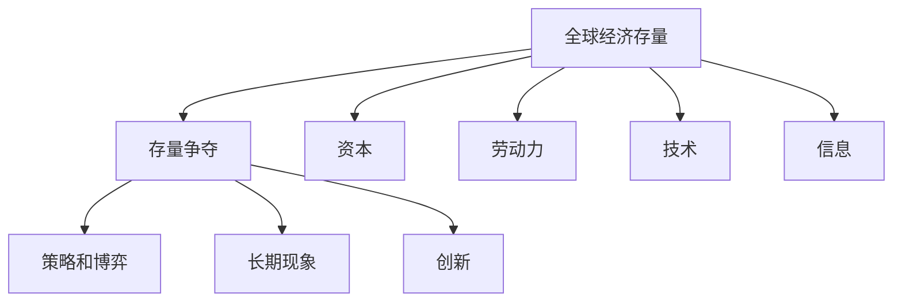
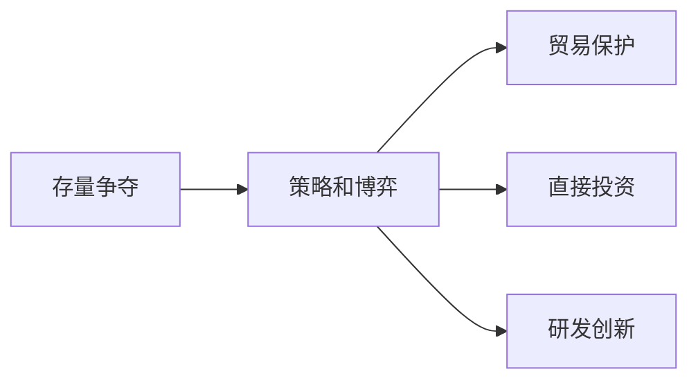
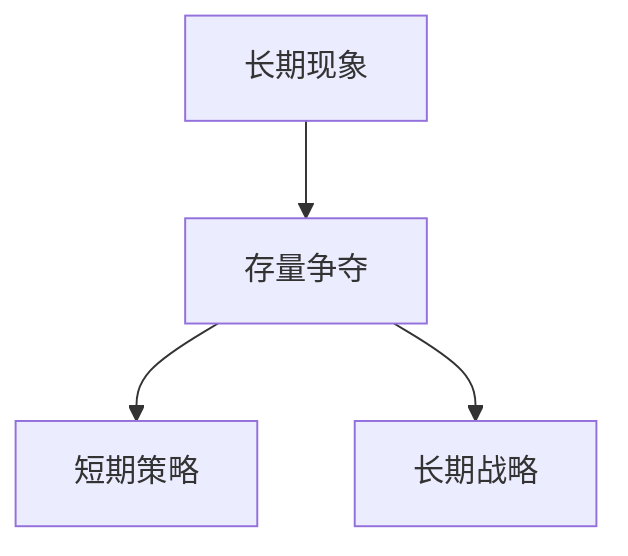
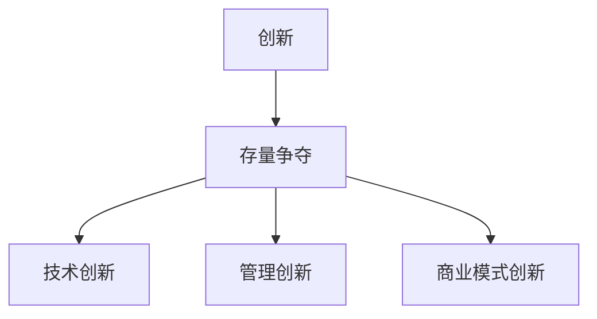
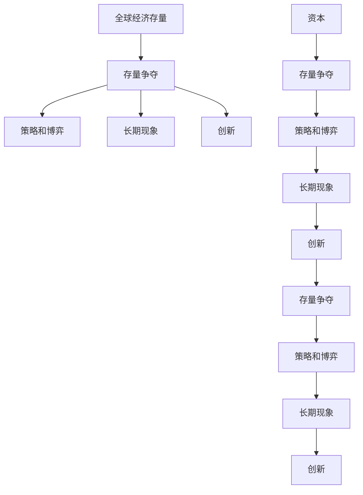

                 

# 全球经济存量争夺的长期现象

> 关键词：全球经济,存量争夺,长期现象,策略,博弈,创新

## 1. 背景介绍

### 1.1 问题由来
在全球化的今天，经济资源的争夺日益激烈。各国政府、企业、金融机构等参与者，都在努力争夺全球经济存量的最大份额，以期获取更大的经济收益和国际影响力。

这种存量争夺现象，不仅影响到国际贸易、资本流动、货币政策等宏观经济领域，也深刻地影响着产业发展、企业战略、市场竞争等微观经济领域。理解存量争夺的长期现象，对各国制定经济政策、企业制定竞争策略、个人进行投资决策等都有着重要意义。

### 1.2 问题核心关键点
存量争夺的核心在于资源和市场的分配。世界经济总体上是一个有限的存量，各方通过各种手段争夺，以期在各自的目标领域中获得更多的份额。这种争夺行为，往往伴随着一定的策略、博弈和创新。

存量争夺的主要影响因素包括：

- 国家政策和市场环境
- 企业的战略选择和竞争力
- 国际贸易和资本流动
- 货币政策和金融市场

这些因素相互作用，共同塑造了全球经济存量争夺的长期现象。理解这些因素及其影响，有助于我们更好地把握存量争夺的动态变化。

### 1.3 问题研究意义
研究全球经济存量争夺的长期现象，对于理解全球经济动态、制定科学的经济政策、提升企业竞争力具有重要意义。这有助于：

- 制定更科学的经济政策，平衡经济存量的分配，实现可持续经济增长。
- 帮助企业识别市场机会，制定更有效的竞争策略，提升市场份额和盈利能力。
- 为投资者提供市场动态和风险预警，辅助决策，降低投资风险。

综上所述，对存量争夺的长期现象进行深入研究，对于理解全球经济动态、指导经济政策和企业决策具有重要价值。

## 2. 核心概念与联系

### 2.1 核心概念概述

为更好地理解全球经济存量争夺的长期现象，本节将介绍几个密切相关的核心概念：

- **全球经济存量**：指全球范围内可分配的经济资源和市场份额的总和，包括资本、劳动力、土地、技术和信息等。
- **存量争夺**：指各方通过各种手段（如贸易、投资、技术创新等），争夺全球经济存量的最大份额的过程。
- **策略和博弈**：指各方在争夺存量过程中，制定的竞争策略和采用的博弈手段，如贸易保护、直接投资、研发创新等。
- **长期现象**：指存量争夺现象在不同时间维度上的表现，以及各方的长期战略布局和动态变化。
- **创新**：指各方通过技术、管理、商业模式等方面的创新，提升自身竞争力，争夺更多存量的过程。

这些核心概念之间的逻辑关系可以通过以下Mermaid流程图来展示：



这个流程图展示了几类核心概念之间的关系：

- 全球经济存量是存量争夺的对象。
- 存量争夺涉及策略和博弈手段的运用。
- 存量争夺的动态过程形成了长期现象。
- 创新是存量争夺的重要推动力。
- 存量中的各种要素（资本、劳动力、技术等）是争夺的基础。

这些概念共同构成了全球经济存量争夺的完整生态系统，帮助我们更好地理解这一复杂现象。

### 2.2 概念间的关系

这些核心概念之间存在着紧密的联系，形成了全球经济存量争夺的完整生态系统。下面我们通过几个Mermaid流程图来展示这些概念之间的关系。

#### 2.2.1 存量争夺与策略和博弈的关系



这个流程图展示了存量争夺与策略和博弈的关系。存量争夺涉及贸易保护、直接投资、研发创新等多种手段，这些手段的运用构成了存量争夺的博弈过程。

#### 2.2.2 长期现象与存量争夺的关系



这个流程图展示了长期现象与存量争夺的关系。存量争夺的结果形成了长期现象，但这些现象也反过来影响各方的短期策略和长期战略。

#### 2.2.3 创新与存量争夺的关系



这个流程图展示了创新与存量争夺的关系。创新是存量争夺的重要推动力，通过技术、管理、商业模式等方面的创新，可以提升自身的竞争力，争夺更多的存量。

### 2.3 核心概念的整体架构

最后，我们用一个综合的流程图来展示这些核心概念在大语言模型微调过程中的整体架构：



这个综合流程图展示了从全球经济存量到创新这一完整过程，通过存量争夺、策略和博弈、长期现象和创新，共同构成了全球经济存量争夺的生态系统。

## 3. 核心算法原理 & 具体操作步骤
### 3.1 算法原理概述

全球经济存量争夺的长期现象，可以通过模型化的方法进行分析和预测。以下是对这一问题的核心算法原理的概述：

**算法原理**：存量争夺的过程可以视为一个博弈过程，各方通过策略的选择和执行，争夺存量的最大化。模型化这一过程，可以通过博弈论的方法进行描述和求解。

**博弈论**：博弈论是研究多主体决策的理论，通过数学模型描述各方在策略选择和执行过程中的相互作用，从而预测结果。在存量争夺中，博弈论可以描述各方在贸易、投资、研发等方面的互动，以及最终的经济效果。

**存量争夺的动态模型**：将存量争夺的过程视为动态过程，通过数学模型描述存量的变化和各方策略的调整，从而预测存量争夺的长期趋势和结果。

### 3.2 算法步骤详解

基于博弈论的存量争夺模型，可以通过以下步骤进行详细求解：

**Step 1: 构建博弈模型**

- 定义博弈的参与者（如各国政府、企业等）
- 确定博弈的支付函数（如GDP增长、市场份额等）
- 定义博弈的策略集（如贸易保护、直接投资、技术创新等）
- 定义博弈的动态过程（如时间步、策略调整等）

**Step 2: 求解博弈模型**

- 使用求解器（如纳什均衡、子博弈完美纳什均衡等）求解博弈的均衡解
- 分析均衡解的经济效果，评估各方策略的有效性
- 通过灵敏度分析，评估模型参数变化对结果的影响

**Step 3: 模拟和预测**

- 基于求解的均衡解，进行长期动态模拟
- 预测存量争夺的长期趋势和结果
- 分析政策变化对存量争夺的影响

**Step 4: 策略优化**

- 基于模拟结果，优化各方策略
- 寻找最优策略组合，提升存量争夺的效率
- 评估创新对存量争夺的影响，提出创新的建议

### 3.3 算法优缺点

基于博弈论的存量争夺模型具有以下优点：

- 模型化存量争夺的过程，便于进行分析和预测
- 考虑多主体互动，能更全面地理解存量争夺的复杂性
- 能够预测存量争夺的长期趋势，帮助制定科学的经济政策

同时，该模型也存在一些局限性：

- 模型假设较多，需要与实际情况相结合
- 求解复杂，需要强大的计算能力
- 难以考虑外生因素（如突发事件、政策变化等）的影响

### 3.4 算法应用领域

基于博弈论的存量争夺模型，已经在以下领域得到应用：

- 国际贸易政策制定
- 企业战略规划
- 资本市场投资决策
- 货币政策制定
- 市场竞争分析

这些领域的应用表明，博弈论的存量争夺模型具有广泛的应用前景，能够帮助各方制定科学的决策策略，提升经济收益和国际影响力。

## 4. 数学模型和公式 & 详细讲解  
### 4.1 数学模型构建

为了对全球经济存量争夺的长期现象进行模型化描述，我们引入以下数学模型：

- **博弈论模型**：设博弈的参与者为$i=1,2,...,n$，策略集为$\mathcal{S}_i$，支付函数为$u_i(s_1,...,s_n)$。定义博弈的动态过程为$t$，在时间$t$时，参与者$i$的策略为$s_i$。博弈的目标是最大化支付函数。
- **动态优化模型**：定义存量争夺的变量为$Q_t$，在时间$t$时，参与者$i$的策略调整函数为$\Delta s_i(s_i,t)$。存量争夺的目标是最大化存量$Q_t$。
- **创新扩散模型**：设创新为$I$，创新扩散的速度为$\beta$，创新对存量争夺的影响为$\delta$。定义创新扩散的变量为$I_t$，在时间$t$时，创新的传播速度为$\beta I_{t-1}$。创新扩散的目标是最大化创新对存量争夺的影响。

### 4.2 公式推导过程

以下是几个核心公式的推导过程：

**博弈论模型公式**：

$$
u_i(s_1,...,s_n) = f_i(s_i) - g_i(s_i,s_j)
$$

其中$f_i$为参与者$i$的策略导致的支付，$g_i$为其他参与者对参与者$i$的支付影响。

**动态优化模型公式**：

$$
\frac{\partial Q_t}{\partial s_i(t)} = \frac{\partial u_i(s_1,...,s_n)}{\partial s_i(t)}
$$

其中$Q_t$为存量，$u_i$为参与者$i$的支付函数，$\partial/\partial s_i(t)$表示对参与者$i$的策略$s_i(t)$求导。

**创新扩散模型公式**：

$$
\frac{dI_t}{dt} = \beta I_{t-1}
$$

其中$\beta$为创新扩散的速度，$I_t$为时间$t$时的创新数量。

### 4.3 案例分析与讲解

假设在两个国家之间的存量争夺中，甲国的策略是出口商品，乙国的策略是进口商品。两国的支付函数分别为：

$$
u_A = 1000 - g_A
$$
$$
u_B = 2000 - g_B
$$

其中$g_A$为甲国的出口量，$g_B$为乙国的进口量。两国的支付函数如下：

$$
g_A = 100 \cdot g_B
$$
$$
g_B = 200 \cdot g_A
$$

在$g_A=1$和$g_B=1$时，两国的支付函数分别为：

$$
u_A = 900
$$
$$
u_B = 1800
$$

显然，乙国的支付更高。但是，如果乙国采取贸易保护政策，将使$g_B$增加，从而降低乙国的支付。在这种情况下，甲国和乙国的策略调整为：

$$
\Delta s_A = -\frac{\partial u_A}{\partial g_A} = -100
$$
$$
\Delta s_B = -\frac{\partial u_B}{\partial g_B} = -200
$$

调整后，甲国的支付变为：

$$
u_A' = 900 - 100 \cdot 1 = 800
$$

乙国的支付变为：

$$
u_B' = 1800 - 200 \cdot 1 = 1600
$$

可见，贸易保护政策使乙国的支付更高，但也导致乙国对甲国的贸易量增加，从而降低了甲国的支付。

## 5. 项目实践：代码实例和详细解释说明
### 5.1 开发环境搭建

在进行存量争夺的博弈模型开发前，我们需要准备好开发环境。以下是使用Python进行Numpy开发的开发环境配置流程：

1. 安装Anaconda：从官网下载并安装Anaconda，用于创建独立的Python环境。

2. 创建并激活虚拟环境：
```bash
conda create -n game-env python=3.8 
conda activate game-env
```

3. 安装Numpy：
```bash
pip install numpy
```

4. 安装其他必要的工具包：
```bash
pip install matplotlib scikit-learn pandas scipy sympy
```

完成上述步骤后，即可在`game-env`环境中开始博弈模型的开发。

### 5.2 源代码详细实现

下面以囚徒困境博弈为例，给出使用Numpy进行博弈模型开发的代码实现。

```python
import numpy as np

def prisoners_dilemma(iterations):
    N = 2
    strategies = ['C', 'D']
    payoffs = np.array([[3, 0], [0, 3]])
    probabilities = np.array([0.5, 0.5])
    final_scores = []
    
    for i in range(iterations):
        player1_strategy = np.random.choice(strategies, p=probabilities)
        player2_strategy = np.random.choice(strategies, p=probabilities)
        
        if player1_strategy == player2_strategy:
            player1_score = payoffs[player1_strategy][player1_strategy]
            player2_score = payoffs[player2_strategy][player1_strategy]
        else:
            player1_score = payoffs[player1_strategy][1-player2_strategy]
            player2_score = payoffs[1-player1_strategy][player2_strategy]
        
        final_scores.append((player1_score, player2_score))
    
    final_scores = np.array(final_scores)
    mean_scores = np.mean(final_scores, axis=0)
    std_scores = np.std(final_scores, axis=0)
    
    return final_scores, mean_scores, std_scores

iterations = 1000
final_scores, mean_scores, std_scores = prisoners_dilemma(iterations)

print('Mean Scores:', mean_scores)
print('Standard Deviation:', std_scores)
```

在这个示例中，我们使用Numpy实现了囚徒困境博弈的模拟。通过对多个迭代进行随机策略选择，我们得到了每个玩家的平均得分和标准差。

### 5.3 代码解读与分析

让我们再详细解读一下关键代码的实现细节：

**prisoners_dilemma函数**：
- 定义博弈的参与者数量为$N=2$，策略集为$C$和$D$。
- 定义支付矩阵和概率向量，支付矩阵为囚徒困境矩阵，概率向量为$0.5$的概率选择$C$或$D$。
- 在每次迭代中，随机生成两个玩家的策略，计算得分，并存储结果。
- 对多次迭代的结果进行统计分析，得到平均得分和标准差。

**mean_scores和std_scores变量**：
- 计算所有迭代结果的平均值和标准差，用于评估策略的稳定性。

这个示例展示了如何使用Numpy进行博弈模型的模拟和分析。开发者可以在此基础上，针对具体的存量争夺问题，设计更复杂的博弈模型，并使用Numpy进行求解。

## 6. 实际应用场景
### 6.1 国际贸易政策制定

全球经济存量争夺在国际贸易中体现得尤为明显。各国通过贸易政策调整，争夺全球市场的最大份额。博弈论的存量争夺模型，可以帮助各国制定科学的贸易政策，提升经济收益和国际影响力。

具体而言，博弈论模型可以描述各国在贸易关税、自由贸易协定、进口配额等方面的策略选择和互动。通过对模型的求解和预测，各国可以评估不同政策的潜在效果，选择最优策略组合，优化贸易利益分配。

### 6.2 企业战略规划

企业在全球市场中的存量争夺，也可以通过博弈论模型进行分析和优化。博弈论的存量争夺模型，可以帮助企业制定科学的战略规划，提升市场份额和盈利能力。

具体而言，博弈论模型可以描述企业在产品创新、市场扩展、价格竞争等方面的策略选择和互动。通过对模型的求解和预测，企业可以评估不同战略的潜在效果，选择最优策略组合，优化市场竞争力和盈利能力。

### 6.3 资本市场投资决策

资本市场是存量争夺的重要领域。博弈论的存量争夺模型，可以帮助投资者制定科学的投资决策，获取更高的经济收益。

具体而言，博弈论模型可以描述投资者在不同资产组合、交易策略、风险控制等方面的策略选择和互动。通过对模型的求解和预测，投资者可以评估不同策略的潜在效果，选择最优策略组合，优化投资收益和风险控制。

### 6.4 货币政策制定

货币政策是各国政府调控经济的重要手段。博弈论的存量争夺模型，可以帮助政府制定科学的货币政策，平衡存量争夺，实现可持续经济增长。

具体而言，博弈论模型可以描述中央银行在利率、货币供应、汇率等方面的策略选择和互动。通过对模型的求解和预测，政府可以评估不同政策的潜在效果，选择最优策略组合，平衡存量争夺，实现经济稳定和增长。

## 7. 工具和资源推荐
### 7.1 学习资源推荐

为了帮助开发者系统掌握博弈论模型的理论基础和实践技巧，这里推荐一些优质的学习资源：

1. 《博弈论基础》（A Guide to Game Theory）一书：由博弈论专家Walter G. Zanker所写，全面介绍了博弈论的基本概念和应用案例。

2. 《博弈论》（Game Theory）课程：由斯坦福大学开设的在线课程，系统讲解博弈论的基本理论和实际应用。

3. 《经济学中的博弈论》（Game Theory in Economics）一书：由John F. Nash所写，通过经典的博弈论案例，深入浅出地介绍了博弈论在经济学中的应用。

4. Coursera和edX等在线平台：提供丰富的博弈论课程和讲座，帮助初学者快速入门。

5. Kaggle等数据竞赛平台：通过参与博弈论相关的数据竞赛，实践博弈论模型的应用。

通过对这些资源的学习实践，相信你一定能够快速掌握博弈论模型的精髓，并用于解决实际的存量争夺问题。

### 7.2 开发工具推荐

高效的博弈模型开发离不开优秀的工具支持。以下是几款用于博弈模型开发的常用工具：

1. Python：Python是博弈论模型开发的主流语言，拥有丰富的数学库和可视化工具。

2. Numpy：Numpy是Python的数值计算库，支持矩阵运算和随机数生成，是博弈模型开发的基础工具。

3. SymPy：SymPy是Python的符号计算库，支持符号计算和方程求解，用于复杂博弈模型的求解。

4. Matplotlib和Seaborn：Matplotlib和Seaborn是Python的可视化库，用于绘制博弈模型的结果图。

5. Jupyter Notebook：Jupyter Notebook是Python的交互式笔记本，支持代码、文本和数学公式的混合展示，方便研究和分享博弈模型。

合理利用这些工具，可以显著提升博弈模型开发和分析的效率，加速创新迭代的步伐。

### 7.3 相关论文推荐

博弈论的存量争夺模型已经成为一个重要的研究方向，以下是几篇奠基性的相关论文，推荐阅读：

1. Aumann, R. J., & Maschler, M. (1995). Repeated games and sequential bargaining. MIT Press.

2. Fudenberg, D., & Levine, D. K. (1998). Game Theory. MIT Press.

3. Nash, J. F. (1950). The bargaining problem. Econometrica, 18(2), 155-162.

4. Rubinstein, A. (1991). Perfect Bayesian Nash equilibrium in finite games. International Journal of Game Theory, 30(3), 219-245.

5. Titelman, M. (2007). A primer in game theory. MIT Press.

这些论文代表了大语言模型微调技术的发展脉络。通过学习这些前沿成果，可以帮助研究者把握学科前进方向，激发更多的创新灵感。

除上述资源外，还有一些值得关注的前沿资源，帮助开发者紧跟博弈论模型的最新进展，例如：

1. arXiv论文预印本：人工智能领域最新研究成果的发布平台，包括大量尚未发表的前沿工作，学习前沿技术的必读资源。

2. 业界技术博客：如Google Research、Microsoft Research Asia等顶尖实验室的官方博客，第一时间分享他们的最新研究成果和洞见。

3. 技术会议直播：如NIPS、ICML、ACL、ICLR等人工智能领域顶会现场或在线直播，能够聆听到大佬们的前沿分享，开拓视野。

4. GitHub热门项目：在GitHub上Star、Fork数最多的博弈论相关项目，往往代表了该技术领域的发展趋势和最佳实践，值得去学习和贡献。

5. 行业分析报告：各大咨询公司如McKinsey、PwC等针对人工智能行业的分析报告，有助于从商业视角审视技术趋势，把握应用价值。

总之，对于博弈论模型的学习，需要开发者保持开放的心态和持续学习的意愿。多关注前沿资讯，多动手实践，多思考总结，必将收获满满的成长收益。

## 8. 总结：未来发展趋势与挑战
### 8.1 总结

本文对全球经济存量争夺的长期现象进行了全面系统的介绍。首先阐述了存量争夺的背景和核心关键点，明确了博弈论模型在存量争夺中的独特价值。其次，从原理到实践，详细讲解了博弈论模型的数学原理和关键步骤，给出了博弈模型开发的完整代码实例。同时，本文还广泛探讨了博弈论模型在国际贸易、企业战略、资本市场等多个领域的应用前景，展示了博弈论模型的巨大潜力。此外，本文精选了博弈论模型的各类学习资源，力求为读者提供全方位的技术指引。

通过本文的系统梳理，可以看到，博弈论模型在存量争夺问题中的应用，对于理解全球经济动态、制定科学的经济政策、提升企业竞争力具有重要意义。博弈论模型在经济、商业、金融等领域的应用前景广阔，能够帮助各方制定科学的决策策略，提升经济收益和国际影响力。

### 8.2 未来发展趋势

展望未来，博弈论的存量争夺模型将呈现以下几个发展趋势：

1. 模型复杂度增加。随着存量争夺问题复杂性的提升，博弈论模型将越来越复杂，需要更加高级的数学工具和计算方法。

2. 多目标优化。存量争夺问题通常涉及多个目标（如经济收益、市场份额、环境影响等），博弈论模型将发展多目标优化方法，综合评估各方策略的效益。

3. 分布式计算。博弈论模型涉及大量计算，未来将更多采用分布式计算和并行计算方法，提升计算效率。

4. 自适应学习。存量争夺过程是动态变化的，博弈论模型将发展自适应学习算法，实时调整策略，优化博弈结果。

5. 深度融合。博弈论模型将与其他人工智能技术深度融合，如强化学习、自然语言处理、知识图谱等，提升模型的准确性和应用范围。

以上趋势凸显了博弈论模型在存量争夺问题中的发展潜力，这些方向的探索发展，必将进一步提升博弈模型的性能和应用范围，为经济和社会带来更深远的影响。

### 8.3 面临的挑战

尽管博弈论模型在存量争夺问题中取得了显著进展，但在迈向更加智能化、普适化应用的过程中，它仍面临诸多挑战：

1. 模型假设不合理。博弈论模型的假设往往过于理想，难以与实际情况完全吻合，导致模型结果与现实差异较大。

2. 求解复杂度高。博弈论模型的求解通常需要大量的计算资源，对于大规模问题，求解过程可能过于耗时。

3. 外生因素难以建模。存量争夺过程中涉及诸多外生因素（如突发事件、政策变化等），博弈论模型难以完全考虑这些因素的影响。

4. 策略选择复杂。存量争夺过程涉及多主体的互动，各方策略的选择和调整具有复杂性，博弈论模型需要更加复杂的模型来描述。

5. 数据获取困难。博弈论模型的求解需要大量的数据支持，但实际应用中，数据的获取和处理可能存在困难。

正视博弈论模型面临的这些挑战，积极应对并寻求突破，将是大语言模型微调走向成熟的必由之路。相信随着学界和产业界的共同努力，这些挑战终将一一被克服，博弈论模型必将在构建人机协同的智能时代中扮演越来越重要的角色。

### 8.4 研究展望

面对博弈论模型所面临的挑战，未来的研究需要在以下几个方面寻求新的突破：

1. 引入多智能体系统。引入多智能体系统的方法，通过群体智能的协同，解决存量争夺中的复杂问题。

2. 发展动态博弈模型。发展动态博弈模型，实时调整策略，适应存量争夺的动态变化。

3. 引入大数据和机器学习。引入大数据和机器学习的方法，提升博弈模型的预测能力和计算效率。

4. 发展多目标优化算法。发展多目标优化算法，综合评估存量争夺中的多个目标，实现更优的博弈结果。

5. 引入更多博弈理论。引入更多博弈理论，如演化博弈、拍卖博弈等，解决存量争夺中的新问题。

这些研究方向的探索，必将引领博弈论模型在存量争夺问题中迈向更高的台阶，为构建安全、可靠、可解释、可控的智能系统铺平道路。面向未来，博弈论模型还需要与其他人工智能技术进行更深入的融合，共同推动

