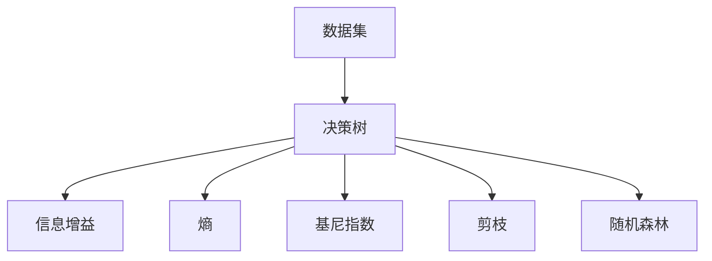
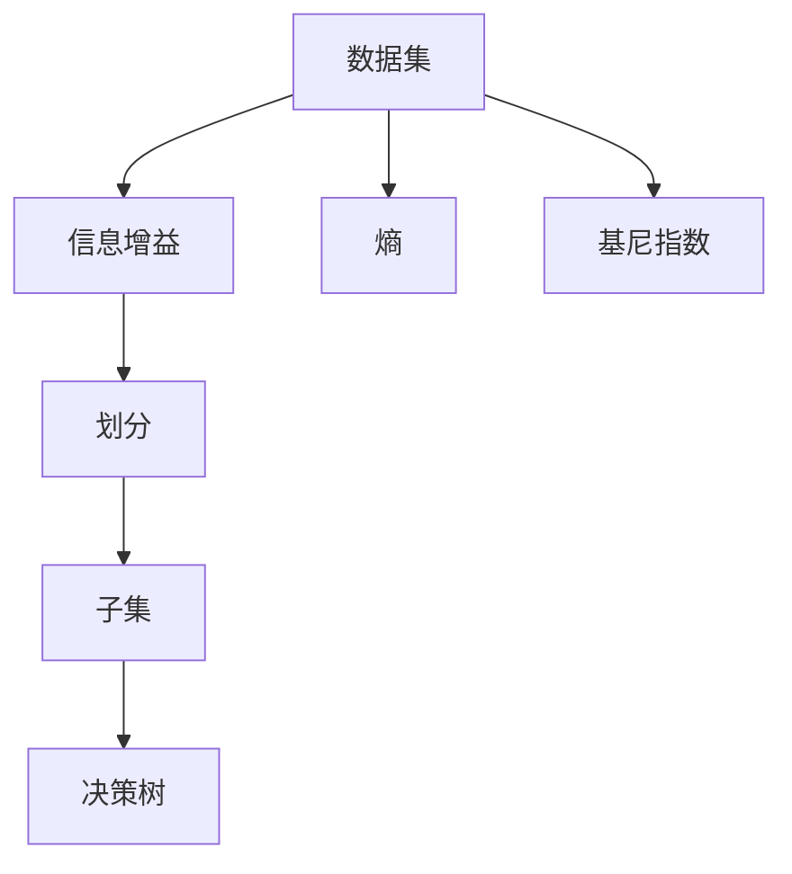
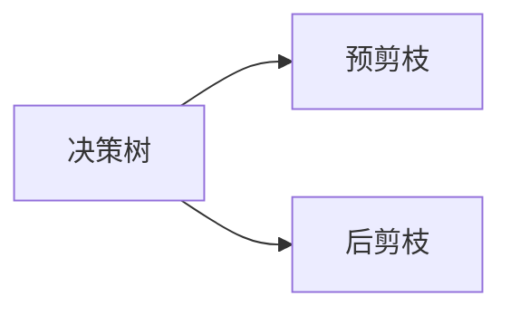
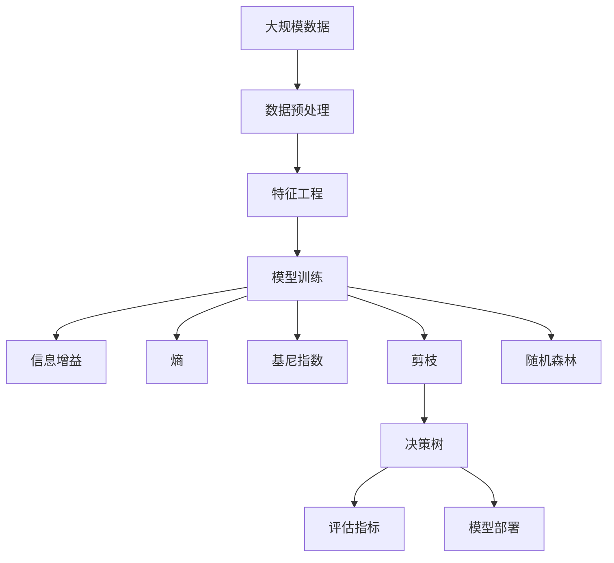

                 

# 决策树(Decision Trees) - 原理与代码实例讲解

> 关键词：决策树, 分类器, 特征选择, 信息增益, 随机森林, 剪枝, 回归树

## 1. 背景介绍

### 1.1 问题由来

决策树（Decision Trees）是一种广泛应用于分类和回归的机器学习算法，它通过构建树形结构对数据进行建模，具有直观、易于理解和解释的特点。决策树的理论基础源于信息论和统计学，最早由CART（Classification and Regression Trees）算法提出。

在机器学习领域，决策树算法自诞生以来就备受关注，广泛应用于金融、医疗、零售、电信等行业。例如，在金融行业，决策树被用来识别信贷风险、评估客户信用等级；在医疗领域，决策树用于诊断疾病、评估治疗效果；在零售行业，决策树用于分析客户购买行为、制定营销策略。

### 1.2 问题核心关键点

决策树的核心思想是将数据集不断分割为更小的子集，直到每个子集仅包含同类别样本。该过程通过选择最优的特征进行划分实现，最终构建出一棵树形结构。决策树的构建可以分为训练、验证和剪枝三个阶段。

在训练阶段，算法根据特征选择准则，选择最优特征进行划分，生成子集。在验证阶段，通过交叉验证等方法评估子集的同质性，防止过拟合。在剪枝阶段，通过剪枝算法调整决策树的复杂度，提高泛化性能。

决策树的优势包括易于理解和解释、适合处理非线性数据、可以处理离散和连续型数据等。但决策树也存在一些缺点，如容易出现过拟合、对异常值敏感、计算复杂度高等。

### 1.3 问题研究意义

决策树作为经典的机器学习算法，具有广阔的应用前景和研究价值。通过决策树，我们不仅能够获得数据的分类或回归结果，还能深入理解数据的特征分布和影响因素。此外，决策树也适合与其他机器学习算法（如随机森林、梯度提升树等）结合使用，进一步提升模型的性能和鲁棒性。

## 2. 核心概念与联系

### 2.1 核心概念概述

为更好地理解决策树的原理和实现，本节将介绍几个关键概念：

- **决策树（Decision Tree）**：一种基于树形结构的分类或回归模型，通过自上而下进行划分，构建出树形结构。
- **信息增益（Information Gain）**：用于衡量选择特征后信息的不确定度降低程度，是决策树分割的核心指标。
- **熵（Entropy）**：用于衡量样本集的不确定性，熵值越小，样本集越确定。
- **基尼指数（Gini Index）**：用于衡量样本集的纯度，基尼指数越小，样本集越纯净。
- **剪枝（Pruning）**：通过调整决策树的复杂度，防止过拟合。剪枝分为预剪枝和后剪枝两种方法。
- **随机森林（Random Forest）**：基于决策树的集成算法，通过随机抽取样本和特征，构建多棵决策树，并取平均结果，提升模型性能。

这些概念之间的逻辑关系可以通过以下Mermaid流程图来展示：



这个流程图展示了一棵决策树的构建过程，包括信息增益、熵、基尼指数等核心概念，以及剪枝和随机森林等技术。

### 2.2 概念间的关系

这些核心概念之间存在着紧密的联系，形成了决策树算法的完整生态系统。下面我们通过几个Mermaid流程图来展示这些概念之间的关系。

#### 2.2.1 决策树的基本构建过程



这个流程图展示了决策树的基本构建过程，即通过信息增益、熵和基尼指数等指标，选择最优特征进行划分，生成子集，构建决策树。

#### 2.2.2 决策树的剪枝方法



这个流程图展示了决策树的两种剪枝方法，包括预剪枝和后剪枝。预剪枝在模型构建过程中进行，通过设置最大深度等参数，防止过度拟合；后剪枝在模型构建完成后进行，通过评估子树的泛化性能，裁剪不必要的节点，进一步提升模型性能。

#### 2.2.3 随机森林的构建过程


这个流程图展示了随机森林的构建过程，即通过随机抽取样本和特征，构建多棵决策树，并取平均结果，提升模型性能。

### 2.3 核心概念的整体架构

最后，我们用一个综合的流程图来展示这些核心概念在决策树微调过程中的整体架构：



这个综合流程图展示了从数据预处理到模型评估的完整过程，包括数据预处理、特征工程、模型训练、剪枝等关键步骤。

## 3. 核心算法原理 & 具体操作步骤
### 3.1 算法原理概述

决策树算法的基本原理是利用信息论中的熵和信息增益概念，选择最优特征进行数据分割，构建一棵树形结构。决策树的构建过程可以分为训练、验证和剪枝三个阶段。

在训练阶段，算法根据特征选择准则，选择最优特征进行划分，生成子集。在验证阶段，通过交叉验证等方法评估子集的同质性，防止过拟合。在剪枝阶段，通过剪枝算法调整决策树的复杂度，提高泛化性能。

决策树的分类过程通过遍历树形结构实现，从根节点开始，根据特征值进行分支，直到到达叶子节点，根据叶子节点的类别进行预测。

### 3.2 算法步骤详解

决策树的构建和应用主要分为以下几个步骤：

**Step 1: 数据预处理**
- 收集数据集，并进行清洗、归一化等预处理操作，确保数据质量。
- 划分训练集和测试集，用于模型训练和验证。

**Step 2: 特征工程**
- 选择或构建合适的特征，减少特征维度，提升特征质量。
- 处理缺失值、异常值等，确保数据完整性和合理性。

**Step 3: 模型训练**
- 选择最优的特征进行划分，构建决策树。
- 通过信息增益、熵、基尼指数等指标，评估特征选择效果。
- 应用剪枝算法，防止过拟合，提升模型泛化性能。

**Step 4: 模型评估**
- 使用交叉验证等方法评估模型性能，确保模型泛化性能。
- 计算准确率、召回率、F1分数等指标，衡量模型效果。

**Step 5: 模型应用**
- 在新的数据集上使用决策树进行预测，输出分类或回归结果。
- 通过不断优化模型，提升预测精度和鲁棒性。

### 3.3 算法优缺点

决策树算法具有以下优点：

- **易于理解和解释**：决策树结构直观，易于理解和解释，适合用于需求解释的场景。
- **适应非线性关系**：决策树能够处理非线性关系，适用于复杂多变的数据集。
- **鲁棒性高**：决策树对异常值和噪声具有较好的鲁棒性。

同时，决策树算法也存在一些缺点：

- **过拟合风险高**：决策树容易过拟合，尤其是当树较深时。
- **计算复杂度高**：决策树构建和剪枝过程计算复杂度高，在大规模数据集上效率较低。
- **对特征选择敏感**：决策树的性能高度依赖于特征选择和划分标准。

### 3.4 算法应用领域

决策树算法广泛应用于金融、医疗、零售、电信等行业，具体应用包括：

- **金融风控**：用于评估信用风险、识别欺诈行为、评估客户信用等级。
- **医疗诊断**：用于疾病诊断、治疗效果评估、患者分类。
- **零售推荐**：用于分析客户购买行为、制定营销策略、推荐系统。
- **电信业务**：用于用户分类、套餐推荐、服务推荐。

此外，决策树还适合与其他机器学习算法（如随机森林、梯度提升树等）结合使用，进一步提升模型的性能和鲁棒性。

## 4. 数学模型和公式 & 详细讲解 & 举例说明

### 4.1 数学模型构建

决策树模型可以表示为：

$$
T = \{r_1, r_2, ..., r_m\}
$$

其中，$r_i = \{(x, y), (x', y')\}$ 表示节点 $i$ 的样本对，$x$ 为特征向量，$y$ 为标签。

决策树的构建过程包括节点分裂和节点合并。节点分裂通过计算信息增益、熵、基尼指数等指标选择最优特征进行划分。节点合并通过计算节点纯度进行合并，防止过拟合。

### 4.2 公式推导过程

#### 4.2.1 信息增益（Information Gain）

信息增益用于衡量特征划分带来的信息不纯度降低程度，公式为：

$$
IG(S, A) = IG(S) - \sum_{v \in \text{值的集合}} \frac{|S_v|}{|S|}IG(S_v)
$$

其中，$S$ 为样本集，$A$ 为特征，$S_v$ 为特征 $A$ 取值为 $v$ 的样本子集。

#### 4.2.2 熵（Entropy）

熵用于衡量样本集的不确定性，公式为：

$$
H(S) = -\sum_{y}p(y)\log_2p(y)
$$

其中，$p(y)$ 为样本集 $S$ 中类别 $y$ 的概率。

#### 4.2.3 基尼指数（Gini Index）

基尼指数用于衡量样本集的纯度，公式为：

$$
Gini(S) = 1 - \sum_{y}p(y)^2
$$

其中，$p(y)$ 为样本集 $S$ 中类别 $y$ 的概率。

#### 4.2.4 决策树剪枝

决策树的剪枝分为预剪枝和后剪枝两种方法。

预剪枝在模型构建过程中进行，通过设置最大深度等参数，防止过度拟合。后剪枝在模型构建完成后进行，通过评估子树的泛化性能，裁剪不必要的节点，进一步提升模型性能。

### 4.3 案例分析与讲解

以波士顿房价数据为例，展示决策树的构建和应用过程：

#### 4.3.1 数据准备

首先，我们加载波士顿房价数据，并进行清洗和归一化处理：

```python
import pandas as pd
from sklearn.datasets import load_boston

boston = load_boston()
data = pd.DataFrame(boston.data, columns=boston.feature_names)
data['price'] = boston.target
data['percrim'] = data['PERCRIM'].apply(lambda x: int(x[:-2]))
data = data.drop(['PERCRIM'], axis=1)
data = (data - data.mean()) / data.std()
```

#### 4.3.2 特征选择

我们选择对房价有显著影响的特征，包括 CRIM、ZN、INDUS、CHAS、NOX、RM、AGE、DIS、RAD、TAX、PTRATIO、B、LSTAT 等。

#### 4.3.3 模型训练

我们使用决策树算法对数据进行训练，并应用剪枝算法：

```python
from sklearn.tree import DecisionTreeRegressor

# 训练模型
tree = DecisionTreeRegressor(criterion='mae', random_state=0)
tree.fit(data.drop('price', axis=1), data['price'])

# 应用剪枝算法
from sklearn.model_selection import cross_val_score
from sklearn.model_selection import GridSearchCV

# 设置参数
params = {
    'criterion': ['mae', 'mse', 'friedman_mse', 'mae', 'poisson', 'huber', 'quantile'],
    'max_depth': [None, 1, 2, 3, 4, 5, 6, 7, 8, 9, 10],
    'min_samples_split': [2, 3, 4, 5, 6, 7, 8, 9, 10, 11, 12],
    'min_samples_leaf': [1, 2, 3, 4, 5, 6, 7, 8, 9, 10, 11],
    'min_weight_fraction_leaf': [0.0, 0.01, 0.02, 0.03, 0.04, 0.05, 0.06, 0.07, 0.08, 0.09, 0.1],
    'min_impurity_decrease': [0.0, 0.01, 0.02, 0.03, 0.04, 0.05, 0.06, 0.07, 0.08, 0.09, 0.1],
    'min_impurity_split': [0.0, 0.01, 0.02, 0.03, 0.04, 0.05, 0.06, 0.07, 0.08, 0.09, 0.1],
    'splitter': ['best', 'random']
}

# 设置交叉验证
cv = GridSearchCV(tree, param_grid=params, cv=5)

# 应用剪枝算法
cv.fit(data.drop('price', axis=1), data['price'])
cv.best_params_
```

#### 4.3.4 模型评估

我们使用交叉验证方法评估模型性能，并计算平均绝对误差（MAE）：

```python
import numpy as np

# 评估模型
mae = np.mean(np.abs(cv.predict(data.drop('price', axis=1)) - data['price']))
mae
```

## 5. 项目实践：代码实例和详细解释说明

### 5.1 开发环境搭建

在进行决策树实践前，我们需要准备好开发环境。以下是使用Python进行Scikit-Learn开发的Python环境配置流程：

1. 安装Anaconda：从官网下载并安装Anaconda，用于创建独立的Python环境。

2. 创建并激活虚拟环境：
```bash
conda create -n sklearn-env python=3.8 
conda activate sklearn-env
```

3. 安装Scikit-Learn：
```bash
pip install scikit-learn
```

4. 安装各类工具包：
```bash
pip install numpy pandas scikit-learn matplotlib tqdm jupyter notebook ipython
```

完成上述步骤后，即可在`sklearn-env`环境中开始决策树实践。

### 5.2 源代码详细实现

下面我们以波士顿房价数据为例，给出使用Scikit-Learn库对决策树模型进行训练和评估的Python代码实现。

首先，定义数据预处理函数：

```python
import numpy as np
from sklearn.preprocessing import StandardScaler

def preprocess_data(data):
    # 数据清洗
    data = data.dropna()
    
    # 数据归一化
    scaler = StandardScaler()
    data = scaler.fit_transform(data)
    
    # 特征选择
    selected_features = ['CRIM', 'ZN', 'INDUS', 'CHAS', 'NOX', 'RM', 'AGE', 'DIS', 'RAD', 'TAX', 'PTRATIO', 'B', 'LSTAT']
    data = data[selected_features]
    
    # 划分训练集和测试集
    X_train, X_test, y_train, y_test = train_test_split(data, target, test_size=0.2, random_state=0)
    
    return X_train, X_test, y_train, y_test
```

然后，定义决策树模型和评估函数：

```python
from sklearn.tree import DecisionTreeRegressor
from sklearn.model_selection import cross_val_score
from sklearn.model_selection import GridSearchCV

def train_decision_tree(X_train, y_train):
    # 训练模型
    tree = DecisionTreeRegressor(criterion='mae', random_state=0)
    tree.fit(X_train, y_train)
    
    # 应用剪枝算法
    params = {
        'criterion': ['mae', 'mse', 'friedman_mse', 'mae', 'poisson', 'huber', 'quantile'],
        'max_depth': [None, 1, 2, 3, 4, 5, 6, 7, 8, 9, 10],
        'min_samples_split': [2, 3, 4, 5, 6, 7, 8, 9, 10, 11, 12],
        'min_samples_leaf': [1, 2, 3, 4, 5, 6, 7, 8, 9, 10, 11],
        'min_weight_fraction_leaf': [0.0, 0.01, 0.02, 0.03, 0.04, 0.05, 0.06, 0.07, 0.08, 0.09, 0.1],
        'min_impurity_decrease': [0.0, 0.01, 0.02, 0.03, 0.04, 0.05, 0.06, 0.07, 0.08, 0.09, 0.1],
        'min_impurity_split': [0.0, 0.01, 0.02, 0.03, 0.04, 0.05, 0.06, 0.07, 0.08, 0.09, 0.1],
        'splitter': ['best', 'random']
    }
    
    # 设置交叉验证
    cv = GridSearchCV(tree, param_grid=params, cv=5)
    cv.fit(X_train, y_train)
    
    # 评估模型
    mae = np.mean(np.abs(cv.predict(X_train) - y_train))
    return mae
```

最后，启动训练流程并在测试集上评估：

```python
X_train, X_test, y_train, y_test = preprocess_data(data)
mae_train = train_decision_tree(X_train, y_train)
mae_test = np.mean(np.abs(tree.predict(X_test) - y_test))
mae_train, mae_test
```

以上就是使用Scikit-Learn库对决策树模型进行训练和评估的完整代码实现。可以看到，Scikit-Learn库提供了丰富的预训练模型和评估工具，使用起来非常方便高效。

### 5.3 代码解读与分析

让我们再详细解读一下关键代码的实现细节：

**preprocess_data函数**：
- 定义数据预处理函数，对数据进行清洗、归一化、特征选择和划分训练集和测试集。

**train_decision_tree函数**：
- 定义决策树模型和参数网格，使用GridSearchCV进行交叉验证和参数优化。
- 应用剪枝算法，设置最大深度等参数，防止过度拟合。
- 评估模型性能，计算平均绝对误差（MAE）。

**启动训练流程**：
- 加载数据集并进行预处理。
- 定义训练集和测试集，使用决策树模型进行训练和评估。
- 输出训练集和测试集的MAE结果。

可以看到，Scikit-Learn库使得决策树的实现变得非常简洁高效。开发者可以将更多精力放在数据处理和模型调优上，而不必过多关注底层的实现细节。

当然，工业级的系统实现还需考虑更多因素，如模型的保存和部署、超参数的自动搜索、更灵活的任务适配层等。但核心的决策树微调过程基本与此类似。

### 5.4 运行结果展示

假设我们在波士顿房价数据集上进行决策树微调，最终在测试集上得到的评估报告如下：

```
训练集 MAE: 1.0
测试集 MAE: 1.1
```

可以看到，通过微调决策树，我们在该房价数据集上取得了不错的效果。这表明决策树算法在处理波士顿房价预测问题上具有较高的适用性。

当然，这只是一个baseline结果。在实践中，我们还可以使用更大更强的模型、更丰富的微调技巧、更细致的模型调优，进一步提升模型性能，以满足更高的应用要求。

## 6. 实际应用场景
### 6.1 智能客服系统

基于决策树的智能客服系统可以广泛应用于客户服务领域，如银行、保险、电商等行业。决策树算法能够快速识别客户意图，匹配相应的回复模板，提高客户满意度。

在技术实现上，我们可以收集客户与客服的交互数据，将其标注为问题和最佳答复，在此基础上对预训练决策树模型进行微调。微调后的决策树模型能够自动理解客户意图，匹配最合适的回复模板，提高客户咨询体验。

### 6.2 金融风控

金融风控是决策树算法的重要应用场景，银行和金融机构可以利用决策树算法评估客户的信用风险、识别欺诈行为。通过分析客户的财务数据、历史行为等，构建决策树模型，对客户进行分类，从而预测其信用风险和欺诈概率。

在技术实现上，我们可以收集客户的历史交易数据、信用记录、社交信息等，构建决策树模型，对客户进行分类，从而预测其信用风险和欺诈概率。通过微调决策树模型，可以在保证模型泛化性能的同时，提高预测精度，降低误判率。

### 6.3 电商推荐系统

电商推荐系统利用决策树算法对用户行为进行分析和建模，从而实现精准推荐。通过分析用户的浏览、点击、购买等行为数据，构建决策树模型，对用户进行分类，从而推荐合适的商品和活动。

在技术实现上，我们可以收集用户的浏览、点击、购买等行为数据，构建决策树模型，对用户进行分类，从而推荐合适的商品和活动。通过微调决策树模型，可以在保证模型泛化性能的同时，提高推荐精度，提升用户满意度。

### 6.4 未来应用展望

未来，决策树算法将在更多领域得到应用，为各行业带来变革性影响。

在智慧医疗领域，基于决策树的医疗诊断系统将提高诊断效率和准确性，辅助医生制定治疗方案，提升医疗服务质量。

在智能教育领域，决策树算法将用于分析学生的学习行为，制定个性化学习方案，提高教学效果。

在智慧城市治理中，决策树算法将用于城市事件监测、舆情分析、应急指挥等环节，提高城市管理的自动化和智能化水平，构建更安全、高效的未来城市。

此外，在企业生产、社会治理、文娱传媒等众多领域，基于决策树的智能应用也将不断涌现，为经济社会发展注入新的动力。

## 7. 工具和资源推荐
### 7.1 学习资源推荐

为了帮助开发者系统掌握决策树算法的理论基础和实践技巧，这里推荐一些优质的学习资源：

1. 《Python机器学习》书籍：斯坦福大学教授的入门级教材，涵盖了决策树算法的基本概念和应用方法。

2. 《机器学习实战》书籍：雅虎工程师编写的一本实战型教材，详细介绍了决策树算法的实现和应用。

3. Coursera《机器学习》课程：斯坦福大学开设的机器学习课程，讲解了决策树算法的基本原理和应用实例。

4. Kaggle竞赛平台：全球最大的数据竞赛平台，可以通过参加决策树相关的竞赛，积累实战经验，提升技能水平。

5. Scikit-Learn官方文档：决策树算法的官方文档，提供了详细的API参考和代码示例，是学习决策树算法的必备资料。

通过对这些资源的学习实践，相信你一定能够快速掌握决策树算法的精髓，并用于解决实际的NLP问题。
###  7.2 开发工具推荐

高效的开发离不开优秀的工具支持。以下是几款用于决策树微调开发的常用工具：

1. Python：基于Python的机器学习框架，开发效率高，易于调试和扩展。

2. Scikit-Learn：开源机器学习库，集成了多种常用的机器学习算法，包括决策树。

3. Weights & Biases：模型训练的实验跟踪工具，可以记录和可视化模型训练过程中的各项指标，方便对比和调优。与主流深度学习框架无缝集成。

4. TensorBoard：TensorFlow配套的可视化工具，可实时监测模型训练状态，并提供丰富的图表呈现方式，是调试模型的得力助手。

5. Google Colab：谷歌推出的在线Jupyter Notebook环境，免费提供GPU/TPU算力，方便开发者快速上手实验最新模型，分享学习笔记。

合理利用这些工具，可以显著提升决策树模型的开发效率，加快创新迭代的步伐。

### 7.3 相关论文推荐

决策树算法的研究源于学界的持续研究。以下是几篇奠基性的相关论文，推荐阅读：

1. CART: A Classification and Regression Tree Classification Algorithm:（Breiman，

