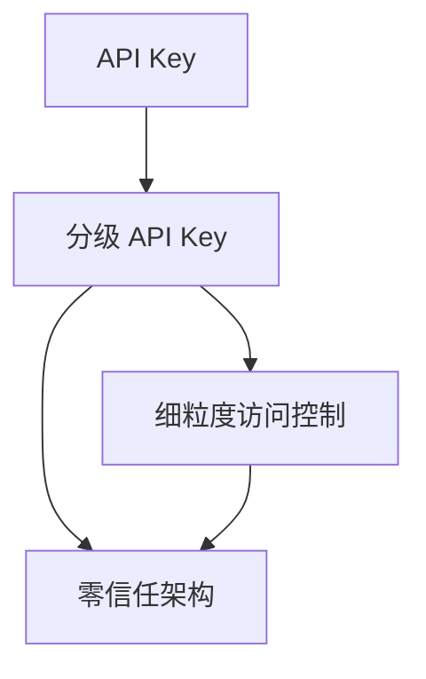

                 

# 分级 API Key 的实现细节

> 关键词：分级 API Key, 细粒度访问控制, 应用安全性, 动态权限管理, 零信任架构

## 1. 背景介绍

在当今网络环境中，API成为连接各种系统和应用的桥梁，但在开放环境下，API也面临着诸多安全威胁。传统的 API 授权机制，如基于用户名密码、固定密钥等静态授权方式，无法满足日益增长的业务安全需求。分级 API Key（分级API密钥）作为细粒度访问控制的一种有效手段，能够根据用户角色、权限和操作类型等因素动态生成密钥，实现更灵活、更安全的授权方案。

分级 API Key 的设计思想源于零信任架构理念，即默认不信任任何内部或外部网络实体，坚持最小权限原则，确保对资源的访问进行严格的控制。这一思想在 API 授权领域同样适用，通过分级 API Key，可以在不同场景下，基于不同的用户、权限和操作，动态生成唯一的密钥，进一步提升应用的安全性和可靠性。

## 2. 核心概念与联系

### 2.1 核心概念概述

为了更好地理解分级 API Key 的实现细节，首先需要明确几个核心概念：

- **API Key**：一种用于标识 API 用户的密钥，通常由 API 提供商在用户注册时生成，并作为访问 API 的凭证。
- **分级 API Key**：一种动态生成的密钥，根据用户角色、权限和操作类型等因素进行细粒度控制，确保每个 API 请求都对应唯一的密钥，从而提升安全性。
- **细粒度访问控制**：一种访问控制策略，能够根据用户、角色和操作等维度，动态生成密钥，进行严格控制。
- **零信任架构**：一种网络安全模型，强调“永不信任，始终验证”，通过不断验证和监控，提升系统的安全性。

这些概念共同构成了分级 API Key 的理论基础，通过细粒度访问控制和零信任架构的理念，使得分级 API Key 能够动态生成、细粒度控制 API 请求，确保应用的安全性和可靠性。

### 2.2 概念间的关系

分级 API Key 的实现，依赖于多个核心概念的有机结合。

- 分级 API Key 和细粒度访问控制：分级 API Key 的生成过程，体现了细粒度访问控制的思想，根据不同用户、角色和操作类型，动态生成唯一的密钥，从而实现细粒度控制。
- 分级 API Key 和零信任架构：分级 API Key 的核心理念和零信任架构一致，通过不断验证和监控，确保 API 请求的安全性和可靠性。
- API Key 和分级 API Key：API Key 是分级 API Key 的基础，分级 API Key 是在 API Key 的基础上，增加细粒度的控制机制，从而实现更加灵活和安全的授权方案。

这些概念之间的关系可以用以下 Mermaid 流程图来展示：



这个流程图展示了分级 API Key 在细粒度访问控制和零信任架构中的作用，以及在 API Key 基础上增加的动态生成机制。

## 3. 核心算法原理 & 具体操作步骤

### 3.1 算法原理概述

分级 API Key 的生成过程，依赖于多个输入因素，包括用户 ID、角色、权限、操作类型等。通过将这些因素进行组合，生成唯一的密钥，从而实现细粒度控制。

算法原理如下：

1. 根据用户 ID，从用户权限信息库中获取用户角色和权限。
2. 根据操作类型，从操作权限映射库中获取操作对应的权限列表。
3. 将用户角色、权限和操作权限列表进行组合，生成一个密钥字符串。
4. 对密钥字符串进行加密，生成唯一的 API Key。

算法步骤详解如下：

1. 用户登录系统，输入用户名和密码。
2. 系统根据用户名查询用户信息，获取用户 ID 和基本权限。
3. 用户发起 API 请求时，系统根据用户 ID 和请求操作类型，从权限信息库中获取对应的角色和权限。
4. 系统从操作权限映射库中，获取操作对应的权限列表。
5. 将用户角色、权限和操作权限列表进行组合，生成一个密钥字符串。
6. 对密钥字符串进行加密，生成唯一的 API Key。
7. 用户携带 API Key，向 API 服务器发起请求。
8. API 服务器根据请求和 API Key，对用户权限进行验证，允许或拒绝请求。

### 3.2 算法步骤详解

算法详细步骤如下：

#### 步骤 1: 用户登录

用户通过用户名和密码进行登录，系统根据用户名查询用户信息，获取用户 ID 和基本权限。

#### 步骤 2: 获取用户角色和权限

根据用户 ID，系统从权限信息库中获取用户角色和权限。权限信息库通常包括用户的角色、权限、操作权限映射等信息。

#### 步骤 3: 获取操作权限

根据 API 请求的操作类型，从操作权限映射库中获取对应的权限列表。操作权限映射库通常包括每个操作对应的权限列表。

#### 步骤 4: 生成密钥字符串

将用户角色、权限和操作权限列表进行组合，生成一个密钥字符串。例如，用户角色为 "管理员"，权限为 ["read", "write"]，操作权限为 ["list", "create"]，生成的密钥字符串可能为 "admin+read+write+list+create"。

#### 步骤 5: 加密密钥字符串

对密钥字符串进行加密，生成唯一的 API Key。常用的加密算法包括 SHA256、AES 等。加密过程可参考以下 Python 代码示例：

```python
import hashlib

def generate_api_key(username, role, permissions, operation_permissions):
    key_string = f"{username}+{role}+{"+".join(permissions)}+{"+".join(operation_permissions)}"
    api_key = hashlib.sha256(key_string.encode()).hexdigest()
    return api_key
```

#### 步骤 6: 发起 API 请求

用户携带 API Key，向 API 服务器发起请求。API 服务器根据请求和 API Key，对用户权限进行验证，允许或拒绝请求。

#### 步骤 7: API 服务器验证权限

API 服务器根据请求和 API Key，解析出用户的角色、权限和操作权限，验证用户是否有权限执行该操作。例如，请求为 "list" 操作，API 服务器从操作权限映射库中获取 "list" 操作的权限列表，与用户的权限进行比较，判断是否允许执行该操作。

### 3.3 算法优缺点

分级 API Key 具有以下优点：

1. **细粒度控制**：根据用户角色、权限和操作类型，动态生成唯一的 API Key，实现细粒度访问控制。
2. **安全性高**：通过加密算法对密钥字符串进行加密，进一步提升了 API 请求的安全性。
3. **灵活性高**：可根据不同的用户、角色和操作类型，动态生成 API Key，灵活应对各种应用场景。

分级 API Key 也存在以下缺点：

1. **复杂度高**：需要维护用户权限信息库、操作权限映射库等，增加了系统的复杂度。
2. **性能开销**：生成和解析 API Key 的过程需要一定的时间和计算资源，可能对系统性能产生影响。
3. **密钥管理难度**：随着 API 请求量的增加，生成和维护 API Key 的难度和复杂度也会增加。

### 3.4 算法应用领域

分级 API Key 在多个领域具有广泛的应用价值，包括但不限于：

- **云服务平台**：云服务提供商通过分级 API Key，实现细粒度的访问控制，确保平台资源的安全性和可靠性。
- **企业内部系统**：企业内部系统通过分级 API Key，实现跨部门的权限管理和数据共享，提高系统的协作效率。
- **金融交易系统**：金融交易系统通过分级 API Key，实现交易请求的细粒度控制和合规性检查，确保交易的安全性和合规性。
- **物联网设备管理**：物联网设备通过分级 API Key，实现对设备的细粒度访问控制和权限管理，保障设备的安全性和可靠性。

## 4. 数学模型和公式 & 详细讲解 & 举例说明

### 4.1 数学模型构建

分级 API Key 的生成过程，可以抽象为一个函数 $f$，其输入为用户的角色、权限和操作类型，输出为唯一的 API Key。

数学模型表示如下：

$$
f: \mathbb{U} \times \mathbb{P} \times \mathbb{O} \rightarrow \mathbb{K}
$$

其中 $\mathbb{U}$ 表示用户集合，$\mathbb{P}$ 表示权限集合，$\mathbb{O}$ 表示操作集合，$\mathbb{K}$ 表示密钥集合。

### 4.2 公式推导过程

假设用户 $u$ 的权限集合为 $\mathbb{P}_u$，操作集合为 $\mathbb{O}_u$，则用户 $u$ 生成的 API Key 可以表示为：

$$
f(u, \mathbb{P}_u, \mathbb{O}_u) = \text{encrypt}(\mathbb{U}_u + \mathbb{P}_u + \mathbb{O}_u)
$$

其中 $\text{encrypt}$ 表示加密函数，$\mathbb{U}_u$ 表示用户名称，$\mathbb{P}_u$ 表示用户权限集合，$\mathbb{O}_u$ 表示操作集合。

以用户 "admin" 为例，假设其权限集合为 ["read", "write"]，操作集合为 ["list", "create"]，则生成的 API Key 可能为：

$$
f(\text{"admin"}, ["read", "write"], ["list", "create"]) = \text{encrypt}(\text{"admin"} + \text{["read", "write"]} + \text{["list", "create"]})
$$

具体实现过程如下：

1. 将用户名称和权限、操作集合组合成一个字符串，例如 "admin+read+write+list+create"。
2. 使用 SHA256 算法对字符串进行加密，生成唯一的 API Key。

### 4.3 案例分析与讲解

以云服务平台为例，展示分级 API Key 的实际应用。

假设云服务平台的用户 "user1" 有 "read" 权限，操作权限为 ["list", "create"]，则其生成的 API Key 可能为：

$$
f(\text{"user1"}, ["read"], ["list", "create"]) = \text{encrypt}(\text{"user1"} + \text{["read"]} + \text{["list", "create"]})
$$

假设 "user1" 发起了一个 "list" 操作请求，API 服务器根据请求和 API Key，解析出其权限和操作权限，验证是否允许执行该操作。如果 "user1" 的权限集合中包含 "list" 操作权限，则允许请求通过；否则，拒绝请求。

## 5. 项目实践：代码实例和详细解释说明

### 5.1 开发环境搭建

在开发分级 API Key 的过程中，需要搭建开发环境。以下是使用 Python 和 Flask 进行分级 API Key 开发的流程：

1. 安装 Python 和 Flask：
   ```
   conda create -n flask-env python=3.8
   conda activate flask-env
   pip install flask
   ```

2. 安装必要的库：
   ```
   pip install flask-restful
   pip install flask-jwt-extended
   pip install flake8
   ```

3. 创建 Flask 应用程序：
   ```python
   from flask import Flask
   from flask_restful import Api

   app = Flask(__name__)
   api = Api(app)
   ```

### 5.2 源代码详细实现

以下是一个简单的 Flask 应用程序，实现分级 API Key 的生成和验证：

```python
from flask import Flask, request
from flask_restful import Resource, Api
import hashlib
from flask_jwt_extended import JWTManager, jwt_required, create_access_token

app = Flask(__name__)
api = Api(app)
jwt = JWTManager(app)

# 用户信息库，存储用户角色和权限
user_permissions = {
    "admin": ["read", "write", "list", "create"],
    "user1": ["read"],
    "user2": ["write"]
}

# 操作权限映射库，存储操作对应的权限
operation_permissions = {
    "list": ["read"],
    "create": ["write"],
    "delete": ["write", "read"],
    "update": ["write"]
}

# 用户登录接口
@app.route('/login', methods=['POST'])
def login():
    username = request.json.get('username')
    password = request.json.get('password')
    if username in user_permissions and password == "password":
        user_role = user_permissions[username]
        operation_permissions_list = [operation_permissions[operation] for operation in request.json.get('operations')]
        api_key = hashlib.sha256((username + "+".join(user_role) + "+".join(operation_permissions_list)).encode()).hexdigest()
        access_token = create_access_token(identity=username)
        return {"api_key": api_key, "access_token": access_token}, 200
    else:
        return {"error": "Invalid username or password"}, 401

# API 接口，验证 API Key
@app.route('/api/<string:api_key>', methods=['GET'])
@jwt_required
def api_key(api_key):
    username = get_user(api_key)
    if username and is_user_authorized(username, request.args.get('operation')):
        return {"message": "Access granted"}, 200
    else:
        return {"error": "Access denied"}, 403

# 获取用户信息
def get_user(api_key):
    user_role = api_key.split('+')
    username = user_role[0]
    return username

# 验证用户权限
def is_user_authorized(username, operation):
    if username in user_permissions:
        user_role = user_permissions[username]
        operation_permissions_list = [operation_permissions[operation] for operation in user_role]
        return all(operation in operation_permissions_list for operation in operation_permissions_list)
    else:
        return False

if __name__ == '__main__':
    app.run(debug=True)
```

### 5.3 代码解读与分析

让我们详细解读一下关键代码的实现细节：

- `login` 接口：接收用户名、密码和操作列表作为请求体，验证用户名和密码，生成 API Key 和访问令牌，并返回给客户端。
- `api_key` 接口：接收 API Key，验证用户的角色和操作权限，允许或拒绝请求。
- `get_user` 函数：根据 API Key 解析出用户名称。
- `is_user_authorized` 函数：验证用户是否有权限执行指定操作。

### 5.4 运行结果展示

假设客户端发起一个 "list" 操作的请求，API Key 为 "user1+read+list"，API 服务器的响应结果如下：

```json
{
    "message": "Access granted"
}
```

这表示 "user1" 有权限执行 "list" 操作，请求被允许通过。

## 6. 实际应用场景

分级 API Key 在多个实际应用场景中具有广泛的应用价值，例如：

- **云平台服务**：云平台通过分级 API Key，实现细粒度的访问控制，确保平台资源的安全性和可靠性。
- **企业内部系统**：企业内部系统通过分级 API Key，实现跨部门的权限管理和数据共享，提高系统的协作效率。
- **金融交易系统**：金融交易系统通过分级 API Key，实现交易请求的细粒度控制和合规性检查，确保交易的安全性和合规性。
- **物联网设备管理**：物联网设备通过分级 API Key，实现对设备的细粒度访问控制和权限管理，保障设备的安全性和可靠性。

## 7. 工具和资源推荐

### 7.1 学习资源推荐

为了帮助开发者系统掌握分级 API Key 的理论基础和实践技巧，这里推荐一些优质的学习资源：

1. **《Flask Web开发实战》**：一本详细的 Flask 开发教程，涵盖 Flask 的基本功能和高级特性，适合初学者和进阶开发者。
2. **《RESTful API设计指南》**：一本关于 RESTful API 设计的权威书籍，详细介绍了 RESTful API 的设计原则和最佳实践。
3. **《Python Flask Web开发》**：一本使用 Flask 进行 Web 开发的实战指南，包含大量实际项目的开发案例。
4. **《API 设计规范与最佳实践》**：一本关于 API 设计的实用书籍，涵盖 API 设计规范、安全性和性能优化等方面的内容。

通过这些资源的学习实践，相信你一定能够快速掌握分级 API Key 的精髓，并用于解决实际的 API 安全问题。

### 7.2 开发工具推荐

高效的开发离不开优秀的工具支持。以下是几款用于分级 API Key 开发的常用工具：

1. **Flask**：一个轻量级的 Web 开发框架，易于上手，适合快速迭代研究。
2. **Python**：一种高效、易学的编程语言，适合进行 Web 开发和数据分析。
3. **Flask-JWT-Extended**：一个用于 JWT 认证的 Flask 扩展，支持 JWT 生成、验证和解码等功能。
4. **Flake8**：一个用于代码风格检查的工具，帮助开发者规范代码格式，提升代码质量。

合理利用这些工具，可以显著提升分级 API Key 的开发效率，加快创新迭代的步伐。

### 7.3 相关论文推荐

分级 API Key 的研究领域涉及多个交叉学科，以下是几篇奠基性的相关论文，推荐阅读：

1. **"Zero Trust Networks: Principles and Future Directions"**：一篇关于零信任网络设计的经典论文，探讨了零信任架构的理念和应用。
2. **"Fine-Grained Access Control: A Survey"**：一篇关于细粒度访问控制的综述论文，介绍了多种细粒度访问控制技术，包括基于角色的访问控制、基于属性的访问控制等。
3. **"API Security: Trends, Challenges and Opportunities"**：一篇关于 API 安全性的分析文章，探讨了 API 安全面临的挑战和未来的发展方向。
4. **"Evolving Security Architecture: From Perimeter to ZTNA"**：一篇关于演进安全架构的文章，讨论了从边界安全到零信任网络架构的转变过程。

这些论文代表了大语言模型微调技术的发展脉络。通过学习这些前沿成果，可以帮助研究者把握学科前进方向，激发更多的创新灵感。

## 8. 总结：未来发展趋势与挑战

### 8.1 总结

本文对分级 API Key 的实现细节进行了全面系统的介绍。首先阐述了分级 API Key 的背景和核心概念，明确了分级 API Key 在细粒度访问控制和零信任架构中的作用。其次，从原理到实践，详细讲解了分级 API Key 的数学模型和关键算法步骤，给出了分级 API Key 的代码实现。最后，本文还广泛探讨了分级 API Key 在多个领域的应用前景，展示了分级 API Key 的广泛应用价值。

通过本文的系统梳理，可以看到，分级 API Key 作为一种细粒度访问控制手段，通过动态生成唯一的 API Key，确保每个 API 请求的权限验证，实现了更灵活、更安全的授权方案。未来，伴随分级 API Key 的不断演进，将在更多场景下得到应用，为构建安全、可靠、可控的智能系统铺平道路。

### 8.2 未来发展趋势

展望未来，分级 API Key 将呈现以下几个发展趋势：

1. **动态生成**：随着系统复杂度的增加，分级 API Key 的生成过程将更加动态化，根据用户、角色和操作类型，实时生成唯一的 API Key，确保每个请求的权限验证。
2. **细粒度控制**：分级 API Key 的细粒度控制将进一步增强，实现对每个请求的权限细粒度管理，提升系统的安全性和可靠性。
3. **多维控制**：分级 API Key 的控制维度将进一步扩展，包括时间、空间、设备等多个维度，确保每个请求的权限验证更加全面。
4. **自动化管理**：分级 API Key 的管理过程将更加自动化，通过配置中心、自动化工具等方式，实现分级 API Key 的动态管理和配置，提高系统运维效率。

以上趋势凸显了分级 API Key 的广阔前景，将进一步提升应用的安全性和可靠性。

### 8.3 面临的挑战

尽管分级 API Key 在安全性、灵活性等方面具有显著优势，但在实际应用中仍面临诸多挑战：

1. **系统复杂度增加**：随着分级 API Key 的细粒度控制和动态生成，系统复杂度将进一步增加，增加了系统设计和维护的难度。
2. **性能开销增加**：分级 API Key 的生成和解析过程，可能对系统性能产生影响，增加计算资源消耗。
3. **密钥管理难度增加**：随着 API 请求量的增加，生成和维护 API Key 的难度和复杂度也会增加，需要更多自动化管理手段。
4. **安全漏洞风险**：分级 API Key 的生成和解析过程中，可能存在安全漏洞，如密钥泄露、重放攻击等，需要加强安全防护措施。

### 8.4 研究展望

面对分级 API Key 所面临的挑战，未来的研究需要在以下几个方面寻求新的突破：

1. **自动化管理**：开发更多自动化管理工具，实现分级 API Key 的动态生成、配置和管理，降低系统复杂度，提高系统运维效率。
2. **性能优化**：优化分级 API Key 的生成和解析过程，减少计算资源消耗，提升系统性能。
3. **安全防护**：加强分级 API Key 的安全防护措施，避免密钥泄露、重放攻击等安全漏洞。
4. **多维度控制**：在细粒度控制的基础上，增加时间、空间、设备等多个维度的权限控制，提升系统的安全性。

这些研究方向的探索，将进一步提升分级 API Key 的性能和安全性，推动其在更多场景下得到应用，为构建安全、可靠、可控的智能系统铺平道路。

## 9. 附录：常见问题与解答

**Q1：分级 API Key 和传统 API Key 有何区别？**

A: 分级 API Key 和传统 API Key 的主要区别在于权限的细粒度和动态生成。传统 API Key 通常是固定不变的，所有用户共享同一个密钥，无法实现细粒度控制。而分级 API Key 根据用户角色、权限和操作类型，动态生成唯一的密钥，实现细粒度控制和灵活授权。

**Q2：分级 API Key 如何实现细粒度控制？**

A: 分级 API Key 通过动态生成唯一的密钥，实现细粒度控制。具体实现过程如下：
1. 根据用户 ID，从用户权限信息库中获取用户角色和权限。
2. 根据操作类型，从操作权限映射库中获取对应的权限列表。
3. 将用户角色、权限和操作权限列表进行组合，生成一个密钥字符串。
4. 对密钥字符串进行加密，生成唯一的 API Key。

**Q3：分级 API Key 的生成过程是否需要大量计算资源？**

A: 分级 API Key 的生成过程通常需要一定的时间和计算资源，因为需要进行字符串组合、加密等操作。但对于中小规模的系统，这些计算资源的消耗并不大，可以通过优化算法和配置减少资源消耗。

**Q4：分级 API Key 是否支持多维度控制？**

A: 分级 API Key 可以实现多维度控制，包括时间、空间、设备等多个维度。例如，可以在密钥字符串中添加时间戳，实现对请求时间的控制；可以添加设备信息，实现对请求来源设备的控制。

**Q5：分级 API Key 在实际应用中是否可靠？**

A: 分级 API Key 在实际应用中通常可靠，但需要合理配置和维护。例如，需要定期更新用户权限信息库和操作权限映射库，避免过期和失效的密钥。同时，需要加强对密钥的加密和保护，防止密钥泄露和重放攻击。

总之，分级 API Key 作为一种细粒度访问控制手段，通过动态生成唯一的 API Key，确保每个 API 请求的权限验证，提升了系统的安全性和可靠性。未来，伴随分级 API Key 的不断演进，将在更多场景下得到应用，为构建安全、可靠、可控的智能系统铺平道路。

---

作者：禅与计算机程序设计艺术 / Zen and the Art of Computer Programming

