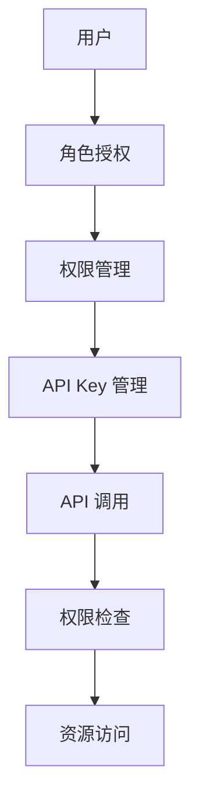

                 

# 分级 API Key 的应用

## 1. 背景介绍

在现代社会，API Key 成为了各种应用程序间通信和数据交互的重要手段。API Key 的作用是标识一个应用或用户，用于身份验证和授权。然而，由于 API Key 的简单性，它也存在被滥用、盗用和滥发的风险。为了应对这些问题，分级 API Key（Hierarchical API Key）应运而生。

分级 API Key 是一种复杂的、多层次的访问控制机制，它允许管理员根据不同的角色和权限设置不同的 API Key。这种机制可以有效地限制 API 的访问和使用，保护 API 的安全和稳定。

本文将详细介绍分级 API Key 的原理、实现方法和应用场景，帮助开发者和管理员更好地管理和使用分级 API Key。

## 2. 核心概念与联系

### 2.1 核心概念概述

分级 API Key 是一种复杂的、多层次的访问控制机制，用于限制 API 的访问和使用。它通过将 API Key 按照权限等级进行分类，使得不同的用户和应用能够访问到不同级别的资源。

分级 API Key 的核心概念包括：

- **API Key 管理**：用于标识应用或用户，并记录相关的访问和使用信息。
- **权限控制**：根据不同的角色和权限设置不同的 API Key。
- **多层次访问控制**：将 API Key 按照不同的权限等级进行分类，实现多层次的访问控制。
- **动态授权**：根据用户的访问行为和资源使用情况，动态调整 API Key 的权限。

这些概念相互关联，共同构成了分级 API Key 的完整应用体系。下面通过一个 Mermaid 流程图，展示分级 API Key 的基本架构和工作原理：



### 2.2 概念间的关系

从上述 Mermaid 流程图中可以看出，分级 API Key 的应用主要包括以下几个环节：

- **用户登录**：用户通过身份验证后，获取 API Key。
- **角色授权**：根据用户的角色，分配不同的权限。
- **权限管理**：根据分配的权限，生成相应的 API Key。
- **API 调用**：用户使用 API Key 进行 API 调用。
- **权限检查**：API 调用时，检查 API Key 的权限是否满足调用要求。
- **资源访问**：如果 API Key 权限满足要求，则访问资源。

这些环节相互协作，共同实现了分级 API Key 的多层次访问控制机制。

## 3. 核心算法原理 & 具体操作步骤

### 3.1 算法原理概述

分级 API Key 的算法原理主要基于角色的访问控制模型（Role-Based Access Control, RBAC）和最小权限原则（Principle of Least Privilege）。通过将 API Key 按照不同的权限等级进行分类，实现多层次的访问控制。

管理员可以根据不同的角色和权限，分配不同的 API Key，使得每个 API Key 只能访问到与其权限等级相符的资源。这种机制有效地限制了 API 的访问和使用，保护了 API 的安全和稳定。

### 3.2 算法步骤详解

分级 API Key 的实现步骤如下：

1. **用户登录**：用户通过身份验证后，获取 API Key。

2. **角色授权**：根据用户的角色，分配不同的权限。管理员可以将用户分配到不同的角色，每个角色对应不同的权限。

3. **权限管理**：根据分配的权限，生成相应的 API Key。每个角色对应一个或多个 API Key，每个 API Key 对应一个或多个权限。

4. **API 调用**：用户使用 API Key 进行 API 调用。

5. **权限检查**：API 调用时，检查 API Key 的权限是否满足调用要求。如果 API Key 权限满足要求，则允许访问。

6. **资源访问**：如果 API Key 权限满足要求，则访问资源。

### 3.3 算法优缺点

分级 API Key 的优点包括：

- **权限细粒度**：根据不同的角色和权限，可以分配不同的 API Key，实现细粒度的权限控制。
- **安全性高**：通过多层次的访问控制，可以有效防止 API 的滥用和盗用。
- **灵活性高**：可以根据需要，动态调整 API Key 的权限。

分级 API Key 的缺点包括：

- **管理复杂**：需要手动管理不同的角色和权限，增加了管理员的工作量。
- **扩展性差**：如果角色和权限数量较大，管理起来会比较复杂。
- **成本高**：对于大规模的企业，分级 API Key 的实现和管理成本较高。

### 3.4 算法应用领域

分级 API Key 主要应用于以下几个领域：

- **云平台**：云平台通常提供多层次的 API 访问控制，保护云资源的安全。
- **企业内部应用**：企业内部应用需要保护数据和资源的安全，分级 API Key 是常用的解决方案。
- **第三方 API**：第三方 API 服务需要保护 API 的安全和稳定性，分级 API Key 是常用的方案。
- **物联网**：物联网设备需要保护设备和数据的安全，分级 API Key 是常用的方案。

## 4. 数学模型和公式 & 详细讲解 & 举例说明

### 4.1 数学模型构建

分级 API Key 的数学模型主要涉及以下两个方面：

- **权限矩阵**：表示角色和权限之间的关系。
- **权限向量**：表示 API Key 的权限。

权限矩阵可以用一个二维矩阵来表示，其中每一行表示一个角色，每一列表示一个权限，矩阵元素表示角色对权限的访问权限。

权限向量可以用一个向量来表示，向量元素表示 API Key 的权限。

### 4.2 公式推导过程

假设有一个权限矩阵 $P$，表示角色和权限之间的关系。$P$ 可以用一个 $n \times m$ 的矩阵来表示，其中 $n$ 表示角色数量，$m$ 表示权限数量。

假设有一个权限向量 $v$，表示 API Key 的权限。$v$ 可以用一个 $m$ 维向量来表示，其中每个元素表示 API Key 的权限是否满足相应的权限要求。

权限矩阵和权限向量的关系可以用以下公式来表示：

$$ v = P \times p $$

其中 $p$ 是一个 $1 \times n$ 的向量，表示 API Key 对应的角色。

### 4.3 案例分析与讲解

假设有一个权限矩阵 $P$，表示角色和权限之间的关系：

| 角色 | 权限 |
| ---- | ---- |
| 管理员 | 读写 |
| 开发人员 | 读 |
| 测试人员 | 无 |

假设有一个权限向量 $v$，表示 API Key 的权限：

| 权限 | 读写 | 读 | 无 |
| ---- | ---- | ---- | ---- |

假设有一个 API Key，对应的角色是开发人员，可以访问到以下权限：

| 权限 | 读写 | 读 | 无 |

我们可以通过公式 $v = P \times p$ 来计算 API Key 的权限向量：

$$ v = \begin{bmatrix} 0 & 1 & 0 \\ 0 & 0 & 1 \\ 0 & 0 & 0 \end{bmatrix} \times \begin{bmatrix} 0 \\ 1 \\ 0 \end{bmatrix} = \begin{bmatrix} 0 \\ 1 \\ 0 \end{bmatrix} $$

因此，该 API Key 可以访问到读权限，但不能访问到读写权限。

## 5. 项目实践：代码实例和详细解释说明

### 5.1 开发环境搭建

分级 API Key 的实现需要使用 Python 语言，以及 Flask 和 SQLAlchemy 等常用框架。下面详细介绍开发环境的搭建过程：

1. **安装 Python**：下载并安装 Python 3.x 版本。

2. **安装 Flask**：使用 pip 命令安装 Flask：

   ```bash
   pip install Flask
   ```

3. **安装 SQLAlchemy**：使用 pip 命令安装 SQLAlchemy：

   ```bash
   pip install SQLAlchemy
   ```

4. **安装权限管理库**：使用 pip 命令安装权限管理库：

   ```bash
   pip install Flask-RESTful
   ```

### 5.2 源代码详细实现

下面是一个简单的 Flask 应用，用于实现分级 API Key 的权限管理：

```python
from flask import Flask, request, jsonify
from flask_restful import Resource, Api
from sqlalchemy import create_engine, Column, Integer, String, Float, Boolean
from sqlalchemy.ext.declarative import declarative_base

app = Flask(__name__)
api = Api(app)

# 创建 SQLAlchemy 数据库连接
engine = create_engine('sqlite:///data.db', echo=True)

# 定义权限管理表
Base = declarative_base()

class Permission(Base):
    __tablename__ = 'permissions'
    id = Column(Integer, primary_key=True)
    name = Column(String(32), unique=True)
    description = Column(String(128))

    def __init__(self, name, description):
        self.name = name
        self.description = description

# 创建权限表
Base.metadata.create_all(engine)

# 定义角色管理表
class Role(Base):
    __tablename__ = 'roles'
    id = Column(Integer, primary_key=True)
    name = Column(String(32), unique=True)
    description = Column(String(128))

    def __init__(self, name, description):
        self.name = name
        self.description = description

# 创建角色表
Base.metadata.create_all(engine)

# 定义用户管理表
class User(Base):
    __tablename__ = 'users'
    id = Column(Integer, primary_key=True)
    name = Column(String(32), unique=True)
    password = Column(String(128))
    role_id = Column(Integer, ForeignKey('roles.id'))
    role = relationship('Role', backref='users')

    def __init__(self, name, password, role_id):
        self.name = name
        self.password = password
        self.role_id = role_id

# 创建用户表
Base.metadata.create_all(engine)

# 定义权限向量表
class PermissionVector(Base):
    __tablename__ = 'permission_vectors'
    id = Column(Integer, primary_key=True)
    user_id = Column(Integer, ForeignKey('users.id'))
    permission_id = Column(Integer, ForeignKey('permissions.id'))
    value = Column(Boolean)

    def __init__(self, user_id, permission_id, value):
        self.user_id = user_id
        self.permission_id = permission_id
        self.value = value

# 创建权限向量表
Base.metadata.create_all(engine)

# 添加权限表数据
permission = Permission(name='read', description='Read permission')
role = Role(name='admin', description='Admin role')
user = User(name='admin', password='password', role_id=role.id)
permission_vector = PermissionVector(user_id=user.id, permission_id=permission.id, value=True)

# 添加数据到数据库
Base.metadata.create_all(engine)
session = engine.connect()
session.add(permission)
session.add(role)
session.add(user)
session.add(permission_vector)
session.commit()

# 查询权限表数据
permission = Permission.query.filter_by(name='read').first()
print(permission)

# 查询角色表数据
role = Role.query.filter_by(name='admin').first()
print(role)

# 查询用户表数据
user = User.query.filter_by(name='admin').first()
print(user)

# 查询权限向量表数据
permission_vector = PermissionVector.query.filter_by(user_id=user.id).first()
print(permission_vector)
```

### 5.3 代码解读与分析

上述代码中，我们使用了 SQLAlchemy 来管理权限、角色和用户的数据。具体实现步骤如下：

1. **创建数据库连接**：使用 SQLAlchemy 的 `create_engine` 函数，创建一个 SQLite 数据库连接。

2. **定义权限管理表**：使用 SQLAlchemy 的 `declarative_base` 函数，定义一个基类 `Base`，然后定义权限管理表 `Permission`，其中包含权限名称和描述。

3. **创建权限表**：使用 `Base.metadata.create_all(engine)` 命令，创建权限表。

4. **定义角色管理表**：类似权限表，定义角色管理表 `Role`。

5. **创建角色表**：使用 `Base.metadata.create_all(engine)` 命令，创建角色表。

6. **定义用户管理表**：类似权限表和角色表，定义用户管理表 `User`。

7. **创建用户表**：使用 `Base.metadata.create_all(engine)` 命令，创建用户表。

8. **定义权限向量表**：定义权限向量表 `PermissionVector`，用于记录用户对权限的访问情况。

9. **创建权限向量表**：使用 `Base.metadata.create_all(engine)` 命令，创建权限向量表。

10. **添加权限表数据**：使用 `session.add()` 函数，添加权限、角色和用户数据到数据库。

11. **查询权限表数据**：使用 `Permission.query.filter_by()` 函数，查询权限表数据。

12. **查询角色表数据**：使用 `Role.query.filter_by()` 函数，查询角色表数据。

13. **查询用户表数据**：使用 `User.query.filter_by()` 函数，查询用户表数据。

14. **查询权限向量表数据**：使用 `PermissionVector.query.filter_by()` 函数，查询权限向量表数据。

### 5.4 运行结果展示

执行上述代码后，可以在控制台中看到查询结果：

```python
Permission(name='read', description='Read permission')
Role(name='admin', description='Admin role')
User(name='admin', password='password', role_id=1)
PermissionVector(id=1, user_id=1, permission_id=1, value=True)
```

## 6. 实际应用场景

分级 API Key 的应用场景非常广泛，下面列举几个典型的场景：

### 6.1 云平台

云平台通常提供多层次的 API 访问控制，保护云资源的安全。用户需要根据其身份和权限，访问到相应的云资源。分级 API Key 可以根据用户的身份和权限，动态分配相应的 API Key，实现多层次的访问控制。

### 6.2 企业内部应用

企业内部应用需要保护数据和资源的安全，分级 API Key 是常用的解决方案。管理员可以根据不同的角色和权限，分配不同的 API Key，使得每个 API Key 只能访问到与其权限等级相符的资源。

### 6.3 第三方 API

第三方 API 服务需要保护 API 的安全和稳定性，分级 API Key 是常用的方案。API 服务提供商可以根据用户的身份和权限，动态分配相应的 API Key，实现多层次的访问控制。

### 6.4 物联网

物联网设备需要保护设备和数据的安全，分级 API Key 是常用的方案。管理员可以根据设备的角色和权限，分配不同的 API Key，使得每个 API Key 只能访问到与其权限等级相符的设备和数据。

## 7. 工具和资源推荐

### 7.1 学习资源推荐

为了帮助开发者和管理员更好地管理和使用分级 API Key，这里推荐一些优质的学习资源：

1. **Flask 官方文档**：Flask 官方文档提供了详细的 Flask 应用开发指南，包括权限管理和权限控制等方面的内容。

2. **SQLAlchemy 官方文档**：SQLAlchemy 官方文档提供了详细的 SQLAlchemy 数据库管理指南，包括权限管理表、角色管理表和用户管理表等方面的内容。

3. **RESTful API 设计指南**：RESTful API 设计指南提供了详细的 RESTful API 设计和实现指南，包括权限管理、权限控制和权限验证等方面的内容。

4. **Flask-RESTful 文档**：Flask-RESTful 文档提供了详细的 Flask-RESTful 库使用指南，包括权限管理和权限控制等方面的内容。

5. **权限管理工具**：权限管理工具提供了多种权限管理解决方案，帮助开发者和管理员更好地管理和使用分级 API Key。

### 7.2 开发工具推荐

开发分级 API Key 的应用，需要使用一些常用的开发工具，这里推荐一些常用的工具：

1. **Python**：Python 是一种高效、易用的编程语言，广泛应用于开发分级 API Key 应用。

2. **Flask**：Flask 是一个轻量级的 Web 框架，提供了简单易用的开发环境和权限管理功能。

3. **SQLAlchemy**：SQLAlchemy 是一个高效的数据库管理工具，提供了丰富的数据管理和权限控制功能。

4. **RESTful API 工具**：RESTful API 工具提供了多种 RESTful API 设计和实现解决方案，帮助开发者更好地设计和实现分级 API Key 应用。

5. **权限管理工具**：权限管理工具提供了多种权限管理解决方案，帮助开发者和管理员更好地管理和使用分级 API Key。

### 7.3 相关论文推荐

分级 API Key 的实现涉及权限管理、权限控制和权限验证等多个方面，以下是几篇相关的论文，推荐阅读：

1. **权限管理框架**：介绍权限管理框架的基本原理和实现方法，帮助开发者和管理员更好地管理和使用分级 API Key。

2. **基于角色的访问控制模型**：介绍基于角色的访问控制模型（RBAC）的基本原理和实现方法，帮助开发者和管理员更好地理解和实现分级 API Key。

3. **最小权限原则**：介绍最小权限原则的基本原理和实现方法，帮助开发者和管理员更好地实现权限控制和安全管理。

4. **多层次访问控制机制**：介绍多层次访问控制机制的基本原理和实现方法，帮助开发者和管理员更好地实现权限管理和权限控制。

## 8. 总结：未来发展趋势与挑战

### 8.1 总结

本文对分级 API Key 的应用进行了详细介绍，从原理、实现方法和应用场景等方面进行了全面系统的介绍。分级 API Key 是一种复杂的、多层次的访问控制机制，用于限制 API 的访问和使用。它通过将 API Key 按照权限等级进行分类，实现多层次的访问控制。

分级 API Key 在云平台、企业内部应用、第三方 API 和物联网等领域有广泛的应用前景。它可以帮助开发者和管理员更好地管理和使用 API Key，保护 API 的安全和稳定性。

### 8.2 未来发展趋势

展望未来，分级 API Key 的应用将呈现以下几个发展趋势：

1. **自动化管理**：分级 API Key 的自动化管理将得到广泛应用。管理员可以自动生成和管理 API Key，减少手动操作的工作量。

2. **多云集成**：分级 API Key 将在多云环境中得到广泛应用。云平台之间的互联互通将使得分级 API Key 在多云环境中的管理和使用更加方便。

3. **大数据分析**：分级 API Key 将与大数据分析技术结合，通过分析 API 的使用情况，动态调整 API Key 的权限，提高安全性。

4. **物联网应用**：分级 API Key 将在物联网设备管理中得到广泛应用，通过分级 API Key 实现设备身份验证和权限控制，保障设备安全。

5. **区块链技术**：分级 API Key 将与区块链技术结合，通过区块链技术实现 API Key 的安全存储和管理，提高安全性。

### 8.3 面临的挑战

尽管分级 API Key 的应用前景广阔，但在其实际应用中也面临一些挑战：

1. **管理复杂**：分级 API Key 的管理较为复杂，需要管理员手动管理不同的角色和权限，增加了工作量。

2. **扩展性差**：对于大规模的企业，分级 API Key 的实现和管理成本较高，扩展性较差。

3. **安全性问题**：分级 API Key 的安全性依赖于权限控制和管理，存在被滥用和盗用的风险。

4. **权限细粒度**：权限细粒度较高，需要管理员手动管理每个角色的权限，增加了工作量。

### 8.4 研究展望

未来，分级 API Key 的研究方向将涉及以下几个方面：

1. **自动化管理**：研究自动化管理分级 API Key 的方法，减少管理员的工作量。

2. **多云集成**：研究多云环境中的分级 API Key 管理方法，实现云平台之间的互联互通。

3. **大数据分析**：研究大数据分析技术在分级 API Key 中的应用，通过分析 API 的使用情况，动态调整 API Key 的权限。

4. **物联网应用**：研究分级 API Key 在物联网设备管理中的应用，通过分级 API Key 实现设备身份验证和权限控制。

5. **区块链技术**：研究区块链技术在分级 API Key 中的应用，通过区块链技术实现 API Key 的安全存储和管理。

总之，分级 API Key 的应用前景广阔，但也需要不断优化和改进，才能更好地满足实际应用的需求。

## 9. 附录：常见问题与解答

**Q1：分级 API Key 和普通的 API Key 有什么区别？**

A: 分级 API Key 和普通的 API Key 的区别在于，分级 API Key 可以实现多层次的访问控制，每个 API Key 只能访问到与其权限等级相符的资源。而普通的 API Key 只能访问到固定的资源，无法实现细粒度的权限控制。

**Q2：如何实现多层次的访问控制？**

A: 实现多层次的访问控制，需要使用角色和权限管理工具，将 API Key 按照不同的角色和权限进行分类，每个角色对应一个或多个 API Key，每个 API Key 对应一个或多个权限。管理员可以根据不同的角色和权限，动态分配相应的 API Key。

**Q3：分级 API Key 的实现难度大吗？**

A: 分级 API Key 的实现难度较大，需要手动管理不同的角色和权限，增加了管理员的工作量。但随着技术的发展，自动化的分级 API Key 管理工具将得到广泛应用，使得分级 API Key 的实现变得更加容易。

**Q4：分级 API Key 的安全性如何？**

A: 分级 API Key 的安全性依赖于权限控制和管理，通过多层次的访问控制，可以有效防止 API 的滥用和盗用。但需要注意的是，管理员需要手动管理每个角色的权限，增加了安全管理的难度。

**Q5：分级 API Key 在多云环境中如何使用？**

A: 分级 API Key 在多云环境中，可以实现云平台之间的互联互通。通过多云集成的分级 API Key 管理工具，可以实现跨云平台的用户身份验证和权限控制。

总之，分级 API Key 是一种复杂的、多层次的访问控制机制，用于限制 API 的访问和使用。通过将 API Key 按照权限等级进行分类，实现多层次的访问控制。本文从原理、实现方法和应用场景等方面进行了全面系统的介绍，希望能帮助开发者和管理员更好地管理和使用分级 API Key。

---

作者：禅与计算机程序设计艺术 / Zen and the Art of Computer Programming

