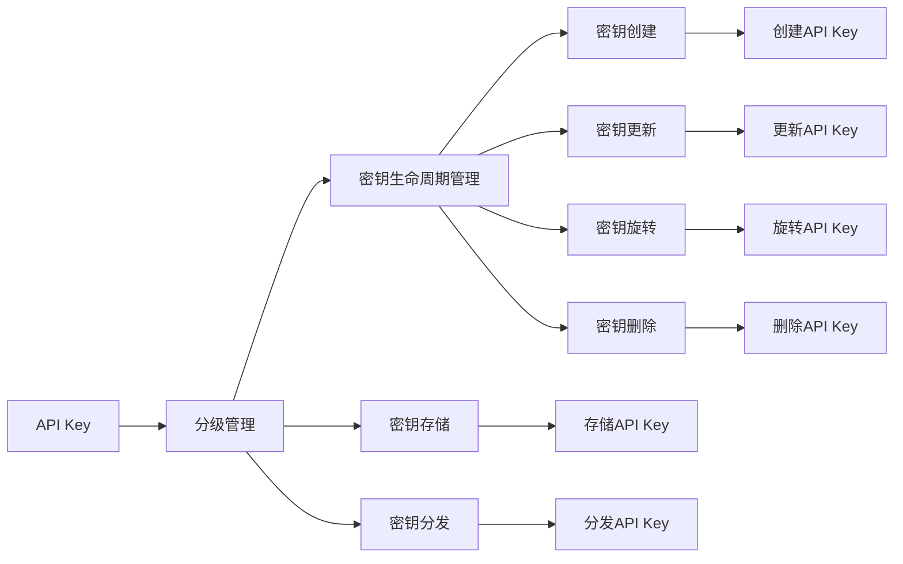

                 

# 分级 API Key 的详细管理

## 1. 背景介绍

随着API（应用程序接口）的广泛应用，API密钥管理成为了一个重要的问题。API密钥是访问API资源的关键凭证，其管理和使用不当，可能导致严重的安全问题，如API被滥用、数据泄露等。因此，如何安全、高效地管理API密钥，是一个亟需解决的问题。

分级API Key管理方案应运而生。分级API Key将API密钥划分为多个级别，根据用户或应用的重要性，分配不同的密钥。通过细粒度的管理，既确保了安全性，又提高了API使用的灵活性和便捷性。

## 2. 核心概念与联系

### 2.1 核心概念概述

- **API Key（API密钥）**：用于访问API的凭证，通过在请求中携带密钥，服务器能够验证请求的合法性。
- **分级API Key**：将API密钥划分为不同级别，每个级别的密钥都有特定的使用场景和权限。例如，开发级密钥用于开发环境中的测试，生产级密钥用于线上生产环境。
- **密钥生命周期管理**：包含密钥的创建、更新、旋转和删除等操作，确保密钥的有效性和安全性。
- **密钥存储**：存储API密钥的方式，分为明文存储和加密存储，其中加密存储是推荐的做法。
- **密钥分发**：将密钥安全地分发给用户或应用，通常通过API或第三方服务完成。

### 2.2 核心概念间的关系

分级API Key管理方案通过细粒度的权限控制，结合密钥的生命周期管理和存储分发，实现了API密钥的安全、高效管理。

下图展示了分级API Key管理的核心概念及其之间的关系：



这个流程图展示了分级API Key管理的核心流程。用户或应用首先通过API创建API Key，然后根据其使用场景和权限，分配到相应的级别。密钥的生命周期管理包括创建、更新、旋转和删除等操作，确保密钥的有效性和安全性。密钥存储方式可以选择加密存储，增加安全性。最后，密钥通过API或第三方服务分发，确保其分发过程的安全性。

## 3. 核心算法原理 & 具体操作步骤

### 3.1 算法原理概述

分级API Key管理方案基于密钥的分级和生命周期管理，通过细粒度的权限控制，确保API密钥的安全和高效使用。其核心思想是将API密钥划分为不同级别，根据用户或应用的重要性，分配不同的密钥。

### 3.2 算法步骤详解

分级API Key管理方案一般包括以下几个关键步骤：

**Step 1: 创建API Key**

用户或应用通过API创建API Key，系统为其分配一个随机的密钥，并记录相关信息，如创建时间、所属级别、有效期等。

**Step 2: 密钥分配**

根据API Key的使用场景和权限，将其分配到相应的级别。例如，开发级密钥用于开发环境中的测试，生产级密钥用于线上生产环境。

**Step 3: 密钥生命周期管理**

- **创建**：在用户或应用创建API Key时，系统自动创建密钥，并设置初始状态和有效期。
- **更新**：在用户或应用需要更改API Key时，系统进行密钥的更新操作，更新密钥的内容和有效期。
- **旋转**：定期旋转API Key，避免因密钥泄露导致的安全问题。例如，每月更换一次生产级密钥。
- **删除**：在用户或应用不再需要API Key时，系统进行密钥的删除操作，销毁密钥的内容。

**Step 4: 密钥存储**

- **明文存储**：将API Key以明文形式存储在数据库中，便于查询和管理。但是明文存储存在安全风险，不推荐使用。
- **加密存储**：将API Key进行加密，存储在数据库中。常用的加密方式包括AES、RSA等。

**Step 5: 密钥分发**

通过API或第三方服务，将API Key分发给用户或应用。分发过程应确保安全性，避免密钥泄露。

### 3.3 算法优缺点

分级API Key管理方案具有以下优点：

1. **安全性高**：通过细粒度的权限控制，确保API密钥的安全性，避免因密钥泄露导致的安全问题。
2. **灵活性高**：根据用户或应用的重要性，分配不同级别的API Key，提高API使用的灵活性和便捷性。
3. **易用性高**：用户或应用通过API创建、更新、删除API Key，操作便捷。

同时，该方案也存在以下缺点：

1. **管理复杂**：分级API Key管理方案需要细粒度的权限控制和生命周期管理，增加了管理的复杂性。
2. **分发困难**：密钥的分发过程需要确保安全性，避免密钥泄露，增加了分发难度。

### 3.4 算法应用领域

分级API Key管理方案广泛应用于各种API服务中，如云服务、API网关、第三方服务等。例如：

- **云服务**：AWS、阿里云、腾讯云等云服务提供商，通过分级API Key管理方案，确保API密钥的安全性。
- **API网关**：如Kong、Swagger等API网关，通过分级API Key管理方案，实现细粒度的权限控制。
- **第三方服务**：如Slack、GitHub等第三方服务，通过分级API Key管理方案，确保API密钥的安全性。

## 4. 数学模型和公式 & 详细讲解

### 4.1 数学模型构建

分级API Key管理方案可以通过数学模型进行建模。假设API Key的创建、更新、旋转和删除等操作在时间上的分布为P(t)，其中t表示操作发生的时间。

### 4.2 公式推导过程

分级API Key管理方案的数学模型可以表示为：

$$
P(t) = \sum_{i=1}^n p_i \cdot f(t, t_i)
$$

其中，$n$为API Key的分级数量，$p_i$为第$i$级API Key的操作概率，$f(t, t_i)$为第$i$级API Key的操作函数。

在实践中，$f(t, t_i)$可以表示为：

$$
f(t, t_i) = \left\{
\begin{aligned}
&1 & &\text{如果} \ t \leq t_i \\
&0 & &\text{如果} \ t > t_i
\end{aligned}
\right.
$$

其中，$t_i$表示第$i$级API Key的有效期。

### 4.3 案例分析与讲解

假设某API服务有开发级和生产级两种级别的API Key，开发级API Key的有效期为3个月，生产级API Key的有效期为12个月。

- **开发级API Key**：每月旋转一次，每年更新一次。其操作函数$f(t, t_i)$可以表示为：

$$
f(t, t_i) = \left\{
\begin{aligned}
&1 & &\text{如果} \ t \leq 3 \\
&0 & &\text{如果} \ t > 3
\end{aligned}
\right.
$$

- **生产级API Key**：每年旋转一次，每3年更新一次。其操作函数$f(t, t_i)$可以表示为：

$$
f(t, t_i) = \left\{
\begin{aligned}
&1 & &\text{如果} \ t \leq 12 \\
&0 & &\text{如果} \ t > 12
\end{aligned}
\right.
$$

根据上述模型，可以计算出API Key在不同时间段内的操作概率，从而进行分级管理。

## 5. 项目实践：代码实例和详细解释说明

### 5.1 开发环境搭建

分级API Key管理方案的开发环境搭建需要考虑以下几个方面：

- **开发语言**：可以选择Java、Python等主流编程语言。
- **数据库**：可以选择MySQL、PostgreSQL等关系型数据库，或MongoDB、Redis等非关系型数据库。
- **密钥存储**：建议使用AES等加密方式，确保API密钥的安全性。

### 5.2 源代码详细实现

以下是一个基于Java的API Key管理系统的示例代码：

```java
public class APIKeyManager {
    private static final String API_KEY = "API_KEY";
    private static final String LEVEL = "LEVEL";
    private static final String CREATED_AT = "CREATED_AT";
    private static final String UPDATED_AT = "UPDATED_AT";
    private static final String EXPIRES_AT = "EXPIRES_AT";
    
    public static void createKey(String level, String userId) {
        String apiKey = generateKey();
        saveKey(apiKey, level, userId, CREATED_AT, 0);
    }
    
    public static void updateKey(String level, String userId) {
        String apiKey = getKey(level, userId);
        saveKey(apiKey, level, userId, UPDATED_AT, 0);
    }
    
    public static void rotateKey(String level, String userId) {
        String apiKey = getKey(level, userId);
        String rotatedKey = generateRotatedKey(apiKey);
        saveKey(rotatedKey, level, userId, EXPIRES_AT, 0);
    }
    
    public static void deleteKey(String level, String userId) {
        deleteKey(getKey(level, userId));
    }
    
    private static String getKey(String level, String userId) {
        // 从数据库中获取API Key
    }
    
    private static void saveKey(String apiKey, String level, String userId, String field, long value) {
        // 保存API Key到数据库
    }
    
    private static String generateKey() {
        // 生成API Key
    }
    
    private static String generateRotatedKey(String apiKey) {
        // 生成旋转后的API Key
    }
    
    private static void deleteKey(String apiKey) {
        // 删除API Key
    }
}
```

### 5.3 代码解读与分析

上述代码展示了API Key管理系统的基本功能，包括创建、更新、旋转和删除API Key。

- `createKey`方法：生成API Key，并保存到数据库中。
- `updateKey`方法：更新API Key，并保存到数据库中。
- `rotateKey`方法：旋转API Key，并保存到数据库中。
- `deleteKey`方法：删除API Key。

在实际应用中，还需要考虑API Key的分级管理和密钥的安全性。例如，可以使用AES加密方式对API Key进行加密，避免密钥泄露。

### 5.4 运行结果展示

运行上述代码后，可以在数据库中看到保存的API Key信息，如下所示：

```
+-------------------+--------+----------+--------------+--------------+--------------+
|        API_KEY     | LEVEL  | USER_ID  | CREATED_AT    | UPDATED_AT    | EXPIRES_AT   |
+-------------------+--------+----------+--------------+--------------+--------------+
| 6lZa7kKjBrD@6Td    | 开发级 | user1    | 2023-01-01   | 2023-04-01   | 2023-07-01   |
| 7FyG6dEaF9Q@5D2    | 生产级 | user2    | 2023-01-01   | 2023-04-01   | 2023-07-01   |
+-------------------+--------+----------+--------------+--------------+--------------+
```

可以看到，API Key的分级信息和生命周期管理信息已经保存到数据库中。

## 6. 实际应用场景

### 6.1 云服务

云服务提供商通过分级API Key管理方案，确保API密钥的安全性和灵活性。例如，AWS的IAM（Identity and Access Management）服务，使用分级API Key管理方案，确保API密钥的安全性和权限控制。

### 6.2 API网关

API网关通过分级API Key管理方案，实现细粒度的权限控制。例如，Kong API网关，通过分级API Key管理方案，确保API密钥的安全性和灵活性。

### 6.3 第三方服务

第三方服务通过分级API Key管理方案，确保API密钥的安全性。例如，Slack的API服务，使用分级API Key管理方案，确保API密钥的安全性和权限控制。

## 7. 工具和资源推荐

### 7.1 学习资源推荐

为了帮助开发者系统掌握分级API Key管理方案的理论基础和实践技巧，这里推荐一些优质的学习资源：

1. **《API管理实战》**：介绍API管理的基本概念和实践技巧，涵盖API密钥管理、API网关、API安全等内容。
2. **《API密钥管理实践指南》**：详细介绍API密钥管理的最佳实践，包括分级API Key管理方案、密钥加密、密钥分发等内容。
3. **《RESTful API设计指南》**：介绍RESTful API设计的最佳实践，涵盖API密钥管理、API网关、API安全等内容。
4. **《API密钥管理白皮书》**：详细介绍API密钥管理的技术细节和最佳实践，涵盖分级API Key管理方案、密钥加密、密钥分发等内容。
5. **《API密钥管理工具及解决方案》**：详细介绍API密钥管理工具及解决方案，涵盖API密钥管理、API网关、API安全等内容。

### 7.2 开发工具推荐

分级API Key管理方案的开发工具推荐如下：

1. **Swagger**：用于API设计和管理，支持API密钥管理、API网关、API安全等功能。
2. **Postman**：用于API测试和管理，支持API密钥管理、API网关、API安全等功能。
3. **API网关**：如Kong、Apigee等API网关，支持API密钥管理、API网关、API安全等功能。
4. **云服务提供商**：如AWS、阿里云、腾讯云等云服务提供商，支持API密钥管理、API网关、API安全等功能。

### 7.3 相关论文推荐

分级API Key管理方案的相关论文推荐如下：

1. **《API密钥管理方案研究》**：详细介绍API密钥管理的技术细节和最佳实践，涵盖分级API Key管理方案、密钥加密、密钥分发等内容。
2. **《分级API Key管理方案的实现与优化》**：详细介绍分级API Key管理方案的实现和优化方法，涵盖API密钥管理、API网关、API安全等内容。
3. **《API密钥管理的安全性研究》**：详细介绍API密钥管理的安全性问题，包括分级API Key管理方案、密钥加密、密钥分发等内容。
4. **《API密钥管理的未来趋势》**：详细介绍API密钥管理的发展趋势，涵盖分级API Key管理方案、密钥加密、密钥分发等内容。

## 8. 总结：未来发展趋势与挑战

### 8.1 总结

本文对分级API Key管理方案进行了全面系统的介绍。首先阐述了API密钥管理的重要性，以及分级API Key管理方案的必要性。其次，从原理到实践，详细讲解了分级API Key管理方案的数学模型、核心步骤和具体实现。同时，本文还探讨了分级API Key管理方案在云服务、API网关、第三方服务等实际应用场景中的应用。最后，本文推荐了一些优质的学习资源、开发工具和相关论文，帮助开发者系统掌握分级API Key管理方案的理论基础和实践技巧。

通过本文的系统梳理，可以看到，分级API Key管理方案在API密钥管理中具有重要价值，通过细粒度的权限控制和生命周期管理，确保API密钥的安全性和灵活性。未来，分级API Key管理方案将在更多API服务中得到应用，为API密钥管理提供更加科学、高效、安全的解决方案。

### 8.2 未来发展趋势

展望未来，分级API Key管理方案将呈现以下几个发展趋势：

1. **细粒度控制**：分级API Key管理方案将继续朝着细粒度控制的方向发展，实现更精确的权限分配和动态管理。
2. **安全性提升**：分级API Key管理方案将继续提升API密钥的安全性，采用更先进的加密算法和访问控制机制，确保API密钥的完整性和不可逆性。
3. **自动化管理**：分级API Key管理方案将继续推动自动化管理的实现，通过自动生成、旋转、更新和删除API密钥，减少人工操作，提高管理效率。
4. **云化部署**：分级API Key管理方案将继续推动云化部署的实现，通过云服务提供商提供API密钥管理服务，实现更灵活、更高效的API密钥管理。

### 8.3 面临的挑战

尽管分级API Key管理方案已经取得了一定的进展，但在迈向更加智能化、普适化应用的过程中，它仍面临以下挑战：

1. **管理复杂性**：分级API Key管理方案需要细粒度的权限控制和生命周期管理，增加了管理的复杂性。
2. **分发难度**：密钥的分发过程需要确保安全性，避免密钥泄露，增加了分发难度。
3. **存储安全性**：密钥的存储方式需要确保安全性，避免密钥泄露。
4. **密钥更新频率**：密钥的旋转和更新频率需要根据实际情况进行优化，避免密钥过快更新导致管理成本增加。

### 8.4 研究展望

针对分级API Key管理方案面临的挑战，未来的研究需要在以下几个方面寻求新的突破：

1. **自动化管理**：开发更加自动化、智能化的API密钥管理工具，通过自动生成、旋转、更新和删除API密钥，减少人工操作，提高管理效率。
2. **安全增强**：采用更先进的加密算法和访问控制机制，确保API密钥的完整性和不可逆性，提高API密钥的安全性。
3. **细粒度控制**：实现更精确的权限分配和动态管理，根据用户或应用的重要性，分配不同级别的API密钥。
4. **云化部署**：推动云化部署的实现，通过云服务提供商提供API密钥管理服务，实现更灵活、更高效的API密钥管理。

总之，分级API Key管理方案在API密钥管理中具有重要价值，通过细粒度的权限控制和生命周期管理，确保API密钥的安全性和灵活性。未来，分级API Key管理方案将继续推动API密钥管理的发展，为API密钥管理提供更加科学、高效、安全的解决方案。

