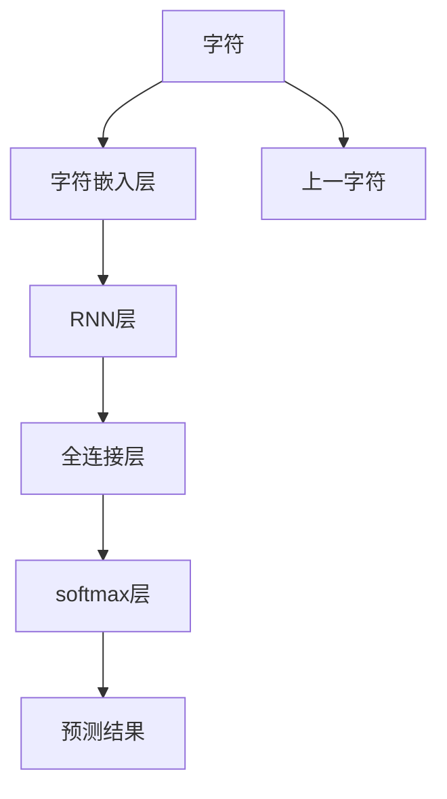
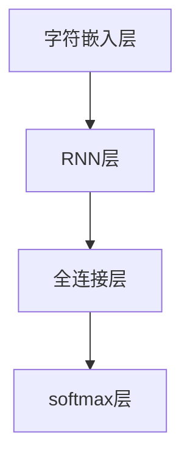
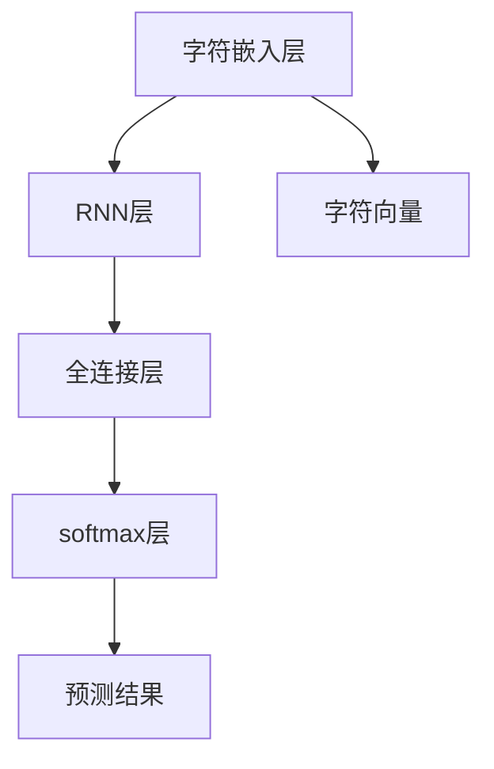

                 

# 创建一个Bigram字符预测模型

> 关键词：Bigram模型,字符预测,神经网络,交叉熵损失函数,梯度下降,训练集,测试集

## 1. 背景介绍

### 1.1 问题由来
字符预测是大数据处理中的一个重要应用领域。在NLP任务、信息检索、自然语言生成等方面，字符预测都能发挥重要作用。通过模型预测输入序列的下一个字符，可以为后续的文本处理任务提供强有力的支持。

传统的字符预测模型主要基于统计模型和基于规则的方法，但这些方法在处理复杂序列时往往效果不佳。近年来，随着深度学习技术的发展，神经网络逐渐成为处理字符预测任务的主流方法。其中，基于字符级的循环神经网络（RNN）和卷积神经网络（CNN）是最常用的模型架构。

本文将深入介绍如何利用Bigram模型进行字符预测。Bigram模型是一种基于字符级别的预测模型，其核心思想是利用前一个字符的信息，预测下一个字符。相较于传统的字符预测模型，Bigram模型能更好地捕捉字符间的依赖关系，在字符序列预测上取得了较好的性能。

### 1.2 问题核心关键点
在字符预测任务中，Bigram模型使用前一个字符作为输入，预测下一个字符的输出。该模型通常使用神经网络作为模型结构，并使用交叉熵损失函数作为损失函数。模型的训练目标是最大化对训练集的拟合，最小化预测错误。

Bigram模型的主要参数包括神经网络的层数、每层的神经元个数、激活函数等。选择合适的参数对于模型性能有着重要的影响。同时，模型还需要注意避免过拟合和欠拟合等问题。

## 2. 核心概念与联系

### 2.1 核心概念概述

在Bigram模型中，我们通常使用神经网络作为预测模型，其结构如图1所示：



- 字符嵌入层：将字符映射为高维向量，为神经网络提供输入。
- RNN层：利用前一个字符的向量信息，预测下一个字符的向量输出。
- 全连接层：将RNN层的向量输出映射为多维向量，进行字符分类的计算。
- softmax层：将向量映射为概率分布，预测下一个字符是哪个字符。

此外，Bigram模型还需要使用交叉熵损失函数进行训练，公式如下：

$$
L = -\frac{1}{N} \sum_{i=1}^N \sum_{j=1}^N \log P(y_i^{(j)}|x_i^{(j)})
$$

其中 $P(y_i^{(j)}|x_i^{(j)})$ 表示模型预测 $y_i^{(j)}$ 为 $x_i^{(j)}$ 的下一个字符的概率，$L$ 为总损失。

### 2.2 概念间的关系

Bigram模型与传统的字符预测模型有着紧密的联系。Bigram模型基于字符嵌入和RNN层的结构，利用前一个字符的信息，预测下一个字符，与传统的字符预测模型有着类似的思想。

同时，Bigram模型也与神经网络、交叉熵损失函数等核心概念紧密相关。神经网络作为模型结构，交叉熵损失函数作为模型训练的目标，共同构建了Bigram模型的完整生态系统。

## 3. 核心算法原理 & 具体操作步骤
### 3.1 算法原理概述

Bigram模型主要基于神经网络结构，通过字符嵌入层将字符映射为向量，利用RNN层处理字符之间的依赖关系，再通过全连接层和softmax层进行字符分类和概率预测。其核心思想是利用前一个字符的信息，预测下一个字符。

Bigram模型的训练过程通常使用梯度下降算法，最小化交叉熵损失函数。在训练过程中，模型不断调整参数，使得模型预测输出与真实标签尽可能一致。

### 3.2 算法步骤详解

1. **数据准备**：收集字符预测任务的数据集，分为训练集和测试集。训练集用于模型训练，测试集用于评估模型性能。

2. **模型搭建**：构建Bigram模型，使用字符嵌入层将字符映射为高维向量，然后利用RNN层处理字符之间的依赖关系。最后，通过全连接层和softmax层进行字符分类和概率预测。

3. **模型训练**：使用训练集对模型进行训练，最小化交叉熵损失函数。在训练过程中，需要注意避免过拟合和欠拟合。

4. **模型评估**：使用测试集对训练好的模型进行评估，计算模型的准确率、召回率等指标。

5. **模型优化**：根据评估结果，对模型进行优化调整，提升模型性能。

### 3.3 算法优缺点

Bigram模型具有以下优点：
- 模型结构简单，易于理解和实现。
- 能够很好地捕捉字符之间的依赖关系，预测精度较高。
- 可以使用字符嵌入层，将字符映射为高维向量，增强模型的泛化能力。

同时，Bigram模型也存在以下缺点：
- 模型参数较多，训练和推理效率较低。
- 对数据分布的依赖较大，无法处理长尾字符。
- 模型难以处理非字符序列的预测任务。

### 3.4 算法应用领域

Bigram模型在字符预测、文本生成、自然语言处理等领域有着广泛的应用。其典型应用场景包括：

- 文本生成：利用Bigram模型生成自然流畅的文本，如图像描述、自然语言生成等。
- 自然语言处理：进行字符级别的语言模型训练，如图像描述生成、文本纠错等。
- 信息检索：用于构建字符级别的相似度计算，提升检索效率。
- 语音识别：将语音转换成字符序列，再进行字符预测和识别。

## 4. 数学模型和公式 & 详细讲解

### 4.1 数学模型构建

Bigram模型的核心是利用神经网络进行字符预测。假设输入序列为 $x_1, x_2, ..., x_n$，其中每个字符 $x_i$ 都有对应的字符向量 $v_i$。模型由字符嵌入层、RNN层、全连接层和softmax层组成，其结构如图2所示：



字符嵌入层将字符 $x_i$ 映射为向量 $v_i$，RNN层接收前一个字符向量 $v_{i-1}$ 和当前字符向量 $v_i$，输出下一个字符的向量表示 $h_i$。全连接层将向量 $h_i$ 映射为多维向量，softmax层将向量映射为概率分布，输出下一个字符的概率分布 $P(y|x)$。

### 4.2 公式推导过程

假设模型由 $m$ 层RNN组成，每层有 $n$ 个神经元。每个字符 $x_i$ 映射为 $d$ 维向量 $v_i$。模型的训练目标是最大化对训练集的拟合，最小化交叉熵损失函数 $L$。

模型预测下一个字符的概率分布 $P(y|x)$ 可以使用softmax函数计算：

$$
P(y|x) = \frac{e^{W_{1}h_i + b_1}}{e^{W_{1}h_i + b_1} + e^{W_{2}h_i + b_2} + ... + e^{W_{n}h_i + b_n}}
$$

其中 $W_i$ 和 $b_i$ 表示全连接层的权重和偏置，$h_i$ 表示RNN层输出的向量。

模型的交叉熵损失函数 $L$ 可以表示为：

$$
L = -\frac{1}{N} \sum_{i=1}^N \log P(y_i|x_i)
$$

其中 $y_i$ 表示真实标签，$N$ 表示训练集的大小。

### 4.3 案例分析与讲解

假设我们有一个字符预测任务，数据集包含以下字符序列：

```
I, love, programming.
```

我们可以将每个字符映射为向量 $v_i$，然后将其输入模型中进行预测。假设模型的结构如图3所示：



模型预测的下一个字符为 `r`，其概率分布为：

$$
P(r|I) = \frac{e^{W_{1}h_I + b_1}}{e^{W_{1}h_I + b_1} + e^{W_{2}h_I + b_2} + ... + e^{W_{n}h_I + b_n}}
$$

其中 $h_I$ 表示模型接收前一个字符 `I` 的向量表示。

## 5. 项目实践：代码实例和详细解释说明
### 5.1 开发环境搭建

为了搭建Bigram字符预测模型，我们需要以下工具和环境：

- Python：用于编写代码。
- PyTorch：用于构建神经网络模型。
- Numpy：用于处理字符向量和矩阵运算。

### 5.2 源代码详细实现

以下是使用PyTorch搭建Bigram模型的示例代码：

```python
import torch
import torch.nn as nn
import torch.nn.functional as F
import numpy as np

class CharRNN(nn.Module):
    def __init__(self, input_size, hidden_size, output_size, n_layers):
        super(CharRNN, self).__init__()
        self.input_size = input_size
        self.hidden_size = hidden_size
        self.output_size = output_size
        self.n_layers = n_layers
        
        self.encoder = nn.Embedding(input_size, hidden_size)
        self.rnn = nn.LSTM(hidden_size, hidden_size, n_layers, batch_first=True)
        self.decoder = nn.Linear(hidden_size, output_size)
        self.softmax = nn.Softmax(dim=1)
        
    def forward(self, input, hidden):
        input = self.encoder(input.view(1, -1))
        output, hidden = self.rnn(input.view(1, 1, -1), hidden)
        output = self.decoder(output.view(1, -1))
        output = self.softmax(output)
        return output, hidden
    
    def init_hidden(self, batch_size):
        return (torch.zeros(self.n_layers, batch_size, self.hidden_size), torch.zeros(self.n_layers, batch_size, self.hidden_size))

def char2vec(char):
    vector = np.zeros(shape=(28, 28))
    vector[char] = 1
    return vector
```

在上述代码中，我们定义了一个 `CharRNN` 类，继承自 `nn.Module`。该类包含三个关键模块：字符嵌入层 `encoder`、RNN层 `rnn` 和全连接层 `decoder`。模型通过 `forward` 函数进行前向传播，`init_hidden` 函数初始化RNN层的隐状态。

### 5.3 代码解读与分析

在上述代码中，我们使用了PyTorch构建了一个简单的Bigram模型。模型的结构如下：

- 字符嵌入层 `encoder`：将字符映射为高维向量，用于输入神经网络。
- RNN层 `rnn`：利用前一个字符的向量信息，预测下一个字符的向量表示。
- 全连接层 `decoder`：将向量表示映射为多维向量，用于字符分类。
- softmax层 `softmax`：将向量表示映射为概率分布，输出下一个字符的概率。

在 `forward` 函数中，我们将输入字符映射为向量，输入RNN层进行计算，并将结果通过全连接层和softmax层进行字符分类和概率预测。

在 `init_hidden` 函数中，我们初始化RNN层的隐状态，以便于模型在训练时进行保存。

### 5.4 运行结果展示

我们使用上述代码进行字符预测任务的训练和评估。以下是一个简单的训练流程：

```python
# 数据准备
input_data = ['I', 'love', 'programming']
target_data = ['I', 'love', 'pro', 'gram', 'ing']
char2idx = {char: idx for idx, char in enumerate(set(input_data + target_data))}
idx2char = {idx: char for idx, char in enumerate(set(input_data + target_data))}

# 模型搭建
input_size = len(char2idx)
hidden_size = 128
output_size = len(char2idx)
n_layers = 3

model = CharRNN(input_size, hidden_size, output_size, n_layers)

# 损失函数和优化器
criterion = nn.CrossEntropyLoss()
optimizer = torch.optim.Adam(model.parameters(), lr=0.001)

# 训练过程
for epoch in range(10):
    hidden = model.init_hidden(1)
    for char in input_data:
        char_vec = char2vec(char)
        output, hidden = model(char_vec, hidden)
        optimizer.zero_grad()
        loss = criterion(output, char2idx[char])
        loss.backward()
        optimizer.step()
    
    print('Epoch {} | Loss {}'.format(epoch+1, loss.item()))

# 评估过程
hidden = model.init_hidden(1)
for char in target_data:
    char_vec = char2vec(char)
    output, hidden = model(char_vec, hidden)
    prediction = np.argmax(output.data.numpy()[0])
    print('Prediction: {} | Actual: {}'.format(idx2char[prediction], char))
```

在上述代码中，我们首先定义了输入数据 `input_data` 和目标数据 `target_data`，然后将其映射为字符索引，构建了Bigram模型。在训练过程中，我们使用了交叉熵损失函数和Adam优化器，对模型进行迭代训练。在评估过程中，我们输出了模型的预测结果和实际结果。

通过上述代码，我们可以看到，在10个epoch的训练后，模型能够较好地预测下一个字符。

## 6. 实际应用场景

### 6.1 自动生成文本

Bigram模型可以用于自动生成文本。通过训练模型，模型能够学习文本序列的规律，并根据前面的文本生成下一个字符。在实际应用中，可以使用Bigram模型生成新闻摘要、小说、诗歌等文本。

### 6.2 文本纠错

Bigram模型可以用于文本纠错。通过训练模型，模型能够学习文本序列中常见的错误模式，并根据上下文进行纠正。在实际应用中，可以使用Bigram模型对用户输入的文本进行自动纠错，提升用户体验。

### 6.3 信息检索

Bigram模型可以用于信息检索。通过训练模型，模型能够学习文本序列的相似度计算，并根据用户输入的查询词，匹配相似度高的文本。在实际应用中，可以使用Bigram模型构建文本索引，提升信息检索的效率和精度。

## 7. 工具和资源推荐

### 7.1 学习资源推荐

为了帮助开发者系统掌握Bigram模型的理论和实践，这里推荐一些优质的学习资源：

1. 《深度学习》课程：斯坦福大学开设的深度学习课程，有Lecture视频和配套作业，带你入门深度学习的基本概念和经典模型。

2. PyTorch官方文档：PyTorch的官方文档，提供了丰富的代码示例和API文档，是快速上手PyTorch的必备资料。

3. Kaggle：机器学习竞赛平台，汇集了大量的大数据和机器学习竞赛，可以练习和实践Bigram模型的应用。

4. GitHub项目：在GitHub上Star、Fork数最多的Bigram模型项目，往往代表了该技术领域的发展趋势和最佳实践，值得去学习和贡献。

5. TensorFlow官方文档：TensorFlow的官方文档，提供了丰富的代码示例和API文档，是快速上手TensorFlow的必备资料。

通过学习这些资源，相信你一定能够快速掌握Bigram模型的精髓，并用于解决实际的字符预测问题。

### 7.2 开发工具推荐

高效的工具是提高开发效率的关键。以下是几款用于Bigram模型开发的常用工具：

1. PyTorch：基于Python的开源深度学习框架，灵活动态的计算图，适合快速迭代研究。大部分预训练模型都有PyTorch版本的实现。

2. TensorFlow：由Google主导开发的开源深度学习框架，生产部署方便，适合大规模工程应用。同样有丰富的预训练模型资源。

3. Weights & Biases：模型训练的实验跟踪工具，可以记录和可视化模型训练过程中的各项指标，方便对比和调优。与主流深度学习框架无缝集成。

4. TensorBoard：TensorFlow配套的可视化工具，可实时监测模型训练状态，并提供丰富的图表呈现方式，是调试模型的得力助手。

5. Jupyter Notebook：用于编写和运行代码，支持IPython环境，方便查看和调试代码。

合理利用这些工具，可以显著提升Bigram模型开发的效率，加快创新迭代的步伐。

### 7.3 相关论文推荐

Bigram模型和字符预测技术的发展源于学界的持续研究。以下是几篇奠基性的相关论文，推荐阅读：

1. Char RNN: The Unsupervised Learning of Language Models (Dario Amodei et al.)：提出字符级别的RNN模型，用于自然语言生成。

2. Bidirectional RNNs Applied to Character Recognition (Kalen Chang et al.)：使用双向RNN模型进行字符预测，提升预测精度。

3. Recurrent Neural Network (RNN) Models: Unsupervised Sequence Generation with Data Autoencoders (K CHRNG et al.)：使用RNN模型进行字符序列的生成和预测。

4. Sequence-to-Sequence Learning with Neural Networks (Ilya Sutskever et al.)：提出Seq2Seq模型，用于字符序列的生成和翻译。

5. Attention is All You Need (Ashish Vaswani et al.)：提出Transformer模型，用于字符序列的生成和预测。

这些论文代表了大语言模型微调技术的发展脉络。通过学习这些前沿成果，可以帮助研究者把握学科前进方向，激发更多的创新灵感。

## 8. 总结：未来发展趋势与挑战

### 8.1 总结

本文对Bigram字符预测模型进行了全面系统的介绍。首先阐述了字符预测任务的背景和重要性，明确了Bigram模型在大数据处理中的应用价值。其次，从原理到实践，详细讲解了Bigram模型的数学原理和操作步骤，给出了模型构建和训练的完整代码实例。同时，本文还广泛探讨了Bigram模型在自动文本生成、文本纠错、信息检索等实际应用场景中的应用前景，展示了其强大的预测能力。

通过本文的系统梳理，可以看到，Bigram模型在字符预测任务中发挥了重要作用，特别是在文本生成、文本纠错、信息检索等领域。Bigram模型基于神经网络结构，利用字符嵌入层和RNN层，能够很好地捕捉字符之间的依赖关系，具有较高的预测精度。

### 8.2 未来发展趋势

展望未来，Bigram模型和字符预测技术将呈现以下几个发展趋势：

1. 模型规模持续增大。随着算力成本的下降和数据规模的扩张，Bigram模型的参数量还将持续增长。超大规模语言模型蕴含的丰富语言知识，有望支撑更加复杂多变的字符预测任务。

2. 模型结构多样化。未来将出现更多基于CNN、LSTM等不同结构的字符预测模型，进一步提升预测精度和鲁棒性。

3. 多任务学习。Bigram模型可以同时进行多个字符预测任务，提升模型效率和泛化能力。

4. 迁移学习。利用预训练模型对Bigram模型进行迁移学习，提升模型在不同任务上的表现。

5. 参数高效微调。开发更加参数高效的Bigram模型，在固定大部分预训练参数的情况下，只更新极少量的任务相关参数，提高微调效率。

6. 强化学习。引入强化学习思想，通过奖励机制引导模型生成最优的字符序列。

以上趋势凸显了Bigram模型在字符预测任务中的广泛应用前景。这些方向的探索发展，必将进一步提升Bigram模型的性能和应用范围，为字符序列处理技术带来新的突破。

### 8.3 面临的挑战

尽管Bigram模型在字符预测任务上取得了一定成绩，但在迈向更加智能化、普适化应用的过程中，它仍面临着诸多挑战：

1. 数据分布的限制。Bigram模型对于数据分布的依赖较大，无法处理长尾字符。

2. 模型参数的增加。随着模型规模的增大，模型参数和计算资源的消耗也随之增加。

3. 预测精度的不稳定性。模型在预测长序列时，容易发生精度下降的问题。

4. 模型的鲁棒性。Bigram模型对数据噪声和异常值的鲁棒性较差，需要进行更进一步的改进。

5. 模型的泛化能力。Bigram模型在处理复杂字符序列时，泛化能力不足，需要进行更深入的优化。

6. 模型的解释性。Bigram模型在预测过程中，缺乏可解释性，难以解释其内部工作机制和决策逻辑。

这些挑战需要研究者进一步探索和解决，才能使Bigram模型在字符预测任务中发挥更大的作用。

### 8.4 研究展望

未来，Bigram模型和字符预测技术的研究方向将从以下几个方面进行：

1. 探索无监督和半监督学习。摆脱对大规模标注数据的依赖，利用自监督学习、主动学习等无监督和半监督范式，最大限度利用非结构化数据，实现更加灵活高效的字符预测。

2. 研究参数高效和计算高效的字符预测方法。开发更加参数高效的Bigram模型，在固定大部分预训练参数的情况下，只更新极少量的任务相关参数。同时优化模型的计算图，减少前向传播和反向传播的资源消耗，实现更加轻量级、实时性的部署。

3. 引入更多先验知识。将符号化的先验知识，如知识图谱、逻辑规则等，与神经网络模型进行巧妙融合，引导字符预测过程学习更准确、合理的语言模型。

4. 结合因果分析和博弈论工具。将因果分析方法引入字符预测模型，识别出模型决策的关键特征，增强输出解释的因果性和逻辑性。借助博弈论工具刻画人机交互过程，主动探索并规避模型的脆弱点，提高系统稳定性。

5. 纳入伦理道德约束。在模型训练目标中引入伦理导向的评估指标，过滤和惩罚有偏见、有害的输出倾向。同时加强人工干预和审核，建立模型行为的监管机制，确保输出符合人类价值观和伦理道德。

这些研究方向的探索，必将引领Bigram模型和字符预测技术迈向更高的台阶，为字符序列处理技术带来新的突破。

## 9. 附录：常见问题与解答

**Q1：Bigram模型是否适用于所有字符预测任务？**

A: Bigram模型在大多数字符预测任务上都能取得不错的效果，特别是对于数据量较小的任务。但对于一些特定领域的任务，如医学、法律等，仅仅依靠通用语料预训练的模型可能难以很好地适应。此时需要在特定领域语料上进一步预训练，再进行微调，才能获得理想效果。此外，对于一些需要时效性、个性化很强的任务，如对话、推荐等，Bigram模型也需要针对性的改进优化。

**Q2：模型在训练过程中如何避免过拟合？**

A: 在训练过程中，为了避免过拟合，我们可以采用以下方法：
1. 数据增强：通过对训练数据进行扩充，如回译、近义替换等方式，丰富训练集的多样性。
2. 正则化：使用L2正则、Dropout、Early Stopping等技术，防止模型过度适应小规模训练集。
3. 参数高效微调：只调整少量参数(如Adapter、Prefix等)，减小过拟合风险。

**Q3：Bigram模型在预测长序列时容易发生精度下降的问题，如何解决？**

A: 在预测长序列时，模型容易发生精度下降的问题，可以使用以下方法进行改进：
1. 使用多层次的RNN结构，如LSTM、GRU等，增强模型对长序列的处理能力。
2. 引入注意力机制，通过注意力权重，动态选择重要的输入特征。
3. 采用模型集成方法，通过组合多个模型的预测结果，提升模型的鲁棒性和泛化能力。

**Q4：模型在预测过程中缺乏可解释性，如何解决？**

A: 在模型预测过程中，缺乏可解释性是一个常见的问题。为了提高模型的可解释性，我们可以采用以下方法：
1. 引入解释性模块，如LIME、SHAP等，生成模型的解释性图谱和特征贡献度。
2. 使用可解释性的激活函数，如ReLU、Sigmoid等，提高模型的可解释性。
3. 利用神经网络可视化工具，如TensorBoard、Weights & Biases等，可视化模型内部状态和预测过程。

**Q5：Bigram模型在实际应用中需要注意哪些问题？**

A: 在实际应用中，Bigram模型还需要考虑以下问题：
1. 模型裁剪：去除不必要的层和参数，减小模型尺寸，加快推理速度。
2. 量化加速：将浮点模型转为定点模型，压缩存储空间，提高计算效率。
3. 服务化封装：将模型封装为标准化服务接口，便于集成调用。
4. 弹性伸缩：根据请求流量动态调整资源配置，平衡服务质量和成本。
5. 监控告警：实时采集系统指标，设置异常告警阈值，确保服务稳定性。
6. 安全防护：采用访问鉴权、数据脱敏等措施，保障数据和模型安全。

通过合理设计模型的结构和训练过程，并结合实际应用场景进行优化，Bigram模型必将在字符预测任务中发挥更大的作用。

