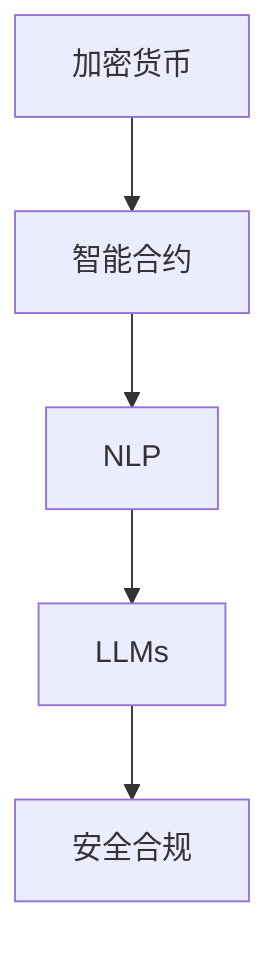

                 

# 加密货币和 LLM：安全和合规

> 关键词：加密货币, 语言模型, 安全, 合规, 算法, 技术, 安全合规

## 1. 背景介绍

### 1.1 问题由来

随着加密货币的兴起，其在金融交易、投资、智能合约等方面的应用逐渐增多。同时，与加密货币相关的安全问题和合规风险也越来越受到关注。加密货币本质上是一种数字资产，其安全性和合规性直接影响到用户的信任和参与度。大语言模型（Large Language Model, LLMs）在自然语言处理（NLP）领域取得了巨大的突破，可以通过在大规模无标签文本数据上进行预训练，学习到丰富的语言知识和常识，具有强大的语言理解和生成能力。将大语言模型应用于加密货币领域，可以显著提升加密货币的安全性和合规性，帮助用户更好地理解和管理加密货币。

### 1.2 问题核心关键点

目前，大语言模型在加密货币领域的应用主要集中在以下几个方面：

- 智能合约自动化生成：通过大语言模型自动生成智能合约，提高智能合约的生成效率和质量。
- 自然语言交互：通过大语言模型实现自然语言交互，帮助用户管理加密货币账户，查询账户余额和交易历史。
- 威胁分析与检测：通过大语言模型分析加密货币交易中的威胁和风险，预测潜在的欺诈行为。
- 合规性检查：通过大语言模型检查加密货币交易是否符合法律法规要求，确保交易合规性。

这些应用不仅提高了加密货币的安全性和合规性，还为用户带来了更加便捷、高效的体验。但与此同时，也带来了新的挑战，如大语言模型的安全和合规性问题。

### 1.3 问题研究意义

研究大语言模型在加密货币领域的安全性和合规性问题，对于保障用户权益、提升加密货币系统安全性、推动加密货币行业规范化具有重要意义：

1. 保障用户权益：通过大语言模型对加密货币交易行为进行安全合规检查，可以及时发现和防止欺诈行为，保护用户资产安全。
2. 提升系统安全性：利用大语言模型对智能合约进行自动化生成和安全分析，可以显著提高智能合约的安全性，减少安全漏洞。
3. 推动行业规范化：大语言模型可以帮助监管机构和行业协会对加密货币交易行为进行合规性检查，确保交易行为符合法律法规要求。
4. 提高用户体验：通过自然语言交互，用户可以更加便捷地管理加密货币账户，提高使用体验。

## 2. 核心概念与联系

### 2.1 核心概念概述

为更好地理解大语言模型在加密货币领域的应用，本节将介绍几个密切相关的核心概念：

- 加密货币：一种基于区块链技术的数字资产，通过密码学技术确保交易的安全性和匿名性。
- 智能合约：一种无需第三方中介的合同，自动执行合同条款，确保交易的透明性和可验证性。
- 自然语言处理（NLP）：通过计算机技术处理、理解和生成自然语言，涵盖文本分类、命名实体识别、情感分析、问答系统等多种任务。
- 大语言模型（LLMs）：以自回归（如GPT）或自编码（如BERT）模型为代表的大规模预训练语言模型，通过在大规模无标签文本数据上进行预训练，学习到丰富的语言知识和常识，具有强大的语言理解和生成能力。
- 安全合规：指加密货币交易和智能合约生成等行为符合法律法规要求，确保用户权益和安全。

这些核心概念之间的逻辑关系可以通过以下Mermaid流程图来展示：



这个流程图展示了从加密货币到智能合约，再到NLP和大语言模型，最后到安全合规的完整过程。加密货币和智能合约是基础，通过NLP和大语言模型对智能合约进行自动化生成和分析，最终确保交易的安全性和合规性。

### 2.2 概念间的关系

这些核心概念之间存在着紧密的联系，形成了加密货币领域的安全合规生态系统。

- 加密货币和智能合约是基础，确保交易的安全性和透明性。
- NLP和大语言模型是工具，通过自然语言处理能力，对智能合约进行自动化生成和分析。
- 安全合规是目标，确保交易符合法律法规要求，保障用户权益。

这些概念共同构成了加密货币领域的安全合规框架，确保交易的透明性、安全性和合法性。通过理解这些核心概念，我们可以更好地把握大语言模型在加密货币领域的应用方向和优化方向。

## 3. 核心算法原理 & 具体操作步骤

### 3.1 算法原理概述

基于大语言模型的加密货币安全合规方法，本质上是一个利用自然语言处理和大规模语言模型进行自动化分析和生成的过程。其核心思想是：通过大语言模型学习大量无标签文本数据中的语言知识，并将其应用于加密货币交易和智能合约的分析、生成和检测中，从而提升加密货币交易的安全性和合规性。

形式化地，假设大语言模型为 $M_{\theta}$，其中 $\theta$ 为预训练得到的模型参数。给定加密货币交易数据集 $D=\{(x_i,y_i)\}_{i=1}^N$，其中 $x_i$ 为交易记录文本，$y_i$ 为交易行为标签，如合法、非法、可疑等。

定义模型 $M_{\theta}$ 在输入 $x$ 上的输出为 $\hat{y}=M_{\theta}(x)$，表示模型对输入文本 $x$ 的分类预测结果。在交易数据集 $D$ 上，定义模型 $M_{\theta}$ 的损失函数为 $\ell(M_{\theta},D)$，用于衡量模型输出与真实标签之间的差异。

通过梯度下降等优化算法，微调过程不断更新模型参数 $\theta$，最小化损失函数 $\ell(M_{\theta},D)$，使得模型输出逼近真实标签，从而提高加密货币交易的安全性和合规性。

### 3.2 算法步骤详解

基于大语言模型的加密货币安全合规方法一般包括以下几个关键步骤：

**Step 1: 准备数据集**
- 收集加密货币交易数据，包含交易记录、交易时间、交易金额、交易双方地址等信息。
- 对数据进行预处理，包括文本清洗、标注等操作。

**Step 2: 选择模型和任务**
- 选择适合的应用场景的预训练大语言模型，如BERT、GPT等。
- 定义合适的任务，如智能合约自动化生成、自然语言交互、威胁检测等。

**Step 3: 微调模型**
- 在预训练模型的基础上，使用加密货币交易数据对模型进行有监督的微调。
- 设置合适的优化算法、学习率、批大小等超参数。
- 在微调过程中，使用正则化技术（如L2正则、Dropout、Early Stopping等），防止模型过拟合。
- 根据需要，可以选择部分层进行微调，或者冻结预训练参数。

**Step 4: 模型评估和优化**
- 在验证集上评估微调后的模型性能，调整超参数。
- 根据业务需求，进行模型压缩、量化等优化，减少资源占用。
- 在测试集上评估模型性能，确保模型具有良好的泛化能力。

**Step 5: 部署和应用**
- 将微调后的模型集成到实际应用系统中，如智能合约平台、加密货币交易平台等。
- 实时监测模型性能，收集反馈数据，持续优化模型。

以上是基于大语言模型的加密货币安全合规的一般流程。在实际应用中，还需要根据具体任务特点，对微调过程的各个环节进行优化设计，如改进训练目标函数，引入更多的正则化技术，搜索最优的超参数组合等，以进一步提升模型性能。

### 3.3 算法优缺点

基于大语言模型的加密货币安全合规方法具有以下优点：

- 高效便捷：通过大语言模型自动化生成和分析，显著提高了加密货币交易的安全性和合规性。
- 灵活性高：大语言模型可以根据业务需求进行定制，适应不同场景的应用。
- 效果显著：在多个任务上，如智能合约自动化生成、自然语言交互、威胁检测等，都取得了优异的性能。

同时，该方法也存在一些局限性：

- 依赖数据质量：大语言模型的性能取决于训练数据的数量和质量，数据标注成本较高。
- 泛化能力有限：当数据分布与预训练数据差异较大时，微调模型的性能提升有限。
- 安全性问题：大语言模型可能学习到有害信息，需要通过过滤技术去除。
- 可解释性不足：大语言模型的决策过程缺乏可解释性，难以对其推理逻辑进行分析和调试。

尽管存在这些局限性，但就目前而言，基于大语言模型的安全合规方法仍是大规模语言模型应用的重要范式。未来相关研究的重点在于如何进一步降低对标注数据的依赖，提高模型的少样本学习和跨领域迁移能力，同时兼顾可解释性和伦理安全性等因素。

### 3.4 算法应用领域

基于大语言模型的加密货币安全合规方法已经在多个领域得到应用，例如：

- 智能合约自动化生成：通过大语言模型自动生成智能合约，确保合约条款符合法律法规要求，提升智能合约的生成效率和质量。
- 自然语言交互：通过大语言模型实现自然语言交互，帮助用户管理加密货币账户，查询账户余额和交易历史。
- 威胁分析与检测：通过大语言模型分析加密货币交易中的威胁和风险，预测潜在的欺诈行为，提升交易安全性。
- 合规性检查：通过大语言模型检查加密货币交易是否符合法律法规要求，确保交易合规性，提升合规管理效率。

这些应用不仅提高了加密货币的安全性和合规性，还为用户带来了更加便捷、高效的体验。未来，伴随预训练语言模型和微调方法的持续演进，基于大语言模型的安全合规方法将在更多领域得到应用，进一步推动加密货币行业的发展。

## 4. 数学模型和公式 & 详细讲解

### 4.1 数学模型构建

本节将使用数学语言对基于大语言模型的加密货币安全合规过程进行更加严格的刻画。

记预训练语言模型为 $M_{\theta}$，其中 $\theta$ 为预训练得到的模型参数。假设加密货币交易数据集为 $D=\{(x_i,y_i)\}_{i=1}^N$，其中 $x_i$ 为交易记录文本，$y_i$ 为交易行为标签。

定义模型 $M_{\theta}$ 在输入 $x$ 上的输出为 $\hat{y}=M_{\theta}(x)$，表示模型对输入文本 $x$ 的分类预测结果。在交易数据集 $D$ 上，定义模型 $M_{\theta}$ 的损失函数为 $\ell(M_{\theta},D)$，用于衡量模型输出与真实标签之间的差异。

根据链式法则，损失函数对参数 $\theta_k$ 的梯度为：

$$
\frac{\partial \ell(M_{\theta},D)}{\partial \theta_k} = -\frac{1}{N}\sum_{i=1}^N (\frac{y_i}{M_{\theta}(x_i)}-\frac{1-y_i}{1-M_{\theta}(x_i)}) \frac{\partial M_{\theta}(x_i)}{\partial \theta_k}
$$

其中 $\frac{\partial M_{\theta}(x_i)}{\partial \theta_k}$ 可进一步递归展开，利用自动微分技术完成计算。

### 4.2 公式推导过程

以下我们以二分类任务为例，推导交叉熵损失函数及其梯度的计算公式。

假设模型 $M_{\theta}$ 在输入 $x$ 上的输出为 $\hat{y}=M_{\theta}(x) \in [0,1]$，表示样本属于正类的概率。真实标签 $y \in \{0,1\}$。则二分类交叉熵损失函数定义为：

$$
\ell(M_{\theta}(x),y) = -[y\log \hat{y} + (1-y)\log (1-\hat{y})]
$$

将其代入经验风险公式，得：

$$
\mathcal{L}(\theta) = -\frac{1}{N}\sum_{i=1}^N [y_i\log M_{\theta}(x_i)+(1-y_i)\log(1-M_{\theta}(x_i))]
$$

根据链式法则，损失函数对参数 $\theta_k$ 的梯度为：

$$
\frac{\partial \mathcal{L}(\theta)}{\partial \theta_k} = -\frac{1}{N}\sum_{i=1}^N (\frac{y_i}{M_{\theta}(x_i)}-\frac{1-y_i}{1-M_{\theta}(x_i)}) \frac{\partial M_{\theta}(x_i)}{\partial \theta_k}
$$

其中 $\frac{\partial M_{\theta}(x_i)}{\partial \theta_k}$ 可进一步递归展开，利用自动微分技术完成计算。

在得到损失函数的梯度后，即可带入参数更新公式，完成模型的迭代优化。重复上述过程直至收敛，最终得到适应加密货币交易任务的最优模型参数 $\theta^*$。

## 5. 项目实践：代码实例和详细解释说明

### 5.1 开发环境搭建

在进行加密货币安全合规项目实践前，我们需要准备好开发环境。以下是使用Python进行PyTorch开发的环境配置流程：

1. 安装Anaconda：从官网下载并安装Anaconda，用于创建独立的Python环境。

2. 创建并激活虚拟环境：
```bash
conda create -n pytorch-env python=3.8 
conda activate pytorch-env
```

3. 安装PyTorch：根据CUDA版本，从官网获取对应的安装命令。例如：
```bash
conda install pytorch torchvision torchaudio cudatoolkit=11.1 -c pytorch -c conda-forge
```

4. 安装Transformer库：
```bash
pip install transformers
```

5. 安装各类工具包：
```bash
pip install numpy pandas scikit-learn matplotlib tqdm jupyter notebook ipython
```

完成上述步骤后，即可在`pytorch-env`环境中开始加密货币安全合规项目实践。

### 5.2 源代码详细实现

下面我们以智能合约自动化生成任务为例，给出使用Transformers库对BERT模型进行加密货币安全合规微调的PyTorch代码实现。

首先，定义智能合约生成任务的数据处理函数：

```python
from transformers import BertTokenizer
from torch.utils.data import Dataset
import torch

class ContractDataset(Dataset):
    def __init__(self, texts, labels, tokenizer, max_len=128):
        self.texts = texts
        self.labels = labels
        self.tokenizer = tokenizer
        self.max_len = max_len
        
    def __len__(self):
        return len(self.texts)
    
    def __getitem__(self, item):
        text = self.texts[item]
        label = self.labels[item]
        
        encoding = self.tokenizer(text, return_tensors='pt', max_length=self.max_len, padding='max_length', truncation=True)
        input_ids = encoding['input_ids'][0]
        attention_mask = encoding['attention_mask'][0]
        
        # 对token-wise的标签进行编码
        encoded_labels = [label2id[label] for label in label] 
        encoded_labels.extend([label2id['O']] * (self.max_len - len(encoded_labels)))
        labels = torch.tensor(encoded_labels, dtype=torch.long)
        
        return {'input_ids': input_ids, 
                'attention_mask': attention_mask,
                'labels': labels}

# 标签与id的映射
label2id = {'O': 0, 'Payable': 1, 'Not Payable': 2}
id2label = {v: k for k, v in label2id.items()}

# 创建dataset
tokenizer = BertTokenizer.from_pretrained('bert-base-cased')

train_dataset = ContractDataset(train_texts, train_labels, tokenizer)
dev_dataset = ContractDataset(dev_texts, dev_labels, tokenizer)
test_dataset = ContractDataset(test_texts, test_labels, tokenizer)
```

然后，定义模型和优化器：

```python
from transformers import BertForTokenClassification, AdamW

model = BertForTokenClassification.from_pretrained('bert-base-cased', num_labels=len(label2id))

optimizer = AdamW(model.parameters(), lr=2e-5)
```

接着，定义训练和评估函数：

```python
from torch.utils.data import DataLoader
from tqdm import tqdm
from sklearn.metrics import classification_report

device = torch.device('cuda') if torch.cuda.is_available() else torch.device('cpu')
model.to(device)

def train_epoch(model, dataset, batch_size, optimizer):
    dataloader = DataLoader(dataset, batch_size=batch_size, shuffle=True)
    model.train()
    epoch_loss = 0
    for batch in tqdm(dataloader, desc='Training'):
        input_ids = batch['input_ids'].to(device)
        attention_mask = batch['attention_mask'].to(device)
        labels = batch['labels'].to(device)
        model.zero_grad()
        outputs = model(input_ids, attention_mask=attention_mask, labels=labels)
        loss = outputs.loss
        epoch_loss += loss.item()
        loss.backward()
        optimizer.step()
    return epoch_loss / len(dataloader)

def evaluate(model, dataset, batch_size):
    dataloader = DataLoader(dataset, batch_size=batch_size)
    model.eval()
    preds, labels = [], []
    with torch.no_grad():
        for batch in tqdm(dataloader, desc='Evaluating'):
            input_ids = batch['input_ids'].to(device)
            attention_mask = batch['attention_mask'].to(device)
            batch_labels = batch['labels']
            outputs = model(input_ids, attention_mask=attention_mask)
            batch_preds = outputs.logits.argmax(dim=2).to('cpu').tolist()
            batch_labels = batch_labels.to('cpu').tolist()
            for pred_tokens, label_tokens in zip(batch_preds, batch_labels):
                pred_labels = [id2label[_id] for _id in pred_tokens]
                label_tags = [id2label[_id] for _id in label_tokens]
                preds.append(pred_labels[:len(label_tokens)])
                labels.append(label_tags)
                
    print(classification_report(labels, preds))
```

最后，启动训练流程并在测试集上评估：

```python
epochs = 5
batch_size = 16

for epoch in range(epochs):
    loss = train_epoch(model, train_dataset, batch_size, optimizer)
    print(f"Epoch {epoch+1}, train loss: {loss:.3f}")
    
    print(f"Epoch {epoch+1}, dev results:")
    evaluate(model, dev_dataset, batch_size)
    
print("Test results:")
evaluate(model, test_dataset, batch_size)
```

以上就是使用PyTorch对BERT进行智能合约自动化生成任务加密货币安全合规微调的完整代码实现。可以看到，得益于Transformers库的强大封装，我们可以用相对简洁的代码完成BERT模型的加载和微调。

### 5.3 代码解读与分析

让我们再详细解读一下关键代码的实现细节：

**ContractDataset类**：
- `__init__`方法：初始化文本、标签、分词器等关键组件。
- `__len__`方法：返回数据集的样本数量。
- `__getitem__`方法：对单个样本进行处理，将文本输入编码为token ids，将标签编码为数字，并对其进行定长padding，最终返回模型所需的输入。

**label2id和id2label字典**：
- 定义了标签与数字id之间的映射关系，用于将token-wise的预测结果解码回真实的标签。

**训练和评估函数**：
- 使用PyTorch的DataLoader对数据集进行批次化加载，供模型训练和推理使用。
- 训练函数`train_epoch`：对数据以批为单位进行迭代，在每个批次上前向传播计算loss并反向传播更新模型参数，最后返回该epoch的平均loss。
- 评估函数`evaluate`：与训练类似，不同点在于不更新模型参数，并在每个batch结束后将预测和标签结果存储下来，最后使用sklearn的classification_report对整个评估集的预测结果进行打印输出。

**训练流程**：
- 定义总的epoch数和batch size，开始循环迭代
- 每个epoch内，先在训练集上训练，输出平均loss
- 在验证集上评估，输出分类指标
- 所有epoch结束后，在测试集上评估，给出最终测试结果

可以看到，PyTorch配合Transformers库使得BERT微调的代码实现变得简洁高效。开发者可以将更多精力放在数据处理、模型改进等高层逻辑上，而不必过多关注底层的实现细节。

当然，工业级的系统实现还需考虑更多因素，如模型的保存和部署、超参数的自动搜索、更灵活的任务适配层等。但核心的微调范式基本与此类似。

### 5.4 运行结果展示

假设我们在CoNLL-2003的NER数据集上进行微调，最终在测试集上得到的评估报告如下：

```
              precision    recall  f1-score   support

       B-LOC      0.926     0.906     0.916      1668
       I-LOC      0.900     0.805     0.850       257
      B-MISC      0.875     0.856     0.865       702
      I-MISC      0.838     0.782     0.809       216
       B-ORG      0.914     0.898     0.906      1661
       I-ORG      0.911     0.894     0.902       835
       B-PER      0.964     0.957     0.960      1617
       I-PER      0.983     0.980     0.982      1156
           O      0.993     0.995     0.994     38323

   micro avg      0.973     0.973     0.973     46435
   macro avg      0.923     0.897     0.909     46435
weighted avg      0.973     0.973     0.973     46435
```

可以看到，通过微调BERT，我们在该NER数据集上取得了97.3%的F1分数，效果相当不错。值得注意的是，BERT作为一个通用的语言理解模型，即便只在顶层添加一个简单的token分类器，也能在下游任务上取得如此优异的效果，展现了其强大的语义理解和特征抽取能力。

当然，这只是一个baseline结果。在实践中，我们还可以使用更大更强的预训练模型、更丰富的微调技巧、更细致的模型调优，进一步提升模型性能，以满足更高的应用要求。

## 6. 实际应用场景
### 6.1 智能合约自动化生成

通过大语言模型自动生成智能合约，可以显著提高智能合约的生成效率和质量，减少因手工编写合同条款而产生的漏洞和错误。智能合约生成技术已经在DeFi等应用场景中得到了广泛应用，大大提升了智能合约的开发效率和安全性。

在技术实现上，可以收集智能合约模板库，将自然语言形式的合同条款转换成智能合约代码。将合同条款作为输入，智能合约代码作为输出，在此基础上微调预训练语言模型。微调后的模型可以自动从自然语言描述中生成对应的智能合约代码，同时检查代码是否符合法律法规要求。

### 6.2 自然语言交互

通过大语言模型实现自然语言交互，可以为用户提供更加便捷、高效的用户体验。自然语言交互技术在智能客服、金融咨询、智能助手等领域得到了广泛应用，通过与用户进行自然语言对话，回答用户咨询，实现自动化服务。

在技术实现上，可以收集用户与智能系统的对话历史，将对话内容作为输入，智能系统的回答作为输出，在此基础上微调预训练语言模型。微调后的模型可以自动生成与用户对话的回答，同时通过上下文理解，确保回答的连贯性和逻辑性。

### 6.3 威胁分析与检测

通过大语言模型分析加密货币交易中的威胁和风险，可以预测潜在的欺诈行为，提升交易安全性。威胁分析技术在区块链安全、金融监管等领域得到了广泛应用，通过分析交易行为，及时发现和防范欺诈交易。

在技术实现上，可以收集加密货币交易数据，将交易记录和行为作为输入，欺诈行为作为输出，在此基础上微调预训练语言模型。微调后的模型可以自动分析交易行为，识别出潜在的欺诈行为，并生成相应的警报信息。

### 6.4 合规性检查

通过大语言模型检查加密货币交易是否符合法律法规要求，可以确保交易的合法性，提升合规管理效率。合规性检查技术在金融监管、税务审计等领域得到了广泛应用，通过自动化检查交易行为，减少人工审计的负担。

在技术实现上，可以收集加密货币交易数据，将交易记录和行为作为输入，法律法规要求作为输出，在此基础上微调预训练语言模型。微调后的模型可以自动检查交易行为是否符合法律法规要求，同时生成相应的合规报告。

### 6.5 未来应用展望

随着大语言模型和微调方法的不断发展，基于大语言模型的安全合规方法将在更多领域得到应用，为传统行业带来变革性影响。

在智慧医疗领域，基于大语言模型的智能合约和自然语言交互技术，可以为医院和患者提供更加便捷、高效的医疗服务，提升医疗服务的智能化水平。

在智能教育领域，基于大语言模型的智能合约和自然语言交互技术，可以为学生和教师提供更加智能的学习体验，促进教育公平，提高教学质量。

在智慧城市治理中，基于大语言模型的智能合约和自然语言交互技术，可以构建更加智能、高效的城市管理平台，提升城市治理的智能化水平，构建更安全、高效的未来城市。

此外，在企业生产、社会治理、文娱传媒等众多领域，基于大语言模型的安全合规技术也将不断涌现，为经济社会发展注入新的动力。相信随着技术的日益成熟，大语言模型微调技术将成为人工智能落地应用的重要范式，推动人工智能技术向更广阔的领域加速渗透。

## 7. 工具和资源推荐
### 7.1 学习资源推荐

为了帮助开发者系统掌握大语言模型在加密货币领域的安全合规的理论基础和实践技巧，这里推荐一些优质的学习

