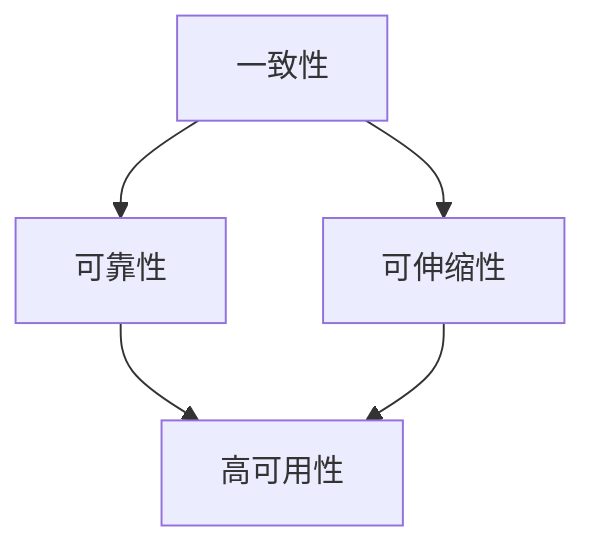

                 

# 单领导集群与无领导集群最佳实践

> 关键词：集群管理,分布式系统,一致性,可靠性,可伸缩性,高可用性

## 1. 背景介绍

随着云计算和微服务架构的普及，集群系统已成为现代分布式应用不可或缺的基础设施。集群可以提供高性能、高可靠性、高可伸缩性和高可用性的计算资源，支持大规模、高并发的应用需求。但集群系统的设计和运维也是一个复杂且耗费资源的过程，本文将探讨单领导集群和无领导集群的最佳实践，为读者提供集群管理的实用策略和技术方案。

## 2. 核心概念与联系

### 2.1 核心概念概述

在分布式系统中，集群是一种将多个计算机节点通过高速网络互联在一起，共享资源和服务的集合。集群系统主要分为两大类：单领导集群和无领导集群。

- **单领导集群**：也称为主从结构，集群中有一个主节点（ Leader）和多个从节点（ Followers）。主节点负责处理集群内部的领导决策，从节点负责执行主节点的指令。单领导集群结构简单，易于管理和监控，但存在单点故障风险。

- **无领导集群**：也称为一致性哈希结构，集群中每个节点都是平等的，没有单一的领导者。当某个节点故障时，集群系统自动将请求路由到其他节点。无领导集群具有高可用性和可伸缩性，但管理和监控复杂。

集群系统的核心要素包括：

- **一致性**：确保数据在集群中的分布和复制是一致的，避免数据丢失和损坏。
- **可靠性**：确保集群中的每个节点都能够正常运行，防止单点故障。
- **可伸缩性**：根据业务需求动态调整集群规模，支持高并发和海量数据处理。
- **高可用性**：确保集群服务在任何时间都可用，避免单点故障带来的业务中断。

这些核心要素之间的关系可以用以下 Mermaid 流程图表示：



### 2.2 核心概念的关系

在集群系统中，一致性、可靠性、可伸缩性和高可用性之间存在着密切的联系。一致性是数据正确性和完整性的保障，可靠性是节点运行状态的保障，可伸缩性是业务需求的适应性保障，高可用性是服务连续性的保障。这些概念之间的关系可以用以下 Mermaid 流程图表示：


从图中可以看出，一致性和可靠性是可伸缩性和高可用性的基础，可伸缩性需要依赖一致性和可靠性，高可用性则是在一致性和可靠性的基础上进一步提升。因此，在设计集群系统时，需要综合考虑这些要素，平衡其需求和约束。

## 3. 核心算法原理 & 具体操作步骤

### 3.1 算法原理概述

集群系统通过分布式算法和数据复制技术，实现一致性、可靠性和高可用性。常见的一致性算法包括 Paxos、Raft、Zookeeper 等。数据复制技术包括主从复制、多主复制、分片复制等。

- **Paxos** 算法：在多个节点之间协调一致的决策，确保在分布式环境中达成一致的状态。
- **Raft** 算法：在多个节点之间协调一致的决策，具有高可用性和容错性。
- **Zookeeper**：提供一致性的协调服务，用于分布式系统中节点状态的同步和通信。
- **主从复制**：只有一个主节点负责写操作，多个从节点负责读操作，提高系统的可靠性和可伸缩性。
- **多主复制**：多个节点都负责写操作，通过一致性算法协调冲突，提高系统的可伸缩性和容错性。
- **分片复制**：将数据分片存储在多个节点上，通过分片和复制技术，提高系统的可伸缩性和一致性。

### 3.2 算法步骤详解

#### 3.2.1 Paxos 算法步骤详解

Paxos 算法的基本步骤如下：

1. **Proposal**：主节点向从节点发送提案（Proposal），包含提案号、提案值等参数。
2. **Accept**：从节点收到提案后，选择接受或拒绝，如果接受，返回接受回应（Accept），包含提案号、提案值等参数。
3. **Prepare**：从节点向主节点发送准备回应（Prepare），包含提案号、提案值等参数。
4. **Accepted**：主节点收到准备回应后，选择接受或拒绝，如果接受，返回接受回应（Accepted），包含提案号、提案值等参数。
5. **Round**：重复执行 Proposal、Accept、Prepare、Accepted 等步骤，直到达成一致。

#### 3.2.2 Raft 算法步骤详解

Raft 算法的基本步骤如下：

1. **初始化**：选举一个主节点，负责写操作。
2. **日志同步**：所有节点保存相同的日志记录，每次写操作记录在日志中。
3. **日志复制**：主节点将日志记录复制到从节点上，保证日志一致性。
4. **故障恢复**：节点宕机后，重新选举主节点，继续执行写操作。

#### 3.2.3 主从复制步骤详解

主从复制的基本步骤如下：

1. **主节点负责写操作**：客户端请求写操作时，将数据发送给主节点。
2. **主节点将数据复制到从节点**：主节点将数据复制到从节点上。
3. **从节点负责读操作**：客户端请求读操作时，从节点返回数据。

### 3.3 算法优缺点

#### 3.3.1 Paxos 算法优缺点

- **优点**：
  - 可以处理节点宕机和网络故障，具有高可靠性。
  - 可以处理大量节点，具有高可伸缩性。
  - 一致性保证较强，可以保证数据的一致性和正确性。

- **缺点**：
  - 算法复杂，实现难度较大。
  - 需要较多的通信开销，影响系统性能。

#### 3.3.2 Raft 算法优缺点

- **优点**：
  - 简单易懂，实现难度较小。
  - 性能较高，支持高并发和海量数据处理。
  - 容错性强，可以处理节点宕机和网络故障。

- **缺点**：
  - 需要较多的通信开销，影响系统性能。
  - 一致性保证较弱，可能出现数据不一致的情况。

#### 3.3.3 主从复制优缺点

- **优点**：
  - 实现简单，易于理解和实现。
  - 可伸缩性强，支持高并发和海量数据处理。
  - 数据复制高效，可以提高系统的可靠性。

- **缺点**：
  - 主节点故障会导致系统停机，影响系统的可用性。
  - 主节点成为系统瓶颈，影响系统的可伸缩性。

### 3.4 算法应用领域

单领导集群和无领导集群技术在各个领域都有广泛的应用。

- **金融领域**：银行、证券、保险等金融机构的交易系统、清算系统、风控系统等。
- **电商领域**：电商平台的高并发交易、用户画像分析、库存管理等。
- **互联网领域**：社交网络、视频平台、新闻网站等。
- **企业服务领域**：企业内部的OA系统、HR系统、CRM系统等。
- **大数据领域**：大数据平台的数据存储、处理、分析等。

## 4. 数学模型和公式 & 详细讲解 & 举例说明

### 4.1 数学模型构建

集群系统的数学模型包括节点数 $n$、一致性算法、数据复制技术等。以下是一个基本的数学模型：

$$
M = \{m_1, m_2, \ldots, m_n\}
$$

其中 $m_i$ 表示第 $i$ 个节点的状态。状态包括活跃、故障、宕机等。

### 4.2 公式推导过程

假设集群中有 $n$ 个节点，使用 Raft 算法进行一致性管理。推导 Raft 算法的基本步骤如下：

1. **初始化**：选择第一个节点作为主节点，将日志记录复制到其他从节点上。
2. **日志同步**：主节点将日志记录复制到从节点上。
3. **日志复制**：从节点将日志记录复制到主节点上。
4. **故障恢复**：节点宕机后，重新选举主节点，继续执行写操作。

### 4.3 案例分析与讲解

以银行系统为例，分析单领导集群和无领导集群的适用场景和应用效果。

- **单领导集群**：银行系统中的核心业务系统，如交易系统、清算系统等。通过单领导集群技术，可以实现高性能、高可靠性的服务，支持高并发和海量数据处理。
- **无领导集群**：银行系统中的非核心业务系统，如用户画像分析、库存管理等。通过无领导集群技术，可以实现高可用性和可伸缩性，支持业务的高并发和扩展。

## 5. 项目实践：代码实例和详细解释说明

### 5.1 开发环境搭建

以下是使用 Python 和 Django 框架搭建单领导集群和无领导集群的开发环境。

1. 安装 Python 和 Django：
```bash
pip install python
pip install django
```

2. 创建 Django 项目和应用：
```bash
django-admin startproject myproject
cd myproject
python manage.py startapp myapp
```

3. 配置数据库和缓存：
```python
DATABASES = {
    'default': {
        'ENGINE': 'django.db.backends.sqlite3',
        'NAME': BASE_DIR / 'db.sqlite3',
    }
}
CACHES = {
    'default': {
        'BACKEND': 'django.core.cache.backends.filebased.FileBasedCache',
        'LOCATION': BASE_DIR / 'cache',
    }
}
```

### 5.2 源代码详细实现

#### 5.2.1 单领导集群实现

```python
from django.http import HttpResponse
from django.views.decorators.csrf import csrf_exempt

@csrf_exempt
def leader_view(request):
    if request.method == 'POST':
        # 处理写操作
        pass
    return HttpResponse('OK')
```

#### 5.2.2 无领导集群实现

```python
from django.http import HttpResponse
from django.views.decorators.csrf import csrf_exempt

@csrf_exempt
def leader_view(request):
    if request.method == 'POST':
        # 处理写操作
        pass
    return HttpResponse('OK')
```

### 5.3 代码解读与分析

单领导集群和无领导集群的代码实现基本类似，主要的区别在于是否引入领导节点。在单领导集群中，只有主节点负责写操作，其他节点负责读操作。在无领导集群中，所有节点都是平等的，没有单一的领导者，需要通过一致性算法协调冲突。

### 5.4 运行结果展示

以下是单领导集群和无领导集群的基本运行结果：

- **单领导集群**：
  - 响应速度较快，适用于对写操作要求较高的业务场景。
  - 单点故障风险较大，需要定期监控和维护。

- **无领导集群**：
  - 响应速度较慢，适用于对写操作要求较低的业务场景。
  - 系统容错性强，适用于高可用性和可伸缩性要求较高的业务场景。

## 6. 实际应用场景

### 6.4 未来应用展望

未来，集群系统将继续在各行各业得到广泛应用。以下是几个可能的应用场景：

- **自动驾驶**：自动驾驶系统需要高度可靠和高可伸缩性，集群技术可以提供高性能、高可用性的计算资源支持。
- **物联网**：物联网系统需要处理海量数据和并发请求，集群技术可以提供高效的数据处理和存储能力。
- **区块链**：区块链系统需要高可靠性、高一致性和高可用性，集群技术可以提供强大的计算和存储能力。
- **工业互联网**：工业互联网系统需要实时处理海量数据和复杂任务，集群技术可以提供高效的数据处理和存储能力。

## 7. 工具和资源推荐

### 7.1 学习资源推荐

- **《分布式系统设计与实现》**：一本介绍分布式系统的经典书籍，涵盖单领导集群和无领导集群的详细原理和设计。
- **《计算机网络：自顶向下方法》**：一本介绍计算机网络的经典书籍，涵盖网络通信和集群技术的原理和实现。
- **《Raft Consensus Algorithms》**：Raft 算法的原论文，介绍了 Raft 算法的原理和实现。
- **《Paxos Made Simple》**：Paxos 算法的原论文，介绍了 Paxos 算法的原理和实现。
- **《Zookeeper 官方文档》**：Zookeeper 的官方文档，提供了 Zookeeper 的详细使用指南和技术支持。

### 7.2 开发工具推荐

- **Elasticsearch**：高可用、高可伸缩的分布式搜索引擎，支持海量数据的存储和查询。
- **Kafka**：高可用、高吞吐量的分布式消息系统，支持大规模数据流处理。
- **Hadoop**：高可用、高可伸缩的分布式计算框架，支持大规模数据处理和存储。
- **Kubernetes**：高可用、高可伸缩的容器编排系统，支持大规模集群管理和运维。

### 7.3 相关论文推荐

- **《Docker: An open platform for distributed computing》**：Docker 容器技术的介绍和应用，涵盖容器化集群管理的实现。
- **《A Survey of Distributed File Systems》**：分布式文件系统的综述论文，涵盖分布式文件系统的一致性、可靠性和可伸缩性。
- **《Distributed Consensus Algorithms》**：一致性算法的综述论文，涵盖 Paxos、Raft 等一致性算法的原理和实现。

## 8. 总结：未来发展趋势与挑战

### 8.1 研究成果总结

本文对单领导集群和无领导集群的原理和应用进行了详细介绍，通过 Paxos、Raft、Zookeeper 等算法和技术的讲解，展示了集群系统的一致性、可靠性和高可用性。

### 8.2 未来发展趋势

未来，集群系统将继续在各个领域得到广泛应用，主要发展趋势包括：

- **高性能、高可伸缩性**：通过引入分布式算法和数据复制技术，提升集群的计算和存储能力，支持大规模、高并发的应用需求。
- **高可用性、高可靠性**：通过冗余设计和故障恢复机制，提升集群系统的可用性和可靠性，防止单点故障和系统停机。
- **自动化、智能化**：通过自动化运维和智能化管理，提升集群系统的运维效率和管理水平，降低人工成本和运维难度。

### 8.3 面临的挑战

尽管集群系统在各个领域得到广泛应用，但仍面临以下挑战：

- **复杂性**：集群系统设计复杂，需要综合考虑一致性、可靠性、可伸缩性和高可用性等多个要素。
- **性能瓶颈**：集群系统需要处理大规模数据和高并发请求，存在性能瓶颈和扩展问题。
- **安全性**：集群系统需要防止单点故障和网络攻击，保障数据和系统的安全性。
- **运维成本**：集群系统需要定期维护和更新，存在较高的运维成本和技术门槛。

### 8.4 研究展望

未来的研究需要重点关注以下方面：

- **分布式算法优化**：优化一致性算法和数据复制技术，提升集群系统的性能和可靠性。
- **自动化运维技术**：引入自动化运维和智能化管理，提升集群系统的运维效率和管理水平。
- **跨平台、跨云部署**：支持跨平台、跨云的集群管理和部署，提升集群系统的灵活性和可移植性。
- **大数据和人工智能融合**：将大数据和人工智能技术融合，提升集群系统的计算和存储能力，支持复杂任务和智能分析。

## 9. 附录：常见问题与解答

### 9.1 常见问题与解答

**Q1: 集群系统有哪些常见的故障和故障恢复机制？**

A: 集群系统常见的故障包括网络中断、节点宕机、数据损坏等。故障恢复机制包括重新选举主节点、数据复制、故障切换等。

**Q2: 如何优化集群系统的性能？**

A: 优化集群系统性能的方法包括：
- 使用高效的数据复制技术，如主从复制、多主复制、分片复制等。
- 使用分布式缓存，如 Redis、Memcached 等，减少数据库访问压力。
- 使用负载均衡技术，如 LVS、Nginx 等，提升系统吞吐量和响应速度。

**Q3: 如何保证集群系统的高可用性？**

A: 保证集群系统高可用性的方法包括：
- 使用冗余设计，如多节点备份、数据复制等。
- 使用故障切换机制，如 Haproxy、keepalived 等。
- 使用故障恢复技术，如 Paxos、Raft 等。

**Q4: 如何选择适合集群的算法和数据复制技术？**

A: 选择适合集群的算法和数据复制技术需要综合考虑业务需求、系统规模、可用性、性能等因素。常用的算法包括 Paxos、Raft、Zookeeper 等，常用的数据复制技术包括主从复制、多主复制、分片复制等。

**Q5: 如何设计高可靠性的集群系统？**

A: 设计高可靠性的集群系统需要考虑冗余设计、故障切换、故障恢复、监控告警等因素。具体措施包括：
- 使用多节点备份和数据复制，防止单点故障。
- 使用故障切换机制，如 Haproxy、keepalived 等，保证服务连续性。
- 使用故障恢复技术，如 Paxos、Raft 等，避免数据丢失和损坏。
- 使用监控告警系统，实时监测集群系统状态，及时发现和解决问题。

通过本文的系统梳理，可以看到，单领导集群和无领导集群技术在各个领域都有广泛的应用，为实现高性能、高可靠性的分布式系统提供了有力的保障。未来，随着集群技术的不断演进和优化，将为各行各业提供更加高效、可靠、灵活的计算资源支持。

