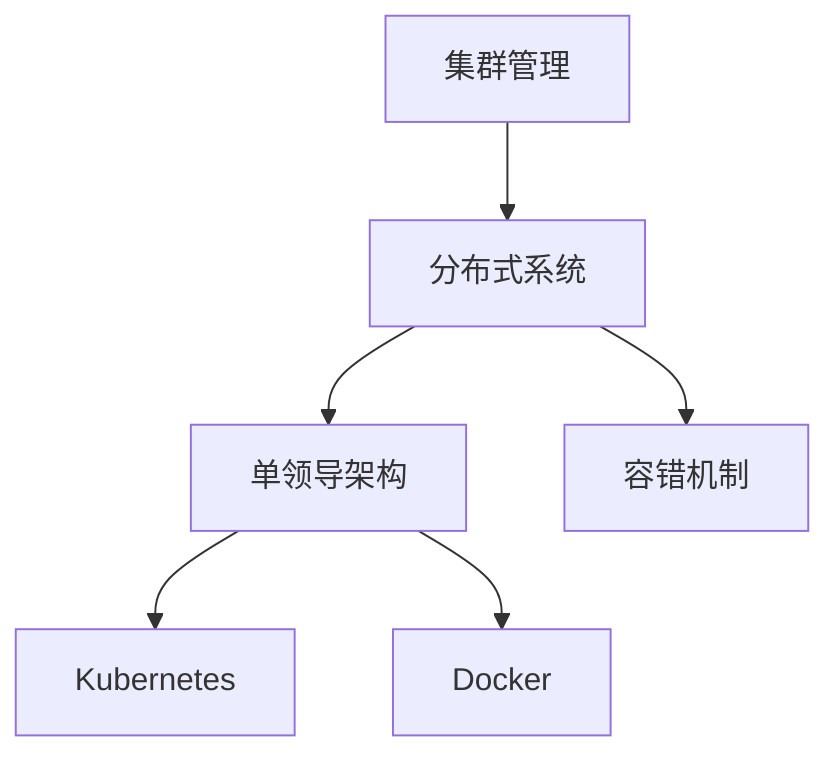
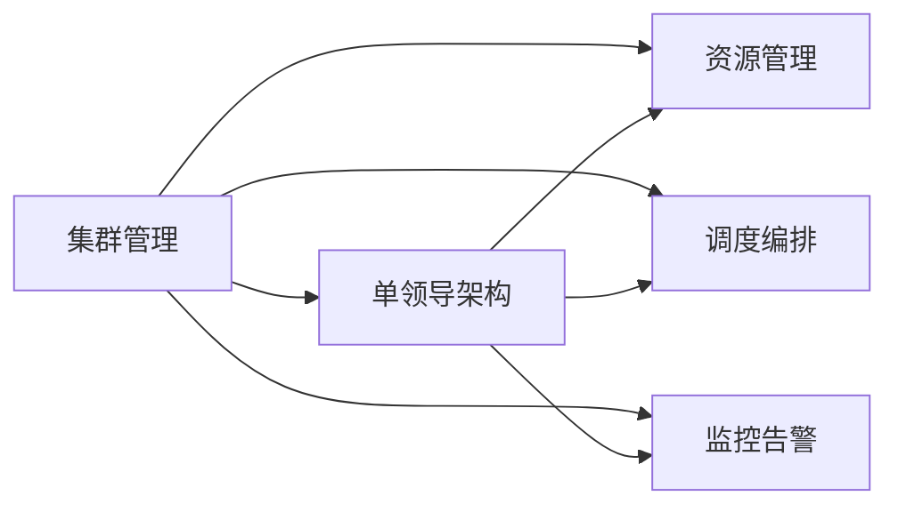
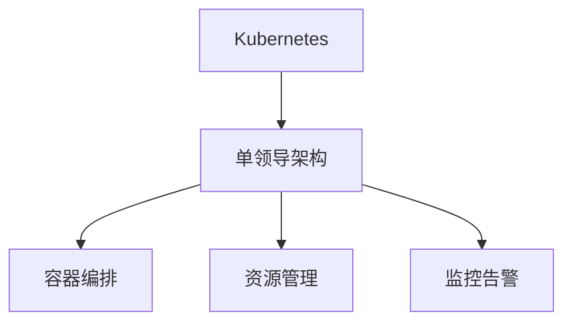
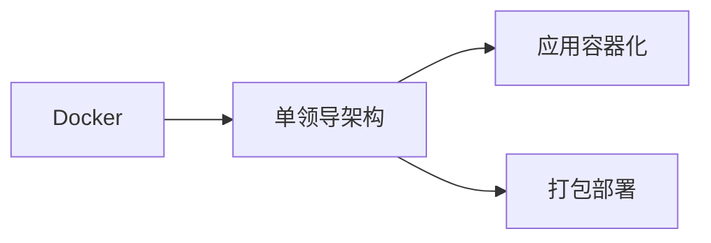
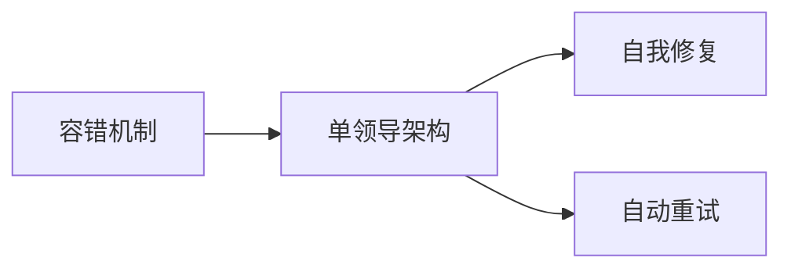
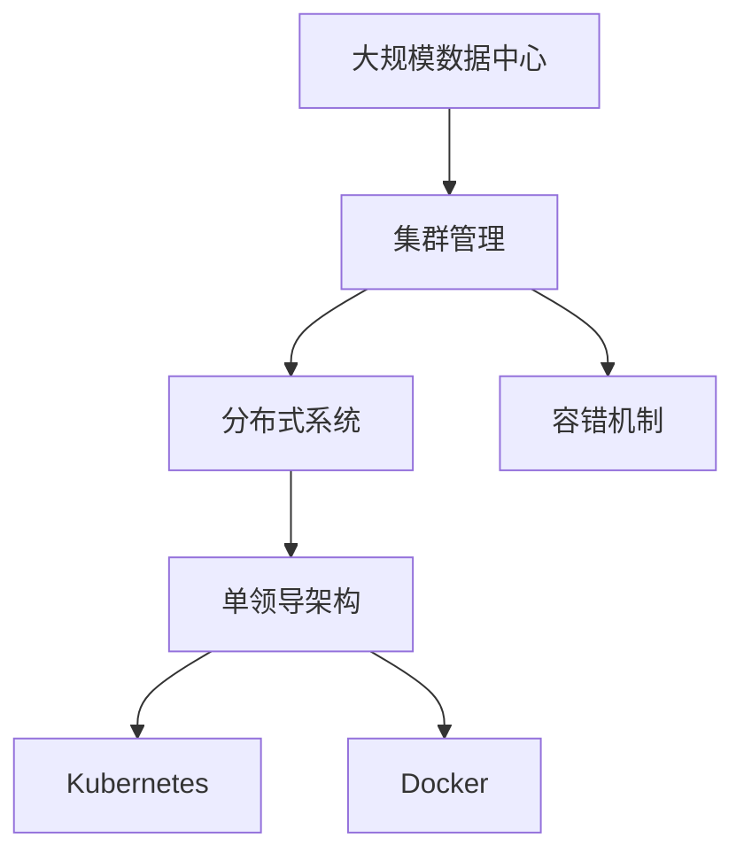

                 

# 单领导集群的实现与维护

> 关键词：
- 集群管理
- 分布式系统
- 单领导架构
- Kubernetes
- Docker
- 容错机制

## 1. 背景介绍

### 1.1 问题由来
在当今数字化、网络化的时代背景下，企业对 IT 基础设施的依赖程度越来越高。为了提升系统的可用性、可扩展性和效率，很多企业都采用了分布式系统的架构。然而，随着系统的复杂性不断增加，系统管理和维护的难度也在不断提升。特别在容器化、微服务盛行的今天，分布式系统的复杂性更是达到了新的高度。

传统分布式系统主要依赖于多个独立的节点协同工作，通过编排调度和负载均衡来实现系统的整体功能。然而这种架构模式，往往需要复杂的管理工具和机制，导致运维成本高、效率低下、扩展性受限等问题。为解决这些问题，单领导集群（Monolithic Leadership Cluster）成为了一种新型架构模式。

### 1.2 问题核心关键点
单领导集群（Monolithic Leadership Cluster）的核心理念是将多个独立节点通过一个核心节点（单领导）进行统一管理，所有服务通过该单领导进行调度、编排、监控等操作，从而实现系统的简化管理、高效扩展和稳定运行。

具体而言，单领导集群具备以下特点：
- **集中管理**：所有服务通过单领导进行统一管理，避免了多节点间复杂的编排和调度。
- **统一调度**：所有服务的编排、扩缩容、重载等操作都由单领导节点完成，避免了多节点间协调一致性的问题。
- **高效扩展**：单领导集群可以根据实际需求动态扩缩容，更加灵活地应对业务变化。
- **稳定运行**：单领导集群具备强大的容错和自我修复机制，保证了系统的稳定性和可用性。

## 2. 核心概念与联系

### 2.1 核心概念概述

为更好地理解单领导集群的实现与维护，本节将介绍几个密切相关的核心概念：

- **集群管理**：集群管理是分布式系统中极为重要的组成部分，包括资源管理、调度编排、监控告警等。有效的集群管理可以大大提升系统的效率和稳定性。
- **分布式系统**：分布式系统是指多个独立的节点通过网络进行协同工作的系统，具备高可用、高可扩展等特性。
- **单领导架构**：单领导架构是指通过一个核心节点进行集中管理和调度的架构模式，相较于多节点架构，单领导架构更简单、高效、易于扩展。
- **Kubernetes**：Kubernetes（简称 K8s）是一个开源的容器编排平台，提供了强大的集群管理能力，可以很方便地部署、管理、扩展、监控容器化应用。
- **Docker**：Docker 是一个开源的容器化平台，可以打包应用及其依赖库，实现应用在任意环境中的一致性运行。
- **容错机制**：容错机制是指系统在发生故障时，通过自我修复或自动重试等方式，保证系统服务的连续性和稳定性。

这些核心概念之间的逻辑关系可以通过以下Mermaid流程图来展示：



这个流程图展示了大领导集群的核心概念及其之间的关系：

1. 集群管理是分布式系统的基础，提供了资源管理、调度编排、监控告警等能力。
2. 单领导架构通过集中管理和调度，简化了大领导集群的架构。
3. Kubernetes 提供了强大的集群管理能力，可以很方便地实现单领导架构。
4. Docker 可以实现应用的容器化部署，便于单领导架构的实现。
5. 容错机制保证了单领导集群的稳定性和可用性。

### 2.2 概念间的关系

这些核心概念之间存在着紧密的联系，形成了单领导集群的核心生态系统。下面我通过几个Mermaid流程图来展示这些概念之间的关系。

#### 2.2.1 集群管理与单领导架构的关系



这个流程图展示了集群管理对单领导架构的支持。集群管理提供了资源管理、调度编排、监控告警等基础能力，支持单领导架构的实现。

#### 2.2.2 Kubernetes与单领导架构的关系



这个流程图展示了 Kubernetes 对单领导架构的支持。Kubernetes 通过容器编排、资源管理、监控告警等功能，支持单领导架构的实现和管理。

#### 2.2.3 Docker与单领导架构的关系



这个流程图展示了 Docker 对单领导架构的支持。Docker 通过应用容器化、打包部署等功能，支持单领导架构的实现和管理。

#### 2.2.4 容错机制与单领导架构的关系



这个流程图展示了容错机制对单领导架构的支持。容错机制通过自我修复、自动重试等功能，保证单领导架构的稳定性和可用性。

### 2.3 核心概念的整体架构

最后，我们用一个综合的流程图来展示这些核心概念在单领导集群实现与维护过程中的整体架构：



这个综合流程图展示了从大规模数据中心到单领导集群的整体架构。大规模数据中心通过集群管理，实现分布式系统的搭建和运维。分布式系统通过单领导架构，简化管理，提升效率。单领导架构通过 Kubernetes 和 Docker 实现容器的编排和部署，通过容错机制保证系统的稳定性和可用性。

## 3. 核心算法原理 & 具体操作步骤
### 3.1 算法原理概述

单领导集群的核心算法原理主要包括：集群资源的统一管理和调度编排，以及容错和自我修复机制的实现。下面将详细介绍这些核心算法的原理。

### 3.2 算法步骤详解

#### 3.2.1 集群资源的统一管理
集群资源的统一管理是指对集群中的所有节点资源进行统一管理和调度，包括计算资源、存储资源、网络资源等。通过单领导节点的集中管理，可以避免多节点间复杂的资源调度和协调一致性问题。

具体步骤包括：
1. **资源池化**：将集群中所有节点的资源进行池化，形成一个统一的资源池。
2. **资源分配**：根据服务的资源需求，由单领导节点动态分配资源。
3. **资源回收**：服务结束或异常退出时，单领导节点自动回收资源。

#### 3.2.2 调度编排的实现
调度编排是指将多个独立的服务通过单领导节点进行统一调度和管理。通过单领导节点的集中调度，可以避免多节点间复杂的编排和协调一致性问题。

具体步骤包括：
1. **服务注册**：所有服务通过单领导节点进行注册。
2. **任务调度**：根据任务的需求，由单领导节点进行任务调度。
3. **任务执行**：服务在集群中执行任务。
4. **任务监控**：单领导节点监控任务的执行状态，及时发现异常。

#### 3.2.3 容错和自我修复机制的实现
容错和自我修复机制是指系统在发生故障时，通过自我修复或自动重试等方式，保证系统服务的连续性和稳定性。

具体步骤包括：
1. **故障检测**：单领导节点检测服务的异常状态。
2. **自我修复**：根据故障类型，单领导节点自动修复服务。
3. **自动重试**：单领导节点自动重试失败的服务任务。
4. **监控告警**：单领导节点监控系统的运行状态，及时发现异常并发出告警。

### 3.3 算法优缺点

#### 3.3.1 优点
- **简化管理**：单领导集群通过集中管理和调度，简化了系统的管理复杂度。
- **高效扩展**：单领导集群可以根据实际需求动态扩缩容，更加灵活地应对业务变化。
- **高可用性**：单领导集群具备强大的容错和自我修复机制，保证了系统的稳定性和可用性。
- **易于部署**：Kubernetes 和 Docker 提供了强大的集群管理能力和容器化部署能力，支持单领导集群的实现。

#### 3.3.2 缺点
- **单点故障风险**：单领导节点的故障可能导致整个集群瘫痪，因此需要采取多种容错措施。
- **资源浪费**：单领导集群在资源分配和管理上存在一定的浪费，如单领导节点需要占用一定的计算和存储资源。
- **扩展复杂度**：在单领导集群中，单领导节点的扩展需要考虑多方面的问题，如性能、稳定性等。

### 3.4 算法应用领域

单领导集群在以下几个领域具有广泛的应用前景：

#### 3.4.1 大数据处理
在大数据处理领域，单领导集群可以通过集中管理和调度，高效处理大规模数据的存储、计算和分析任务。例如，通过 Hadoop、Spark 等大数据平台进行集群资源的统一管理，实现数据的分布式处理。

#### 3.4.2 云计算平台
在云计算平台领域，单领导集群可以通过 Kubernetes 和 Docker 等工具，实现云资源的集中管理和调度，支持弹性扩缩容，提供高可用、高可靠的服务。

#### 3.4.3 金融系统
在金融系统领域，单领导集群可以通过集中管理和调度，实现金融服务的快速部署、高效运行和稳定保障。例如，通过 Kubernetes 和 Docker 等工具，实现金融服务的容器化部署，提升系统的扩展性和可靠性。

#### 3.4.4 电信网络
在电信网络领域，单领导集群可以通过集中管理和调度，实现网络资源的统一管理和调度，支持网络的弹性扩缩容和故障自愈。例如，通过 Kubernetes 和 Docker 等工具，实现网络服务的容器化部署，提升网络的稳定性和可用性。

## 4. 数学模型和公式 & 详细讲解  
### 4.1 数学模型构建

本节将使用数学语言对单领导集群的实现与维护过程进行更加严格的刻画。

设集群中总共有 $N$ 个节点，每个节点的计算能力为 $C_i$，存储能力为 $S_i$，网络带宽为 $B_i$。设单领导节点通过资源池化技术，将集群中的所有资源进行统一管理和调度。设服务 $A$ 的资源需求为 $R_A$，任务调度时间为 $T_A$。

定义资源分配函数为 $R_i(t)$，表示节点 $i$ 在时间 $t$ 的资源分配情况。定义任务调度函数为 $S_A(t)$，表示服务 $A$ 在时间 $t$ 的任务调度情况。定义故障检测函数为 $F(t)$，表示在时间 $t$ 的故障状态。定义自我修复函数为 $R(t)$，表示在时间 $t$ 的自我修复操作。定义自动重试函数为 $T(t)$，表示在时间 $t$ 的自动重试操作。

数学模型构建如下：

$$
\begin{aligned}
R_i(t) &= \sum_{j=1}^N \frac{C_j \cdot S_j \cdot B_j}{N} - \sum_{j=1}^N R_j(t) \\
S_A(t) &= \sum_{j=1}^N \frac{R_j(t)}{R_A} \\
F(t) &= \sum_{i=1}^N F_i(t) \\
R(t) &= \sum_{i=1}^N R_i(t) \\
T(t) &= \sum_{i=1}^N T_i(t)
\end{aligned}
$$

其中 $R_j(t)$ 表示节点 $j$ 在时间 $t$ 的资源分配情况，$F_i(t)$ 表示节点 $i$ 在时间 $t$ 的故障状态，$R_i(t)$ 表示节点 $i$ 在时间 $t$ 的资源分配情况。

### 4.2 公式推导过程

以资源分配函数 $R_i(t)$ 为例，推导其计算公式。

$$
R_i(t) = \sum_{j=1}^N \frac{C_j \cdot S_j \cdot B_j}{N}
$$

其中，$C_j$ 表示节点 $j$ 的计算能力，$S_j$ 表示节点 $j$ 的存储能力，$B_j$ 表示节点 $j$ 的网络带宽。单领导节点通过资源池化技术，将所有节点的计算能力、存储能力和网络带宽进行平均分配，得到资源分配函数 $R_i(t)$。

### 4.3 案例分析与讲解

假设集群中有 $5$ 个节点，每个节点的计算能力为 $2$，存储能力为 $4$，网络带宽为 $1$。设服务 $A$ 的资源需求为 $1$，任务调度时间为 $1$。

计算服务 $A$ 在时间 $t=1$ 时的资源分配情况 $R_A(1)$ 和任务调度情况 $S_A(1)$。

$$
R_A(1) = \frac{2 \cdot 4 \cdot 1 \cdot 5}{5} = 4
$$

$$
S_A(1) = \frac{4 \cdot 1}{1} = 4
$$

## 5. 项目实践：代码实例和详细解释说明
### 5.1 开发环境搭建

在进行单领导集群实现与维护的开发实践前，我们需要准备好开发环境。以下是使用Python进行Docker和Kubernetes开发的环境配置流程：

1. 安装Docker：从官网下载并安装Docker Engine，安装命令如下：

   ```bash
   sudo apt-get update
   sudo apt-get install apt-transport-https ca-certificates curl software-properties-common -y
   curl -fsSL https://download.docker.com/linux/ubuntu/gpg | sudo apt-key add -
   sudo add-apt-repository "deb [arch=amd64] https://download.docker.com/linux/ubuntu $(lsb_release -cs) stable"
   sudo apt-get update
   sudo apt-get install docker-ce docker-ce-cli containerd.io -y
   ```

2. 安装Kubernetes：从官网下载并安装Kubernetes集群，安装命令如下：

   ```bash
   sudo apt-get update
   sudo apt-get install apt-transport-https ca-certificates curl software-properties-common -y
   curl -fsSL https://packages.cloud.google.com/apt/doc/apt-key.gpg | sudo apt-key add -
   sudo add-apt-repository "deb [arch=amd64] http://apt.kubernetes.io/ $(lsb_release -cs) main"
   sudo apt-get update
   sudo apt-get install -y kubelet kubeadm kubectl
   sudo apt-mark hold kubelet kubeadm kubectl
   ```

3. 安装Kubernetes服务：

   ```bash
   sudo apt-get install -y apt-transport-https ca-certificates curl software-properties-common -y
   curl -fsSL https://packages.cloud.google.com/apt/doc/apt-key.gpg | sudo apt-key add -
   sudo add-apt-repository "deb [arch=amd64] http://apt.kubernetes.io/ $(lsb_release -cs) main"
   sudo apt-get update
   sudo apt-get install -y kubelet kubeadm kubectl
   sudo apt-mark hold kubelet kubeadm kubectl
   ```

完成上述步骤后，即可在开发环境中进行Docker和Kubernetes的开发实践。

### 5.2 源代码详细实现

下面我们以一个简单的单领导集群实现为例，给出使用Kubernetes和Docker的实现代码：

1. 创建一个Docker镜像：

   ```dockerfile
   FROM python:3.8
   WORKDIR /app
   COPY requirements.txt /app/
   RUN pip install -r requirements.txt
   COPY . /app/
   CMD ["python", "app.py"]
   ```

2. 将Docker镜像推到Docker Hub：

   ```bash
   docker build -t myapp .
   docker login
   docker push myapp
   ```

3. 创建一个Kubernetes Deployment：

   ```yaml
   apiVersion: apps/v1
   kind: Deployment
   metadata:
     name: myapp
     labels:
       app: myapp
   spec:
     replicas: 2
     selector:
       matchLabels:
         app: myapp
     template:
       metadata:
         labels:
           app: myapp
       spec:
         containers:
         - name: myapp
           image: myapp:latest
           ports:
           - containerPort: 8080
   ```

4. 创建一个Kubernetes Service：

   ```yaml
   apiVersion: v1
   kind: Service
   metadata:
     name: myapp-service
     labels:
       app: myapp
   spec:
     type: LoadBalancer
     selector:
       app: myapp
     ports:
     - port: 8080
       nodePort: 3080
   ```

5. 将Kubernetes Deployment和Service配置文件上传到集群：

   ```bash
   kubectl apply -f deployment.yaml
   kubectl apply -f service.yaml
   ```

完成上述步骤后，即可在Kubernetes集群中运行单领导集群的实现代码。

### 5.3 代码解读与分析

让我们再详细解读一下关键代码的实现细节：

1. **Dockerfile**：定义了Docker镜像的基本结构和功能，包括基础环境、代码拷贝、依赖安装、应用运行等。

2. **Deployment.yaml**：定义了Kubernetes Deployment的基本结构和功能，包括副本数、选择器、模板等。

3. **Service.yaml**：定义了Kubernetes Service的基本结构和功能，包括类型、选择器、端口映射等。

4. **Kubectl**：Kubernetes客户端工具，用于集群管理和资源操作。

完成上述步骤后，即可在Kubernetes集群中运行单领导集群的实现代码。

### 5.4 运行结果展示

假设我们在单领导集群上运行一个简单的Python应用，结果如下：

```bash
kubectl apply -f deployment.yaml
kubectl apply -f service.yaml
kubectl get pods
kubectl get services
```

以上命令可以创建Docker镜像、Deployment和Service，并查看集群中的Pod和Service状态。

## 6. 实际应用场景
### 6.1 智能客服系统

基于单领导集群的分布式系统架构，智能客服系统可以大大提升系统的可用性、可扩展性和效率。

具体实现如下：

1. **资源管理**：将所有服务器资源进行池化，实现集群资源的统一管理。
2. **任务调度**：根据客服请求的任务类型和需求，动态分配资源。
3. **服务注册**：将所有客服服务的注册信息上传到单领导集群。
4. **服务部署**：根据用户请求，动态部署对应的服务。
5. **服务监控**：实时监控客服服务的运行状态，及时发现异常并进行处理。

通过单领导集群的架构，可以大大简化系统的管理和维护，提升系统的稳定性和可用性。

### 6.2 金融系统

在金融系统中，单领导集群可以通过集中管理和调度，实现高可用、高可靠的服务。

具体实现如下：

1. **资源管理**：将所有服务器资源进行池化，实现集群资源的统一管理。
2. **任务调度**：根据金融交易的任务类型和需求，动态分配资源。
3. **服务注册**：将所有金融服务的注册信息上传到单领导集群。
4. **服务部署**：根据交易请求，动态部署对应的服务。
5. **服务监控**：实时监控金融服务的运行状态，及时发现异常并进行处理。

通过单领导集群的架构，可以大大提升金融系统的稳定性和可用性，满足高可靠性需求。

### 6.3 电信网络

在电信网络中，单领导集群可以通过集中管理和调度，实现网络服务的弹性扩缩容和故障自愈。

具体实现如下：

1. **资源管理**：将所有网络节点资源进行池化，实现集群资源的统一管理。
2. **任务调度**：根据网络请求的任务类型和需求，动态分配资源。
3. **服务注册**：将所有网络服务的注册信息上传到单领导集群。
4. **服务部署**：根据网络请求，动态部署对应的服务。
5. **服务监控**：实时监控网络服务的运行状态，及时发现异常并进行处理。

通过单领导集群的架构，可以大大提升电信网络的服务稳定性和可用性，满足高可靠性需求。

### 6.4 未来应用展望

随着分布式系统的复杂性不断增加，单领导集群在各行业领域的应用前景将更加广阔。未来，单领导集群可能发展为分布式集群的通用架构，涵盖更多分布式系统组件，如数据库、缓存、消息队列等，进一步提升系统的稳定性和可用性。

## 7. 工具和资源推荐
### 7.1 学习资源推荐

为了帮助开发者系统掌握单领导集群的实现与维护的理论基础和实践技巧，这里推荐一些优质的学习资源：

1. **《Kubernetes：入门到实践》**：一本系统介绍Kubernetes的书籍，详细介绍了Kubernetes的核心概念、架构设计和实际应用。

2. **《Docker实战》**：一本系统介绍Docker的书籍，详细介绍了Docker的核心概念、架构设计和实际应用。

3. **《分布式系统实践》**：一本系统介绍分布式系统的书籍，详细介绍了分布式系统的核心概念、架构设计和实际应用。

4. **Kubernetes官方文档**：Kubernetes的官方文档，提供了详细的API参考和最佳实践，是学习Kubernetes的重要资料。

5. **Docker官方文档**：Docker的官方文档，提供了详细的API参考和最佳实践，是学习Docker的重要资料。

6. **《大规模分布式系统》**：一本系统介绍大规模分布式系统的书籍，详细介绍了大规模分布式系统的核心概念、架构设计和实际应用。

7. **开源社区资源**：GitHub、Stack Overflow等开源社区提供了大量的学习资源和社区讨论，可以帮助开发者解决实际问题，提高学习效率。

通过对这些资源的学习实践，相信你一定能够快速掌握单领导集群的实现与维护的精髓，并用于解决实际的分布式系统问题。

### 7.2 开发工具推荐

高效的开发离不开优秀的工具支持。以下是几款用于单领导集群实现与维护开发的常用工具：

1. **Visual Studio Code**：一个跨平台的开发编辑器，支持Docker、Kubernetes等工具的集成开发。

2. **Jupyter Notebook**：一个交互式的数据分析工具，支持Docker、Kubernetes等工具的集成开发。

3. **Kubectl**：Kubernetes客户端工具，用于集群管理和资源操作。

4. **Docker Desktop**：Docker桌面工具，支持在本地运行Docker容器。

5. **Kubernetes Dashboard**：Kubernetes管理控制台，方便开发者监控和管理集群资源。

6. **Prometheus**：一个开源监控系统，支持Kubernetes集群的监控和报警。

7. **Grafana**：一个开源数据可视化工具，支持Kubernetes集群的可视化监控。

8. **New Relic**：一个云监控服务，支持Kubernetes集群的实时监控和报警。

合理利用这些工具，可以显著提升单领导集群实现与维护的开发效率，加快创新迭代的步伐。

### 7.3 相关论文推荐

单领导集群的研究源于学界的持续研究。以下是几篇奠基性的相关论文，推荐阅读：

1. **《A Framework for Distributed Systems》**：该论文系统介绍了分布式系统的核心概念和架构设计，为单领导集群的研究提供了基础。

2. **《Kubernetes: Container Orchestration for the Enterprise》**：该论文介绍了Kubernetes的核心概念和架构设计，为单领导集群的实践提供了参考。

3. **《Docker: The Docker Publishing Format》**：该论文介绍了Docker的核心概念和架构设计，为单领导集群的实践提供了参考。

4. **《Practical Container Management with Docker》**：该论文介绍了Docker的核心概念和架构设计，为单领导集群的实践提供了参考。

5. **《Large Scale Distributed Systems: Design and Implementation》**：该论文介绍了大规模分布式系统的核心概念和架构设计，为单领导集群的研究提供了基础。

这些论文代表了大领导集群实现与维护技术的发展脉络。通过学习这些前沿成果，可以帮助研究者把握学科前进方向，激发更多的创新灵感。

除上述资源外，还有一些值得关注的前沿资源，帮助开发者紧跟单领导集群实现与维护技术的最新进展，例如：

1. **arXiv论文预印本**：人工智能领域最新研究成果的发布平台，包括大量尚未发表的前沿工作，学习前沿技术的必读资源。

2. **业界技术博客**：如Docker、Kubernetes等顶尖实验室的官方博客，第一时间分享他们的最新研究成果和洞见。

3. **技术会议直播**：如Kubernetes、Docker等开源社区的会议直播，能够聆听到社区领袖的前沿分享，开拓视野。

4. **GitHub热门项目**：在GitHub上Star、Fork数最多的Docker和Kubernetes相关项目，往往代表了该技术领域的发展趋势和最佳实践，值得去学习和贡献。

5. **行业分析报告**：各大咨询公司如Gartner、Forrester等针对人工智能领域的分析报告，有助于

