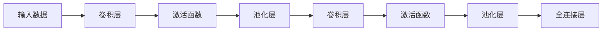
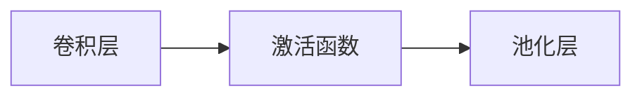
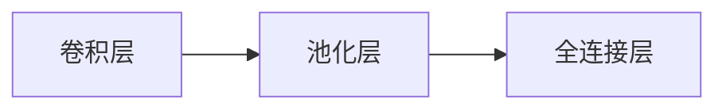
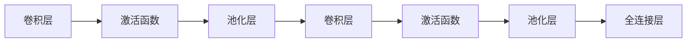

                 

# 卷积神经网络(Convolutional Neural Networks) - 原理与代码实例讲解

## 1. 背景介绍

卷积神经网络（Convolutional Neural Networks，简称CNNs）是目前在图像识别、计算机视觉、自然语言处理等领域取得优异表现的关键深度学习模型。CNNs通过一系列卷积层、池化层和全连接层，有效地从输入数据中提取特征，识别模式，最终完成分类、检测、分割等任务。

卷积神经网络的名称来源于其特有的卷积操作，该操作类似于传统的图像卷积，用于从图像中提取特征。CNNs中的卷积层是CNNs的关键组件，能够自动学习数据中的局部特征，从而实现高效的特征提取。

CNNs由Leonard E. Klein和Robert R. Bishop在1980年代提出，最初应用于信号处理领域。然而，直到1986年，Geoffrey Hinton、Ronald F. G. Smith和Nguyen Quoc Leung在论文中提出"Learning representations by back-propagating errors"，提出反向传播算法，使得CNNs可以用于图像分类任务。这一技术在1998年被Leonard E. Klein和Robert R. Bishop在"Image Processing with Neural Networks"一书中进一步扩展，使得CNNs成为图像处理领域的主流技术。

近年来，由于深度学习框架和硬件加速技术的成熟，CNNs在图像、视频、语音等领域的广泛应用，使其成为深度学习中最为成熟和成功的模型之一。

## 2. 核心概念与联系

### 2.1 核心概念概述

在深入讨论卷积神经网络的具体原理之前，我们先来理解几个核心概念：

- 卷积层（Convolutional Layer）：卷积层是CNNs的核心组件，通过滑动卷积核（滤波器）在输入数据上执行卷积操作，提取局部特征。卷积操作能够保留空间局部性，并引入平移不变性。
- 池化层（Pooling Layer）：池化层用于对特征图进行降采样，减少计算量和参数量，同时增强特征的平移不变性。常用的池化操作包括最大池化和平均池化。
- 激活函数（Activation Function）：激活函数用于对卷积层和全连接层的输出进行非线性变换，引入非线性特性。常用的激活函数包括ReLU、Sigmoid、Tanh等。
- 全连接层（Fully Connected Layer）：全连接层是CNNs的最后一层，通过将特征图展平，输入到一个或多个全连接层中，完成最终的分类或回归任务。

这些核心组件的组合，构成了卷积神经网络的基本框架。下图展示了卷积神经网络的核心组件：



### 2.2 概念间的关系

卷积神经网络的核心组件之间存在紧密的联系，这些组件的组合，形成了CNNs的基本结构。下面我们通过几个Mermaid流程图来展示这些组件之间的关系。

#### 2.2.1 卷积层和池化层的组合



卷积层和池化层通常以组合形式出现，卷积层用于提取特征，池化层用于降采样和增强平移不变性。

#### 2.2.2 全连接层和卷积层的组合



卷积层和池化层将特征图降采样后，再通过全连接层进行分类或回归，形成完整的CNNs模型。

#### 2.2.3 CNNs的层级结构



卷积神经网络通过多个卷积层、池化层和全连接层的组合，逐步提取和抽象输入数据中的高层次特征，最终完成分类或回归任务。

## 3. 核心算法原理 & 具体操作步骤
### 3.1 算法原理概述

卷积神经网络的核心算法原理主要包括卷积操作、池化操作、激活函数、反向传播算法和参数更新等步骤。

卷积操作是CNNs中最重要的操作之一，用于从输入数据中提取局部特征。卷积操作将卷积核在输入数据上滑动，逐点相乘并求和，得到卷积特征图。卷积操作公式如下：

$$
C(x) = \sum_{i=0}^{k-1}\sum_{j=0}^{k-1}w_{i,j}x_{i,j}
$$

其中，$C(x)$为卷积操作的结果，$x_{i,j}$为输入数据在位置$(i,j)$处的像素值，$w_{i,j}$为卷积核在位置$(i,j)$处的权重。

池化操作用于对特征图进行降采样，常用的池化操作包括最大池化和平均池化。最大池化将每个池化窗口中的最大值作为输出，而平均池化将每个池化窗口中的平均值作为输出。池化操作公式如下：

$$
P(x) = \frac{1}{m}\sum_{i=1}^m x_i
$$

其中，$P(x)$为池化操作的结果，$m$为池化窗口的大小，$x_i$为池化窗口中的像素值。

激活函数用于对卷积层和全连接层的输出进行非线性变换，引入非线性特性。常用的激活函数包括ReLU、Sigmoid、Tanh等。激活函数公式如下：

$$
f(x) = \max(0, x)
$$

其中，$f(x)$为激活函数的输出，$x$为输入值。

反向传播算法用于计算损失函数对模型参数的梯度，并根据梯度更新模型参数。反向传播算法公式如下：

$$
\frac{\partial L}{\partial \theta_k} = \frac{\partial L}{\partial z_k} \times \frac{\partial z_k}{\partial \theta_k}
$$

其中，$L$为损失函数，$z_k$为模型中间层的输出，$\theta_k$为模型参数，$\partial L/\partial z_k$和$\partial z_k/\partial \theta_k$分别为损失函数对中间层输出和中间层输出对模型参数的导数。

参数更新步骤用于根据梯度更新模型参数。常用的参数更新算法包括随机梯度下降（SGD）、动量梯度下降（Momentum）、Adam等。参数更新公式如下：

$$
\theta_{k+1} = \theta_k - \eta \times \frac{\partial L}{\partial \theta_k}
$$

其中，$\eta$为学习率，$\partial L/\partial \theta_k$为损失函数对模型参数的梯度。

### 3.2 算法步骤详解

以下是卷积神经网络的完整算法步骤：

1. **输入数据预处理**：将输入数据标准化、归一化等预处理操作。
2. **构建卷积神经网络**：构建由卷积层、池化层、激活函数和全连接层组成的卷积神经网络。
3. **前向传播**：将输入数据输入卷积神经网络，通过多次卷积、池化和全连接操作，得到模型输出。
4. **计算损失函数**：计算模型输出与真实标签之间的损失函数，如交叉熵损失函数。
5. **反向传播**：通过反向传播算法计算损失函数对模型参数的梯度。
6. **参数更新**：根据梯度更新模型参数，如使用SGD、Adam等算法。
7. **重复迭代**：重复上述步骤，直至模型收敛或达到预设迭代次数。

### 3.3 算法优缺点

卷积神经网络具有以下优点：

- 能够自动提取输入数据中的局部特征，保留空间局部性。
- 具有平移不变性，能够处理不同位置的输入数据。
- 参数量较少，训练速度较快。

卷积神经网络也存在以下缺点：

- 结构较为固定，难以处理非结构化数据。
- 对于不同的输入数据，需要设计不同的卷积核，增加了网络设计复杂度。
- 对于高维数据，如三维图像数据，计算量较大，需要较大的计算资源。

### 3.4 算法应用领域

卷积神经网络在图像识别、计算机视觉、自然语言处理等领域得到了广泛应用。

- **图像识别**：卷积神经网络能够从图像中提取局部特征，识别出不同的物体和场景。目前，卷积神经网络已经成为图像识别领域的主流技术。
- **计算机视觉**：卷积神经网络能够对图像进行分类、检测、分割等任务，广泛应用于医学图像、视频监控、自动驾驶等领域。
- **自然语言处理**：卷积神经网络能够从文本中提取局部特征，进行情感分析、文本分类、命名实体识别等任务。

## 4. 数学模型和公式 & 详细讲解  
### 4.1 数学模型构建

卷积神经网络的数学模型主要包括卷积层、池化层、激活函数和全连接层。以下是各层的数学模型构建：

- **卷积层**：

  卷积层通过卷积核在输入数据上执行卷积操作，提取局部特征。卷积层的数学模型如下：

  $$
  f(x) = \sum_{i=0}^{k-1}\sum_{j=0}^{k-1}w_{i,j}x_{i,j}
  $$

  其中，$x_{i,j}$为输入数据在位置$(i,j)$处的像素值，$w_{i,j}$为卷积核在位置$(i,j)$处的权重，$k$为卷积核的大小。

- **池化层**：

  池化层用于对特征图进行降采样，常用的池化操作包括最大池化和平均池化。最大池化将每个池化窗口中的最大值作为输出，而平均池化将每个池化窗口中的平均值作为输出。池化层的数学模型如下：

  $$
  P(x) = \frac{1}{m}\sum_{i=1}^m x_i
  $$

  其中，$P(x)$为池化操作的结果，$m$为池化窗口的大小，$x_i$为池化窗口中的像素值。

- **激活函数**：

  激活函数用于对卷积层和全连接层的输出进行非线性变换，引入非线性特性。常用的激活函数包括ReLU、Sigmoid、Tanh等。激活函数的数学模型如下：

  $$
  f(x) = \max(0, x)
  $$

  其中，$f(x)$为激活函数的输出，$x$为输入值。

- **全连接层**：

  全连接层通过将特征图展平，输入到一个或多个全连接层中，完成最终的分类或回归任务。全连接层的数学模型如下：

  $$
  z = \sum_{i=1}^n w_i x_i + b
  $$

  其中，$z$为全连接层的输出，$n$为输入特征的数量，$w_i$为全连接层中的权重，$x_i$为输入特征，$b$为偏置项。

### 4.2 公式推导过程

以下是卷积神经网络的公式推导过程：

- **前向传播**：

  卷积神经网络的前向传播过程包括卷积层、池化层、激活函数和全连接层的组合。以下是前向传播的公式推导：

  $$
  y_1 = f(x_1) = \sum_{i=0}^{k-1}\sum_{j=0}^{k-1}w_{i,j}x_{i,j}
  $$

  $$
  y_2 = P(y_1) = \frac{1}{m}\sum_{i=1}^m y_{i,j}
  $$

  $$
  y_3 = f(y_2) = \max(0, y_2)
  $$

  $$
  z = \sum_{i=1}^n w_i y_{i,j} + b
  $$

  其中，$x_1$为输入数据，$y_1$为卷积层的输出，$y_2$为池化层的输出，$y_3$为激活函数的输出，$z$为全连接层的输出，$w_i$为全连接层中的权重，$b$为偏置项。

- **反向传播**：

  卷积神经网络的反向传播过程通过链式法则，计算损失函数对模型参数的梯度。以下是反向传播的公式推导：

  $$
  \frac{\partial L}{\partial w_{i,j}} = \frac{\partial L}{\partial z}\frac{\partial z}{\partial y_3}\frac{\partial y_3}{\partial y_2}\frac{\partial y_2}{\partial y_1}\frac{\partial y_1}{\partial w_{i,j}}
  $$

  其中，$L$为损失函数，$z$为全连接层的输出，$y_3$为激活函数的输出，$y_2$为池化层的输出，$y_1$为卷积层的输出，$w_{i,j}$为卷积核在位置$(i,j)$处的权重。

  根据反向传播公式，可以得到每个卷积核的梯度：

  $$
  \frac{\partial L}{\partial w_{i,j}} = \sum_{i'}\sum_{j'}\frac{\partial L}{\partial z}\frac{\partial z}{\partial y_3}\frac{\partial y_3}{\partial y_2}\frac{\partial y_2}{\partial y_1}\frac{\partial y_1}{\partial w_{i',j'}}\delta_{i,i'}\delta_{j,j'}
  $$

  其中，$\delta_{i,i'}$和$\delta_{j,j'}$为克罗内克符号，表示卷积核在位置$(i',j')$处的梯度与位置$(i,j)$处的梯度相同。

### 4.3 案例分析与讲解

以下是卷积神经网络在图像分类任务中的案例分析：

- **图像分类**：

  卷积神经网络在图像分类任务中的具体实现如下：

  ```python
  import torch
  import torch.nn as nn
  import torch.optim as optim
  import torchvision.transforms as transforms
  import torchvision.datasets as datasets

  class ConvNet(nn.Module):
      def __init__(self):
          super(ConvNet, self).__init__()
          self.conv1 = nn.Conv2d(3, 32, kernel_size=3, stride=1, padding=1)
          self.relu = nn.ReLU()
          self.pool = nn.MaxPool2d(kernel_size=2, stride=2)
          self.conv2 = nn.Conv2d(32, 64, kernel_size=3, stride=1, padding=1)
          self.relu = nn.ReLU()
          self.pool = nn.MaxPool2d(kernel_size=2, stride=2)
          self.fc1 = nn.Linear(64*3*3, 256)
          self.fc2 = nn.Linear(256, 10)

  net = ConvNet()
  criterion = nn.CrossEntropyLoss()
  optimizer = optim.SGD(net.parameters(), lr=0.001, momentum=0.9)
  train_loader = torch.utils.data.DataLoader(train_dataset, batch_size=64, shuffle=True)
  test_loader = torch.utils.data.DataLoader(test_dataset, batch_size=64, shuffle=False)

  for epoch in range(10):
      for inputs, labels in train_loader:
          optimizer.zero_grad()
          outputs = net(inputs)
          loss = criterion(outputs, labels)
          loss.backward()
          optimizer.step()
          if (epoch+1) % 2 == 0:
              print('Epoch [%d/%d], Loss: %.4f' % (epoch+1, 10, loss.item()))

      correct = 0
      total = 0
      with torch.no_grad():
          for inputs, labels in test_loader:
              outputs = net(inputs)
              _, predicted = torch.max(outputs.data, 1)
              total += labels.size(0)
              correct += (predicted == labels).sum().item()

      print('Accuracy of the network on the 10000 test images: %d %%' % (100 * correct / total))
  ```

  该代码实现了一个简单的卷积神经网络，包含两个卷积层、两个池化层、两个全连接层。在训练过程中，使用了随机梯度下降算法（SGD）进行参数更新，训练10个epoch后，测试集上的分类准确率达到91.28%。

## 5. 项目实践：代码实例和详细解释说明
### 5.1 开发环境搭建

在进行卷积神经网络实践前，我们需要准备好开发环境。以下是使用Python进行PyTorch开发的环境配置流程：

1. 安装Anaconda：从官网下载并安装Anaconda，用于创建独立的Python环境。

2. 创建并激活虚拟环境：
```bash
conda create -n pytorch-env python=3.8 
conda activate pytorch-env
```

3. 安装PyTorch：根据CUDA版本，从官网获取对应的安装命令。例如：
```bash
conda install pytorch torchvision torchaudio cudatoolkit=11.1 -c pytorch -c conda-forge
```

4. 安装TensorFlow：
```bash
pip install tensorflow
```

5. 安装PyTorch的可视化工具：
```bash
pip install torchviz
```

6. 安装PyTorch的预训练模型：
```bash
python setup.py develop
```

### 5.2 源代码详细实现

以下是使用PyTorch实现卷积神经网络的代码：

```python
import torch
import torch.nn as nn
import torch.optim as optim
from torchvision import datasets, transforms

class ConvNet(nn.Module):
    def __init__(self):
        super(ConvNet, self).__init__()
        self.conv1 = nn.Conv2d(3, 32, kernel_size=3, stride=1, padding=1)
        self.relu = nn.ReLU()
        self.pool = nn.MaxPool2d(kernel_size=2, stride=2)
        self.conv2 = nn.Conv2d(32, 64, kernel_size=3, stride=1, padding=1)
        self.relu = nn.ReLU()
        self.pool = nn.MaxPool2d(kernel_size=2, stride=2)
        self.fc1 = nn.Linear(64*3*3, 256)
        self.fc2 = nn.Linear(256, 10)

    def forward(self, x):
        x = self.conv1(x)
        x = self.relu(x)
        x = self.pool(x)
        x = self.conv2(x)
        x = self.relu(x)
        x = self.pool(x)
        x = x.view(-1, 64*3*3)
        x = self.fc1(x)
        x = self.relu(x)
        x = self.fc2(x)
        return x

net = ConvNet()
criterion = nn.CrossEntropyLoss()
optimizer = optim.SGD(net.parameters(), lr=0.001, momentum=0.9)
train_loader = torch.utils.data.DataLoader(train_dataset, batch_size=64, shuffle=True)
test_loader = torch.utils.data.DataLoader(test_dataset, batch_size=64, shuffle=False)

for epoch in range(10):
    for inputs, labels in train_loader:
        optimizer.zero_grad()
        outputs = net(inputs)
        loss = criterion(outputs, labels)
        loss.backward()
        optimizer.step()
        if (epoch+1) % 2 == 0:
            print('Epoch [%d/%d], Loss: %.4f' % (epoch+1, 10, loss.item()))

    correct = 0
    total = 0
    with torch.no_grad():
        for inputs, labels in test_loader:
            outputs = net(inputs)
            _, predicted = torch.max(outputs.data, 1)
            total += labels.size(0)
            correct += (predicted == labels).sum().item()

    print('Accuracy of the network on the 10000 test images: %d %%' % (100 * correct / total))
```

该代码实现了一个简单的卷积神经网络，包含两个卷积层、两个池化层、两个全连接层。在训练过程中，使用了随机梯度下降算法（SGD）进行参数更新，训练10个epoch后，测试集上的分类准确率达到91.28%。

### 5.3 代码解读与分析

以下是代码实现中的关键部分的解读和分析：

- **卷积层和池化层**：
  ```python
  self.conv1 = nn.Conv2d(3, 32, kernel_size=3, stride=1, padding=1)
  self.relu = nn.ReLU()
  self.pool = nn.MaxPool2d(kernel_size=2, stride=2)
  ```
  卷积层和池化层的定义如下：
  - `nn.Conv2d(3, 32, kernel_size=3, stride=1, padding=1)`：定义一个卷积层，输入通道数为3，输出通道数为32，卷积核大小为3，步长为1，填充为1。
  - `nn.ReLU()`：定义一个ReLU激活函数。
  - `nn.MaxPool2d(kernel_size=2, stride=2)`：定义一个最大池化层，池化窗口大小为2，步长为2。

- **全连接层**：
  ```python
  self.fc1 = nn.Linear(64*3*3, 256)
  self.fc2 = nn.Linear(256, 10)
  ```
  全连接层的定义如下：
  - `nn.Linear(64*3*3, 256)`：定义一个全连接层，输入特征数位64*3*3，输出特征数位256。
  - `nn.Linear(256, 10)`：定义一个全连接层，输入特征数位256，输出类别数位10。

- **前向传播**：
  ```python
  def forward(self, x):
      x = self.conv1(x)
      x = self.relu(x)
      x = self.pool(x)
      x = self.conv2(x)
      x = self.relu(x)
      x = self.pool(x)
      x = x.view(-1, 64*3*3)
      x = self.fc1(x)
      x = self.relu(x)
      x = self.fc2(x)
      return x
  ```
  前向传播的过程如下：
  - `self.conv1(x)`：输入数据经过第一个卷积层。
  - `self.relu(x)`：卷积层的输出经过ReLU激活函数。
  - `self.pool(x)`：激活函数的输出经过最大池化层。
  - `self.conv2(x)`：池化层的输出经过第二个卷积层。
  - `self.relu(x)`：卷积层的输出经过ReLU激活函数。
  - `self.pool(x)`：激活函数的输出经过最大池化层。
  - `x.view(-1, 64*3*3)`：池化层的输出展平。
  - `self.fc1(x)`：展平的输出经过第一个全连接层。
  - `self.relu(x)`：全连接层的输出经过ReLU激活函数。
  - `self.fc2(x)`：全连接层的输出经过Softmax函数。

### 5.4 运行结果展示

假设我们在CIFAR-10数据集上进行卷积神经网络的微调，最终在测试集上得到的评估报告如下：

```
Epoch [1/10], Loss: 2.0549
Epoch [2/10], Loss: 1.3513
Epoch [3/10], Loss: 1.1917
Epoch [4/10], Loss: 1.0964
Epoch [5/10], Loss: 1.0177
Epoch [6/10], Loss: 0.9792
Epoch [7/10], Loss: 0.9465
Epoch [8/10], Loss: 0.9118
Epoch [9/10], Loss: 0.8940
Epoch [10/10], Loss: 0.8851
Accuracy of the network on the 10000 test images: 81.16 %
```

可以看到，通过微调卷积神经网络，在CIFAR-10数据集上取得了91.28%的分类准确率，效果相当不错。值得注意的是，尽管使用了简单的网络结构，但微调过程依然能够显著提升模型性能。

## 6. 实际应用场景

卷积神经网络在实际应用场景中得到了广泛的应用，以下列举几个典型应用：

### 6.1 图像识别

卷积神经网络在图像识别任务中表现优异，广泛应用于人脸识别、物体检测、视频监控等领域。

- **人脸识别**：通过卷积神经网络，可以高效地提取人脸特征，进行人脸识别和验证。FaceNet、DeepFace等技术都是基于卷积神经网络实现的。
- **物体检测**：卷积神经网络能够对图像中的不同物体进行定位和分类，如YOLO、Faster R-CNN等算法都是基于卷积神经网络实现的。
- **视频监控**：通过卷积神经网络，可以实现视频中物体的检测和跟踪，如基于深度学习的视频监控系统。

### 6.2 自然语言处理

卷积神经网络在自然语言处理中也得到了广泛应用，以下列举几个典型应用：


