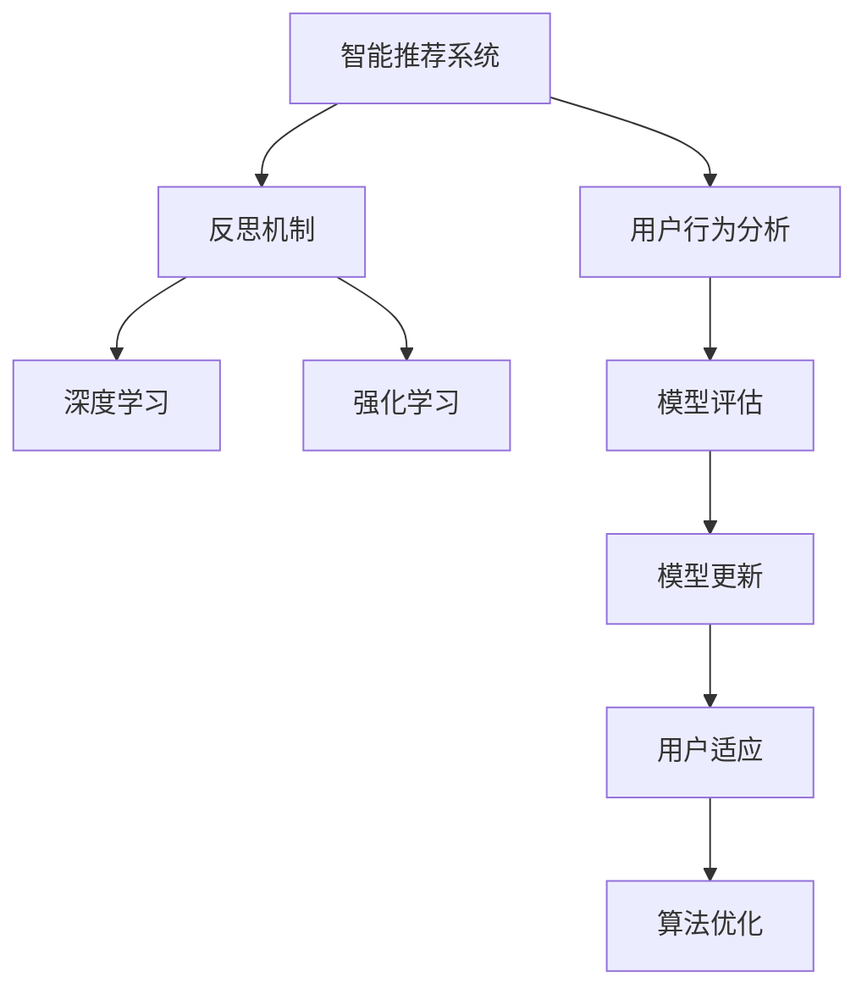
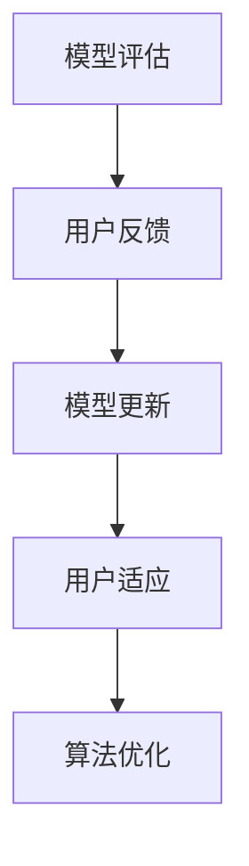
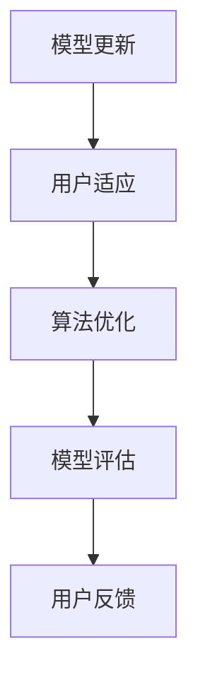
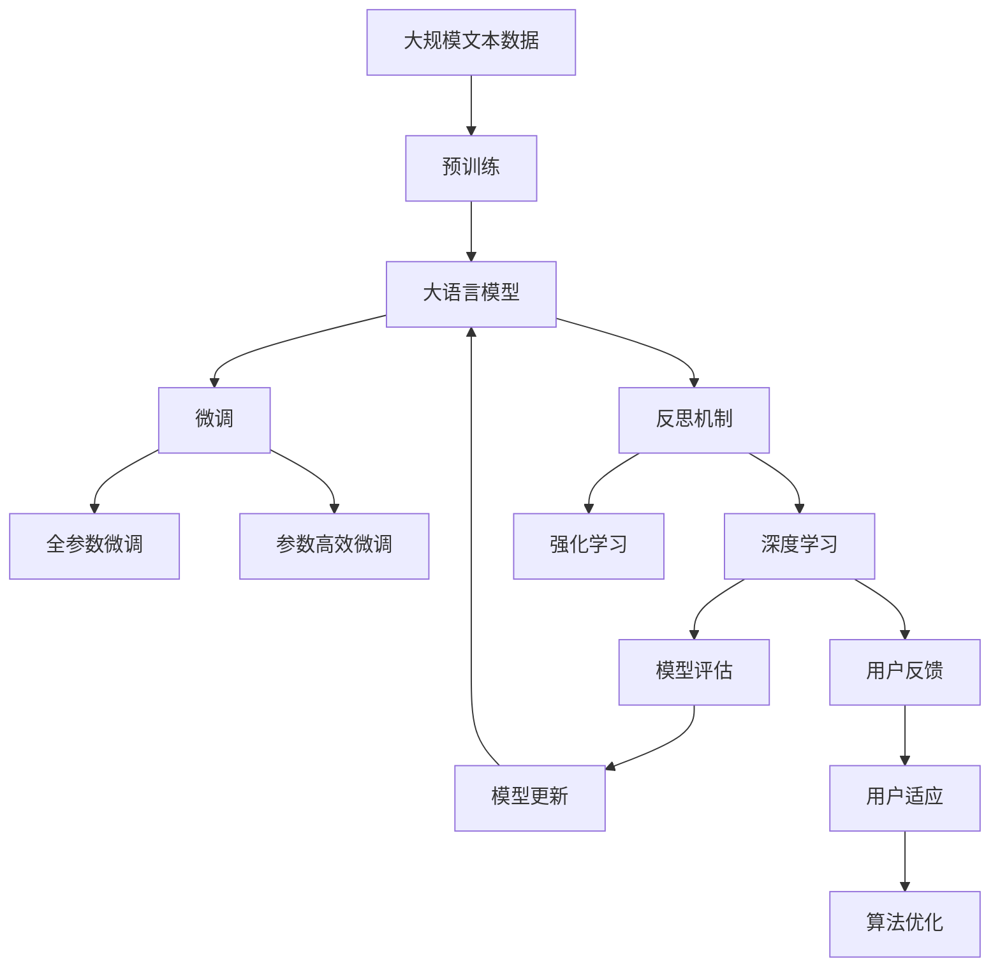

                 

# 反思机制在智能推荐系统中的应用

> 关键词：智能推荐系统,用户行为分析,反思机制,算法优化,深度学习,强化学习

## 1. 背景介绍

随着互联网技术的发展，智能推荐系统（Recommender Systems）已经成为驱动内容分发、电商销售、新闻阅读等场景的核心技术之一。它通过分析用户的浏览历史、点击行为、搜索记录等，提供个性化推荐，从而提升用户满意度并增加商业收益。然而，智能推荐系统在实际应用中也面临着一些问题，比如过度个性化导致的"信息茧房"现象，模型决策缺乏透明度和解释性等。为此，反思机制（Reflective Mechanism）被引入智能推荐系统，以解决这些问题并提升用户体验。

### 1.1 问题由来

当前智能推荐系统主要基于统计模型和深度学习模型进行个性化推荐。这些模型通过学习用户的历史行为数据，预测用户对不同物品的兴趣程度，并据此进行推荐。然而，这种方法存在以下问题：

1. **过度个性化**：模型过于关注用户已有的行为数据，忽视了用户未发现但可能感兴趣的物品。这种过度个性化可能导致信息茧房，使用户只能接触到相同类型的信息，无法发现新的兴趣点。
2. **缺乏透明度**：黑箱模型无法解释推荐结果的原因，使得用户难以理解推荐系统的工作机制，降低信任度。
3. **模型偏见**：模型可能学习到样本数据中的固有偏见，导致推荐结果的偏差。

反思机制的引入，旨在通过用户反馈和模型自适应调整，提升推荐系统的泛化能力、透明度和公平性。

### 1.2 问题核心关键点

反思机制的核心思想是：通过用户反馈（如点击、跳过、评分等），对模型进行动态调整，使推荐系统能够更好地适应用户的真实需求和兴趣变化。

具体来说，反思机制包含以下几个关键步骤：

1. **模型评估**：利用用户反馈评估模型的推荐质量。
2. **模型更新**：根据评估结果调整模型参数，使其更符合用户的真实需求。
3. **用户适应**：根据用户的反馈，动态调整推荐策略，使其更符合用户的兴趣和偏好。
4. **算法优化**：优化算法以提升反思机制的效率和效果。

这些步骤共同构成了一个闭环，使推荐系统能够不断学习用户的反馈，进行自我调整和优化。

### 1.3 问题研究意义

反思机制在智能推荐系统中的应用，对于提升用户体验、增强模型透明度和公平性具有重要意义：

1. **提升用户体验**：通过反思机制，推荐系统能够更好地满足用户的个性化需求，避免信息茧房，提升用户满意度。
2. **增强模型透明度**：反思机制提供了模型决策的透明化机制，使用户能够理解推荐系统的运作原理，增强信任感。
3. **提升模型公平性**：反思机制能够消除模型偏见，提升推荐系统的公平性和多样性，避免对特定群体的歧视。
4. **促进模型学习**：反思机制提供了动态调整机制，使模型能够更好地学习用户的真实需求和兴趣变化，提升推荐效果。
5. **优化资源使用**：反思机制能够优化模型训练和推理的资源使用，提升系统的效率。

## 2. 核心概念与联系

### 2.1 核心概念概述

为更好地理解反思机制在智能推荐系统中的应用，本节将介绍几个密切相关的核心概念：

- **智能推荐系统（Recommender Systems）**：通过分析用户行为数据，提供个性化推荐的系统，广泛应用于电商、新闻、视频等领域。
- **用户行为分析（User Behavior Analysis）**：利用用户的历史行为数据，预测用户的兴趣和需求，为其推荐相关内容。
- **反思机制（Reflective Mechanism）**：通过用户反馈对推荐系统进行动态调整，提升模型的泛化能力和公平性。
- **算法优化（Algorithm Optimization）**：提升反思机制的效率和效果，使其能够在实际应用中发挥最大效用。
- **深度学习（Deep Learning）**：基于神经网络的推荐系统，通过多层结构学习用户行为的高级特征。
- **强化学习（Reinforcement Learning）**：通过奖励信号优化推荐策略，使推荐系统能够不断学习用户反馈。

这些核心概念之间的逻辑关系可以通过以下Mermaid流程图来展示：



这个流程图展示了几大核心概念之间的联系：

1. 智能推荐系统通过用户行为分析进行个性化推荐。
2. 反思机制对推荐系统进行动态调整，提升模型的泛化能力和公平性。
3. 深度学习和强化学习是常用的推荐系统算法，通过动态调整提升推荐效果。

### 2.2 概念间的关系

这些核心概念之间存在着紧密的联系，形成了智能推荐系统的完整生态系统。下面我们通过几个Mermaid流程图来展示这些概念之间的关系。

#### 2.2.1 智能推荐系统的学习范式


这个流程图展示了智能推荐系统的学习范式，即通过用户行为数据进行模型训练，利用用户反馈进行模型评估和更新，不断优化推荐策略。

#### 2.2.2 反思机制与模型评估的关系



这个流程图展示了反思机制的核心流程，即通过用户反馈进行模型评估，根据评估结果进行模型更新，并动态调整推荐策略和优化算法。

#### 2.2.3 算法优化方法



这个流程图展示了算法优化的方法，即通过用户适应进行推荐策略优化，并利用算法优化提升反思机制的效率和效果。

### 2.3 核心概念的整体架构

最后，我们用一个综合的流程图来展示这些核心概念在大语言模型微调过程中的整体架构：



这个综合流程图展示了从预训练到微调，再到反思机制的完整过程。大语言模型首先在大规模文本数据上进行预训练，然后通过微调获得针对特定任务的优化模型。反射机制在微调过程中引入用户反馈，动态调整模型和推荐策略，优化算法，从而提升推荐系统的性能和透明度。通过这些流程图，我们可以更清晰地理解反思机制在大语言模型微调中的作用和流程。

## 3. 核心算法原理 & 具体操作步骤
### 3.1 算法原理概述

反思机制的核心算法原理是动态调整模型参数，以适应用户的行为反馈。其基本思路是：

1. **用户行为数据收集**：通过用户点击、浏览、评分等行为数据，收集用户对不同物品的反馈信息。
2. **模型评估**：利用用户反馈评估模型的推荐质量，包括点击率、转化率、评分等指标。
3. **模型更新**：根据评估结果调整模型参数，优化推荐效果。
4. **用户适应**：动态调整推荐策略，使推荐系统更好地适应用户的兴趣和需求。

这一过程通常使用深度学习模型和强化学习算法实现。具体来说，深度学习模型通过学习用户行为数据，预测用户对不同物品的兴趣；强化学习算法通过用户反馈优化推荐策略，使推荐系统能够不断学习用户行为变化。

### 3.2 算法步骤详解

反思机制的具体操作步骤如下：

1. **数据收集**：通过用户行为数据收集模块，获取用户对不同物品的点击、浏览、评分等行为数据。

2. **模型评估**：利用收集到的行为数据，计算模型的评估指标，如点击率、转化率、评分等。常用的评估指标包括：
   - 点击率（CTR）：用户点击推荐物品的比例。
   - 转化率（CVR）：用户点击后实际购买的比例。
   - 评分（Rating）：用户对推荐物品的评分，用于衡量物品的相关性和满意度。

3. **模型更新**：根据评估指标，调整模型参数，优化推荐效果。常用的调整方法包括：
   - 梯度下降（Gradient Descent）：通过反向传播算法，计算参数梯度，并根据学习率更新参数。
   - 自适应学习率（Adaptive Learning Rate）：动态调整学习率，根据模型表现优化参数更新。
   - 正则化（Regularization）：防止过拟合，提升模型的泛化能力。

4. **用户适应**：根据用户反馈，动态调整推荐策略。常用的适应方法包括：
   - 协同过滤（Collaborative Filtering）：通过分析用户历史行为，推荐相似用户的推荐物品。
   - 基于内容的推荐（Content-Based Recommendation）：根据物品属性和用户兴趣，推荐相关物品。
   - 混合推荐（Hybrid Recommendation）：结合协同过滤和基于内容的推荐，提升推荐效果。

5. **算法优化**：优化算法以提升反思机制的效率和效果。常用的优化方法包括：
   - 在线学习（Online Learning）：实时更新模型参数，适应用户行为变化。
   - 增量学习（Incremental Learning）：逐批次更新模型，避免大规模模型参数更新带来的计算压力。
   - 分布式训练（Distributed Training）：利用多台机器并行训练，提升训练效率。

### 3.3 算法优缺点

反思机制在智能推荐系统中的应用具有以下优点：

1. **提升推荐效果**：通过用户反馈动态调整模型参数，提升推荐系统的泛化能力和效果。
2. **增强模型透明度**：利用用户反馈进行模型评估和更新，使推荐系统更加透明，增强用户信任感。
3. **消除模型偏见**：通过动态调整，消除模型在样本数据中的固有偏见，提升推荐系统的公平性和多样性。

同时，反思机制也存在一些缺点：

1. **计算复杂度较高**：每次用户反馈都需要重新训练模型，计算复杂度较高，可能影响实时性。
2. **数据隐私问题**：用户反馈数据可能包含隐私信息，需要特别注意数据保护。
3. **用户适应性不足**：用户适应算法需要大量用户行为数据，难以快速适应用户兴趣变化。

### 3.4 算法应用领域

反思机制在智能推荐系统中的应用非常广泛，主要应用于以下领域：

1. **电商推荐系统**：通过用户浏览记录、购买历史等数据，提供个性化推荐，提升用户购买转化率。
2. **新闻推荐系统**：利用用户阅读记录、点击行为，推荐相关新闻，提升用户阅读体验。
3. **视频推荐系统**：根据用户观看历史、评分数据，推荐相关视频，提升用户观看时间和满意度。
4. **社交网络推荐系统**：通过用户点赞、评论等行为，推荐相关内容，提升社交互动质量。
5. **金融推荐系统**：利用用户投资记录、交易行为，推荐相关金融产品，提升投资收益。

除了上述这些领域外，反思机制还可以应用于更多场景，如在线教育、健康医疗等，提升用户互动和学习效果。

## 4. 数学模型和公式 & 详细讲解  
### 4.1 数学模型构建

本节将使用数学语言对反思机制在智能推荐系统中的应用进行更加严格的刻画。

记智能推荐系统为 $R_{\theta}$，其中 $\theta$ 为模型参数。假设用户行为数据集为 $D=\{(x_i,y_i)\}_{i=1}^N$，$x_i$ 表示用户行为数据，$y_i$ 表示推荐物品的标签。定义模型 $R_{\theta}$ 在数据样本 $(x,y)$ 上的损失函数为 $\ell(R_{\theta}(x),y)$，则在数据集 $D$ 上的经验风险为：

$$
\mathcal{L}(\theta) = \frac{1}{N} \sum_{i=1}^N \ell(R_{\theta}(x_i),y_i)
$$

反思机制的核心目标是最小化经验风险，即找到最优参数：

$$
\theta^* = \mathop{\arg\min}_{\theta} \mathcal{L}(\theta)
$$

在实际应用中，我们通常使用基于梯度的优化算法（如SGD、Adam等）来近似求解上述最优化问题。设 $\eta$ 为学习率，$\lambda$ 为正则化系数，则参数的更新公式为：

$$
\theta \leftarrow \theta - \eta \nabla_{\theta}\mathcal{L}(\theta) - \eta\lambda\theta
$$

其中 $\nabla_{\theta}\mathcal{L}(\theta)$ 为损失函数对参数 $\theta$ 的梯度，可通过反向传播算法高效计算。

### 4.2 公式推导过程

以下我们以点击率（CTR）预测为例，推导模型评估和更新公式。

假设模型 $R_{\theta}$ 在输入 $x$ 上的输出为 $\hat{y}=R_{\theta}(x)$，表示用户点击物品的概率。真实标签 $y \in \{0,1\}$。则二分类交叉熵损失函数定义为：

$$
\ell(R_{\theta}(x),y) = -[y\log \hat{y} + (1-y)\log(1-\hat{y})]
$$

将其代入经验风险公式，得：

$$
\mathcal{L}(\theta) = -\frac{1}{N}\sum_{i=1}^N [y_i\log R_{\theta}(x_i)+(1-y_i)\log(1-R_{\theta}(x_i))]
$$

根据链式法则，损失函数对参数 $\theta_k$ 的梯度为：

$$
\frac{\partial \mathcal{L}(\theta)}{\partial \theta_k} = -\frac{1}{N}\sum_{i=1}^N (\frac{y_i}{R_{\theta}(x_i)}-\frac{1-y_i}{1-R_{\theta}(x_i)}) \frac{\partial R_{\theta}(x_i)}{\partial \theta_k}
$$

其中 $\frac{\partial R_{\theta}(x_i)}{\partial \theta_k}$ 可进一步递归展开，利用自动微分技术完成计算。

在得到损失函数的梯度后，即可带入参数更新公式，完成模型的迭代优化。重复上述过程直至收敛，最终得到适应用户行为的最佳模型参数 $\theta^*$。

## 5. 项目实践：代码实例和详细解释说明
### 5.1 开发环境搭建

在进行反思机制实践前，我们需要准备好开发环境。以下是使用Python进行TensorFlow开发的环境配置流程：

1. 安装Anaconda：从官网下载并安装Anaconda，用于创建独立的Python环境。

2. 创建并激活虚拟环境：
```bash
conda create -n tensorflow-env python=3.8 
conda activate tensorflow-env
```

3. 安装TensorFlow：根据CUDA版本，从官网获取对应的安装命令。例如：
```bash
conda install tensorflow tensorflow-gpu=2.7.0 -c tensorflow -c conda-forge
```

4. 安装TensorBoard：用于可视化模型训练和评估过程。
```bash
pip install tensorboard
```

5. 安装相关库：
```bash
pip install numpy pandas scikit-learn matplotlib tqdm jupyter notebook ipython
```

完成上述步骤后，即可在`tensorflow-env`环境中开始反思机制的实践。

### 5.2 源代码详细实现

下面我以点击率预测为例，给出使用TensorFlow进行反思机制的PyTorch代码实现。

首先，定义模型和数据处理函数：

```python
import tensorflow as tf
from tensorflow.keras.layers import Dense, Dropout, Input
from tensorflow.keras.models import Model
from tensorflow.keras.optimizers import Adam

# 定义模型
def build_model(input_dim):
    input_layer = Input(shape=(input_dim,))
    x = Dense(64, activation='relu')(input_layer)
    x = Dropout(0.5)(x)
    output_layer = Dense(1, activation='sigmoid')(x)
    model = Model(inputs=input_layer, outputs=output_layer)
    return model

# 定义数据处理函数
def preprocess_data(data):
    X = data[:, :-1]
    y = data[:, -1]
    return X, y
```

然后，定义用户行为数据集：

```python
# 假设数据集为Numpy数组，每行表示一条用户行为记录，包含用户行为特征和点击标签
data = np.random.rand(1000, 10)
labels = np.random.randint(0, 2, size=(1000, 1))

X_train, y_train = preprocess_data(data)
```

接着，构建模型并进行训练：

```python
# 定义模型参数
input_dim = X_train.shape[1]

# 构建模型
model = build_model(input_dim)

# 定义优化器和损失函数
optimizer = Adam(learning_rate=0.001)
loss_fn = tf.keras.losses.BinaryCrossentropy()

# 定义训练过程
def train_step(x, y):
    with tf.GradientTape() as tape:
        y_pred = model(x)
        loss = loss_fn(y, y_pred)
    grads = tape.gradient(loss, model.trainable_variables)
    optimizer.apply_gradients(zip(grads, model.trainable_variables))
    return loss

# 训练模型
model.compile(optimizer=optimizer, loss=loss_fn)
model.fit(X_train, y_train, epochs=10, batch_size=32, callbacks=[tf.keras.callbacks.EarlyStopping(patience=2)])
```

最后，计算模型在测试集上的点击率：

```python
# 定义测试集
X_test = np.random.rand(100, 10)
y_test = np.random.randint(0, 2, size=(100, 1))

# 计算模型在测试集上的点击率
y_pred = model.predict(X_test)
click_rate = y_pred.mean()

print(f"Click rate: {click_rate:.2f}")
```

以上就是使用TensorFlow进行反思机制的完整代码实现。可以看到，TensorFlow提供了丰富的API和工具，使得模型训练和优化变得非常方便。

### 5.3 代码解读与分析

让我们再详细解读一下关键代码的实现细节：

**模型定义**：
- 定义一个简单的DNN模型，包含一个输入层、一个隐藏层和一个输出层。
- 隐藏层使用ReLU激活函数和Dropout正则化，防止过拟合。
- 输出层使用Sigmoid激活函数，输出0-1之间的概率值，用于预测点击率。

**数据预处理**：
- 定义一个数据处理函数，将用户行为数据分割为特征和标签。
- 使用Numpy生成随机数据集，作为训练和测试数据。

**模型训练**：
- 使用Adam优化器进行模型训练，设置学习率为0.001。
- 使用BinaryCrossentropy损失函数，适用于二分类任务。
- 定义一个自定义训练函数，使用TensorFlow的GradientTape记录梯度，并使用optimizer.apply_gradients更新模型参数。
- 训练模型10个epoch，设置早停策略以避免过拟合。

**测试和评估**：
- 使用测试集计算模型在实际数据上的点击率，并输出结果。

可以看到，TensorFlow提供了丰富的API和工具，使得模型训练和优化变得非常方便。在实际应用中，我们还可以使用TensorBoard进行模型可视化，进一步优化模型结构和学习率等参数。

## 6. 实际应用场景
### 6.1 智能客服系统

基于反思机制的智能推荐系统可以广泛应用于智能客服系统的构建。传统客服往往需要配备大量人力，高峰期响应缓慢，且一致性和专业性难以保证。使用反思机制对客服系统进行动态优化，可以大幅提升客户咨询体验和问题解决效率。

在技术实现上，可以收集企业内部的历史客服对话记录，将问题和最佳答复构建成监督数据，在此基础上对预训练对话模型进行微调。反思机制可以实时监测用户反馈，动态调整模型参数和推荐策略，使客服系统能够不断学习用户的真实需求和兴趣变化，提供更加个性化和高效的客服服务。

### 6.2 金融舆情监测

金融机构需要实时监测市场舆论动向，以便及时应对负面信息传播，规避金融风险。使用反思机制对舆情监测系统进行动态优化，可以实时捕捉和分析用户反馈，提升舆情监测的准确性和时效性。

在技术实现上，可以收集金融领域相关的新闻、报道、评论等文本数据，并对其进行主题标注和情感标注。在此基础上对预训练语言模型进行微调，使其能够自动判断文本属于何种主题，情感倾向是正面、中性还是负面。反思机制可以实时监测用户反馈，动态调整模型参数和推荐策略，使舆情监测系统能够不断学习新的舆情变化趋势，避免遗漏重要信息。

### 6.3 个性化推荐系统

当前的推荐系统往往只依赖用户的历史行为数据进行物品推荐，无法深入理解用户的真实兴趣偏好。使用反思机制对推荐系统进行动态优化，可以更好地挖掘用户行为背后的语义信息，从而提供更精准、多样的推荐内容。

在技术实现上，可以收集用户浏览、点击、评论、分享等行为数据，提取和用户交互的物品标题、描述、标签等文本内容。将文本内容作为模型输入，用户的后续行为（如是否点击、购买等）作为监督信号，在此基础上微调预训练语言模型。反思机制可以实时监测用户反馈，动态调整模型参数和推荐策略，使推荐系统能够不断学习用户的真实需求和兴趣变化，提供更加个性化和多样化的推荐结果。

### 6.4 未来应用展望

随着反思机制的不断发展，其在智能推荐系统中的应用也将不断拓展，为更多领域带来变革性影响。

在智慧医疗领域，基于反思机制的医疗推荐系统可以提升诊疗质量和患者满意度，辅助医生诊疗，加速新药开发进程。

在智能教育领域，反思机制可以帮助个性化推荐系统更好地挖掘学生兴趣和能力，提供更具针对性的学习资源和建议。

在智慧城市治理中，反思机制可以实时监测和分析市民反馈，优化城市管理和公共服务，提升市民生活质量。

此外，在企业生产、社会治理、文娱传媒等众多领域，基于反思机制的智能推荐系统也将不断涌现，为各行各业带来新的应用场景和价值提升。

## 7. 工具和资源推荐
### 7.1 学习资源推荐

为了帮助开发者系统掌握反思机制在智能推荐系统中的应用，这里推荐一些优质的学习资源：

1. 《深度学习与推荐系统》系列书籍：详细讲解了深度学习在推荐系统中的应用，包括模型评估、优化算法等。

2. CS344《推荐系统》课程：斯坦福大学开设的推荐系统课程，涵盖推荐系统的基本概念、算法和优化方法。

3. 《强化学习与推荐系统》书籍：深入讲解了强化学习在推荐系统中的应用，包括动态调整、模型优化等。

4. 《推荐系统》官方文档：GitHub上的推荐系统开源项目，提供丰富的资源和样例代码，是学习反思机制的重要参考。

5. Kaggle推荐系统竞赛：Kaggle上的推荐系统竞赛，可以实际练习反思机制的应用，并对比不同算法的效果。

通过对这些资源的学习实践，相信你一定能够快速掌握反思机制在智能推荐系统中的应用，并用于解决实际的推荐问题。

### 7.2 开发工具推荐

高效的开发离不开优秀的工具支持。以下是几款用于反思机制开发和优化的常用工具：

1. TensorFlow：基于Python的开源深度学习框架，提供了丰富的API和工具，支持分布式训练和模型可视化。

2. TensorBoard：TensorFlow配套的可视化工具，可以实时监测模型训练状态，提供丰富的图表呈现方式。

3. PyTorch：基于Python的开源深度学习框架，提供了灵活的动态计算图，适合快速迭代研究。

4. Jupyter Notebook：交互式编程环境，支持代码编写、数据处理和结果展示，非常适合科学研究。

5. Scikit-learn：Python的数据科学库，提供了丰富的机器学习算法和数据预处理工具，适合模型训练和评估。

6. OpenAI Codex：基于大模型的代码生成工具，可以自动生成高质量的代码片段，辅助开发者快速实现反思机制。

合理利用这些工具，可以显著提升反思机制的开发效率，加快创新迭代的步伐。

### 7.3 相关论文推荐

反思机制在智能推荐系统中的应用源于学界的持续研究。以下是几篇奠基性的相关论文，推荐阅读：

1. "Click-Through Rate Prediction and Its Application in Recommendation System"：提出基于深度学习的点击率预测模型，通过反思机制动态调整模型参数。

2. "Recommender System A/B Testing in the Real World"：介绍如何在实际应用中通过A/B测试优化推荐策略，提升用户体验。

3. "A Survey on Hybrid Recommender Systems"：综述了混合推荐系统的发展历程和应用案例，介绍了各种反思机制的实现方法。

4. "Learning from Crowd Annotations via Reflective Training"：通过反思机制学习用户反馈，优化推荐系统，提升推荐效果和公平性。

5. "Deep Reinforcement Learning for Recommender Systems"：将强化学习引入推荐系统，通过用户反馈动态调整推荐策略，提升推荐效果。

这些论文代表了大模型微调技术的发展脉络。通过学习这些前沿成果，

