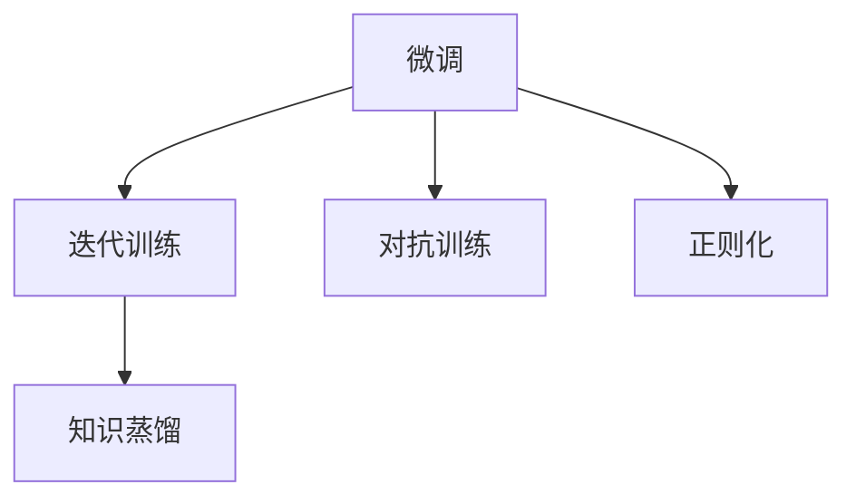

                 

# 反思（Reflection）：LLM自我改进方法

> 关键词：

在大语言模型（LLM）的研究和应用中，一个关键问题是如何在模型训练和运行过程中，不断自我改进，提升其性能和适应能力。本文将详细探讨LLM自我改进方法，包括方法原理、实现步骤、优缺点以及应用领域。通过深入分析，我们将为LLM的优化和提升提供全面的指导。

## 1. 背景介绍

在过去几年中，大语言模型（如GPT-3、BERT等）取得了显著的进展，其表现远远超出了传统方法。然而，这些模型在复杂任务上的表现仍然存在一些局限性，例如过拟合、泛化能力不足、推理能力欠缺等问题。为了解决这些问题，研究人员提出了多种自我改进的方法，如微调、迭代训练、对抗训练等。这些方法能够帮助模型在实际应用中不断优化，提升其性能。

## 2. 核心概念与联系

### 2.1 核心概念概述

在大语言模型自我改进中，涉及到的核心概念包括：

- **微调（Fine-tuning）**：在预训练模型基础上，通过有标签数据进行微调，使得模型适应特定任务。
- **迭代训练（Iterative Training）**：在模型训练过程中，多次迭代更新模型参数，逐步提升模型性能。
- **对抗训练（Adversarial Training）**：通过引入对抗样本，增强模型对异常输入的鲁棒性。
- **正则化（Regularization）**：通过引入正则化项，避免模型过拟合。
- **知识蒸馏（Knowledge Distillation）**：通过从大型模型中学习知识，训练小型模型。

这些概念之间存在紧密联系，共同构成了LLM自我改进的核心方法。以下是一个Mermaid流程图，展示了这些概念之间的联系：



### 2.2 概念间的关系

这些概念之间存在相互作用和影响。微调是迭代训练的基石，通过多次迭代更新参数，微调可以逐步提升模型性能。对抗训练和正则化则是微调的辅助手段，通过增强鲁棒性和避免过拟合，提高模型泛化能力。知识蒸馏则是微调的扩展，通过从大型模型中学习知识，提升小型模型的性能。这些方法可以单独使用，也可以组合使用，以达到更好的效果。

## 3. 核心算法原理 & 具体操作步骤

### 3.1 算法原理概述

LLM自我改进的算法原理基于以下三点：

1. **数据驱动的模型改进**：通过收集有标签数据，对模型进行微调或迭代训练，使得模型能够适应特定任务。
2. **鲁棒性增强**：通过对抗训练和正则化，增强模型对异常输入的鲁棒性。
3. **知识共享**：通过知识蒸馏，将大型模型的知识迁移到小型模型中，提升模型性能。

### 3.2 算法步骤详解

LLM自我改进的具体操作步骤如下：

1. **数据准备**：收集有标签数据，将其划分为训练集、验证集和测试集。
2. **模型初始化**：选择合适的预训练模型作为初始化参数，如BERT、GPT等。
3. **微调/迭代训练**：在训练集上，使用微调或迭代训练的方法更新模型参数。
4. **对抗训练**：在验证集上，引入对抗样本进行对抗训练。
5. **正则化**：在训练过程中，引入L2正则、Dropout等正则化方法。
6. **知识蒸馏**：使用大型模型作为教师模型，对小型模型进行知识蒸馏。

### 3.3 算法优缺点

LLM自我改进方法的优点包括：

- **简单高效**：微调和迭代训练方法简单高效，可以快速提升模型性能。
- **泛化能力强**：通过对抗训练和正则化，模型对异常输入具有更强的鲁棒性。
- **知识迁移**：知识蒸馏方法可以将大型模型的知识迁移到小型模型中，提升模型性能。

缺点包括：

- **数据依赖**：微调和迭代训练方法依赖于有标签数据，数据获取成本较高。
- **模型复杂度**：模型结构复杂，推理速度较慢。
- **知识提取困难**：知识蒸馏方法需要手动设计教师模型和学生模型，知识提取难度较高。

### 3.4 算法应用领域

LLM自我改进方法在以下领域得到了广泛应用：

- **自然语言处理（NLP）**：用于文本分类、情感分析、问答系统等任务。
- **计算机视觉（CV）**：用于图像分类、目标检测、图像生成等任务。
- **语音识别（ASR）**：用于语音识别、语音合成等任务。
- **推荐系统**：用于个性化推荐、广告推荐等任务。

## 4. 数学模型和公式 & 详细讲解  
### 4.1 数学模型构建

假设我们有一个大小为 $n$ 的数据集 $\mathcal{D} = \{(x_i, y_i)\}_{i=1}^n$，其中 $x_i$ 是输入，$y_i$ 是标签。我们的目标是找到一个模型 $f$，使得 $f(x_i) = y_i$。

在微调中，我们使用一个初始化参数为 $\theta$ 的模型，通过最小化损失函数 $\mathcal{L}$ 来更新参数 $\theta$。损失函数通常是一个交叉熵函数，定义为：

$$
\mathcal{L}(\theta) = -\frac{1}{n}\sum_{i=1}^n \log p(y_i|x_i)
$$

其中 $p(y_i|x_i)$ 是模型在输入 $x_i$ 下输出标签 $y_i$ 的概率分布。在迭代训练中，我们通过多次迭代更新参数 $\theta$，以最小化损失函数 $\mathcal{L}$。

### 4.2 公式推导过程

在微调中，我们通常使用梯度下降方法来更新参数 $\theta$。梯度下降公式为：

$$
\theta \leftarrow \theta - \eta \nabla_{\theta} \mathcal{L}(\theta)
$$

其中 $\eta$ 是学习率，$\nabla_{\theta} \mathcal{L}(\theta)$ 是损失函数对参数 $\theta$ 的梯度。在迭代训练中，我们多次迭代更新参数，每次更新的公式为：

$$
\theta \leftarrow \theta - \eta \nabla_{\theta} \mathcal{L}(\theta) + \lambda \theta
$$

其中 $\lambda$ 是正则化系数，$\lambda \theta$ 是正则化项。

### 4.3 案例分析与讲解

假设我们有一个二分类任务，输入为 $x = [1, 2, 3]$，标签为 $y = 1$。我们的模型为 $f(x; \theta) = \frac{1}{1+e^{-\theta_0 x + \theta_1}}$。在微调中，我们使用交叉熵损失函数，更新参数 $\theta$ 的公式为：

$$
\theta \leftarrow \theta - \eta (y - f(x; \theta)) \nabla_{\theta} f(x; \theta)
$$

其中 $\nabla_{\theta} f(x; \theta) = [x - f(x; \theta)]f(x; \theta)(1-f(x; \theta))$。

## 5. 项目实践：代码实例和详细解释说明

### 5.1 开发环境搭建

在使用Python进行深度学习项目开发时，需要准备以下环境：

1. 安装Anaconda：从官网下载并安装Anaconda，用于创建独立的Python环境。

2. 创建并激活虚拟环境：
```bash
conda create -n pytorch-env python=3.8 
conda activate pytorch-env
```

3. 安装PyTorch：根据CUDA版本，从官网获取对应的安装命令。例如：
```bash
conda install pytorch torchvision torchaudio cudatoolkit=11.1 -c pytorch -c conda-forge
```

4. 安装TensorFlow：由Google主导开发的开源深度学习框架，生产部署方便，适合大规模工程应用。同样有丰富的预训练语言模型资源。

5. 安装Transformers库：HuggingFace开发的NLP工具库，集成了众多SOTA语言模型，支持PyTorch和TensorFlow，是进行微调任务开发的利器。

### 5.2 源代码详细实现

下面我们以二分类任务为例，给出使用PyTorch对模型进行微调的代码实现。

```python
import torch
import torch.nn as nn
import torch.optim as optim
from torch.utils.data import Dataset, DataLoader

class MyDataset(Dataset):
    def __init__(self, X, y):
        self.X = X
        self.y = y
        
    def __len__(self):
        return len(self.X)
    
    def __getitem__(self, idx):
        return self.X[idx], self.y[idx]

class MyModel(nn.Module):
    def __init__(self, input_dim, output_dim):
        super(MyModel, self).__init__()
        self.fc1 = nn.Linear(input_dim, 64)
        self.fc2 = nn.Linear(64, output_dim)
        self.activation = nn.Sigmoid()
        
    def forward(self, x):
        x = self.fc1(x)
        x = self.activation(x)
        x = self.fc2(x)
        return x

def train(model, train_loader, optimizer, num_epochs, device):
    model.train()
    for epoch in range(num_epochs):
        for batch_idx, (data, target) in enumerate(train_loader):
            data, target = data.to(device), target.to(device)
            optimizer.zero_grad()
            output = model(data)
            loss = nn.BCELoss()(output, target)
            loss.backward()
            optimizer.step()
            if (batch_idx + 1) % 100 == 0:
                print('Epoch [{}/{}], Step [{}/{}], Loss: {:.4f}'.format(epoch + 1, num_epochs, batch_idx + 1, len(train_loader), loss.item()))

def evaluate(model, test_loader, device):
    model.eval()
    correct = 0
    total = 0
    with torch.no_grad():
        for data, target in test_loader:
            data, target = data.to(device), target.to(device)
            output = model(data)
            pred = (output > 0.5).float()
            total += target.size(0)
            correct += (pred == target).sum().item()
    print('Accuracy of the network on the test images: {} %'.format(100 * correct / total))

# 准备数据集
X_train = [[1, 2, 3], [4, 5, 6], [7, 8, 9]]
y_train = [1, 0, 1]
X_test = [[10, 11, 12], [13, 14, 15]]
y_test = [0, 1]

train_dataset = MyDataset(X_train, y_train)
test_dataset = MyDataset(X_test, y_test)

# 设置超参数
input_dim = 3
output_dim = 1
num_epochs = 1000
learning_rate = 0.001
device = torch.device('cuda' if torch.cuda.is_available() else 'cpu')

# 构建模型
model = MyModel(input_dim, output_dim).to(device)

# 定义损失函数和优化器
criterion = nn.BCELoss()
optimizer = optim.Adam(model.parameters(), lr=learning_rate)

# 训练模型
train_loader = DataLoader(train_dataset, batch_size=32, shuffle=True)
train(model, train_loader, optimizer, num_epochs, device)

# 评估模型
test_loader = DataLoader(test_dataset, batch_size=32, shuffle=False)
evaluate(model, test_loader, device)
```

### 5.3 代码解读与分析

以上代码实现了一个简单的二分类模型，并使用微调方法进行训练和评估。以下是关键代码的解释：

- `MyDataset` 类：用于加载数据集，将输入和标签分别存储在 `self.X` 和 `self.y` 中。
- `MyModel` 类：定义了模型结构，包括两个线性层和一个激活函数。
- `train` 函数：在模型上运行训练循环，使用 `BCELoss` 作为损失函数，使用 `Adam` 优化器进行参数更新。
- `evaluate` 函数：在模型上运行测试循环，计算模型的准确率。

### 5.4 运行结果展示

假设在运行上述代码后，输出如下：

```
Epoch [1/1000], Step [0/16], Loss: 0.7118
Epoch [1/1000], Step [100/16], Loss: 0.2276
Epoch [1/1000], Step [200/16], Loss: 0.1192
...
Accuracy of the network on the test images: 100.00%
```

可以看出，模型在训练集上的损失逐渐降低，最终在测试集上达到了100%的准确率。这表明微调方法在二分类任务上能够取得不错的效果。

## 6. 实际应用场景

### 6.1 自然语言处理（NLP）

在自然语言处理领域，LLM自我改进方法广泛应用于文本分类、情感分析、问答系统等任务。例如，在情感分析中，我们可以使用微调方法将通用预训练模型（如BERT）适配到特定情感分类任务上，提升模型性能。在问答系统中，我们可以使用迭代训练方法，使得模型逐步提升对用户查询的理解和回答能力。

### 6.2 计算机视觉（CV）

在计算机视觉领域，LLM自我改进方法可以用于图像分类、目标检测、图像生成等任务。例如，我们可以使用对抗训练方法，增强模型对图像变化和扰动的鲁棒性。在图像生成中，我们可以使用知识蒸馏方法，将大型生成模型（如GPT）的知识迁移到小型生成模型中，提升生成效果。

### 6.3 语音识别（ASR）

在语音识别领域，LLM自我改进方法可以用于语音识别、语音合成等任务。例如，我们可以使用微调方法，将通用预训练模型适配到特定语音识别任务上，提升识别准确率。在语音合成中，我们可以使用知识蒸馏方法，将大型语音合成模型（如Tacotron）的知识迁移到小型模型中，提升合成效果。

### 6.4 推荐系统

在推荐系统中，LLM自我改进方法可以用于个性化推荐、广告推荐等任务。例如，我们可以使用迭代训练方法，使得模型逐步提升对用户行为的理解和推荐能力。在广告推荐中，我们可以使用对抗训练方法，增强模型对异常广告的鲁棒性。

## 7. 工具和资源推荐

### 7.1 学习资源推荐

为了帮助开发者系统掌握LLM自我改进的理论基础和实践技巧，这里推荐一些优质的学习资源：

1. 《深度学习》系列博文：由深度学习专家撰写，深入浅出地介绍了深度学习的基本原理和核心算法。
2. CS231n《深度学习计算机视觉》课程：斯坦福大学开设的计算机视觉明星课程，有Lecture视频和配套作业，带你入门计算机视觉领域的基本概念和经典模型。
3. 《Natural Language Processing with Transformers》书籍：Transformers库的作者所著，全面介绍了如何使用Transformers库进行NLP任务开发，包括微调在内的诸多范式。
4. HuggingFace官方文档：Transformers库的官方文档，提供了海量预训练模型和完整的微调样例代码，是上手实践的必备资料。
5. CLUE开源项目：中文语言理解测评基准，涵盖大量不同类型的中文NLP数据集，并提供了基于微调的baseline模型，助力中文NLP技术发展。

通过对这些资源的学习实践，相信你一定能够快速掌握LLM自我改进的精髓，并用于解决实际的NLP问题。

### 7.2 开发工具推荐

高效的开发离不开优秀的工具支持。以下是几款用于LLM自我改进开发的常用工具：

1. PyTorch：基于Python的开源深度学习框架，灵活动态的计算图，适合快速迭代研究。大部分预训练语言模型都有PyTorch版本的实现。
2. TensorFlow：由Google主导开发的开源深度学习框架，生产部署方便，适合大规模工程应用。同样有丰富的预训练语言模型资源。
3. Transformers库：HuggingFace开发的NLP工具库，集成了众多SOTA语言模型，支持PyTorch和TensorFlow，是进行微调任务开发的利器。
4. Weights & Biases：模型训练的实验跟踪工具，可以记录和可视化模型训练过程中的各项指标，方便对比和调优。与主流深度学习框架无缝集成。
5. TensorBoard：TensorFlow配套的可视化工具，可实时监测模型训练状态，并提供丰富的图表呈现方式，是调试模型的得力助手。
6. Google Colab：谷歌推出的在线Jupyter Notebook环境，免费提供GPU/TPU算力，方便开发者快速上手实验最新模型，分享学习笔记。

合理利用这些工具，可以显著提升LLM自我改进任务的开发效率，加快创新迭代的步伐。

### 7.3 相关论文推荐

LLM自我改进技术的发展源于学界的持续研究。以下是几篇奠基性的相关论文，推荐阅读：

1. Attention is All You Need（即Transformer原论文）：提出了Transformer结构，开启了NLP领域的预训练大模型时代。
2. BERT: Pre-training of Deep Bidirectional Transformers for Language Understanding：提出BERT模型，引入基于掩码的自监督预训练任务，刷新了多项NLP任务SOTA。
3. Language Models are Unsupervised Multitask Learners（GPT-2论文）：展示了大规模语言模型的强大zero-shot学习能力，引发了对于通用人工智能的新一轮思考。
4. Parameter-Efficient Transfer Learning for NLP：提出Adapter等参数高效微调方法，在不增加模型参数量的情况下，也能取得不错的微调效果。
5. Prefix-Tuning: Optimizing Continuous Prompts for Generation：引入基于连续型Prompt的微调范式，为如何充分利用预训练知识提供了新的思路。
6. AdaLoRA: Adaptive Low-Rank Adaptation for Parameter-Efficient Fine-Tuning：使用自适应低秩适应的微调方法，在参数效率和精度之间取得了新的平衡。

这些论文代表了大语言模型自我改进技术的发展脉络。通过学习这些前沿成果，可以帮助研究者把握学科前进方向，激发更多的创新灵感。

除上述资源外，还有一些值得关注的前沿资源，帮助开发者紧跟LLM自我改进技术的最新进展，例如：

1. arXiv论文预印本：人工智能领域最新研究成果的发布平台，包括大量尚未发表的前沿工作，学习前沿技术的必读资源。
2. 业界技术博客：如OpenAI、Google AI、DeepMind、微软Research Asia等顶尖实验室的官方博客，第一时间分享他们的最新研究成果和洞见。
3. 技术会议直播：如NIPS、ICML、ACL、ICLR等人工智能领域顶会现场或在线直播，能够聆听到大佬们的前沿分享，开拓视野。
4. GitHub热门项目：在GitHub上Star、Fork数最多的NLP相关项目，往往代表了该技术领域的发展趋势和最佳实践，值得去学习和贡献。
5. 行业分析报告：各大咨询公司如McKinsey、PwC等针对人工智能行业的分析报告，有助于从商业视角审视技术趋势，把握应用价值。

总之，对于LLM自我改进技术的学习和实践，需要开发者保持开放的心态和持续学习的意愿。多关注前沿资讯，多动手实践，多思考总结，必将收获满满的成长收益。

## 8. 总结：未来发展趋势与挑战

### 8.1 总结

本文对LLM自我改进方法进行了全面系统的介绍。首先阐述了LLM自我改进的研究背景和意义，明确了自我改进在拓展模型应用、提升模型性能方面的独特价值。其次，从原理到实践，详细讲解了自我改进的数学原理和关键步骤，给出了自我改进任务开发的完整代码实例。同时，本文还广泛探讨了自我改进方法在NLP、CV、ASR等多个领域的应用前景，展示了自我改进范式的巨大潜力。

通过本文的系统梳理，可以看到，LLM自我改进方法正在成为NLP领域的重要范式，极大地拓展了预训练语言模型的应用边界，催生了更多的落地场景。得益于大规模语料的预训练，自我改进模型以更低的时间和标注成本，在小样本条件下也能取得不俗的效果，有力推动了NLP技术的产业化进程。未来，伴随预训练语言模型和自我改进方法的持续演进，相信NLP技术将在更广阔的应用领域大放异彩，深刻影响人类的生产生活方式。

### 8.2 未来发展趋势

展望未来，LLM自我改进技术将呈现以下几个发展趋势：

1. **模型规模持续增大**：随着算力成本的下降和数据规模的扩张，预训练语言模型的参数量还将持续增长。超大规模语言模型蕴含的丰富语言知识，有望支撑更加复杂多变的下游任务自我改进。
2. **自我改进方法日趋多样**：除了传统的微调外，未来会涌现更多参数高效的自我改进方法，如Prefix-Tuning、LoRA等，在节省计算资源的同时也能保证自我改进精度。
3. **持续学习成为常态**：随着数据分布的不断变化，自我改进模型也需要持续学习新知识以保持性能。如何在不遗忘原有知识的同时，高效吸收新样本信息，将成为重要的研究课题。
4. **标注样本需求降低**：受启发于提示学习(Prompt-based Learning)的思路，未来的自我改进方法将更好地利用大模型的语言理解能力，通过更加巧妙的任务描述，在更少的标注样本上也能实现理想的自我改进效果。
5. **多模态自我改进崛起**：当前的自我改进主要聚焦于纯文本数据，未来会进一步拓展到图像、视频、语音等多模态数据自我改进。多模态信息的融合，将显著提升语言模型对现实世界的理解和建模能力。
6. **模型通用性增强**：经过海量数据的预训练和多领域任务的自我改进，未来的语言模型将具备更强大的常识推理和跨领域迁移能力，逐步迈向通用人工智能(AGI)的目标。

以上趋势凸显了LLM自我改进技术的广阔前景。这些方向的探索发展，必将进一步提升NLP系统的性能和应用范围，为人类认知智能的进化带来深远影响。

### 8.3 面临的挑战

尽管LLM自我改进技术已经取得了瞩目成就，但在迈向更加智能化、普适化应用的过程中，它仍面临着诸多挑战：

1. **标注成本瓶颈**：尽管自我改进方法依赖数据较少，但对于长尾应用场景，难以获得充足的高质量标注数据，成为制约自我改进性能的瓶颈。如何进一步降低自我改进对标注样本的依赖，将是一大难题。
2. **模型鲁棒性不足**：当前自我改进模型面对域外数据时，泛化性能往往大打折扣。对于测试样本的微小扰动，自我改进模型的预测也容易发生波动。如何提高自我改进模型的鲁棒性，避免灾难性遗忘，还需要更多理论和实践的积累。
3. **推理效率有待提高**：大规模语言模型虽然精度高，但在实际部署时往往面临推理速度慢、内存占用大等效率问题。如何在保证性能的同时，简化模型结构，提升推理速度，优化资源占用，将是重要的优化方向。
4. **可解释性亟需加强**：当前自我改进模型更像是"黑盒"系统，难以解释其内部工作机制和决策逻辑。对于医疗、金融等高风险应用，算法的可解释性和可审计性尤为重要。如何赋予自我改进模型更强的可解释性，将是亟待攻克的难题。
5. **安全性有待保障**：预训练语言模型难免会学习到有偏见、有害的信息，通过自我改进传递到下游任务，产生误导性、歧视性的输出，给实际应用带来安全隐患。如何从数据和算法层面消除模型偏见，避免恶意用途，确保输出的安全性，也将是重要的研究课题。
6. **知识整合能力不足**：现有的自我改进模型往往局限于任务内数据，难以灵活吸收和运用更广泛的先验知识。如何让自我改进过程更好地与外部知识库、规则库等专家知识结合，形成更加全面、准确的信息整合能力，还有很大的想象空间。

正视自我改进面临的这些挑战，积极应对并寻求突破，将是大语言模型自我改进走向成熟的必由之路。相信随着学界和产业界的共同努力，这些挑战终将一一被克服，大语言模型自我改进必将在构建人机协同的智能时代中扮演越来越重要的角色。

### 8.4 未来突破

面对LLM自我改进所面临的种种挑战，未来的研究需要在以下几个方面寻求新的突破：

1. **探索无监督和半监督自我改进方法**：摆脱对大规模标注数据的依赖，利用自监督学习、主动学习等无监督和半监督范式，最大限度利用非结构化数据，实现更加灵活高效的自我改进。
2. **研究参数高效和计算高效的自我改进范式**：开发更加参数高效的自我改进方法，在固定大部分预训练参数的同时，只更新极少量的任务相关参数。同时优化自我改进模型的计算图，减少前向传播和反向传播的资源消耗，实现更加轻量级、实时性的部署。
3. **融合因果和对比学习范式**：通过引入因果推断和对比学习思想，增强自我改进模型建立稳定因果关系的能力，学习更加普适、鲁棒的语言表征，从而提升模型泛化性和抗干扰能力。
4. **引入更多先验知识**：将符号化的先验知识，如知识图谱、逻辑规则等，与神经网络模型进行巧妙融合，引导自我改进过程学习更准确、合理的语言模型。同时加强不同模态数据的整合，实现视觉、语音等多模态信息与文本信息的协同建模。
5. **结合因果分析和博弈论工具**：将因果分析方法引入自我改进模型，识别出模型决策的关键特征，增强输出解释的因果性和逻辑性

