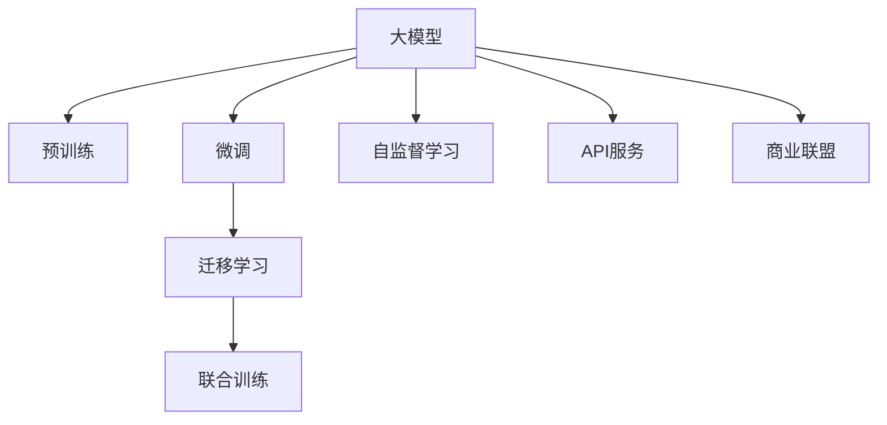

                 

# 商业模式：大模型创业的战略蓝图

大模型（如GPT-3、BERT等）作为近年来人工智能领域的重大突破，正引发一场技术和商业模式的革命。凭借其强大的泛化能力和丰富语义知识，大模型在自然语言处理（NLP）、计算机视觉、语音识别等多个领域展现出巨大的商业潜力。然而，如何在大模型上开展商业活动，构建盈利模式，使其真正落地应用，是每个创业者和从业者必须面对的战略问题。本文将从商业模式的角度，系统阐述大模型创业的战略蓝图，通过理论框架和实践案例的详细分析，为有志于大模型领域创业的朋友们提供全方位的指导。

## 1. 背景介绍

### 1.1 问题由来
随着深度学习技术的成熟，大模型在各个领域展现出了卓越的性能。比如，GPT-3在自然语言生成、问答、文本摘要等方面表现出色，BERT则在文本分类、命名实体识别、情感分析等任务上屡创佳绩。然而，这些大模型大多由互联网巨头公司研发和控制，初创公司难以直接获得，加之使用成本高昂，使得许多创业公司难以直接进入这一领域。

创业公司要想在大模型领域有所作为，必须探索新的商业模式，以较低的成本实现大模型的使用和开发。本文将围绕大模型创业的商业逻辑展开讨论，介绍几种常见且有效的商业模式，并分析其优势与局限，为读者提供全面的视角。

## 2. 核心概念与联系

### 2.1 核心概念概述

为更好地理解大模型创业的商业模式，本文将介绍几个密切相关的核心概念：

- **大模型（Large Model）**：以深度神经网络为代表的，具有数亿甚至数十亿参数的大规模预训练模型。如GPT-3、BERT、RoBERTa等。

- **微调（Fine-tuning）**：在预训练模型基础上，利用少量标注数据进行有监督学习，使其适应特定任务的过程。微调能够显著提升模型在特定任务上的性能，并且可以大幅降低数据需求和计算成本。

- **迁移学习（Transfer Learning）**：利用已学习任务的模型，对新任务进行微调或修改，以提高在新任务上的表现。大模型可以作为迁移学习的基础。

- **预训练（Pre-training）**：使用大规模无标签数据对模型进行预训练，使其具备广泛的语言或视觉理解能力。预训练是大模型技术的重要环节。

- **自监督学习（Self-supervised Learning）**：通过构建一些无监督学习任务（如语言建模、掩码语言模型）来训练模型，使其学习语言的规律和语义。

- **联合训练（Co-training）**：同时训练多个模型，每个模型专注于特定任务，通过相互间的信息共享提升整体性能。

- **API服务（API Service）**：通过暴露API接口，让外部用户可以方便地调用和使用大模型服务。

- **商业联盟（Business Alliance）**：与大模型提供商或其他公司建立合作关系，共享资源和技术，提升商业价值。

这些概念之间存在着紧密的联系，共同构成了大模型创业的商业模式基础。以下Mermaid流程图展示了这些核心概念之间的关系：



### 2.2 概念间的关系

这些核心概念之间的关系可以总结为以下几点：

- 大模型通过预训练和自监督学习获得泛化能力。
- 微调和迁移学习用于适应特定任务，提升模型表现。
- API服务和大模型结合，实现商业化部署。
- 商业联盟和大模型提供商合作，共享技术和资源。

## 3. 核心算法原理 & 具体操作步骤

### 3.1 算法原理概述

大模型创业的商业模式，本质上是一种技术驱动的生态商业模式。其核心在于通过构建高效的大模型使用平台，提供模型微调、API服务等增值服务，实现商业价值的最大化。以下是大模型创业商业模式的主要算法原理：

1. **模型选择与适配**：根据任务需求，选择合适的预训练模型，并通过微调和迁移学习，将其适配到特定应用场景。

2. **API服务**：通过构建API接口，使大模型可以方便地被外部用户调用，提供定制化的服务。

3. **商业联盟**：与大模型提供商和其他相关公司建立合作，共享资源和技术，形成协同效应。

4. **服务收费**：根据模型调用量、服务质量等因素，制定合理的收费标准，实现盈利。

### 3.2 算法步骤详解

大模型创业的商业模式步骤包括以下几个关键步骤：

**Step 1: 平台搭建**
- 建立大模型API接口，方便外部用户调用。
- 选择合适的预训练模型，通过微调和迁移学习适配任务。

**Step 2: 商业合作**
- 与大模型提供商和相关公司建立合作关系，共享数据和技术。
- 探索联合训练和合作开发，提升整体性能。

**Step 3: 用户引入**
- 通过市场营销，吸引用户使用API服务。
- 提供免费试用和定制化服务，增加用户黏性。

**Step 4: 收入生成**
- 根据模型调用量和服务质量，制定合理的收费策略。
- 提供订阅制、按需付费等灵活的收费方式。

**Step 5: 持续优化**
- 收集用户反馈，持续优化模型和服务。
- 引入新的大模型和算法，提升服务质量。

### 3.3 算法优缺点

大模型创业的商业模式具有以下优点：

1. **低门槛**：通过API服务，用户可以低成本使用大模型，降低了创业门槛。
2. **高灵活性**：可以根据需求选择和微调大模型，适应性强。
3. **高收益**：通过增值服务，可以获得较高的附加价值。

然而，也存在一些缺点：

1. **数据依赖**：大模型的性能很大程度上依赖于高质量的数据，获取数据的成本较高。
2. **技术复杂性**：搭建和维护大模型API服务需要较高的技术门槛。
3. **市场竞争**：与其他大模型服务提供商竞争激烈，需要持续创新。

### 3.4 算法应用领域

大模型创业的商业模式在多个领域都有应用，以下是几个典型场景：

- **智能客服**：利用大模型进行自然语言理解，提供智能客服解决方案。
- **金融风控**：通过大模型进行文本分类、情感分析等，提高金融风险评估的准确性。
- **医疗健康**：利用大模型进行疾病诊断、药物研发等，提升医疗服务质量。
- **教育培训**：通过大模型进行智能推荐、自动批改等，提高教育培训的效率和效果。

## 4. 数学模型和公式 & 详细讲解 & 举例说明

### 4.1 数学模型构建

假设有一个大模型 $M$，其参数为 $\theta$。对于任务 $T$，其标注数据集为 $D=\{(x_i, y_i)\}_{i=1}^N$，其中 $x_i$ 为输入，$y_i$ 为标签。大模型创业的数学模型可以表示为：

$$
\mathcal{L}(\theta) = \frac{1}{N}\sum_{i=1}^N \ell(M(x_i), y_i)
$$

其中 $\ell$ 为损失函数，$\ell$ 可以根据具体任务选择。比如，对于文本分类任务，可以采用交叉熵损失。

### 4.2 公式推导过程

对于文本分类任务，假设模型的输出为 $p(y_i|x_i)$，真实标签为 $y_i$，则交叉熵损失为：

$$
\ell(M(x_i), y_i) = -y_i\log p(y_i|x_i) - (1-y_i)\log (1-p(y_i|x_i))
$$

将交叉熵损失代入总损失函数：

$$
\mathcal{L}(\theta) = -\frac{1}{N}\sum_{i=1}^N [y_i\log p(y_i|x_i) + (1-y_i)\log (1-p(y_i|x_i))]
$$

通过反向传播算法，求得模型参数 $\theta$ 的梯度：

$$
\frac{\partial \mathcal{L}(\theta)}{\partial \theta} = -\frac{1}{N}\sum_{i=1}^N (\frac{y_i}{p(y_i|x_i)}-\frac{1-y_i}{1-p(y_i|x_i)}) \frac{\partial p(y_i|x_i)}{\partial \theta}
$$

其中 $\frac{\partial p(y_i|x_i)}{\partial \theta}$ 可通过自动微分技术得到。

### 4.3 案例分析与讲解

假设有一个文本分类任务，输入为一段新闻文本，输出为新闻分类标签。可以选择BERT模型作为预训练模型，在少量标注数据上进行微调。通过API服务，用户可以调用微调后的模型，进行新闻分类。

## 5. 项目实践：代码实例和详细解释说明

### 5.1 开发环境搭建

开发大模型创业的API服务，需要安装Python和相关依赖，例如TensorFlow、Flask等。

```bash
conda create -n tf_env python=3.8
conda activate tf_env
pip install tensorflow flask
```

### 5.2 源代码详细实现

以下是一个简单的Flask应用程序，用于暴露API接口，调用微调后的BERT模型进行文本分类。

```python
from transformers import TFBertForSequenceClassification, TFBertTokenizer
import tensorflow as tf
import flask

app = flask.Flask(__name__)

# 加载预训练模型和tokenizer
model = TFBertForSequenceClassification.from_pretrained('bert-base-uncased', num_labels=2)
tokenizer = TFBertTokenizer.from_pretrained('bert-base-uncased')

@app.route('/predict', methods=['POST'])
def predict():
    data = request.json['input']
    tokens = tokenizer.encode(data, max_length=512, truncation=True, padding='max_length')
    input_ids = tf.convert_to_tensor(tokens)
    logits = model(input_ids)[0]
    probs = tf.nn.softmax(logits, axis=1).numpy()[0]
    label = probs.argmax()
    return {'label': label}

if __name__ == '__main__':
    app.run(debug=True)
```

### 5.3 代码解读与分析

在上述代码中，通过Flask创建了一个API服务，接收POST请求，将输入文本转化为token，调用微调后的BERT模型进行预测，最后返回分类标签。该API服务可以通过Restful风格的方式被外部调用。

### 5.4 运行结果展示

假设输入文本为 "The stock market is going up"，可以通过API调用预测其分类标签。运行上述代码后，可以访问 `http://localhost:5000/predict` 进行测试，得到预测结果。

## 6. 实际应用场景

### 6.1 智能客服

大模型创业的API服务可以应用于智能客服系统，利用大模型进行自然语言理解，自动回答用户问题。例如，某客服系统可以通过API调用微调后的模型，处理用户咨询，提供24小时在线服务。

### 6.2 金融风控

利用大模型进行情感分析和文本分类，提高金融风险评估的准确性。例如，某金融公司可以通过API调用微调后的模型，对客户评论进行情感分析，及时发现负面舆情。

### 6.3 医疗健康

利用大模型进行疾病诊断、药物研发等，提高医疗服务质量。例如，某医疗平台可以通过API调用微调后的模型，进行疾病诊断，提升诊断准确性。

### 6.4 教育培训

利用大模型进行智能推荐、自动批改等，提高教育培训的效率和效果。例如，某在线教育平台可以通过API调用微调后的模型，推荐学习资源，进行作业批改。

## 7. 工具和资源推荐

### 7.1 学习资源推荐

为了帮助开发者系统掌握大模型创业的理论基础和实践技巧，以下是一些优质的学习资源：

1. **TensorFlow官方文档**：提供了详尽的TensorFlow教程和API文档，适合初学者和进阶开发者。
2. **Flask官方文档**：提供了Flask的教程和API指南，适合Web应用开发者。
3. **Transformers库**：提供了多种预训练模型和微调工具，适合NLP应用开发者。
4. **Kaggle**：提供了丰富的机器学习和NLP竞赛数据集，适合数据科学家和机器学习爱好者。

### 7.2 开发工具推荐

大模型创业的开发离不开优秀的工具支持。以下是几款常用的开发工具：

1. **Jupyter Notebook**：提供了交互式的编程环境，适合数据科学和机器学习开发者。
2. **GitHub**：提供了代码托管和版本控制服务，适合团队协作和代码共享。
3. **AWS SageMaker**：提供了云端机器学习平台，支持多种深度学习框架和模型。
4. **Google Colab**：提供了免费使用GPU/TPU算力的在线Jupyter Notebook环境，适合快速实验和学习。

### 7.3 相关论文推荐

大模型创业的商业模式需要不断创新和优化。以下是几篇相关论文，推荐阅读：

1. **"Large-Scale Transformers for Named Entity Recognition on Chinese Characters"**：介绍了利用BERT模型进行中文命名实体识别的方法，适合中文NLP应用开发者。
2. **"Transfer Learning with Fine-Grained Model Zoo for Customer Service"**：介绍了利用Transformer模型进行智能客服的应用，适合客服系统开发者。
3. **"Transformers: State-of-the-Art Machine Translation with Continuous Text Generation"**：介绍了利用Transformer模型进行机器翻译的方法，适合自然语言处理应用开发者。

## 8. 总结：未来发展趋势与挑战

### 8.1 研究成果总结

大模型创业的商业模式，通过API服务和大模型结合，为中小企业提供了低门槛、高效、灵活的AI解决方案。其在自然语言处理、智能客服、金融风控、医疗健康、教育培训等领域展现了巨大的商业潜力。

### 8.2 未来发展趋势

未来大模型创业的商业模式将呈现以下几个发展趋势：

1. **智能化升级**：随着技术的发展，大模型将更加智能化，能够提供更准确、更高效的服务。
2. **平台化运营**：通过API服务，构建统一的平台，提供更多增值服务，提升用户体验。
3. **跨领域应用**：大模型创业的商业模式将进一步拓展到更多领域，如金融、医疗、教育等。

### 8.3 面临的挑战

尽管大模型创业的商业模式具有诸多优势，但也面临一些挑战：

1. **数据隐私**：大模型需要大量数据进行训练和微调，如何保护用户隐私，是一个重要的挑战。
2. **算法透明性**：大模型作为"黑盒"系统，缺乏透明性，用户难以理解其内部工作机制。
3. **市场竞争**：与其他大模型服务提供商竞争激烈，需要持续创新。
4. **资源需求**：大模型需要高计算能力和存储空间，如何优化资源使用，是一个重要的研究方向。

### 8.4 研究展望

未来大模型创业的商业模式需要在以下几个方面进行深入研究：

1. **隐私保护**：引入差分隐私、联邦学习等技术，保护用户数据隐私。
2. **算法透明性**：引入可解释性算法，提升算法的透明性和可信度。
3. **资源优化**：利用模型压缩、混合精度训练等技术，优化资源使用，提升服务性能。
4. **跨领域融合**：将大模型与其他AI技术进行深度融合，提升整体应用价值。

## 9. 附录：常见问题与解答

**Q1：大模型创业的商业模式是否适用于所有应用场景？**

A: 大模型创业的商业模式适用于许多应用场景，特别是那些需要快速部署、灵活调整的场景。但对于一些特定的领域，如医疗、金融等，需要更高的数据隐私保护和模型透明性，可能需要对商业模式进行适当调整。

**Q2：如何保护用户数据隐私？**

A: 保护用户数据隐私是大模型创业中必须面对的挑战。可以采用差分隐私、联邦学习等技术，确保数据隐私不被泄露。同时，采用数据脱敏、访问控制等措施，保护用户数据安全。

**Q3：大模型的计算需求是否过高？**

A: 大模型的计算需求确实较高，通常需要GPU或TPU等高性能设备。可以通过模型压缩、混合精度训练等技术，优化模型资源使用，提高服务性能。同时，也可以探索边缘计算等分布式计算方式，降低计算成本。

**Q4：大模型创业的商业模式是否容易受到市场竞争影响？**

A: 大模型创业的商业模式确实容易受到市场竞争的影响。需要在产品和技术上持续创新，提升竞争力。同时，建立稳固的商业联盟，通过合作提升整体市场份额。

通过本文的详细阐述和分析，我们希望为大模型创业的企业提供系统的战略蓝图和实践指导。在未来的发展中，大模型创业将面临更多挑战，但只要我们持续创新、不断优化，必将在大模型领域取得更多的成功。

