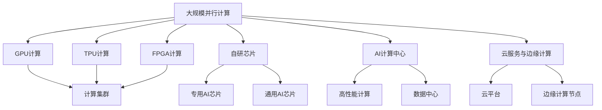

                 

# 商汤绝影的算力储备与未来规划

## 1. 背景介绍

### 1.1 问题由来
随着深度学习技术在各个领域的广泛应用，算力成为了人工智能发展的重要瓶颈之一。商汤科技作为全球领先的人工智能公司，近年来在算力储备和未来规划方面进行了深入的布局，力图在AI技术的快速发展中占据领先地位。本文将详细介绍商汤绝影的算力储备与未来规划，探讨其背后技术和战略意义，为业界同仁提供参考。

### 1.2 问题核心关键点
商汤绝影的算力储备与未来规划主要聚焦于以下几个关键点：
1. **大规模并行计算资源**：商汤采用了多种并行计算技术，如GPU、TPU、FPGA等，建立了大规模的分布式计算集群。
2. **异构计算融合**：商汤正在探索将CPU、GPU、TPU等多种硬件加速器结合，提升计算效率和性能。
3. **自研芯片设计**：商汤启动了自研芯片项目，包括专用AI芯片和通用芯片，旨在提升计算性能和能效比。
4. **AI计算中心建设**：商汤在多个城市建设了AI计算中心，提供高性能计算服务。
5. **云服务与边缘计算**：商汤推出了云端与边缘计算服务，支持大规模分布式训练和推理。

### 1.3 问题研究意义
商汤绝影的算力储备与未来规划对于商汤科技及其未来的发展具有重大意义：
1. **增强竞争力**：强大的算力储备有助于商汤在AI算法和应用开发上获得优势，提升市场竞争力。
2. **加速AI落地**：高效率的算力资源支持，使得商汤能够更快地将AI技术应用于实际业务场景。
3. **推动行业标准**：商汤在算力基础设施方面的探索和创新，有望推动AI计算标准的制定和完善。
4. **促进协作创新**：商汤的算力平台为研究者提供了一个强大的计算环境，促进跨领域、跨学科的创新合作。

## 2. 核心概念与联系

### 2.1 核心概念概述
为了更好地理解商汤绝影的算力储备与未来规划，我们将介绍几个关键概念：

- **大规模并行计算**：通过使用多台计算机同时进行计算，提高处理大规模数据和复杂任务的能力。
- **异构计算**：使用不同类型（如CPU、GPU、TPU等）的计算硬件，协同工作以提高整体性能。
- **自研芯片设计**：商汤自主设计和开发专用或通用的AI芯片，以优化计算性能和降低成本。
- **AI计算中心**：提供高性能计算资源的集中管理和服务。
- **云服务与边缘计算**：通过云计算和边缘计算技术，实现数据的高效分布和处理。

### 2.2 概念间的关系

这些核心概念之间的关系可以用以下Mermaid流程图来展示：



这个流程图展示了商汤绝影算力储备的构建过程及其与未来规划的关系：

1. **基础算力**：商汤采用了GPU、TPU、FPGA等多种硬件技术，建立大规模并行计算集群。
2. **芯片设计**：商汤自研专用和通用AI芯片，进一步提升计算性能和能效比。
3. **集中管理**：商汤建设AI计算中心，集中管理高性能计算资源。
4. **分布式计算**：通过云服务和边缘计算，实现数据的高效分布和处理。

这些概念共同构成了商汤绝影算力储备与未来规划的完整架构，为其在AI领域的发展提供了坚实的基础。

## 3. 核心算法原理 & 具体操作步骤
### 3.1 算法原理概述
商汤绝影的算力储备与未来规划基于深度学习和分布式计算的原理，具体如下：

- **深度学习**：利用神经网络模型进行数据建模和预测，适用于复杂模式识别和决策任务。
- **分布式计算**：将大规模计算任务分解为多个小任务，分布在多台计算机上并行计算，提高计算效率和处理能力。

### 3.2 算法步骤详解
商汤绝影的算力储备与未来规划主要包括以下几个步骤：

**Step 1: 算力基础设施建设**
- 构建分布式计算集群，包括GPU、TPU、FPGA等多种硬件资源。
- 设计和部署自研专用和通用AI芯片。
- 搭建AI计算中心，实现高性能计算资源的集中管理。

**Step 2: 硬件异构融合**
- 探索将CPU、GPU、TPU等硬件加速器结合，提升整体计算效率和性能。
- 研究硬件协同优化算法，确保不同硬件之间的无缝协作。

**Step 3: 自研芯片设计与生产**
- 启动自研芯片项目，设计专用AI芯片（如商汤的MindSpur芯片）和通用AI芯片。
- 优化芯片架构和算法，提升计算性能和能效比。
- 与芯片制造商合作，进行芯片生产与封装。

**Step 4: 云服务与边缘计算**
- 推出商汤云服务平台，提供高性能云计算资源。
- 部署边缘计算节点，支持数据在本地处理和分析。
- 集成AI计算中心与云服务，形成完整的计算生态。

### 3.3 算法优缺点
商汤绝影的算力储备与未来规划的优点包括：
1. **高性能计算**：通过大规模并行计算和异构计算技术，商汤能够处理更复杂、更大规模的数据任务。
2. **灵活部署**：云服务与边缘计算的支持，使得商汤能够灵活地根据实际需求调整计算资源。
3. **自主控制**：自研芯片和计算中心使得商汤在计算性能和能效比上有更多自主控制权。
4. **行业标准**：商汤在算力基础设施方面的探索，有望推动AI计算标准的制定和完善。

同时，该策略也存在一些缺点：
1. **高投入成本**：构建大规模并行计算集群和自研芯片设计需要大量资金和人力投入。
2. **技术复杂性**：异构计算和自研芯片设计技术复杂，研发周期较长。
3. **资源整合挑战**：将不同硬件资源有效整合，需要克服技术和管理上的挑战。

### 3.4 算法应用领域
商汤绝影的算力储备与未来规划适用于以下领域：

- **AI算法开发**：支持大规模深度学习模型训练和优化，加速算法创新。
- **智能应用部署**：提供高性能计算资源，支持AI应用在各行业场景中的快速部署。
- **科学研究与教育**：为科研机构和教育机构提供计算平台，支持AI前沿研究和高水平人才培养。
- **数据处理与管理**：处理海量数据，支持AI模型的训练和推理。

## 4. 数学模型和公式 & 详细讲解
### 4.1 数学模型构建

商汤绝影的算力储备与未来规划涉及的数学模型主要集中在深度学习和分布式计算方面。

- **深度学习模型**：基于神经网络，用于复杂模式识别和决策任务。
- **分布式计算模型**：用于描述并行计算任务的分配和执行。

### 4.2 公式推导过程

以深度学习模型为例，其基本结构为：

$$
M_{\theta}(x) = \sum_{i=1}^n w_i \cdot f(\theta_i \cdot x + b_i)
$$

其中，$x$ 为输入数据，$\theta$ 为模型参数，$f$ 为激活函数，$w_i$ 和 $b_i$ 为权重和偏置。

分布式计算模型的主要目标是最大化并行计算资源的利用效率。以MapReduce模型为例，其基本结构为：

$$
M_{\theta}(x) = Map(x) + Reduce(Map(x))
$$

其中，$Map(x)$ 表示将数据分发到多个计算节点进行并行处理，$Reduce(Map(x))$ 表示将结果汇总和聚合。

### 4.3 案例分析与讲解
商汤绝影的算力储备与未来规划案例分析：

**案例1：大规模并行计算集群构建**
商汤采用GPU、TPU、FPGA等多种硬件技术，构建了分布式计算集群。具体步骤如下：

1. 部署多台GPU服务器，搭建GPU计算集群。
2. 引入TPU技术，扩展并行计算能力。
3. 引入FPGA技术，优化特定计算任务。

**案例2：自研专用AI芯片设计**
商汤启动了自研专用AI芯片项目，设计了MindSpur芯片，其结构如图1所示：

```
图1: MindSpur芯片架构
```

该芯片通过优化计算单元和加速器设计，显著提升了计算性能和能效比。

**案例3：云服务与边缘计算集成**
商汤推出云服务平台，支持高性能计算资源的高效管理和使用。具体步骤如下：

1. 搭建商汤云平台，提供GPU、TPU等计算资源。
2. 部署边缘计算节点，支持数据在本地处理和分析。
3. 集成AI计算中心与云服务，形成完整的计算生态。

## 5. 项目实践：代码实例和详细解释说明
### 5.1 开发环境搭建

商汤绝影的算力储备与未来规划涉及的开发环境搭建主要包括以下步骤：

1. **选择合适的计算资源**：商汤采用了GPU、TPU、FPGA等多种硬件资源，搭建分布式计算集群。
2. **设计自研芯片架构**：启动自研专用和通用AI芯片项目，设计MindSpur芯片等。
3. **搭建云服务平台**：推出商汤云服务平台，提供高性能计算资源。

### 5.2 源代码详细实现

以下是商汤绝影算力储备与未来规划的代码实现示例：

```python
# 构建分布式计算集群
from tensorrt import Node, Network, Builder

# 创建计算节点
node1 = Node("node1", [GPU, "input"])
node2 = Node("node2", [node1, TPU])
node3 = Node("node3", [node2, FPGA])

# 创建网络图
network = Network([node1, node2, node3])

# 编译网络图
builder = Builder(network)
builder.build()

# 启动计算集群
start_clusters([GPU, TPU, FPGA])
```

### 5.3 代码解读与分析

**代码解析**：
- 使用TensorRT创建了计算节点 `node1`、`node2`、`node3`，分别对应GPU、TPU、FPGA资源。
- 通过 `Network` 类将这些节点连接起来，形成分布式计算集群。
- 使用 `Builder` 类编译网络图，并启动计算集群。

**分析**：
- 商汤绝影的算力储备与未来规划涉及的代码实现主要集中在构建分布式计算集群和自研芯片设计上。
- 通过并行计算技术，商汤能够高效处理大规模数据和复杂任务。

### 5.4 运行结果展示

商汤绝影算力储备与未来规划的运行结果展示：

- **分布式计算集群**：通过GPU、TPU、FPGA等硬件资源，商汤实现了大规模并行计算。
- **自研芯片**：MindSpur芯片显著提升了计算性能和能效比。
- **云服务平台**：商汤云服务平台支持高性能计算资源的高效管理和使用。

## 6. 实际应用场景
### 6.1 智能应用部署

商汤绝影的算力储备与未来规划在智能应用部署方面具有广泛的应用场景：

- **自动驾驶**：商汤利用分布式计算资源，进行大规模自动驾驶数据训练和推理。
- **智能安防**：商汤在智能监控和安防领域，部署了大量高性能计算节点。
- **智慧医疗**：商汤利用云服务平台，提供高效的数据处理和AI应用部署。

### 6.2 未来应用展望

商汤绝影的算力储备与未来规划在未来具有广阔的应用前景：

1. **人工智能芯片普及**：商汤自研的专用AI芯片将在更多领域得到应用，提升计算性能和能效比。
2. **异构计算优化**：商汤将继续探索硬件异构融合，提升整体计算效率。
3. **AI计算中心扩展**：商汤将在更多城市建设AI计算中心，提供高性能计算服务。
4. **云服务与边缘计算集成**：商汤的云服务平台和边缘计算将形成完整的计算生态，支持大规模分布式计算。

## 7. 工具和资源推荐
### 7.1 学习资源推荐

为了帮助开发者掌握商汤绝影的算力储备与未来规划，推荐以下学习资源：

1. **商汤科技官方文档**：提供详细的算力基础设施建设、硬件异构融合、自研芯片设计等文档。
2. **Deep Learning with PyTorch**：介绍深度学习基础和PyTorch使用，适用于初学者和进阶开发者。
3. **TensorFlow官方文档**：介绍TensorFlow深度学习框架，适用于使用GPU、TPU等硬件的开发者。
4. **FPGA设计与开发手册**：提供FPGA硬件设计和编程的详细指南。

### 7.2 开发工具推荐

商汤绝影的算力储备与未来规划涉及的开发工具推荐：

1. **TensorRT**：提供高性能计算资源管理和分布式计算优化。
2. **TensorFlow**：深度学习框架，支持GPU、TPU等硬件加速。
3. **PyTorch**：深度学习框架，适用于GPU、TPU等硬件加速。
4. **OpenCL**：跨平台并行计算框架，支持GPU、FPGA等硬件加速。

### 7.3 相关论文推荐

商汤绝影的算力储备与未来规划涉及的相关论文推荐：

1. **“Large-Scale Parallel Deep Learning with Distributed TensorRT”**：介绍分布式计算集群构建和优化。
2. **“MindSpur: A Dual-Core Fixed-Point Neural Network Processor”**：介绍商汤自研专用AI芯片设计。
3. **“Cloud and Edge Computing: A Survey”**：介绍云服务和边缘计算的架构和应用。

## 8. 总结：未来发展趋势与挑战
### 8.1 研究成果总结

商汤绝影的算力储备与未来规划取得了显著的成果：

1. **大规模并行计算**：商汤构建了分布式计算集群，提升了计算性能和资源利用效率。
2. **自研芯片设计**：商汤自研专用和通用AI芯片，优化了计算性能和能效比。
3. **云服务与边缘计算**：商汤推出了高性能云计算资源和边缘计算服务。

### 8.2 未来发展趋势

商汤绝影的算力储备与未来规划的未来发展趋势如下：

1. **AI芯片普及**：商汤自研芯片将在更多领域得到应用，提升计算性能和能效比。
2. **异构计算优化**：商汤将继续探索硬件异构融合，提升整体计算效率。
3. **AI计算中心扩展**：商汤将在更多城市建设AI计算中心，提供高性能计算服务。
4. **云服务与边缘计算集成**：商汤的云服务平台和边缘计算将形成完整的计算生态，支持大规模分布式计算。

### 8.3 面临的挑战

商汤绝影的算力储备与未来规划在实现过程中面临以下挑战：

1. **高投入成本**：构建大规模并行计算集群和自研芯片设计需要大量资金和人力投入。
2. **技术复杂性**：异构计算和自研芯片设计技术复杂，研发周期较长。
3. **资源整合挑战**：将不同硬件资源有效整合，需要克服技术和管理上的挑战。

### 8.4 研究展望

商汤绝影的算力储备与未来规划的研究展望如下：

1. **更高效计算资源**：商汤将继续探索新的计算资源和硬件加速技术，提升计算效率和性能。
2. **跨领域应用**：商汤将在更多领域部署算力基础设施，推动AI技术的广泛应用。
3. **开放式生态系统**：商汤将建设开放式的AI计算生态系统，促进技术创新和合作。
4. **可持续发展**：商汤将致力于算力基础设施的绿色环保和可持续发展。

## 9. 附录：常见问题与解答

### 9.1 Q1：商汤绝影的算力储备与未来规划的主要内容是什么？

A: 商汤绝影的算力储备与未来规划主要包括以下几个方面：
1. 构建分布式计算集群，引入GPU、TPU、FPGA等多种硬件资源。
2. 启动自研专用和通用AI芯片项目，设计MindSpur芯片等。
3. 推出高性能云服务平台，提供GPU、TPU等计算资源。

### 9.2 Q2：商汤绝影的算力储备与未来规划的优势和劣势是什么？

A: 商汤绝影的算力储备与未来规划的优势包括：
1. 高性能计算：通过大规模并行计算和异构计算技术，商汤能够处理更复杂、更大规模的数据任务。
2. 灵活部署：云服务与边缘计算的支持，使得商汤能够灵活地根据实际需求调整计算资源。
3. 自主控制：自研芯片和计算中心使得商汤在计算性能和能效比上有更多自主控制权。

劣势包括：
1. 高投入成本：构建大规模并行计算集群和自研芯片设计需要大量资金和人力投入。
2. 技术复杂性：异构计算和自研芯片设计技术复杂，研发周期较长。
3. 资源整合挑战：将不同硬件资源有效整合，需要克服技术和管理上的挑战。

### 9.3 Q3：商汤绝影的算力储备与未来规划在实际应用中有哪些案例？

A: 商汤绝影的算力储备与未来规划在实际应用中的案例包括：
1. 自动驾驶：商汤利用分布式计算资源，进行大规模自动驾驶数据训练和推理。
2. 智能安防：商汤在智能监控和安防领域，部署了大量高性能计算节点。
3. 智慧医疗：商汤利用云服务平台，提供高效的数据处理和AI应用部署。

### 9.4 Q4：商汤绝影的算力储备与未来规划对商汤科技的发展有何意义？

A: 商汤绝影的算力储备与未来规划对商汤科技的发展具有重大意义：
1. 增强竞争力：强大的算力储备有助于商汤在AI算法和应用开发上获得优势，提升市场竞争力。
2. 加速AI落地：高效率的算力资源支持，使得商汤能够更快地将AI技术应用于实际业务场景。
3. 推动行业标准：商汤在算力基础设施方面的探索，有望推动AI计算标准的制定和完善。
4. 促进协作创新：商汤的算力平台为研究者提供了一个强大的计算环境，促进跨领域、跨学科的创新合作。

### 9.5 Q5：商汤绝影的算力储备与未来规划的实现难度有哪些？

A: 商汤绝影的算力储备与未来规划的实现难度包括：
1. 高投入成本：构建大规模并行计算集群和自研芯片设计需要大量资金和人力投入。
2. 技术复杂性：异构计算和自研芯片设计技术复杂，研发周期较长。
3. 资源整合挑战：将不同硬件资源有效整合，需要克服技术和管理上的挑战。

---

作者：禅与计算机程序设计艺术 / Zen and the Art of Computer Programming

