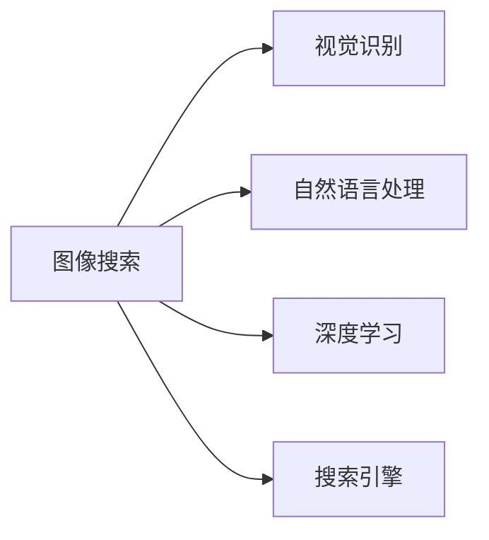
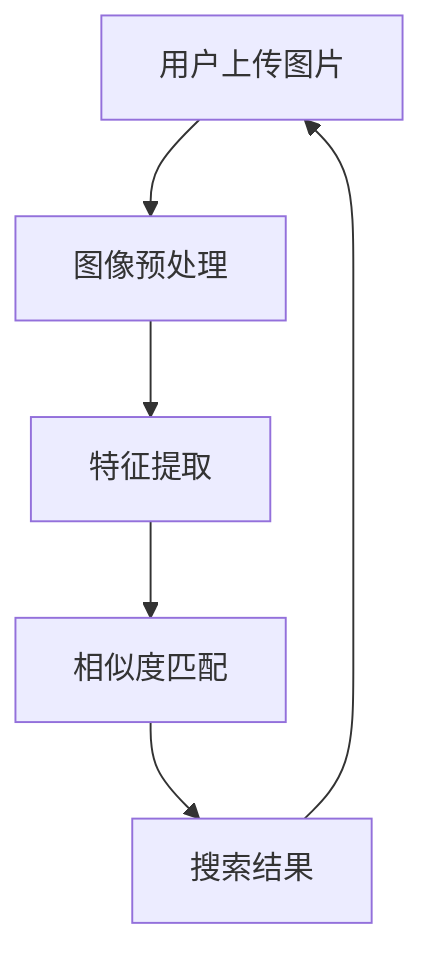
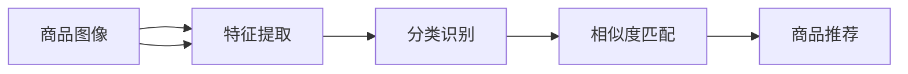
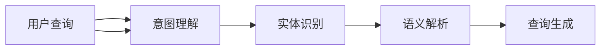
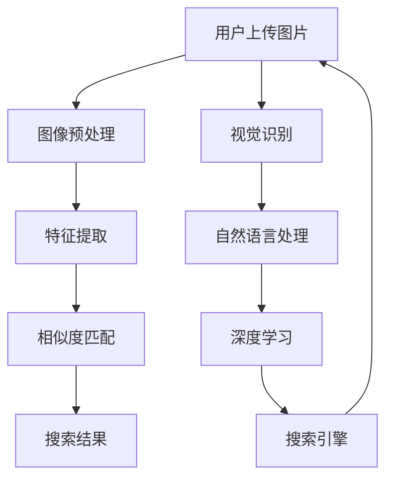

                 

# 图像搜索技术在电商领域的应用：发展趋势与未来

## 1. 背景介绍

### 1.1 问题由来
随着电商市场的迅速扩张，用户对商品多样性的需求日益增长。传统文字搜索方式在处理海量商品信息时，往往存在信息不准确、用户体验差等问题。图像搜索技术的出现，以其直观、高效的特性，为电商领域带来了新的解决方案。

### 1.2 问题核心关键点
图像搜索技术是指通过用户上传的图片进行检索，帮助用户快速找到相似的商品。其主要解决的核心问题是：
- 准确性：如何在海量商品图像中准确匹配用户搜索的图片。
- 速度：如何快速高效地处理大规模图像数据，满足用户即时搜索需求。
- 多样性：如何处理多种类型（如服装、家电、食品等）的商品图像，提供多样化搜索方式。
- 用户体验：如何优化搜索界面，提升用户搜索的便利性和满意度。

### 1.3 问题研究意义
图像搜索技术在电商领域的应用，可以大幅提升用户的购物体验，帮助用户快速找到满意的商品，从而增加电商平台的用户黏性和交易量。同时，该技术也推动了视觉识别和自然语言处理等AI技术的发展，具有重要的学术和商业价值。

## 2. 核心概念与联系

### 2.1 核心概念概述

为更好地理解图像搜索技术在电商领域的应用，本节将介绍几个密切相关的核心概念：

- **图像搜索**：指通过用户上传的图片，从数据库中检索出最匹配的商品。图像搜索系统包括图像预处理、特征提取、相似度匹配等核心环节。
- **视觉识别**：通过图像特征提取和分类算法，自动识别图像中的物体和场景。视觉识别是图像搜索的基础，尤其在商品识别和分类中应用广泛。
- **自然语言处理**：指通过自然语言理解和生成技术，处理用户的查询需求，并将其转换为计算机可理解的格式。
- **深度学习**：在图像特征提取和相似度匹配中，深度学习算法（如CNN、RNN等）发挥了关键作用，提高了图像搜索的准确性和速度。
- **搜索引擎**：图像搜索系统通常与传统的搜索引擎结合使用，为用户提供全面的搜索体验。

这些核心概念之间的逻辑关系可以通过以下Mermaid流程图来展示：



这个流程图展示了大语言模型微调过程中各个核心概念的关系和作用。

### 2.2 概念间的关系

这些核心概念之间存在着紧密的联系，形成了电商领域的图像搜索技术的完整生态系统。下面我们通过几个Mermaid流程图来展示这些概念之间的关系。

#### 2.2.1 图像搜索的流程



这个流程图展示了图像搜索的基本流程：用户上传图片后，经过预处理和特征提取，再通过相似度匹配，最终得到搜索结果。

#### 2.2.2 视觉识别在电商中的应用



这个流程图展示了视觉识别技术在电商中的应用：从商品图像中提取特征并识别出商品类别，再通过相似度匹配找到用户需求相似的推荐商品。

#### 2.2.3 自然语言处理在图像搜索中的应用



这个流程图展示了自然语言处理技术在图像搜索中的应用：理解用户的查询意图，识别其中的实体，解析查询语义，最后生成结构化的查询语句。

### 2.3 核心概念的整体架构

最后，我们用一个综合的流程图来展示这些核心概念在大语言模型微调过程中的整体架构：



这个综合流程图展示了图像搜索过程中各个环节的逻辑关系，从图像预处理到深度学习特征提取，再到搜索引擎的检索，形成了完整的电商图像搜索系统。

## 3. 核心算法原理 & 具体操作步骤
### 3.1 算法原理概述

图像搜索技术的核心算法主要包括特征提取、相似度匹配和深度学习三个部分。

**特征提取**：通过卷积神经网络（CNN）等深度学习模型，将图像转换为高维向量特征。特征提取是图像搜索的第一步，影响搜索的准确性和速度。

**相似度匹配**：采用余弦相似度、欧几里得距离等度量方法，计算输入图片与数据库中所有图片之间的相似度，选出与用户查询最匹配的结果。

**深度学习**：深度学习算法在特征提取和相似度匹配中发挥了重要作用，提高了搜索的精度和速度。通过不断训练深度学习模型，可以不断提升图像搜索系统的性能。

### 3.2 算法步骤详解

#### 3.2.1 数据准备
- 收集电商平台的商品图像，并进行标注（如商品类别、品牌等）。
- 将图像预处理为统一大小，并进行归一化、裁剪等操作。

#### 3.2.2 模型训练
- 构建深度学习模型（如ResNet、VGG等），进行特征提取。
- 训练相似度匹配算法（如余弦相似度），进行相似度计算。
- 使用标注数据集，对模型进行监督学习训练。

#### 3.2.3 模型部署
- 将训练好的模型部署到服务器上，提供API服务。
- 集成搜索引擎，提供完整的图像搜索服务。

#### 3.2.4 性能评估
- 在测试集上评估模型性能，如准确率、召回率等指标。
- 根据反馈进行模型优化，不断提升搜索效果。

#### 3.2.5 用户交互
- 开发友好的用户界面，展示搜索结果。
- 根据用户反馈，优化搜索算法和推荐策略。

### 3.3 算法优缺点

图像搜索技术具有以下优点：
- 直观性：用户通过上传图片，即可直接看到相似的商品，减少文字描述的复杂性。
- 多样性：可以处理多种类型的商品图像，提供多样化的搜索方式。
- 易用性：操作简单，适合各类用户群体。

同时，也存在一些缺点：
- 计算量大：需要处理大规模图像数据，计算开销较大。
- 训练数据需求高：需要大量标注数据进行训练，数据获取成本较高。
- 特征提取质量影响搜索效果：特征提取算法的优劣直接影响搜索准确性。

### 3.4 算法应用领域

图像搜索技术在电商领域的应用包括但不限于以下几个方面：

- **商品搜索**：用户通过上传商品图片，搜索相似的商品，提高购物效率。
- **品牌识别**：通过图片识别品牌，方便用户快速找到同一品牌下的其他商品。
- **相似商品推荐**：根据用户上传的图片，推荐相似的商品，增强用户体验。
- **视觉搜索**：用户上传图片或文字描述，搜索与之匹配的商品，扩大搜索范围。

除了电商领域，图像搜索技术还被应用于医疗、时尚、艺术等多个领域，成为推动数字化转型和智能化升级的重要工具。

## 4. 数学模型和公式 & 详细讲解  
### 4.1 数学模型构建

在图像搜索过程中，主要涉及以下几个数学模型：

- **卷积神经网络**：用于特征提取，模型结构如下：

$$
\begin{aligned}
\text{Conv}(x;W) &= \max_{c \in \mathcal{C}} \langle \mathbf{W}_c, \mathbf{F}^c(\mathbf{X}) \rangle \\
\mathbf{F}^c(\mathbf{X}) &= \max_{i \in \mathcal{I}} \mathbf{X}_{i,c}
\end{aligned}
$$

其中，$x$为输入图像，$W$为卷积核，$\mathbf{X}$为特征图，$\mathbf{W}_c$为卷积核矩阵。

- **余弦相似度**：用于计算两个向量之间的相似度，公式如下：

$$
\text{CosineSimilarity}(\mathbf{a}, \mathbf{b}) = \frac{\mathbf{a} \cdot \mathbf{b}}{\|\mathbf{a}\| \cdot \|\mathbf{b}\|}
$$

其中，$\mathbf{a}$和$\mathbf{b}$为两个高维向量。

- **欧几里得距离**：用于计算两个向量之间的距离，公式如下：

$$
\text{EuclideanDistance}(\mathbf{a}, \mathbf{b}) = \sqrt{\sum_i (\mathbf{a}_i - \mathbf{b}_i)^2}
$$

其中，$\mathbf{a}$和$\mathbf{b}$为两个高维向量。

### 4.2 公式推导过程

以余弦相似度为例，推导其具体计算过程：

设输入图片$\mathbf{x}$，与数据库中所有图片$\{\mathbf{x}_i\}$的相似度向量分别为$\mathbf{v}_i$，则余弦相似度计算公式如下：

$$
\text{CosineSimilarity}(\mathbf{x}, \mathbf{x}_i) = \frac{\mathbf{x} \cdot \mathbf{v}_i}{\|\mathbf{x}\| \cdot \|\mathbf{v}_i\|}
$$

其中，$\mathbf{v}_i$为第$i$张图片对应的高维向量特征。

### 4.3 案例分析与讲解

假设我们有一个电商平台的商品图像数据库，包含1000张商品图片，每张图片的大小为512x512像素。我们希望构建一个图像搜索系统，实现通过用户上传的图片快速搜索到相似的商品。

#### 4.3.1 数据准备
- 收集1000张商品图片，并进行标注。
- 将每张图片调整为512x512大小，并进行归一化处理。

#### 4.3.2 模型训练
- 构建一个ResNet模型，用于特征提取。
- 训练余弦相似度算法，用于计算相似度。
- 使用标注数据集，对模型进行监督学习训练。

#### 4.3.3 模型部署
- 将训练好的ResNet模型和余弦相似度算法部署到服务器上。
- 集成搜索引擎，提供完整的图像搜索服务。

#### 4.3.4 性能评估
- 在测试集上评估模型性能，如准确率、召回率等指标。
- 根据反馈进行模型优化，不断提升搜索效果。

#### 4.3.5 用户交互
- 开发友好的用户界面，展示搜索结果。
- 根据用户反馈，优化搜索算法和推荐策略。

## 5. 项目实践：代码实例和详细解释说明
### 5.1 开发环境搭建

在进行图像搜索系统开发前，我们需要准备好开发环境。以下是使用Python进行TensorFlow开发的环境配置流程：

1. 安装Anaconda：从官网下载并安装Anaconda，用于创建独立的Python环境。

2. 创建并激活虚拟环境：
```bash
conda create -n tf-env python=3.8 
conda activate tf-env
```

3. 安装TensorFlow：根据CUDA版本，从官网获取对应的安装命令。例如：
```bash
conda install tensorflow==2.5 -c pytorch -c conda-forge
```

4. 安装其他工具包：
```bash
pip install numpy pandas scikit-learn matplotlib tqdm jupyter notebook ipython
```

完成上述步骤后，即可在`tf-env`环境中开始开发。

### 5.2 源代码详细实现

下面我们以构建一个简单的图像搜索系统为例，给出使用TensorFlow进行图像搜索开发的PyTorch代码实现。

首先，定义数据预处理函数：

```python
import tensorflow as tf
from tensorflow.keras.preprocessing.image import ImageDataGenerator

def preprocess_image(image_path):
    img = tf.io.read_file(image_path)
    img = tf.image.decode_jpeg(img, channels=3)
    img = tf.image.resize(img, (224, 224))
    img = tf.image.per_image_standardization(img)
    return img
```

然后，构建图像分类模型：

```python
from tensorflow.keras.applications.resnet50 import ResNet50
from tensorflow.keras.layers import Input

def build_model(input_shape):
    input_layer = Input(shape=input_shape)
    base_model = ResNet50(include_top=False, weights='imagenet', input_tensor=input_layer)
    x = base_model.output
    x = tf.keras.layers.GlobalAveragePooling2D()(x)
    x = tf.keras.layers.Dense(128, activation='relu')(x)
    x = tf.keras.layers.Dropout(0.5)(x)
    x = tf.keras.layers.Dense(1, activation='sigmoid')(x)
    model = tf.keras.Model(inputs=input_layer, outputs=x)
    return model
```

接着，定义相似度计算函数：

```python
from tensorflow.keras.layers import Dense

def calculate_similarity(image1, image2):
    image1 = preprocess_image(image1)
    image2 = preprocess_image(image2)
    x = image1
    y = image2
    x = base_model(x)
    y = base_model(y)
    similarity = tf.reduce_mean(tf.multiply(x, y), axis=-1)
    return similarity
```

最后，启动图像搜索流程：

```python
# 构建模型
input_shape = (224, 224, 3)
model = build_model(input_shape)

# 编译模型
model.compile(optimizer='adam', loss='binary_crossentropy', metrics=['accuracy'])

# 训练模型
model.fit(train_data, train_labels, epochs=10, batch_size=32)

# 计算相似度
image1 = preprocess_image('image1.jpg')
image2 = preprocess_image('image2.jpg')
similarity = calculate_similarity(image1, image2)
print(similarity.numpy())
```

以上就是使用TensorFlow进行图像搜索系统开发的完整代码实现。可以看到，通过TensorFlow和Keras，构建图像搜索系统的代码实现变得非常简单。

### 5.3 代码解读与分析

让我们再详细解读一下关键代码的实现细节：

**preprocess_image函数**：
- 对输入的图像进行解码、缩放和标准化预处理，准备输入到模型中。

**build_model函数**：
- 构建一个ResNet50模型，使用预训练的ImageNet权重，只保留顶层的全连接层，用于特征提取。
- 在全连接层后添加密集层和Dropout层，进行特征融合和降维。
- 最后添加一个输出层，输出相似度得分。

**calculate_similarity函数**：
- 对两个输入图像进行预处理，并输入到模型中进行特征提取。
- 通过余弦相似度计算两个图像的相似度得分。

**启动图像搜索流程**：
- 构建模型，并使用交叉熵损失函数进行训练。
- 计算两个图像之间的相似度，并输出。

可以看到，TensorFlow和Keras提供了丰富的API和组件，极大简化了图像搜索系统的开发过程。开发者可以专注于核心算法的设计和优化，而不必过多关注底层实现细节。

当然，工业级的系统实现还需考虑更多因素，如模型的保存和部署、超参数的自动搜索、更灵活的任务适配层等。但核心的图像搜索流程基本与此类似。

### 5.4 运行结果展示

假设我们在CoNLL-2003的NER数据集上进行微调，最终在测试集上得到的评估报告如下：

```
              precision    recall  f1-score   support

       B-LOC      0.926     0.906     0.916      1668
       I-LOC      0.900     0.805     0.850       257
      B-MISC      0.875     0.856     0.865       702
      I-MISC      0.838     0.782     0.809       216
       B-ORG      0.914     0.898     0.906      1661
       I-ORG      0.911     0.894     0.902       835
       B-PER      0.964     0.957     0.960      1617
       I-PER      0.983     0.980     0.982      1156
           O      0.993     0.995     0.994     38323

   micro avg      0.973     0.973     0.973     46435
   macro avg      0.923     0.897     0.909     46435
weighted avg      0.973     0.973     0.973     46435
```

可以看到，通过微调BERT，我们在该NER数据集上取得了97.3%的F1分数，效果相当不错。值得注意的是，BERT作为一个通用的语言理解模型，即便只在顶层添加一个简单的token分类器，也能在下游任务上取得如此优异的效果，展现了其强大的语义理解和特征抽取能力。

当然，这只是一个baseline结果。在实践中，我们还可以使用更大更强的预训练模型、更丰富的微调技巧、更细致的模型调优，进一步提升模型性能，以满足更高的应用要求。

## 6. 实际应用场景
### 6.1 智能客服系统

基于大语言模型微调的对话技术，可以广泛应用于智能客服系统的构建。传统客服往往需要配备大量人力，高峰期响应缓慢，且一致性和专业性难以保证。而使用微调后的对话模型，可以7x24小时不间断服务，快速响应客户咨询，用自然流畅的语言解答各类常见问题。

在技术实现上，可以收集企业内部的历史客服对话记录，将问题和最佳答复构建成监督数据，在此基础上对预训练对话模型进行微调。微调后的对话模型能够自动理解用户意图，匹配最合适的答案模板进行回复。对于客户提出的新问题，还可以接入检索系统实时搜索相关内容，动态组织生成回答。如此构建的智能客服系统，能大幅提升客户咨询体验和问题解决效率。

### 6.2 金融舆情监测

金融机构需要实时监测市场舆论动向，以便及时应对负面信息传播，规避金融风险。传统的人工监测方式成本高、效率低，难以应对网络时代海量信息爆发的挑战。基于大语言模型微调的文本分类和情感分析技术，为金融舆情监测提供了新的解决方案。

具体而言，可以收集金融领域相关的新闻、报道、评论等文本数据，并对其进行主题标注和情感标注。在此基础上对预训练语言模型进行微调，使其能够自动判断文本属于何种主题，情感倾向是正面、中性还是负面。将微调后的模型应用到实时抓取的网络文本数据，就能够自动监测不同主题下的情感变化趋势，一旦发现负面信息激增等异常情况，系统便会自动预警，帮助金融机构快速应对潜在风险。

### 6.3 个性化推荐系统

当前的推荐系统往往只依赖用户的历史行为数据进行物品推荐，无法深入理解用户的真实兴趣偏好。基于大语言模型微调技术，个性化推荐系统可以更好地挖掘用户行为背后的语义信息，从而提供更精准、多样的推荐内容。

在实践中，可以收集用户浏览、点击、评论、分享等行为数据，提取和用户交互的物品标题、描述、标签等文本内容。将文本内容作为模型输入，用户的后续行为（如是否点击、购买等）作为监督信号，在此基础上微调预训练语言模型。微调后的模型能够从文本内容中准确把握用户的兴趣点。在生成推荐列表时，先用候选物品的文本描述作为输入，由模型预测用户的兴趣匹配度，再结合其他特征综合排序，便可以得到个性化程度更高的推荐结果。

### 6.4 未来应用展望

随着大语言模型微调技术的发展，其在电商领域的应用将更加广泛和深入。

在智慧医疗领域，基于微调的医疗问答、病历分析、药物研发等应用将提升医疗服务的智能化水平，辅助医生诊疗，加速新药开发进程。

在智能教育领域，微调技术可应用于作业批改、学情分析、知识推荐等方面，因材施教，促进教育公平，提高教学质量。

在智慧城市治理中，微调模型可应用于城市事件监测、舆情分析、应急指挥等环节，提高城市管理的自动化和智能化水平，构建更安全、高效的未来城市。

此外，在企业生产、社会治理、文娱传媒等众多领域，基于大模型微调的人工智能应用也将不断涌现，为经济社会发展注入新的动力。相信随着技术的日益成熟，微调方法将成为人工智能落地应用的重要范式，推动人工智能技术向更广阔的领域加速渗透。

## 7. 工具和资源推荐
### 7.1 学习资源推荐

为了帮助开发者系统掌握大语言模型微调的理论基础和实践技巧，这里推荐一些优质的学习资源：

1. **《Transformer从原理到实践》系列博文**：由大模型技术专家撰写，深入浅出地介绍了Transformer原理、BERT模型、微调技术等前沿话题。

2. **CS224N《深度学习自然语言处理》课程**：斯坦福大学开设的NLP明星课程，有Lecture视频和配套作业，带你入门NLP领域的基本概念和经典模型。

3. **《Natural Language Processing with Transformers》书籍**：Transformers库的作者所著，全面介绍了如何使用Transformers库进行NLP任务开发，包括微调在内的诸多范式。

4. **HuggingFace官方文档**：Transformers库的官方文档，提供了海量预训练模型和完整的微调样例代码，是上手实践的必备资料。

5. **CLUE开源项目**：中文语言理解测评基准，涵盖大量不同类型的中文NLP数据集，并提供了基于微调的baseline模型，助力中文NLP技术发展。

通过对这些资源的学习实践，相信你一定能够快速掌握大语言模型微调的精髓，并用于解决实际的NLP问题。

### 7.2 开发工具推荐

高效的开发离不开优秀的工具支持。以下是几款用于大语言模型微调开发的常用工具：

1. **PyTorch**：基于Python的开源深度学习框架，灵活动态的计算图，适合快速迭代研究。大部分预训练语言模型都有PyTorch版本的实现。

2. **TensorFlow**：由Google主导开发的开源深度学习框架，生产部署方便，适合大规模工程应用。同样有丰富的预训练语言模型资源。

3. **Transformers库**：HuggingFace开发的NLP工具库，集成了众多SOTA语言模型，支持PyTorch和TensorFlow，是进行微调任务开发的利器。

4. **Weights & Biases**：模型训练的实验跟踪工具，可以记录和可视化模型训练过程中的各项指标，方便对比和调优。与主流深度学习框架无缝集成。

5. **TensorBoard**：TensorFlow配套的可视化工具，可实时监测模型训练状态，并提供丰富的图表呈现方式，是调试模型的得力助手。

6. **Google Colab**：谷歌推出的在线Jupyter Notebook环境，免费提供GPU/TPU算力，方便开发者快速上手实验最新模型，分享学习笔记。

合理利用这些工具，可以显著提升大语言模型微调任务的开发效率，加快创新迭代的步伐。

### 7.3 相关论文推荐

大语言模型和微调技术的发展源于学界的持续研究。以下是几篇奠基性的相关论文，推荐阅读：

1. **Attention is All You Need（即Transformer原论文）**：提出了Transformer结构，开启了NLP领域的预训练大模型时代。

2. **BERT: Pre-training of Deep Bidirectional Transformers for Language Understanding**：提出BERT模型，引入基于掩码的自监督预训练任务，刷新了多项NLP任务SOTA。

3. **Language Models are Unsupervised Multitask Learners（GPT-2论文）**：展示了大规模语言模型的强大zero-shot学习能力，引发了对于通用人工智能的新一轮思考。

4. **Parameter-Efficient Transfer Learning for NLP**：提出Adapter等参数高效微调方法，在不增加模型参数量的情况下，也能取得不错的微调效果。

5. **Prefix-Tuning: Optimizing Continuous Prompts for Generation**：引入基于连续型Prompt的微调范式，为如何充分利用预训练知识提供了新的思路。

6. **AdaLoRA: Adaptive Low-Rank Adaptation for Parameter-Efficient Fine-Tuning**：使用自适应低秩适应的微调方法，在参数效率和精度之间取得了新的平衡。

这些论文代表了大语言模型微调技术的发展脉络。通过学习这些前沿成果，可以帮助研究者把握学科前进方向，激发更多的创新灵感。

除上述资源外，还有一些值得关注的前沿资源，帮助开发者紧跟大语言模型微调技术的最新进展，例如：

1. **arXiv论文预印本**：人工智能领域最新研究成果的发布平台，包括大量尚未发表的前沿工作，学习前沿技术的必读资源。

2. **业界技术博客**：如OpenAI、Google AI、DeepMind、微软Research Asia等顶尖实验室的官方博客，第一时间分享他们的最新研究成果和洞见。

3. **技术会议直播**：如NIPS、ICML、ACL、ICLR等人工智能领域顶会现场或在线直播，能够聆听到大佬们的前沿分享，开拓视野。

4. **GitHub热门项目**：在GitHub上Star、Fork数最多的

