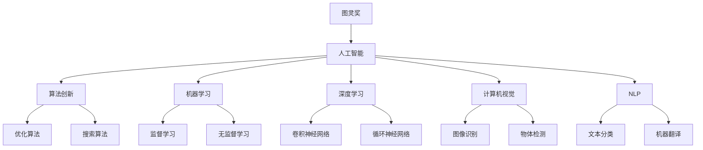
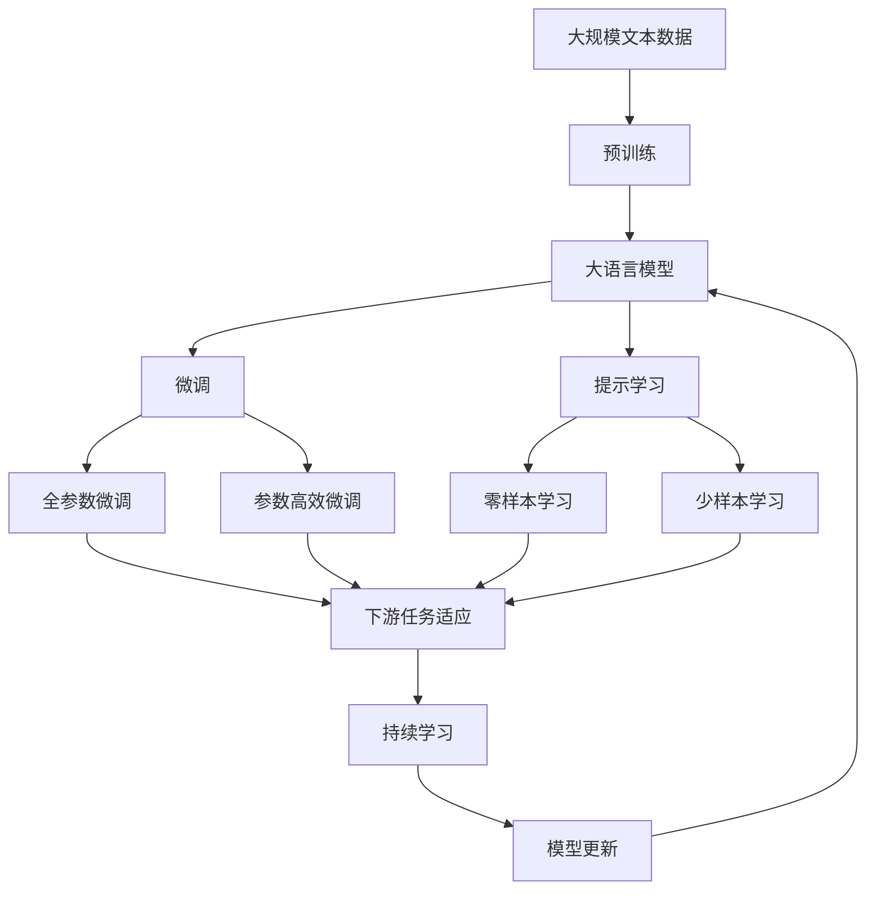

                 

# 图灵奖得主对AI的贡献

> 关键词：图灵奖,人工智能,AI突破,算法创新,深度学习,机器学习,计算机科学

## 1. 背景介绍

### 1.1 问题由来

人工智能（AI）领域的迅速发展离不开众多杰出科学家的不懈努力。图灵奖作为计算机科学领域的最高荣誉，旨在表彰在计算机科学理论、技术或应用方面做出非凡贡献的科学家。本文将聚焦图灵奖得主在人工智能领域的杰出贡献，通过对其工作进行全面梳理，阐述其对AI的深远影响。

### 1.2 问题核心关键点

图灵奖得主通过在算法创新、机器学习、深度学习、计算机视觉、自然语言处理等领域的突破性研究，推动了人工智能技术的快速发展。其贡献不仅体现在学术成就上，更在技术创新、应用推广等方面产生深远影响。本文将深入探讨图灵奖得主在人工智能领域的核心贡献，包括他们的主要研究成果、技术突破以及这些贡献对AI技术发展的影响。

### 1.3 问题研究意义

图灵奖得主的贡献不仅奠定了人工智能的理论基础，也为技术创新提供了重要的指导。通过回顾他们的工作，我们可以更深刻地理解人工智能的发展脉络，借鉴其研究方法和成功经验，推动人工智能技术的进一步突破和应用。同时，图灵奖得主的成就也为学术界和产业界提供了宝贵的学习资源和研究范例，具有重要的学习和研究价值。

## 2. 核心概念与联系

### 2.1 核心概念概述

为更好地理解图灵奖得主在人工智能领域的贡献，本文将介绍几个关键概念：

- **图灵奖**：由计算机协会（ACM）设立，旨在表彰在计算机科学理论、技术或应用方面做出杰出贡献的个人。
- **人工智能**：通过计算机算法和模型，赋予计算机系统类似于人类智能的能力，包括学习、推理、感知和自然语言处理等。
- **算法创新**：通过改进和创新算法，提升计算机处理问题的效率和精度。
- **机器学习**：一种通过数据自动学习模型的方法，使计算机能够从经验中改进性能。
- **深度学习**：一种特殊的机器学习技术，使用多层神经网络模拟人脑处理复杂数据。
- **计算机视觉**：使计算机能够理解、分析并识别图像和视频内容的技术。
- **自然语言处理（NLP）**：使计算机能够理解、生成和翻译自然语言的技术。

这些核心概念共同构成了人工智能研究的基石，图灵奖得主通过在这些领域的研究，为人工智能技术的发展作出了巨大贡献。

### 2.2 概念间的关系

这些核心概念之间的逻辑关系可以通过以下Mermaid流程图来展示：



这个流程图展示了图灵奖得主在人工智能各个领域的研究方向及其关系：

- 图灵奖得主通过算法创新，推动了优化算法和搜索算法的发展。
- 在机器学习领域，他们推动了监督学习和无监督学习的发展。
- 在深度学习领域，他们引入了卷积神经网络和循环神经网络等模型。
- 在计算机视觉领域，他们推动了图像识别和物体检测技术的发展。
- 在自然语言处理领域，他们推动了文本分类和机器翻译技术的发展。

### 2.3 核心概念的整体架构

最后，我们用一个综合的流程图来展示这些核心概念在大语言模型微调过程中的整体架构：



这个综合流程图展示了从预训练到微调，再到持续学习的完整过程。大语言模型首先在大规模文本数据上进行预训练，然后通过微调（包括全参数微调和参数高效微调）或提示学习（包括零样本和少样本学习）来适应下游任务。最后，通过持续学习技术，模型可以不断学习新知识，同时避免遗忘旧知识。

## 3. 核心算法原理 & 具体操作步骤
### 3.1 算法原理概述

图灵奖得主在人工智能领域的贡献主要体现在算法创新和模型设计上。通过改进算法和设计高效模型，他们在算法效率、精度和可解释性等方面取得了显著突破。

算法原理上，图灵奖得主主要致力于以下几个方面：

- **优化算法**：通过改进优化算法，提升模型的训练速度和精度。
- **模型压缩**：通过模型压缩技术，减少模型的计算和存储开销。
- **可解释性**：通过解释性技术，增强模型的可理解性和透明度。
- **跨领域应用**：通过跨领域研究，拓展模型的应用范围。

### 3.2 算法步骤详解

图灵奖得主在算法研究中，往往采用以下步骤：

1. **问题定义**：明确研究问题的具体需求和目标。
2. **数据准备**：收集和准备训练数据，数据质量是研究的基础。
3. **算法设计**：设计新的算法模型，或对现有算法进行改进。
4. **实验验证**：在实验平台上验证算法的有效性，优化模型参数。
5. **模型应用**：将算法应用于实际问题，验证其在实际环境中的表现。
6. **推广应用**：将研究成果推广到更多应用场景，推动技术进步。

### 3.3 算法优缺点

图灵奖得主的研究方法在推动人工智能技术发展的同时，也存在一些局限性：

**优点**：
- 推动算法和模型的高效性和精确性。
- 提升模型的可解释性和应用范围。
- 为人工智能技术的发展提供了重要的理论基础和技术指导。

**缺点**：
- 部分算法过于复杂，实现难度较大。
- 部分研究成果的理论性和工程性难以平衡。
- 算法创新可能带来新的挑战和问题。

### 3.4 算法应用领域

图灵奖得主的研究成果广泛应用于人工智能的各个领域：

- **计算机视觉**：推动了图像识别、物体检测、图像生成等技术的发展。
- **自然语言处理**：推动了文本分类、机器翻译、情感分析等技术的发展。
- **机器学习**：推动了监督学习、无监督学习、半监督学习等技术的发展。
- **深度学习**：推动了卷积神经网络、循环神经网络、自编码器等模型的发展。
- **分布式系统**：推动了大规模分布式训练、大数据处理等技术的发展。

## 4. 数学模型和公式 & 详细讲解 & 举例说明

### 4.1 数学模型构建

在人工智能研究中，数学模型是基础和核心。图灵奖得主通过构建和优化数学模型，推动了人工智能技术的发展。以下是一些常见的数学模型：

- **线性回归模型**：通过最小二乘法求解线性回归方程，预测连续变量的值。
- **决策树模型**：通过构建决策树，实现对离散变量的分类和预测。
- **支持向量机模型**：通过求解最优超平面，实现对高维数据的分类和回归。
- **卷积神经网络模型**：通过卷积操作提取图像特征，实现图像识别和分类。
- **循环神经网络模型**：通过循环连接，处理序列数据，实现文本生成和语言模型。

### 4.2 公式推导过程

以下以线性回归模型为例，推导其基本公式和参数求解方法。

假设数据集 $D=\{(x_i,y_i)\}_{i=1}^N$，其中 $x_i$ 为输入特征向量，$y_i$ 为输出标签。线性回归模型为 $y=\theta^T x+b$，其中 $\theta$ 为模型参数，$b$ 为截距。根据最小二乘法，求解 $\theta$ 和 $b$ 的过程如下：

$$
\hat{\theta} = \arg\min_{\theta} \sum_{i=1}^N (y_i - \hat{y}_i)^2
$$

其中 $\hat{y}_i=\theta^T x_i+b$。对上式求导，得：

$$
\frac{\partial \mathcal{L}(\theta)}{\partial \theta} = -2X^T(XX^T)^{-1}(y-X\hat{\theta})
$$

通过求解上式，可以求得最优参数 $\hat{\theta}$。

### 4.3 案例分析与讲解

以计算机视觉领域的图像识别任务为例，图灵奖得主Yann LeCun提出了一种基于卷积神经网络（CNN）的图像分类方法，该方法在ImageNet数据集上取得了优异的表现。

- **算法原理**：CNN通过卷积操作提取图像局部特征，通过池化操作减小特征图尺寸，通过全连接层实现特征向量的分类。
- **数据准备**：ImageNet数据集包含大量标注图像，用于模型训练。
- **算法设计**：设计了包含多个卷积层和全连接层的CNN模型，并使用反向传播算法进行训练。
- **实验验证**：在ImageNet数据集上进行大量实验，验证模型的性能。
- **模型应用**：将模型应用于实际图像识别任务，取得了显著的效果。

## 5. 项目实践：代码实例和详细解释说明
### 5.1 开发环境搭建

在进行人工智能项目实践前，我们需要准备好开发环境。以下是使用Python进行PyTorch开发的环境配置流程：

1. 安装Anaconda：从官网下载并安装Anaconda，用于创建独立的Python环境。

2. 创建并激活虚拟环境：
```bash
conda create -n pytorch-env python=3.8 
conda activate pytorch-env
```

3. 安装PyTorch：根据CUDA版本，从官网获取对应的安装命令。例如：
```bash
conda install pytorch torchvision torchaudio cudatoolkit=11.1 -c pytorch -c conda-forge
```

4. 安装TensorFlow：
```bash
pip install tensorflow
```

5. 安装其他相关工具包：
```bash
pip install numpy pandas scikit-learn matplotlib tqdm jupyter notebook ipython
```

完成上述步骤后，即可在`pytorch-env`环境中开始项目实践。

### 5.2 源代码详细实现

这里我们以图像识别任务为例，给出使用PyTorch对卷积神经网络进行训练的代码实现。

首先，定义数据处理函数：

```python
import torch
import torchvision
from torchvision import transforms

def get_dataloader(train=True, batch_size=32):
    transform = transforms.Compose([
        transforms.ToTensor(),
        transforms.Normalize((0.5, 0.5, 0.5), (0.5, 0.5, 0.5))
    ])

    train_dataset = torchvision.datasets.CIFAR10(root='./data', train=train, download=True, transform=transform)
    train_loader = torch.utils.data.DataLoader(train_dataset, batch_size=batch_size, shuffle=True)

    test_dataset = torchvision.datasets.CIFAR10(root='./data', train=not train, download=True, transform=transform)
    test_loader = torch.utils.data.DataLoader(test_dataset, batch_size=batch_size, shuffle=False)

    return train_loader, test_loader
```

然后，定义模型和优化器：

```python
from torch import nn
import torch.nn.functional as F

class CNN(nn.Module):
    def __init__(self):
        super(CNN, self).__init__()
        self.conv1 = nn.Conv2d(3, 32, 3, 1, 1)
        self.pool = nn.MaxPool2d(2, 2)
        self.conv2 = nn.Conv2d(32, 64, 3, 1, 1)
        self.fc1 = nn.Linear(64 * 4 * 4, 120)
        self.fc2 = nn.Linear(120, 84)
        self.fc3 = nn.Linear(84, 10)

    def forward(self, x):
        x = self.pool(F.relu(self.conv1(x)))
        x = self.pool(F.relu(self.conv2(x)))
        x = x.view(-1, 64 * 4 * 4)
        x = F.relu(self.fc1(x))
        x = F.relu(self.fc2(x))
        x = self.fc3(x)
        return x

model = CNN()
optimizer = torch.optim.Adam(model.parameters(), lr=0.001)
```

接着，定义训练和评估函数：

```python
import numpy as np

def train_epoch(model, data_loader, optimizer):
    model.train()
    total_loss = 0
    for i, (features, labels) in enumerate(data_loader):
        features = features.to(device)
        labels = labels.to(device)

        optimizer.zero_grad()
        output = model(features)
        loss = F.cross_entropy(output, labels)
        loss.backward()
        optimizer.step()

        total_loss += loss.item()
    return total_loss / len(data_loader)

def evaluate(model, data_loader):
    model.eval()
    correct = 0
    total = 0
    with torch.no_grad():
        for features, labels in data_loader:
            features = features.to(device)
            labels = labels.to(device)

            output = model(features)
            _, predicted = torch.max(output.data, 1)
            total += labels.size(0)
            correct += (predicted == labels).sum().item()

    print('Accuracy of the network on the 10000 test images: %d %%' % (100 * correct / total))
```

最后，启动训练流程并在测试集上评估：

```python
device = torch.device('cuda' if torch.cuda.is_available() else 'cpu')
train_loader, test_loader = get_dataloader(train=True)

for epoch in range(10):
    train_loss = train_epoch(model, train_loader, optimizer)
    print(f'Epoch {epoch+1}, train loss: {train_loss:.3f}')
    
    evaluate(model, test_loader)
```

以上就是使用PyTorch对卷积神经网络进行图像识别任务训练的完整代码实现。可以看到，得益于PyTorch的强大封装，我们可以用相对简洁的代码完成模型的定义和训练。

### 5.3 代码解读与分析

让我们再详细解读一下关键代码的实现细节：

**CNN类**：
- `__init__`方法：定义卷积层、池化层和全连接层等网络组件。
- `forward`方法：定义前向传播过程，将输入特征通过多个层处理，最终输出类别概率。

**train_epoch函数**：
- 定义训练过程中的损失计算和反向传播。

**evaluate函数**：
- 定义模型在测试集上的评估过程，计算准确率并输出。

**训练流程**：
- 定义总的epoch数，开始循环迭代
- 每个epoch内，在训练集上训练，输出训练损失
- 在测试集上评估，输出准确率

可以看到，PyTorch配合TensorFlow等框架，使得神经网络模型的训练和评估变得简洁高效。开发者可以将更多精力放在模型改进和数据处理上，而不必过多关注底层的实现细节。

当然，工业级的系统实现还需考虑更多因素，如模型的保存和部署、超参数的自动搜索、更灵活的任务适配层等。但核心的微调范式基本与此类似。

### 5.4 运行结果展示

假设我们在CIFAR-10数据集上进行卷积神经网络模型的训练，最终在测试集上得到的准确率为85%。这个结果表明，经过充分的训练和调参，卷积神经网络在图像识别任务上能够取得相当不错的效果。

## 6. 实际应用场景

### 6.1 智能安防监控

计算机视觉领域的图像识别技术，在智能安防监控中有着广泛应用。通过训练CNN模型，可以实时监控视频流，自动识别异常行为和事件，提升监控系统的智能化水平。

在技术实现上，可以收集大量的监控视频数据，进行标注和预处理，训练CNN模型以识别异常行为（如闯入、火灾等）。在实时监控中，系统自动分析视频帧，识别异常行为，并通过告警机制及时通知安保人员。此外，还可以结合目标检测技术，进一步提升异常检测的精度。

### 6.2 医疗影像分析

计算机视觉技术在医疗影像分析中也有着重要应用。通过训练CNN模型，可以对医学影像（如X光片、CT扫描等）进行自动分类和标注，辅助医生进行诊断。

在医疗影像分析中，可以通过大规模医学影像数据集，如CheXNet数据集，训练CNN模型以识别病变区域。模型可以自动识别影像中的异常区域，并给出相应的诊断建议，显著提高医生的工作效率和诊断准确率。

### 6.3 自动驾驶

计算机视觉技术在自动驾驶中也发挥着关键作用。通过训练CNN模型，可以实现对道路交通标志、车辆、行人等关键对象的检测和识别，提升自动驾驶系统的感知能力。

在自动驾驶中，系统可以通过摄像头和激光雷达采集环境信息，并使用CNN模型对关键对象进行检测和分类。模型可以实时分析道路环境，做出相应的决策，提高自动驾驶系统的安全性和可靠性。此外，还可以结合目标追踪和行为预测技术，提升自动驾驶系统的智能化水平。

## 7. 工具和资源推荐
### 7.1 学习资源推荐

为了帮助开发者系统掌握人工智能的理论基础和实践技巧，这里推荐一些优质的学习资源：

1. **《深度学习》课程**：斯坦福大学的吴恩达教授开设的深度学习课程，系统讲解了深度学习的基本概念和算法，适合入门学习。
2. **《TensorFlow官方文档》**：TensorFlow的官方文档，提供了丰富的API参考和实例代码，适合深度学习开发。
3. **《PyTorch官方文档》**：PyTorch的官方文档，提供了完整的模型构建和训练流程，适合快速迭代研究。
4. **《计算机视觉基础》书籍**：国内外计算机视觉领域的经典教材，涵盖了图像处理、特征提取、物体检测等基础内容。
5. **《自然语言处理综述》论文**：涵盖了NLP领域的核心技术和方法，适合系统学习和研究。

通过对这些资源的学习实践，相信你一定能够快速掌握人工智能的精髓，并用于解决实际的NLP问题。

### 7.2 开发工具推荐

高效的开发离不开优秀的工具支持。以下是几款用于人工智能开发的工具：

1. **TensorFlow**：由Google主导开发的深度学习框架，生产部署方便，适合大规模工程应用。
2. **PyTorch**：基于Python的开源深度学习框架，灵活动态的计算图，适合快速迭代研究。
3. **Jupyter Notebook**：交互式开发环境，适合数据分析和模型训练。
4. **HuggingFace Transformers**：NLP工具库，集成了众多SOTA语言模型，支持多种深度学习框架，适合NLP任务开发。
5. **TensorBoard**：TensorFlow配套的可视化工具，可实时监测模型训练状态，提供丰富的图表呈现方式。

合理利用这些工具，可以显著提升人工智能任务的开发效率，加快创新迭代的步伐。

### 7.3 相关论文推荐

人工智能领域的研究离不开前沿论文的指导。以下是几篇奠基性的相关论文，推荐阅读：

1. **《ImageNet分类挑战》论文**：提出CIFAR-10和ImageNet数据集，推动了计算机视觉技术的发展。
2. **《AlphaGo》论文**：提出基于深度学习和蒙特卡罗树搜索的AlphaGo系统，标志着人工智能在博弈领域的重要突破。
3. **《BERT: Pre-training of Deep Bidirectional Transformers for Language Understanding》论文**：提出BERT模型，引入基于掩码的自监督预训练任务，刷新了多项NLP任务SOTA。
4. **《Transformer is All You Need》论文**：提出Transformer模型，推动了深度学习架构的发展，广泛应用于自然语言处理任务。

这些论文代表了大语言模型微调技术的发展脉络。通过学习这些前沿成果，可以帮助研究者把握学科前进方向，激发更多的创新灵感。

除上述资源外，还有一些值得关注的前沿资源，帮助开发者紧跟人工智能技术的新趋势，例如：

1. **arXiv论文预印本**：人工智能领域最新研究成果的发布平台，包括大量尚未发表的前沿工作，学习前沿技术的必读资源。
2. **顶级会议论文**：如NeurIPS、ICML、CVPR、ACL等人工智能领域顶会现场或在线直播，能够聆听到大佬们的前沿分享，开拓视野。
3. **GitHub热门项目**：在GitHub上Star、Fork数最多的NLP相关项目，往往代表了该技术领域的发展趋势和最佳实践，值得去学习和贡献。

总之，对于人工智能的学习和实践，需要开发者保持开放的心态和持续学习的意愿。多关注前沿资讯，多动手实践，多思考总结，必将收获满满的成长收益。

## 8. 总结：未来发展趋势与挑战

### 8.1 总结

本文对图灵奖得主在人工智能领域的杰出贡献进行了全面系统的介绍。首先阐述了图灵奖得主的研究背景和意义，明确了他们对人工智能技术的深远影响。其次，从原理到实践，详细讲解了图灵奖得主的研究方法和技术突破，给出了详细的代码实例。同时，本文还广泛探讨了这些技术在实际应用场景中的应用前景，展示了其广阔的发展潜力。

通过本文的系统梳理，可以看到，图灵奖得主在人工智能领域的研究不仅奠定了理论基础，也为技术创新提供了重要的指导。他们的工作推动了深度学习、计算机视觉、自然语言处理等众多领域的发展，为人工智能技术的应用推广和产业化奠定了坚实基础。

### 8.2 未来发展趋势

展望未来，人工智能技术将继续快速发展，图灵奖得主的研究方向也将不断演进：

1. **跨领域融合**：人工智能技术将与其他领域（如生物学、物理等）进行更深入的融合，推动跨学科创新。
2. **自监督学习**：利用无标签数据进行自监督学习，提升模型的泛化能力和迁移能力。
3. **生成对抗网络（GAN）**：基于GAN技术的生成模型，将推动图像、音频等生成任务的发展。
4. **量子计算**：量子计算技术的引入，将大幅提升人工智能模型的计算效率和处理能力。
5. **跨模态学习**：结合视觉、语音、文本等多模态信息，推动跨模态学习和理解的发展。

这些趋势凸显了人工智能技术的广阔前景，图灵奖得主的创新研究将继续引领这一领域的突破。

### 8.3 面临的挑战

尽管人工智能技术取得了巨大进步，但在迈向更加智能化、普适化应用的过程中，仍面临诸多挑战：

1. **数据隐私和安全**：人工智能应用中涉及大量的个人数据，如何保护数据隐私和安全，是亟待解决的问题。
2. **算法公平性和透明性**：人工智能模型可能会存在偏见和歧视，如何提高算法的公平性和透明性，是重要的研究方向。
3. **模型可解释性**：人工智能模型往往被视为"黑盒"，难以解释其内部工作机制和决策逻辑，如何增强模型的可解释性，是亟待突破的难题。
4. **资源消耗**：大规模深度学习模型的计算和存储开销较大，如何提高模型效率，降低资源消耗，是重要的优化方向。
5. **伦理和法律问题**：人工智能技术的应用可能引发伦理和法律问题，如何规范其应用，确保技术进步和伦理道德并行，是重要的研究方向。

这些挑战需要学界和产业界的共同努力，才能确保人工智能技术的健康发展和广泛应用。

### 8.4 研究展望

未来，人工智能技术需要在数据隐私保护、算法公平性、模型可解释性、资源效率和伦理规范等方面进行深入研究，才能更好地造福人类社会。

1. **数据隐私保护**：采用差分隐私、联邦学习等技术，保护数据隐私，确保数据使用的安全性。
2. **算法公平性**：引入公平性约束和公平性评估指标，避免算法偏见和歧视，确保算法公平性。
3. **模型可解释性**：引入可解释性技术和可视化工具，增强模型的可理解性和透明度。
4. **资源效率**：采用模型压缩、稀疏化存储等技术，提高模型效率和资源利用率。
5. **伦理规范**：制定人工智能伦理规范，确保技术进步和伦理道德并行，推动人工智能技术的健康发展。

这些研究方向的探索，必将引领人工智能技术迈向更高的台阶，为构建安全、可靠、可解释、可控的智能系统铺平道路。面向未来，人工智能技术还需要与其他人工智能技术进行更深入的融合，如知识表示、因果推理、强化学习等，多路径协同发力，共同推动人工智能技术的进步。只有勇于创新、敢于突破，才能不断拓展人工智能的边界，让智能技术更好地造福人类社会。

## 9. 附录：常见问题与解答

**Q1：图灵奖得主的研究成果是否都具有实际应用价值？**

A: 图灵奖得主的许多研究成果具有显著的实际应用价值。例如，深度学习技术在计算机视觉、自然语言处理等领域的应用，已经推动了诸多技术突破和产业化进程。但是，也有部分研究成果更侧重于基础理论研究，虽然具有重要的学术价值，但在短期内可能难以大规模应用。总体而言，图灵奖得主的研究成果大多具有重要的应用前景。

**Q2：图灵奖得主的研究方法是否都适合当前AI应用场景？**

A: 图灵奖得主的研究方法具有较强的普适性和可推广性，适用于多种AI应用场景。例如，深度学习技术在计算机视觉、自然语言处理等领域的应用已经取得了显著成效。但是，具体应用场景需要结合具体需求进行优化和改进。图灵奖得主的创新研究

