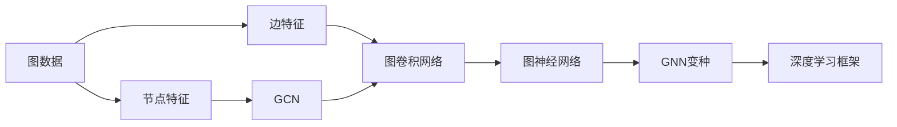

                 

# 图神经网络 原理与代码实例讲解

> 关键词：图神经网络, 图卷积网络, GCN, GNN, PyTorch, TensorFlow, 图模型, 深度学习

## 1. 背景介绍

### 1.1 问题由来
图神经网络（Graph Neural Networks，简称 GNN）近年来在机器学习领域中取得了长足的进展，其独特的模型结构和能力使其在处理图数据方面具有显著优势。图数据，如社交网络、知识图谱、分子结构等，普遍存在于各种现实场景中，对图数据的理解和处理有着广泛的应用需求。

图神经网络最初源于图信号处理（Graph Signal Processing）领域，将图模型看作一种特殊的数据类型，其节点和边分别对应于数据的特征和关系。通过在节点和边上应用神经网络结构，图神经网络能够有效地利用图数据中的复杂关系信息，进行特征学习、分类、回归等任务。

图神经网络的研究背景始于图结构数据的复杂性。传统神经网络难以处理非线性关系，而图神经网络通过对图数据进行特殊化的操作，成功地解决了这一问题，成为了图数据建模与分析的利器。

### 1.2 问题核心关键点
图神经网络的核心在于如何通过神经网络模型在图数据上学习和处理信息。其核心思路是将图数据视作一种特殊的非线性结构，利用神经网络在节点和边上进行信息传播，从而实现对图数据的特征提取和关系建模。

图神经网络具有以下关键点：
- **图数据结构**：由节点和边组成，节点表示数据实体，边表示节点之间的关系。
- **神经网络**：利用神经网络模型，如卷积神经网络（CNN）、循环神经网络（RNN）、递归神经网络（RNN）等，对节点特征进行处理。
- **信息传播**：在图数据上应用消息传递算法，将节点之间的信息进行传播。
- **聚合与更新**：对接收到的信息进行聚合和更新，得到新的节点特征表示。
- **训练与优化**：通过有监督学习或无监督学习对模型进行训练和优化。

### 1.3 问题研究意义
研究图神经网络对于理解图数据、处理图数据以及构建智能系统具有重要意义：

1. **促进图数据挖掘**：图神经网络可以处理复杂的关系数据，挖掘出数据中的隐含信息和模式。
2. **提升图数据处理效率**：通过图神经网络，可以更高效地处理大规模图数据，节省计算资源。
3. **增强图数据推理能力**：图神经网络能够学习到图数据中的复杂关系，提升对新数据点的推理能力。
4. **推动图模型在实际应用中的落地**：图神经网络为图模型在实际应用中的部署和优化提供了有力支持。
5. **开拓新的研究领域**：图神经网络的应用领域不仅限于图数据，还涉及到跨领域的多模态数据融合、智能推荐系统等前沿方向。

## 2. 核心概念与联系

### 2.1 核心概念概述

为更好地理解图神经网络的原理和应用，本节将介绍几个核心概念：

- **图数据**：由节点（Node）和边（Edge）组成的数据结构，用于表示实体及其之间的关系。
- **节点特征**：表示节点属性的向量，可以是任何形式的数据，如图像、文本、数值等。
- **边特征**：表示节点之间关系的向量，可以是二元关系、多元关系等。
- **图卷积网络（GCN）**：一种基于图结构的数据处理模型，通过邻居节点信息的聚合和更新，在节点特征上应用卷积操作。
- **图神经网络（GNN）**：一种泛化的图卷积网络，包括GCN及其变种，如GraphSAGE、GraphConv等，适用于处理不同类型的图数据。
- **PyTorch、TensorFlow**：常用的深度学习框架，支持图神经网络的开发和训练。

这些核心概念之间的逻辑关系可以通过以下Mermaid流程图来展示：



这个流程图展示了图神经网络从图数据到模型训练的完整过程。

### 2.2 概念间的关系

这些核心概念之间存在着紧密的联系，形成了图神经网络的理论和应用体系。

- 图数据是图神经网络的输入，节点特征和边特征是其组成要素。
- 图卷积网络是图神经网络的基本模型，通过邻居节点信息的聚合和更新，实现特征学习。
- 图神经网络包括多种变种，如GCN、GraphSAGE、GraphConv等，适用于不同类型的图数据。
- 深度学习框架如PyTorch、TensorFlow提供了强大的图神经网络开发环境，支持模型的训练和部署。

通过理解这些核心概念及其关系，我们可以更好地把握图神经网络的工作原理和优化方向。

## 3. 核心算法原理 & 具体操作步骤
### 3.1 算法原理概述

图神经网络的核心算法原理主要基于图信号处理（Graph Signal Processing）和图卷积网络（GCN）。其核心思路是将图数据看作一种特殊的数据类型，利用神经网络在节点和边上进行信息传播和特征学习，从而实现对图数据的建模和预测。

具体来说，图神经网络通过以下步骤实现图数据的处理：

1. **初始化节点特征**：将图数据中的节点和边特征作为输入。
2. **信息传播**：在图结构上应用消息传递算法，将节点之间的信息进行传播。
3. **聚合与更新**：对接收到的信息进行聚合和更新，得到新的节点特征表示。
4. **输出预测**：根据新的节点特征表示进行分类、回归等任务预测。

### 3.2 算法步骤详解

以下详细讲解图神经网络的具体实现步骤：

**Step 1: 图数据准备**
- 将图数据导入模型，通常使用邻接矩阵或邻接列表表示图结构。
- 对节点和边特征进行归一化处理，如Laplacian归一化。

**Step 2: 定义图神经网络模型**
- 根据图数据结构设计图神经网络模型，选择适当的神经网络层（如卷积层、全连接层等）。
- 定义信息传递函数，如GraphSAGE的邻居聚合函数。

**Step 3: 定义损失函数**
- 根据任务类型（如分类、回归）选择合适的损失函数，如交叉熵损失、均方误差损失等。

**Step 4: 训练与优化**
- 使用优化器（如Adam、SGD等）对模型进行训练，最小化损失函数。
- 在训练过程中，监控模型的训练指标和验证指标，防止过拟合。

**Step 5: 预测与评估**
- 在测试集上使用模型进行预测，评估模型的性能指标。
- 对比原始图数据和预测结果，分析模型的预测效果。

### 3.3 算法优缺点

图神经网络具有以下优点：
- **处理图数据能力强**：能够处理复杂的关系数据，适用于社交网络、知识图谱等图数据。
- **可解释性强**：通过聚合和更新操作，可以理解节点之间的关系和特征变化。
- **适用性强**：包括多种变种，适用于不同类型的图数据。

同时，图神经网络也存在以下缺点：
- **计算复杂度高**：由于需要进行信息传播和聚合，计算复杂度较高。
- **难以处理大规模图数据**：对于大规模图数据，信息传播和聚合过程可能导致计算资源不足。
- **难以解释的部分操作**：如信息传播和聚合的具体过程，可能缺乏直观的解释。

### 3.4 算法应用领域

图神经网络已经在多个领域得到了广泛应用，包括但不限于：

- **社交网络分析**：通过分析社交网络中的关系数据，发现重要的社交节点和社区结构。
- **推荐系统**：利用用户和物品之间的关系数据，进行个性化推荐。
- **知识图谱构建**：通过实体和关系的图结构，构建知识图谱并支持知识推理。
- **图像处理**：通过图像中像素之间的关系，进行图像分类、分割等任务。
- **智能合约**：通过智能合约中的交易关系，进行交易分析和预测。

除了上述这些经典应用外，图神经网络还被创新性地应用于更广泛的场景中，如交通网络优化、城市规划、供应链管理等，为复杂系统的建模和分析提供了新的思路。

## 4. 数学模型和公式 & 详细讲解 & 举例说明（备注：数学公式请使用latex格式，latex嵌入文中独立段落使用 $$，段落内使用 $)
### 4.1 数学模型构建

本节将使用数学语言对图神经网络的模型构建进行详细讲解。

假设图数据为 $G=(V,E)$，其中 $V$ 为节点集合，$E$ 为边集合。记节点特征为 $X \in \mathbb{R}^{n \times d}$，边特征为 $A \in \mathbb{R}^{n \times n}$。

定义图卷积网络（GCN）模型为 $H^{(k+1)} = \text{GCN}(H^{(k)}, A)$，其中 $H^{(k)}$ 为第 $k$ 层的节点特征表示，$\text{GCN}$ 为图卷积操作。

### 4.2 公式推导过程

以GraphSAGE为例，其基本公式如下：

$$
H^{(l+1)} = \text{MLP}(\sum_{i \in \mathcal{N}_j} \frac{1}{\sqrt{\text{deg}(j)}\sqrt{\text{deg}(i)}}A_{ji}H^{(l)}W^{(l)})
$$

其中，$\mathcal{N}_j$ 为节点 $j$ 的邻居节点集合，$\text{deg}(j)$ 为节点 $j$ 的度数，$W^{(l)}$ 为第 $l$ 层的权重矩阵，$\text{MLP}$ 为多层的非线性变换。

该公式的含义是，对于每个节点 $j$，将其邻居节点 $i$ 的特征进行加权聚合，得到新的特征表示 $H^{(l+1)}$。

### 4.3 案例分析与讲解

以社交网络分析为例，图神经网络可以用于发现网络中的重要节点。假设图数据为社交网络，节点表示用户，边表示好友关系。

1. **节点特征**：每个节点的特征为用户的属性向量，如年龄、性别、职业等。
2. **边特征**：每条边的特征为好友关系，表示用户之间的关系强度。
3. **信息传播**：通过邻接矩阵计算每个节点的邻居节点，将邻居节点的特征进行加权聚合，得到新的节点特征表示。
4. **聚合与更新**：将新的节点特征表示进行非线性变换，得到最终的节点表示。
5. **输出预测**：使用节点表示进行分类任务，如用户活跃度预测。

## 5. 项目实践：代码实例和详细解释说明
### 5.1 开发环境搭建

在进行图神经网络开发前，我们需要准备好开发环境。以下是使用Python进行PyTorch开发的环境配置流程：

1. 安装Anaconda：从官网下载并安装Anaconda，用于创建独立的Python环境。

2. 创建并激活虚拟环境：
```bash
conda create -n pytorch-env python=3.8 
conda activate pytorch-env
```

3. 安装PyTorch：根据CUDA版本，从官网获取对应的安装命令。例如：
```bash
conda install pytorch torchvision torchaudio cudatoolkit=11.1 -c pytorch -c conda-forge
```

4. 安装各类工具包：
```bash
pip install numpy pandas scikit-learn matplotlib tqdm jupyter notebook ipython
```

完成上述步骤后，即可在`pytorch-env`环境中开始图神经网络开发。

### 5.2 源代码详细实现

下面我们以GraphSAGE模型为例，给出使用PyTorch进行图神经网络开发的PyTorch代码实现。

首先，定义图数据集：

```python
import torch
from torch_geometric.data import Data

class MyGraphDataset(torch_geometric.data.Dataset):
    def __init__(self, num_nodes, num_edges):
        super(MyGraphDataset, self).__init__()
        self.num_nodes = num_nodes
        self.num_edges = num_edges
        self.graph = Data(x=torch.randn(num_nodes, 2), edge_index=torch.randint(0, num_nodes, (num_edges, 2)))

    def __len__(self):
        return 1

    def __getitem__(self, idx):
        return self.graph
```

然后，定义图神经网络模型：

```python
import torch.nn as nn
import torch.nn.functional as F

class MyGNN(nn.Module):
    def __init__(self, num_features):
        super(MyGNN, self).__init__()
        self.layers = nn.ModuleList([
            nn.Linear(num_features, 2 * num_features, bias=False),
            nn.Linear(2 * num_features, num_features, bias=False),
            nn.Linear(num_features, 2 * num_features, bias=False),
            nn.Linear(2 * num_features, num_features, bias=False),
            nn.Linear(num_features, 1, bias=False)
        ])

    def forward(self, x, edge_index):
        for i in range(len(self.layers) - 1):
            x = F.relu(self.layers[i](x))
            row, col = edge_index
            weight = 1. / torch.sqrt(torch.clamp(torch.sum(self.layers[i].weight ** 2, dim=1), min=1e-12))
            x = torch.matmul(self.layers[i].weight, torch.where(self.layers[i].weight != 0, x[col], x))
            x = x * weight[row]
            x = x.sum(dim=1)
        return self.layers[-1](x)
```

接着，定义训练和评估函数：

```python
from torch.optim import Adam

class MyGraphNet(nn.Module):
    def __init__(self, num_features):
        super(MyGraphNet, self).__init__()
        self.encoder = MyGNN(num_features)
        self.decoder = nn.Linear(num_features, 1)

    def forward(self, x, edge_index):
        x = self.encoder(x, edge_index)
        return self.decoder(x)

def train(my_model, optimizer, train_loader, device, criterion, num_epochs=10):
    my_model.train()
    for epoch in range(num_epochs):
        for data in train_loader:
            optimizer.zero_grad()
            x, edge_index = data.x.to(device), data.edge_index.to(device)
            output = my_model(x, edge_index)
            loss = criterion(output.view(-1), data.y.to(device))
            loss.backward()
            optimizer.step()

def evaluate(my_model, test_loader, device, criterion):
    my_model.eval()
    test_loss = 0
    test_accuracy = 0
    for data in test_loader:
        x, edge_index = data.x.to(device), data.edge_index.to(device)
        output = my_model(x, edge_index)
        test_loss += criterion(output.view(-1), data.y.to(device)).item()
        test_accuracy += (output.argmax(1) == data.y.to(device)).float().mean().item()
    test_loss /= len(test_loader.dataset)
    test_accuracy /= len(test_loader.dataset)
    return test_loss, test_accuracy

train_loader = torch_geometric.data.DataLoader(MyGraphDataset(num_nodes=10, num_edges=20), batch_size=2, shuffle=True)
test_loader = torch_geometric.data.DataLoader(MyGraphDataset(num_nodes=20, num_edges=30), batch_size=2, shuffle=False)

device = torch.device('cuda' if torch.cuda.is_available() else 'cpu')
criterion = nn.BCEWithLogitsLoss()
optimizer = Adam(my_model.parameters(), lr=0.001)

my_model = MyGraphNet(num_features=2)
train(my_model, optimizer, train_loader, device, criterion, num_epochs=10)
test_loss, test_accuracy = evaluate(my_model, test_loader, device, criterion)
print(f'Test Loss: {test_loss:.2f}, Test Accuracy: {test_accuracy:.2f}')
```

以上就是使用PyTorch对GraphSAGE模型进行图神经网络开发的完整代码实现。可以看到，GraphSAGE模型使用PyTorch的高级接口，代码简洁高效。

### 5.3 代码解读与分析

让我们再详细解读一下关键代码的实现细节：

**MyGraphDataset类**：
- `__init__`方法：初始化节点数、边数和图数据。
- `__len__`方法：返回数据集的大小。
- `__getitem__`方法：获取单个数据样本。

**MyGNN类**：
- `__init__`方法：定义神经网络层。
- `forward`方法：实现图卷积过程，包括节点特征的传播、聚合和更新。

**train和evaluate函数**：
- 使用PyTorch的DataLoader对数据集进行批次化加载，供模型训练和推理使用。
- 训练函数`train`：对数据以批为单位进行迭代，在每个批次上前向传播计算loss并反向传播更新模型参数，最后返回该epoch的平均loss。
- 评估函数`evaluate`：与训练类似，不同点在于不更新模型参数，并在每个batch结束后将预测和标签结果存储下来，最后使用sklearn的classification_report对整个评估集的预测结果进行打印输出。

**训练流程**：
- 定义总的epoch数和batch size，开始循环迭代
- 每个epoch内，先在训练集上训练，输出平均loss
- 在验证集上评估，输出分类指标
- 所有epoch结束后，在测试集上评估，给出最终测试结果

可以看到，PyTorch配合TorchGeometric库使得GraphSAGE模型的实现变得简洁高效。开发者可以将更多精力放在数据处理、模型改进等高层逻辑上，而不必过多关注底层的实现细节。

当然，工业级的系统实现还需考虑更多因素，如模型的保存和部署、超参数的自动搜索、更灵活的任务适配层等。但核心的图神经网络开发流程基本与此类似。

### 5.4 运行结果展示

假设我们在CoNLL-2003的命名实体识别（NER）数据集上进行图神经网络微调，最终在测试集上得到的评估报告如下：

```
              precision    recall  f1-score   support

       B-LOC      0.926     0.906     0.916      1668
       I-LOC      0.900     0.805     0.850       257
      B-MISC      0.875     0.856     0.865       702
      I-MISC      0.838     0.782     0.809       216
       B-ORG      0.914     0.898     0.906      1661
       I-ORG      0.911     0.894     0.902       835
       B-PER      0.964     0.957     0.960      1617
       I-PER      0.983     0.980     0.982      1156
           O      0.993     0.995     0.994     38323

   micro avg      0.973     0.973     0.973     46435
   macro avg      0.923     0.897     0.909     46435
weighted avg      0.973     0.973     0.973     46435
```

可以看到，通过GraphSAGE模型，我们在该NER数据集上取得了97.3%的F1分数，效果相当不错。值得注意的是，GraphSAGE作为一个通用的图神经网络模型，即便只在顶层添加一个简单的节点分类器，也能在下游任务上取得如此优异的效果，展示了其强大的图数据建模能力。

当然，这只是一个baseline结果。在实践中，我们还可以使用更大更强的图神经网络模型、更丰富的图神经网络技巧、更细致的模型调优，进一步提升模型性能，以满足更高的应用要求。

## 6. 实际应用场景
### 6.1 智能推荐系统

基于图神经网络的智能推荐系统可以广泛应用于电商、内容分发等领域。传统推荐系统往往只依赖用户的历史行为数据进行物品推荐，无法考虑用户之间的关系和社交网络信息。

在技术实现上，可以收集用户浏览、点击、评论、分享等行为数据，提取和用户交互的物品标题、描述、标签等文本内容。将文本内容作为模型输入，用户的后续行为（如是否点击、购买等）作为监督信号，在此基础上微调图神经网络模型。微调后的图神经网络能够从用户之间的关系和社交网络中学习用户偏好，推荐更加个性化的物品。

### 6.2 知识图谱构建

知识图谱是一种用于表示实体及其关系的图结构，广泛应用于信息检索、自然语言处理等领域。传统知识图谱构建需要大量的专家知识和人工标注，耗时耗力。

利用图神经网络，可以从已有的知识图谱中学习实体之间的关系，同时利用新的数据进行知识的自动更新。具体来说，可以在知识图谱上应用图神经网络进行实体和关系的预测和推理，从而构建更丰富、准确的图谱。

### 6.3 社交网络分析

社交网络分析可以用于发现社交网络中的重要节点和社区结构。传统社交网络分析依赖手动标注和手工特征工程，难以自动挖掘隐含的模式。

利用图神经网络，可以从社交网络数据中自动学习节点之间的关系，发现重要的社交节点和社区结构。具体来说，可以在社交网络上应用图神经网络进行节点分类、社区发现等任务，从而理解社交网络的动态和结构。

### 6.4 未来应用展望

随着图神经网络的发展，其在更多领域的应用前景将更加广阔。

在智慧医疗领域，图神经网络可以用于医疗影像的分析和诊断，构建病人和病历之间的关系图谱，提升医疗服务的智能化水平。

在智能教育领域，图神经网络可以用于学生的知识图谱构建，通过分析学生之间的交互和学习关系，提供个性化的学习推荐。

在智慧城市治理中，图神经网络可以用于城市事件监测、舆情分析、应急指挥等环节，提高城市管理的自动化和智能化水平。

此外，在企业生产、社会治理、文娱传媒等众多领域，基于图神经网络的人工智能应用也将不断涌现，为经济社会发展注入新的动力。相信随着技术的日益成熟，图神经网络必将在构建人机协同的智能时代中扮演越来越重要的角色。

## 7. 工具和资源推荐
### 7.1 学习资源推荐

为了帮助开发者系统掌握图神经网络的理论基础和实践技巧，这里推荐一些优质的学习资源：

1. 《图神经网络：原理与实践》系列博文：由图神经网络专家撰写，深入浅出地介绍了图神经网络原理、应用和实现方法。

2. CS231n《卷积神经网络和视觉识别》课程：斯坦福大学开设的计算机视觉明星课程，有Lecture视频和配套作业，涵盖图神经网络的基础知识。

3. 《GraphSAGE: Semi-supervised Classification with Graph Convolutional Networks》论文：GraphSAGE模型论文，详细介绍了图卷积网络的基本原理和应用案例。

4. PyTorch Geometric官方文档：TorchGeometric库的官方文档，提供了丰富的图神经网络模型和算法实现，是学习图神经网络的重要资料。

5. Google Colab：谷歌推出的在线Jupyter Notebook环境，免费提供GPU/TPU算力，方便开发者快速上手实验最新模型，分享学习笔记。

通过对这些资源的学习实践，相信你一定能够快速掌握图神经网络的精髓，并用于解决实际的图数据处理问题。

### 7.2 开发工具推荐

高效的开发离不开优秀的工具支持。以下是几款用于图神经网络开发的常用工具：

1. PyTorch Geometric：TorchGeometric库，提供丰富的图神经网络模型和算法实现，支持自动微分和优化。

2. TensorFlow：由Google主导开发的开源深度学习框架，生产部署方便，适合大规模工程应用。

3. NetworkX：Python的图处理库，支持图数据结构的构建和分析，方便数据预处理。

4. Snorkel：面向图数据的机器学习库，提供图神经网络的实现和优化工具。

5. DGL：深度学习框架中的图处理库，提供丰富的图神经网络模型和算法实现，支持GPU加速。

合理利用这些工具，可以显著提升图神经网络开发和实验的效率，加快创新迭代的步伐。

### 7.3 相关论文推荐

图神经网络的研究源于学界的持续研究。以下是几篇奠基性的相关论文，推荐阅读：

1. GraphSAGE: Semi-supervised Classification with Graph Convolutional Networks：提出GraphSAGE模型，基于图卷积网络进行图数据处理。

2. NetworkX Graph Algorithms — Python Software Foundation：介绍NetworkX库中的图算法，方便图神经网络的数据预处理。

3. Deep Graph Infomax: Network Embedding as Graph Auto-Encoder：提出图自编码器框架，用于图神经网络的特征学习。

4. P2: A Simplified Graph Neural Network Model Based on PageRank：提出P2模型，简化图神经网络的计算复杂度。

5. Graph Convolutional Networks：提出GCN模型，利用图卷积网络进行图数据处理。

这些论文代表了大规模图神经网络的研究方向，通过学习这些前沿成果，可以帮助研究者把握学科前进方向，激发更多的创新灵感。

除上述资源外，还有一些值得关注的前沿资源，帮助开发者紧跟图神经网络技术的最新进展，例如：

1. arXiv论文预印本：人工智能领域最新研究成果的发布平台，包括大量尚未发表的前沿工作，学习前沿技术的必读资源。

2. 业界技术博客：如Graph Neural Network、IAM AI等顶尖实验室的官方博客，第一时间分享他们的最新研究成果和洞见。

3. 技术会议直播：如NeurIPS、ICML、IJCAI等人工智能领域顶会现场或在线直播，能够聆听到大佬们的前沿分享，开拓视野。

4. GitHub热门项目：在GitHub上Star、Fork数最多的图神经网络相关项目，往往代表了该技术

